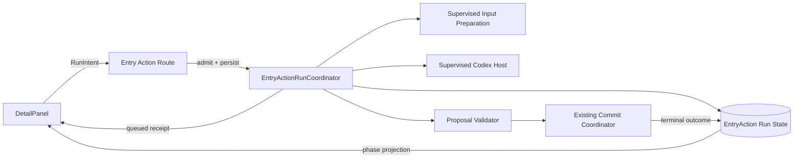
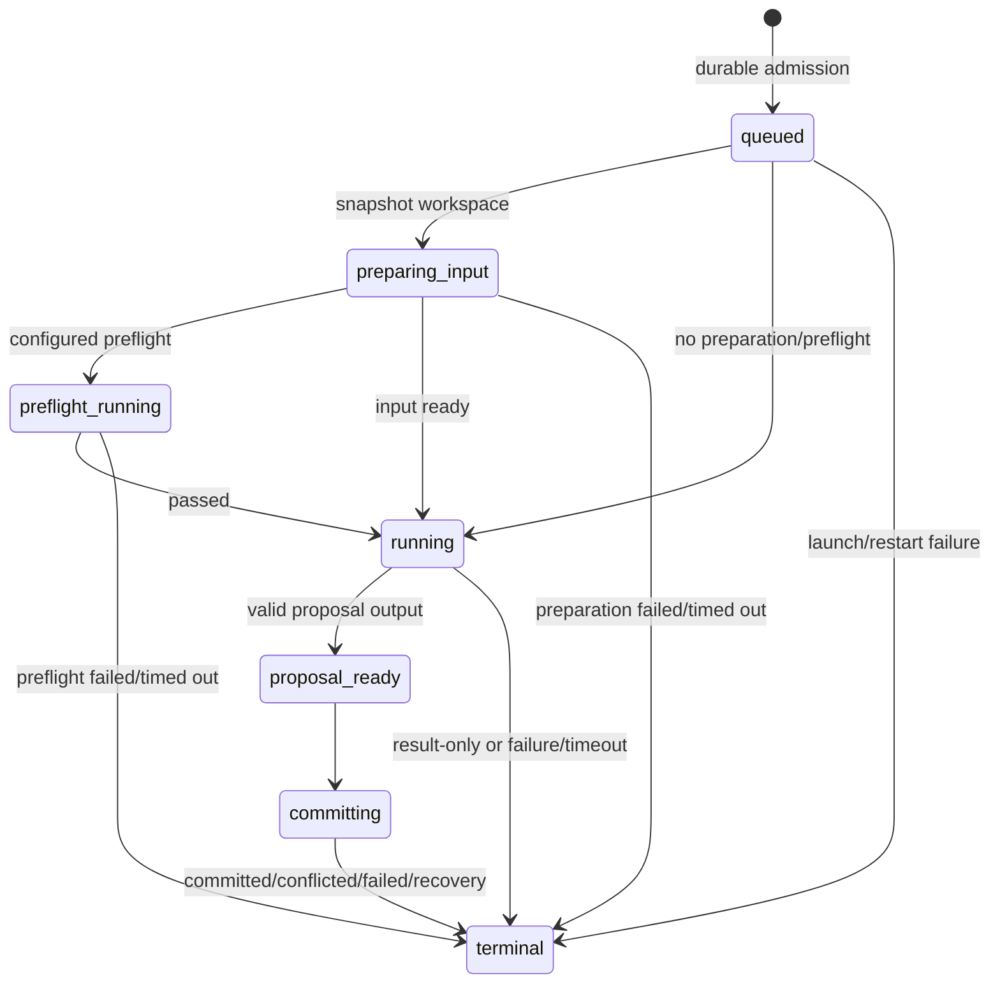

# 2026-08-26 1222 条目自动化可见生命周期与稳定提案合同

## 方案概述

### 总体目标和范围

本设计修复 Data Editor 通用 `project-skill` 条目自动化的三个同源合同断点：启动请求在准备完成前不返回、准备阶段缺少可见且可终止的超时所有权，以及 `proposal` 型 skill 没有得到可生成合法 proposal 的完整 handoff。Nocturnel 的“补全名称”只是已验证样本；Data Editor 不理解名称、技能、特质或符文等项目业务。

目标结构是：Data Editor 在轻量准入后持久化唯一 `runId` 与 `queued` 状态并立即返回；同一运行协调器在后台驱动显式输入准备、Codex 执行和既有受控提交；所有阶段可观察、必有终态，并使用启动时冻结的 skill 包与 proposal authority。

### 阶段任务概要与执行顺序

1. 先收口运行准入与 durable queued receipt，使 UI 从请求被接受时即可显示总耗时。
2. 再把输入准备纳入受监督、可超时的运行生命周期，并删除未声明输入时复制整仓的行为。
3. 然后冻结 binding/skill artifact，构建完整 proposal handoff，并让同一 `runId` 进入既有 proposal 校验与提交。
4. 最后迁移 profile、补充状态投影、失败恢复与定向运行证据。

### 整体结构框架



`EntryActionRunCoordinator` 拥有生命周期；`JobSupervisor` 只拥有被启动的进程树；既有 authority/fencing/commit coordinator 继续拥有写回安全，不由 UI、skill 或临时目录复制第二份真值。

## 问题、范围与非目标

### 已确认问题

- `/api/entry-actions/run` 对 `project-skill` 会 `await startProjectSkill(...)`，而该函数在返回前完成 snapshot 复制、可选 preflight 和 Job ownership；因此 queued 虽已落盘，HTTP receipt 尚不可见（`src/entry-action-route.mjs:76-88`、`src/project-skill-action-service.mjs:74-124`）。
- 未配置 `projectInput` 的 snapshot 默认执行 `copyProjectSnapshot(...)`，递归复制项目根；Nocturnel 的 `fill-data-name` 正是未配置 `advancedExecution.projectInput` 的 `project-skill + proposal`（`src/project-skill-action-service.mjs:96-103,215-232`；`C:/Code/Nocturnel/.data-editor/automation-profile.json:4-33`）。
- 现有 `runtime.timeoutMs` 只在 `jobSupervisor.start(...)` 后开始约束子进程，不覆盖此前的复制准备（`src/job-supervisor.mjs:161-167`）。实测 run 在 `03:44:42` queued，至 `03:50:52` 才进入 running，准备约 370 秒（`C:/Code/Nocturnel/.data-editor/runtime/entry-actions/4b7ae44e-02e5-4da7-aa3e-0083e4ccd4af.started.json:7-17`）。
- UI 只有拿到轮询结果中的 `startedAt` 才显示时长；初始发起状态未设置 `startedAt`，而 HTTP 又被准备阻塞，所以准备期间没有时间显示（`src/App.tsx:4129-4134,4167-4205,4337-4345`；`src/detail/DetailPanel.tsx:329-339,532-543`）。
- project-skill handoff 把 `row`、邻居与计数固定为 `null`，也没有 `proposalContract`；prompt 只附 loose request。Nocturnel skill 明确要求完整 handoff 与 `proposalContract.version=3`，实测最终因非法 proposal 合同失败（`src/project-skill-action-service.mjs:59-73,114-123,194-203`；`C:/Code/Nocturnel/.agents/skills/fill-data-name/SKILL.md:22-38`；对应 result `:1-8`）。
- binding 解析发生在准备前，实际读取 `status.skillPath` 发生在准备后，存在路径/内容漂移窗口；实测 diagnostics 还显示 Codex 尝试读取已不存在的用户级 skill 路径（`src/codex-runtime.mjs:77-92,117-146`；`src/project-skill-action-service.mjs:37-39,114`；对应 diagnostics `:6-10`）。

### 范围

- 通用 `project-skill` 的 admission、状态、输入准备、binding artifact、prompt/result 与 proposal admission。
- 前端对 queued/preparing/running/committing/terminal 的只读投影。
- Nocturnel 仅作为 profile、skill 和 runtime 工件的验收 fixture。

### 非目标

- 不在 Data Editor 中实现“补全名称”业务规则。
- 不改 Nocturnel 数据、自动化配置、skill 或当前运行工件。
- 不扩大 `project-write` 权限，不绕过既有 authority、fencing、ETag、journal 与 commit coordinator。
- 本文不授权代码实施，也不设计运行历史产品页。

## 现状证据与参考资料

- 当前状态合同已有 `queued`、`preparing_input`、`preflight_running`、`running`、`review_running`、`proposal_ready`、`committing` 与 terminal outcomes，但 TypeScript API union 未包含全部准备阶段（`src/entry-action-state.mjs:1-22`；`src/api/client.ts:176-191`）。
- 运行状态持久化支持 `phaseStartedAt` 与 `phaseHistory` 的单调推进（`src/entry-actions.mjs:138-180,350-353`）。
- 既有 proposal-only 链已经能在启动前解析稳定 row、authority snapshot、文档 ETag 和 fencing lease，并构造严格 prompt（`src/entry-action-service.mjs:68-114,128-189`；`src/entry-action-proposal-prompt.mjs:1-29`）。本设计要求复用这些能力，不再让 project-skill 另造弱合同。
- 当前 project-skill 在模型输出后调用 `submitFreshEntryActionProposal(...)`，后者重新分配另一个 run 与 fencing token；这造成一次用户运行出现父运行和 admitted child run 两个身份（`src/project-skill-action-service.mjs:150-167`；`src/entry-action-service.mjs:244-307`）。
- 当前 Truth 已明确 profile + machine-local binding 是配置真值，skill 合法性应复用 `resolveCodexSkill(...)` / `resolveCodexBindingStatus(...)`，运行结果不能由配置 ready 状态推断（`.claw/truth/automation-settings-skill-truth-chain-and-save-boundary.md`；`.claw/truth/entry-actions-v2-personal-automation-direction.md`）。
- `.claw/project.json:28` 明确 `gitnexus: false`；本设计按技能约定改用 `claw search` 与 `rg`/定向精读建立证据链。
- `docs/09_Codex自动化机制.md:7-10` 仍声称生产入口固定 503，与当前 route 的 project-skill 分支不一致；实施切片需同步修正文档，但本文不改写该 authority。

## 领域模型、术语、不变量与唯一 owner

### 术语

- **RunIntent**：用户对某一 `projectId + actionId + sourcePath + collectionPath + rowId + expectedRowDigest` 的一次请求。
- **RunDefinition**：准入时冻结的规则、目标、row、authority、runtime、skill artifact 与 project input 描述。
- **QueuedReceipt**：持久化成功后立即返回的 `{ runId, phase: "queued", acceptedAt }`。
- **SkillArtifact**：启动时解析并冻结的 skill 包快照，至少含 logical name、原始 resolved path、内容摘要和可供执行的 staged root。
- **ProjectInput**：skill 除 handoff 外额外需要读取的、显式声明的项目相对路径集合。
- **RunState**：同一 `runId` 的单调 phase/outcome 记录。

### 唯一 owner

| 事实 | 唯一 owner | 其他参与者 |
|---|---|---|
| action 生命周期与 terminal 发布 | `EntryActionRunCoordinator`（从现有 project-skill service 演进） | route/UI 只发意图和读投影 |
| phase/outcome 持久化格式 | `entry-action-state` + `entry-actions` state store | worker 只回报事件，不直接另写业务状态 |
| 子进程树、超时终止证据 | `JobSupervisor` | coordinator 发起/终止 |
| 规则与设备绑定 | automation profile / machine-local bindings | RunDefinition 只冻结一次快照 |
| proposal 写权限与提交 | 既有 authority/fencing/commit coordinator | skill 只能提出候选 |
| canonical row | Document service/源文档 | handoff 是该 run 的只读快照 |

### 不变量

1. 一次点击只有一个 `runId`；准入、准备、模型输出、proposal 校验、commit 与 terminal 不得再生 child run。
2. `POST /run` 只有在 RunDefinition 与 queued state 持久化成功后返回；返回后该 run 必须最终进入可信 terminal，即使准备、服务重启或 Codex 失败。
3. `runtime.timeoutMs` 不再掩盖准备无界：准备有独立平台超时，Codex 有执行超时；任一超时都必须终止其受监督进程并发布阶段明确的 outcome。
4. snapshot 模式不存在“未声明输入即复制整仓”的 fallback。
5. `projectInput` 不承载当前 row、proposal authority 或 skill；这三者由 handoff/SkillArtifact 独立提供。
6. skill 路径或内容在 receipt 后变化，不改变当前 RunDefinition；下一次 run 才重新解析。
7. UI 时钟以 `acceptedAt` 为总耗时起点，phase 时长以 `phaseStartedAt` 为起点；UI 不创造第二份时间真值。

## 技术决策及原因

### 决策 1：轻量准入后立即返回 durable queued receipt

route 只等待规则/目标/binding/row/authority/skill artifact 校验及 handoff + queued state 落盘，随后立即返回 `status: "queued"`、`runId`、`acceptedAt`。准备与执行放入 coordinator 的后台 completion。

原因：用户在第一秒就获得可轮询身份和总计时起点；同步拒绝仍只用于尚未创建 run 的准入错误。

### 决策 2：准备工作必须成为受监督阶段

输入复制移出 HTTP 主路径，并由 JobSupervisor 可终止地执行；建议平台默认 `preparationTimeoutMs=60_000`，不进入项目业务 profile。超时发布 `terminal/preparation_timed_out`，复制失败发布 `terminal/failed` 且携带 `failedPhase: "preparing_input"`。服务关闭/重启时，无 live ownership 且尚未进入 commit 的 active run 可安全收敛为 failed；commit 阶段继续沿用既有 recovery。

原因：Node 进程内递归 `cp` 没有当前项目所需的可证明终止所有权；监督 worker 可以复用现有 Windows Job 树证据。

### 决策 3：取消整仓隐式 snapshot，ProjectInput 仅代表额外资料

- `workspaceMode: "snapshot"` + 无 `projectInput`：创建空的隔离工作区，只写入平台生成的 handoff/output 与 staged SkillArtifact。
- 有 `projectInput.paths`：只复制列出的项目内文件/目录，维持路径逃逸、symlink/junction fail-closed。
- 当前目标 row、authority contract 与 skill 内容不要求出现在 `projectInput`；需要读取整个源文件时必须显式列出。
- `project-write` 仍使用真实项目根且禁止 `projectInput`，不借本修复扩权。

原因：最小输入直接消除 Nocturnel 大仓准备长尾，也把数据可见范围从偶然实现变为可审计合同。

### 决策 4：准入时冻结完整 SkillArtifact

binding 仍保存 logical skill 名称并沿用既有解析顺序；准入阶段读取完整 skill 包（`SKILL.md` 及其声明/引用的包内资源）、拒绝逃逸链接，计算 digest，并 stage 到该 run 的私有只读目录。prompt 引用 staged artifact 与 digest，不在 Codex 运行时重新解析用户或项目原路径。

原因：消除解析与读取之间的 TOCTOU，也让引用脚本/模板的 skill 不因只内嵌 `SKILL.md` 而变成半包。当前证据不能证明 Codex 为什么选择了用户级失效路径；该机制直接消除这类路径依赖。此根因细节标记为 **insufficient-evidence**，不影响架构选择。

### 决策 5：project-skill proposal 复用完整 authority handoff 与同 run 提交

抽取既有 proposal-only 链的 RunDefinition/authority 构建能力。`project-skill + proposal` 在 Codex 启动前即拥有 version 3 handoff：完整目标 row、canonical identity、ETag、rule/contract digest、writable fields、fencing token 与 text artifact policy。输出使用判别联合：

- 有写回：严格 `entry-action-proposal` v3，至少一个真实 change；
- 合法无变更/证据不足：`project-skill-result` + `resultOnly: true`，映射 `completed_without_changes`；
- `candidate-create`：仅当规则已有 createAuthority 时允许，继续走其既有严格 manifest admission。

模型返回后，同一 coordinator 将 phase 推进到 `proposal_ready -> committing`，在同一 run/lease 上调用既有 commit；不再调用会新建 run 的 `submitFreshEntryActionProposal(...)`。

原因：skill 的输出必须在生成前知道其 authority，不能在生成后重新绑定到另一身份；这也是“补全名称”当前失败的直接合同修复。

## 协作合同：入口、状态变化、事件或投影、失败与重试语义

### 入口与 receipt

```json
{
  "ok": true,
  "status": "queued",
  "runId": "uuid",
  "phase": "queued",
  "acceptedAt": "ISO-8601",
  "resultPolicy": "proposal"
}
```

同一个客户端 `idempotencyKey` 重试必须返回原 run receipt，不得创建第二个 run；准入前失败返回稳定 4xx/409 且不产生 run。

### 状态机



建议统一使用 `running` 表示 Codex host；若保留现有 `review_running`，API/前端 union 必须完整声明，不能让同义 phase 分叉。迁移时选择其一并清理另一项，不长期兼容双名。

### UI 投影

- receipt 到达即显示“已排队”与从 `acceptedAt` 计算的总耗时。
- 轮询显示当前 phase 的通用中文标签：准备资料、运行前检查、执行中、校验结果、提交中。
- 观察超时仍只是页面停止观察，不是 runner terminal；沿用 `entry-action-result-wait.ts` 的分离语义。
- terminal 显示 outcome 与 `failedPhase`；Nocturnel 文案不进入通用映射。

### 失败与重试

- 准入失败：无 run，可在修复配置后重试。
- 准入后失败：必须有 terminal；相同 idempotencyKey 只回放原结果。
- preparation/Codex 超时：JobSupervisor 终止整个阶段进程树，完成终止证据后才发布 terminal；scratch 可清理，canonical 文档不变。
- proposal 校验失败：terminal failed，保留 reply/diagnostics；不得尝试宽松修复模型输出。
- commit 冲突：terminal conflicted；新尝试必须新 idempotencyKey、新 authority snapshot。
- committing 中断：复用现有 journal/recovery；不能简单标 failed 并释放 fencing。

## 备选方案、取舍与重新评估条件

### 方案 A：仅让前端在点击时自行开始计时

拒绝。它能遮住“没有时间”表象，但 HTTP 仍阻塞、准备仍无超时、刷新后时间丢失，也无法解释后台真实 phase。

### 方案 B：保留整仓复制，只把 `/run` 改成异步

拒绝。可见性改善但资源成本、超时与不必要数据暴露仍存在；大仓只会从不可见卡顿变为可见卡顿。

### 方案 C：继续先让 skill 产出 loose changes，再由 fresh admission 绑定新 run

拒绝。模型无法在生成时遵守 writable fields/before/ETag/fencing，且父子 run 破坏唯一身份、幂等与诊断。

### 方案 D：把整个项目复制逻辑留在服务进程，用 AbortController 包裹

暂不采用。当前 `fs.cp` 链没有项目需要的可证明进程树终止证据；若未来 Node 提供并经 Windows 真实验证证明递归复制可可靠中止，可重新评估以减少 worker 进程成本。

### 重新评估条件

- 若真实用例普遍需要接近全仓的只读上下文，应重新评估内容寻址缓存或 VFS，不恢复隐式整仓复制。
- 若 Codex 提供正式、可固定 digest 的 skill package API，可替换 staged SkillArtifact，但必须保持 receipt 后内容不漂移。

## 实施切片、迁移或兼容边界、验证证据

### 切片 1：receipt 与状态投影

- 抽取 RunDefinition admission；持久化 queued 后立即返回。
- API 类型补齐所有 active phase、`acceptedAt/phaseStartedAt/phaseHistory/failedPhase` 与 preparation timeout outcome。
- UI receipt 即计时并按 phase 展示。
- 验证：人为阻塞 preparation 时，`POST /run` 仍在短时限内返回 queued，页面从 0 秒开始增长并显示 preparing_input。

### 切片 2：最小输入与受监督准备

- 新增通用 preparation worker；删除 `copyProjectSnapshot` fallback。
- `projectInput` 仅复制显式路径，空配置生成空 snapshot。
- 迁移 Automation Settings：不再强制目标文件属于 projectInput；现有声明路径保留为显式额外输入，不做隐藏扩张。
- 验证：空输入不复制仓库 sentinel；显式文件/目录复制成功；逃逸与链接拒绝；超时终止 worker 且 terminal 为 preparation_timed_out。

### 切片 3：SkillArtifact 与统一 proposal run

- admission 冻结 skill 包/digest；prompt 只使用 staged artifact。
- 复用 proposal authority builder 和 commit path，删除 project-skill 调用 fresh child admission 的路径。
- 验证：receipt 后删除/修改原 skill 不影响当前 run、影响下一 run；失效外部路径不被 Codex 读取；proposal 的 runId/ETag/digest/token 与 handoff 完全一致；无变更走 result-only；非法/额外键 fail closed。

### 切片 4：恢复、文档与真实样本

- 服务启动 reconcile queued/preparing/running 的 ownership；pre-commit 无 live owner 收敛 failed，committing 走既有 recovery。
- 更新过时的 `docs/09_Codex自动化机制.md` 与对应 current Truth，避免 503 旧说明继续误导。
- 先用中性 fixture 做自动测试，再以 Nocturnel “补全名称”进行只读准备证据与受控 proposal 写回验收；不能把项目样本写成产品分支。

### 完成证据门

1. 单元/服务测试证明 queued receipt 不等待 preparation。
2. Windows Job 证据证明 preparation 与 Codex timeout 后进程树退出，且不会迟到写入。
3. 状态测试证明 phase 单调、terminal 幂等、观察超时不冒充 runner 超时。
4. proposal 测试证明同一 run 从 handoff 到 commit，不生成 admitted child run。
5. Browser 真实窗口证明准备阶段名称与总耗时立即可见，终态能完成或给出明确失败阶段。
6. scoped Git 审计证明没有 Nocturnel 专属业务进入 Data Editor 生产代码。

## 开放决策与证据不足

- **status: ready**。
- 无需用户先行决定的高影响开放项；上述方案已给出最小实现边界。
- **insufficient-evidence**：现有 diagnostics 能证明 Codex 读取了失效的用户级 skill 路径，但不能仅凭当前工件确定该路径来自 Codex 的哪一层 catalog/cache。实现时必须用 staged artifact 的真实 CLI 回归证明路径依赖已消除，而不是把推测写成根因。
