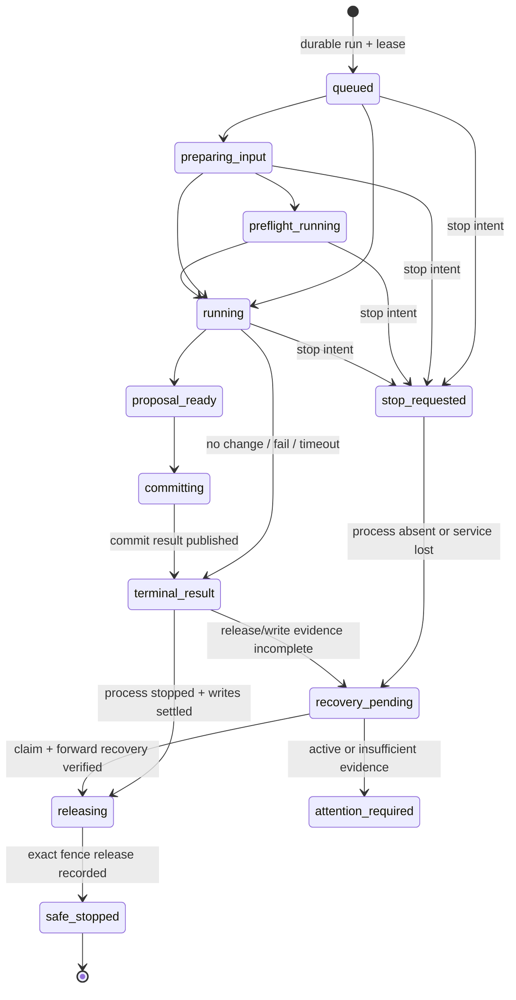

# 2026-08-26 15:10 条目自动化停止判定与保存恢复

## 方案概述

### 总体目标和范围

本方案解决 Data Editor 中两个相互放大的故障：条目自动化在服务、准备器、前置检查或 Codex 执行器中断后，可能长期留下非终态运行记录，使对应物理文件的普通保存持续被拒绝；服务重启过程中，前端又可能把恢复候选的竞态失败显示成“服务已断开 / All promises were rejected”，即使新的主服务已经健康。

目标不是放宽锁，而是建立一条可证明的安全收敛链：

1. 把“自动化执行结果已终态”和“该文件已可普通保存”拆成两个明确事实。
2. 只有精确进程树已停止、持久写入已收敛、对应 fencing ownership 已释放或完成恢复记录时，才认定自动化**已安全停止**。
3. 服务重启后自动检查可恢复运行；证据不足时继续 fail-closed，并向用户解释阻塞原因与可执行操作，不伪造成功或提供强制解锁。
4. 服务恢复以新主服务的健康与实例身份作为成功证据，不以某个启动请求先返回或多个 Promise 的聚合结果作为真相。

范围覆盖文件级自动化停止判定、Job ownership、fencing/recovery、group/child journal、普通 `/api/save` 准入、结果与文件占用投影、用户停止/恢复操作、主服务重启竞态、旧运行工件迁移和 Windows 真实运行验收。Data Editor 只实现通用协议，不理解任何具体项目的业务字段、Skill 语义或内容类型。

### 各阶段任务概要与执行顺序

1. **冻结停止与保存合同**：先建立 `SafeStopped` 判定和文件级 guard 投影，修复“只凭非终态工件锁文件”和“terminal 即可保存”的双向误判。
2. **统一执行 ownership**：让所有 file-scoped entry action，包括 `project-skill` 的输入准备、preflight、Codex host 与 proposal commit，共用同一个 `runId`、canonical file identity、fencing lease 和可验证 Job 进程证据。
3. **接入恢复与操作**：在启动恢复、用户“停止自动化”和“尝试安全恢复”中复用既有 claim-first recovery，不新增绕过证据的释放路径。
4. **修复服务恢复竞态**：用 service instance identity 与健康轮询替代 `Promise.any` 竞速，把启动请求错误和最终健康结论分开。
5. **迁移与验收**：只自动迁移证据完整的旧运行；证据不足的旧占用保持可诊断阻塞。通过通用 fixture、Windows 真实进程中断、真实浏览器和双健康端点完成验收。

### 整体结构框架

```mermaid
flowchart LR
    UI[App / DetailPanel] -->|RunIntent / StopIntent / RecoverIntent| API[Entry Action API]
    API --> Run[Run lifecycle owner]
    Run --> Job[JobSupervisor]
    Run --> Fence[Fencing allocator]
    Run --> Journal[Commit journals]
    Job --> Process[Preparation / Preflight / Codex process tree]
    Fence --> Recovery[Entry action recovery]
    Journal --> Recovery
    Recovery --> Guard[FileGuard read model]
    Run --> Guard
    Job --> Guard
    Guard -->|allow / block + reason| Save[/api/save under document commit mutex]
    Guard -->|status projection| UI
    Bridge[Recovery bridge] --> Service[Main service instance]
    Service --> Startup[Bounded startup reconciliation]
    Startup --> Recovery
    Service -->|health + instanceId + recovery summary| UI
```

`Run lifecycle owner` 负责运行状态；`JobSupervisor` 负责进程树；`fencing-lock` 负责文件级写入资格；journal 负责持久写入收敛；`FileGuard` 只是把这些 owner 的只读证据组合成保存准入结论。UI、started/result 工件、heartbeat 和 recovery bridge 均不得单独成为“已停止”真相。

## 问题、范围与非目标

### 当前问题

1. `server.mjs::handleSave(...)` 在 document commit mutex 内调用 `findActiveEntryActionRuns(...)`；只要后者返回任一非终态 run，就返回 `DOCUMENT_SAVE_ENTRY_ACTION_ACTIVE`（`server.mjs:342-361`）。
2. `findActiveEntryActionRuns(...)` 以 handoff 列表为起点，result 读失败后回退 started，再失败则默认 `phase: "running"`；遍历中的解析和读取异常又被空 `catch` 吞掉（`src/entry-actions.mjs:259-277`）。这会把“状态缺失/损坏/旧协议”混为运行中，也没有给恢复流程机会。
3. `handleLoadEntryActionResult(...)` 同样吞掉 result/started 读取错误，最后仅凭 handoff 存在返回 legacy `{ status: "started" }`（`server.mjs:753-771`）。这与当前 `phase/outcome` 严格合同冲突，也会让前端持续看到伪运行态。
4. `isTerminalEntryActionState(...)` 把 `failed_needs_recovery` 纳入终态（`src/entry-action-state.mjs:2-17`）；proposal commit 也会在 fencing release 之前发布 terminal result（`src/entry-action-service.mjs:435-480,544-585`）。因此“有 terminal result”既不能证明进程已停止，也不能证明文件占用已释放。
5. proposal-only 路径已持久化 helper/child PID + FILETIME，并通过 fencing lease 管理 ownership（`src/entry-action-service.mjs:111-210`；`src/fencing-lock.mjs:167-240`）；但 `project-skill` 当前先写 queued/started，再分别启动准备器与 Codex，未为整条 file-scoped lifecycle 建立同一个持久 fencing ownership（`src/project-skill-action-service.mjs:29-113,116-244`）。服务在这些阶段中断时，非终态记录缺少足够的自动恢复证据。
6. `runPreflightProcess(...)` 仍使用普通 `spawn` 与 `child.kill()`，不复用 Windows Job ownership（`src/project-skill-action-service.mjs:277-301`）。它不能提供与 Codex host 相同的子孙进程停止证明。
7. 服务端只在进程内 `activeEntryActionCompletions` 保存 completion Promise；重启后该 Map 为空，`ensureInitialProject()` 当前恢复 identity promotion，但没有统一扫描 entry-action runtime、process evidence、journal 与 fencing claim（`server.mjs:80-142,235-263`）。现有 `scripts/entry-action-recover.mjs` 已具备精确 run recovery，但尚未成为启动或 UI 操作合同。
8. 前端 `recoverEditorService(...)` 将 `reopenEditor(...)` 和健康等待放入 `Promise.any(...)`，再与总超时 `Promise.race(...)` 竞速（`src/App.tsx:1440-1477`）。所有候选拒绝时，JavaScript 的 AggregateError 文案会直接成为 “All promises were rejected”；同时“reopen 请求返回”也可能早于或晚于主服务健康，旧异步失败还可能覆盖较新的成功状态。
9. recovery bridge 的 `/reopen` 只返回 start 请求结果；主服务 `/api/health` 只返回 `ok + bridgePort`，没有 service instance identity 或 startup recovery 摘要（`recovery-bridge.mjs:94-169`；`server.mjs:192`）。显式重启无法证明响应来自新实例。

### 范围

- file-scoped entry action 的执行、停止、恢复和保存占用合同。
- proposal、project-skill、输入准备、preflight、Codex host 与提交阶段的统一 ownership。
- `phase/outcome`、fencing/recovery、commit/group journal 的证据组合。
- `/api/save`、entry-action 状态/停止/恢复 API、前端自动保存和详情状态卡片。
- 主服务/recovery bridge 的重启与健康确认。
- v2/v3 运行工件向新合同的迁移边界，以及测试、Windows 进程与真实浏览器验收。

### 非目标

- 不允许 Codex 或 Skill 直接写 canonical 数据以绕过 proposal/commit owner。
- 不放宽 authority、ETag、row identity、document contract、fencing 或 journal 门禁。
- 不提供“忽略证据”“强制解锁”“按超时删除锁”按钮。
- 不把 heartbeat 新鲜度、PID 存在、UI 计时结束、HTTP 观察超时或 terminal outcome 单独当作已停止证据。
- 不为 Nocturnel 或其他项目加入专属状态、文案、字段、路径或恢复分支。
- 不借此重做通用任务队列、分布式锁或跨机器执行框架。
- 本文不授权运行时代码实施。

## 现状证据与参考资料

### 当前项目事实

- Current Truth 已规定：proposal-only 的 supervisor、fencing、结果发布和重启恢复属于同一生产编排；未知、损坏或证据不足必须 fail-closed（`.claw/truth/entry-actions-legacy-protocol-hard-disable-and-preenable-fencing-recovery.md:57-86`）。
- Accepted ADR 明确禁止恢复 legacy direct-write，Data Editor 只拥有通用 proposal、policy、authority、supervisor、commit 与 recovery 机制（`.claw/truth/adr/entry-actions-legacy-direct-write-hard-disable.md:10-35,55-66`）。
- 当前 fencing 已有单调 token、不可变 owner/evidence、claim-first quarantine 与 compare-and-release 基础；只有 `evidence_persisted` owner 可正常 release（`src/fencing-lock.mjs:56-121,167-240`）。
- recovery inspector 已能按精确 helper/child PID + creation FILETIME 区分 `active / releasable / insufficient`，不确定时保留锁（`src/entry-action-recovery.mjs:70-90,116-131`）。
- recovery CLI 已在 claim 后先恢复 durable operation/group commit，再释放 admission、写 immutable completed recovery record，必要时发布 interrupted/failed terminal（`scripts/entry-action-recover.mjs:19-103`）。
- group commit 的 journal 已能依据 source/artifact 的 before/after digest 前向收敛；任何不属于允许状态的组合进入 `ENTRY_ACTION_GROUP_FAILED_NEEDS_RECOVERY`（`src/entry-action-group-commit.mjs:171-278,325-381`）。
- JobSupervisor 的 shutdown 会尝试终止所有 active records 并等待 bounded completion；进程 identity 与 Job helper ownership 已是可复用基础（`src/job-supervisor.mjs:348-510`）。
- 文件级 active 查询已使用 `canonicalFileKey`，这是正确的物理文件身份入口，但目前分类依据不足（`src/entry-actions.mjs:259-277`；`tests/entry-actions.test.mjs:43-60`）。
- 服务恢复已有主服务 PID/命令行 identity 与 recovery bridge controller；`startMainService(...)` 会等待端口和进程身份（`service-lifecycle.mjs:19-84,157-269`），但尚未验证主服务业务 readiness 或新实例身份。
- 产品文档已承诺主服务故障后由 recovery bridge 尝试恢复，并在未保存改动存在时进入保护状态（`docs/07_校验与保存机制.md:94-107`）。

### 证据边界

- `.claw/project.json` 当前配置 `gitnexus: false`，本次依技能约定使用 `claw search` 与 `rg`/定向精读，而非声称存在可用 GitNexus 索引。
- 工作树中的 `server.mjs`、`src/App.tsx`、`src/api/client.ts`、entry-action service 与测试当前已有未提交改动；本文锚点按 2026-08-26 当前工作树记录。实施前必须重新取得 scoped diff 与 owner handoff，不得覆盖或混入这些改动。
- `docs/09_Codex自动化机制.md:7-18` 仍描述入口固定 503，与 current Truth/当前路由不一致；它只能作为待迁移文档，不能覆盖已验证当前代码事实。
- 旧方案曾建议推理期间允许普通保存并让 proposal 以 ETag 冲突退出（`docs/plans/2026-07-26-条目自动化并发错写与超时诊断修复方案.md:245-270`）；当前实现已选择运行期间阻止普通保存。本方案保留当前产品行为，只修复停止后无法安全恢复保存的问题。

## 领域模型、术语、不变量与唯一 owner

### 术语

- **RunState**：某个 `runId` 的 `phase/outcome` 执行结果事实。`terminal` 只表示运行结果不再继续推进，不自动表示文件已可写。
- **ExecutionOwnership**：JobSupervisor 对 helper/child 进程树的精确身份与停止证据。
- **WriteOwnership**：某个 `canonicalFileKey` 当前 fencing admission 的 exact lease：`runId + ownerToken + ownerHash + jobInstanceId + fencingToken`。
- **WriteSettlement**：该 run 所有关联 child/group journal 已处于可证明的未写入或完成状态；半提交必须先前向恢复并验证。
- **AdmissionReceipt**：将 `runId`、canonical/source identity 与 admission 准备事实绑定的不可变凭证；它只推进一次：`prepared → admitted | aborted_before_start`，不拆成第二套 pre-run/abort 状态机。
- **RecoveryClaim**：把 fixed admission 原子 rename 到唯一 quarantine 后形成的独占恢复资格。
- **SafeStopped**：`ExecutionStopped && WriteSettled && FenceReleased && TerminalRecorded`。这是“自动化已停止、文件可普通保存”的唯一产品含义。
- **FileGuard**：按 `canonicalFileKey` 组合上述 owner 的只读投影，输出 `allow_save` 或稳定阻塞原因；它不修改 owner 状态。
- **ServiceInstanceId**：每个主服务进程启动时生成的不可复用 UUID，用于区分旧服务、恢复中的端口响应和新健康实例。

### 唯一 owner

| 事实 | 唯一 owner | 非 owner 的职责 |
|---|---|---|
| `phase/outcome` 与 terminal receipt | `src/entry-action-state.mjs` + `src/entry-actions.mjs` | UI/API 只投影；fencing 不伪造业务 outcome |
| helper/child 生命周期与精确身份 | `src/job-supervisor.mjs` | run service 只发 start/terminate intent |
| 文件级长期写入资格 | `src/fencing-lock.mjs` | FileGuard 只读；普通保存不得删除 admission |
| recovery claim、进程核验与 release record | `src/entry-action-recovery.mjs` | CLI、startup、HTTP 都调用同一函数 |
| canonical 写入及崩溃收敛 | document commit coordinator + child/group journal | Skill/UI 不直接写 canonical 文件 |
| 普通保存准入 | `/api/save` 的 server-side FileGuard | 前端按钮禁用仅作体验优化 |
| 文件占用状态 | `FileGuard` 只读投影 | started/result 不是第二个占用真相 |
| 服务恢复成功 | 主服务 `/api/health` 的当前 `ServiceInstanceId` + readiness | bridge 的 `/reopen` 只是启动意图/诊断 |

### 不变量

1. `phase: terminal` 不等于 `SafeStopped`；`failed_needs_recovery` 必须继续阻止同文件普通保存与新自动化。
2. 只有 exact lease 的正常 owner 或 exact RecoveryClaim 可以释放 admission；没有按时间、heartbeat 或 UI 操作删除锁的路径。
3. 每个 file-scoped action 必须先写 durable AdmissionReceipt，再取得或公布 fencing admission；若服务在 queued/handoff 前中断，只有该 receipt 能把 lease、run 与源文件精确关联。未启动外部进程的 run 只能由启动恢复将同一 receipt 推进为 `aborted_before_start` 后释放。
4. 一个用户运行从 admission 到 preparation、preflight、Codex、proposal commit 和 recovery 只使用一个 `runId` 与一个 file lease；不得生成不可见 child run 或在 commit 时换 fencing token。
5. 普通保存与 automation commit 仍复用同一个 document commit mutex；FileGuard 必须在 mutex 内重算，不能依赖 mutex 外缓存。
6. FileGuard 读取损坏、ownership 不一致、claim 状态未知或 journal 不能证明收敛时返回阻塞，不吞错、不默认 `running`、不默认 `released`。
7. 用户“停止自动化”只创建 termination intent；在 `SafeStopped` 前，UI 只能显示“正在停止/正在恢复”，不能显示“已停止”。
8. 服务 restart/reopen 请求成功不是服务恢复成功；只有主服务 health 校验通过并满足实例条件才可切回 running 或 reload。
9. 旧异步恢复尝试不得覆盖新尝试的成功状态；每个前端恢复 attempt 必须有单调 attempt id 或 AbortController。
10. 自动化恢复 attention 不应让整个 Data Editor 假装不健康；健康响应必须显式携带 `automationRecovery` 摘要，使未受影响文件仍可工作，受影响文件继续 fail-closed。`ok:true` 表示 reconciliation 已结束（结果为 ready 或 attention），不表示全部 run 都已解除占用。

## 技术决策及每项决策的原因

### 决策 1：保留 RunState，新增 FileGuard 只读组合，不扩张 terminal 语义

`entry-action-state` 继续拥有 phase/outcome。新增窄模块（建议 `src/entry-action-file-guard.mjs`）按 canonical file identity 读取 run、fencing admission/claim/recovery record、owned process evidence 与 commit/group journal，输出：

- `executing`：exact process identity 仍 active；阻止保存。
- `stop_requested`：termination 已请求但进程/Job completion 尚未证明；阻止保存。
- `recovering`：已 claim 或 journal 正在前向恢复；阻止保存。
- `attention_required`：证据损坏、不足或不一致；阻止保存。
- `safe_stopped`：满足四项停止证明；允许保存。
- `idle`：该 canonical file key 没有当前 admission/claim；允许保存。

原因：修改 `terminal` 以同时表达执行结果和资源释放会破坏既有结果查询、幂等发布和历史状态。只读组合能复用现有 owner，且把用户真正关心的“能否保存”变成明确合同。

### 决策 2：SafeStopped 使用四项合取证明

```text
SafeStopped(run) =
  TerminalRecorded(run)
  AND ExecutionStopped(run)
  AND WriteSettled(run)
  AND FenceReleased(run)
```

- `TerminalRecorded`：存在合法 `phase: terminal + allowed outcome`；中断恢复可在完成其他证据后幂等发布 `failed`。
- `ExecutionStopped`：Job completion 明确结束，或 recovery inspector 用 helper/child PID + creation FILETIME 精确证明均 absent；never-started 分支必须有 durable launching abort 证据。
- `WriteSettled`：没有写入 intent，或 child/group journal 已 verified/result_published；partial commit 必须先恢复到可证明状态。
- `FenceReleased`：normal compare-and-release 后 fixed admission 不存在且不存在 recovery claim，或 exact immutable completed recovery record 证明 claim release 完成。

原因：任何单项都不足。进程退出不证明半提交已收敛；terminal 不证明 release；admission 暂时不存在也可能是 claim-first rename 的中间态；heartbeat 过期更不能证明进程死亡。

### 决策 3：所有 file-scoped project-skill 阶段复用现有 JobSupervisor 与同一 fencing lease

在 `startProjectSkillEntryAction(...)` admission 前生成 `runId` 并持久写入 AdmissionReceipt（包含 canonical file identity、source identity 与预定 `jobInstanceId`）。随后分配 lease，并将 receipt 推进为 `admitted`、与 lease、handoff 和 queued state 原子绑定；如果在 handoff 前崩溃，启动恢复只在 receipt 证明未启动外部 host 时推进为 `aborted_before_start`、释放 exact admission。输入准备、preflight 和 Codex host 均通过 JobSupervisor 启动；preflight 删除普通 `spawn + child.kill` 路径。proposal 提交接收原 lease，不在 `submitFreshEntryActionProposal(...)` 中再次分配。

每个阶段可以有不同 `jobInstanceId` 证据，但它们必须归属于同一 run lease。阶段 evidence 为 append-only receipt：每条包含 stage、helper/child exact identity、started/completed 事实与前一 receipt digest；读取时仅最后一个已开始且未完成的阶段可被视为 active，所有早期阶段必须已有 completion evidence。切换阶段时先持久前一阶段 completion，再原子写下一阶段 start。若读取到缺序、双 active 或 identity 不一致，FileGuard 返回 `attention_required`，不猜测当前进程。

原因：当前 proposal-only 已具备安全基础，project-skill 不应另造弱生命周期。统一后服务中断可从相同证据判断准备器、preflight 或 Codex 是否还活着，也避免同一 run 在 commit 时换 token。

### 决策 4：恢复只复用 claim-first 单轨流程

把 `scripts/entry-action-recover.mjs` 中的编排抽到可复用应用函数，CLI、startup reconciliation 与 HTTP recover API 都调用它：

1. 精确 inspect run/lease/process evidence。
2. `active`：保持锁并返回 `ENTRY_ACTION_PROCESS_ACTIVE`。
3. `insufficient/error`：保持锁并返回稳定 reason code。
4. `releasable`：先 claim fixed admission；claim 后再次 inspect。
5. 无论 terminal result 是否已存在，都根据 journal/operation 恢复或证明零写入；terminal 只决定是否补发 receipt，绝不能短路 WriteSettlement。
6. 证明进程 absent、写入 settled 后释放 claimed admission。
7. 写 exact immutable completed recovery record，finalize claim，幂等发布 interrupted terminal（如尚无 terminal）。

原因：现有 claim-first 防止新 owner 与恢复器并发。另开“UI 解锁”或“启动时删锁”会绕过已验证的 owner 比较和 journal 恢复。

### 决策 5：普通保存以 FileGuard 为准，并在 document commit mutex 内二次确认

`handleSave(...)` 不再先调用仅按状态工件扫描的 `findActiveEntryActionRuns(...)`。改为：

1. 进入现有 document commit mutex。
2. 解析当前 canonical file identity。
3. 调用 FileGuard，读取当前 admission/claim/recovery/journal/process 状态。
4. `idle/safe_stopped` 才继续既有 ETag、document contract、journal 与 atomic write。
5. 其他状态返回稳定 409 code 与结构化 details；不进入正式写入。

建议错误码：

- `DOCUMENT_SAVE_ENTRY_ACTION_ACTIVE`
- `DOCUMENT_SAVE_ENTRY_ACTION_STOPPING`
- `DOCUMENT_SAVE_ENTRY_ACTION_RECOVERY_PENDING`
- `DOCUMENT_SAVE_ENTRY_ACTION_EVIDENCE_INSUFFICIENT`

前端 autosave 遇到这些代码时保留 dirty 数据并进入 `paused_by_automation`，而不是不断重试或把它当网络断开；FileGuard 变为可保存后立即重试，仍须携带原 document ETag，若 automation 已写回则正常返回 `DOCUMENT_SAVE_ETAG_STALE` 并要求刷新/合并。

原因：这既保留当前“运行期间不普通保存”的产品语义，也消除陈旧状态工件永久锁文件的问题。mutex 内重算防止 guard 检查与正式写入之间出现竞态。

### 决策 6：提供“停止意图”和“安全恢复”，不提供“强制解锁”

- `POST /api/entry-actions/:runId/stop`：仅当当前主服务 JobSupervisor 仍拥有该 run 时请求终止；幂等返回 `stop_requested`。返回 202 不代表已停止。
- `POST /api/entry-actions/:runId/recover`：调用共享 recovery 编排；active/insufficient 只返回诊断，不释放。
- `GET /api/entry-actions/active?sourcePath=...`：演进为文件级 guard 投影，保留 `runs` 供兼容消费者使用，同时返回 `saveAdmission`、`reasonCode`、`canRequestStop`、`canAttemptRecovery`。

UI 状态文案统一为通用产品语言：

- “自动化运行中，普通保存已暂停”
- “正在停止；确认执行器退出前仍不能保存”
- “执行已结束，正在恢复写入状态”
- “证据不足，不能安全解除占用”
- “自动化已安全停止，可以保存”

用户操作只有“查看状态”“停止自动化”“尝试安全恢复”“复制诊断信息/打开本机恢复说明”。“隐藏”仅隐藏卡片，不改变 run、evidence、lock 或保存资格。

### 决策 7：主服务健康加入 ServiceInstanceId 与 startup recovery 摘要

主服务启动时生成 `serviceInstanceId`；`/api/health` 返回：

```json
{
  "ok": true,
  "serviceInstanceId": "uuid",
  "bridgePort": 8791,
  "automationRecovery": {
    "state": "ready | attention_required",
    "blockedRunCount": 0
  }
}
```

启动时对当前注册项目执行 bounded reconciliation。可安全恢复的 run 前向收敛；active/insufficient run 只记入 attention 并保持锁。扫描完成后 health 才返回 `ok:true`；attention 不把整个编辑器判死，但 FileGuard 继续限制对应文件。

`service-lifecycle.mjs::waitForServiceReady(...)` 应校验 `/api/health` 的 JSON 与 spawned PID identity，而不是只接受 `/` 端口 2xx-4xx。recovery bridge 的 `/status`/`/reopen` 只返回当前 PID 与 controller generation，作为启动诊断；`ServiceInstanceId` 只由主服务 `/api/health` 产生和消费。

原因：端口响应只能证明有 HTTP listener；新 instance identity 才能证明显式 restart 已切换进程，startup summary 则防止前端在状态恢复前开始错误判断文件占用。

### 决策 8：前端恢复改为单一有代次的确认流程

删除 `Promise.any(reopen, healthWait)`。每次恢复创建 `attemptId` 并执行：

1. 记录旧 `serviceInstanceId`；显式重启时等待旧实例不可达或确认 shutdown 完成。
2. 请求 bridge `/reopen`；保存其错误用于诊断，但不立刻判失败。
3. 轮询主服务 `/api/health`，并验证 `ok:true`；显式重启还要求 instanceId 与旧实例不同。
4. health 成功即认定恢复成功，即使 `/reopen` 响应曾丢失。
5. deadline 到期且 health 仍不成立时，返回稳定 `SERVICE_RECOVERY_FAILED`，分别展示 bridge 与 health 摘要，不暴露 AggregateError 文案。
6. 任何异步回调更新 UI 前核对当前 attemptId；旧 attempt 的迟到失败不能覆盖新成功。

若存在未保存改动，继续使用现有 `recoveredPendingReload` 保护；但进入该状态前也必须先获得健康实例证据。

原因：恢复请求与服务健康不是并列竞速的两个成功 owner。健康是唯一成功条件，bridge 只是启动入口，attempt identity 解决 stale async result 覆盖。

## 协作合同：入口、状态变化、事件或投影、失败与重试语义

### 自动化与文件占用投影

下图的 `stop_requested / recovery_pending / attention_required / safe_stopped` 是 FileGuard 的只读投影，与既有 RunState 的 `phase/outcome` 并存；它们不得持久化为第二套 RunState phase。程序合同保持最小的 `saveAdmission: allow | block + reasonCode`，这些名称只用于 UI 与诊断。



`terminal_result` 是 RunState；`safe_stopped` 是 FileGuard 结论。二者不得合并。

### FileGuard 返回合同

```json
{
  "canonicalFileKey": "sha256",
  "saveAdmission": "blocked",
  "guardState": "recovering",
  "reasonCode": "ENTRY_ACTION_RECOVERY_PENDING",
  "runs": [
    {
      "runId": "uuid",
      "actionId": "generic-action",
      "phase": "terminal",
      "outcome": "failed_needs_recovery",
      "execution": "absent",
      "writeSettlement": "pending",
      "fencing": "claimed",
      "canRequestStop": false,
      "canAttemptRecovery": true
    }
  ]
}
```

返回只包含通用字段与 reason code；具体项目不得扩展产品分支。证据读取失败应返回 `attention_required` 与最窄诊断，不回退为空数组。

### 停止与恢复语义

- StopIntent 幂等：重复请求同一 run 只返回当前 stop 状态，不重复创建进程信号或 terminal。
- 当前服务无 handle：返回 `ENTRY_ACTION_STOP_OWNER_UNAVAILABLE`，引导 inspect/recover；不得按 PID 宽泛 kill。
- Recovery active：HTTP 409/423 + `ENTRY_ACTION_PROCESS_ACTIVE`，锁保持。
- Recovery insufficient：HTTP 409/423 + 精确 reason code，锁保持。
- Recovery completed：返回 `safeStopped:true`、completed recovery receipt；重复调用回放同一 receipt。
- commit/group journal 恢复冲突：返回 `ENTRY_ACTION_GROUP_FAILED_NEEDS_RECOVERY`，保留 claim 与诊断，普通保存继续阻塞。

### 普通保存重试语义

- 自动化阻塞期间前端保留内存 draft、document ETag 与 dirty 标志；不自动刷新覆盖用户输入。
- FileGuard safe 后重试仍走原 idempotency key/请求 digest 规则。若 canonical 文档已被 automation 修改，ETag stale 是正常冲突，不把用户草稿静默覆盖或丢弃。
- 服务断开是网络恢复状态；automation guard 是业务准入状态。两类错误不得相互触发错误文案。

### 服务恢复语义

- `/reopen` 200：controller 已处理启动请求，不等于页面可 reload。
- `/api/health` `ok:true`：当前实例已完成 bounded startup reconciliation。
- 显式 restart：必须观察到不同 `serviceInstanceId`。
- 意外断开恢复：允许当前健康实例（可能是 bridge 已提前恢复）完成恢复，不强制 instance 变化。
- 超时：保留最后一次 bridge status、health error 和 old/new instance 观察，显示稳定中文摘要。

## 备选方案、取舍与重新评估条件

### 方案 A：非终态工件超过固定时间就删除或改 terminal

拒绝。时间只能说明观察变旧，不能证明进程树退出、无晚写、journal 已收敛或 lock ownership 未漂移；违反 fail-closed。

### 方案 B：只要 terminal result 存在就允许普通保存

拒绝。当前 terminal 可能早于 fencing release，`failed_needs_recovery` 也明确表示占用不能安全释放。该方案会在晚 release/恢复提交窗口引入覆盖风险。

### 方案 C：只检查 admission 目录是否存在

拒绝。claim-first 会把 fixed admission rename 到 quarantine，此时 fixed path 暂时不存在，但 recovery 尚未完成。必须同时检查 claim 与 completed record。

### 方案 D：允许用户强制解锁

拒绝。没有 exact process/write/fencing 证据时，用户确认也不能阻止旧进程晚写或半提交恢复覆盖。证据不足只能诊断、停止相关外部 owner 或离线取证后再走正式 recovery。

### 方案 E：恢复期间继续允许普通保存，最终 proposal 靠 ETag 冲突

暂不采用。它可减少锁时长，但会改变当前产品已选择的“运行期间暂停普通保存”行为，也不能处理 project-write、半提交 journal 或 release 窗口。若未来大多数自动化均为严格 snapshot/proposal-only，且产品希望并行编辑，可单独评估“读快照期间可保存、进入 committing 后阻止”的分阶段 guard；不得在本修复中隐式改变。

### 方案 F：继续使用 `Promise.any`，只自定义 AggregateError 文案

拒绝。文案替换不能解决 reopen 响应与健康真相的 owner 混乱，也不能防止旧 attempt 迟到失败覆盖新成功。

### 重新评估条件

- 如果未来 file-scoped automation 全部成为远端队列任务，需要重新定义跨进程/跨机器 lease 与 worker identity；不能直接延伸本机 PID/FILETIME。
- 如果取消 `project-write` 且所有 runner 都无法接触 canonical 项目，可评估缩短 guard 生命周期，但 commit/recovery 仍需 file guard。
- 如果需要项目级、跨文件或无 source file 的自动化，应新增明确 resource key 与事务协议，不把所有运行塞进一个虚拟文件锁。

## 实施切片、迁移或兼容边界、验证证据

### 切片 0：基线冻结与冲突检查

- 重新执行 `git status --short --branch`、scoped diff 和相关 owner handoff；当前工作树相关文件已有未提交修改，不允许覆盖。
- 冻结 current Truth、accepted ADR、run state/fencing/recovery/journal schema 与 API 测试基线。
- 验证 `gitnexus` 仍不可用时继续使用 `rg`，不阻塞实施。

完成证据：目标路径白名单、baseline diff hash、现有定向测试结果与 owner handoff receipt。

### 切片 1：FileGuard 与普通保存垂直切片

- 新增 FileGuard 只读分类，显式返回 active/stopping/recovering/attention/safe/idle。
- 让 `/api/entry-actions/active` 输出 guard projection；先将所有 result/started 解析或 I/O 异常映射为 `attention_required`，再移除空 catch 与 legacy `{status:"started"}` fallback。
- `handleSave` 在 document commit mutex 内调用 guard，返回稳定错误码/details。
- 前端 autosave 将 guard block 映射为 `paused_by_automation` 并保留 dirty draft。

完成证据：真实 active run 阻止保存；terminal 但 fence 未释放仍阻止；terminal 存在但 group journal 仍需 recovery 时仍阻止；allocate 后、queued 前崩溃可由 pre-run/abort receipt 收敛；exact normal release/recovery record 后保存开放；损坏 evidence 明确阻止且可见。

### 切片 2：project-skill 统一 ownership

- admission 前解析 canonical file identity，以单一 AdmissionReceipt 贯穿 `prepared → admitted | aborted_before_start`，并让同一 run/lease 贯穿准备、preflight、Codex 与 proposal commit。
- preparation/preflight/host 全部改用 JobSupervisor；持久化带前序 digest 的阶段化 exact process evidence、completion receipt 与唯一 active-stage 读取规则。
- 删除 project-skill commit 时 fresh lease/child run 路径；proposal handoff 与 lease identity 必须一致。
- clean shutdown 对每个 active run 请求终止，并在退出/恢复证明完成前保持 guard。

完成证据：在每个 external stage 杀主服务后，重启都能精确判断 active/absent；阶段 completion 缺失、双 active 或 PID reuse 均进入 attention；没有 runId/token 漂移；不产生晚 canonical 写入。

### 切片 3：启动恢复、停止与恢复 API

- 抽取共享 recovery application function，CLI/startup/API 复用。
- 主服务 startup 执行 bounded reconciliation；active/insufficient 进入 attention，不删除证据。
- 增加幂等 stop/recover endpoints 与 immutable recovery receipt。
- UI 状态卡片区分运行、停止中、恢复中、证据不足、安全停止。

完成证据：用户点击停止后不会立即显示已停止；只有 `SafeStopped` 才显示可保存；服务重启后 orphan 可自动恢复或明确停在 attention。

### 切片 4：服务实例健康与前端竞态修复

- 主服务 health 加 `serviceInstanceId` 与 automation recovery summary。
- bridge status/reopen 仅补充 controller generation、PID 与启动诊断；main service ready check 改为验证 `/api/health`，且 `ServiceInstanceId` 只由主服务 health 产生和消费。
- 前端以 attempt id + health polling 重写 recover/restart，删除 `Promise.any`。
- 保留 `recoveredPendingReload` 未保存改动保护。

完成证据：reopen 响应失败但主服务已健康时 UI 恢复；所有请求真正失败时显示稳定中文错误；旧 attempt 失败不覆盖新成功；显式 restart 必须看到新 instanceId。

### 切片 5：迁移与文档收敛

- 新运行协议建议升为 version 4，明确 file lease、stage process evidence 与 SafeStopped projection。
- v2/v3 合法 terminal 工件保持只读历史，不批量重写为 v4。
- 旧 nonterminal 若有完整 lease/process/journal evidence，走同一 recovery 并生成 completed receipt。
- 旧 nonterminal 缺少 exact process/lease/write evidence时标为 `ENTRY_ACTION_LEGACY_EVIDENCE_INSUFFICIENT`；若能定位 source file，则该文件继续阻塞并要求人工取证，不自动解锁。
- 未知/损坏工件不得迁移成 success/failed；保留原文件与诊断摘要。
- 同步 current Truth、accepted ADR 的后继说明、`docs/07_校验与保存机制.md` 与已过时的 `docs/09_Codex自动化机制.md`。
- 迁移不读取或写入项目专属字段；中性 fixture 是正式自动测试 authority。

完成证据：迁移幂等、重复重启结果一致、旧证据不足始终 fail-closed、历史 terminal 查询不回退 legacy started。

### 测试矩阵

| 场景 | 预期证据与结果 |
|---|---|
| queued/running + exact process active + fence owned | FileGuard=`executing`，普通保存 409，stop 可用 |
| stop 已请求但 Job completion 未确认 | FileGuard=`stop_requested`，不能显示已停止或允许保存 |
| terminal 已发布、fence 尚未 release | FileGuard 仍 blocked，覆盖 terminal/release 竞态窗口 |
| fixed admission 不存在但 recovery claim 存在 | FileGuard=`recovering`，不得误判 idle |
| admission 已分配、queued 前崩溃且 receipt 证明未启动 host | receipt 推进为 `aborted_before_start`，claim-first release，SafeStopped=true |
| process absent、无 commit intent | claim-first release，发布 interrupted terminal，SafeStopped=true |
| process absent、group journal 部分提交且 before/after 可证明 | 前向恢复至 verified/result_published 后 release |
| process absent、journal 与磁盘不属于允许状态 | attention_required，锁/claim 保留，零覆盖 |
| PID 被复用、creation FILETIME 不同 | evidence insufficient，不释放 |
| helper active、child absent或反之 | 不满足全部 absent；保持锁 |
| result/started JSON 损坏 | API 返回明确 evidence error，不吞错、不伪 running/idle |
| 同一文件大小写、斜杠或 junction alias | 相同 canonicalFileKey 与 guard |
| guard 变 safe 后普通保存使用旧 ETag | 若 automation 写回则 ETag stale；用户草稿不静默覆盖 |
| service crash 于 preparation/preflight/Codex/committing | 每个阶段均有可恢复或 attention 结论，无永久无解释 running |
| `/reopen` 响应丢失但新 `/api/health` 成功 | 前端认定恢复成功，不显示 AggregateError |
| bridge 200 但主服务 health 未 ready | 前端继续等待，deadline 后稳定失败 |
| 旧恢复 attempt 晚到失败，新 attempt 已健康 | UI 保持 running/恢复成功 |
| 显式 restart 仍命中旧 instanceId | 不宣称重启成功 |
| v3 nonterminal 无 exact ownership evidence | 不自动迁移或解锁，显示 legacy evidence insufficient |

### 自动化测试建议

- `entry-action-file-guard.test.mjs`：组合真值表、claim 中间态、corrupt evidence、terminal/release 窗口。
- 扩展 `entry-action-recovery.test.mjs`：阶段化 process evidence、PID reuse、重复 startup/API/CLI recovery 幂等。
- 扩展 `entry-actions.test.mjs`：active API 不再吞错或 fallback legacy started。
- 扩展 `project-skill-action-service.test.mjs`：同 run/lease 贯穿 preparation/preflight/host/commit，阶段中断。
- 扩展 `entry-action-service.test.mjs` 与 group/commit journal tests：release 前后 save admission、半提交恢复。
- 新增 server save integration test：autosave paused、safe 后重试、ETag stale 保留。
- 为 service recovery 提取纯状态机函数并做 fake clock/fetch 测试，不再以源码正则作为唯一证据。
- 扩展 `open-stop.test.mjs`：instanceId、health readiness、reopen response loss、旧实例未退出。

### Windows 与真实运行验收

1. 在中性 fixture 的 preparation、preflight、Codex running、proposal_ready、committing 五个阶段分别强制结束主服务。
2. 使用 PID + creation FILETIME 核验 helper/child 真正退出；不得只查 PID 或任务名。
3. 重启后读取 FileGuard：可恢复 run 自动安全收敛；证据不足 run 保持 attention；对应普通保存行为与状态一致。
4. 对已发生写入的 run 比较 canonical 文件 digest、child/group journal、terminal receipt 与 recovery completed record。
5. 真实浏览器验证：运行中编辑产生 dirty；autosave 暂停且内容保留；停止/恢复完成后自动重试或给出 ETag 冲突；状态卡片准确。
6. 真实浏览器验证 service restart：多次快速重启、reopen 响应丢失、health 先恢复、bridge 暂时失败，均不出现 “All promises were rejected” 或错误的“服务已断开”。
7. 实施任务若启动服务、Browser 或临时端口，结束前执行 `npm run service:finalize`，确认：
   - `http://127.0.0.1:8787/api/health` 为健康且返回当前 instanceId；
   - `http://127.0.0.1:8791/health` 为健康；
   - Browser 停留在 `http://127.0.0.1:8787/`；
   - task-owned 临时进程和目录已清理，证据不足的 recovery 目录按 fail-closed 保留并报告。

## 开放决策与设计状态

- **status: ready**。
- 无需用户先行决定的高影响开放项。本方案保留当前“file-scoped 自动化期间暂停普通保存”的产品语义，且不扩大 runtime authority。
- 实施前唯一硬门是当前相关工作树改动的 serial owner handoff；这是协作/集成门，不是产品决策。
- 若产品未来希望自动化推理期间允许并发普通保存，应按“备选方案 E”的重新评估条件另立决策，不在本修复中静默改变。
