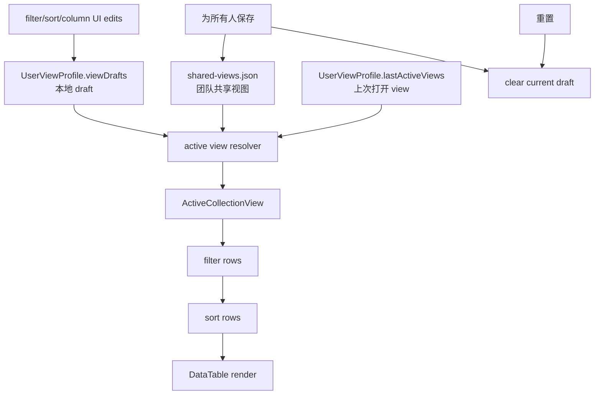

# 共享视图与筛选机制方案

## 方案概述

### 1. 总体目标和范围

本方案目标是在 Data Editor 中实现接近 Notion 的多视图、筛选、排序和视图保存机制。视图本身是团队共享对象；用户对视图内筛选、排序、搜索和列布局的改动先保存在本地 draft，只有点击 `为所有人保存` 后才覆盖团队共享视图。

范围包含：

- 同一 `filePath + collectionPath` 下的多个共享 view。
- view tabs 的切换、新建、重命名、删除和左右拖拽排序。
- 按字段类型分化的筛选交互：Boolean、Text、Select、MultiSelect、Relation 的基础筛选。
- 单字段或多字段排序的 view-state 表达与 UI。
- 本地 draft 的保留、重置和发布。
- 团队共享视图配置的后端读写接口、前端状态编排和测试覆盖。

范围不包含：

- 第一版不实现高级筛选分组，不做 `OR` 和嵌套条件组。
- 第一版不做共享视图保存冲突检测；后保存者直接覆盖团队视图。
- 第一版不实现权限、审计记录、多人协作提示。
- 第一版不改变业务数据保存机制；视图配置保存和业务数据保存仍然分离。

### 2. 各阶段任务概要

1. **模型阶段**：新增共享视图配置模型，定义 `CollectionView`、`FilterRule`、`SortRule` 和本地 draft 结构。
2. **持久化阶段**：新增共享视图配置文件和 API，扩展个人 profile 中的 draft、上次激活 view、个人偏好字段。
3. **应用状态阶段**：在 `App.tsx` 中建立 `shared view + local draft => active view state` 的合成管线。
4. **筛选排序阶段**：实现筛选规则求值、多字段排序求值，并接入当前表格渲染。
5. **交互阶段**：实现 view tabs、分类型筛选 popover、排序 popover、删除筛选、重置和 `为所有人保存`。
6. **验证阶段**：补充模型单测、筛选排序单测、profile/shared-view API 测试和关键 e2e 流程。

执行顺序必须从模型和纯逻辑开始，再接 API 和应用状态，最后接 UI。这样可以先锁定语义，再减少前端交互反复带来的风险。

### 3. 整体结构框架



---

## 当前机制判断

当前仓库已有两层配置：

- `ViewConfig`：项目级语义配置，保存字段类型、select options、primary key、relation、backlink。
- `UserViewProfile`：个人视图偏好，保存 `sidebarWidth`、`fileOrder` 和每个 collection 的 `hidden/wrapped/order/detailOrder/widths`。

现状缺口：

- 当前 `View profile` 更像用户配置档，不是 Notion 式 collection view。
- 当前筛选只有全文 `query`，没有字段级筛选规则。
- 当前排序是单字段临时 React state，没有持久化到 view。
- 当前列隐藏、列序、列宽直接保存到 profile，不具备“先本地 draft，再为所有人保存”的团队共享语义。

本方案会把 view-state 从现有 profile collection state 中抽出来，升级为团队共享 view + 用户本地 draft。

---

## 核心原则

### 视图是团队共享对象

每个 `filePath + collectionPath` 拥有一组共享 view。所有用户看到同一组 view tabs，例如：

- `全部`
- `构筑`
- `空ID`
- `伤害类型`

新建 view 直接写入团队共享配置，所有人可见。

### 视图内改动先进入本地 draft

以下内容属于 view-state，用户修改后先写入本地 draft：

- `query`
- `filters`
- `sorts`
- `hidden`
- `wrapped`
- `order`
- `detailOrder`
- `widths`
- view tabs 顺序

只在点击 `为所有人保存` 后写入团队共享配置。

### 个人偏好继续留在 profile

以下内容仍是个人偏好，不进入团队共享 view：

- `sidebarWidth`
- `fileOrder`
- 上次打开的 active view
- 当前用户未发布的 view draft

### 保存冲突直接覆盖

共享视图配置不是关键业务数据，第一版不做 revision 冲突检测。用户点击 `为所有人保存` 时，用当前合成后的 view state 直接覆盖团队共享配置，并清空对应 draft。

---

## 数据模型

### 配置文件

新增团队共享视图配置文件：

```text
<project>/.data-editor/shared-views.json
```

不建议把共享视图塞入现有 `view-config.json`。`view-config.json` 继续表示项目语义配置；`shared-views.json` 表示团队共享 UI/view-state。

### SharedViewsConfig

```ts
type SharedViewsConfig = {
  version: 1;
  collections: Record<CollectionConfigKey, SharedCollectionViews>;
};

type SharedCollectionViews = {
  views: CollectionView[];
  defaultViewId: string | null;
};
```

`CollectionConfigKey` 可以沿用现有 `collectionConfigKey(path, collectionPath)` 作为对象 key，但后续 draft 不再继续用 `:` 拼接 `viewId`：

```ts
`${filePath}:${collectionPath}`
```

原因是 `collectionConfigKey` 本身已经使用 `:`，再拼成 `${collectionKey}:${viewId}` 会增加解析歧义。第一版允许共享配置按 collection key 存储，但 view draft 必须使用嵌套结构：

```ts
draftsByCollection[collectionKey][viewId]
```

实现时不得通过 split `:` 反解 `collectionKey` 和 `viewId`。

### CollectionView

```ts
type CollectionView = {
  id: string;
  name: string;
  type: "table";
  query: string;
  filters: FilterGroup;
  sorts: SortRule[];
  hidden: string[];
  wrapped: string[];
  order: string[];
  detailOrder: string[];
  widths: Record<string, number>;
};
```

说明：

- `id` 在同一个 collection 内唯一。
- `name` 用于 view tab 展示。
- `type` 第一版只支持 `table`，为后续 board/calendar/gallery 留扩展位。
- `query` 是当前 view 的全文搜索条件。
- `filters` 是字段级筛选条件。
- `sorts` 是排序规则数组。
- `hidden/wrapped/order/detailOrder/widths` 从旧 collection view state 迁移为 view-state。

### FilterGroup

第一版只支持 `AND`：

```ts
type FilterGroup = {
  op: "and";
  rules: FilterRule[];
};
```

不做 `OR` 和嵌套分组，不做高级筛选 UI。

### FilterRule

```ts
type FilterRule = {
  id: string;
  field: string;
  operator:
    | "is"
    | "is_not"
    | "contains"
    | "does_not_contain"
    | "is_empty"
    | "is_not_empty";
  value?: unknown;
};
```

字段类型与 operator：

- Boolean：`is`，值为 `true/false`；附加 `clear` 只是 UI 操作，不保存为 operator。
- Text：`contains / does_not_contain / is / is_not / is_empty / is_not_empty`。
- Select：`is / is_not / is_empty / is_not_empty`。
- MultiSelect：`contains / does_not_contain / is_empty / is_not_empty`，`value` 是数组。
- Number：第一版按字符串或原始值等值处理，不做 `> / <`。
- Relation：第一版按原始 key 或显示 title 的字符串包含处理，后续再增强 relation 专用选择器。

### SortRule

```ts
type SortRule = {
  id: string;
  field: string;
  direction: "asc" | "desc";
};
```

第一版可以支持多字段排序的数据结构，UI 至少实现当前排序规则、添加排序、删除排序和方向切换。

### UserViewProfile 扩展

```ts
type UserViewProfile = {
  sidebarWidth: number | null;
  fileOrder: string[];
  lastActiveViews: Record<CollectionConfigKey, string>;
  viewDrafts: Record<CollectionConfigKey, Record<string, Partial<CollectionView>>>;
  viewOrderDrafts: Record<CollectionConfigKey, string[]>;
};
```

`viewDrafts` 是 view 级 draft，按 collection 和 view id 双层索引。

```ts
profile.viewDrafts[collectionKey][viewId]
```

`viewOrderDrafts` 是 collection 级 draft，不能放在单个 view draft 里。一个 collection 同一时间只能有一个待发布的 view tabs 顺序：

```ts
profile.viewOrderDrafts[collectionKey] = ["all", "damage", "empty-id"];
```

这样可以避免同一个 collection 下多个 view draft 携带不同 `viewOrder` 的冲突。

### 浏览器本地 Draft

未选择 profile 时仍要支持本地 draft。其语义必须与 profile draft 一致，但保存位置改为 browser localStorage。

建议新增独立 key：

```text
data-editor:shared-view-drafts
```

结构：

```ts
type LocalSharedViewDraftState = {
  lastActiveViews: Record<CollectionConfigKey, string>;
  viewDrafts: Record<CollectionConfigKey, Record<string, Partial<CollectionView>>>;
  viewOrderDrafts: Record<CollectionConfigKey, string[]>;
};
```

该 key 只保存 view draft 和 active view，不保存 `sidebarWidth/fileOrder`。`sidebarWidth/fileOrder` 继续使用现有个人偏好路径。

---

## 默认视图规则

当某个 collection 没有共享视图配置时，自动生成一个默认 view：

```ts
{
  id: "default",
  name: "全部",
  type: "table",
  query: "",
  filters: { op: "and", rules: [] },
  sorts: [],
  hidden: [],
  wrapped: [],
  order: [],
  detailOrder: [],
  widths: {}
}
```

规则：

- 每个 collection 至少保留一个 view。
- 默认打开上次使用的 view；找不到时打开第一个 view。
- 删除 view 时不能删除最后一个 view。
- 新建 view 默认插入到当前 view 右侧。
- view tabs 支持左右自由拖拽排序。

---

## Draft 合成机制

### Active View 解析

前端渲染时不直接使用共享 view，也不直接使用 draft，而是合成 active view：

```ts
activeView = mergeSharedViewWithDraft(sharedView, draft)
```

合成规则：

- 没有 draft 时，active view 等于 shared view。
- 有 draft 时，draft 中存在的字段覆盖 shared view。
- 数组字段如 `filters.rules`、`sorts`、`hidden`、`order` 采用整体覆盖，不做深层 patch。
- `viewOrderDrafts[collectionKey]` 单独作用于当前 collection 的 view tab 顺序。
- profile 模式从 `UserViewProfile.viewDrafts/viewOrderDrafts` 读取 draft。
- 浏览器本地模式从 `localStorage data-editor:shared-view-drafts` 读取 draft。

### Dirty 判断

以下任一条件成立时，当前 view 处于 dirty 状态：

- 当前 view 有 draft。
- 当前 collection 的 `viewOrderDrafts` 有 draft。
- 当前 active view 与 shared view 不一致。

Dirty 状态表现：

- 对应 chip 右上角显示橙点。
- 对应 view tab 可显示橙点。
- `为所有人保存` 启用。
- `重置` 可用。

### 重置

点击 `重置`：

- 清空当前 view 的 draft。
- 清空当前 collection 的 `viewOrderDrafts`。
- UI 回到团队共享版本。
- 不修改 `shared-views.json`。

### 为所有人保存

点击 `为所有人保存`：

- 把当前 active view 写入 `shared-views.json` 中对应 view。
- 如果 `viewOrderDrafts[collectionKey]` 存在，也写入共享 views 顺序。
- 清空当前 view draft 和当前 collection 的 view order draft。
- 不做冲突检测，直接覆盖。
- profile 模式清理 profile draft；浏览器本地模式清理 localStorage draft。

---

## 交互设计

### View Tabs

顶部 view tabs 是共享 view 列表。

支持：

- 点击切换 view。
- 新建 view。
- 重命名 view。
- 删除 view。
- 左右拖拽重排 view 顺序。

拖拽规则：

- 整个 tab 可拖拽，不额外添加可见把手。
- 拖动过程中显示 preview order。
- 松手后只写入本地 draft，不立刻写入共享配置。
- 点击 `为所有人保存` 后提交团队共享顺序。
- 点击 `重置` 后恢复团队共享顺序。

新建规则：

- 新建 view 直接创建团队共享 view。
- 初始内容来自当前 active view，也就是 `shared view + local draft`。
- 新建后自动切换到新 view。
- 新 view 初始没有 draft。
- 新建 view 不清除原 view 的本地 draft。它只是把当前合成快照复制为新的 shared view，原 view 未发布的 draft 继续保留，用户仍可回到原 view 后重置或保存。

删除规则：

- 删除 view 影响所有人，因此需要确认。
- 不能删除最后一个 view。
- 删除后默认切换到相邻 view。

### 筛选栏

筛选栏由 view tab 行中的 `筛选` 按钮控制显隐。view tab 行右侧包含 `筛选` 按钮和当前视图展开式搜索；筛选栏本身展示当前 view 的排序、筛选摘要和发布入口：

```text
view tab 行右侧: [筛选] [搜索图标 / 展开式搜索框]
筛选栏: [排序] [+ 筛选] [↑ id] [is_tag: 已勾选] [#kw_tags: 伤害类型, 控制效...] ... [重置] [为所有人保存]
```

规则：

- chip 是状态摘要，不是通用表单。
- 点击 chip 后按字段类型打开专用 popover。
- `+ 筛选` 默认新增一个字段筛选。
- 有 draft 的 chip 显示橙点。
- `筛选` 按钮在当前 view 有筛选时变蓝，用于提示筛选栏内有生效规则。
- `重置` 和 `为所有人保存` 位于筛选栏右侧，仅在当前 active view 或 view tab 顺序存在 draft 时显示；`为所有人保存` 使用橙色按钮。

### MultiSelect 筛选 Popover

用于数组标签、MultiSelect 字段。

结构：

- Header：`#kw_tags 包含 v` 和 `...`
- 已选值区域：彩色 tag，tag 自带 `x`
- 选项列表：checkbox + 彩色 tag
- operator 菜单：`包含 / 不包含 / 为空白 / 不为空白`
- `...` 菜单：`删除筛选`

行为：

- 勾选或取消选项后立即写入本地 draft。
- 删除单个 tag 后立即写入本地 draft。
- 点击 `删除筛选` 移除该 FilterRule。

第一版不提供 `合并到高级筛选中`。

### Boolean 筛选 Popover

用于 checkbox/boolean 字段。

结构：

- Header：`is_tag 是 v` 和 `...`
- 菜单项：
  - `未勾选`
  - `已勾选`
  - `清除`
- `...` 菜单：`删除筛选`

行为：

- 选择 `已勾选` 保存为 `operator: "is", value: true`。
- 选择 `未勾选` 保存为 `operator: "is", value: false`。
- 选择 `清除` 清空该规则的 value 或移除规则，具体实现可按 UI 表现选择。
- 点击 `删除筛选` 移除该 FilterRule。

### Text 筛选 Popover

用于普通文本字段。

结构：

- Header：`#description_en 包含 v` 和 `...`
- 输入框：`输入一个值...`
- `...` 菜单：`删除筛选`

行为：

- 输入时写入本地 draft。
- 空值可以保留为空输入，也可以在失焦后删除规则；第一版建议保留为空输入，避免用户正在输入时规则消失。

### Sort Popover

排序是专用面板，不混入筛选表单。

结构：

- 拖拽点阵。
- 字段按钮：`# id`
- 方向按钮：`升序 / 降序`
- 关闭按钮。
- `添加排序`
- `删除排序`

行为：

- 改字段或方向后写入本地 draft。
- 添加排序可以追加一条 SortRule。
- 删除排序移除当前 SortRule。
- 多字段排序按数组顺序稳定执行。

### 删除筛选

每个筛选 popover 的 `...` 菜单提供：

- `删除筛选`

第一版不提供：

- `合并到高级筛选中`
- 高级筛选面板
- 条件组拖拽
- `OR` 分组

---

## 筛选和排序求值

### 行过滤顺序

```text
source rows
=> query filter
=> field filters
=> multi-sort
=> DataTable
```

`query` 和字段 filters 都属于当前 view。

筛选后必须保留原始行索引。当前表格编辑、详情面板、删除行、relation/backlink 维护逻辑都依赖原始 collection row index，因此过滤和排序管线不能只返回重新编号后的 rows。

建议沿用当前 `__rowIndex` 思路：

```ts
type ViewRow = DataRecord & { __rowIndex: number };
```

规则：

- 进入 query/filter/sort 前先为每行附加不可枚举或内部字段 `__rowIndex`。
- 表格渲染可以显示排序后的 `ViewRow[]`。
- 编辑、详情、删除、relation 跳转等写操作必须使用 `row.__rowIndex` 回写原始 rows。
- `selectedRowIndex` 应表达原始 row index，而不是当前可见列表的位置。
- 过滤后如果当前选中行不再可见，不自动改写数据；UI 可以取消高亮或保持详情指向原始行，但必须避免把可见列表 index 当作原始 index。

### Query

`query` 沿用当前全文搜索语义：

- 遍历 row 的值。
- 转成字符串。
- case-insensitive contains。

### FilterRule 求值

建议新增纯函数模块：

```text
src/view/filtering.mjs
```

核心函数：

```ts
applyViewFilters(rows, filters, fieldContext): DataRecord[]
matchesFilterRule(row, rule, fieldContext): boolean
```

`fieldContext` 提供字段显示类型、relation 配置、select options 和原始 rows。

### SortRule 求值

建议新增纯函数模块：

```text
src/view/sorting.mjs
```

核心函数：

```ts
applyViewSorts(rows, sorts): DataRecord[]
compareFieldValue(left, right, direction): number
```

第一版排序语义：

- `null/undefined/""` 排在后面。
- 数字值按数字比较。
- 其他值按 `localeCompare(..., { numeric: true })` 比较。
- 多字段排序按 `sorts` 数组顺序依次比较。

---

## 后端 API

新增 API：

```text
GET  /api/shared-views?projectId=...
POST /api/shared-views
```

`GET` 返回 normalized `SharedViewsConfig`。

`POST` 请求体：

```ts
{
  projectId?: string | null;
  config: SharedViewsConfig;
}
```

保存路径：

```text
<project>/.data-editor/shared-views.json
```

需要新增：

```text
src/shared-views.mjs
```

职责：

- 加载共享视图配置。
- 保存共享视图配置。
- normalize view id、name、filters、sorts、列状态。
- 没有文件时返回 empty config。

---

## 前端状态编排

### App.tsx 新状态

建议新增：

```ts
const [sharedViewsConfig, setSharedViewsConfig] = useState<SharedViewsConfig>(emptySharedViewsConfig());
const [activeViewId, setActiveViewId] = useState<string | null>(null);
const [localSharedViewDrafts, setLocalSharedViewDrafts] = useState<LocalSharedViewDraftState>(emptyLocalSharedViewDraftState());
const [viewDraftDirty, setViewDraftDirty] = useState(false);
```

现有：

- `query`
- `sort`
- `fieldConfig`

应逐步改为从 `activeView` 派生，不再作为独立持久化源。

`viewDraftDirty` 必须和现有 `dataDirty/viewConfigDirty` 分离：

- `dataDirty` 只表示业务数据未保存。
- `viewConfigDirty` 只表示项目语义配置未保存，例如字段类型、relation、primary key。
- `viewDraftDirty` 只表示当前共享 view 有本地 draft，驱动 `重置` 和 `为所有人保存`。
- `为所有人保存` 不应触发现有业务数据保存按钮，也不应设置 `viewConfigDirty`。

### Active View 派生

```ts
const collectionViews = resolveCollectionViews(sharedViewsConfig, selectedPath, collectionPath);
const draftSource = selectedViewProfileName ? selectedViewProfile : localSharedViewDrafts;
const orderedViews = applyViewOrderDraft(collectionViews, draftSource.viewOrderDrafts);
const activeSharedView = resolveActiveView(orderedViews, draftSource.lastActiveViews);
const activeView = mergeSharedViewWithDraft(activeSharedView, draftSource.viewDrafts);
```

### View-state 更新

用户改筛选、排序、列隐藏、列宽、列序时：

```ts
updateActiveViewDraft((draft) => {
  draft.filters = nextFilters;
});
```

用户改 view tab 顺序时：

```ts
updateCollectionViewOrderDraft(collectionKey, nextViewIds);
```

`updateActiveViewDraft()` 和 `updateCollectionViewOrderDraft()` 需要同时支持两种写入路径：

- profile 模式：更新 `selectedViewProfile` 并走现有 debounced profile save。
- 浏览器本地模式：更新 `localSharedViewDrafts` 并写入 `localStorage data-editor:shared-view-drafts`。

### 保存到团队共享

```ts
async function handleSaveViewForEveryone() {
  const nextConfig = applyActiveViewToSharedConfig(sharedViewsConfig, activeView, activeViewOrderDraft);
  await saveSharedViews(nextConfig, activeProjectId);
  setSharedViewsConfig(nextConfig);
  clearActiveViewDraft();
}
```

`clearActiveViewDraft()` 同样按当前模式清理 profile draft 或 localStorage draft，并同步更新 `viewDraftDirty`。

---

## 旧结构迁移

项目处于早期阶段，结构性重构不做防御性兼容，但仍建议提供一次性 normalize 策略，避免当前已有 profile 完全失效。

迁移方向：

- 旧 `UserViewProfile.collections[key].hidden/wrapped/order/detailOrder/widths` 不再作为长期 source of truth。
- 如果某 collection 没有 shared views，可以用旧 collection state 生成默认 view。
- 生成后旧字段可以停止写入。

第一版可以选择更直接的做法：

- 对新 shared view 机制使用新结构。
- 保留读取旧字段作为初始 fallback。
- 保存 profile 时只写新 `viewDrafts/lastActiveViews` 和个人偏好。

---

## 文件职责

预计新增：

- `src/shared-views.mjs`
  - 后端共享视图配置读写和 normalize。
- `src/model/sharedViews.ts`
  - 前端共享视图类型定义。
- `src/view/view-state.mjs`
  - active view 合成、dirty 判断、draft 更新 helper。
- `src/view/filtering.mjs`
  - query 和 FilterRule 求值。
- `src/view/sorting.mjs`
  - SortRule 求值。
- `src/components/ViewTabs.tsx`
  - view tabs、切换、新建、重命名、删除、复制、横向拖拽排序、筛选栏显隐按钮和当前视图展开式搜索。
- `src/components/ViewFilterBar.tsx`
  - 排序入口、chip 列表、`+ 筛选`、筛选栏右侧的 `重置` 和 `为所有人保存`。
- `src/components/ExpandableSearch.tsx`
  - 全局搜索和当前视图搜索复用的展开式搜索控件。
- `src/components/filters/MultiSelectFilterPopover.tsx`
- `src/components/filters/BooleanFilterPopover.tsx`
- `src/components/filters/TextFilterPopover.tsx`
- `src/components/filters/FilterActionMenu.tsx`
- `src/components/sort/SortPopover.tsx`

预计修改：

- `server.mjs`
  - 接入 `/api/shared-views`。
- `src/api/client.ts`
  - 增加 shared views API 和类型。
- `src/view-profile.mjs`
  - 增加 `lastActiveViews/viewDrafts` normalize。
- `src/view-state-storage.mjs`
  - 保留 local 个人偏好，逐步减少 collection view state 作为长期来源。
  - 新增本地 shared view draft 读写 helper，例如 `readLocalSharedViewDrafts()` / `writeLocalSharedViewDrafts()`。
- `src/App.tsx`
  - 接入 shared views、active view、profile/local draft、`viewDraftDirty`、保存和重置。
- `src/table/DataTable.tsx`
  - 排序从 `sort` 改为 `sorts` 或由上层传入已排序 rows。
- `src/components/Toolbar.tsx`
  - 拆出 view/filter 相关 UI，避免 toolbar 继续膨胀。
- `src/styles.css`
  - 新增 view tabs、chip、popover、drag preview 样式。

---

## 测试计划

### 单元测试

新增或扩展：

- `tests/shared-views.test.mjs`
  - empty config。
  - normalize view。
  - 至少一个默认 view。
  - 删除非法 view/rule/sort。
- `tests/view-profile.test.mjs`
  - `lastActiveViews` normalize。
  - `viewDrafts` normalize。
  - `viewOrderDrafts` normalize。
  - draft key 去重和非法值过滤。
- `tests/view-state-storage.test.mjs`
  - 本地 shared view draft 独立读写。
  - profile/local draft 结构语义一致。
  - collection view reset 不误删 shared view draft，除非显式调用 view draft reset。
- `tests/view-state.test.mjs`
  - shared view + draft 合成。
  - dirty 判断。
  - reset draft。
  - save 后清 draft。
  - view order draft。
  - profile draft 和 localStorage draft 双路径。
- `tests/filtering.test.mjs`
  - Text contains/is/is_empty。
  - Boolean true/false。
  - MultiSelect contains/does_not_contain。
  - AND 规则组合。
- `tests/sorting.test.mjs`
  - asc/desc。
  - 多字段排序。
  - 空值位置。
  - numeric string 比较。

### 组件和 e2e

关键 e2e：

- 打开 collection 时自动出现 `全部` view。
- 新建 view 后所有人共享配置写入。
- 修改筛选后只出现 dirty，不立即写共享配置。
- 点击 `为所有人保存` 后共享配置更新，draft 清空。
- 点击 `重置` 后恢复共享 view。
- 删除筛选后 chip 消失，保存后刷新仍消失。
- view tabs 横向拖拽后进入 draft，保存后刷新顺序保持。
- `sidebarWidth/fileOrder` 不进入 shared views。
- 无 profile 的 `浏览器本地` 模式也能保留 draft，保存后清理 local draft。
- 筛选和排序后编辑、详情、删除仍命中原始 row index。

回归命令：

```powershell
node --test tests/*.test.mjs
npm run typecheck
npm test
npm run build
DATA_EDITOR_E2E_PORT=8800 npm run test:e2e
```

---

## 实施阶段拆分

### 阶段 1：共享视图模型和 API

目标：

- 增加 `shared-views.json` 读写。
- 定义模型和 normalize。
- API 可读写空配置和基础 view。

验收：

- `GET /api/shared-views` 无文件时返回 empty config。
- `POST /api/shared-views` 能写入 normalized config。
- 单测覆盖非法字段过滤和默认 view 生成。

### 阶段 2：profile/local draft 和 active view 合成

目标：

- 扩展 `UserViewProfile`。
- 增加 localStorage shared view draft。
- 实现 draft 合成 helper。
- App 能解析 active view。

验收：

- 切换 view 后记录 last active。
- 修改 view-state 只写 draft。
- reset 能清 draft。
- profile 模式和浏览器本地模式行为一致。
- view order draft 独立于 view draft。

### 阶段 3：筛选和排序纯逻辑

目标：

- 实现 `applyViewFilters` 和 `applyViewSorts`。
- 替换现有临时 `query` 和 `sort` 管线。

验收：

- Text/Boolean/MultiSelect 基础筛选通过单测。
- 多字段排序通过单测。
- 表格显示行数符合 active view。

### 阶段 4：View tabs 和保存机制

目标：

- 实现 view tabs。
- 支持新建、重命名、删除、横向拖拽排序。
- 实现 `为所有人保存`。

验收：

- 新建 view 直接写共享配置。
- view tab 拖拽先进入 draft，保存后刷新顺序保持。
- 删除最后一个 view 被阻止。

### 阶段 5：分类型筛选和排序 UI

目标：

- 实现 Notion-like chip 和 popover。
- Boolean/Text/MultiSelect/Sort 使用专用 UI。
- 删除筛选接入 `...` 菜单。

验收：

- 点击 chip 打开对应专用 popover。
- 修改选项后出现 dirty。
- 删除筛选后 chip 消失。
- `重置` 和 `为所有人保存` 行为正确。

### 阶段 6：完整回归和文档更新

目标：

- 补齐 e2e。
- 更新核心文档。
- 清理旧 collection view state 的写入路径。

验收：

- 回归命令通过。
- 文档解释 shared views、draft、个人偏好边界。
- 无旧机制和新机制互相覆盖的问题。

---

## 风险和应对

### 风险 1：`App.tsx` 状态继续膨胀

应对：

- 把 view-state 合成、dirty 判断、draft mutation 抽到独立 helper。
- UI 组件只接收 active view 和 callback。
- 不在 `Toolbar` 中继续堆复杂筛选逻辑。

### 风险 2：旧 profile collection state 和新 view draft 混用

应对：

- 明确 source of truth：shared view + draft。
- 旧 collection state 只作为初始 fallback。
- 新保存路径不再写旧 `collections[key].hidden/order/widths`。

### 风险 3：筛选字段类型推断不稳定

应对：

- 第一版按已有 `fieldViewConfigs/displayTypes` 和实际值推断。
- 不强行覆盖所有类型。
- Relation 和 Number 先用通用语义，后续增强。

### 风险 4：view tabs 拖拽影响点击体验

应对：

- 使用 pointer threshold，短点击仍是切换。
- 拖拽过程中只 preview，不立即提交。
- 不添加可见拖拽把手，保持整 tab 可拖动。

### 风险 5：保存共享配置和业务数据保存混淆

应对：

- `为所有人保存` 只保存 view 配置。
- 业务数据仍使用原有保存按钮和 dirty 状态。
- UI 文案明确区分 `Unsaved data` 和 `View draft`。
- 前端状态明确拆分 `dataDirty`、`viewConfigDirty`、`viewDraftDirty`。
- `viewDraftDirty` 只驱动 view draft 橙点、`重置` 和 `为所有人保存`，不得混入业务数据保存流程。

### 风险 6：本地模式没有 profile 导致 draft 丢失

应对：

- profile 模式写入 `UserViewProfile.viewDrafts/viewOrderDrafts/lastActiveViews`。
- 浏览器本地模式写入 `localStorage data-editor:shared-view-drafts`。
- 两条路径使用同一套 normalize、merge、dirty 和 reset helper。

### 风险 7：筛选排序后写操作行号错位

应对：

- filter/sort 前为每行保留原始 `__rowIndex`。
- 表格事件回调传递原始 row index。
- 详情、编辑、删除、relation/backlink 维护都不得使用可见列表 index 作为写入 index。

---

## 原型参考

当前交互原型：

```text
docs/prototypes/notion-view-filter-prototype.html
```

本地服务地址：

```text
http://127.0.0.1:8890/notion-view-filter-prototype.html
```

原型已经验证的交互方向：

- 共享 view tabs。
- 筛选和排序 chip。
- MultiSelect 专用 popover。
- Boolean 专用 popover。
- Text 专用 popover。
- Sort 专用 popover。
- 删除筛选。
- 本地 draft 橙点。
- `重置`。
- `为所有人保存`。

正式实现时以该交互框架为基准，但具体组件应复用现有 React、Radix、lucide/icons 和 data-editor 样式体系。
