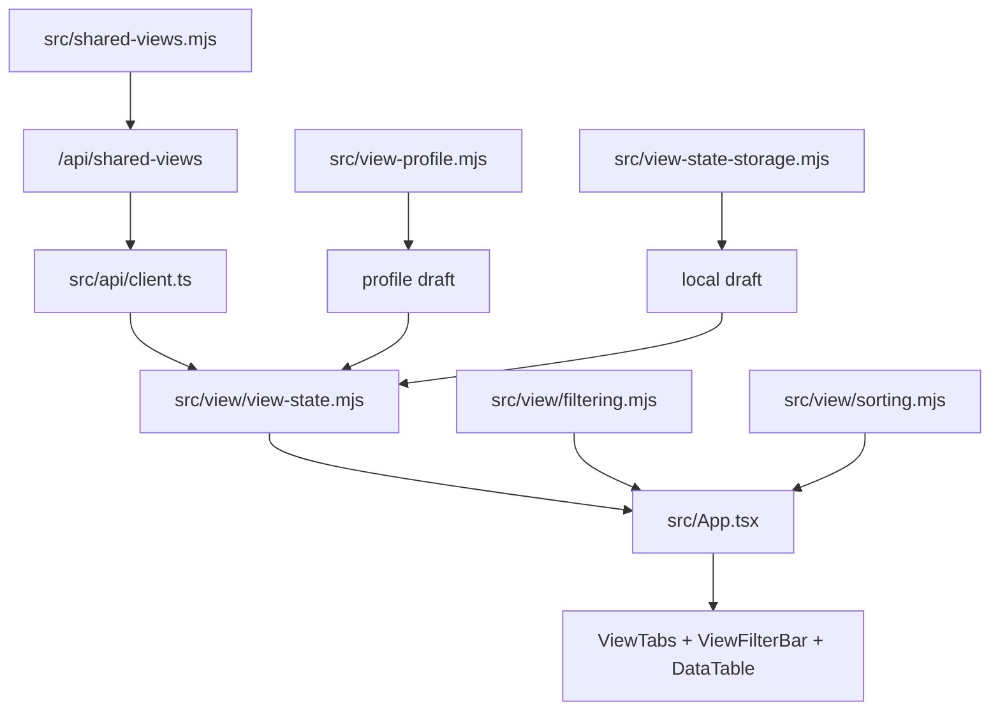

# 共享视图与筛选机制 Implementation Plan

> **For agentic workers:** REQUIRED SUB-SKILL: Use `superpowers:subagent-driven-development` (recommended) or `superpowers:executing-plans` to implement this plan task-by-task. Steps use checkbox (`- [ ]`) syntax for tracking.

**Goal:** 实现 Notion-like 团队共享 view、本地 draft、分类型筛选、排序、view tabs 拖拽排序和 `为所有人保存` 机制。

**Architecture:** 团队共享 view 存入 `<project>/.data-editor/shared-views.json`，个人/profile draft 存入 `UserViewProfile`，浏览器本地 draft 存入 `localStorage data-editor:shared-view-drafts`。前端统一通过 `shared view + draft => active view` 派生表格显示；业务数据 dirty、项目语义配置 dirty、view draft dirty 三者分离。

**Tech Stack:** React 18, TypeScript, Vite, Node.js `node:test`, Radix Popover/Dropdown/Select, `@tanstack/react-table`, Playwright e2e, browser localStorage.

---

## 方案概述

### 总体目标和范围

本计划执行 [共享视图与筛选机制方案](C:/Code/data-editor/docs/plans/2026-06-04-共享视图与筛选机制.md)。范围包括共享视图配置文件、API、profile/local draft、active view 合成、筛选排序纯逻辑、view tabs UI、筛选/排序 popover、保存/重置和测试回归。

不包含高级筛选分组、`OR` 条件、权限、审计、多用户冲突保护。保存共享视图时直接覆盖团队配置。

### 各阶段任务概要

1. 模型与 API：新增 `shared-views` 后端模块和接口。
2. Draft 存储：扩展 profile，并增加 localStorage shared view draft。
3. View 状态纯逻辑：实现 active view 合成、dirty、reset、save payload。
4. 筛选排序纯逻辑：实现 query、AND filters、多字段 sort，并保留 `__rowIndex`。
5. App 接入：将 `query/sort/fieldConfig` 迁移到 active view 派生。
6. UI 接入：实现 view tabs、filter bar、分类型 popover 和保存/重置。
7. e2e 与文档：覆盖关键用户流并更新文档。

### 整体结构框架



---

## 文件职责

- Create: `src/shared-views.mjs`
  - 负责 `SharedViewsConfig` 的 empty、normalize、load、save，以及 shared view / draft 的统一 normalize。
- Create: `tests/shared-views.test.mjs`
  - 覆盖默认配置、非法 view/rule/sort 过滤、保存路径。
- Modify: `server.mjs`
  - 接入 `GET /api/shared-views` 和 `POST /api/shared-views`。
- Modify: `src/api/client.ts`
  - 增加 shared view 类型和 API client。
- Modify: `src/view-profile.mjs`
  - 增加 `lastActiveViews/viewDrafts/viewOrderDrafts` normalize。
- Modify: `tests/view-profile.test.mjs`
  - 覆盖 profile draft normalize。
- Modify: `src/view-state-storage.mjs`
  - 增加 `readLocalSharedViewDrafts()` / `writeLocalSharedViewDrafts()`。
- Modify: `tests/view-state-storage.test.mjs`
  - 覆盖本地 draft 与 collection view state 隔离。
- Create: `src/view/view-state.mjs`
  - 负责 collection views resolve、default view resolve、active view resolve、draft merge、dirty 判断、清理 draft、生成保存后的 shared config。
- Create: `tests/view-state.test.mjs`
  - 覆盖 profile/local draft 双路径和 view order draft。
- Create: `src/view/filtering.mjs`
  - 负责 query、AND filter、`__rowIndex` 运行态字段保留。
- Create: `tests/filtering.test.mjs`
  - 覆盖 Text/Boolean/MultiSelect/empty 规则。
- Create: `src/view/sorting.mjs`
  - 负责多字段排序和空值排序。
- Create: `tests/sorting.test.mjs`
  - 覆盖 asc/desc、多字段、numeric string、空值。
- Create: `src/components/ViewTabs.tsx`
  - 负责 view 切换、新建、删除、重命名、横向拖拽排序。
- Create: `src/components/ViewFilterBar.tsx`
  - 负责 chips、`+ 筛选`、`重置`、`为所有人保存`。
- Create: `src/components/filters/MultiSelectFilterPopover.tsx`
- Create: `src/components/filters/BooleanFilterPopover.tsx`
- Create: `src/components/filters/TextFilterPopover.tsx`
- Create: `src/components/filters/FilterActionMenu.tsx`
- Create: `src/components/sort/SortPopover.tsx`
- Modify: `src/App.tsx`
  - 接入 shared views、active view、draft mutation、`viewDraftDirty`、保存/重置。
- Modify: `src/table/DataTable.tsx`
  - 移除内部单字段 sort 依赖，使用上层已过滤排序 rows，并确保回调传原始 row index。
- Modify: `src/components/Toolbar.tsx`
  - 移除/弱化旧 query/profile view 控件，避免与新 view/filter UI 重叠。
- Modify: `src/styles.css`
  - 新增 view tabs、chips、popover、drag preview、dirty dot 样式。
- Modify: `tests/data-editor.spec.ts`
  - 增加关键 e2e。
- Modify: `docs/05_数据与配置模型.md`、`docs/04_信息架构与交互.md`
  - 更新 shared view 与 draft 边界。

---

## Task 1: 共享视图后端模型与 API

**Files:**
- Create: `src/shared-views.mjs`
- Create: `tests/shared-views.test.mjs`
- Modify: `server.mjs`
- Modify: `src/api/client.ts`

- [ ] **Step 1: 写 shared views 失败测试**

在 `tests/shared-views.test.mjs` 新增测试：

```js
import test from "node:test";
import assert from "node:assert/strict";
import { mkdtemp, readFile, rm } from "node:fs/promises";
import { tmpdir } from "node:os";
import path from "node:path";
import {
  emptySharedViewsConfig,
  loadSharedViews,
  normalizeSharedViewsConfig,
  saveSharedViews,
} from "../src/shared-views.mjs";

test("loadSharedViews returns empty config when file is missing", async () => {
  const root = await mkdtemp(path.join(tmpdir(), "data-editor-shared-views-"));
  try {
    assert.deepEqual(await loadSharedViews(root), emptySharedViewsConfig());
  } finally {
    await rm(root, { recursive: true, force: true });
  }
});

test("normalizeSharedViewsConfig keeps valid views and normalizes rules", () => {
  const config = normalizeSharedViewsConfig({
    version: 1,
    collections: {
      "data/keywords.json:$": {
        defaultViewId: "damage",
        views: [
          {
            id: "damage",
            name: "伤害类型",
            type: "table",
            query: "fire",
            filters: { op: "and", rules: [
              { id: "r1", field: "kw_tags", operator: "contains", value: ["伤害类型", "控制效果"] },
              { id: "", field: "", operator: "bad", value: "" },
            ] },
            sorts: [{ id: "s1", field: "id", direction: "asc" }, { id: "bad", field: "", direction: "sideways" }],
            hidden: ["internal", "internal"],
            wrapped: ["description"],
            order: ["id", "kw_tags", "id"],
            detailOrder: ["description"],
            widths: { id: 120.8, bad: -1 },
          },
        ],
      },
    },
  });

  assert.equal(config.version, 1);
  const view = config.collections["data/keywords.json:$"].views[0];
  assert.equal(view.id, "damage");
  assert.deepEqual(view.filters.rules, [{ id: "r1", field: "kw_tags", operator: "contains", value: ["伤害类型", "控制效果"] }]);
  assert.deepEqual(view.sorts, [{ id: "s1", field: "id", direction: "asc" }]);
  assert.deepEqual(view.hidden, ["internal"]);
  assert.deepEqual(view.order, ["id", "kw_tags"]);
  assert.deepEqual(view.widths, { id: 121 });
});

test("saveSharedViews writes normalized shared views file", async () => {
  const root = await mkdtemp(path.join(tmpdir(), "data-editor-shared-views-"));
  try {
    const result = await saveSharedViews(root, {
      collections: {
        "data/keywords.json:$": {
          defaultViewId: "all",
          views: [{ id: "all", name: "全部", type: "table" }],
        },
      },
    });
    assert.equal(result.path, ".data-editor/shared-views.json");
    const stored = JSON.parse(await readFile(path.join(root, result.path), "utf8"));
    assert.equal(stored.collections["data/keywords.json:$"].views[0].name, "全部");
  } finally {
    await rm(root, { recursive: true, force: true });
  }
});
```

- [ ] **Step 2: 运行失败测试**

Run:

```powershell
node --test tests/shared-views.test.mjs
```

Expected: FAIL，原因是 `src/shared-views.mjs` 不存在。

- [ ] **Step 3: 实现 `src/shared-views.mjs`**

实现导出：

```js
export function emptySharedViewsConfig()
export function normalizeCollectionView(value)
export function normalizeCollectionViewDraft(value)
export function normalizeSharedViewsConfig(value)
export async function loadSharedViews(projectContextOrRoot)
export async function saveSharedViews(projectContextOrRoot, config)
```

实现要点：

- 路径为 `<project>/.data-editor/shared-views.json`。
- 使用 `createProjectContext()` 和 `resolveInsideRoot()`，与 `src/view-config.mjs` 保持一致。
- `CollectionView` 缺失字段时补默认值。
- `filters.op` 只接受 `"and"`。
- `operator` 只接受 `is/is_not/contains/does_not_contain/is_empty/is_not_empty`。
- `sort.direction` 只接受 `asc/desc`。
- 字符串数组用现有 normalize 思路去空、trim、去重。
- `widths` 只保留正数并 round。
- `normalizeCollectionView(value)` 负责完整 shared view 清洗，并补齐 `query/filters/sorts/hidden/wrapped/order/detailOrder/widths` 默认值。
- `normalizeCollectionViewDraft(value)` 负责 partial draft 清洗，只保留 draft 允许覆盖的字段：`query/filters/sorts/hidden/wrapped/order/detailOrder/widths`，不得保留 `id/name/type`。
- `normalizeSharedViewsConfig(value)` 内部复用 `normalizeCollectionView(value)`；后续 profile/local draft normalize 复用 `normalizeCollectionViewDraft(value)`，避免 shared view 与 draft 的筛选、排序、列宽清洗结果不一致。

- [ ] **Step 4: 接入 server API**

在 `server.mjs` 顶部引入：

```js
import { loadSharedViews, saveSharedViews } from "./src/shared-views.mjs";
```

在路由区新增，位置靠近 view config/profile：

```js
if (url.pathname === "/api/shared-views" && req.method === "GET") return sendJson(res, await loadSharedViews(await projectContextForUrl(url)));
if (url.pathname === "/api/shared-views" && req.method === "POST") return handleSaveSharedViews(req, res);
```

新增 handler：

```js
async function handleSaveSharedViews(req, res) {
  const body = await readJsonBody(req);
  const projectContext = await projectContextForId(body.projectId);
  const config = body && typeof body === "object" && "config" in body ? body.config : body;
  const result = await saveSharedViews(projectContext, config);
  sendJson(res, { ok: true, ...result });
}
```

- [ ] **Step 5: 扩展 `src/api/client.ts`**

新增类型：

```ts
export type FilterOperator = "is" | "is_not" | "contains" | "does_not_contain" | "is_empty" | "is_not_empty";
export type FilterRule = { id: string; field: string; operator: FilterOperator; value?: unknown };
export type FilterGroup = { op: "and"; rules: FilterRule[] };
export type SortRule = { id: string; field: string; direction: "asc" | "desc" };
export type CollectionView = {
  id: string;
  name: string;
  type: "table";
  query: string;
  filters: FilterGroup;
  sorts: SortRule[];
  hidden: string[];
  wrapped: string[];
  order: string[];
  detailOrder: string[];
  widths: Record<string, number>;
};
export type SharedViewsConfig = {
  version: 1;
  collections: Record<string, { views: CollectionView[]; defaultViewId: string | null }>;
};
```

新增 API：

```ts
export async function loadSharedViews(projectId?: string | null): Promise<SharedViewsConfig> {
  return fetchJson(withProjectId("/api/shared-views", projectId));
}

export async function saveSharedViews(config: SharedViewsConfig, projectId?: string | null) {
  return fetchJson("/api/shared-views", {
    method: "POST",
    headers: { "content-type": "application/json" },
    body: JSON.stringify({ projectId, config }),
  });
}
```

- [ ] **Step 6: 验证 Task 1**

Run:

```powershell
node --test tests/shared-views.test.mjs
npm run typecheck
```

Expected: PASS。

补充 smoke：

```powershell
npm run build
```

Expected: PASS，确认 `server.mjs` 新增 import 与 `src/api/client.ts` 类型没有破坏构建。执行阶段如果已有服务测试工具，也可补一个轻量 GET `/api/shared-views` route smoke；不要只依赖 `shared-views.mjs` 模块测试。

---

## Task 2: Profile 和浏览器本地 Draft 存储

**Files:**
- Modify: `src/view-profile.mjs`
- Modify: `tests/view-profile.test.mjs`
- Modify: `src/view-state-storage.mjs`
- Modify: `tests/view-state-storage.test.mjs`
- Modify: `src/api/client.ts`

- [ ] **Step 1: 扩展 profile 测试**

在 `tests/view-profile.test.mjs` 的 `saveViewProfile writes normalized profile file` 输入和期望中加入：

```js
lastActiveViews: { "data/keywords.json:$": "damage" },
viewDrafts: {
  "data/keywords.json:$": {
    damage: {
      query: "fire",
      filters: { op: "and", rules: [{ id: "r1", field: "kw_tags", operator: "contains", value: ["伤害类型"] }] },
    },
  },
},
viewOrderDrafts: {
  "data/keywords.json:$": ["all", "damage", "all", ""],
},
```

期望保存后：

```js
lastActiveViews: { "data/keywords.json:$": "damage" },
viewDrafts: {
  "data/keywords.json:$": {
    damage: {
      query: "fire",
      filters: { op: "and", rules: [{ id: "r1", field: "kw_tags", operator: "contains", value: ["伤害类型"] }] },
    },
  },
},
viewOrderDrafts: {
  "data/keywords.json:$": ["all", "damage"],
},
```

- [ ] **Step 2: 运行 profile 失败测试**

Run:

```powershell
node --test tests/view-profile.test.mjs
```

Expected: FAIL，原因是新字段未 normalize。

- [ ] **Step 3: 实现 profile normalize**

在 `emptyViewProfile()` 中新增：

```js
lastActiveViews: {},
viewDrafts: {},
viewOrderDrafts: {},
```

在 `normalizeViewProfile()` 返回值中加入对应字段。新增 helper，并按以下行为实现：

- `normalizeStringRecord(value)`：只保留 key 和 value 都是非空字符串的条目，并 trim value。
- `normalizeViewDrafts(value)`：只保留 object collection key、object view id、object draft；每个 draft 必须调用 `normalizeCollectionViewDraft(draft)`；过滤空 draft 和空 collection。
- `normalizeViewOrderDrafts(value)`：只保留非空 collection key；每个顺序数组用 `normalizeStringArray()` 去空、trim、去重；空数组不写入结果。

实现注意：

- `src/view-profile.mjs` 可从 `src/shared-views.mjs` import `normalizeCollectionViewDraft()`。
- 这次重构不保留旧 draft 清洗分支；profile draft 和 local draft 都走同一套 shared view draft normalize。

- [ ] **Step 4: 扩展本地 storage 测试**

在 `tests/view-state-storage.test.mjs` import 中加入：

```js
readLocalSharedViewDrafts,
writeLocalSharedViewDrafts,
```

新增测试：

```js
test("local shared view drafts are stored independently from collection view state", () => {
  const storage = createMemoryStorage({
    "data-editor:shared-view-drafts": JSON.stringify({
      lastActiveViews: { "data/keywords.json:$": "damage" },
      viewDrafts: { "data/keywords.json:$": { damage: { query: "fire" } } },
      viewOrderDrafts: { "data/keywords.json:$": ["all", "damage"] },
    }),
    "data-editor:data/keywords.json:$:__order": "id,name",
  });

  assert.deepEqual(readLocalSharedViewDrafts(storage), {
    lastActiveViews: { "data/keywords.json:$": "damage" },
    viewDrafts: { "data/keywords.json:$": { damage: { query: "fire" } } },
    viewOrderDrafts: { "data/keywords.json:$": ["all", "damage"] },
  });

  writeLocalSharedViewDrafts(storage, {
    lastActiveViews: { "data/keywords.json:$": "all" },
    viewDrafts: {},
    viewOrderDrafts: {},
  });

  assert.equal(storage.getItem("data-editor:data/keywords.json:$:__order"), "id,name");
  assert.match(storage.getItem("data-editor:shared-view-drafts"), /"all"/);
});
```

- [ ] **Step 5: 实现本地 shared draft helper**

在 `src/view-state-storage.mjs` 新增：

```js
const sharedViewDraftStorageKey = "data-editor:shared-view-drafts";

export function emptyLocalSharedViewDrafts() {
  return { lastActiveViews: {}, viewDrafts: {}, viewOrderDrafts: {} };
}

export function readLocalSharedViewDrafts(localStorage) {
  const raw = localStorage.getItem(sharedViewDraftStorageKey);
  if (!raw) return emptyLocalSharedViewDrafts();
  try {
    return normalizeLocalSharedViewDrafts(JSON.parse(raw));
  } catch {
    return emptyLocalSharedViewDrafts();
  }
}

export function writeLocalSharedViewDrafts(localStorage, value) {
  const normalized = normalizeLocalSharedViewDrafts(value);
  if (!Object.keys(normalized.lastActiveViews).length && !Object.keys(normalized.viewDrafts).length && !Object.keys(normalized.viewOrderDrafts).length) {
    localStorage.removeItem(sharedViewDraftStorageKey);
    return;
  }
  localStorage.setItem(sharedViewDraftStorageKey, JSON.stringify(normalized));
}
```

`normalizeLocalSharedViewDrafts(value)` 的结构和 `normalizeViewProfile()` 中的 shared view draft 字段一致：

- `lastActiveViews` 复用 `normalizeStringRecord()` 语义。
- `viewDrafts` 复用 `normalizeCollectionViewDraft()`。
- `viewOrderDrafts` 复用 `normalizeViewOrderDrafts()` 语义。
- localStorage 中的 draft 数据不得再写入旧 collection view state key。

- [ ] **Step 6: 扩展前端类型**

在 `src/api/client.ts` 的 `UserViewProfile` 中加入：

```ts
lastActiveViews: Record<string, string>;
viewDrafts: Record<string, Record<string, Partial<CollectionView>>>;
viewOrderDrafts: Record<string, string[]>;
```

- [ ] **Step 7: 验证 Task 2**

Run:

```powershell
node --test tests/view-profile.test.mjs tests/view-state-storage.test.mjs
npm run typecheck
```

Expected: PASS。

---

## Task 3: Active View 合成和 Draft 纯逻辑

**Files:**
- Create: `src/view/view-state.mjs`
- Create: `tests/view-state.test.mjs`

- [ ] **Step 1: 写 view-state 失败测试**

创建 `tests/view-state.test.mjs`，覆盖：

```js
import test from "node:test";
import assert from "node:assert/strict";
import {
  applyViewOrderDraft,
  clearViewDraft,
  collectionConfigKey,
  hasViewDraft,
  mergeSharedViewWithDraft,
  resolveActiveView,
  resolveCollectionViews,
  resolveDefaultViewId,
} from "../src/view/view-state.mjs";

const all = { id: "all", name: "全部", type: "table", query: "", filters: { op: "and", rules: [] }, sorts: [], hidden: [], wrapped: [], order: [], detailOrder: [], widths: {} };
const damage = { ...all, id: "damage", name: "伤害类型", query: "base" };

test("mergeSharedViewWithDraft overlays draft fields", () => {
  const merged = mergeSharedViewWithDraft(damage, { query: "fire", hidden: ["internal"] });
  assert.equal(merged.id, "damage");
  assert.equal(merged.query, "fire");
  assert.deepEqual(merged.hidden, ["internal"]);
  assert.equal(merged.name, "伤害类型");
});

test("applyViewOrderDraft reorders known views and appends missing views", () => {
  assert.deepEqual(applyViewOrderDraft([all, damage], ["damage", "missing"]).map((view) => view.id), ["damage", "all"]);
});

test("resolveActiveView uses last active then default then first view", () => {
  assert.equal(resolveActiveView([all, damage], "damage", "all").id, "damage");
  assert.equal(resolveActiveView([all, damage], "missing", "damage").id, "damage");
  assert.equal(resolveActiveView([all, damage], null, null).id, "all");
});

test("resolveCollectionViews creates default all view when collection is missing", () => {
  const config = { version: 1, collections: {} };
  const views = resolveCollectionViews(config, "data/keywords.json:$");
  assert.equal(views.length, 1);
  assert.equal(views[0].id, "all");
  assert.equal(views[0].name, "全部");
});

test("resolveDefaultViewId falls back to first resolved view", () => {
  const config = {
    version: 1,
    collections: {
      "data/keywords.json:$": { defaultViewId: "missing", views: [all, damage] },
    },
  };
  assert.equal(resolveDefaultViewId(config, "data/keywords.json:$"), "all");
});

test("clearViewDraft removes only the active view and collection order draft", () => {
  const state = {
    lastActiveViews: { "data/keywords.json:$": "damage" },
    viewDrafts: { "data/keywords.json:$": { all: { query: "x" }, damage: { query: "fire" } } },
    viewOrderDrafts: { "data/keywords.json:$": ["damage", "all"] },
  };
  const next = clearViewDraft(state, "data/keywords.json:$", "damage");
  assert.deepEqual(next.viewDrafts["data/keywords.json:$"], { all: { query: "x" } });
  assert.equal(next.viewOrderDrafts["data/keywords.json:$"], undefined);
});

test("hasViewDraft detects view and order drafts", () => {
  assert.equal(hasViewDraft({ viewDrafts: {}, viewOrderDrafts: {} }, "data/keywords.json:$", "damage"), false);
  assert.equal(hasViewDraft({ viewDrafts: { "data/keywords.json:$": { damage: { query: "fire" } } }, viewOrderDrafts: {} }, "data/keywords.json:$", "damage"), true);
  assert.equal(hasViewDraft({ viewDrafts: {}, viewOrderDrafts: { "data/keywords.json:$": ["damage"] } }, "data/keywords.json:$", "damage"), true);
});
```

- [ ] **Step 2: 运行失败测试**

Run:

```powershell
node --test tests/view-state.test.mjs
```

Expected: FAIL，模块不存在。

- [ ] **Step 3: 实现 view-state helper**

导出：

```js
export function collectionConfigKey(path, collectionPath)
export function resolveCollectionViews(sharedViewsConfig, collectionKey)
export function resolveDefaultViewId(sharedViewsConfig, collectionKey)
export function mergeSharedViewWithDraft(sharedView, draft)
export function applyViewOrderDraft(views, orderDraft)
export function resolveActiveView(views, lastActiveViewId, defaultViewId)
export function hasViewDraft(draftState, collectionKey, viewId)
export function clearViewDraft(draftState, collectionKey, viewId)
```

补充实现要求：

- `collectionConfigKey(path, collectionPath)`：返回 `${path}:${collectionPath}`，与现有 collection view state key 保持一致。
- `mergeSharedViewWithDraft(sharedView, draft)`：返回 `{ ...sharedView, ...(draft ?? {}) }`，draft 只允许覆盖 `normalizeCollectionViewDraft()` 保留的字段。
- `applyViewOrderDraft(views, orderDraft)`：按 `orderDraft` 中存在于 `views` 的 id 排在前面，丢弃未知 id，剩余 views 按原顺序追加。
- `resolveCollectionViews(sharedViewsConfig, collectionKey)`：读取指定 collection 的 views；缺失或空数组时返回单个默认 view `{ id: "all", name: "全部", type: "table", query: "", filters: { op: "and", rules: [] }, sorts: [], hidden: [], wrapped: [], order: [], detailOrder: [], widths: {} }`。这保证每个 `filePath + collectionPath` 至少有一个共享 view。
- `resolveDefaultViewId(sharedViewsConfig, collectionKey)`：只返回 `resolveCollectionViews()` 结果中存在的 id；配置的 `defaultViewId` 不存在时返回第一个 resolved view id；没有 view 时返回 `null`。
- `resolveActiveView(views, lastActiveViewId, defaultViewId)`：优先返回 last active，其次 default view，其次第一个 view；views 为空时返回 `null`。
- `hasViewDraft(draftState, collectionKey, viewId)`：当前 view 有 draft 或当前 collection 有 order draft 时返回 true。
- `clearViewDraft(draftState, collectionKey, viewId)`：不可变返回新对象，只删除当前 view draft 和当前 collection 的 order draft；同 collection 其他 view draft 保留。

- [ ] **Step 4: 验证 Task 3**

Run:

```powershell
node --test tests/view-state.test.mjs
```

Expected: PASS。

---

## Task 4: 筛选和排序纯逻辑

**Files:**
- Create: `src/view/filtering.mjs`
- Create: `tests/filtering.test.mjs`
- Create: `src/view/sorting.mjs`
- Create: `tests/sorting.test.mjs`

- [ ] **Step 1: 写 filtering 失败测试**

创建 `tests/filtering.test.mjs`，覆盖 query、Boolean、MultiSelect、empty、`__rowIndex`：

```js
import test from "node:test";
import assert from "node:assert/strict";
import { applyViewFilters, attachRowIndexes } from "../src/view/filtering.mjs";

const rows = [
  { id: "kw_fire", is_tag: true, kw_tags: ["伤害类型", "元素"], description: "Fire damage" },
  { id: "kw_stun", is_tag: true, kw_tags: ["控制效果"], description: "Stun target" },
  { id: "", is_tag: false, kw_tags: [], description: "" },
];

test("attachRowIndexes keeps original row indexes", () => {
  const indexed = attachRowIndexes(rows);
  assert.equal(indexed[2].__rowIndex, 2);
});

test("applyViewFilters applies query and AND rules", () => {
  const result = applyViewFilters(rows, "kw", {
    op: "and",
    rules: [{ id: "r1", field: "kw_tags", operator: "contains", value: ["伤害类型"] }],
  });
  assert.deepEqual(result.map((row) => row.id), ["kw_fire"]);
  assert.equal(result[0].__rowIndex, 0);
});

test("applyViewFilters handles boolean and empty operators", () => {
  assert.deepEqual(applyViewFilters(rows, "", { op: "and", rules: [{ id: "r1", field: "is_tag", operator: "is", value: false }] }).map((row) => row.__rowIndex), [2]);
  assert.deepEqual(applyViewFilters(rows, "", { op: "and", rules: [{ id: "r2", field: "id", operator: "is_empty" }] }).map((row) => row.__rowIndex), [2]);
});
```

- [ ] **Step 2: 写 sorting 失败测试**

创建 `tests/sorting.test.mjs`：

```js
import test from "node:test";
import assert from "node:assert/strict";
import { applyViewSorts } from "../src/view/sorting.mjs";

test("applyViewSorts sorts by multiple fields and keeps empty values last", () => {
  const rows = [
    { id: "10", group: "b", __rowIndex: 0 },
    { id: "2", group: "a", __rowIndex: 1 },
    { id: "", group: "a", __rowIndex: 2 },
    { id: "1", group: "a", __rowIndex: 3 },
  ];
  const result = applyViewSorts(rows, [
    { id: "s1", field: "group", direction: "asc" },
    { id: "s2", field: "id", direction: "asc" },
  ]);
  assert.deepEqual(result.map((row) => row.__rowIndex), [3, 1, 2, 0]);
});
```

- [ ] **Step 3: 运行失败测试**

Run:

```powershell
node --test tests/filtering.test.mjs tests/sorting.test.mjs
```

Expected: FAIL，模块不存在。

- [ ] **Step 4: 实现 filtering**

`src/view/filtering.mjs` 导出 `attachRowIndexes(rows)`、`applyViewFilters(rows, query, filters)`、`matchesFilterRule(row, rule)`。

实现规则：

- `attachRowIndexes(rows)` 返回新数组，数组项是浅拷贝对象，并写入可枚举运行态字段 `__rowIndex`；不要用 non-enumerable property，因为 `replaceRowsForView()`、React table row model 或序列化式克隆可能丢掉不可枚举字段。
- `__rowIndex` 只用于运行态定位原始行；保存数据文件、编辑 payload、导出配置时不得把 `__rowIndex` 写回源数据。
- `applyViewFilters(rows, query, filters)` 内部先调用 `attachRowIndexes(rows)`，后续筛选返回带 `__rowIndex` 的 row shallow copy。
- query 遍历 `Object.values(row)`，忽略 `__rowIndex`。
- `contains` 对数组表示“数组包含任一 value”；对文本表示 case-insensitive contains。
- `does_not_contain` 是 `contains` 取反。
- `is_empty` 对 `null/undefined/""/[]` 为 true。
- `is_not_empty` 取反。
- `is/is_not` 使用字符串或布尔语义比较。

- [ ] **Step 5: 实现 sorting**

`src/view/sorting.mjs` 导出 `applyViewSorts(rows, sorts)`、`compareFieldValue(left, right, direction)`。

实现规则：

- 无 sorts 返回原数组。
- 排序返回新数组。
- 排序不得丢弃 `__rowIndex`；输入行对象保持同一对象引用即可。
- 空值排最后。
- number 按 number 比较。
- 其他按 `String(value).localeCompare(String(other), undefined, { numeric: true })`。

- [ ] **Step 6: 验证 Task 4**

Run:

```powershell
node --test tests/filtering.test.mjs tests/sorting.test.mjs
```

Expected: PASS。

---

## Task 5: App 状态接入最小闭环

**Files:**
- Modify: `src/App.tsx`
- Modify: `src/table/DataTable.tsx`
- Modify: `src/api/client.ts`

- [ ] **Step 1: 在 `App.tsx` 加载 shared views 和本地 draft**

在 API import 中加入 `loadSharedViews/saveSharedViews` 和类型。新增 state：

```ts
const [sharedViewsConfig, setSharedViewsConfig] = useState<SharedViewsConfig>({ version: 1, collections: {} });
const [localSharedViewDrafts, setLocalSharedViewDrafts] = useState(() => readLocalSharedViewDrafts(window.localStorage));
const [viewDraftDirty, setViewDraftDirty] = useState(false);
```

在 `reloadProjectWorkspace()` 的 Promise.all 中加载 `loadSharedViews(projectId)`。

- [ ] **Step 2: 派生 active view**

在 `App.tsx` 中新增 derived values：

```ts
const activeCollectionKey = selectedPath ? collectionConfigKey(selectedPath, collectionPath) : null;
const draftSource = selectedViewProfileName ? selectedViewProfile : localSharedViewDrafts;
const collectionSharedViews = activeCollectionKey ? resolveCollectionViews(sharedViewsConfig, activeCollectionKey) : [];
const orderedCollectionViews = activeCollectionKey ? applyViewOrderDraft(collectionSharedViews, draftSource.viewOrderDrafts?.[activeCollectionKey]) : collectionSharedViews;
const activeSharedView = resolveActiveView(orderedCollectionViews, activeCollectionKey ? draftSource.lastActiveViews?.[activeCollectionKey] : null, resolveDefaultViewId(sharedViewsConfig, activeCollectionKey));
const activeView = activeSharedView ? mergeSharedViewWithDraft(activeSharedView, activeCollectionKey ? draftSource.viewDrafts?.[activeCollectionKey]?.[activeSharedView.id] : null) : null;
```

- [ ] **Step 3: 替换 query/filter/sort 管线**

把现有 `filteredRows` 改为：

```ts
const viewRows = useMemo(() => {
  const filtered = applyViewFilters(rows, activeView?.query ?? "", activeView?.filters ?? { op: "and", rules: [] });
  return applyViewSorts(filtered, activeView?.sorts ?? []);
}, [rows, activeView]);
```

`viewModel` 使用 `viewRows`。

实现注意：

- `viewRows` 中每一行必须带可枚举 `__rowIndex`。
- `replaceRowsForView(model, collectionPath, viewRows)` 如果会克隆 row，必须保留 `__rowIndex`。若当前 helper 会过滤未知字段，需要调整为显式保留运行态字段，或在 `DataTable` 层使用一个显式 `ViewRow` 类型 `{ __rowIndex: number } & Record<string, unknown>`。
- `__rowIndex` 只在前端运行态流转，写回源数据前必须按 `originalRowIndex` 定位原 rows，并从 row value 中剔除 `__rowIndex`。

- [ ] **Step 4: 确保 DataTable 回调使用原始 row index**

在 `DataTable.tsx` 里渲染行时，回调传：

```ts
const originalRowIndex = Number(row.original.__rowIndex ?? rowIndex);
```

`onSelectRow/onOpenDetail/onEditCell/onDeleteRow` 全部使用 `originalRowIndex`。

验证点：

- 筛选后编辑第一条可见行，必须修改源数据中 `__rowIndex` 指向的原始行，而不是可见列表的第 0 行。
- 删除行和打开详情使用同一套 `originalRowIndex`。

- [ ] **Step 5: 验证 Task 5**

Run:

```powershell
npm run typecheck
node --test tests/filtering.test.mjs tests/sorting.test.mjs tests/view-state.test.mjs
```

Expected: PASS。

---

## Task 6: View Tabs、保存和重置

**Files:**
- Create: `src/components/ViewTabs.tsx`
- Modify: `src/App.tsx`
- Modify: `src/styles.css`

- [ ] **Step 1: 创建 ViewTabs 组件**

Props：

```ts
type ViewTabsProps = {
  views: CollectionView[];
  activeViewId: string | null;
  dirtyViewIds: Set<string>;
  saving: boolean;
  filterBarVisible: boolean;
  hasActiveFilters: boolean;
  viewOrderDirty: boolean;
  searchQuery: string;
  onSelectView: (viewId: string) => void;
  onCreateView: () => void;
  onRenameView: (viewId: string, name: string) => void;
  onDeleteView: (viewId: string) => void;
  onDuplicateView: (viewId: string) => void;
  onReorderViews: (viewIds: string[]) => void;
  onToggleFilterBar: () => void;
  onSearchQueryChange: (query: string) => void;
};
```

实现：

- 每个 tab 可点击切换；点击当前 active tab 打开 Notion-like 视图菜单，点击其他 tab 只切换，不额外打开菜单。
- 新建按钮调用 `onCreateView()`。
- 重命名在菜单中以内联输入完成，不使用 `prompt()`。
- 支持创建视图副本、删除视图和复制视图链接。
- `筛选` 显隐按钮放在当前视图搜索图标左侧，当前 view 有筛选时文字变蓝。
- 当前视图搜索使用 `ExpandableSearch`，平时只显示放大镜图标，点击后展开并写入 active view 的 `query`。
- 左右拖拽使用整 tab 作为拖拽目标。
- 松手调用 `onReorderViews(nextIds)`。

- [ ] **Step 2: App 接入 view 操作**

实现：

```ts
handleSelectSharedView(viewId)
handleCreateSharedView()
handleRenameSharedView(viewId, name)
handleDeleteSharedView(viewId)
handleReorderSharedViews(viewIds)
handleResetSharedViewDraft()
handleSaveViewForEveryone()
```

规则：

- `handleCreateSharedView()` 直接更新 shared config 并 `saveSharedViews()`。
- 新 view 插入当前 view 右侧。
- 新 view 初始内容是 active view 合成快照。
- 不清除原 view draft。
- `handleReorderSharedViews()` 只写 draft，不保存 shared config。
- `handleSaveViewForEveryone()` 保存 active view 和 view order draft，随后清 draft。

- [ ] **Step 3: 验证 Task 6**

Run:

```powershell
npm run typecheck
npm run build
```

Expected: PASS。

---

## Task 7: Filter Bar、Sort Popover 和分类型 Filter Popover

**Files:**
- Create: `src/components/ViewFilterBar.tsx`
- Create: `src/components/filters/MultiSelectFilterPopover.tsx`
- Create: `src/components/filters/BooleanFilterPopover.tsx`
- Create: `src/components/filters/TextFilterPopover.tsx`
- Create: `src/components/filters/FilterActionMenu.tsx`
- Create: `src/components/sort/SortPopover.tsx`
- Modify: `src/App.tsx`
- Modify: `src/styles.css`

### Checkpoint A: Filter Bar 基础和 Sort Popover

- [ ] **Step 1: 创建 ViewFilterBar 基础结构**

Props：

```ts
type ViewFilterBarProps = {
  view: CollectionView | null;
  fields: string[];
  fieldConfig: FieldConfig;
  fieldViewConfigs: Record<string, FieldViewConfig>;
  fieldTypes?: Record<string, FieldDisplayType>;
  relationFilterOptions?: Record<string, MultiSelectOptionView[]>;
  dirty: boolean;
  viewOrderDirty: boolean;
  saving: boolean;
  onChangeFilters: (filters: FilterGroup) => void;
  onChangeSorts: (sorts: SortRule[]) => void;
  onResetView: () => void;
  onSaveForEveryone: () => void;
};
```

基础结构先只接入：

- active view 为空时不渲染筛选工具条。
- 筛选栏由 `ViewTabs` 中的 `筛选` 按钮控制显隐。
- 左侧依次放 `排序`、`+ 筛选` 和当前 sort/filter chips。
- `+ 筛选` button。
- `重置` 和 `为所有人保存` 放在筛选栏右侧。
- `重置` 和 `为所有人保存` 只在 `dirty || viewOrderDirty` 且非 `saving` 时显示；非可用时隐藏。
- `为所有人保存` 使用橙色主按钮样式。

- [ ] **Step 2: 实现 sort chips 和 SortPopover**

渲染 sort chip：

- `↑ id` 表示升序。
- `↓ id` 表示降序。

`SortPopover` 行为：

- 字段选择。
- 方向选择。
- 添加排序。
- 删除排序。
- 修改后调用 `onChangeSorts(nextSorts)`。

- [ ] **Step 3: 验证 Checkpoint A**

Run:

```powershell
npm run typecheck
npm run build
```

Expected: PASS。此时排序 chip 可以打开、修改、删除，且不会阻塞后续筛选 popover。

### Checkpoint B: 分类型 Filter Popover

- [ ] **Step 4: 实现 filter chips**

渲染：

- Boolean chip：`is_tag: 已勾选`。
- MultiSelect chip：`#kw_tags: 伤害类型, 控制效...`。
- Text chip：`#description_en` 或 `#description_en: fire`。
- `+ 筛选`。
- `重置`。
- `为所有人保存`。

- [ ] **Step 5: 实现 MultiSelectFilterPopover**

行为：

- 顶部 operator。
- 已选 tag 区域。
- checkbox 列表。
- `...` 菜单只含 `删除筛选`。
- 修改后调用 `onChangeFilters(nextFilters)`。

- [ ] **Step 6: 实现 Boolean/Text popover**

Boolean：

- `未勾选`、`已勾选`、`清除`。
- `...` 删除筛选。

Text：

- `包含` operator。
- 输入框。
- `...` 删除筛选。

- [ ] **Step 7: 验证 Checkpoint B**

Run:

```powershell
npm run typecheck
npm run build
```

Expected: PASS。此时 MultiSelect、Boolean、Text filter chip 都可以打开、修改和删除；暂不实现高级筛选合并。

---

## Task 8: E2E 回归和文档更新

**Files:**
- Modify: `tests/data-editor.spec.ts`
- Modify: `docs/04_信息架构与交互.md`
- Modify: `docs/05_数据与配置模型.md`
- Modify: `docs/08_系统结构.md`

- [ ] **Step 1: 增加 e2e 场景**

在 `tests/data-editor.spec.ts` 增加测试：

- 打开 collection 自动出现 `全部` view。
- 新建 view 后刷新仍存在。
- 修改 MultiSelect 筛选后只出现 view draft dirty。
- 点击 `为所有人保存` 后 dirty 清除，刷新后筛选仍存在。
- 删除筛选后保存，刷新后 chip 不再出现。
- view tabs 拖拽后保存，刷新后顺序保持。
- 筛选后编辑第一条可见行，断言原始目标行被修改。

- [ ] **Step 2: 更新文档**

更新：

- `docs/04_信息架构与交互.md`：增加 view tabs、filter chips、保存/重置说明。
- `docs/05_数据与配置模型.md`：增加 `shared-views.json`、profile/local draft。
- `docs/08_系统结构.md`：增加 `shared-views.mjs`、`view-state.mjs`、filtering/sorting 模块。

- [ ] **Step 3: 完整验证**

Run:

```powershell
node --test tests/*.test.mjs
npm run typecheck
npm test
npm run build
DATA_EDITOR_E2E_PORT=8800 npm run test:e2e
```

Expected: 全部 PASS。

---

## 执行建议

推荐按任务顺序执行，并在每个 Task 完成后做一次 scoped commit。建议提交主题：

1. `feat: 增加共享视图配置模型`
2. `feat: 增加视图草稿存储`
3. `feat: 增加视图状态合成逻辑`
4. `feat: 增加视图筛选排序逻辑`
5. `feat: 接入共享视图运行态`
6. `feat: 增加共享视图标签交互`
7. `feat: 增加视图筛选交互`
8. `test: 补充共享视图端到端回归`

如果执行中发现 `App.tsx` 改动过大，先停在 Task 5，抽出 `src/view/apply-active-view.mjs` 或更小 helper 后再继续，不要把筛选、保存、拖拽和 popover 都堆进同一个阶段。
