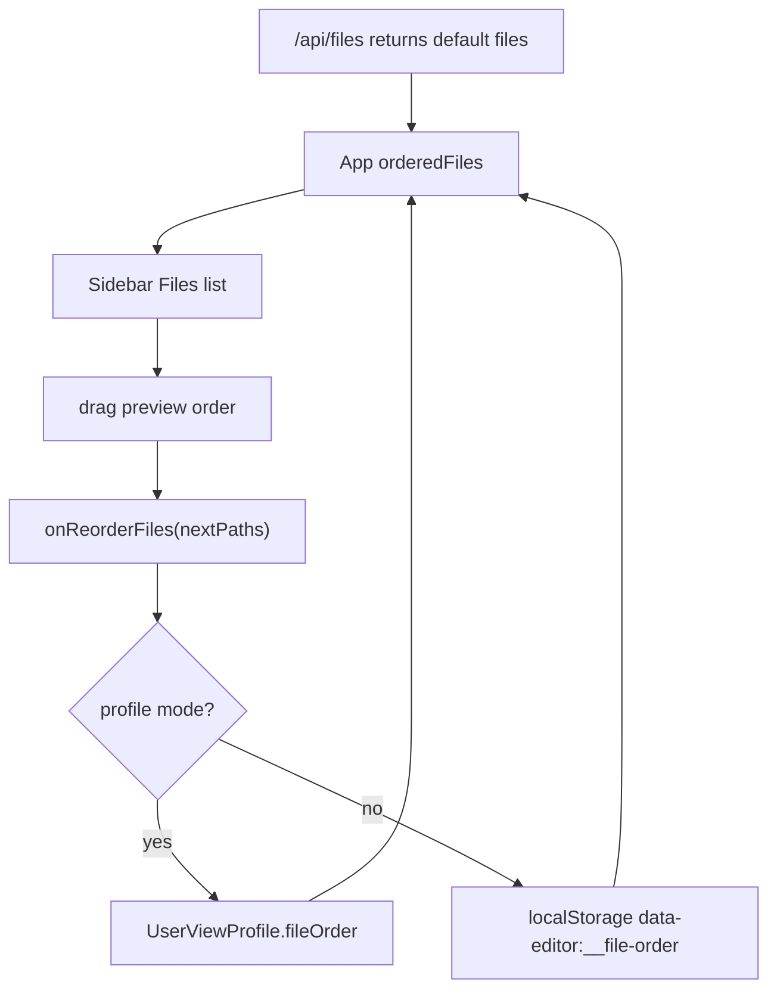

# 文件列表拖拽排序实施计划

## 方案概述

> **For agentic workers:** REQUIRED SUB-SKILL: Use `superpowers:subagent-driven-development` (recommended) or `superpowers:executing-plans` to implement this plan task-by-task. Steps use checkbox (`- [ ]`) syntax for tracking.

**Goal:** 让左侧 `Files` 数据文件列表支持整行拖拽自定义上下排序，并在 local/profile 视图偏好中持久化。

**Architecture:** 文件顺序属于侧边栏全局视图偏好，不属于单个 collection 的字段视图状态。排序算法放入独立纯函数模块，local 模式用独立 localStorage key 保存，profile 模式写入 `UserViewProfile.fileOrder` 顶层字段，`Sidebar` 只负责拖拽预览和提交完整 path 顺序。

**Tech Stack:** React 18, TypeScript, Vite, Node.js `node:test`, Playwright, browser localStorage, project view profile JSON.

### 总体目标和范围

本计划实现 `Files` 列表的拖拽排序体验，目标交互是“整行可拖拽”，对齐当前字段列头拖拽的直接操作感，不额外增加把手图标、不占用横向空间。

范围包含：

- 文件列表展示顺序的计算、拖拽预览和提交。
- local 模式与 profile 模式的排序持久化。
- 初始打开文件时使用归一化后的排序结果。
- 单元测试、类型检查、构建验证和最小 e2e 验证。

范围不包含：

- 不重命名或移动磁盘文件。
- 不修改 `/api/files` 服务端返回排序。
- 不把文件顺序写入项目共享 `ViewConfig`。
- 不让 `Reset view` 清除文件顺序；它仍只重置当前 collection 的字段视图。

### 各阶段任务概要

1. **排序纯函数阶段**：新增 `src/file-order.mjs`，用测试锁定去重、过滤旧文件、新文件追加和移动顺序。
2. **持久化阶段**：新增 local file order 独立读写 helper，扩展 profile 顶层 `fileOrder`，避免污染 collection-scoped view state。
3. **应用接入阶段**：`App.tsx` 统一计算 `orderedFiles`，初始打开和侧边栏展示都使用同一排序结果。
4. **交互阶段**：`Sidebar.tsx` 实现整行拖拽、移动阈值、拖拽预览和结束后吞 click。
5. **验证阶段**：补 e2e 覆盖刷新后顺序保持，运行 `npm test`、`npm run build`，必要时运行相关 Playwright 测试。

### 整体结构框架



---

## 文件职责

- Create: `src/file-order.mjs`
  - 负责文件顺序纯函数：`normalizeFileOrder()`、`moveFileToIndex()`。
- Create: `tests/file-order.test.mjs`
  - 覆盖文件顺序去重、过滤、追加、移动。
- Modify: `src/view-state-storage.mjs`
  - 新增 `readLocalFileOrder()` / `writeLocalFileOrder()`，保持 collection view state 的读写语义不变。
- Modify: `tests/view-state-storage.test.mjs`
  - 覆盖 local file order 独立持久化，并确认 collection reset 不清除文件顺序。
- Modify: `src/view-profile.mjs`
  - 顶层 profile 增加 `fileOrder`，加载和保存时归一化。
- Modify: `tests/view-profile.test.mjs`
  - 覆盖 profile `fileOrder` 保存、加载去重和非法值过滤。
- Modify: `src/api/client.ts`
  - 同步前端 `UserViewProfile` 类型。
- Modify: `src/App.tsx`
  - 计算 `orderedFiles`，按排序后首项打开文件，处理 `onReorderFiles()` 持久化。
- Modify: `src/components/Sidebar.tsx`
  - 文件项整行拖拽、阈值判定、预览顺序、拖拽结束提交。
- Modify: `src/styles.css`
  - 文件项拖拽态样式。
- Modify: `tests/data-editor.spec.ts`
  - 覆盖实际拖拽并刷新后验证顺序保持。

---

## Task 1: 文件顺序纯函数

**Files:**

- Create: `src/file-order.mjs`
- Create: `tests/file-order.test.mjs`

- [ ] **Step 1: 写失败测试**

Create `tests/file-order.test.mjs`:

```js
import test from "node:test";
import assert from "node:assert/strict";
import { moveFileToIndex, normalizeFileOrder } from "../src/file-order.mjs";

test("normalizeFileOrder keeps saved files, drops missing files, de-duplicates, and appends new files", () => {
  const files = ["data/affixes.json", "data/classes.json", "data/skills.json", "data/traits.json"];
  const order = [
    "data/skills.json",
    "data/missing.json",
    "data/classes.json",
    "data/skills.json",
    "",
  ];

  assert.deepEqual(normalizeFileOrder(files, order), [
    "data/skills.json",
    "data/classes.json",
    "data/affixes.json",
    "data/traits.json",
  ]);
});

test("moveFileToIndex moves a file to the requested index", () => {
  assert.deepEqual(
    moveFileToIndex(["a.json", "b.json", "c.json", "d.json"], "d.json", 1),
    ["a.json", "d.json", "b.json", "c.json"],
  );
  assert.deepEqual(
    moveFileToIndex(["a.json", "b.json", "c.json", "d.json"], "b.json", 4),
    ["a.json", "c.json", "d.json", "b.json"],
  );
});

test("moveFileToIndex returns the original order when source is missing", () => {
  assert.deepEqual(
    moveFileToIndex(["a.json", "b.json"], "missing.json", 1),
    ["a.json", "b.json"],
  );
});

test("moveFileToIndex clamps out-of-range indexes", () => {
  assert.deepEqual(
    moveFileToIndex(["a.json", "b.json", "c.json"], "b.json", -10),
    ["b.json", "a.json", "c.json"],
  );
  assert.deepEqual(
    moveFileToIndex(["a.json", "b.json", "c.json"], "b.json", 99),
    ["a.json", "c.json", "b.json"],
  );
});
```

- [ ] **Step 2: 运行测试确认失败**

Run:

```powershell
node --test tests/file-order.test.mjs
```

Expected: FAIL，原因是 `src/file-order.mjs` 不存在或未导出 `normalizeFileOrder` / `moveFileToIndex`。

- [ ] **Step 3: 实现最小纯函数**

Create `src/file-order.mjs`:

```js
export function normalizeFileOrder(files, order) {
  const fileSet = new Set(files);
  const seen = new Set();
  const known = [];
  for (const item of Array.isArray(order) ? order : []) {
    if (typeof item !== "string") continue;
    const value = item.trim();
    if (!value || !fileSet.has(value) || seen.has(value)) continue;
    seen.add(value);
    known.push(value);
  }
  return [...known, ...files.filter((file) => !seen.has(file))];
}

export function moveFileToIndex(order, sourcePath, targetIndex) {
  if (!order.includes(sourcePath)) return [...order];
  const withoutSource = order.filter((path) => path !== sourcePath);
  const numericIndex = Number(targetIndex);
  const safeIndex = Number.isFinite(numericIndex) ? Math.trunc(numericIndex) : withoutSource.length;
  const clampedIndex = Math.max(0, Math.min(withoutSource.length, safeIndex));
  return [
    ...withoutSource.slice(0, clampedIndex),
    sourcePath,
    ...withoutSource.slice(clampedIndex),
  ];
}
```

- [ ] **Step 4: 运行测试确认通过**

Run:

```powershell
node --test tests/file-order.test.mjs
```

Expected: PASS。

---

## Task 2: local file order 独立持久化

**Files:**

- Modify: `src/view-state-storage.mjs`
- Modify: `tests/view-state-storage.test.mjs`

- [ ] **Step 1: 写失败测试**

Append to `tests/view-state-storage.test.mjs`:

```js
test("local file order uses an independent storage key", () => {
  const storage = createMemoryStorage({
    "data-editor:__file-order": "data/skills.json,data/classes.json",
    "data-editor:data/runes.json:$:__order": "description,rune_name",
  });

  assert.deepEqual(readLocalFileOrder(storage), ["data/skills.json", "data/classes.json"]);

  writeLocalFileOrder(["data/traits.json", "data/skills.json"], storage);

  assert.equal(storage.getItem("data-editor:__file-order"), "data/traits.json,data/skills.json");
  assert.equal(storage.getItem("data-editor:data/runes.json:$:__order"), "description,rune_name");
});

test("collection reset does not clear local file order", () => {
  const storage = createMemoryStorage({
    "data-editor:__file-order": "data/skills.json,data/classes.json",
  });

  writeLocalViewState({
    path: "data/runes.json",
    collectionPath: "$",
    state: emptyLocalViewState(),
    localStorage: storage,
  });

  assert.equal(storage.getItem("data-editor:__file-order"), "data/skills.json,data/classes.json");
});
```

Update import in `tests/view-state-storage.test.mjs`:

```js
import {
  emptyLocalViewState,
  emptyCollectionViewState,
  readLocalFileOrder,
  readLocalViewState,
  readCollectionViewState,
  resetCollectionViewState,
  writeLocalFileOrder,
  writeLocalViewState,
} from "../src/view-state-storage.mjs";
```

- [ ] **Step 2: 运行测试确认失败**

Run:

```powershell
node --test tests/view-state-storage.test.mjs
```

Expected: FAIL，原因是 `readLocalFileOrder` / `writeLocalFileOrder` 未导出。

- [ ] **Step 3: 实现 local helper**

Modify `src/view-state-storage.mjs`:

```js
const fileOrderStorageKey = "data-editor:__file-order";
```

Add exports near existing local state helpers:

```js
export function readLocalFileOrder(localStorage) {
  return (localStorage.getItem(fileOrderStorageKey) ?? "")
    .split(",")
    .map((item) => item.trim())
    .filter(Boolean);
}

export function writeLocalFileOrder(order, localStorage) {
  const value = Array.isArray(order)
    ? order.map((item) => String(item).trim()).filter(Boolean).join(",")
    : "";
  if (value) {
    localStorage.setItem(fileOrderStorageKey, value);
  } else {
    localStorage.removeItem(fileOrderStorageKey);
  }
}
```

Do not modify `emptyCollectionViewState()`, `emptyLocalViewState()`, `readLocalViewState()` or `writeLocalViewState()` to include `fileOrder`.

- [ ] **Step 4: 运行测试确认通过**

Run:

```powershell
node --test tests/view-state-storage.test.mjs
```

Expected: PASS。

---

## Task 3: profile 顶层 fileOrder

**Files:**

- Modify: `src/view-profile.mjs`
- Modify: `tests/view-profile.test.mjs`
- Modify: `src/api/client.ts`

- [ ] **Step 1: 写失败测试**

Modify `tests/view-profile.test.mjs` in `saveViewProfile writes normalized profile file` so the saved profile includes:

```js
fileOrder: ["data/skills.json", "data/classes.json", "data/skills.json", ""],
```

Expected stored result includes:

```js
fileOrder: ["data/skills.json", "data/classes.json"],
```

Append a load normalization assertion in `loadViewProfile de-duplicates repeated order fields` input JSON:

```js
fileOrder: ["data/traits.json", "data/traits.json", "", 12, "data/skills.json"],
```

And assert:

```js
assert.deepEqual(profile.fileOrder, ["data/traits.json", "data/skills.json"]);
```

- [ ] **Step 2: 运行测试确认失败**

Run:

```powershell
node --test tests/view-profile.test.mjs
```

Expected: FAIL，原因是 profile 结果缺少 `fileOrder` 或未归一化。

- [ ] **Step 3: 实现 profile 归一化**

Modify `src/view-profile.mjs`:

```js
export function emptyViewProfile() {
  return {
    sidebarWidth: null,
    fileOrder: [],
    collections: {},
  };
}
```

Modify `normalizeViewProfile()` return:

```js
return {
  sidebarWidth: Number.isFinite(value.sidebarWidth) ? Math.round(value.sidebarWidth) : null,
  fileOrder: normalizeStringArray(value.fileOrder),
  collections,
};
```

Modify `src/api/client.ts` `UserViewProfile` type:

```ts
export type UserViewProfile = {
  sidebarWidth: number | null;
  fileOrder: string[];
  collections: Record<string, {
    hidden: string[];
    wrapped: string[];
    order: string[];
    detailOrder: string[];
    widths: Record<string, number>;
  }>;
};
```

- [ ] **Step 4: 运行测试和类型检查确认通过**

Run:

```powershell
node --test tests/view-profile.test.mjs
npm run typecheck
```

Expected: PASS。若 TypeScript 报 `fileOrder` 缺失，按 Task 4 修改 `App.tsx` 中创建 profile 的位置。

---

## Task 4: App 统一计算文件顺序和持久化入口

**Files:**

- Modify: `src/App.tsx`
- Modify: `src/view-state-storage.mjs`
- Test: `npm run typecheck`

- [ ] **Step 1: 修改 imports**

Modify `src/App.tsx` imports:

```ts
import { normalizeFileOrder } from "./file-order.mjs";
import {
  emptyLocalViewState,
  readCollectionViewState,
  readLocalFileOrder,
  readLocalViewState,
  writeLocalFileOrder,
  writeLocalViewState,
} from "./view-state-storage.mjs";
```

- [ ] **Step 2: 更新 empty user profile 和 clone profile**

Modify `emptyUserViewProfile()`:

```ts
function emptyUserViewProfile(): UserViewProfile {
  return { sidebarWidth: null, fileOrder: [], collections: {} };
}
```

Modify `mutateSelectedViewProfile()` clone object:

```ts
const next: UserViewProfile = {
  sidebarWidth: current.sidebarWidth,
  fileOrder: [...current.fileOrder],
  collections: Object.fromEntries(Object.entries(current.collections).map(([key, value]) => [
    key,
    {
      hidden: [...value.hidden],
      wrapped: [...value.wrapped],
      order: [...value.order],
      detailOrder: [...value.detailOrder],
      widths: { ...value.widths },
    },
  ])),
};
```

Modify `buildProfileFromCurrentView()` signature so callers explicitly provide the active file order:

```ts
function buildProfileFromCurrentView(
  path: string | null,
  collectionPath: string,
  fieldConfig: FieldConfig,
  sidebarWidth: number,
  fileOrder: string[],
): UserViewProfile {
```

Modify `buildProfileFromCurrentView()` return:

```ts
return {
  sidebarWidth,
  fileOrder: [...fileOrder],
  collections: {
    [collectionConfigKey(path, collectionPath)]: {
      hidden: [...fieldConfig.hidden],
      wrapped: [...fieldConfig.wrapped],
      order: [...fieldConfig.order],
      detailOrder: [...fieldConfig.detailOrder],
      widths: { ...fieldConfig.widths },
    },
  },
};
```

For the `!path` branch:

```ts
if (!path) return { sidebarWidth, fileOrder: [...fileOrder], collections: {} };
```

Modify `handleCreateViewProfile()` before calling `buildProfileFromCurrentView()`:

```ts
const activeFileOrder = selectedViewProfileName
  ? selectedViewProfile.fileOrder
  : readLocalFileOrder(window.localStorage);
```

Pass `activeFileOrder` into `buildProfileFromCurrentView()`:

```ts
const profile = buildProfileFromCurrentView(selectedPath, collectionPath, {
  ...fieldConfig,
  hidden: new Set(activeSnapshot.hidden),
  wrapped: new Set(activeSnapshot.wrapped),
  widths: { ...activeSnapshot.widths },
  order: [...activeSnapshot.order],
  detailOrder: [...activeSnapshot.detailOrder],
}, activeSnapshot.sidebarWidth ?? sidebarWidth, activeFileOrder);
```

- [ ] **Step 3: 计算 orderedFiles**

Add near existing derived state in `App()` after profile state is available:

```ts
const fileOrder = selectedViewProfileName
  ? selectedViewProfile.fileOrder
  : readLocalFileOrder(window.localStorage);
const orderedFilePaths = normalizeFileOrder(files.map((file) => file.path), fileOrder);
const orderedFiles = orderedFilePaths
  .map((path) => files.find((file) => file.path === path))
  .filter((file): file is DataFile => Boolean(file));
```

Use `orderedFiles` instead of `files` for both `Sidebar` renders.

- [ ] **Step 4: 新增 reorder handler**

Add in `App()`:

```ts
function handleReorderFiles(nextOrder: string[]) {
  const normalized = normalizeFileOrder(files.map((file) => file.path), nextOrder);
  if (mutateSelectedViewProfile((draft) => {
    draft.fileOrder = normalized;
  })) return;
  writeLocalFileOrder(normalized, window.localStorage);
  bump((value) => value + 1);
}
```

Pass to both `Sidebar` renders:

```tsx
onReorderFiles={handleReorderFiles}
```

- [ ] **Step 5: 初始打开使用排序后的第一个文件**

In `reloadProjectWorkspace()`, after loading `nextFiles`, compute from the current in-memory profile or local order. Do not add another `loadViewProfile()` call here because the existing `selectedViewProfileName` effect already owns profile loading.

```ts
const nextOrder = selectedViewProfileNameRef.current
  ? selectedViewProfileRef.current.fileOrder
  : readLocalFileOrder(window.localStorage);
const nextOrderedPaths = normalizeFileOrder(nextFiles.map((file) => file.path), nextOrder);
```

Use:

```ts
if (nextOrderedPaths[0]) await openDocumentAt(nextOrderedPaths[0], "$", undefined, false, projectId);
```

When profile data is still loading and `selectedViewProfileRef.current.fileOrder` is empty, the first open may use server/default order. The later profile load should only reorder the list, not automatically switch the open document, because unexpected async document switching is worse than a one-time initial default.

- [ ] **Step 6: 运行类型检查**

Run:

```powershell
npm run typecheck
```

Expected: PASS。

---

## Task 5: Sidebar 整行拖拽交互

**Files:**

- Modify: `src/components/Sidebar.tsx`
- Modify: `src/styles.css`

- [ ] **Step 1: 扩展 props 和本地状态**

Modify `SidebarProps`:

```ts
onReorderFiles?: (paths: string[]) => void;
```

Add state in `Sidebar()`:

```ts
const [fileDragState, setFileDragState] = useState<{
  sourcePath: string;
  order: string[];
  dragging: boolean;
  suppressClick: boolean;
} | null>(null);
const fileDragStartRef = useRef<{ path: string; x: number; y: number } | null>(null);
```

Add derived list:

```ts
const renderedFiles = fileDragState?.dragging
  ? fileDragState.order.map((path) => props.files.find((file) => file.path === path)).filter((file): file is DataFile => Boolean(file))
  : props.files;
```

- [ ] **Step 2: 添加 pointer handlers**

Add helper functions in `Sidebar()`:

```ts
function beginFilePointer(event: React.PointerEvent<HTMLButtonElement>, path: string) {
  if (event.button !== 0) return;
  fileDragStartRef.current = { path, x: event.clientX, y: event.clientY };
  event.currentTarget.setPointerCapture(event.pointerId);
}

function moveFilePointer(event: React.PointerEvent<HTMLButtonElement>) {
  const start = fileDragStartRef.current;
  if (!start) return;
  const distance = Math.hypot(event.clientX - start.x, event.clientY - start.y);
  if (distance < 6 && !fileDragState?.dragging) return;
  event.preventDefault();

  const currentOrder = fileDragState?.order ?? props.files.map((file) => file.path);
  const target = document
    .elementFromPoint(event.clientX, event.clientY)
    ?.closest<HTMLButtonElement>("[data-file-path]");
  const targetPath = target?.dataset.filePath;
  const targetRect = target?.getBoundingClientRect();
  const targetBaseIndex = targetPath ? currentOrder.filter((path) => path !== start.path).indexOf(targetPath) : -1;
  const dropIndex = targetRect && targetBaseIndex >= 0
    ? targetBaseIndex + (event.clientY > targetRect.top + targetRect.height / 2 ? 1 : 0)
    : currentOrder.length;
  const nextOrder = moveFileToIndex(currentOrder, start.path, dropIndex);

  setFileDragState({
    sourcePath: start.path,
    order: nextOrder,
    dragging: true,
    suppressClick: true,
  });
}

function endFilePointer(event: React.PointerEvent<HTMLButtonElement>) {
  const state = fileDragState;
  fileDragStartRef.current = null;
  if (!state?.dragging) return;
  event.preventDefault();
  props.onReorderFiles?.(state.order);
  window.setTimeout(() => setFileDragState(null), 0);
}
```

Import:

```ts
import { moveFileToIndex } from "../file-order.mjs";
```

- [ ] **Step 3: 修改文件列表渲染**

Replace `props.files.map` with `renderedFiles.map` and update file button:

```tsx
<button
  className={`sidebar-item sidebar-file-item ${props.selectedPath === file.path ? "selected" : ""} ${fileDragState?.dragging && fileDragState.sourcePath === file.path ? "is-dragging" : ""}`}
  data-file-path={file.path}
  key={file.path}
  onClick={(event) => {
    if (fileDragState?.suppressClick) {
      event.preventDefault();
      return;
    }
    props.onSelectFile(file.path);
  }}
  onPointerDown={(event) => beginFilePointer(event, file.path)}
  onPointerMove={moveFilePointer}
  onPointerUp={endFilePointer}
  title={file.path}
  type="button"
>
  <Icon size={16} />
  <span>{file.displayPath ?? fileName}</span>
</button>
```

Add `useEffect` cleanup:

```ts
useEffect(() => {
  function cancelDrag() {
    fileDragStartRef.current = null;
    setFileDragState(null);
  }
  window.addEventListener("pointercancel", cancelDrag);
  return () => window.removeEventListener("pointercancel", cancelDrag);
}, []);
```

- [ ] **Step 4: 添加 CSS**

Modify `src/styles.css`:

```css
.sidebar-file-item {
  cursor: grab;
  user-select: none;
}

.sidebar-file-item:active,
.sidebar-file-item.is-dragging {
  cursor: grabbing;
}

.sidebar-file-item.is-dragging {
  opacity: 0.45;
}
```

- [ ] **Step 5: 运行类型检查**

Run:

```powershell
npm run typecheck
```

Expected: PASS。If TypeScript reports `React.PointerEvent` namespace issues, import `type PointerEvent as ReactPointerEvent` in `Sidebar.tsx` and use that type.

---

## Task 6: e2e 验证刷新后持久化

**Files:**

- Modify: `tests/data-editor.spec.ts`

- [ ] **Step 1: 写 e2e 测试**

Append to `tests/data-editor.spec.ts`:

```ts
test("file list order can be dragged and persists after reload", async ({ page }) => {
  await page.goto("/");
  await expect(page.locator('.sidebar-item[title="data/runes.json"]')).toContainText("runes.json");
  await expect(page.locator('.sidebar-item[title="data/skills.json"]')).toContainText("skills.json");

  const runes = page.locator('.sidebar-item[title="data/runes.json"]');
  const skills = page.locator('.sidebar-item[title="data/skills.json"]');
  const runesBox = await runes.boundingBox();
  const skillsBox = await skills.boundingBox();
  expect(runesBox).not.toBeNull();
  expect(skillsBox).not.toBeNull();

  await page.mouse.move(runesBox!.x + runesBox!.width / 2, runesBox!.y + runesBox!.height / 2);
  await page.mouse.down();
  await page.mouse.move(skillsBox!.x + skillsBox!.width / 2, skillsBox!.y + 2, { steps: 8 });
  await page.mouse.up();

  await expect.poll(async () => page.evaluate(() => localStorage.getItem("data-editor:__file-order"))).toContain("data/runes.json");
  await page.reload();

  const labels = await page.locator(".sidebar-section").first().locator(".sidebar-item").evaluateAll((items) =>
    items.map((item) => item.getAttribute("title")),
  );
  expect(labels.indexOf("data/runes.json")).toBeLessThan(labels.indexOf("data/skills.json"));
});
```

- [ ] **Step 2: 运行相关 e2e**

Run in PowerShell:

```powershell
npm run build
$env:DATA_EDITOR_E2E_PORT="8800"; npm run test:e2e -- --grep "file list order"
```

Expected: PASS。

After the command, clear the temporary environment variable if the shell session will be reused:

```powershell
Remove-Item Env:DATA_EDITOR_E2E_PORT
```

---

## Task 7: 全量验证和清理

**Files:**

- Verify all modified files.

- [ ] **Step 1: 运行单元测试和类型检查**

Run:

```powershell
npm test
```

Expected: PASS，包含 `node --test tests/*.test.mjs` 和 `tsc --noEmit`。

- [ ] **Step 2: 运行构建**

Run:

```powershell
npm run build
```

Expected: PASS，Vite build 完成且无 TypeScript 错误。

- [ ] **Step 3: 检查 diff whitespace**

Run:

```powershell
git diff --check
```

Expected: no output。

- [ ] **Step 4: 检查变更范围**

Run:

```powershell
git status --short
git diff -- src/file-order.mjs tests/file-order.test.mjs src/view-state-storage.mjs tests/view-state-storage.test.mjs src/view-profile.mjs tests/view-profile.test.mjs src/api/client.ts src/App.tsx src/components/Sidebar.tsx src/styles.css tests/data-editor.spec.ts docs/plans/2026-06-04-文件列表拖拽排序.md
```

Expected: diff 只包含本计划相关文件。

---

## 自检结果

- Spec coverage: 覆盖整行拖拽、local/profile 持久化、新增/删除文件归一化、初始打开顺序、刷新后保持、Reset view 不清除文件顺序。
- Placeholder scan: 本计划不包含未落实的占位说明或未定义的关键函数引用。
- Type consistency: `fileOrder` 统一为 `string[]`；local helper 名称统一为 `readLocalFileOrder` / `writeLocalFileOrder`；纯函数名称统一为 `normalizeFileOrder` / `moveFileToIndex`。

## 执行选项

Plan complete and saved to `docs/plans/2026-06-04-文件列表拖拽排序.md`. Two execution options:

1. **Subagent-Driven (recommended)** - 每个任务派发 fresh subagent，任务间 review，适合并行审查和降低单次上下文风险。
2. **Inline Execution** - 在当前会话按计划逐项执行，适合保持上下文连续和快速迭代。

请选择执行方式后再开始实现。
