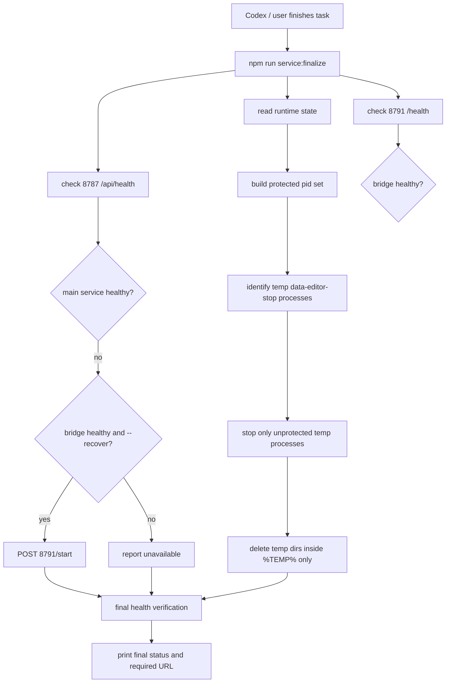

# 服务收尾与可用性保障方案

## 方案概述

### 总体目标和范围

本方案目标是把“Codex 处理完 data-editor 任务后不应导致服务不可用”落成仓库内可执行、可验证、可复用的收尾机制。它不只依赖人工记忆，而是通过脚本、命令和协作规则，把服务状态检查、临时资源清理、必要恢复和最终报告固定下来。

本阶段范围包括：

- 新增一个服务收尾脚本，用于检查 `8787` 主服务、`8791` recovery bridge、runtime state 和浏览器应使用的正式地址。
- 清理 data-editor 测试或临时验证遗留的安全可识别资源，包括 `%TEMP%\data-editor-stop-*` 临时目录和对应临时进程。
- 在主服务不可用但 recovery bridge 可用时，通过 bridge 自动恢复主服务。
- 在 `package.json` 中提供固定命令，让 Codex 和人工都能用同一入口执行状态检查和收尾。
- 在仓库根目录 `AGENTS.md` 中固化收尾规则；如果文件不存在则创建，明确何时必须执行服务收尾命令。
- 增加单元测试覆盖进程识别、保留列表、临时目录安全边界和恢复策略。

本阶段不包括：

- 不重构现有 `open.mjs` / `stop.mjs` / `recovery-bridge.mjs` 的核心生命周期模型。
- 不改变默认端口：主服务仍是 `8787`，recovery bridge 仍是 `8791`。
- 不引入常驻守护进程或系统服务。
- 不让脚本清理无法证明属于 data-editor 临时流程的任意 `node.exe` 进程。

### 各阶段任务概要

第一阶段：抽象服务收尾模型。

主要工作是新增独立的收尾逻辑模块，定义当前服务保留列表、临时进程识别、临时目录识别、health 检查和恢复动作。预期成果是所有危险操作都先经过可测试的计划结果，不直接在脚本里散写宽泛 `Stop-Process`。

第二阶段：实现 CLI 脚本。

主要工作是新增 `scripts/service-finalize.mjs`，支持 `--status`、`--cleanup`、`--recover`、`--json` 等参数。预期成果是用户和 Codex 可以通过一个命令得到明确状态：主服务 URL、主服务 PID、bridge PID、是否恢复、清理了多少临时进程和目录。

第三阶段：接入 npm 命令和协作规则。

主要工作是更新 `package.json`，新增 `service:status` 和 `service:finalize`；更新 `AGENTS.md`，要求凡是启动过临时端口、Browser、Playwright 或服务进程，收尾前必须执行 `npm run service:finalize`。预期成果是操作习惯从“事后记得检查”变为固定命令。

第四阶段：补测试和文档验证。

主要工作是补充 `node:test` 单元测试，覆盖临时进程识别、当前服务保护、目录安全边界、bridge 恢复分支和最终输出。预期成果是收尾工具可以在不真实杀进程的情况下验证核心决策。

执行顺序为：收尾模型 -> CLI 脚本 -> npm 脚本 -> AGENTS 规则 -> 单元测试 -> 实机验证。

### 整体结构框架



---

## 背景

当前 data-editor 已经具备主服务和 recovery bridge 两层生命周期：

- `server.mjs`：主服务，默认 `http://127.0.0.1:8787/`。
- `recovery-bridge.mjs`：恢复桥，默认 `http://127.0.0.1:8791/`。
- `%APPDATA%\data-editor\runtime\service.json`：当前主服务运行状态。
- `%APPDATA%\data-editor\runtime\controller.json`：controller 当前管理状态。
- `%APPDATA%\data-editor\runtime\recovery-bridge.json`：bridge 运行状态。

这次问题的直接原因是调试过程中启动了临时验证服务 `8899`，Browser 被切到 `http://127.0.0.1:8899/`，验证完成后临时服务被关闭，但 Browser 没有切回正式主服务 `8787`。用户看到的“服务关闭”实际是临时端口关闭造成的页面不可用。

清理残留进程时又暴露出另一个风险：如果清理脚本只依赖某一个 runtime state 文件，一旦该文件在恢复过程中短暂缺失或被刷新，就可能无法正确保护当前主服务 PID。因此收尾机制必须同时参考 health、runtime state 和进程身份，而不是单点判断。

---

## 目标

- Codex 每次处理完涉及 data-editor 服务、Browser、Playwright、临时端口或本地服务器的任务后，都能用同一命令完成收尾。
- 收尾命令可以自动恢复可恢复的主服务异常。
- 收尾命令不会误杀当前正式主服务和 recovery bridge。
- 收尾命令可以清理明确属于 data-editor 测试流程的残留进程和临时目录。
- 最终输出必须让用户知道当前应打开哪个 URL，以及主服务和 bridge 是否健康。
- 收尾逻辑可测试，避免把危险匹配逻辑散落在临时 PowerShell 命令中。

---

## 非目标

- 不把所有端口冲突都自动修复。发现未知服务占用 `8787` 或 `8791` 时，只报告，不杀进程。
- 不清理一般 `node.exe`、Vite、Playwright 或 Codex 自身 Node 进程。
- 不替代 `npm run stop` 的显式停机语义。
- 不让收尾脚本承担业务数据校验、保存、备份或视图状态修复。
- 不改变 Browser 插件行为；脚本只输出正式 URL，Codex 需要按规则把 Browser 切回该 URL。

---

## 推荐方案

采用“可测试收尾模块 + CLI 封装 + npm 命令 + AGENTS 规则”的方案。

新增一个纯逻辑模块负责判断，CLI 只负责执行判断结果。这样可以把最危险的部分，也就是“哪些进程可以停、哪些目录可以删、什么时候可以恢复服务”，用单元测试锁定。

关键原则是复用现有生命周期能力，不再复制一套身份判断：

- 主服务状态优先复用 `service-lifecycle.mjs` 的 `getMainServiceStatus()`。
- 主服务恢复优先通过 `recovery-bridge.mjs` 暴露的 `/start` / `/reopen`，不要绕过 controller 直接启动。
- 进程身份匹配复用 `stop.mjs` 的 `matchesServiceIdentity()` 和 `matchesRecoveryBridgeIdentity()`。
- 只有“收尾计划生成、端口监听 PID 读取、临时进程/目录筛选、最终摘要”放在新模块中。

### 新增文件

- `src/service-finalizer.mjs`
  - 纯逻辑和可注入依赖的执行函数。
  - 负责 health 检查、runtime state 读取、保护 PID 集合、临时进程筛选、临时目录筛选、恢复决策和最终摘要。
  - 必须复用 `service-lifecycle.mjs` 和 `stop.mjs` 中已有的状态和身份校验函数，不重新实现第二套服务身份判断。

- `scripts/service-finalize.mjs`
  - CLI 入口。
  - 解析参数并调用 `src/service-finalizer.mjs`。
  - 默认输出人类可读摘要；`--json` 输出机器可读结果。

- `tests/service-finalizer.test.mjs`
  - 单元测试，不真实杀进程。
  - 通过 mock 进程列表、mock 文件系统和 mock HTTP 请求验证决策。

### 修改文件

- `package.json`
  - 新增 `service:status` 和 `service:finalize`。

- `AGENTS.md`
  - 新增 data-editor 服务收尾规则；如果仓库根目录尚无该文件，则创建。

- `docs/02_快速开始.md`
  - 补充“任务收尾与服务可用性检查”小节。

- `docs/08_系统结构.md`
  - 补充 `service-finalizer` 在生命周期中的位置。

---

## CLI 设计

### 命令

```powershell
npm run service:status
npm run service:finalize
```

`package.json` 建议新增：

```json
{
  "scripts": {
    "service:status": "node scripts/service-finalize.mjs --status",
    "service:finalize": "node scripts/service-finalize.mjs --cleanup --recover"
  }
}
```

### 参数

- `--status`
  - 只检查状态，不停止进程，不删除目录，不恢复服务。
  - 第一版必须保持只读语义：不能调用会清理 runtime state 的状态函数。如果需要判断 stale state，只报告 `staleStateDetected: true`，不自动删除。

- `--cleanup`
  - 清理明确属于 data-editor stop 测试或临时流程的残留进程和目录。

- `--recover`
  - 当主服务不可用但 bridge 可用时，请求 bridge 恢复主服务。

- `--json`
  - 输出 JSON，便于测试和自动化读取。

- `--registry-home <path>`
  - 覆盖默认 `%APPDATA%\data-editor`。

- `--main-port <port>`
  - 默认 `8787`。

- `--bridge-port <port>`
  - 默认 `8791`。

- `--expected-url <url>`
  - 默认 `http://127.0.0.1:8787/`。

---

## 状态判定规则

### 主服务健康

主服务健康必须满足：

- `GET http://127.0.0.1:8787/api/health` 返回 JSON。
- JSON 中 `ok === true`。
- 返回的 `bridgePort` 与预期 bridge 端口一致，默认 `8791`。

### bridge 健康

bridge 健康必须满足：

- `GET http://127.0.0.1:8791/health` 返回 JSON。
- JSON 中 `ok === true`。

### 当前服务保护列表

保护 PID 集合来自三类证据：

1. runtime state：
   - `service.json.pid`
   - `controller.json.servicePid`
   - `controller.json.controllerPid`
   - `recovery-bridge.json.pid`

2. 端口监听：
   - 监听 `8787` 的 PID。
   - 监听 `8791` 的 PID。

3. 命令行身份：
   - `recovery-bridge.mjs --tool-root C:\Code\data-editor --port 8791`
   - `server.mjs --project <active project> --port 8787 --registry-home <registry home>`

只要一个 PID 被任一证据归入当前服务，就不得清理。

端口监听 PID 的实现必须显式落地：

- Windows 使用 PowerShell `Get-NetTCPConnection -LocalPort <port>` 读取 `OwningProcess`。
- 非 Windows 使用平台可用的 `lsof` / `ss` / `netstat`，如果不可用则返回“无法取得端口 PID”，并降级为只报告、不清理进程。
- 端口监听 PID 获取失败时，`--cleanup` 不能执行进程清理，只能执行目录清理和 health 报告。
- 端口监听 PID 与 runtime state 冲突时，默认保护两者，并把冲突写入最终报告。

### 可清理临时进程

可清理进程必须同时满足：

- 是 `node.exe`。
- 命令行包含 `%TEMP%\data-editor-stop-*`。
- 命令行匹配以下脚本之一：
  - `recovery-bridge.mjs`
  - `server.mjs`
  - `dev.mjs`
  - `node_modules\vite\bin\vite.js`
- PID 不在当前服务保护列表中。

不满足以上条件的进程只能报告，不能清理。

进程停止方式必须避免不受控树杀：

- 不允许直接对宽泛匹配结果执行 `taskkill /T /F`。
- 如果需要树杀，必须先枚举整棵子进程树，并确认树上每个 PID 都满足可清理条件且不在保护列表内。
- 第一版推荐逐 PID 停止，不使用树杀；对子进程残留只报告，不扩大清理范围。
- 每个被停止的 PID 必须进入 JSON 输出的 `stoppedProcesses` 列表，包含 `pid`、`reason`、`commandLine`。

### 可清理临时目录

可清理目录必须满足：

- 目录名匹配 `data-editor-stop-*`。
- 解析后的绝对路径位于 `[System.IO.Path]::GetTempPath()` 返回的系统临时目录内。
- 当前没有可见进程命令行引用该目录。

删除前必须先做绝对路径校验，避免递归删除越界。

---

## 恢复策略

### 自动恢复条件

只有满足以下条件时，`--recover` 才能自动恢复主服务：

- 主服务 health 不可用。
- bridge health 可用。
- bridge 端口等于预期 `8791`。
- `GET http://127.0.0.1:8791/status` 可用，且返回的 `servicePort`、`serviceMode` 与预期一致。
- `recovery-bridge.json` 和进程命令行能通过 `matchesRecoveryBridgeIdentity()` 校验，证明该 bridge 属于当前 `C:\Code\data-editor` 和当前 registry home。

恢复动作：

```http
POST http://127.0.0.1:8791/start
```

恢复后必须再次检查：

```http
GET http://127.0.0.1:8787/api/health
```

恢复动作不得直接调用 `startMainService()` 绕过 bridge。收尾工具只作为外部协调者，通过 bridge 请求恢复，让 controller 继续负责串行化启动、记录 `controller.json` 和维护 `lastExit`。

### 不自动恢复的情况

以下情况只报告，不处理：

- `8787` 被未知进程占用。
- `8791` 被未知进程占用。
- bridge 不健康。
- bridge `/status` 不可用或身份校验失败。
- runtime state 与端口监听 PID 冲突且无法通过身份校验证明归属。
- `service.json` 缺失，但端口 `8787` 有未知服务响应。

---

## Browser 收尾规则

CLI 无法直接控制 Codex in-app Browser，因此需要在 `AGENTS.md` 中固化协作规则：

当任务中出现以下任一行为时：

- 启动 `npm run dev`、`npm run start`、`node server.mjs` 或任意临时 HTTP 服务。
- 打开 Browser / Playwright 验证本地页面。
- 使用非 `8787` 的临时端口，例如 `8899`。
- 调用 `/api/shutdown`、`npm run stop` 或手动清理 data-editor 进程。

收尾必须执行：

```powershell
npm run service:finalize
```

并且最终 Browser 必须切回：

```text
http://127.0.0.1:8787/
```

最终回复必须报告：

- `8787/api/health` 结果。
- `8791/health` 结果。
- 当前正式 URL。
- 是否清理临时进程和目录。
- 如果启动过临时端口，明确说明该临时端口是否已关闭。

---

## 实施任务拆分

### Task 1: 新增服务收尾纯逻辑模块

**Files:**

- Create: `src/service-finalizer.mjs`
- Create: `tests/service-finalizer.test.mjs`

- [ ] **Step 1: 写保护列表和临时进程识别测试**

测试用例覆盖：

- runtime state 中的 `servicePid`、`controllerPid`、bridge PID 都会进入保护列表。
- 监听 `8787` / `8791` 的 PID 会进入保护列表。
- 端口监听 PID 获取失败时，进程清理计划整体降级为 skip。
- `data-editor-stop-*` 下的 `recovery-bridge.mjs` 可清理。
- `data-editor-stop-*` 下的 `server.mjs` 可清理。
- 当前 `servicePid` 不可清理。
- 普通 `node.exe` 不可清理。
- Codex Node kernel 不可清理。
- 子进程树中有任一 PID 不满足可清理条件时，不能执行树杀。

Run:

```powershell
node --test tests/service-finalizer.test.mjs
```

Expected:

```text
not ok
```

- [ ] **Step 2: 实现 `buildProtectedPids()`、`getListeningPids()` 和 `planProcessCleanup()`**

`buildProtectedPids()` 从 runtime state、端口监听结果和已识别当前服务进程中合并 PID。

`getListeningPids()` 负责按平台读取端口监听 PID。Windows 第一版使用 PowerShell `Get-NetTCPConnection`，并通过依赖注入测试解析逻辑。

`planProcessCleanup()` 只返回计划，不执行停止；第一版逐 PID 停止，不使用树杀。

- [ ] **Step 3: 运行测试确认通过**

Run:

```powershell
node --test tests/service-finalizer.test.mjs
```

Expected:

```text
ok
```

### Task 2: 新增临时目录安全清理计划

**Files:**

- Modify: `src/service-finalizer.mjs`
- Modify: `tests/service-finalizer.test.mjs`

- [ ] **Step 1: 写目录边界测试**

测试用例覆盖：

- `%TEMP%\data-editor-stop-abc` 可清理。
- `%TEMP%\other` 不可清理。
- 解析后不在 `%TEMP%` 内的路径不可清理。
- 被进程命令行引用的临时目录不可清理。

- [ ] **Step 2: 实现 `planTempDirectoryCleanup()`**

函数只接收已解析路径和进程命令行，不直接读系统目录。

- [ ] **Step 3: 运行测试确认通过**

Run:

```powershell
node --test tests/service-finalizer.test.mjs
```

Expected:

```text
ok
```

### Task 3: 实现 health 检查与恢复策略

**Files:**

- Modify: `src/service-finalizer.mjs`
- Modify: `tests/service-finalizer.test.mjs`

- [ ] **Step 1: 写恢复决策测试**

测试用例覆盖：

- 主服务健康时不恢复。
- 主服务不健康且 bridge 健康时，`--recover` 会计划 `POST /start`。
- bridge 不健康时不恢复。
- bridge `/status` 不可用时不恢复。
- bridge 进程身份无法通过 `matchesRecoveryBridgeIdentity()` 时不恢复。
- 未传 `--recover` 时只报告不可用。

- [ ] **Step 2: 实现 `checkServiceHealth()` 和 `recoverMainServiceIfNeeded()`**

HTTP 请求依赖通过参数注入，便于单元测试。恢复前必须读取 `/status` 并复用 `matchesRecoveryBridgeIdentity()` 校验 bridge 归属。

- [ ] **Step 3: 运行测试确认通过**

Run:

```powershell
node --test tests/service-finalizer.test.mjs
```

Expected:

```text
ok
```

### Task 4: 实现 CLI 脚本

**Files:**

- Create: `scripts/service-finalize.mjs`
- Modify: `package.json`

- [ ] **Step 1: 新增 CLI 参数解析**

支持：

```text
--status
--cleanup
--recover
--json
--registry-home
--main-port
--bridge-port
--expected-url
```

- [ ] **Step 2: 接入真实系统依赖**

CLI 负责：

- 读取 runtime state，但 `--status` 模式不得清理或改写 runtime state。
- 读取 Windows 进程列表。
- 读取端口监听 PID；如果读取失败，进程清理降级为 skip。
- 检查端口 health。
- 按计划逐 PID 停止临时进程；第一版不使用 `taskkill /T`。
- 按计划删除临时目录。
- 必要时请求 bridge 恢复。

- [ ] **Step 3: 新增 npm scripts**

`package.json` 增加：

```json
"service:status": "node scripts/service-finalize.mjs --status",
"service:finalize": "node scripts/service-finalize.mjs --cleanup --recover"
```

- [ ] **Step 4: 实机运行 status**

Run:

```powershell
npm run service:status
```

Expected:

```text
Main service: healthy http://127.0.0.1:8787/
Recovery bridge: healthy http://127.0.0.1:8791/
```

### Task 5: 文档与协作规则落地

**Files:**

- Create or Modify: `AGENTS.md`
- Modify: `docs/02_快速开始.md`
- Modify: `docs/08_系统结构.md`

- [ ] **Step 1: 创建或更新 `AGENTS.md`**

新增“data-editor 服务收尾”规则：

```markdown
## data-editor 服务收尾

当任务中启动过本地服务、临时端口、Browser、Playwright，或执行过 stop/shutdown/进程清理时，结束前必须运行：

```powershell
npm run service:finalize
```

最终回复必须包含 `8787/api/health`、`8791/health`、正式 URL、清理结果。Browser 必须停留在 `http://127.0.0.1:8787/`，不得停留在临时验证端口。
```

- [ ] **Step 2: 更新快速开始文档**

在 `docs/02_快速开始.md` 增加收尾命令说明。

- [ ] **Step 3: 更新系统结构文档**

在 `docs/08_系统结构.md` 的服务生命周期部分增加 `service-finalizer` 位置。

### Task 6: 完整验证

**Files:**

- Modify: `tests/open-stop.test.mjs`

- [ ] **Step 1: 单元测试**

Run:

```powershell
node --test tests/service-finalizer.test.mjs
```

Expected:

```text
ok
```

- [ ] **Step 2: 全量 Node 测试**

Run:

```powershell
node --test tests/*.test.mjs
```

Expected:

```text
ok
```

- [ ] **Step 3: 类型检查**

Run:

```powershell
npm run typecheck
```

Expected:

```text
tsc --noEmit
```

Exit code must be `0`.

- [ ] **Step 4: 构建**

Run:

```powershell
npm run build
```

Expected:

```text
✓ built
```

- [ ] **Step 5: 实机服务收尾验证**

Run:

```powershell
npm run service:finalize
```

Expected:

```text
Main service: healthy http://127.0.0.1:8787/
Recovery bridge: healthy http://127.0.0.1:8791/
```

- [ ] **Step 6: 最小集成恢复测试**

在 `tests/open-stop.test.mjs` 中补一个集成测试，复用现有 open/bridge 测试 helper：

1. 启动 bridge 和主服务。
2. 杀掉主服务。
3. 运行 `node scripts/service-finalize.mjs --recover --json --registry-home <temp-home> --main-port <port> --bridge-port <bridgePort>`。
4. 确认主服务恢复。
5. 确认监听主服务端口的 PID 只有一个。

Run:

```powershell
node --test tests/open-stop.test.mjs
```

Expected:

```text
ok
```

---

## 风险与缓解

### 风险 1: 误杀当前主服务

原因：仅依赖 `service.json` 时，runtime state 可能短暂缺失或被恢复流程刷新。

缓解：

- 保护 PID 集合同时来自 runtime state、端口监听和命令行身份。
- 任何在 `8787` 或 `8791` 上监听的 PID 默认保护。
- 单元测试覆盖 `service.json` 缺失但端口监听存在的场景。
- 端口 PID 读取失败时跳过进程清理，不把“不知道”当作“安全”。
- 第一版不使用树杀；如未来启用树杀，必须先验证整棵进程树都属于可清理集合。

### 风险 2: 删除越界目录

原因：递归删除临时目录时路径解析不严谨。

缓解：

- 删除前必须用绝对路径确认目录位于系统 `%TEMP%` 内。
- 只删除目录名匹配 `data-editor-stop-*` 的目录。
- 被当前进程命令行引用的目录跳过。

### 风险 3: Browser 仍停在临时端口

原因：CLI 无法直接控制 Browser。

缓解：

- `service:finalize` 输出正式 URL。
- `AGENTS.md` 强制 Codex 在最终回复前把 Browser 切回 `8787`。
- 最终回复必须报告当前正式 URL。

### 风险 4: 自动恢复掩盖真实故障

原因：主服务崩溃后自动恢复可能让根因不明显。

缓解：

- 输出中保留 `recovered: true` 和 bridge 返回结果。
- 不删除服务日志。
- `controller.json.lastExit` 保留上一次退出状态。

### 风险 5: `service:status` 意外改变系统状态

原因：现有 `getMainServiceStatus()` 在发现无效 state 时会清理 runtime state，这与“只检查状态”的命令语义冲突。

缓解：

- `service:status` 第一版使用只读检查路径，不调用会清理 state 的函数。
- 如果发现 stale state，只报告 `staleStateDetected: true`。
- `service:finalize` 可以清理 stale state，但必须在输出中报告。

---

## 验证标准

本方案实施完成后，必须满足：

- `npm run service:status` 不改变系统状态，只报告服务和残留状态。
- `npm run service:finalize` 可以清理 `data-editor-stop-*` 残留资源。
- 当前 `8787` 主服务和 `8791` bridge 在收尾后仍健康。
- 如果主服务被停止但 bridge 仍健康，`npm run service:finalize` 可以恢复主服务。
- 如果 bridge 不健康，脚本只报告不可恢复，不做危险清理。
- 没有临时端口页面遗留给用户作为最终可用入口。
- JSON 输出至少覆盖以下状态：`healthy`、`recovered`、`unavailable`、`bridgeUnavailable`、`cleanupSkipped`、`cleanupPerformed`。

---

## 决策点

实施前需要确认以下决策：

1. 是否允许 `service:finalize` 默认携带 `--recover`。

   推荐允许。理由是该命令定位为任务收尾保障，主服务不可用但 bridge 可用时自动恢复符合用户预期。

2. 是否允许 `service:finalize` 默认清理 `%TEMP%\data-editor-stop-*`。

   推荐允许。理由是该目录来自测试和 stop 流程临时工具根，且会先做绝对路径与进程引用校验。

3. 是否允许 `service:finalize` 默认清理临时进程。

   推荐第一版只清理明确满足条件的单个 PID，不使用树杀；如果端口 PID 获取失败或保护列表不完整，则跳过进程清理并报告。理由是进程清理风险高于目录清理，第一版应保守。

4. 是否把 Browser 切回 `8787` 写入 `AGENTS.md`，而不是脚本。

   推荐写入 `AGENTS.md`。理由是 Browser 控制属于 Codex 会话能力，不是仓库 CLI 能稳定承担的职责。

5. 是否把此机制做成通用 `doctor` 命令。

   暂不推荐。当前目标是解决任务收尾导致服务不可用的问题，`doctor` 范围过大，容易把环境诊断、数据校验和生命周期管理混在一起。

---

## 后续方向

- 如果 `service:finalize` 稳定，可以把结果摘要接入 `open-data-editor` skill，使打开 data-editor 前后都走同一套状态检查。
- 可以在 e2e 测试结束钩子中调用 `service:finalize --status --json`，只报告不清理。
- 可以在 `docs/09_当前限制与后续方向.md` 记录“CLI 无法直接保证 Browser URL”的边界，并把 Browser 收尾继续交给 Codex 协作规则。
