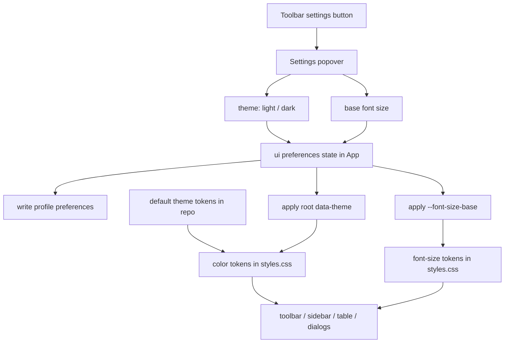

# 主题与基础字号设置方案

## 方案概述

### 总体目标和范围

本方案目标是为 data-editor 增加一套可持续扩展的外观设置能力，让用户可以在工具栏中直接切换主题和调整基础字号，并且这两个设置都能稳定持久化。其中默认主题样式作为仓库内全局配置维护；当用户选中了个人 profile 时，当前选择的主题、基础字号以及未来主题内颜色覆盖值持久化到该 profile 文件（例如 `Lans.json`）；当用户未选中 profile 时，则只保存在浏览器本地偏好中，不参与同步或上传。

本阶段范围包括：

- 在保存按钮右侧新增设置图标，点击后弹出设置浮框。
- 在浮框中提供主题切换能力，至少包含 `浅色` 和 `深色` 两种主题。
- 在浮框中提供基础字号设置能力，允许调整编辑器的全局基础字号。
- 将主题选择、基础字号和未来主题覆盖值在 profile 模式下持久化到个人配置文件，在无 profile 模式下持久化到浏览器本地偏好，使刷新页面后仍然保留。
- 抽离核心颜色和字号为样式 token，避免继续依赖分散的硬编码颜色和字号。
- 让基础字号变化实际影响编辑器主要界面，而不是只改根节点 `font-size` 却对大量显式字号无效。
- 增加自动化测试，覆盖设置浮框展示、主题持久化、字号持久化和关键界面生效。

本阶段不包括：

- 不把个人主题选择、基础字号或未来主题覆盖值同步到团队共享配置或 shared views。
- 不引入第三种主题或高对比度模式。
- 不在这一轮把所有颜色和字号都彻底重构为完整设计系统；优先覆盖主界面和高频交互区域。
- 不在这一轮处理用户自定义主题新建、颜色拾取器、字体家族切换或细粒度组件级字号覆盖。

### 各阶段任务概要

第一阶段：建立全局外观偏好模型。

主要工作是新增一组独立于 collection view-state 的 UI 偏好读写逻辑，定义默认主题 token、个人主题选择、基础字号和未来主题覆盖值的数据结构。预期成果是“默认样式”和“个人偏好”边界清楚：默认主题由仓库维护；profile 模式下个人选择和覆盖值由当前 profile 文件维护；无 profile 模式下只保存在浏览器本地。

第二阶段：接入工具栏设置入口。

主要工作是在保存按钮右侧增加设置图标，并使用现有浮框模式实现一个轻量设置面板。预期成果是用户可以在当前工具栏直接完成主题和字号切换，不需要进入其他对话框。

第三阶段：建立主题和字号 token。

主要工作是在 `styles.css` 顶部定义颜色 token 和字号 token，并通过根节点属性驱动浅色/深色切换与字号缩放。预期成果是主题切换和字号调整都通过变量统一生效，而不是逐个组件写临时分支。

第四阶段：替换核心界面样式。

主要工作是把工具栏、侧栏、view tabs、主表格、菜单弹层、detail panel、对话框等高频界面的颜色和字号改为引用 token。预期成果是编辑器主要可见区域在切换主题和字号后都有一致反馈。

第五阶段：补测试与回归验证。

主要工作是增加最小 e2e 和静态测试，覆盖设置入口、个人配置持久化、主题切换和字号变化。预期成果是后续继续调主题时不会把入口、持久化或字号联动打坏。

执行顺序为：偏好模型 -> 设置入口 -> token 层 -> 核心界面替换 -> 测试验证。

### 整体结构框架



---

## 现状调查结论

当前编辑器还没有“主题”这个概念，只有一套默认浅色样式，并且颜色大多直接硬编码在 `src/styles.css` 中。

这次调查的关键结论如下：

- `src/styles.css` 顶部只有一组默认浅色背景和文字设置，没有 `data-theme`、theme class 或深色变量集。
- 当前样式文件中存在大量颜色字面量，无法通过增加一个简单开关就完成主题切换。
- 根节点现在有 `font-size: 14px`，但样式文件里还存在大量显式 `12px`、`13px`、`16px`、`20px` 等字号。
- 因此，单独修改根字号并不能让“基础字号设置”真正生效；必须把主要字号改为依赖统一 token。
- 工具栏入口位于 `src/components/Toolbar.tsx`，保存按钮右侧已经有刷新和关闭按钮，适合插入设置按钮。
- 全局页面入口在 `src/App.tsx`，适合作为 UI 偏好状态的持有者。
- 当前仓库已经有 profile 和 localStorage 两种持久化路径，但现有 localStorage key 都服务于 view-state、shared view、sidebar/detail 宽度，尚无“默认主题全局定义 + 个人外观偏好文件”这一层模型。

结论是：这次需求不适合用“临时加一个深色 class”和“直接改 `:root font-size`”的方式做补丁，而应补齐最小可用的主题和字号基础设施，并明确“全局默认主题”和“个人配置覆盖”两层边界。

---

## 设计原则

### 主题与字号必须解耦

主题切换只改变颜色和部分阴影、边框对比度，不改变基础字号。字号调整只改变字体层级，不改变主题。

### 默认主题属于全局配置，选择与覆盖属于个人偏好

这两个设置应作用于整个编辑器，而不是某个文件、某个 collection 或某个 shared view。因此推荐分成两层：

- 仓库内全局配置：
  - 默认 `light` / `dark` 主题 token
- 个人配置文件：
  - 当前激活主题
  - 基础字号
  - 未来主题颜色覆盖值

因此它们不应写入：

- `shared views`
- `view-config.json`
- collection-scoped localStorage key 作为 source of truth

推荐写入当前个人 profile 文件，并继续沿用现有 `UserViewProfile` 主链路；只有在尚未进入 profile 模式时，才允许使用浏览器本地值作为临时 fallback。浏览器本地 fallback 只属于当前浏览器环境，不参与项目文件同步，也不应进入上传范围。

### 先统一 token，再做深色

深色主题不应直接在各个组件里写 `if dark then ...`。应先建立颜色 token 和字号 token，再在浅色和深色两套 token 之间切换。

### 第一版优先覆盖高频界面

第一版不追求全站每个角落都精修，但以下区域必须完成变量化并可见生效：

- 工具栏
- 侧栏
- view tabs / filter bar
- 数据表头和主要单元格
- 菜单弹层
- detail panel
- 常用对话框

---

## 推荐方案

### 1. 新增全局 UI 偏好模块

建议新增文件：

- `src/ui-preferences.mjs`

职责：

- 定义默认主题 id、基础字号默认值和主题覆盖值默认结构。
- 规范化输入值。
- 提供从 `UserViewProfile` 提取 `appearance` 的 helper。
- 提供把 `appearance` 合并回 `UserViewProfile` 的 helper。
- 提供无 profile 时的浏览器本地 fallback 读写 helper。

建议结构：

```ts
type UiTheme = "light" | "dark";

type UiPreferences = {
  activeThemeId: UiTheme;
  baseFontSize: number;
  themeOverrides?: {
    light?: Partial<ThemeTokenValues>;
    dark?: Partial<ThemeTokenValues>;
  };
};
```

建议默认主题 token 放在仓库内常量或样式 token 中，不进个人配置。

建议个人配置文件结构新增一个顶层块，并直接扩展现有 `UserViewProfile`：

```ts
appearance?: UiPreferences;
```

建议浏览器 fallback key：

- `data-editor:ui-theme`
- `data-editor:ui-font-size`

但 fallback 只在未进入 profile 模式时使用，不作为长期真相，也不写入 profile 文件。

基础字号建议第一版先限制为 3 档离散值：

- `14`（默认）
- `15`
- `16`

这样更容易测试，也比 slider 更可控。

### 2. 在 App 持有全局 UI 偏好状态

在 `src/App.tsx` 中新增：

- `uiPreferences` state
- 初始化优先读取个人配置文件中的 `appearance`
- 无 profile 时回退到浏览器本地 fallback
- 修改时通过现有 `selectedViewProfile` / `commitProfileSave()` 主链路写回个人配置文件
- 在无 profile 模式下只写浏览器本地 fallback，不触发 `/api/view-profile`

同时将偏好投射到页面根节点：

- `document.documentElement.dataset.theme = uiPreferences.theme`
- `document.documentElement.style.setProperty("--font-size-base", ...)`

这样主题和字号都能从单一入口向下传播，同时保持“默认 token 全局定义、当前选择与覆盖值个人持有”的边界，并避免新增一条独立 profile 写回链路与现有 debounce 保存互相覆盖。

### 3. 在工具栏加入设置图标和浮框

在 `src/components/Toolbar.tsx` 中：

- 在保存按钮右侧新增一个设置 icon button。
- 点击后弹出一个轻量设置浮框。
- 建议继续使用项目已经在 `ViewTabs` / `ViewFilterBar` 使用的 Radix Popover，而不是新开对话框。

浮框结构建议：

- 主题
  - `浅色`
  - `深色`
- 基础字号
  - `14`
  - `15`
  - `16`

建议使用：

- 主题：segmented buttons 或单选组
- 字号：stepper / select

不建议：

- slider
- 输入任意数字

原因是第一版需要稳定、可回归，不需要无限制自由度。

### 4. 建立颜色和字号 token

在 `src/styles.css` 顶部建立统一 token。

颜色 token 建议至少包括：

- `--color-bg-app`
- `--color-bg-panel`
- `--color-bg-elevated`
- `--color-bg-hover`
- `--color-text-primary`
- `--color-text-muted`
- `--color-border`
- `--color-primary`
- `--color-primary-hover`
- `--color-primary-text`
- `--color-danger`
- `--color-danger-bg`
- `--color-warning`
- `--color-shadow`

字号 token 建议包括：

- `--font-size-base`
- `--font-size-xs`
- `--font-size-sm`
- `--font-size-md`
- `--font-size-lg`
- `--font-size-xl`

建议映射关系：

```css
:root {
  --font-size-base: 14px;
  --font-size-xs: calc(var(--font-size-base) * 0.8571);
  --font-size-sm: calc(var(--font-size-base) * 0.9286);
  --font-size-md: var(--font-size-base);
  --font-size-lg: calc(var(--font-size-base) * 1.1429);
  --font-size-xl: calc(var(--font-size-base) * 1.4286);
}
```

这样当前的大多数 `12 / 13 / 14 / 16 / 20` 可以无损迁移到 token。

### 5. 深色主题第一版策略

第一版深色主题建议自动生成一版“稳态 dark”，目标是先可用，再迭代。

推荐视觉方向：

- app 背景：深石墨或深灰蓝
- panel 背景：比 app 稍亮一层
- elevated 浮层：再亮一层
- primary text：接近白但不要纯白
- muted text：中低对比灰
- border：低对比冷灰
- primary action：沿用现有蓝色语义，但略降低刺眼度

第一版重点是：

- 可读性
- 层级清楚
- 表格、输入框、弹层和按钮不会塌

第一版不要求：

- 视觉极致
- 每个状态色都完全打磨到位

### 6. 主题默认值与个人覆盖值并存

推荐模型是：

- `light` 和 `dark` 的默认 token 由仓库内样式或常量定义。
- 用户当前只选择激活哪一个默认主题。
- 如果后续支持“调这个主题里的某几个颜色”，这些修改只写入个人配置文件中的 `themeOverrides`，不反向改仓库默认主题。

这样后续扩展时：

- 团队仍然共享同一套默认主题定义。
- 每个人可以在默认主题之上叠加自己的细调。

---

## 样式迁移范围

### 第一批必须迁移到 token 的区域

- `:root`
- `body`
- `.workspace`
- `.toolbar`
- `.sidebar`
- `.view-tabs`
- `.menu-content`
- `.primary-button`
- `.ghost-button`
- `.icon-button`
- `.column-header`
- `.column-trigger`
- `.data-table`
- `.detail-panel`
- `.dialog-content`

### 第二批建议迁移的区域

- filter chips
- relation maintenance panel
- hidden fields panel
- project switcher
- primary key candidate banner
- nested editors

### 第三批可后续补齐的区域

- 低频空状态页
- 极少使用的说明文本
- 某些异常提示面板

---

## 持久化策略

推荐以当前个人 profile 文件为主，浏览器本地只做 fallback。

原因：

- 主题和字号是个人偏好，不应影响团队其他人。
- 但它们又不只是浏览器缓存；你已经明确希望在 profile 模式下跟随个人配置文件，例如 `Lans.json`。
- 当前仓库已经有 profile / shared view / local view-state 的边界，这里应继续沿用“个人偏好进个人配置文件”的模式。
- 当用户未选中 profile 时，浏览器本地偏好继续生效，但它不进入项目文件，不参与同步，也不应被上传。

建议行为：

- 页面初始化时，若当前为 profile 模式，优先读取当前 profile 的 `appearance`。
- 如果还没有 profile 或 profile 中没有 `appearance`，再回退到浏览器本地 fallback。
- 用户调整后，若当前在 profile 模式，立即写回该 profile 文件。
- 用户调整后，若当前不在 profile 模式，只写浏览器本地 fallback。
- 刷新页面后自动恢复。
- 切换项目、切换文件不应重置主题或字号。
- 切换 profile 时，外观应跟随个人 profile 一起切换。

---

## 测试方案

### 单元/静态测试

建议新增或扩展测试覆盖：

- `ui-preferences` 默认值与 normalize 逻辑。
- profile 中 `appearance` 缺失或非法值时的回退逻辑。
- `App.tsx` 中工具栏 props 接线是否包含新设置状态。
- `styles.css` 是否包含 `data-theme` 和关键 token。

### e2e 测试

建议在 `tests/data-editor.spec.ts` 增加：

1. 工具栏设置按钮显示与顺序。
2. 点击设置按钮可打开浮框。
3. 切换到深色后根节点 `data-theme="dark"`。
4. 调整基础字号后当前 profile 配置中的 `appearance.baseFontSize` 更新。
5. 刷新页面后主题和字号保持。
6. 切换 profile 后主题和字号跟随该 profile 变化。
7. 主题切换不影响字号值。

可以通过以下方式断言字号生效：

- 读取工具栏文本或表头 trigger 的 `font-size`
- 或读取根节点 `--font-size-base`

推荐优先用 DOM computed style 断言一个可见元素的字号变化，这样更贴近用户感知。

---

## 风险与缓解

### 风险 1：只改根字号但界面变化很小

原因：当前大量字号是写死的 px。

缓解：

- 第一轮必须把核心 `font-size` 改为 token 引用。
- 不接受“只改 `:root` font-size”作为完成标准。

### 风险 2：深色主题切换后局部区域颜色失配

原因：颜色字面量太多，第一版不可能一次清零。

缓解：

- 先覆盖高频界面。
- 通过 e2e 和手动检查把明显炸裂区域先收口。
- 允许第一版 deep corners 后续迭代。

### 风险 3：个人偏好写错边界

原因：仓库已有 shared view、project view config、profile、localStorage 多种持久化通道。

缓解：

- 独立新建 `ui-preferences` 模块。
- 明确默认主题 token 不写进 profile。
- 明确个人选择和覆盖值只写进 profile 的 `appearance`。
- 明确 profile 写回仍复用 `selectedViewProfile` 和 `commitProfileSave()` 主链路。
- 明确无 profile 时只写浏览器本地 fallback，不同步、不上传。
- `shared views`、`view-config.json` 仍然不承载这类偏好。

### 风险 4：浮框入口把工具栏挤乱

原因：工具栏右侧已经有保存、刷新、关闭按钮。

缓解：

- 设置图标放在保存按钮右侧、刷新按钮左侧。
- 先补一个顺序断言测试，避免后续位置漂移。

---

## 实施任务拆分

### Task 1：建立 UI 偏好存储模块

Files:

- Create: `src/ui-preferences.mjs`

输出：

- 默认值
- normalize
- read / merge profile appearance helper
- localStorage fallback

### Task 2：在 App 接入全局 UI 偏好

Files:

- Modify: `src/App.tsx`

输出：

- `uiPreferences` state
- 初始化读取 profile appearance
- 无 profile 时回退浏览器本地值
- 修改后优先持久化到 profile
- 根节点 `data-theme`
- 根节点 `--font-size-base`

### Task 3：在 Toolbar 增加设置浮框

Files:

- Modify: `src/components/Toolbar.tsx`
- Modify: `src/components/icons.ts`

输出：

- 设置按钮
- 主题切换控件
- 基础字号控件

### Task 4：将核心样式改为 token

Files:

- Modify: `src/styles.css`

输出：

- light / dark token
- font-size token
- 工具栏、侧栏、表格、弹层、detail panel 先接入

### Task 5：补测试与验证

Files:

- Modify: `tests/data-editor.spec.ts`
- 可选 Modify: `tests/view-state.test.mjs`

输出：

- 设置浮框可见性
- 主题持久化
- 字号持久化
- profile 切换联动
- 刷新后保持
- 主题切换不影响字号

---

## 验证标准

本方案落地完成后，必须满足：

- 保存按钮右侧存在设置图标。
- 点击设置图标可以打开设置浮框。
- 浮框中可以切换 `浅色 / 深色`。
- 浮框中可以调整基础字号。
- 主题切换后主界面核心区域可见变化明确。
- 基础字号调整后主界面主要文本尺寸可见变化明确。
- 刷新页面后主题和字号仍然保持。
- 切换个人 profile 后主题和字号能跟随 profile 变化。
- 主题切换不重置字号。
- 字号调整不改变主题。

---

## 决策建议

实施前建议确认以下决策：

1. 主题和字号是否以个人配置文件为主、浏览器本地为 fallback。

已确认采用。具体规则是：选中 profile 时写入当前 profile 文件，例如 `Lans.json`；未选中 profile 时仅保存在浏览器本地，不同步、不上传。

2. 第一版字号是否限制为固定档位。

已确认采用。具体档位为 `14`（默认）、`15`、`16`。理由是固定档位更稳定，也更容易做视觉回归和自动化断言。

3. 深色主题第一版是否接受“可用优先、细节后调”。

推荐接受。理由是当前样式硬编码较多，先建立 token 和可切换能力，比一次性视觉精修更重要。

4. 基础字号是否要求影响全站所有文本。

推荐第一版定义为“影响主界面核心文本和高频交互区域”，不要为了少量低频角落阻塞整体落地。

---

## 后续方向

- 如果这套 token 稳定，可以进一步把颜色和字号收敛成更完整的设计系统。
- 后续可以补“跟随系统主题”模式。
- 也可以在后续引入更细粒度的“紧凑 / 标准 / 舒展”密度设置，但不建议和这次主题/字号首版一起做。
