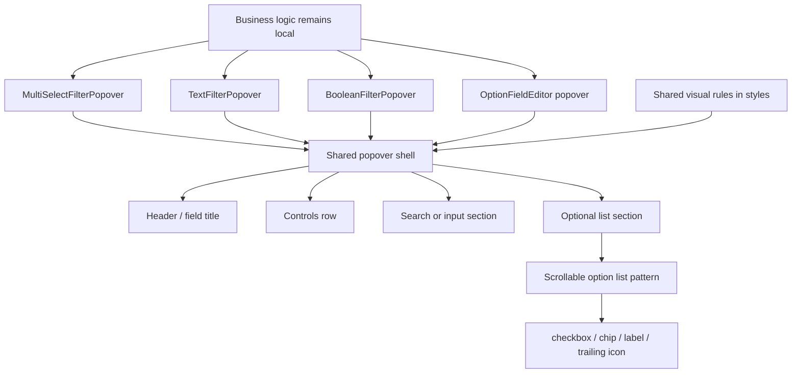

# 筛选与选项弹层视觉收敛方案

## 方案概述

### 总体目标和范围

本方案目标是将 data-editor 中当前分散的“筛选下拉”和“单选 / 多选选项弹层”收敛为一套更接近 Notion 的共享视觉语言。重点不是重写筛选逻辑或重构状态模型，而是在保留现有功能能力的前提下，统一浮层容器、顶部控制区、输入区、长列表滚动行为和选项行反馈，让这类弹层在视觉上更轻、更紧凑、更一致。

本阶段范围包括：

- 将当前筛选弹层改造成更接近 Notion 的轻量浮层样式。
- 保留筛选器现有的条件选择能力，例如当前已存在的 `包含任一`、`不包含`、`为空`、`不为空`、`包含`、`等于` 等，不弱化现有语义。
- 为长选项列表增加最大高度和内部滚动，避免弹层无限向下撑高页面。
- 为 `OptionFieldEditor` 支撑的 `single-select` / `multi-select` 弹层引入同一套共享视觉语言。
- 让表格单元格和右侧 detail panel 中复用的选项编辑弹层保持一致视觉。
- 统一输入区、列表区、选项行 hover / selected、checkbox / chip 对齐和留白节奏。
- 增加必要的自动化验证，覆盖筛选条件仍可用、长列表可滚动、详情面板和表格入口复用同一套弹层语言。

本阶段不包括：

- 不重写筛选数据结构，不改变筛选规则的语义。
- 不新增新的筛选能力或新的批量操作能力。
- 不在这一轮引入完整的全局设计系统或大规模组件拆分。
- 不保留旧视觉和新视觉并存的兼容分支，直接收敛到新样式。
- 不把列菜单、字段类型菜单、颜色选择器等结构明显不同的菜单型浮层强行并入共享层。

### 各阶段任务概要

第一阶段：梳理当前弹层复用关系和边界。

主要工作是定位三类筛选弹层、`OptionFieldEditor`、`RelationCellEditor`、表格内入口和 detail panel 入口的调用链与现有样式复用面，明确哪些区域可以共享视觉语言，哪些区域只属于特定业务。预期成果是形成一份清晰的“共享层 / 业务层”边界，避免后续把不该统一的弹层硬塞到同一套样式里。

第二阶段：建立共享视觉层。

主要工作是拆出两层共享结构：第一层是适用于各类筛选和选项弹层的共享外壳；第二层是只适用于长选项列表场景的滚动列表模式。预期成果是后续筛选器和选项编辑器都能挂到共享层上，但不会把没有长列表的弹层硬套进错误结构。

第三阶段：优先改造筛选弹层。

主要工作是分别改造多选筛选、文本筛选和布尔筛选三类弹层。其中多选筛选采用完整的“条件区 + 输入 / 已选区 + 长列表滚动”结构；文本筛选采用“条件区 + 文本输入”结构；布尔筛选采用紧凑 choice list 结构。预期成果是筛选系统内部先达成一致视觉，而不是只优化单一场景。

第四阶段：迁移 single-select / multi-select 弹层。

主要工作是把 `OptionFieldEditor` 相关的单选 / 多选弹层迁入同一套共享外壳与长列表模式，统一弹层外壳、输入区、列表区、hover / selected 和滚动规则，但保留创建选项、重命名、删除、颜色设置等现有业务能力。并单独评估 `RelationCellEditor` 是否在本轮一并收敛，或仅作为受影响项纳入验证。预期成果是筛选弹层与选项编辑弹层在视觉上成为同一语言，而不是两个系统。

第五阶段：补测试与 Browser 回归验证。

主要工作是补最小必要的 e2e / 样式断言，并在本地 Browser 中验证筛选条件切换、列表滚动、详情面板入口复用和长内容场景。预期成果是后续继续调视觉时，筛选条件能力和长列表滚动行为不会被打坏。

执行顺序为：复用边界梳理 -> 共享视觉层建立 -> 筛选弹层落地 -> 选项编辑弹层迁移 -> 测试与 Browser 验证。

### 整体结构框架

---

## 现状调查结论

当前这类弹层已经存在局部复用，但视觉和结构层次还没有被明确收敛，而且不同筛选类型之间的结构差异比初看更大。

这次调查的关键结论如下：

- `OptionFieldEditor` 已经是 `single-select` / `multi-select` 的共享入口，表格和 detail panel 都在复用这套编辑器。
- `OptionFieldEditor` 的触发区使用共享的 `.multi-select-trigger` 样式，这说明视觉收敛优先应在共享层处理，而不是表格和 detail panel 各写一套分支。
- 筛选弹层并不是单一实现，至少包含 `MultiSelectFilterPopover`、`TextFilterPopover` 和 `BooleanFilterPopover` 三种结构；它们适合共享同一套外壳，但不适合被描述成完全相同的内部骨架。
- 当前多选筛选弹层和 `OptionFieldEditor` 都属于“顶部控制区 + 输入 / 已选区 + 长选项列表”的类型，适合共享同一套长列表模式。
- 当前文本筛选和布尔筛选没有长选项列表，它们更适合共享外壳、标题区、控制区和间距节奏，而不是共享列表 viewport。
- `RelationCellEditor` 当前也在复用 `.multi-select-popover` 外壳样式，因此即使不把它作为本轮主目标，也必须被纳入影响评估和验证边界。
- 当前筛选弹层的主要问题不是功能缺失，而是视觉层次不够清楚：条件区、输入区、列表区都较重且边界相似，多选长列表会把弹层拉得过长。
- 当前选项弹层虽然已有一定基础能力，但输入区、列表区、hover / selected 和滚动规则还没有与筛选器统一，因此整体产品观感不一致。
- 这轮适合做的是“共享外壳 + 长列表模式”收敛，不适合直接把所有下拉、菜单都并到同一个系统里。

---

## 目标视觉方向

本轮视觉目标建议明确为以下原则：

- 整体更接近 Notion 的轻量浮层，而不是传统表单配置弹窗。
- 浮层外壳使用较轻的白底、细边框和克制阴影，减少厚重的配置感。
- 顶部字段名和条件区更紧凑，条件 trigger 保持可见，但不应视觉喧宾夺主。
- 输入区应作为独立分层区域，和选项列表拉开结构层次。
- 列表区高度受控，长列表必须内部滚动，不能持续向下拉长页面。
- 选项行的 hover、selected、checkbox、chip 展示应更接近 Notion 的轻量反馈，而不是高对比控件堆叠。
- 单选 / 多选 / 筛选三类入口在视觉上应属于同一语言，但各自业务能力继续保留。

---

## 适用范围与边界

### 本轮纳入共享视觉层的对象

- `MultiSelectFilterPopover`
- `TextFilterPopover`
- `BooleanFilterPopover`
- `OptionFieldEditor` 支撑的 `single-select` / `multi-select` 选项弹层
- detail panel 中复用上述编辑器的入口
- `RelationCellEditor` 当前复用同一外壳类名，因此至少纳入影响评估和回归验证；是否同步做视觉收敛，放到实施阶段再决定

### 本轮不纳入共享视觉层的对象

- 纯 Radix Select 的通用下拉
- 列菜单、字段类型菜单、颜色选择器等结构不同的菜单型浮层

原因是这些对象的交互形态和信息结构不同；如果现在强行统一，只会让共享层混入过多特例，损害后续维护性。  
其中 `RelationCellEditor` 是一个边界案例：它当前复用了相同外壳样式，因此在实现阶段不能假装它与本轮无关，只能选择“显式纳入”或“临时拆开 class 再排除”。

---

## 共享视觉层设计

建议将共享层拆成两级，而不是继续用一个大而全的“统一骨架”描述所有弹层。

### 一级：Shared popover shell

负责统一：

- 浮层背景
- 边框
- 阴影
- 圆角
- 外层留白
- 与页面元素的距离
- 分区间距节奏

### 二级：Scrollable option list pattern

只适用于存在长选项列表的弹层，例如多选筛选和 `OptionFieldEditor`。

负责统一：

- 输入区或已选区与列表区的层次关系
- options viewport 的最大高度
- `overflow-y: auto`
- 列表底部留白
- 选项行密度
- checkbox / chip / 文本 / 右侧图标对齐
- hover / selected / active 态

### Shared shell 内部的通用分区

以下分区由一级壳层统一，但是否出现由各业务组件决定。

#### 1. Header

负责统一：

- 字段名或标题的字号和粗细
- 标题与右侧动作按钮的对齐
- 顶部信息密度

#### 2. Controls row

负责统一：

- 条件选择 trigger
- 附加动作按钮
- 小型下拉或二级控制入口

#### 3. Search / input section

负责统一：

- 输入框边框和焦点态
- placeholder 风格
- 与 header、列表区的垂直间距

共享层只负责“长什么样”和“如何滚动”，不负责业务逻辑；同时允许做小范围 DOM 结构重排，以接入共享分区，但不改变组件的业务状态和 API 边界。

---

## 筛选弹层改造方案

筛选弹层是本轮优先级最高的落地点，但必须按真实组件类型拆开处理。

### 1. 结构调整

建议将筛选系统拆成三类改造。

#### A. MultiSelectFilterPopover

建议重排为：

1. 顶部 header  
   显示字段名，并保留右上角附加动作入口。

2. 条件区  
   保留当前已有的 `包含任一`、`不包含`、`为空`、`不为空` 等能力，但用更轻量的 trigger 呈现。

3. 输入 / 已选区  
   独立为一层，承担搜索提示或已选值展示。

4. 选项列表区  
   独立为滚动 viewport，成为主体区域。

#### B. TextFilterPopover

建议结构为：

1. 顶部 header
2. 条件区
3. 文本输入区

它不需要长列表 viewport，但应共享同一外壳、标题排版、条件 trigger 和输入区风格。

#### C. BooleanFilterPopover

建议结构为：

1. 顶部 header
2. 紧凑 choice list

它不需要文本输入或长列表 viewport，但应共享同一外壳和按钮节奏。

### 2. 滚动策略

仅对带长列表的弹层采用“固定上部区块 + 内部列表滚动”的结构：

- 浮层整体有高度上限。
- header、条件区、输入区或已选区不滚动。
- 只有选项列表滚动。
- 列表底部保留留白，避免最后一项紧贴边界。

这样长列表场景下更接近 Notion 的使用体验，也避免页面整体被拉长。文本筛选和布尔筛选不强制引入滚动 viewport。

### 3. 条件能力保留原则

本轮必须保留：

- 当前条件选择能力本身。
- 条件 trigger 常显。
- 当前选中条件文案直接可见。
- 切换条件后的现有过滤语义不变。

本轮不应为了追求视觉极简，把条件功能折叠到隐藏菜单或移除。

---

## single-select / multi-select 弹层改造方案

这部分的目标不是重写交互，而是迁移到共享视觉层。

### 保留的现有能力

- 选中 / 取消选中
- 创建新选项
- 重命名选项
- 删除选项
- 设置颜色
- 已选 chip 展示

### 统一的视觉部分

- 浮层外壳
- 输入区层次
- 选项列表最大高度
- 选项行 hover / selected
- checkbox / chip / 文本对齐
- 滚动区行为

### 不统一的业务部分

- 筛选器特有的条件区
- 选项编辑器特有的删除 / 颜色操作
- multi-select 的已选 chip 删除交互
- single-select 的单选语义
- `RelationCellEditor` 的跳转和关系语义

也就是说，本轮采用“共用外壳和长列表模式，不共用业务”的策略。

---

## 代码结构建议

本轮不建议做重度组件拆分，但应建立一层轻量共享结构。

### 推荐方式

- 保留现有筛选组件和 `OptionFieldEditor` 业务逻辑
- 在样式层建立 `shared popover shell` 和 `scrollable option list pattern` 两层 class
- 视情况增加很薄的结构组件或局部包装层，用来统一 header / input / viewport 的布局
- 允许为接入共享层做小范围结构重排，但不改变业务状态模型和组件 API

### 责任边界

- 业务组件负责：条件、搜索值、选中值、创建 / 删除 / 重命名、提交逻辑
- 共享层负责：容器、分区、滚动、列表行密度、视觉反馈

这样能最大限度降低回归风险，也符合当前仓库“先收敛共享样式，再视需要轻量抽象”的演进路径。

---

## 实施步骤

### 第一阶段：复用边界梳理

主要工作：

- 定位三类筛选弹层实现入口
- 定位 `OptionFieldEditor`、`RelationCellEditor` 与 detail panel 的复用链
- 确认共享类名和当前结构分区

预期成果：

- 明确共享层覆盖面
- 排除不应纳入本轮统一的弹层

### 第二阶段：建立共享视觉层

主要工作：

- 抽出共享外壳样式
- 抽出仅供长列表使用的 viewport / option row 样式
- 抽出统一的输入区、header、controls row 节奏

预期成果：

- 形成一套可被多个弹层复用的视觉基础层

### 第三阶段：接入筛选弹层

主要工作：

- 分别调整多选、文本、布尔三类筛选弹层结构
- 保留条件区能力和删除规则入口 `FilterActionMenu`
- 仅为多选筛选限制列表高度并启用内部滚动

预期成果：

- 筛选系统内部先达到统一视觉

### 第四阶段：迁移选项编辑弹层

主要工作：

- 将 `single-select` / `multi-select` 弹层接入共享外壳和长列表模式
- 对齐输入区、列表区、hover、selected 和滚动规则
- 决定 `RelationCellEditor` 是同步纳入，还是先拆开 class 再仅做回归验证

预期成果：

- 同类弹层视觉语言统一

### 第五阶段：验证与收尾

主要工作：

- 补最小必要 e2e
- Browser 中验证真实视觉效果
- 检查表格和 detail panel 的复用一致性

预期成果：

- 共享视觉层稳定可用，不破坏现有功能

---

## 组件覆盖矩阵

- `MultiSelectFilterPopover`：shared shell + controls row + input / selected section + scrollable option list pattern
- `TextFilterPopover`：shared shell + controls row + input section
- `BooleanFilterPopover`：shared shell + compact choice list
- `OptionFieldEditor`：shared shell + input / selected section + scrollable option list pattern
- `RelationCellEditor`：本轮实施阶段明确决定是同步接入，还是拆开共享 class 后仅纳入回归验证

---

## 验证方案

至少需要覆盖以下验证点：

- 多选筛选、文本筛选、布尔筛选三类弹层都符合新的视觉层次
- 筛选弹层仍可切换条件
- 条件切换后过滤语义不变
- 搜索 / 输入区仍可用
- 长列表场景下弹层内部滚动正常
- 页面整体不会因长列表被持续撑高
- `FilterActionMenu` 删除当前筛选规则仍可用
- `single-select` / `multi-select` 弹层仍可选择、取消、创建、重命名、删除、设置颜色
- detail panel 与表格内入口样式一致
- `RelationCellEditor` 若未纳入本轮，也必须确认未被共享外壳改坏
- Browser 中 `http://127.0.0.1:8787/` 下实际观感符合方案目标

---

## 风险与控制

### 风险 1：共享层做过头，导致不同弹层被硬统一

控制方式：

- 只共享外壳与长列表模式，不共享业务状态
- 明确三类筛选不是完全相同结构
- 对 `RelationCellEditor` 明确做出“纳入”或“拆开后排除”的显式决策

### 风险 2：条件区被视觉收缩后，可发现性下降

控制方式：

- 条件 trigger 保持常显
- 当前条件文案直接展示
- 不将条件能力折叠到隐藏入口

### 风险 3：滚动层设置错误，导致输入区或顶部也跟着滚动

控制方式：

- 只让长列表型弹层的 options viewport 滚动
- header、条件区、输入区固定在弹层上部
- 文本筛选和布尔筛选不强行套入滚动结构

### 风险 4：现有 e2e 对弹层 DOM 结构过度敏感

控制方式：

- 尽量保留关键语义类名或稳定定位点
- 必要时同步调整测试，而不是放任脆弱选择器失效

### 风险 5：视觉统一后，选项弹层的密度变化影响已有操作体验

控制方式：

- 先以筛选弹层为第一落点验证方向
- 再迁移 `OptionFieldEditor`，逐步扩大覆盖面

### 风险 6：文档目标和现有可用条件不一致，导致实施时误加新功能

控制方式：

- 文档中的条件示例只引用当前已存在的条件
- 本轮不因为视觉改造顺手扩展新的筛选语义

---

## 推荐落地策略

虽然本方案采用的是“方案 2”，但落地时仍建议分三步推进：

1. 先建立共享外壳，并优先接入三类筛选弹层。
2. 在 Browser 中确认筛选系统内部视觉一致后，再迁移 `OptionFieldEditor` 相关弹层。
3. 对 `RelationCellEditor` 做显式处理：要么一起接入，要么先拆开共享 class 后保持独立。

这样既能满足“做成共享视觉骨架”的方向，又能避免一上来同时改动所有入口导致回归面过大。

从收益和风险平衡看，这是当前最适合 data-editor 现阶段的收敛方式。
