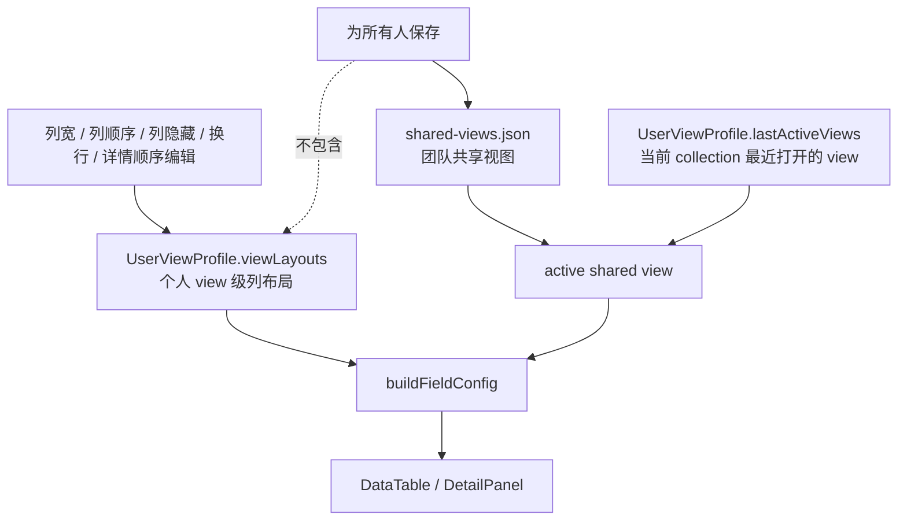

# 视图级个人列布局方案

## 方案概述

### 1. 总体目标和范围

本方案目标是在现有共享视图机制之上，把个人列布局偏好的作用域从“按 collection 保存”调整为“按 view 保存”。调整后，同一 `filePath + collectionPath` 下的不同共享 view，可以分别拥有当前用户自己的列宽、列顺序、列隐藏、换行和详情字段顺序；这些状态只保存在个人配置文件或本地模式缓存中，不进入团队共享视图配置。

范围包含：

- 每个共享 view 独立保存个人列布局：
  - `hidden`
  - `wrapped`
  - `order`
  - `detailOrder`
  - `widths`
- profile 模式下把上述状态保存到个人 profile 文件。
- local 模式下把上述状态保存到浏览器 localStorage。
- 旧 `collections` 个人列布局到新 `viewLayouts` 的一次性迁移。
- 视图切换时即时恢复当前 view 对应的个人列布局。
- 删除 view 时清理对应个人列布局残留。
- 文档、单测和必要 e2e 的同步更新。

范围不包含：

- 不把个人列布局纳入 `为所有人保存` 的共享发布范围。
- 不新增“个人列布局重置”独立交互入口，仍沿用现有布局编辑行为。
- 不做旧结构兼容双写；项目当前处于早期阶段，直接收敛到新模型。

### 2. 各阶段任务概要

1. **模型阶段**：把个人列布局存储从 collection 级改为 view 级，定义新的 `viewLayouts` 结构。
2. **持久化阶段**：重构 profile 和 localStorage 的读写入口，统一按 `collectionKey + viewId` 读写个人列布局。
3. **状态编排阶段**：调整 `App.tsx` 的 `buildFieldConfig` 和列布局事件入口，使其基于 active view 解析和写入布局。
4. **迁移阶段**：把旧 `collections` 个人列布局按确定规则迁移到某个目标 `viewId`，并确保保存后只输出新结构。
5. **清理阶段**：删除旧的 collection 级列布局入口与无效残留路径，避免双语义共存。
6. **验证阶段**：补充 view 切换恢复、profile 持久化、本地模式持久化、view 删除清理、迁移正确性和共享保存边界测试。
7. **文档阶段**：更新数据模型、系统结构和交互文档，确保共享视图与个人列布局职责边界一致。

执行顺序必须先锁定数据模型和状态流，再改 UI 使用链路，最后补测试和文档。这样可以避免交互层先改、底层模型再返工。

### 3. 整体结构框架



---

## 当前机制判断

当前仓库中，团队共享视图和个人列布局已经分离，但个人列布局仍是 collection 级：

- `CollectionView` 已表达团队共享 view 的 `query / filters / sorts`，并保留列布局字段作为 schema 字段。
- `UserViewProfile.viewDrafts` 和 `viewOrderDrafts` 已按 `collectionKey + viewId` 保存共享视图的个人 draft。
- 但 `UserViewProfile.collections` 仍按 `collectionKey` 保存：
  - `hidden`
  - `wrapped`
  - `order`
  - `detailOrder`
  - `widths`

现状导致的问题是：

1. 同一 collection 下所有 view 共用一套个人列布局。
2. 用户在 `构筑` view 隐藏某列，会影响 `物品`、`全部` 等其他 view。
3. 当前“共享 view 是 view 级、个人列布局却是 collection 级”的边界不一致，行为上容易让用户误判为 bug。

因此，本次调整的本质不是新增功能点，而是让“个人列布局”与“共享 view”拥有同样的作用域粒度。

---

## 目标语义

### 共享 view 仍然只负责团队共享状态

团队共享 view 继续只表达：

- `name`
- `query`
- `filters`
- `sorts`
- view tabs 顺序

`为所有人保存` 继续只覆盖共享视图配置，不带上个人列布局。

### 个人列布局改为 view 级

每个用户在每个共享 view 下，都有一份独立列布局。切换 view 时，表格和详情面板应即时切换到该 view 对应的个人布局。

### 列布局字段一并下沉，避免半套语义

虽然本次用户明确提出的是：

- 列宽
- 列顺序
- 列隐藏

但实现上建议同时把下列两个字段一起改成 view 级：

- `wrapped`
- `detailOrder`

理由：

1. 这两个字段本质上也是视图布局偏好。
2. 如果只下沉前三项，会形成“主表布局是 view 级，详情布局仍是 collection 级”的裂缝。
3. 现在一次性收敛，后续不会再重复调整 profile 结构。

---

## 数据模型调整

### 当前个人 profile 结构

```ts
type UserViewProfile = {
  sidebarWidth: number | null;
  detailPanelWidth: number | null;
  fileOrder: string[];
  lastActiveViews: Record<string, string>;
  viewDrafts: Record<string, Record<string, Partial<CollectionView>>>;
  viewOrderDrafts: Record<string, string[]>;
  collections: Record<string, {
    hidden: string[];
    wrapped: string[];
    order: string[];
    detailOrder: string[];
    widths: Record<string, number>;
  }>;
};
```

### 目标个人 profile 结构

```ts
type UserViewLayoutState = {
  hidden: string[];
  wrapped: string[];
  order: string[];
  detailOrder: string[];
  widths: Record<string, number>;
};

type UserViewProfile = {
  sidebarWidth: number | null;
  detailPanelWidth: number | null;
  fileOrder: string[];
  lastActiveViews: Record<string, string>;
  viewDrafts: Record<string, Record<string, Partial<CollectionView>>>;
  viewOrderDrafts: Record<string, string[]>;
  viewLayouts: Record<string, Record<string, UserViewLayoutState>>;
};
```

约束如下：

- 第一层 key：`collectionKey = <filePath>:<collectionPath>`
- 第二层 key：`viewId`
- `viewId` 必须使用共享 view 的稳定 id，不能使用 view 名称

示例：

```json
{
  "lastActiveViews": {
    "data/keywords.json:$": "build"
  },
  "viewLayouts": {
    "data/keywords.json:$": {
      "build": {
        "hidden": ["dev_status"],
        "wrapped": ["description"],
        "order": ["id", "name", "tags"],
        "detailOrder": ["name", "description", "tags"],
        "widths": {
          "name": 280,
          "tags": 220
        }
      },
      "items": {
        "hidden": [],
        "wrapped": [],
        "order": ["id", "dev_status", "name"],
        "detailOrder": [],
        "widths": {
          "dev_status": 120
        }
      }
    }
  }
}
```

### 旧 profile 迁移规则

当前已有用户 profile 会把个人列布局保存在旧的 `collections[collectionKey]` 中。方案不能简单删除旧字段，否则已有用户会丢失布局。

推荐迁移规则如下：

1. 读取旧 `collections[collectionKey]`。
2. 为该 collection 决定一个目标 `viewId`：
   - 优先使用 `lastActiveViews[collectionKey]`
   - 否则使用共享配置中的 `defaultViewId`
   - 否则使用该 collection 当前第一个共享 view
   - 如果该 collection 根本没有共享 view，则保留为空，不生成迁移结果
3. 把旧布局整体迁移到 `viewLayouts[collectionKey][viewId]`。
4. `normalizeViewProfile` 允许读旧结构并在内存中迁移，但 `saveViewProfile` 落盘时只输出新结构。

这个策略不是双写兼容，而是一次性吸收旧数据，之后系统内部和持久化输出都只认 `viewLayouts`。

---

## 持久化策略

## profile 模式

profile 模式下，个人列布局保存到：

```text
<project>/.data-editor/view-configs/<profile>.json
```

读写逻辑调整为：

- `loadViewProfile` / `normalizeViewProfile` 读取 `viewLayouts`
- `normalizeViewProfile` 负责把旧 `collections` 结构迁移到内存中的 `viewLayouts`
- `saveViewProfile` 只输出新结构，不再回写旧 `collections`

## local 模式

local 模式下，个人列布局保存在浏览器 localStorage。

当前 localStorage key 只按 `path + collectionPath` 区分；本方案调整后需要把 `viewId` 纳入 key，确保不同 view 的布局不互相覆盖。

推荐 key 形态：

```text
data-editor:<path>:<collectionPath>:<encodedViewId>:<fieldName>:hidden
data-editor:<path>:<collectionPath>:<encodedViewId>:<fieldName>:wrapped
data-editor:<path>:<collectionPath>:<encodedViewId>:<fieldName>:width
data-editor:<path>:<collectionPath>:<encodedViewId>:__order
data-editor:<path>:<collectionPath>:<encodedViewId>:__detail-order
```

其中：

- `encodedViewId = encodeURIComponent(viewId)`
- localStorage 的读取、扫描和清理都必须使用同一编码规则

这样可以避免 `viewId` 中出现特殊字符时破坏前缀扫描和后缀判定逻辑。

`sidebarWidth`、`detailPanelWidth` 和 `fileOrder` 仍保持原有个人全局或项目级语义，不需要下沉到 view。

---

## 应用状态与调用链调整

## 1. 当前 active view 解析

`App.tsx` 目前已经能稳定解析：

- 当前 collection 的共享 views
- 当前 active shared view
- 当前 active view draft

因此，列布局不需要重新发明一套 active view 机制，只需要复用现有 `activeSharedView?.id`。

## 2. FieldConfig 的来源改造

当前 `buildFieldConfig(...)` 通过 `readCollectionViewState(...)` 读取 collection 级列布局。

目标改成：

- 如果当前存在 `activeSharedView.id`
  - 读取 `readViewLayoutState(path, collectionPath, viewId, ...)`
- 如果当前没有 active view
  - 返回空布局状态，由 schema 自然排序和默认显示接管

这样做的结果是：

- 切换 view 时，`fieldConfig` 自动刷新
- `DataTable` 和 `DetailPanel` 不需要知道存储结构变化，只消费新的 `fieldConfig`

## 3. 列布局事件入口改造

以下入口都应从“写当前 collection”改成“写当前 active view 布局”：

- `handleHideField`
- `handleUnhideField`
- `handleUnhideAllFields`
- `handleToggleWrapField`
- `handleResizeField`
- `handleMoveField`
- `handleReorderFields`
- `handleReorderDetailFields`

推荐把现有 `updateActiveCollectionView(...)` 替换为更准确的：

```ts
updateActiveViewLayout(mutator)
```

其职责是：

- profile 模式：写 `selectedViewProfile.viewLayouts[collectionKey][viewId]`
- local 模式：写 localStorage 中该 `collectionKey + viewId` 的布局

## 4. 创建 profile 的快照逻辑

当前创建 profile 时，会把当前 collection 的列布局快照写入 profile。

调整后应改为：

- 如果当前存在 `activeSharedView.id`
  - 只写当前 collection 当前 active view 的布局快照
- 不主动为其他 view 生成布局

这样 profile 文件更干净，也避免凭空制造未使用 view 的个人状态。

---

## view 生命周期边界

### 新建 view

新建共享 view 后，个人列布局默认不存在。初次进入该 view 时：

- 表格使用默认字段顺序
- 不隐藏列
- 不设置额外列宽
- 不设置详情字段顺序

只有用户真的改动列布局后，才创建该 view 的个人布局记录。

这条规则需要明确视为产品语义，而不是暂时缺省行为：新建 view 不继承来源 view 的个人列布局。

### 重命名 view

重命名不影响个人列布局，因为个人布局按 `viewId` 建索引，不按 `view.name`。

### 删除 view

删除共享 view 时，必须同步清理：

- profile 中 `viewLayouts[collectionKey][viewId]`
- localStorage 中该 `collectionKey + viewId` 相关 key
- `viewDrafts[collectionKey][viewId]`
- 如果该 view 是 `lastActiveViews[collectionKey]`，则切换到新的 active view 并更新记录

### 复制 view

如果未来引入“创建视图副本”，建议默认只复制共享 view 的：

- `query`
- `filters`
- `sorts`

不自动复制个人列布局。个人列布局属于用户在目标 view 中后续自行调整的状态。

这意味着当前用户在复制 view 后会立即切换到新 view，而新 view 首次显示时使用默认列布局，而不是来源 view 的个人列布局。这条规则必须在实现和验收中保持一致，避免把“副本是共享语义副本”误做成“个人布局也一起复制”。

---

## 重置语义调整

当前系统中已经存在两个不同层级的“重置”行为，方案必须明确保留这种职责分离，不能在实施时混淆：

### 1. 筛选栏中的 `重置`

该入口继续只负责当前 active view 的共享 draft 重置，即：

- 清当前 active view 的 `query / filters / sorts` draft
- 清当前 collection 的 view 顺序 draft
- 不清个人列布局
- 不清 `sidebarWidth / detailPanelWidth`

也就是说，它对应的仍然是现有 `handleResetSharedViewDraft()` 语义，而不是全局布局重置。

### 2. 全局或视图级的“重置视图”

该入口负责个人布局重置，建议调整为：

- 清当前 active view 的个人列布局：
  - `hidden`
  - `wrapped`
  - `order`
  - `detailOrder`
  - `widths`
- 同时保留现有行为，重置 `sidebarWidth` 和 `detailPanelWidth`
- 不清共享 draft，避免与筛选栏中的 `重置` 语义重叠

这样可以保证：

1. 共享 draft 重置和个人布局重置各有明确入口。
2. 用户不会因为想撤回筛选排序草稿而把个人列布局一起抹掉。
3. 实现上能继续沿着现有 `handleResetView()` / `handleResetSharedViewDraft()` 两条职责边界演进。

---

## 与共享保存的职责边界

本方案需要继续维持下面这个原则：

- `为所有人保存` 只保存共享视图
- 个人列布局永远不进入团队共享配置

因此，虽然 `CollectionView` 类型里当前仍带有：

- `hidden`
- `wrapped`
- `order`
- `detailOrder`
- `widths`

但在本次正式实现中，这些字段应继续视为非当前共享发布链路的来源字段。共享保存仍以：

- `query`
- `filters`
- `sorts`
- view 顺序

为准。

如果后续要进一步清理 schema，可以考虑把共享 `CollectionView` 中这组列布局字段彻底移除；但这属于单独收口，不是本方案必须项。

---

## 风险与处理

### 风险 1：没有 active view 时无法定位个人布局

处理：

- 优先通过 `lastActiveViews[collectionKey]` 恢复 active view
- 如果共享配置里存在默认 view，则使用默认 view
- 如果 collection 当前没有任何 view，则列布局回退为空状态

### 风险 2：删除 view 后 profile 遗留孤儿布局

处理：

- 把布局清理逻辑并入现有 view 删除流程
- 单测覆盖 profile 和 localStorage 两条路径

### 风险 3：局部改字段，导致布局语义一半是 collection 级、一半是 view 级

处理：

- 一次性下沉 `hidden / wrapped / order / detailOrder / widths`
- 不接受只迁一部分字段的过渡状态

### 风险 4：profile 结构调整后测试覆盖不足

处理：

- 补 model / storage 单测
- 补至少一条真实交互 e2e，验证切 view 后列布局确实切换

### 风险 5：创建 profile 或切换 profile 时，用户误以为所有 view 布局都会一起迁入

处理：

- 明确 `创建 profile` 只快照当前 active view 的个人布局
- 不主动批量生成其他 view 的布局
- 在测试和文档中把这条行为写死，避免后续实现漂移

---

## 实施步骤

### 阶段一：模型与存储入口

1. 更新 `src/api/client.ts` 中的 `UserViewProfile` 类型
2. 更新 `src/view-profile.mjs` 的 `emptyViewProfile` 和 `normalizeViewProfile`
3. 新增 view 级布局辅助函数，例如：
   - `emptyViewLayoutState`
   - `readViewLayoutState`
   - `writeLocalViewLayoutState`
   - `resetViewLayoutState`

### 阶段二：迁移与本地存储

1. 在 `normalizeViewProfile` 中实现旧 `collections -> viewLayouts` 的一次性迁移
2. 为 localStorage 引入 `encodedViewId` 维度
3. 增补 `detailOrder` 的 localStorage 读写，因为当前链路尚未覆盖它

### 阶段三：应用状态编排

1. 在 `App.tsx` 中基于 `activeSharedView?.id` 解析当前个人布局
2. 用 `updateActiveViewLayout(...)` 替换 `updateActiveCollectionView(...)`
3. 更新 `buildFieldConfig(...)` 的输入参数和读取逻辑
4. 更新 profile 创建、profile 切换和本地模式写回路径

### 阶段四：清理与联动

1. 删除旧 `collections` 列布局相关代码路径
2. 把 view 删除流程接上布局清理
3. 明确 `handleResetView()` 和 `handleResetSharedViewDraft()` 的职责边界
4. 确认 `为所有人保存` 不受影响

### 阶段五：测试与文档

1. 更新 `tests/view-state.test.mjs`
2. 补充 view 切换列布局恢复测试
3. 补充 view 删除个人布局清理测试
4. 补充旧 profile 迁移测试、localStorage key 编码测试、`detailOrder` 本地持久化测试
5. 更新以下文档：
   - `docs/05_数据与配置模型.md`
   - `docs/04_信息架构与交互.md`
   - `docs/08_系统结构.md`

---

## 验收标准

满足以下条件即可认为方案完成：

1. 同一 collection 下两个不同 view 可以保存不同的列宽。
2. 同一 collection 下两个不同 view 可以保存不同的列顺序。
3. 同一 collection 下两个不同 view 可以保存不同的隐藏列集合。
4. 切换 view 后，主表和详情面板立即恢复对应个人布局。
5. 个人 profile 文件能看到按 `collectionKey -> viewId` 存储的布局。
6. local 模式下不同 view 的布局不会互相覆盖。
7. `为所有人保存` 不会把个人列布局写进共享配置。
8. 删除 view 后，对应个人布局被清理，不残留孤儿状态。
9. 旧 profile 中的 `collections` 布局会被稳定迁移到一个确定的 `viewId`，迁移后不丢失用户原有列布局。
10. 筛选栏中的 `重置` 不会清空个人列布局；布局重置入口也不会误清共享 draft。
11. 新建或复制 view 后，不会自动继承来源 view 的个人列布局。

---

## 推荐执行结论

推荐直接按本方案执行，不保留旧的 collection 级列布局结构，也不做双写兼容。

理由是：

1. 现有共享视图机制已经天然以 view 为核心作用域，个人列布局继续停留在 collection 级只会制造不一致。
2. 这类配置不是关键业务数据，迁移成本和回滚风险都低。
3. 项目当前明确允许清理旧机制，不需要为过渡态付出额外复杂度。
