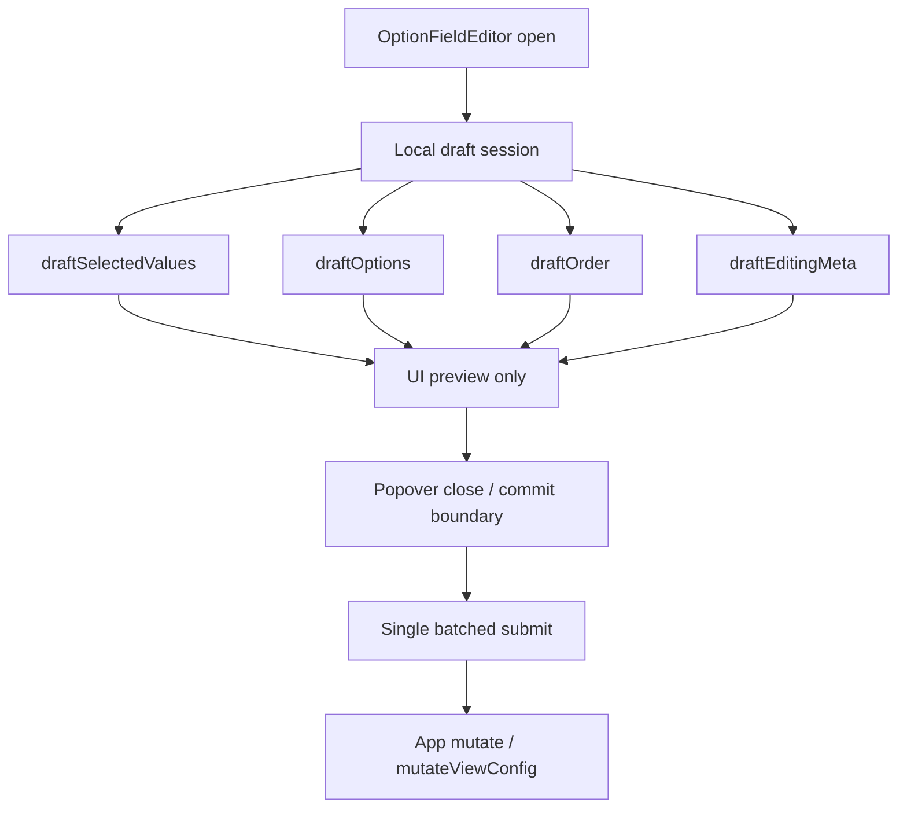

# OptionFieldEditor 本地事务式编辑方案

## 方案概述

### 总体目标和范围

本方案的目标是把 `OptionFieldEditor` 从“弹框内每一步操作都立即写回全局状态”的模型，重构为“弹框打开期间只维护本地 draft，关闭时再统一提交”的本地事务式编辑模型。

本轮主要解决的问题是：

1. 选中标签后，弹框会瞬时闪烁。
2. 拖动排序松手后，弹框会瞬时闪烁。
3. 弹框内部交互与整页级别重渲染耦合过深，导致后续继续扩展时稳定性差。

本轮范围聚焦以下对象：

- [src/table/OptionFieldEditor.tsx](C:/Code/data-editor/src/table/OptionFieldEditor.tsx)
- [src/table/MultiSelectCellEditor.tsx](C:/Code/data-editor/src/table/MultiSelectCellEditor.tsx)
- [src/table/SelectCellEditor.tsx](C:/Code/data-editor/src/table/SelectCellEditor.tsx)
- [src/detail/DetailPanel.tsx](C:/Code/data-editor/src/detail/DetailPanel.tsx)
- [src/App.tsx](C:/Code/data-editor/src/App.tsx)

本轮要处理的提交类型包括：

- 选中值变更
- 选项顺序变更
- 选项重命名
- 选项颜色变更
- 选项删除
- 新建选项

本轮不包括：

- 不调整筛选弹层的提交模式
- 不改变共享视图、文件排序、详情字段排序的提交流程
- 不继续修改拖拽内核本身，除非新事务模型暴露出必须一起调整的边界

### 各阶段任务概要

第一阶段：梳理当前即时提交链路。  
主要工作是明确 `OptionFieldEditor` 内每种操作如何触发 `onEdit` / `onReorderOptions` / 其他 option meta 更新，再继续沿 [src/App.tsx](C:/Code/data-editor/src/App.tsx) 里的 `mutate(...)`、`mutateViewConfig(...)` 和 `bump(...)` 看全局重渲染链。预期成果是把“为什么会闪烁”收敛到可验证的状态边界，而不是继续归因给样式或 Popover 本身。

第二阶段：建立本地事务式 draft 模型。  
主要工作是在 `OptionFieldEditor` 内显式拆分“本地编辑态”和“外部已提交态”，让弹框打开期间的选中、拖拽、重命名、颜色、删除、新建都先落到本地 draft。预期成果是弹框内部的操作不再立即触发表格/详情/视图配置整体重算。

第三阶段：定义统一提交时机与关闭语义。  
主要工作是明确何时将本地 draft 一次性提交给上层，包括点击外部关闭、按 `Escape`、完成拖拽后继续停留、以及切换行/切换文件时的收尾策略；同时为上层定义真正的单次事务提交接口，而不是继续沿用多条旧 handler 顺序调用。预期成果是形成一致的提交协议，而不是某些操作即时提交、某些操作延迟提交的混合状态。

第四阶段：接入 table / detail 两个入口并补回归。  
主要工作是让表格单元格入口和 detail panel 入口共用同一事务模型，并补充“弹框打开期间不触发整页闪烁”的行为回归。预期成果是交互稳定性提升，同时不破坏现有保存、撤销和顺序持久化行为。

执行顺序为：证据链确认 -> 本地 draft 建模 -> 提交协议收口 -> 双入口接入 -> 回归验证。

### 整体结构框架



核心结构是：

1. `OptionFieldEditor` 打开时创建一次本地 draft session
2. 弹框内所有操作只改 draft
3. 只有在统一提交边界发生时，才一次性把 draft 写回上层

---

## 背景与问题归因

当前 `OptionFieldEditor` 的交互模型是局部编辑器与全局状态即时同步混合在一起：

- 选中标签会在 [src/table/OptionFieldEditor.tsx](C:/Code/data-editor/src/table/OptionFieldEditor.tsx) 的 `toggleOption -> commit -> onEdit` 链路上，立即把值写回上层。
- 拖动排序会在 [src/table/useOptionFieldDragReorder.ts](C:/Code/data-editor/src/table/useOptionFieldDragReorder.ts) 的 `onCommit -> onReorderOptions` 链路上，立即把顺序写回上层。
- 重命名、改色、删除、新建也都会直接触发外层数据或 `viewConfig` 更新。

而上层在 [src/App.tsx](C:/Code/data-editor/src/App.tsx) 中：

- `handleEditCell(...)` 走 `mutate(...)`
- `handleReorderMultiSelectOptions(...)` / `handleReorderSelectOptions(...)` 走 `mutateViewConfig(...)`
- 这两条链最终都会触发 `bump((value) => value + 1)`

这意味着用户虽然还停留在一个局部弹框里，但每次操作都在驱动整页级别的重渲染。结果就是：

- trigger 本身会重渲染
- field config / option config 会重建
- popover anchor 会重新定位
- 局部编辑器会经历一次“还保持打开，但内容/定位被重新同步”的过程

这正是当前“选中后闪一下”“拖完松手闪一下”的根因。

需要强调的是，这不是单纯的 CSS 或 Radix Popover 视觉问题，而是状态同步边界的问题。

---

## 设计原则

### 一、局部交互与全局提交分离

弹框内编辑行为属于局部交互，不应在每一步都触发表格、详情面板和字段配置的全局重算。

### 二、一次打开视为一次事务

`OptionFieldEditor` 每次从关闭到打开，应该形成一个明确的本地事务：

- 打开时快照外部状态
- 打开期间累积本地修改
- 关闭时统一决定提交或放弃

### 三、提交边界必须统一

不能继续保持“选中即时提交、拖拽即时提交、编辑菜单即时提交、关闭只是视觉行为”的混合模型。  
必须定义清楚：哪些操作只改本地，哪些时机才真的向上提交。

### 四、table / detail 两个入口同构

表格内 `OptionFieldEditor` 和 detail panel 内 `OptionFieldEditor` 应共享同一套事务模型，不能再分叉出两套提交边界。

---

## 目标模型

### 1. 打开时建立 draft session

弹框打开时，从外部 props 派生一份本地 session：

- `draftSelectedValues`
- `draftOptions`
- `draftOrder`
- `draftDraftInput`
- `draftEditingState`
- `draftDirtyFlags`

其中：

- `draftSelectedValues` 负责当前字段值
- `draftOptions` 负责 option label / color / existence
- `draftOrder` 负责选项顺序
- `draftDirtyFlags` 用来判断关闭时是否真的需要提交

### 2. 打开期间所有交互只改本地

以下操作都只更新本地 session，不立即调用上层：

- 选择 / 取消选择
- 新建选项
- 删除选项
- 重命名选项
- 修改颜色
- 拖拽重排

用户看到的 trigger 预览、顶部已选标签、候选列表、ghost / placeholder，都来自本地 draft，不依赖外层立即同步。

### 3. 关闭时一次性提交

当弹框关闭时，统一比较 draft 与打开时快照：

- 值是否变了
- option meta 是否变了
- option 顺序是否变了

但关闭时不再直接按旧接口顺序调用多次上层 handler，而是先把最终 draft 归并成一个稳定 patch，再通过单次事务接口提交。

建议的提交对象：

```ts
type OptionFieldDraftCommit = {
  nextSelectedValues: Array<string | number>;
  nextOptions: MultiSelectOptionView[];
  nextOptionOrder: string[];
  valueChanged: boolean;
  optionsChanged: boolean;
  orderChanged: boolean;
};
```

建议的新上层接口语义：

```ts
onCommitDraft: (patch: OptionFieldDraftCommit) => void;
```

上层在一次事务里统一应用：

1. option meta 变化
2. option 顺序变化
3. 字段值变化

并且整个过程只允许触发一次统一刷新，而不是在一个关闭动作里再次拆成多次 `mutate(...)` / `mutateViewConfig(...)`。

这样上层只经历一次明确的“事务完成”更新，而不是过程中多次抖动。

### 4. 关闭后才允许全局重渲染

提交发生后，表格和 detail panel 当然仍会重渲染，但这时 popover 已经关闭，不会再以“用户仍在编辑”状态承受一次视觉闪烁。

---

## 提交语义建议

### 推荐提交语义

- 点击外部关闭：提交
- `Escape`：取消本次 draft，并关闭弹框
- 拖拽结束但弹框仍开着：只更新本地，不提交
- 选中标签：只更新本地，不提交
- 右侧编辑菜单里的重命名 / 改色 / 删除：只更新本地，不提交
- 切换到别的 cell 或 detail field，导致当前弹框关闭：提交

推荐理由：

- 与当前“编辑器一关闭就视为完成本次编辑”最接近
- 不引入额外的“确认/取消”按钮
- `Escape` 保留“放弃本次局部编辑”的直觉语义，更符合事务式编辑器模型
- 改动边界相对可控

### 不推荐语义

不推荐引入一套显式 `Apply / Cancel` 按钮式模式。  
原因是会让现有单元格编辑器的交互范式发生明显变化，成本高于收益。

---

## 状态结构建议

建议在 `OptionFieldEditor` 内引入一份明确的 session 结构，而不是继续散落多个半耦合 state：

```ts
type OptionFieldDraftSession = {
  initialSelectedValues: Array<string | number>;
  initialOptions: MultiSelectOptionView[];
  selectedValues: Array<string | number>;
  options: MultiSelectOptionView[];
  order: string[];
  draftInput: string;
  editing: EditingState | null;
  dirty: {
    values: boolean;
    options: boolean;
    order: boolean;
  };
};
```

关键点是：

- `initial*` 用于关闭时比较
- `selectedValues / options / order` 用于当前 UI
- `dirty` 用于避免无变化时无意义提交

---

## 与当前实现的主要差异

### 当前模型

- `selectedValues` 是半本地半全局同步
- `localOptions` 是本地
- `onEdit` 即时触发全局更新
- `onReorderOptions` 即时触发全局更新
- `stickyOpenCellId` / `stickyValuesByCellId` 用来尽量维持弹框打开，但不能阻止全局 rerender 带来的闪动

### 目标模型

- `selectedValues / localOptions / order` 全部归入统一 draft session
- 打开期间不调用 `onEdit`
- 打开期间不调用 `onReorderOptions`
- `sticky*` 机制应显著收缩，甚至在新事务模型下可以删除
- 关闭时由单一 `flushDraftSession()` 负责批量提交

---

## 组件改造建议

### [src/table/OptionFieldEditor.tsx](C:/Code/data-editor/src/table/OptionFieldEditor.tsx)

需要承担的职责：

- 创建和销毁 draft session
- 用 draft 驱动 trigger / selected chip / option list / ghost
- 在关闭时统一 flush
- 区分父弹框关闭和行内子弹框关闭边界

不再承担的职责：

- 每次用户交互时立即通知上层

需要新增的关闭边界规则：

- 只有主 `OptionFieldEditor` 的关闭动作，才允许触发事务提交或取消
- 行内 option editor（重命名/颜色/删除）的 `Popover.Root` 打开与关闭，只影响本地 draft 的编辑态，不得触发父层事务提交
- `Escape` 作用于父层时表示取消整个 draft session；作用于子弹框时只关闭子弹框，不结束父事务

### [src/table/useOptionFieldDragReorder.ts](C:/Code/data-editor/src/table/useOptionFieldDragReorder.ts)

应继续只负责拖拽预览和最终本地顺序结果，不直接假设“drop 就是全局提交点”。

也就是说：

- `drop` 只更新 editor draft order
- 关闭 editor 才是全局提交点

### [src/App.tsx](C:/Code/data-editor/src/App.tsx)

上层不应再让 `OptionFieldEditor` 在关闭时顺序调用多条旧接口；建议新增单次事务提交入口，再由 `App` 在内部一次性应用 patch。

建议方向：

- `handleEditCell(...)`、`handleReorderMultiSelectOptions(...)`、`handleReorderSelectOptions(...)` 等旧函数继续保留给其他入口
- `OptionFieldEditor` 新增专用 `handleCommitOptionFieldDraft(...)`
- `handleCommitOptionFieldDraft(...)` 在一次事务里统一修改 rows / field config / option order
- 整个事务只允许触发一次统一刷新

这意味着 `App` 会新增一个更明确的提交边界，但不会把复杂性反向摊回到每一次弹框内交互里。

---

## 风险与控制

### 风险 1：关闭时多类变更一起提交，顺序不一致

例如：

- 先拖拽排序
- 再重命名
- 再删除

如果关闭时提交顺序设计不清楚，可能出现顺序引用旧 value 的问题。

控制方式：

- 不按旧 handler 顺序逐个调用
- 先生成最终标准化 patch
- 上层只根据最终 patch 一次性应用变更

### 风险 2：trigger 在弹框打开期间不再反映最终 persisted 状态

这是预期变化。打开期间 trigger 应优先表达当前 draft，而不是外层已提交值。

控制方式：

- trigger 显示改为读取 draft session
- 关闭后再自然回到外层提交态

### 风险 3：父弹框与子弹框的关闭事件串扰

当前 `OptionFieldEditor` 内部还嵌套了行级 option editor 弹框；如果边界处理不清楚，用户只是在改色或重命名时，也可能被错误视为“父弹框关闭”，从而提前触发提交或取消。

控制方式：

- 父/子弹框关闭信号分离
- 只有主弹框关闭才允许 flush / cancel draft
- 子弹框只修改本地编辑态，不触发事务结束

### 风险 4：外部 props 在弹框打开期间变化

如果 editor 正打开，而上层由于文件切换、shared view 切换、detail panel 切换等原因刷新了 `value` 或 `options` props，需要明确 draft 如何处理。

控制方式：

- session dirty 时，优先保留本地 draft，不用新 props 覆盖
- session clean 时，允许按新 props 重置 draft
- 文件/行真正切换导致 editor 被卸载时，按既定关闭语义处理

### 风险 5：table / detail 两处关闭路径不一致

控制方式：

- 把 flush 逻辑收敛成单一关闭入口
- 不允许 table 和 detail 各自拼一套关闭后提交逻辑

---

## 验证方案

### 逻辑验证

- 打开弹框后，点选标签不会立即触发全局保存按钮变脏
- 打开弹框后，拖拽排序不会立即触发全局保存按钮变脏
- 关闭弹框后，值和顺序一次性提交，保存按钮再变脏
- `Escape` 关闭后，draft 放弃，保存按钮保持原状态
- 子弹框开关不会触发父事务提交
- 关闭时只触发一次 dirty 变化，不出现一次关闭动作导致多次全局刷新

### 视觉验证

- 选中标签时弹框不闪
- 拖拽松手时弹框不闪
- 详情面板内相同行为也不闪

### 回归验证

至少覆盖：

- table multi-select
- table single-select
- detail panel multi-select / single-select
- 拖拽后关闭提交
- 拖拽后 `Escape` 取消不提交
- 重命名 / 改色 / 删除与值选择混合操作后，关闭时提交正确
- 子弹框关闭不触发父提交
- 打开期间 props 变化时 dirty / clean 两种分支都正确

---

## 推荐结论

从框架设计角度，本方案推荐将 `OptionFieldEditor` 重构为“本地事务式编辑器”：

- 打开期间只维护本地 draft
- 弹框关闭时再统一通过单次事务接口向上提交
- 上层继续保持现有 `mutate(...)` / `mutateViewConfig(...)` 能力，但只在事务完成时触发

这样能从状态边界上消掉当前的闪烁来源，比继续做“稳定挂载边界补偿层”更适合长期维护，也更利于后续继续扩展批量编辑、撤销和更复杂的 option 编辑能力。
