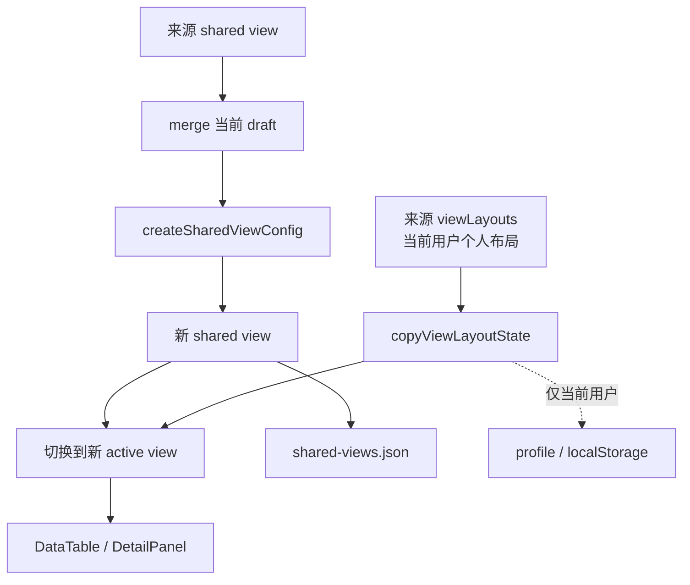

# 创建视图副本方案

## 方案概述

### 1. 总体目标和范围

本方案目标是在现有 `创建视图副本` 入口之上，明确并收敛“副本到底复制哪些状态”的产品语义，使用户复制出的新视图能够在当前用户眼中接近“当前视图的工作副本”，同时继续保持共享视图与个人布局分层。

范围包含：

- 统一“创建视图副本”的复制语义。
- 复制来源视图当前有效的共享状态：
  - `name` 的派生副本名
  - `query`
  - `filters`
  - `sorts`
- 为当前用户复制来源视图的个人布局状态：
  - `hidden`
  - `wrapped`
  - `order`
  - `detailOrder`
  - `widths`
- 新副本创建后自动切换到新视图。
- profile 模式和 local 模式下都保持一致行为。
- 副本插入位置与当前 UI 中可见的 view 顺序保持一致。
- 删除副本、重命名副本、保存共享视图时继续遵守现有职责边界。
- 文档、单测和必要 E2E 的同步更新。

范围不包含：

- 不把来源视图的个人布局写入团队共享配置文件。
- 不引入“部分复制”“复制为个人私有视图”等额外模式。
- 不改动现有共享视图菜单结构，只收敛副本的行为定义。

### 2. 各阶段任务概要

1. **语义收敛阶段**：明确副本复制的是“当前有效视图状态”，而不是仅共享保存态。
2. **共享副本阶段**：复用现有 shared view duplicate 链路，确保 `query / filters / sorts` 和派生名称稳定复制。
3. **个人布局副本阶段**：在新 view 创建成功后，为当前用户补写对应 `viewLayouts`。
4. **状态切换阶段**：创建后切换到新 view，并更新 `lastActiveViews` 与当前 draft 状态。
5. **边界校验阶段**：验证 profile、本地模式、删除视图、重置、为所有人保存等交互仍符合分层规则。
6. **测试文档阶段**：补充单测、E2E 和交互文档，锁定副本语义。

执行顺序必须先锁定语义和数据边界，再改状态写入逻辑，最后补测试和文档。否则很容易把“共享副本”和“个人布局副本”混在一起。

### 3. 整体结构框架



---

## 当前机制判断

当前仓库已经存在“创建视图副本”入口和基本 duplicate 流程：

- 菜单入口位于 `ViewTabs` 的视图浮框中：
  - [C:\Code\data-editor\src\components\ViewTabs.tsx](C:\Code\data-editor\src\components\ViewTabs.tsx)
- 点击后触发 `onDuplicateView(view.id)`：
  - [C:\Code\data-editor\src\components\ViewTabs.tsx](C:\Code\data-editor\src\components\ViewTabs.tsx)
- `App.tsx` 中由 `handleDuplicateSharedView(viewId)` 处理：
  - [C:\Code\data-editor\src\App.tsx](C:\Code\data-editor\src\App.tsx)
- shared view 副本创建核心逻辑在 `createSharedViewConfig(...)`：
  - [C:\Code\data-editor\src\view\view-state.mjs](C:\Code\data-editor\src\view\view-state.mjs)

现状有两个特点：

1. 共享视图副本已经会复制来源 view 的共享快照。
2. 个人视图布局不会随副本一起复制，因为 `viewLayouts` 现在和 shared view duplicate 是两条链路。
3. 当前 duplicate 插入位置来自 shared config 中的来源 view 顺序，还没有显式对齐当前 UI 可能存在的 view 顺序 draft。

因此，当前“创建视图副本”更接近“复制共享视图配置”，还不是用户期待的“复制我眼前这个完整工作视图”。

---

## 目标语义

### 1. 副本复制“当前有效状态”

点击 `创建视图副本` 时，复制来源视图的**当前有效状态**，而不是只复制上一次团队共享保存的状态。

这里的“当前有效状态”包括：

- shared view 原始配置
- 当前用户尚未保存的该视图 draft

也就是说，如果当前用户刚刚改了筛选或排序，但还没有点 `为所有人保存`，立刻创建视图副本，副本也应该带着这些改动。

### 2. 共享状态和个人布局分层复制

副本复制分成两层：

#### 共享层

对所有用户可见的新 shared view，需要复制：

- `query`
- `filters`
- `sorts`
- 派生 `name`

#### 个人层

只对当前用户生效的副本布局，需要复制：

- `hidden`
- `wrapped`
- `order`
- `detailOrder`
- `widths`

这里复制的不是“某次旧保存结果”，而是 duplicate 时刻的**当前有效个人布局快照**。也就是说，如果当前用户刚刚调整了列宽、列顺序或隐藏列，只要这些改动已经进入当前模式下的有效布局状态，副本就应继承这一刻的布局，而不是回退到更早的布局记录。

这样副本创建后，当前用户看到的是一个真正“长得一样”的新视图；而其他用户进入该副本时，只继承 shared 层，不继承当前用户的个人布局。

### 3. 副本仍然是团队共享视图

副本本身仍然是 `shared view`，不是个人私有视图。

所以：

- 新副本会写入 `shared-views.json`
- 其他用户能看到这个副本 tab
- 但其他用户不会得到当前用户的个人列布局

这与 Notion 官方“duplicate database view”的核心语义一致：复制的是一个 view，本方案额外补上的“复制当前用户个人布局”属于本项目在共享 view 之上的本地化增强，而不是要求和 Notion 的内部实现完全一一对应。参考：[Notion Help: Views, filters, sorts & groups](https://www.notion.com/help/views-filters-and-sorts)

### 4. 创建后自动切换到副本

用户点击 `创建视图副本` 后，应自动切换到新 view，并把它设为当前 collection 的 active view。

这样行为才符合“先复制，再继续在副本里改”的工作流。

---

## 详细需求

### 命名规则

副本默认名称必须使用：

- `原名称 副本`

若已存在同名，则自动编号：

- `原名称 副本 2`
- `原名称 副本 3`

不要求创建时弹命名框。先生成副本，再允许用户后续重命名。

### 插入位置规则

副本插入位置必须以**当前 UI 中可见的 view 顺序**为准，而不是仅以 shared config 当前顺序为准。

原因是当前 collection 可能已经存在尚未保存的 `viewOrderDrafts`。用户点击“创建视图副本”时，感知到的来源位置是当前看到的 tab 顺序，所以副本也必须插入到这个可见顺序中的来源 view 后方。

这意味着实现时除了创建新的 shared view，还要同步更新当前 collection 的 view 顺序 draft，保证 UI 立刻看到正确插入位置。

### 复制内容

#### 必须复制

- `query`
- `filters`
- `sorts`
- 当前用户个人布局：
  - `hidden`
  - `wrapped`
  - `order`
  - `detailOrder`
  - `widths`

#### 不复制

- 其他用户的个人布局
- 来源视图的 `dirty` 标记本身
- 临时 UI 开关状态，例如筛选栏显隐、搜索框是否展开、某个 popover 是否打开

#### 来源 draft 处理规则

来源 view 的 draft 必须**保留**，不因为创建副本而被清空。

副本的语义是“复制当前状态”，不是“把当前状态搬运到新视图后从来源视图移走”。因此：

- `sourceViewId` 对应的 draft 继续存在
- `targetViewId` 不生成新的 draft
- 用户如果回到来源 view，仍然能看到来源 draft 原样存在

### 创建后状态

创建成功后：

- 切到新 view
- 新 view 成为 `lastActiveViews[collectionKey]`
- 当前用户若处于 profile 模式，把复制后的布局写入 `viewLayouts`
- 当前用户若处于 local 模式，把复制后的布局写入 localStorage 对应 key
- 新副本的 `viewDrafts[targetViewId]` 必须保持为空；来源视图的 draft 已经被折叠进新 shared view 快照，不再为副本额外生成一份未保存 draft
- 如果创建完成后用户没有继续编辑，新副本 tab 初始不显示未保存标记

---

## 数据层设计

### shared view 层

现有 `createSharedViewConfig(...)` 可以继续复用，因为它本来就负责：

- 基于来源快照生成新 shared view
- 处理唯一 `id`
- 处理唯一 `name`
- 插入到来源 view 后方

但调用侧应继续保证传入的是 `mergeSharedViewWithDraft(...)` 之后的快照，而不是裸 shared view。

另外，副本命名规则如果要落实为：

- `原名称 副本`
- `原名称 副本 2`

则调用侧应先把来源快照的 `name` 改成 `原名称 副本`，再交给 `uniqueViewName(...)` 做冲突消解，而不是直接复用来源名称。

### 个人布局层

新增一个独立的“复制当前 view layout 到新 viewId”逻辑，建议语义类似：

```ts
copyViewLayoutState({
  mode,
  path,
  collectionPath,
  sourceViewId,
  targetViewId,
  profile,
  localStorage,
})
```

其职责只做一件事：

- 读取来源 view 的个人布局
- 按目标 `viewId` 写入一份拷贝

不在这里处理 shared view，不混入菜单或 UI 逻辑。

#### 来源布局读取优先级

复制个人布局时，来源读取优先级必须固定为：

1. duplicate 时刻当前模式下的**有效布局快照**，实现上复用现有 `readViewLayoutState(...)` 语义或等价统一入口
2. 如果来源 view 没有任何布局记录，则视为“无布局状态”

这里不能简单理解为“直接取某个旧存档对象”。实现上应保证读取的是 duplicate 当下用户真正正在使用的那份布局语义。

#### 无来源布局时的 fallback

如果来源 view 没有个人布局记录，则：

- 不为目标 `viewId` 创建新的布局记录
- 新副本按默认布局显示

也就是说，“没有来源布局”不是错误，也不需要强行写一份空布局对象。这样可以保持 `viewLayouts` 只在用户真的定制过布局时才存在记录。

---

## 状态流改造

推荐状态流：

1. 用户点击 `创建视图副本`
2. `ViewTabs` 调用 `onDuplicateView(view.id)`
3. `App.handleDuplicateSharedView(viewId)`：
   - 找到来源 shared view
   - 合并来源 draft
   - `createSharedViewConfig(...)`
   - 保存 `shared-views.json`
4. shared view 创建成功后：
   - 取得 `result.view.id`
   - 复制当前用户来源 view 的 `viewLayouts[sourceViewId] -> viewLayouts[targetViewId]`
   - 若来源无布局记录，则跳过个人布局写入
   - 清晰保证 `viewDrafts[targetViewId]` 为空
   - 保留 `viewDrafts[sourceViewId]` 不变
   - 如果当前 collection 存在 `viewOrderDrafts`，同步把 `targetViewId` 插入到当前 UI 顺序中的来源 view 后方
   - 更新 `lastActiveViews[collectionKey] = targetViewId`
5. 切到新 view
6. 页面展示新副本及其复制后的个人布局

这个顺序的关键点是：

- 先确保 shared view 真正创建成功
- 再复制个人布局
- 再更新 active view 与 UI 刷新
- 再保证 view 顺序 draft 和当前 UI 一致

否则如果 shared 创建失败，个人布局会留下无主残留。

---

## 生命周期边界

### 删除副本

删除 view 时，继续沿用现有规则：

- 删除 shared view
- 清理该 `viewId` 对应的个人布局

这点和普通 view 删除没有区别。

### 重命名副本

副本重命名不影响个人布局，因为个人布局按 `viewId` 索引，而不是按名称。

### 为所有人保存

`为所有人保存` 不需要特殊处理副本。

副本只是另一个 shared view，行为与普通 shared view 一致：

- 只发布 `query / filters / sorts`
- 不发布个人列布局

### 重置

重置语义维持现状：

- 筛选栏 `重置`：清当前 active view 的 shared draft
- `Reset view`：清当前 active view 的个人布局

副本不需要额外例外逻辑。

---

## 风险与处理

### 风险 1：把个人布局错误写入 shared view

这是最需要避免的实现偏差。

处理方式：

- 共享副本与个人布局副本分成两条函数链
- shared-views.json 永远不写 `viewLayouts`

### 风险 2：复制了“旧保存状态”而不是“当前有效状态”

如果 duplicate 时直接用 shared view 原始配置，就会丢掉当前用户尚未保存的 draft。

处理方式：

- duplicate 前必须先 `mergeSharedViewWithDraft(...)`
- 个人布局读取也必须基于 duplicate 时刻的当前有效布局快照，而不是随手读取一个历史对象引用

### 风险 3：shared 创建失败但个人布局已复制

会造成孤儿 `viewLayouts[targetViewId]`。

处理方式：

- 先创建 shared
- 成功后再复制个人布局

### 风险 4：local 模式和 profile 模式行为不一致

处理方式：

- 提炼统一 helper
- 在两种模式下都走同样的源布局读取和目标布局写入语义

### 风险 5：来源没有布局记录却强行写入目标空布局

这会制造无意义 `viewLayouts[targetViewId]` 残留，也会让“副本是否真的继承过布局”难以判断。

处理方式：

- 明确无来源布局时直接跳过个人布局复制
- 让目标 view 自然落回默认布局

### 风险 6：副本插入到 shared config 顺序，而不是用户眼前的当前顺序

这会让用户觉得“副本出现在错误的位置”，尤其是在当前 collection 已有 view 顺序 draft 时更明显。

处理方式：

- 明确插入规则以当前 UI 顺序为准
- duplicate 成功后同步更新当前 collection 的 `viewOrderDrafts`

---

## 实施步骤

1. 梳理 `handleDuplicateSharedView` 的现有调用链和保存顺序。
2. 提炼 `copyViewLayoutState(...)` 一类的 view-layout duplicate helper。
3. 明确来源布局读取走“当前有效布局快照”，并定义无来源布局时的跳过策略。
4. 在 shared view 创建成功后复制当前用户个人布局到新 `viewId`。
5. 保证 `viewDrafts[targetViewId]` 不生成额外 draft，且 `sourceViewId` draft 保留不变。
6. 如果当前 collection 有 view 顺序 draft，同步把新副本插入到当前 UI 顺序中的来源 view 后方。
7. 更新 active view 切换和 `lastActiveViews`。
8. 补充 profile/localStorage 单测。
9. 补一条 E2E，验证：
   - 来源 view 有筛选
   - 有个人列布局差异
   - 创建副本后新 view 同时带着两者
   - 来源 draft 仍保留
   - 新副本不显示初始 dirty
   - 在存在 view 顺序 draft 时，副本插入位置与当前 UI 顺序一致
10. 更新交互文档和系统结构文档。

---

## 验收标准

满足以下条件才算完成：

1. 点击 `创建视图副本` 后，会创建一个新的团队共享 view。
2. 新 view 会复制来源视图当前有效的 `query / filters / sorts`。
3. 新 view 创建后会自动切换过去。
4. 当前用户在新 view 中看到的列宽、列顺序、隐藏列、换行和详情字段顺序与来源 view 一致。
5. 其他用户进入该副本时，不会继承当前用户的个人列布局。
6. 如果来源 view 没有个人布局记录，则副本不生成新的布局记录，并按默认布局显示。
7. 新副本创建后不应额外生成 `viewDrafts[targetViewId]`，来源 `sourceViewId` draft 仍保留。
8. 如果创建完成后用户未继续编辑，新副本 tab 初始不显示 dirty 标记。
9. 如果当前 collection 存在 view 顺序 draft，副本插入位置与当前 UI 中看到的来源 view 顺序一致。
10. `为所有人保存` 仍只影响 shared 状态，不影响个人布局边界。
11. 删除该副本时，会清理该 `viewId` 对应的个人布局残留。

---

## 结论

“创建视图副本”不应只是复制一个 shared view 记录，而应被定义为：

- 对团队：复制当前有效共享视图状态
- 对当前用户：复制当前个人布局状态

这样副本才符合用户对“把当前视图完整拷贝出来继续改”的预期，同时继续保持 `shared view` 和 `personal layout` 的职责边界清晰。
