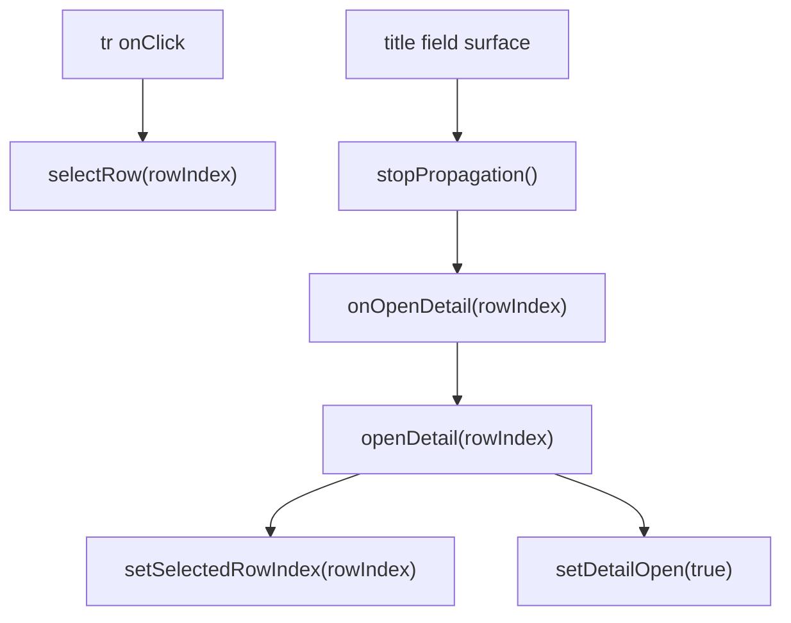

# 标题字段整格打开详情交互方案

## 方案概述

### 总体目标和范围

本方案聚焦主表标题字段的交互收敛：移除当前标题列右侧的独立“打开详情”按钮，改为由标题字段整块区域承担打开详细页的主入口职责；当鼠标 hover 到标题字段时，仅标题文字变为绿色，以表达该字段可点击。

本次范围仅限主表标题字段这一条渲染链路：

- 调整标题字段在 `src/table/DataTable.tsx` 的 DOM 结构与点击语义
- 调整 `src/styles.css` 中标题字段的 hover / focus / layout 样式
- 复用现有 `onOpenDetail -> openDetail(rowIndex)` 行为链路
- 保持整行点击仍以“选中行”为主语义

本次不包含：

- 不改 relation 字段的打开目标逻辑
- 不改 backlink / nested 字段的入口逻辑
- 不改 detail panel 内部字段组件
- 不把“点击即打开详情”的语义扩展到整行或其他列

### 各阶段任务概要

1. **现状收敛阶段**
   - 明确当前标题列由“文本展示 + 独立按钮”组成，并确认整行点击只负责选中。
   - 预期成果：锁定最小改动面，仅调整标题字段分支。
2. **结构改造阶段**
   - 将标题字段改为单一的全宽点击表面，删除旧按钮节点。
   - 预期成果：标题字段内部只保留一个主入口，不再存在次级点击目标。
3. **交互样式阶段**
   - 将 hover / focus 的视觉反馈从旧按钮迁移到标题文字本身，回收旧按钮占位。
   - 预期成果：标题字段 hover 时仅文字变绿，布局不再无故留白。
4. **行为边界阶段**
   - 明确标题字段点击优先打开详情，同时显式阻止事件冒泡到行点击。
   - 预期成果：标题列负责打开详情，整行其他区域仍只负责选中。
5. **验证阶段**
   - 以静态检查和界面行为验证确认语义没有扩散到其他 renderer。
   - 预期成果：标题列新交互稳定，其他列行为不回归。

### 整体结构框架



---

## 现状证据

### 当前结构

标题字段当前在 `src/table/DataTable.tsx` 中单独走 `fieldName === detectedTitleField` 分支，结构为：

- 外层 `div.title-cell`
- 内层标题文本 `span`
- 右侧独立按钮 `button.title-open-button`

旧按钮点击时直接调用：

```tsx
props.onOpenDetail(originalRowIndex)
```

### 当前行级行为

表格行 `tr` 当前统一绑定：

```tsx
onClick={(event) => selectRow(event, originalRowIndex)}
```

因此目前职责是：

- 点击整行：选中行
- 点击标题列右侧绿色按钮：打开详情

### 当前样式边界

`src/styles.css` 里当前标题列有两个关键约束：

- 标题文本默认蓝色，且为了右侧按钮预留 `padding-right: 32px`
- `title-open-button` 默认隐藏，hover 到 `title-cell` 时才显示

这说明当前实现本身就是“双目标交互”，且标题文本可见宽度被旧按钮占位压缩。

---

## 修订后的最终方案

## 1. 交互语义

标题字段升级为标题列唯一主入口，最终行为定义如下：

- 点击标题字段整块区域：打开详情
- hover 标题字段整块区域：仅标题文字变绿
- 键盘 focus 到标题字段入口：标题文字也应呈现同样的绿色反馈
- 点击同一行的非标题区域：仍只选中该行
- 不再显示右侧额外绿色打开按钮

这一定义明确区分三层职责：

- 标题列：主入口
- 整行：选中
- 其他单元格：保持各自原有编辑或查看语义

## 2. DOM 结构调整

标题字段应从“普通容器 + 次级按钮”改为“单一全宽点击表面”。

推荐结构：

- 保留标题字段分支仍位于 `DataTable.tsx`
- 删除旧的 `title-open-button` 节点
- 将标题内容改为一个占满标题字段区域的点击元素
- 该点击元素继续复用 `title-cell` 及其文本布局 contract，但不再依赖额外图标按钮

实现上不建议把 `td` 本身变成交互面；更稳的做法是：

- `td` 仍然只是表格容器
- `td` 内部放置一个全宽标题入口元素
- 由该入口元素负责点击打开详情和样式反馈

这样可以降低与表格布局规则、行级点击和其他 renderer 的耦合。

## 3. 事件与行为边界

标题字段入口点击时必须显式：

- 调用 `event.stopPropagation()`
- 调用 `props.onOpenDetail(originalRowIndex)`

原因：

- 当前 `tr` 已有统一的 `onClick -> selectRow`
- 如果标题字段入口不拦截冒泡，就会同时触发行选中和详情打开
- 虽然 `openDetail(rowIndex)` 本身会执行 `setSelectedRowIndex(rowIndex)`，但这应被视为“打开详情时顺带同步选中”的内部副作用，而不是依赖行点击补全

因此本方案明确约束：

- 标题字段点击只走标题字段自己的入口链路
- 行点击只保留给非标题区域

## 4. 可访问性要求

标题字段既然成为主入口，就不能只做 mouse hover 语义，还需要显式具备键盘可达性。

要求如下：

- 标题字段入口必须可聚焦
- `focus-visible` 时应和 hover 一样让标题文字变绿
- `Enter` / `Space` 可以触发打开详情

因此实现层更适合使用 button-like 语义元素，而不是普通 `div`。

但这里的 button 不是默认浏览器样式 button，而是：

- 保留现有标题列布局 contract
- 通过 CSS 清除默认 button 外观
- 仅保留语义、焦点和键盘行为

## 5. 样式收敛要求

样式调整必须同时满足以下约束：

- 删除 `.title-open-button` 相关节点样式与 hover 逻辑
- 删除标题文本为旧按钮预留的 `padding-right: 32px`
- 默认标题文字维持当前标题色体系
- hover / focus-visible 时，仅标题文字变绿
- 不引入新的绿色背景块反馈，除非后续单独决策
- 标题字段入口显示 `cursor: pointer`

这里“仅标题文字变绿”是关键验收点，意味着不应把旧按钮的浅绿色 hover 背景直接平移到整块标题字段上。

## 6. wrap 与布局边界

标题字段当前有两种布局路径：

- 单行截断
- 开启 wrap 后多行展示

修订后必须保证两条路径都成立：

- 非 wrap 时，标题字段仍正常省略并占满可用宽度
- wrap 时，多行标题的整块区域仍可点击，hover / focus 语义一致
- 删除旧按钮后，回收右侧占位，避免标题无故提前截断

这意味着样式层不能只覆盖默认单行路径，还要同步校验 `.title-cell.cell-text-wrap` 下的交互表面和文字颜色规则。

---

## 文件级改动建议

### `src/table/DataTable.tsx`

目标：

- 将标题字段分支改为单一点击表面
- 删除 `title-open-button`
- 标题字段点击时 `stopPropagation()` 后调用 `props.onOpenDetail(originalRowIndex)`

约束：

- 不修改非标题字段 renderer 分支
- 不调整 `selectRow` 的职责定义
- 不把打开详情逻辑提升到行级 `tr`

### `src/styles.css`

目标：

- 清理 `.title-open-button` 及其 hover / focus 样式
- 重写标题字段入口与文本的 hover / focus-visible 规则
- 回收旧按钮占位带来的 `padding-right`

约束：

- 不引入整块背景绿底作为默认反馈
- 不影响普通文本 cell、relation、option、多选、backlink 的样式 contract

---

## 风险与规避

### 风险 1：标题点击与行点击双触发

风险：

- 如果忘记拦截冒泡，标题字段会同时触发行选中和详情打开

规避：

- 标题字段入口点击必须显式 `stopPropagation()`
- 验证时要覆盖“点击标题字段”和“点击同一行其他区域”的差异行为

### 风险 2：直接把现有容器改成默认 button 导致布局漂移

风险：

- 默认 button 样式可能破坏 `flex`、换行、行高、宽度收缩、文本截断

规避：

- 保留现有标题列布局语义
- 仅把内部主表面升级为无默认外观的 button-like 元素
- CSS 中显式清除默认 button 样式并复用现有布局规则

### 风险 3：删除按钮后未回收留白

风险：

- 右侧 32px 留白仍在，标题显示宽度继续被浪费

规避：

- 把“移除旧按钮占位”列为显式样式验收项
- 用接近省略边界的标题内容验证可见字符数是否回升

### 风险 4：语义扩散到整行或其他列

风险：

- 误把标题列主入口做成整行主入口
- 或误伤其他共享文本样式

规避：

- 只改标题字段分支
- 不改 `tr` 点击逻辑
- 不把共享 hover 规则挂到普通 `.data-cell` 或全局文本类

---

## 验收标准

满足以下条件才算交付完成：

1. 主表标题字段不再显示右侧独立打开按钮
2. hover 标题字段整块区域时，仅标题文字变绿
3. 点击标题字段整块区域可直接打开详情
4. 点击同一行非标题区域仍只选中行
5. 标题字段点击不会再额外依赖行点击冒泡完成行为
6. 标题字段默认显示宽度恢复，不再为旧按钮预留空白
7. wrap 与非 wrap 两种标题布局下，点击与 hover 反馈一致
8. relation / backlink / nested / 其他普通单元格行为无回归

---

## 推荐验证清单

- 静态检查：
  - `npm run typecheck`
- 手工界面验证：
  - 标题列 hover 反馈
  - 标题列点击打开详情
  - 行其他区域点击只选中
  - 长标题单行截断宽度是否恢复
  - wrap 标题多行下整块点击是否稳定
- 如需要补自动化：
  - 优先补标题列交互的轻量 UI 断言，不扩大到无关表格行为重构

---

## 最终建议

按照本修订版执行时，应坚持以下最终约束，不再回退到旧的双目标交互：

- 标题字段内部只允许存在一个主入口
- 打开详情语义只挂在标题字段，不挂到整行
- hover / focus 反馈只强调标题文字，不复刻旧按钮背景块
- 删除旧按钮后同步回收布局占位

这套约束能满足你选择的 B 方案，同时把事件冲突、布局漂移和语义扩散这三类主要风险提前封死。
