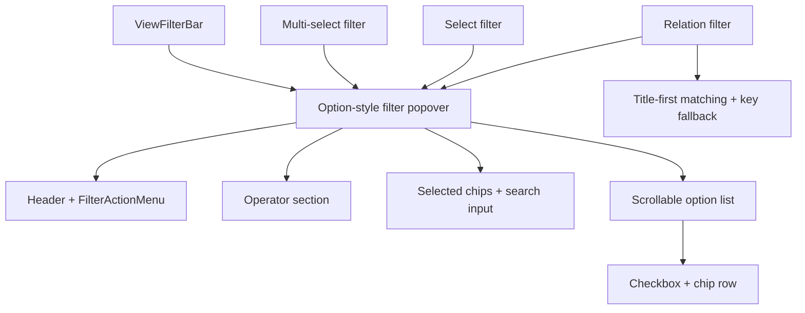

# 筛选标签选择弹层统一方案

## 方案概述

### 总体目标和范围

本方案目标是将当前 `Multi-select / Select / Relation` 三类筛选弹层，统一收敛为一套“标签选择弹层”视觉和交互模型，并把这组三类值筛选器的 operator select 一并落成真实可用能力。目标不是把筛选器变成选项编辑器，而是让它们在保留现有筛选语义的前提下，采用更接近 `OptionFieldEditor` 的结构节奏：顶部展示已选标签，中部提供名称搜索过滤，底部提供可滚动的候选列表。

本轮范围包括：

- 统一 `Multi-select`、`Select`、`Relation` 三类筛选弹层的值选择区结构。
- 实现并验证这组三类筛选器的 operator select，使 `包含任一`、`不包含`、`为空`、`不为空` 在交互和筛选语义上都真正可用。
- 保留筛选器现有头部、字段名、删除规则能力。
- 让视图条上的 filter chip 文案同步反映当前 operator，而不是只显示字段和值。
- 顶部支持已选标签展示，并允许直接取消选中。
- 输入框支持快速搜索过滤。
- 候选列表支持有限高度和内部滚动。
- 列表项视觉参考现有标签选择弹层，但左侧使用 `checkbox`，不再使用拖拽把手。
- `Relation` 筛选支持按显示标题搜索，同时也能按 relation key 命中。

本轮不包括：

- 不支持在筛选弹层中新建选项。
- 不支持重命名、改色、删除选项。
- 不引入拖拽排序和右侧更多菜单。
- 不新增超出当前范围的新 operator 类型。
- 不扩展到文本筛选和布尔筛选，它们继续保留当前更轻量的结构。

### 各阶段任务概要

第一阶段：梳理当前组件边界与复用路径。  
主要工作是确认 `ViewFilterBar -> MultiSelectFilterPopover` 的分发关系，以及 `OptionFieldEditor` 可复用的视觉骨架和不可复用的业务能力。预期成果是明确本轮做“视觉骨架收敛”，而不是直接复用选项编辑器业务组件。

第二阶段：抽取筛选版标签选择骨架，并收口 operator 交互边界。  
主要工作是为筛选器建立“已选标签区 + 搜索区 + 可滚动候选列表”的共享结构，同时明确 `contains / does_not_contain / is_empty / is_not_empty` 在值区显隐、默认值保留和切换行为上的统一规则，并定义 filter chip 如何表达 operator。预期成果是三类筛选器可以挂到同一种选择体验上，且 operator 不再只是文案保留。

第三阶段：改造 `Multi-select / Select / Relation` 三类筛选器。  
主要工作是让三类筛选器共同使用新的值区结构，并让 operator select 真正驱动筛选语义：多选、多值单选、relation 选项显示与匹配规则，以及空值 operator 的值区隐藏。预期成果是三类筛选器在视觉上统一，且 operator 行为一致、可验证。

第四阶段：补回归验证。  
主要工作是补充 e2e 和必要的纯逻辑测试，覆盖搜索、勾选、取消勾选、长列表滚动、空值运算符隐藏值区、operator 切换后的实际筛选结果、filter chip 文案，以及 relation 的标题 / key 搜索。预期成果是后续继续调视觉时，不会把筛选行为或 operator 语义打坏。

执行顺序为：组件边界确认 -> 共享骨架设计 -> 三类筛选器接入 -> 回归验证。

### 整体结构框架

---

## 背景

当前 `Multi-select / Select / Relation` 三类筛选器虽然共用 [src/components/filters/MultiSelectFilterPopover.tsx](C:/Code/data-editor/src/components/filters/MultiSelectFilterPopover.tsx)，但值区仍然是旧式结构：

- 已选值单独展示在一块区域里
- 可选值使用简单 checkbox 列表
- 没有搜索过滤
- 视觉层次与现有 `OptionFieldEditor` 已经收敛出的标签选择弹层不一致

与之相对，[src/table/OptionFieldEditor.tsx](C:/Code/data-editor/src/table/OptionFieldEditor.tsx) 已经具备更接近目标的结构节奏：

- 顶部 selected chip
- 输入框过滤
- 下方可滚动 option row
- chip 视觉语言已经成熟

但 `OptionFieldEditor` 同时带有创建、重命名、改色、删除、右侧更多菜单等业务能力，这些并不属于筛选器职责，不能直接照搬。

除此之外，本轮还需要把当前这组三类值筛选器的 operator select 一起做实，避免出现“UI 上看得到条件切换，但用户无法把它当成完整可依赖的筛选能力”的状态。

因此，本轮需要做的是“筛选器向标签选择弹层靠拢，并把 operator 交互一并做完整”，而不是“直接把筛选器改成选项编辑器”。

---

## 当前实现结论

根据当前代码结构，可以明确以下事实：

- 三类值筛选器都由 [src/components/ViewFilterBar.tsx](C:/Code/data-editor/src/components/ViewFilterBar.tsx) 统一分发到 `MultiSelectFilterPopover`。
- `Multi-select`、`Select`、`Relation` 在筛选层已经共享 option source，只是语义不同：
  - `Multi-select` 是多值选择
  - `Select` 是单值选择
  - `Relation` 的 option label 来源于目标记录标题或 fallback key
- 当前这组三类筛选器的 operator 范围已经在组件内定义，但本轮目标不再是“仅保留选择器”，而是要确保它在三类值筛选器上都可交互、可生效、可验证。
- 当前过滤引擎对标量字段的 `contains` 是子串匹配；这对文本字段合理，但对 `Select / Relation` 这类离散值字段不够安全，本轮必须显式收口为精确匹配语义。
- `OptionFieldEditor` 的值区结构可作为视觉参考，但不应直接承担筛选状态管理。
- 本轮改造最适合落在“筛选专用组件层 + 共享样式层”，而不是把业务逻辑转移到表格编辑器组件。

---

## 目标交互模型

### 统一结构

在 `needsValue = true` 的运算符下，三类筛选器统一采用以下结构：

1. Header  
   显示字段名，并保留右上角 `FilterActionMenu`。

2. 条件区  
   实现并保留当前 operator select，例如 `包含任一`、`不包含`、`为空`、`不为空`。

3. 已选值与搜索区  
   顶部展示已选 chip；同一区域内提供搜索输入框。

4. 候选列表区  
   显示带 `checkbox + chip` 的候选项列表，并限制最大高度、允许内部滚动。

### 运算符行为

- `contains`：显示值区，规则值按当前已选项数组生效。
- `does_not_contain`：显示值区，规则值按当前已选项数组生效，筛选结果语义为“排除包含任一已选值的记录”。
- `is_empty`：隐藏整个值区，只保留头部和条件区，筛选结果语义为“字段无值”。
- `is_not_empty`：隐藏整个值区，只保留头部和条件区，筛选结果语义为“字段有值”。
- 从需要值的 operator 切到空值 operator 时，UI 层保留最近一次已选值作为临时恢复缓存，但持久化到规则对象时，只保留该 operator 需要的最小规则结构。
- 从空值 operator 切回需要值的 operator 时，优先恢复该条规则最近一次的已选值缓存；如果没有缓存，则回到空选择初始态。

### 视图条 filter chip 行为

- filter chip 文案必须显式反映 operator，不能只显示字段和值。
- 建议文案格式：
  - `build_tags 包含任一 attack, armor`
  - `build_tags 不包含 attack`
  - `build_tags 为空`
  - `build_tags 不为空`
- `Select / Relation` 同样沿用这套格式，只是值通常为单个标签。

### 顶部已选值行为

- 显示当前已选值对应的 chip。
- 点击 chip 的移除按钮，等价于取消该值。
- `Select` 最多显示一个 chip。
- `Multi-select / Relation` 可显示多个 chip。

### 搜索输入行为

- 输入框只做过滤，不支持创建。
- placeholder 应明确为筛选语义，例如“搜索选项”或“搜索标签”。
- 搜索同时匹配 `label` 和 `value`。
- 对 `Relation`，按显示标题优先，同时也允许按 key 命中。

### 候选列表行为

- 列表项左侧使用 checkbox 表达选中状态。
- 列表项中部使用 chip 风格显示标签，不展示拖拽把手。
- 不显示右侧更多菜单。
- 点击整行或 checkbox 都应切换选中。

---

## 三类筛选器的行为约束

### Multi-select

- 支持多选
- 顶部显示多个 chip
- 列表中勾选 / 取消勾选直接更新 filter rule value
- `contains / does_not_contain / is_empty / is_not_empty` 四种 operator 都必须可切换并产生正确筛选结果

### Select

- 视觉与多选保持一致
- 实际语义仍为单选
- 选择一个新值时替换旧值
- 再次点击当前值时可清空，或保持单选锁定，需按当前语义实现，不另加新语义
- 同样支持 `contains / does_not_contain / is_empty / is_not_empty`，只是值区内最多只有一个选中值
- 筛选语义必须按离散值精确匹配，不能沿用普通文本字段的子串 `contains` 匹配

### Relation

- 视觉与其他两类保持一致
- 顶部 chip 显示目标记录标题
- 如果标题缺失，则 fallback 到 key
- 搜索时标题优先，但 key 也必须可命中
- 仅承担筛选值选择，不引入 relation 编辑器中的打开目标记录、维护面板等能力
- 同样支持 `contains / does_not_contain / is_empty / is_not_empty`，并按 relation 目标值参与筛选
- 筛选语义必须按 relation 目标值精确匹配，不能沿用普通文本字段的子串 `contains` 匹配

---

## 推荐实现方案

推荐方案：在筛选层新建或重构一个“标签选择式筛选弹层”组件，由 `Multi-select / Select / Relation` 共同使用。

推荐理由：

- 命名和职责更清晰，比继续让 `MultiSelectFilterPopover` 承担所有类型更合理。
- 可以显式区分“筛选器值选择 UI”和“表格字段值编辑 UI”。
- 后续如果继续统一 `Select / Relation` 的筛选体验，这个组件边界更稳定。

不推荐方案：直接复用 `OptionFieldEditor` 组件本身。  
原因是它包含创建、重命名、改色、删除、sticky open cell 等表格编辑器特有逻辑，强行裁剪只会让职责更混乱。

---

## 组件与样式层改造建议

### 组件层

建议调整：

- [src/components/ViewFilterBar.tsx](C:/Code/data-editor/src/components/ViewFilterBar.tsx)
- [src/components/filters/MultiSelectFilterPopover.tsx](C:/Code/data-editor/src/components/filters/MultiSelectFilterPopover.tsx)

可选方向：

1. 将 `MultiSelectFilterPopover` 直接重构为新的通用筛选版标签选择弹层
2. 新建更准确命名的组件，例如 `OptionFilterPopover`，再由 `ViewFilterBar` 分发给它

推荐第 2 种，因为更符合本轮已确认的覆盖范围。

组件迁移策略：

- 新建 `OptionFilterPopover` 作为新的通用值筛选弹层。
- `ViewFilterBar` 中 `Multi-select / Select / Relation` 三类分发改为接入 `OptionFilterPopover`。
- 旧的 `MultiSelectFilterPopover` 直接删除，或在极短过渡期内保留为一层无逻辑壳转发，但本轮结束前应收敛成单一实现，不保留长期并行分支。

### 样式层

建议复用或对齐现有以下样式语言：

- `option-field-popover-shell`
- `option-field-popover-section`
- `option-field-popover-section-scroll`
- `selected-chip`
- `multi-select-input`
- `chip`

同时为筛选器补充专用样式：

- checkbox + chip 的 option row
- 只读筛选版 selected chip 区
- 搜索输入 placeholder 与空态文案
- 空搜索结果提示

本轮样式目标是“视觉收敛”，不是“类名强行完全相同”。  
可以在保留清晰职责边界的前提下共享视觉 token，而不是追求组件树完全一致。

---

## 数据与匹配规则

### option source

三类筛选器继续沿用当前 `optionsForField(...)` 的来源规则，不在本轮改动 option 数据生成模型。

但需要补一条一致性规则：

- 即使当前 option source 中不存在某个已选值，也必须把该值补回显示层。
- `Multi-select / Select` 缺失值 fallback 为原始 value。
- `Relation` 缺失值 fallback 为 relation key。

这样可以保证：

- 顶部已选 chip 不会因为 option source 漂移而消失
- operator 从空值切回需要值时，恢复的已选值仍然可见、可取消

### 搜索匹配

统一规则：

- 优先按 `option.label` 匹配
- 同时按 `option.value` 匹配
- 统一转小写比较

对 `Relation`：

- `label` 通常是目标记录标题
- `value` 通常是 relation key
- 因此可以满足“标题优先，同时按 key 命中”的目标

### 筛选匹配语义

- `Multi-select` 继续使用“命中任一已选值”的集合匹配语义。
- `Select / Relation` 改为按离散值精确匹配。
- 文本字段仍保留原有子串匹配语义，本轮不修改文本筛选器。

这意味着过滤层需要显式区分：

- 文本型 `contains`
- 离散值型 `contains`

不能仅凭 operator 名称复用同一套标量子串匹配逻辑。

### 空态

建议区分两类：

- 没有已选值：顶部显示“未选择”或更轻量 placeholder
- 搜索无结果：列表区显示“未找到匹配项”

### operator 与规则对象

建议统一以下约束：

- 需要值的 operator 使用数组值表示所选项。
- 空值 operator 不依赖值区，也不要求保留数组值作为生效条件。
- operator 切换时，规则对象应保持最小必要结构，避免残留与当前 operator 无关的脏值。
- 新建 `Multi-select / Select / Relation` 筛选 rule 仍保持当前默认行为：`operator: "contains", value: []`，并视为空选择下的 inactive rule，直到用户第一次选择值。

---

## 风险与约束

### 风险 1：视觉统一后语义边界被误解

用户可能把筛选弹层误认为可编辑选项的弹层。  
控制方式：

- 不出现“创建”文案
- 不出现 option menu
- 不出现颜色编辑和删除操作

### 风险 2：Select / Relation 与 Multi-select 共享组件后分支膨胀

如果把所有行为都塞进一个组件但不控制边界，代码会变脏。  
控制方式：

- 共享值区结构
- 保持具体选中语义在小范围分支中处理
- 不把 relation 编辑能力混进来

### 风险 3：顶部已选 chip 过多导致弹层高度失控

控制方式：

- 限制顶部区域最大高度
- 允许换行，但保持列表滚动区可见

### 风险 4：checkbox 与 chip 点击热区不一致

控制方式：

- 行级点击与 checkbox 点击统一触发同一 toggle 行为

### 风险 5：离散值字段继续复用文本 contains 语义

如果实现时只改 UI，不收口过滤层语义，`Select / Relation` 会继续出现子串误命中。  
控制方式：

- 在过滤逻辑层为离散值字段引入精确匹配分支
- 为 `Select / Relation` 增加纯逻辑测试，不只依赖 Playwright

---

## 验证方案

至少补以下回归：

1. `Multi-select filter`
- 已选 chip 显示正确
- 搜索能过滤候选项
- 取消 chip 等价于取消勾选
- 长列表内部滚动正常
- 新建默认 rule 在未选择前保持 inactive

2. `Select filter`
- 采用同一视觉结构
- 单选替换行为正确
- 顶部最多一个 chip
- `contains / does_not_contain` 对离散值走精确匹配，不出现子串误命中

3. `Relation filter`
- 采用同一视觉结构
- 标题搜索可命中
- key 搜索也可命中
- 选中后顶部显示 relation 标题或 fallback key
- 缺失 option source 时，已选 relation key 仍可回显
- `contains / does_not_contain` 对 relation value 走精确匹配

4. 运算符切换
- 切到 `is_empty / is_not_empty` 时值区隐藏
- 切回需要值的运算符时恢复最近一次已选值；若无缓存则为空选择
- `contains / does_not_contain / is_empty / is_not_empty` 在三类值筛选器上都能产生正确的筛选结果
- operator 切换后规则对象持久化结构正确，不残留无效值
- filter chip 文案同步显示正确的 operator

5. 通用交互
- `FilterActionMenu` 删除规则仍可用
- Browser 实测下弹层高度受控，不会继续无限拉长

6. 纯逻辑测试
- `Select / Relation` 的 `contains / does_not_contain` 精确匹配语义有单元测试覆盖
- 离散值字段与文本字段的匹配语义分支清楚且可验证

---

## 推荐落地顺序

1. 先重构筛选专用值区结构，不动文本筛选和布尔筛选。
2. 优先让 `Multi-select / Select / Relation` 接入统一标签选择弹层。
3. 再补齐搜索、chip 取消、空态和滚动细节。
4. 最后补 Playwright 回归和 Browser 实测。

这样可以把本轮范围保持在“值筛选器统一”，不和更大范围的全部筛选弹层重构混在一起。
