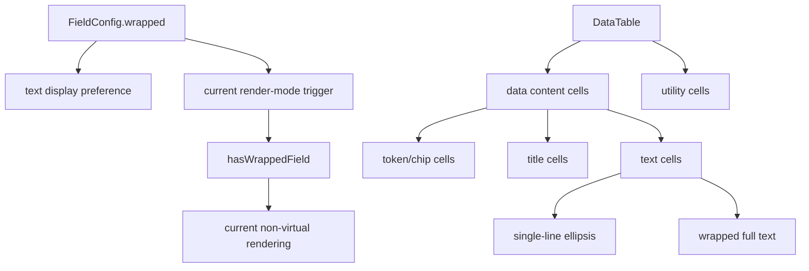

# 表格左上对齐与完整内容显示 Implementation Plan

> **For agentic workers:** REQUIRED SUB-SKILL: Use `superpowers:subagent-driven-development` (recommended) or `superpowers:executing-plans` to implement this plan task-by-task. Steps use checkbox (`- [ ]`) syntax for tracking.

**Goal:** 让主表数据内容格统一左上对齐，并让开启换行的文本列在主表中完整显示，同时把 `wrap`、cell 布局语义和当前渲染模式边界明确化。

**Architecture:** 先把主表 cell 分成 `data content cell / utility cell / text cell / token cell` 四类语义，再分别收口 `td` 基线、文本完整展示规则和标题/关系/chip 型 renderer 的内部布局。当前 `wrap -> hasWrappedField -> 非虚拟滚动` 的实现保留，但在文档和测试中明确它只是当前实现债，不是 `wrap` 的天然定义。由于项目仍处于早期阶段，本轮不保留旧共享 class 的长期兼容层，最终状态应收敛到新 contract 命名。

**Tech Stack:** React 18, TypeScript, `@tanstack/react-table`, CSS, Playwright e2e, Node.js `node:test`.

---

## 方案概述

### 总体目标和范围

本计划执行 [表格左上对齐与完整内容显示方案](C:/Code/data-editor/docs/plans/2026-06-07-表格左上对齐与完整内容显示方案.md)。范围聚焦主表显示框架，不进入 detail panel、字段编辑语义或新的折叠交互。

范围包括：

- 定义主表 `cell layout contract`
- 区分 `data content cell` 与 `utility cell`
- 统一数据内容格顶对齐
- 将“文本完整展示”从共享 `.cell-wrap` 语义中拆出
- 收口标题列、relation、多选、backlink 等 renderer 的内部布局
- 更新现有测试与文档

范围不包括：

- 不重做动态行高虚拟滚动
- 不新增“展开全文/收起全文”
- 不改 detail panel 的字段组件布局
- 不调整列头截断策略

补充边界：

- `RelationCellEditor`、`OptionFieldEditor` 等组件虽然被主表和 detail panel 复用，但本计划只允许主表显示契约发生变化。
- 如果实现过程中发现主表所需 contract 与 detail panel 复用路径冲突，应通过主表专用 class 或分支 props 隔离，不能顺手改写 detail panel 的既有布局语义。

### 各阶段任务概要

1. **契约阶段**：定义主表 cell 语义边界，明确哪些节点参与顶对齐，哪些节点参与文本完整展示。
2. **结构阶段**：在表格和 renderer 层引入新的 class/语义，解除当前 `.cell-wrap` 的双重职责。
3. **样式阶段**：统一数据内容格顶对齐，并让文本类 cell 在 wrap 时完整显示。
4. **组件收口阶段**：修正标题列按钮、relation、option field、backlink 的布局契约。
5. **验证阶段**：补 node/test 与 Playwright 回归，覆盖静态样式和可见行为。
6. **文档阶段**：同步方案文档和系统结构说明，固定当前实现债边界。

### 整体结构框架



---

## 文件职责

- Modify: `src/table/DataTable.tsx`
  - 区分 `data content cell` 与 `utility cell`，明确 `wrapped` 如何映射到表格语义 class，并同步复核 `tableData` / row rendering path 的运行态边界。
- Modify: `src/table/CellRenderer.tsx`
  - 收口普通文本 cell 的 class 语义，避免继续复用单一 `.cell-wrap` 表达两种职责。
- Modify: `src/table/BacklinkCellViewer.tsx`
  - 区分空态文本展示与 chip 列表展示的布局语义。
- Modify: `src/table/RelationCellEditor.tsx`
  - 确认 relation trigger 只继承顶对齐，不自动继承完整文本展示；不得无意影响 detail panel 复用场景。
- Modify: `src/table/OptionFieldEditor.tsx`
  - 确认 select / multi-select trigger 的布局语义与文本类 cell 分离；不得无意影响 detail panel 复用场景。
- Inspect: `src/detail/DetailPanel.tsx`
  - 复核主表复用组件进入 detail panel 的路径，确认主表 contract 改动不会泄漏到 detail panel。
- Modify: `src/styles.css`
  - 新增或替换主表 cell contract 对应样式，拆分“顶部对齐类”和“文本完整展示类”。
- Modify: `tests/data-editor.spec.ts`
  - 覆盖运行态对齐、wrap 完整展示、utility cell 边界和 wrap 切换后的行为。
- Modify: `docs/plans/2026-06-07-表格左上对齐与完整内容显示方案.md`
  - 如实施中有命名或 contract 微调，保持方案文档与落地一致。
- Modify: `docs/08_系统结构.md`
  - 补充主表显示契约与当前 wrapped 渲染模式边界。

---

## Task 1: 定义主表 Cell Contract 并落到组件结构

**Files:**
- Modify: `src/table/DataTable.tsx`
- Modify: `src/table/CellRenderer.tsx`
- Modify: `src/table/BacklinkCellViewer.tsx`
- Modify: `src/table/RelationCellEditor.tsx`
- Modify: `src/table/OptionFieldEditor.tsx`

- [ ] **Step 1: 在 `DataTable.tsx` 区分 data content cells 和 utility cells**

目标：

- 不再让“是否 wrapped”直接决定 `td` 是否属于唯一特殊类型。
- 为数据内容格引入单独 class，例如 `data-cell`。
- 为工具格和尾部占位格明确保留独立 class 或不参与统一规则。
- 同步检查 `tableData`、`row.getVisibleCells()` 和 `td className` 生成路径，确保 contract 真正落在主表渲染主链路上，而不只是某个局部 renderer。

验证点：

- `row-action-cell` 继续只表达操作列语义。
- 尾部空白占位格不会被意外套用内容格规则。
- `tableData` / `__rowIndex` 运行态流不因本轮 class 调整产生额外副作用。

- [ ] **Step 2: 在 `CellRenderer.tsx` 拆分文本类语义 class**

目标：

- 普通文本 cell 保留 `editable-cell cell-display` 结构。
- 引入独立的“文本完整展示”语义 class，避免继续只靠 `.cell-wrap` 表示。
- 明确未 wrap 与 wrapped 的文本路径分流。

验证点：

- 未 wrap 时仍单行省略。
- wrapped 时具备完整展示入口，但不影响非文本 renderer。

- [ ] **Step 3: 让 `BacklinkCellViewer.tsx` 区分空态文本与 chip 列表**

目标：

- 空态 `-` 或 `关联失效` 走文本类语义。
- chip 列表走 token/chip 语义。
- 不让同一个 `cell-wrap` 同时控制两者。

- [ ] **Step 4: 让 `RelationCellEditor.tsx` 与 `OptionFieldEditor.tsx` 只继承顶部基线**

目标：

- relation / select / multi-select trigger 只需要顶部对齐和稳定高度。
- 它们默认不承诺“完整文本展示”。
- 保留 chip 流式换行能力，但与普通文本溢出规则分离。
- 如果主表所需 class 语义与 detail panel 复用路径冲突，优先新增主表专用 class 或 props，而不是直接改公共默认值。

- [ ] **Step 5: 冻结主表最终 class 命名与旧 class 处置策略**

目标：

- 明确最终保留哪些 class 名。
- 明确 `wrapped-cell` 是删除、降级为兼容桥、还是仅在迁移阶段短暂保留。
- 明确 `.cell-wrap` 是否继续存在；如果存在，它只保留哪一种语义。

推荐默认策略：

- 删除 `wrapped-cell`，不再让 `td` 通过旧命名承载“wrapped 特殊格”语义。
- 删除共享 `.cell-wrap`，不再让同一 class 跨文本、标题、relation、option、backlink 复用。
- 以显式 contract class 替代旧入口，例如：
  - `data-cell`
  - `cell-top-align`
  - `cell-text-wrap`
  - `cell-token-flow`

说明：

- 如果执行中发现某一步必须短暂保留旧 class，也只能作为迁移期桥接，且必须在 Task 5 清理完成；不能把“临时兼容”落成长期框架状态。

输出要求：

- 在实施记录或文档注释中写清：
  - `wrapped-cell` 最终去留
  - `.cell-wrap` 最终去留
  - 新引入的主表 contract class 清单

- [ ] **Step 6: 运行静态检查**

Run:

```powershell
npm run typecheck
```

Expected: PASS

---

## Task 2: 收口 CSS Contract，统一数据内容格顶对齐

**Files:**
- Modify: `src/styles.css`

- [ ] **Step 1: 重写主表 `td` 相关规则的适用范围**

目标：

- 明确哪些规则作用于数据内容格。
- 明确哪些规则只作用于 `wrapped-cell` 的旧路径，并准备迁出。
- 避免通用 `.data-table td` 一刀切误伤 utility cells。

交付要求：

- 必须在这一阶段决定 `wrapped-cell` 的最终处置：
  - 删除
  - 兼容桥接
  - 仅迁移期保留

不能让旧入口和新入口长期并存且职责重叠。

推荐落地：

- `td` 层只保留数据语义 class 与 utility 语义 class。
- 不继续让 `wrapped-cell` 留在最终 DOM 里。
- 若迁移期暂时保留，必须在 CSS 中标明为桥接规则，并限制删除窗口到 Task 5 前结束。

- [ ] **Step 2: 拆分“顶部对齐类”和“文本完整展示类”**

目标：

- 顶部对齐类只负责：
  - `vertical-align`
  - `align-items`
  - 必要 padding / baseline
- 文本完整展示类只负责：
  - `white-space`
  - `overflow`
  - `text-overflow`
  - `word-break`
  - `line-height`

- [ ] **Step 3: 去掉文本路径上的 `max-height: 62px` 硬截断**

目标：

- wrapped 文本类 cell 完整显示
- 不再出现 `scrollHeight > clientHeight`
- 不把该变化默认扩散到 token/chip/button renderer

- [ ] **Step 4: 收口 `.title-cell`、`.chips-cell`、`.multi-select-trigger`、`.backlink-chips-cell`**

目标：

- 标题列默认顶对齐
- token/chip 容器只继承顶部基线
- 继续支持 chip 自然换行，但不混入文本全文展示语义

- [ ] **Step 5: 做一次 scoped 构建验证**

Run:

```powershell
npm run typecheck
npm run build
```

Expected: PASS

---

## Task 3: 标题列交互契约与按钮定位收口

**Files:**
- Modify: `src/styles.css`
- Modify: `src/table/DataTable.tsx`

- [ ] **Step 1: 明确标题列的文本展示策略**

目标：

- 未 wrap 时保持当前单行省略
- wrapped 时允许多行完整展示
- 文本宽度与按钮占位关系明确，不靠 hover 偶然成立

- [ ] **Step 2: 重设 `.title-open-button` 的定位契约**

目标：

- 明确按钮是相对整格右上角，还是相对首行中心
- 长标题换行后按钮仍可预测
- hover 显示不应导致文本区域突变

- [ ] **Step 3: Browser 目测验证标题列**

验证对象：

- `prototypes_minimal_subjects.json`
- `prototypes_mini.json`

观察点：

- 长标题换行后按钮位置稳定
- 标题列与普通文本列基线一致

- [ ] **Step 4: 为标题列按钮补自动化位置断言**

目标：

- 不只依赖目测。
- 在 Playwright 中至少断言：
  - 多行标题时 `.title-open-button` 仍位于标题格可点击区域内
  - hover 后按钮出现不会把文本挤到不可读
  - 标题文本容器的 bounding box 不会被按钮覆盖到首行不可读

这一步可以复用现有标题列测试场景，但断言语义必须迁移到新的 contract class，而不是继续依赖旧 `.title-cell.cell-wrap`。

---

## Task 4: 明确 `wrap` 与当前渲染模式的边界并补回归

**Files:**
- Modify: `tests/data-editor.spec.ts`
- Modify: `docs/08_系统结构.md`
- Modify: `docs/plans/2026-06-07-表格左上对齐与完整内容显示方案.md`

- [ ] **Step 1: 先迁移现有 Playwright 的旧选择器依赖**

这一阶段先消除旧 `.cell-wrap` / `.title-cell.cell-wrap` 选择器依赖，再谈新断言。

优先迁移现有断言位置：

- `tests/data-editor.spec.ts:1410`
- `tests/data-editor.spec.ts:1455`
- `tests/data-editor.spec.ts:1694`

要求：

- 旧 `.cell-wrap` / `.title-cell.cell-wrap` 选择器断言不能原样保留。
- 迁移后的选择器必须对应新 contract，而不是换个名字继续表达旧混合语义。
- 如需兼容迁移期桥接 class，只能作为短期过渡，且要在测试里标注待清理点。

- [ ] **Step 2: 为现有 Playwright 用例补 contract 断言**

这一阶段不是“在旧断言后面再补几条”，而是基于 Step 1 已迁移后的选择器补新的 contract 断言。

至少覆盖：

- 数据内容格顶对齐
- utility cell 未被误卷入
- wrapped 文本完整显示
- 标题列按钮位置可接受

- [ ] **Step 3: 增加 wrap 切换前后行为断言**

至少覆盖：

- 开启 wrap 后文本完整显示
- 当前 view 进入自然行高/非虚拟模式后无错位
- 关闭 wrap 后恢复紧凑视图
- 选中行与 detail panel 行为不漂移

- [ ] **Step 4: 增加 scoped 测试集验证**

Run:

```powershell
npm run typecheck
node --test tests/filtering.test.mjs tests/sorting.test.mjs tests/view-state.test.mjs
DATA_EDITOR_E2E_PORT=8800 playwright test tests/data-editor.spec.ts --grep "wrap|title|detail panel width|select column dragged"
```

Expected: PASS

目的：

- 先确保与本轮高相关的测试链路稳定。
- 避免一开始就被全量测试中的无关失败噪音阻塞。

- [ ] **Step 5: 同步文档中的实现债边界**

在 `docs/08_系统结构.md` 和方案文档中明确：

- `wrap` 是内容展示偏好
- `hasWrappedField` 是当前实现里的渲染模式触发条件
- 两者当前共享同一来源，但语义已拆分
- 动态行高虚拟化不在本轮处理

- [ ] **Step 6: 执行完整验证**

Run:

```powershell
node --test tests/*.test.mjs
npm run typecheck
npm run build
DATA_EDITOR_E2E_PORT=8800 npm run test:e2e
```

Expected: PASS

---

## Task 5: 实施后复核与清理

**Files:**
- Modify: `src/styles.css`
- Modify: `src/table/*.tsx`（仅限本轮涉及文件）

- [ ] **Step 1: 清理旧 `.cell-wrap` 路径上的遗留双重语义**

目标：

- 不再存在单个 class 同时表示“顶部对齐 + 文本完整展示”
- 文本类与 token/chip 类展示策略边界清晰
- `wrapped-cell` 的最终状态与 Task 1/2 中冻结的策略一致，不出现“计划说删除、实现却继续长期依赖”的漂移。

- [ ] **Step 2: 搜索全仓与旧语义相关的断言和类名**

Run:

```powershell
rg -n "cell-wrap|wrapped-cell|title-cell|backlink-chips-cell|multi-select-trigger" src tests -S
```

Expected:

- 每个保留下来的 class 都有明确职责
- 不再存在文档和实现相互矛盾的旧语义

- [ ] **Step 3: 进行一次最终 Browser 复核**

覆盖：

- `prototypes_minimal_subjects.json`
- `prototypes_mini.json`
- 含 backlink / relation 的典型表

确认：

- 无“换行了但内容仍显示不全”
- 无“同一行顶部/居中混排”
- 无明显按钮漂移或 chip 塌缩

---

## 执行建议

推荐分 3 次 scoped commit：

1. `feat: 收口主表 cell layout 语义`
2. `feat: 支持表格换行文本完整显示`
3. `test: 补充表格对齐与换行回归`

如果执行中发现 `styles.css` 改动开始失控，不要继续堆条件选择器；应立即回到 Task 1，把 contract 再收紧一次，再继续落样式。

---

## 计划结论

本计划的关键不是“删掉 62px 截断”本身，而是先把当前主表显示框架的三层职责拆清：

- `wrap` 是用户展示偏好
- cell contract 决定谁负责布局和溢出
- `hasWrappedField` 只是当前实现里的渲染模式触发条件

按这个顺序执行，后续才能稳定扩展，而不会再次把一次样式修复写成新的框架默认。
