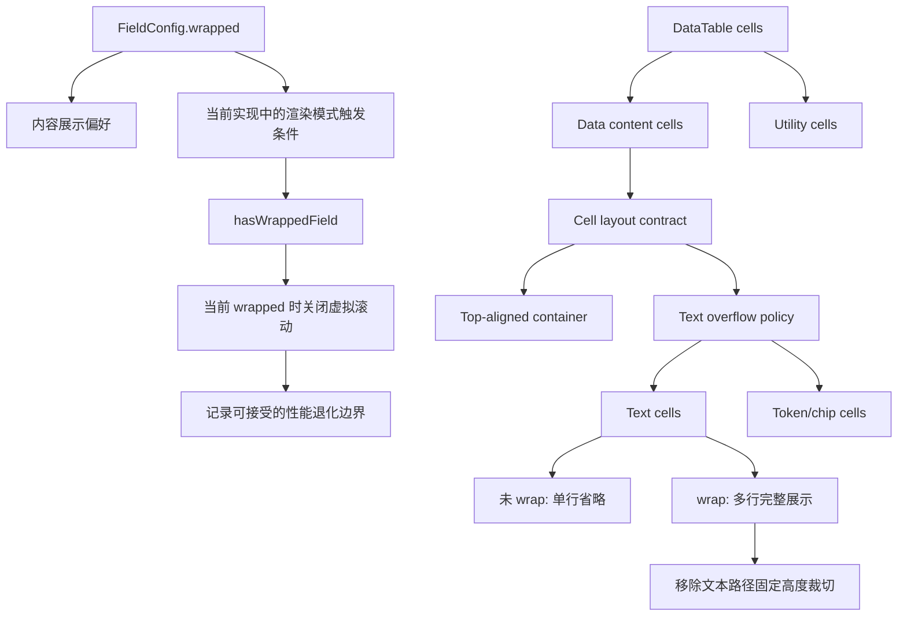

# 表格左上对齐与完整内容显示方案

## 方案概述

### 总体目标和范围

本方案目标是解决当前表格中两类已经确认的可见问题：

1. 同一行内不同列的垂直对齐方式不一致，部分单元格左上对齐，部分单元格仍然垂直居中。
2. 文本列即使开启自动换行，内容仍可能因为 `max-height: 62px` 被继续裁切，导致用户无法直接在主表中读完整内容。

本轮方案采用已经确认的 **方案 B**：

- 主表数据内容格统一采用左上对齐，而不是只让 `wrapped-cell` 左上对齐。
- 取消当前文本换行路径上的 62px 硬截断，让开启换行的文本列真正显示完整内容。

本轮范围包括：

- 主表 `DataTable` 内数据内容格的统一左上对齐策略。
- 普通文本单元格、标题单元格、多选/单选/关联/反向关联等 cell renderer 的内部对齐一致化。
- 从当前文本换行路径中移除固定高度裁切，让换行文本完整展开。
- 明确 `wrap`、cell 布局语义和表格渲染模式之间的职责边界。
- 校验现有“只要任一字段开启 wrap 就关闭虚拟滚动”的逻辑在本轮中的定位和接受范围。
- 补充针对主表显示行为的回归验证。

本轮范围不包括：

- 不改 detail panel 的字段布局和输入控件样式。
- 不引入“折叠/展开全文”交互。
- 不在本轮把未开启 wrap 的列改成默认多行展示；未开启 wrap 的文本列仍可保留单行省略。
- 不处理列头文案截断问题，本轮聚焦表体单元格。

### 各阶段任务概要

第一阶段：收敛当前问题模型与职责边界。  
主要工作是把“默认单行省略”“开启 wrap 后仍被 62px 裁切”“只有 wrapped-cell 顶对齐”“wrap 还会切换整表渲染模式”这四条现状固定下来，并明确哪些是用户偏好、哪些是布局契约、哪些是性能实现。预期成果是把本轮从“修样式”提升为“修表格显示框架语义”。

第二阶段：定义主表 cell layout contract。  
主要工作是把数据内容格、工具格、文本类 cell、token/chip 类 cell、标题 cell 的职责边界写清楚，明确顶部对齐是谁负责、文本溢出是谁负责、哪些 cell 不参与完整文本展示语义。预期成果是后续实现不再依赖零散 class 的偶然组合。

第三阶段：统一数据内容格的顶对齐策略。  
主要工作是把数据内容格的默认垂直对齐统一收敛到顶部，并同步检查标题列、标签类按钮容器、backlink 容器、普通文本容器的内部 `align-items` 是否仍存在居中残留。预期成果是同一行中不再混用“顶部 + 居中”两套垂直基线。

第四阶段：取消文本换行路径的固定高度裁切。  
主要工作是把“文本完整展示”从当前共享的 `.cell-wrap` 泛化语义中拆出来，避免它误伤非文本组件，并让开启换行的文本列真正展示完整内容。预期成果是“开启 wrap 后即可读全内容”成为文本类 cell 的稳定语义，而不是所有 wrapped 组件的副作用。

第五阶段：确认渲染模式与性能边界。  
主要工作是基于现有 `hasWrappedField` 逻辑，明确 `wrap` 与表格渲染模式之间当前仍复用同一触发条件，但语义上不再视为同一概念；同时记录当前接受的性能退化边界，而不在本轮引入新的动态行高虚拟化方案。预期成果是产品语义、代码语义和实现债边界一致。

第六阶段：补验证与文档同步。  
主要工作是补单测或 e2e，并把“数据内容格左上对齐 + 文本 wrap 完整展示 + wrap 切换影响渲染模式”的验收口径写入文档，避免后续再把裁切规则偷偷带回来。预期成果是后续样式调整有清晰回归基线。

执行顺序为：现状固化与职责拆分 -> 定义 cell contract -> 顶对齐收敛 -> 文本完整展示 -> 渲染模式边界确认 -> 回归与文档。

### 整体结构框架

---

## 背景

当前主表显示行为由三层规则共同决定：

1. `DataTable.tsx` 根据字段级 `wrapped` 状态决定是否给 `td` 添加 `wrapped-cell`。
2. `CellRenderer.tsx` 和各类专用 cell viewer 决定文本是以普通文本、标题、chip、按钮还是 relation trigger 形式输出。
3. `styles.css` 分别对 `td`、`.cell-display`、`.cell-wrap`、`.title-cell`、`.multi-select-trigger`、`.backlink-chips-cell` 等节点施加对齐、裁切和换行规则。

当前问题不是单一选择器写错，而是这三层规则的组合结果：

- 普通文本默认单行省略。
- 开启 wrap 后虽然允许多行，但又被固定高度裁切。
- 只有 `wrapped-cell` 的 `td` 才顶对齐，其余 `td` 保持浏览器默认 `middle`。
- 某些 renderer 内部容器还保留 `align-items: center`，进一步放大视觉不一致。

除此之外，当前 `wrap` 还承担了额外角色：它不仅是用户的字段展示偏好，还会经由 `hasWrappedField` 直接切换整表渲染模式。  
因此，本轮方案必须同时处理三件事：

- 表格单元格基线
- 换行后的内容可见性
- `wrap` 与渲染模式之间的职责边界

不能只改其中一半。

---

## 当前实现结论

根据当前代码和运行态检查，可以明确以下事实：

### 1. 默认文本列天然会省略

普通文本单元格由 [src/table/CellRenderer.tsx](C:/Code/data-editor/src/table/CellRenderer.tsx:128) 输出为：

- `editable-cell`
- `cell-display`
- 可选 `cell-wrap`

而 [src/styles.css](C:/Code/data-editor/src/styles.css:1742) 对 `.cell-display span` 写死了：

- `overflow: hidden`
- `text-overflow: ellipsis`
- `white-space: nowrap`

结论：未开启 wrap 时，列宽不足就一定会截断。

### 2. 开启 wrap 后并不等于完整显示

[src/styles.css](C:/Code/data-editor/src/styles.css:1748) 当前对 `.cell-wrap` 统一写了：

- `align-items: flex-start`
- `max-height: 62px`
- `overflow: hidden`

这意味着 wrap 的真实语义是“允许多行，但最多显示约 2-3 行”。  
运行态测得多个文本单元格 `scrollHeight > clientHeight`，已经发生实际裁切。

### 3. 顶对齐只作用于 wrapped-cell

[src/styles.css](C:/Code/data-editor/src/styles.css:1506) 的普通 `td` 没有显式统一 `vertical-align`，浏览器默认表现为 `middle`。  
只有 [src/styles.css](C:/Code/data-editor/src/styles.css:1516) 的 `.data-table td.wrapped-cell` 才被设置成：

- `padding-top: 7px`
- `padding-bottom: 7px`
- `vertical-align: top`

结论：只要当前 view 里有部分字段开启 wrap、部分字段没开，同一行就会自然出现“上对齐 + 居中”混排。

### 4. 内部 renderer 对齐方式也不统一

- [src/styles.css](C:/Code/data-editor/src/styles.css:2250) 的 `.title-cell` 默认 `align-items: center`
- [src/styles.css](C:/Code/data-editor/src/styles.css:2269) 的 `.title-cell.cell-wrap` 才改为 `align-items: flex-start`
- [src/styles.css](C:/Code/data-editor/src/styles.css:1778) 的 `.multi-select-trigger` 默认就是 `align-items: flex-start`
- [src/styles.css](C:/Code/data-editor/src/styles.css:1837) 的 `.backlink-chips-cell` 也是 `align-items: flex-start`

结论：即使未来统一了 `td` 顶对齐，内部容器如果仍混用 `center` 和 `flex-start`，视觉仍可能不完全一致。

### 5. wrapped 是按 view 持久化的

[src/view-state-storage.mjs](C:/Code/data-editor/src/view-state-storage.mjs:113) 和 [src/view-state-storage.mjs](C:/Code/data-editor/src/view-state-storage.mjs:193) 表明 `wrapped` 是按 `path + collectionPath + viewId + fieldName` 保存的。  
这说明当前混合状态通常是 view 级布局状态的真实结果，不是随机样式漂移。

### 6. wrap 与滚动策略强耦合

[src/table/DataTable.tsx](C:/Code/data-editor/src/table/DataTable.tsx:150) 定义了 `hasWrappedField`。  
只要当前可见字段里有任意一个字段开启 wrap，[src/table/DataTable.tsx](C:/Code/data-editor/src/table/DataTable.tsx:211) 就会把窗口大小直接切到 `rows.length`，整表退出固定行高虚拟滚动。

结论：本轮如果扩大 wrap 的真实展示高度，必须明确这是与“整表非虚拟滚动”一起生效的行为，而不是孤立样式改动。

### 7. 当前缺少统一的 cell layout contract

从 `DataTable` 和 `styles.css` 看，当前至少存在以下几类格子：

- 数据内容格：`row.getVisibleCells().map(...)` 生成的主内容 `td` [src/table/DataTable.tsx:542-545]
- 工具格：`row-action-cell` 删除按钮列 [src/table/DataTable.tsx:537-540, src/styles.css:1541]
- 尾部占位格：最后一个空 `td` [src/table/DataTable.tsx:547]
- 文本类容器：`.editable-cell.cell-display`
- token/chip 类容器：`.chips-cell`、`.multi-select-trigger`、`.backlink-chips-cell`
- 标题类容器：`.title-cell`

这些节点目前没有一个统一的布局契约，只是通过若干 class 叠加形成最终表现。  
结论：如果不先定义 contract，而是直接改零散样式，后续每新增一种 cell renderer 还会再次分叉。

---

## 方案 B 的目标语义

### 1. 顶对齐成为数据内容格默认语义

主表中所有数据内容格统一采用左上对齐。这里的“左上对齐”包含两层：

- `td` 本身统一 `vertical-align: top`
- cell 内部主容器统一优先沿顶部起排

这样即使某一列是短标签、另一列是长文本、第三列为空值，占位基线也都一致。

这里不默认把所有表格格子都纳入同一语义。  
`row-action-cell`、尾部占位格等 utility cells 是否跟随顶对齐，应作为实现时显式选择，而不是被通配 `td` 规则顺带改变。

### 2. wrap 真正等于“文本完整显示”

当用户对字段开启“内容自动换行”时，系统语义应明确为：

- 主表允许该字段在当前列宽下展开为多行
- 主表不再使用固定高度把这段文本截断
- 用户无需依赖 tooltip 或 detail panel 才能读完该格文本

也就是说，对文本类 cell 而言，wrap 不再是“显示更多一点”，而是“主表内完整显示”。

这条语义不自动扩散到所有使用 `cell-wrap` 或类似 class 的组件。  
token/chip、relation trigger、backlink button 这类组件是否完整展开，应由各自 renderer contract 决定，而不是默认继承文本策略。

### 3. 未开启 wrap 的列仍可保持紧凑

本轮不把所有文本列都改成天然多行。未开启 wrap 的文本列仍可以保留：

- 单行显示
- 超出列宽时省略

这样可以保留现有 view 布局的紧凑性，也不会把所有表都强制变成长行高。

### 4. wrap 与渲染模式在语义上解耦

本轮不引入动态行高虚拟滚动。当前“有 wrap 字段就整表非虚拟滚动”的实现可以继续保留，但文档必须明确：

- `wrap` 首先是字段内容展示偏好
- `hasWrappedField` 只是当前实现里用来切换渲染模式的触发条件
- 两者当前复用同一来源，但不应被视为天然同义

也就是说，本轮接受“实现上仍耦合，语义上先解耦”的状态。

### 5. 性能边界作为已知实现债记录

当前 wrapped 时整表非虚拟滚动的策略继续成立，只是需要把它作为明确边界写进实现和验收：

- 本轮优先解决可读性和一致性
- 不同时尝试重做虚拟化模型
- 这是当前阶段接受的实现债，不是长期最优架构结论

---

## 推荐实现方案

推荐方案：先定义主表 cell layout contract，再以数据内容格为统一基线，在 renderer 层补齐内部顶对齐，并把“文本完整展示”从当前泛化的 `.cell-wrap` 语义中拆出来。

推荐理由：

1. 根因在 `td`、cell 容器和 `wrap -> 渲染模式` 的联合规则，单点修补某个 renderer 不能彻底解决。
2. 去掉文本路径上的 `max-height: 62px` 后，“内容完整显示”这个产品语义才成立。
3. 如果不先定义 contract，后续每个 renderer 都会各自实现对齐和溢出语义，继续分叉。
4. 当前 wrap 已经会让整表退出虚拟滚动，因此不存在“保留固定 36px 行高”这一前提；继续保留 62px 只是人为限制可见内容。

不推荐方案：

- 只把 `wrapped-cell` 之外的 `td` 改成 `vertical-align: top`，但保留文本路径上的 `max-height: 62px`
  - 这样只能解决对齐，不解决内容仍不完整的问题。
- 继续让 `.cell-wrap` 同时承担“顶部对齐”和“完整文本展示”
  - 这样会把文本语义扩散到 token/chip、标题、relation 等非纯文本组件，后续更难收口。
- 保留现有 `td` 规则，只在少数文本列局部改容器
  - 这样会让不同 renderer 继续各自维护对齐语义，后续更难收口。

---

## 组件与样式层改造建议

## 当前落地约束

本轮实现后，主表 contract 建议固定为以下形态：

- `td[data-cell-kind="data"]` 承担数据内容格基线，统一顶对齐。
- `td[data-cell-kind="data"][data-wrap-mode="wrap|truncate"]` 暴露字段级 wrap 状态，供样式和 e2e 使用。
- 文本类内容通过 `data-cell-role="content"`、`data-cell-role="title"`、`data-cell-role="title-text"` 暴露可测试语义。
- token / select / relation 类入口通过 `surface="table" | "detail"` 区分主表与 detail panel，避免主表布局语义泄漏到详情面板。
- 旧 `wrapped-cell` 与共享 `.cell-wrap` 不再作为长期 contract；文本完整展示改由 `cell-text-wrap`，token 流式换行改由 `cell-token-flow` 承担。

## 主表 cell layout contract

本轮建议先明确主表 cell 的最小布局契约：

### 1. Data content cell

用于真实字段内容展示的 `td`。  
职责：

- 提供统一的垂直基线
- 提供一致的内边距
- 不决定具体文本是否省略、是否完整展开

### 2. Utility cell

用于删除按钮、尾部占位、未来可能的行级操作位。  
职责：

- 保持工具性和点击目标稳定
- 不自动继承文本展示语义

### 3. Text cell

用于普通文本和标题文本。  
职责：

- 决定单行省略还是多行完整展示
- 决定 line-height、word-break、overflow 规则

### 4. Token / chip cell

用于多选、单选、relation、backlink 等 token/button 型内容。  
职责：

- 决定 chip 流式布局和换行
- 不自动承诺“完整文本展示”语义，除非该 renderer 单独声明

这组 contract 的目标不是增加抽象层，而是防止后续再次把“文本裁切规则”误写进通用容器。

### 表格单元格层

建议优先调整：

- [src/styles.css](C:/Code/data-editor/src/styles.css:1506)
- [src/styles.css](C:/Code/data-editor/src/styles.css:1516)

目标是把数据内容格收敛为同一套顶部对齐基线，而不是继续依赖条件分支决定垂直基线。

这里需要显式区分：

- 数据内容格
- `row-action-cell`
- 尾部空白占位格

避免用一个过于宽泛的 `td` 通配规则把 utility cells 也一并绑死。

### 普通文本层

建议调整：

- [src/table/CellRenderer.tsx](C:/Code/data-editor/src/table/CellRenderer.tsx:128)
- [src/styles.css](C:/Code/data-editor/src/styles.css:1742)
- [src/styles.css](C:/Code/data-editor/src/styles.css:1748)

目标是保留：

- 未 wrap 时单行省略

并把 wrap 后行为收敛为：

- 多行自然展开
- 不再使用固定高度裁切

同时建议避免继续让 `.cell-wrap` 一边负责顶部对齐，一边负责文本完整展示。  
从框架设计上，应把“顶部对齐类”和“文本完整展示类”拆成两个独立语义，哪怕实现阶段仍暂时落在相邻样式规则里。

### 标题列层

建议调整：

- [src/table/DataTable.tsx](C:/Code/data-editor/src/table/DataTable.tsx:291)
- [src/styles.css](C:/Code/data-editor/src/styles.css:2250)
- [src/styles.css](C:/Code/data-editor/src/styles.css:2269)

目标是让标题列默认也以顶部为一致基线，避免标题列仍保留“垂直居中 + 右侧浮动按钮”的旧重心。

同时要把标题列定义成独立 contract：

- 文本是否完整展示
- 详情按钮固定在右上角还是首行中线
- hover 后按钮是否影响文本可读宽度

这些都不应再作为“顺手调一下定位”的边角问题处理。

### 选择器与 backlink 层

建议复核：

- `.multi-select-trigger`
- `.chips-cell`
- `.relation-trigger`
- `.backlink-chips-cell`

这些组件大多已经偏向顶部排列，但仍需确认在数据内容格统一顶对齐后，不会出现：

- 空值时按钮块视觉塌缩
- chip 行在单行/多行之间切换时高度异常
- relation / backlink 的打开动作按钮脱离顶部基线

并且需要明确：这些组件默认只继承“顶部基线”，不自动继承“完整文本展示”。

---

## 滚动与布局边界

### 当前边界

当前实现中，只要任一可见字段开启 wrap，整表就会退出固定行高虚拟滚动。这个设计与方案 B 并不冲突，反而是方案 B 的前提保障，因为：

- 完整展示多行内容意味着行高不可再假定为固定 36px
- 现有实现已经接受这一点，并在 `hasWrappedField` 下切为全量渲染

### 本轮建议

本轮不新增更复杂的动态高度虚拟化方案，而是明确以下行为：

- 未开启 wrap：继续走紧凑表格 + 固定行高虚拟滚动
- 只要当前 view 有 wrap 字段：主表允许自然行高，整表非虚拟滚动

但文档必须同时注明：这里的“wrapped 时整表非虚拟滚动”是当前实现策略，不是 `wrap` 这个用户偏好的天然定义。

### 风险提示

当某个 view 同时开启大量宽文本字段的 wrap 时：

- 单页 DOM 数量会上升
- 滚动长度会明显增加
- 首屏密度会下降

但这是方案 B 的明确取舍，不应再通过“偷偷加回 62px 裁切”来回避。

从框架角度，应把这条记录为已知实现债：

- 当前接受
- 本轮不治理
- 未来如果大表性能成为主问题，应单开方案处理动态行高虚拟化

---

## 风险与约束

### 风险 1：数据内容格和 utility cell 范围混淆

如果实现时直接把通用 `td` 一刀切，可能把删除按钮列、尾部占位格等工具格也卷入数据内容格语义。  
处理方式：先在实现上区分 data content cells 和 utility cells，再决定哪些 cell 跟随统一顶对齐。

### 风险 2：全表顶对齐后，短内容列视觉更“贴上”

这会改变现有紧凑视图里短标签、空值、按钮型内容的视觉重心。  
处理方式：通过统一 `td` padding 和内部容器顶部对齐来保证整齐，而不是回退到居中。

### 风险 3：取消 62px 截断后，长文本行高显著增加

这会降低每屏可见行数。  
处理方式：保持“wrap 是字段级开关”，不把所有文本列默认改为多行。

### 风险 4：标题列的打开详情按钮位置需要重新校准

标题列当前按钮是按旧中心线设计的。  
处理方式：同步复核 `.title-open-button` 的定位方式，确保长标题换行后按钮仍可预期。

### 风险 5：共享 `.cell-wrap` 语义继续污染非文本组件

如果只是删除 `.cell-wrap` 的固定高度而不拆语义，token/chip、relation trigger、标题容器都会继续共享同一行为入口。  
处理方式：把“顶部对齐”和“文本完整展示”拆成独立语义。

### 风险 6：backlink / relation / select 型 cell 在空值状态下出现异常高度

这些 renderer 不一定直接受 `.cell-wrap` 影响，但受统一顶对齐后可能出现新空隙。  
处理方式：把它们纳入同一轮 Browser 验证，而不是只测普通文本列。

### 风险 7：后续样式收口时把高度裁切悄悄带回

如果没有明确验收标准，后续有人可能会为了“紧凑”重新加回固定高度。  
处理方式：把“wrap 后完整展示”写成明确验收条件，并补测试。

### 风险 8：wrap 开关继续被误当成渲染模式定义本身

如果不在文档中明确职责边界，后续实现者仍会自然认为“wrap = 非虚拟模式”。  
处理方式：文档明确写成“当前复用同一触发条件，但语义上已拆分”。

---

## 验证方案

至少补以下验证：

1. 普通文本列未开启 wrap 时仍保持单行省略。
2. 普通文本列开启 wrap 后，在主表中完整显示，不再出现 `scrollHeight > clientHeight` 的裁切。
3. 数据内容格的 `td` 计算后 `vertical-align` 一致为顶部。
4. `row-action-cell` 和尾部占位格的行为经过显式确认，不因为通配规则被意外卷入。
5. 标题列、短标签列、空值列、relation 列、backlink 列在同一行中视觉基线一致。
6. 开启 wrap 的 view 仍可正常滚动、点击、打开 detail，不出现行高错位。
7. wrap 开关切换前后，滚动、选中行、详情面板和横向布局行为保持可解释。
8. 切换到未开启 wrap 的 view 时，仍保持原有紧凑表格和固定行高滚动体验。
9. Browser 实测下，至少覆盖：
   - `prototypes_minimal_subjects.json`
   - `prototypes_mini.json`
   - 一个包含 backlink / relation 的典型表

如果补 e2e，推荐把断言拆成两类：

- DOM / computed style 断言
- 用户可见行为断言

这样后续既能防止样式回归，也能防止“虽然 CSS 改了，但用户还是看不全”。

---

## 推荐落地顺序

1. 先定义 data content cell / utility cell / text cell / token cell 的 layout contract。
2. 再修改数据内容格顶对齐基线，消灭同一行混合垂直对齐。
3. 然后把文本完整展示语义从当前共享 `.cell-wrap` 中拆出来，取消文本路径固定高度裁切。
4. 再收口标题列、relation、backlink、chip 型容器的内部对齐与各自 contract。
5. 最后补 Browser 验证、必要测试和文档回归。

这样可以先把框架语义、视觉基线和内容完整性三个核心问题分别收口，再处理组件边角，不会在一次大改里混淆根因。

---

## 验收标准

满足以下条件即可认为本方案完成：

1. 主表数据内容格统一左上对齐，不再区分 `wrapped-cell` 和普通数据内容格的垂直基线。
2. 工具格是否跟随顶对齐经过显式定义，而不是被通配 `td` 规则意外改变。
3. 开启 wrap 的文本列在主表中完整显示，不再受 62px 固定高度裁切。
4. 未开启 wrap 的文本列仍保持当前单行省略语义。
5. 标题列与普通文本列、多选/单选/关联/backlink 列在同一行中的视觉起点一致。
6. 文本完整展示语义不再依赖一个同时服务于非文本组件的共享 `.cell-wrap` 规则。
7. 当前 view 只要存在 wrap 字段，主表允许自然行高，不出现固定行高导致的重叠或错位。
8. 文档中明确：`wrap` 是内容展示偏好，`hasWrappedField` 是当前实现中的渲染模式触发条件，两者语义已拆分。
9. 至少在 `prototypes_minimal_subjects.json` 与 `prototypes_mini.json` 的真实运行态下验证通过。
10. 后续再运行 Browser 检查时，不会再次出现“换行了但内容仍显示不全”的状态。

---

## 推荐执行结论

推荐按修订后的方案 B 执行，但执行前提不是“直接删掉几条 CSS”，而是先按文档定义主表 cell layout contract 和 `wrap` 的职责边界，再落实现。

理由是：

1. 用户已经明确把“内容显示不完整”列为问题本身，继续保留 62px 裁切会让问题只换一种表现形式继续存在。
2. 当前代码已经接受“wrap 字段会让整表退出固定行高虚拟滚动”这一前提，因此没有必要再用固定高度强行伪装紧凑。
3. 统一左上对齐只有和“完整显示”一起落地，才是稳定且可解释的产品语义；否则只是视觉修补，不是真正解决问题。
4. 从框架设计角度，只有先拆清 `wrap`、cell layout 和渲染模式三者职责，后续实现和扩展才不会继续把样式例外写成架构默认。
