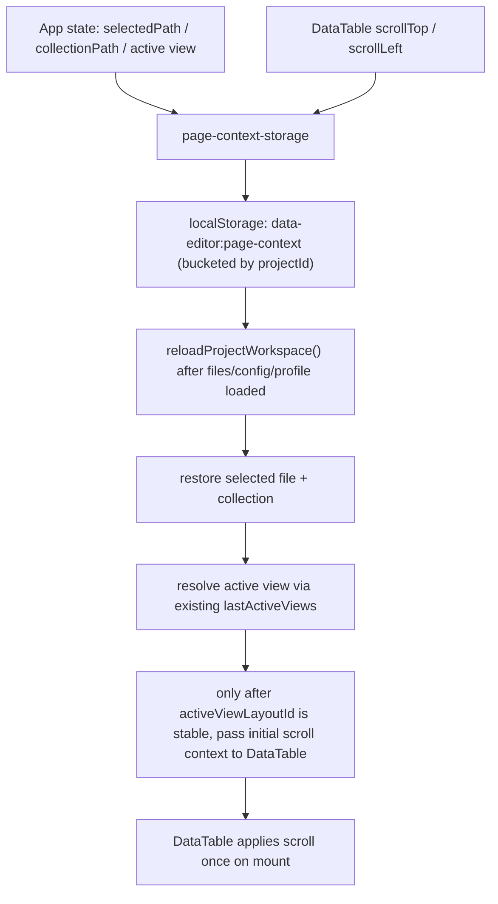

# 刷新保持页面上下文 Implementation Plan

> **For agentic workers:** REQUIRED SUB-SKILL: Use `superpowers:subagent-driven-development` (recommended) or `superpowers:executing-plans` to implement this plan task-by-task. Steps use checkbox (`- [ ]`) syntax for tracking.

**Goal:** 让编辑器页面在浏览器刷新后恢复到刷新前所在的数据文件、对应 collection / shared view，以及主表格的纵向与横向滚动位置，而不是回退到默认文件、默认 collection 或滚动顶部。

**Architecture:** 在现有 `view layout` / `shared view drafts` / `profile` 存储体系之外，引入一层独立的“页面会话上下文”本地存储，按 `projectId` 分桶保存 `selectedPath`、`collectionPath` 与每个 `file + collection + view` 对应的表格滚动位置。`App.tsx` 负责在项目工作区加载完成后解析并恢复上下文，且只在 `activeViewLayoutId` 已稳定后才生成滚动恢复 key；`DataTable.tsx` 负责上报滚动状态并在首次挂载时应用恢复值，二者通过显式 props 传递，避免把滚动这种瞬时页面状态污染进现有视图布局配置。

**Tech Stack:** React 18, TypeScript, localStorage, Playwright e2e, Node.js `node:test`.

---

## 方案概述

### 总体目标和范围

本计划执行“刷新后保持页面位置”需求，范围只包括浏览器本地刷新恢复，不扩展到跨设备同步、多人共享状态或浏览历史栈管理。

范围包括：

- 恢复当前选中的数据文件 `selectedPath`
- 恢复当前 collection `collectionPath`
- 继续沿用现有 `lastActiveViews` 恢复当前 shared view
- 恢复当前 `file + collection + view` 对应的表格 `scrollTop / scrollLeft`
- 按 `activeProjectId` 隔离上述本地页面状态，避免多 project 串状态
- 当本地状态失效时安全回退到现有默认选择逻辑
- 为上述行为补齐 e2e 回归

范围不包括：

- 不把滚动位置写入 profile 或 shared view 配置文件
- 不恢复 detail panel 选中行、展开状态或弹层打开状态
- 不引入 URL 路由参数持久化
- 不改变现有 shared view draft / profile / file order 的存储语义

### 各阶段任务概要

1. **状态模型阶段**：定义页面会话上下文的本地存储结构、key 规则与读写边界。
2. **恢复链路阶段**：在 `App.tsx` 工作区加载路径中恢复文件与 collection，并为表格准备待恢复的滚动上下文。
3. **表格接入阶段**：让 `DataTable.tsx` 采集滚动位置、首次应用恢复值，并避免普通 rerender 覆盖用户新滚动。
4. **失效回退阶段**：补齐文件不存在、collection 不存在、view 失效时的回退逻辑，保证刷新恢复不引入卡死或错误选中。
5. **验证阶段**：通过 Playwright 验证“刷新前后保持位置”和“脏状态失效后安全回退”两类核心场景。

### 整体结构框架



---

## 文件职责

- Create: `src/page-context-storage.ts`
  - 定义按 project 分桶的页面会话上下文结构、localStorage key、读写与规范化逻辑。
- Modify: `src/App.tsx`
  - 在工作区加载、文件切换、collection 切换、view 切换时同步页面上下文；在刷新恢复时决定最终应打开的文件与 collection，并在 active view 稳定后把待恢复滚动信息传给 `DataTable`。
- Modify: `src/table/DataTable.tsx`
  - 增加滚动状态上报与首次恢复逻辑；确保只在上下文切换时重置或恢复滚动，不在普通 rerender 时重置，并同步更新 `memo` 比较函数以纳入新 props。
- Modify: `tests/data-editor.spec.ts`
  - 新增刷新恢复、view 间滚动隔离与失效回退三类 e2e 测试。
- Inspect: `src/view-state-storage.mjs`
  - 仅作为现有 `view layout` / `shared view draft` 存储边界参考，不在本轮直接承载滚动持久化。
- Inspect: `src/App.tsx` 中当前 collection 来源
  - 恢复 collection 时必须复用现有 sidebar / collection 列表所依赖的同一套模型来源，不允许另造与 UI 脱节的 collection 推断逻辑。

---

## Task 1: 定义页面会话上下文存储模型

**Files:**
- Create: `src/page-context-storage.ts`
- Test: `tests/data-editor.spec.ts`

- [ ] **Step 1: 定义最小页面上下文结构**

目标：

- 定义一个独立于 `view-state-storage` 的本地状态对象，至少包含：
  - `projects`
- 每个 project bucket 至少包含：
  - `selectedPath`
  - `collectionPath`
  - `scrollByView`
- `scrollByView` 的 key 必须显式绑定 `path + collectionPath + viewId`，避免不同文件或不同 view 之间串滚动位置。

推荐结构：

```ts
type TableScrollPosition = {
  scrollTop: number;
  scrollLeft: number;
};

type ProjectPageContextState = {
  selectedPath: string | null;
  collectionPath: string;
  scrollByView: Record<string, TableScrollPosition>;
};

type PageContextState = {
  projects: Record<string, ProjectPageContextState>;
};
```

- [ ] **Step 2: 固定 localStorage key 与上下文 key 生成函数**

目标：

- 统一使用单独的存储 key，例如 `data-editor:page-context`
- 所有页面上下文必须按 `activeProjectId` 分桶；如果 `projectId` 为空，不写入页面上下文
- 提供生成滚动上下文 key 的纯函数，例如：
  - `buildScrollContextKey(path, collectionPath, viewId)`
- 保证 `viewId` 为空时不生成滚动 key，避免把“无效视图”写成垃圾状态。

- [ ] **Step 3: 实现 normalize / read / write / patch 接口**

目标：

- 为新模块提供以下最小接口：
  - `emptyPageContextState()`
  - `readPageContextState(localStorage)`
  - `writePageContextState(localStorage, state)`
  - `readProjectPageContext(state, projectId)`
  - `updatePageContextSelection(localStorage, projectId, patch)`
  - `updatePageContextScroll(localStorage, projectId, input)`
- `normalize` 必须清理：
  - 空或非法 `projectId`
  - 非字符串 `selectedPath`
  - 空 `collectionPath`
  - 非有限数的 `scrollTop / scrollLeft`
  - 负数滚动值

- [ ] **Step 4: 明确写入策略**

目标：

- 文件或 collection 改变时立即写入 `selectedPath / collectionPath`
- 仅在“最终 settle 的选择动作”后写入 `selectedPath / collectionPath`，不要把中间态重置值直接落盘
- 表格滚动时写入当前 view 对应 `scrollTop / scrollLeft`
- 本轮不做 `scrollByView` 主动 GC；旧 view / 旧 file 的滚动快照允许保留，只要当前恢复流程不会误命中它们
- 不在本轮做节流优化，先保持实现简单；只有在测试或运行中证明写入频率明显有问题时才单独开后续任务处理。

- [ ] **Step 5: 自检存储边界**

检查清单：

- 滚动状态没有混入 `view-state-storage.mjs`
- 页面上下文没有写入 profile
- 不同 project 的页面状态互不污染
- 无效数据会回落到空状态而不是抛异常

---

## Task 2: 在 `App.tsx` 恢复文件、collection 与待恢复滚动上下文

**Files:**
- Modify: `src/App.tsx`
- Create: `src/page-context-storage.ts`
- Test: `tests/data-editor.spec.ts`

- [ ] **Step 1: 在初始化 state 中读取页面上下文**

目标：

- 在 `App.tsx` 顶层读取新的页面上下文状态，并用 `ref` 持有最新值，避免异步 reload 时读到旧上下文。
- 该 state 只承载页面恢复信息，不替代现有 `selectedPath` / `collectionPath` / `localSharedViewDrafts` 的 React state。
- 读取与写入都必须绑定 `activeProjectId`；project 切换后不得沿用上一个 project 的 bucket。

- [ ] **Step 2: 在 `reloadProjectWorkspace()` 中恢复文件选择**

目标：

- 在 `listFiles()` 返回后，用页面上下文中的 `selectedPath` 作为首选恢复目标。
- 页面上下文必须从当前 `projectId` 对应 bucket 读取。
- 如果该路径不存在，则继续回退到现有 `resolvePreferredFilePath(nextFiles, savedOrder, selectedPathRef.current)` 逻辑。

交付要求：

- 不能因为本地页面上下文里有旧路径，就覆盖当前已有的安全回退逻辑。
- 文件恢复失败时必须回退到现有可用文件，而不是停在 `null`。

- [ ] **Step 3: 在文件恢复后恢复 collection**

目标：

- 当最终选中的文件与页面上下文中的 `selectedPath` 一致时，尝试恢复上下文中的 `collectionPath`。
- 恢复前必须用当前 sidebar / collection 列表使用的同一套模型来源校验该 collection 是否仍然存在；若不存在则回退到 `"$"`。

交付要求：

- 不允许盲目 `setCollectionPath(savedCollectionPath)`。
- `record-map`、根数组、普通 `$` 这几种已有 collection 入口必须沿当前 UI 已使用的模型解析逻辑判断，不引入新的 collection 推断体系。

- [ ] **Step 4: 计算并缓存当前待恢复滚动上下文**

目标：

- 根据最终恢复出来的 `selectedPath`、`collectionPath` 和活动 `viewId`，从页面上下文里取出对应的 `scrollTop / scrollLeft`。
- 只有 `activeViewLayoutId` 已经稳定可用时才允许生成 `scrollRestoreKey` 并读取对应滚动。
- 仅当三者都有效时才向 `DataTable` 传递恢复值；否则传 `null`。

- [ ] **Step 5: 在文件、collection、view 切换时同步页面上下文**

目标：

- 在以下时机写入 `selectedPath / collectionPath`：
  - `openDocumentAt(path, ...)`
  - `handleSelectFile(...)`
  - `onSelectCollection(...)`
  - active view 变化
- active view 变化时不重写旧 view 的滚动，只更新当前“选择上下文”，滚动仍由 `DataTable` 单独上报。
- 如果 `openDocumentAt(...)` 内部存在“先重置到 `$` 再进入目标 collection”的中间态，只允许在最终目标 collection 确认后写入页面上下文，避免把中间态覆盖到本地恢复状态。

---

## Task 3: 让 `DataTable.tsx` 负责滚动采集与首次恢复

**Files:**
- Modify: `src/table/DataTable.tsx`
- Modify: `src/App.tsx`
- Test: `tests/data-editor.spec.ts`

- [ ] **Step 1: 为 `DataTable` 增加滚动恢复 props**

目标：

- 新增最小 props：
  - `scrollRestoreKey: string | null`
  - `initialScrollPosition: { scrollTop: number; scrollLeft: number } | null`
  - `onScrollPositionChange(position)`
- `scrollRestoreKey` 必须和 `page-context-storage` 中的 key 规则一致。
- `DataTable` 的 `memo` 比较函数必须同步纳入这些新 props；否则恢复链路可能实际不触发。

- [ ] **Step 2: 改造当前滚动重置 effect**

背景：

- 当前 `DataTable.tsx` 在 `props.sourcePath` 或 `props.collectionPath` 变化时会直接把 `scrollTop / scrollLeft` 归零。

目标：

- 改为在上下文 key 切换时执行“恢复或归零”：
  - 有 `initialScrollPosition` 时恢复该位置
  - 没有恢复值时再归零
- 保持现有 `sourcePath / collectionPath` 切换后 UI 不沿用旧文件滚动的边界。

- [ ] **Step 3: 在滚动监听中上报最新位置**

目标：

- 复用当前 `.table-scroll` 的 scroll listener，将 `scrollTop / scrollLeft` 经 `onScrollPositionChange` 回传给 `App.tsx`
- 只有当滚动值实际变化时才上报，避免无意义写入。

- [ ] **Step 4: 增加“一次性恢复”保护**

目标：

- 当 `DataTable` 首次拿到某个 `scrollRestoreKey` 时应用一次恢复值
- 后续普通 rerender、列宽变化、排序变化不得再次强制跳回旧位置
- 当 `scrollRestoreKey` 改变时，才允许重新进入恢复流程
- `scrollRestoreKey` 为 `null` 时必须显式跳过恢复，而不是先归零再等下一拍恢复，避免刷新首屏抖动。

- [ ] **Step 5: 保持现有虚拟滚动逻辑不被破坏**

检查点：

- `scrollTop` state 仍能驱动现有虚拟窗口计算
- wrapped 模式和非 wrapped 模式都能正常工作
- 本轮不改 `viewportHeight`、窗口切片和列拖拽预览逻辑

---

## Task 4: 处理失效状态与回退边界

**Files:**
- Modify: `src/App.tsx`
- Create: `src/page-context-storage.ts`
- Test: `tests/data-editor.spec.ts`

- [ ] **Step 1: 清理失效文件状态**

目标：

- 当页面上下文中的 `selectedPath` 在当前文件列表中不存在时，不仅要回退到可用文件，还要把本地上下文更新为新的有效路径。
- 回退更新只能写回当前 `projectId` bucket，不得误改其它 project 的页面状态。

- [ ] **Step 2: 清理失效 collection 状态**

目标：

- 当保存的 `collectionPath` 在当前文件里不存在时，回退到 `"$"`，并把本地上下文同步更新为 `"$"`。

- [ ] **Step 3: 处理失效 view 滚动状态**

目标：

- 当当前 active view 已变化或原 view 不存在时，不使用旧 view 对应的滚动数据。
- 旧 view 的滚动快照可以保留在本地字典中，但当前恢复流程不能误命中它。
- 本轮明确不做 `scrollByView` 主动清理；如果后续需要 GC，单独立项。

- [ ] **Step 4: 保证 profile 模式不被污染**

目标：

- 现有 profile 模式会覆盖列布局、文件顺序等部分本地状态；本轮新增页面上下文不得改变该边界。
- 即使选择了 profile，刷新后也仍然可以恢复“当前文件 / 当前 collection / 当前表格滚动”，但这些数据只存在本地页面上下文，不写回 profile 文件。
- 不同 profile 共用同一 project bucket 下的页面上下文属于本轮可接受行为；本轮不把页面上下文细分到 profile 维度。

---

## Task 5: 补齐刷新恢复与回退测试

**Files:**
- Modify: `tests/data-editor.spec.ts`

- [ ] **Step 1: 编写“刷新后恢复文件、view 与滚动位置”的失败测试**

测试步骤：

- 清空 `localStorage`
- 打开一个可滚动文件，例如 `data/skills.json`
- 切到非默认 view
- 将表格滚动到明显非零的 `scrollTop / scrollLeft`
- `page.reload()`
- 断言：
  - 工具栏当前文件仍为目标文件
  - active view 仍为刷新前 view
  - `.table-scroll` 的 `scrollTop` 和 `scrollLeft` 仍大于零，且接近刷新前值

Run:

```powershell
npx playwright test tests/data-editor.spec.ts --grep "refresh preserves file view and table scroll"
```

Expected: 初次运行 FAIL，失败原因是当前实现刷新后会丢失文件、collection 或滚动位置。

- [ ] **Step 2: 编写“同文件不同 view 滚动隔离”的失败测试**

测试步骤：

- 清空 `localStorage`
- 打开同一个文件
- 在 view A 滚到明显非零位置
- 切到 view B，保持顶部或滚到另一组位置
- `page.reload()`
- 断言：
  - 刷新后 active view 仍为 view B
  - 恢复的是 view B 对应滚动，而不是 view A 的滚动

Run:

```powershell
npx playwright test tests/data-editor.spec.ts --grep "refresh keeps scroll scoped to active view"
```

Expected: 初次运行 FAIL，失败原因是当前实现没有按 `viewId` 隔离滚动恢复。

- [ ] **Step 3: 编写“失效文件/collection 会安全回退”的失败测试**

测试步骤：

- 预先向 `localStorage` 写入无效 `selectedPath`、无效 `collectionPath` 和任意滚动数据
- 重新加载页面
- 断言：
  - 页面仍能打开有效文件
  - collection 回退到 `"$"` 或当前模型默认根集合
  - 表格没有因失效滚动数据报错或卡死

Run:

```powershell
npx playwright test tests/data-editor.spec.ts --grep "refresh fallback ignores stale page context"
```

Expected: 初次运行 FAIL，失败原因是当前实现不会消费或修正这组新上下文状态。

- [ ] **Step 4: 实现后运行定向回归**

Run:

```powershell
npx playwright test tests/data-editor.spec.ts --grep "refresh preserves file view and table scroll|refresh keeps scroll scoped to active view|refresh fallback ignores stale page context"
```

Expected: PASS

- [ ] **Step 5: 为存储规范化补轻量静态测试**

目标：

- 为 `src/page-context-storage.ts` 的 normalize / project 分桶 / 非法滚动值清理补一个轻量 node/test，用来锁定纯数据边界。

建议文件：

- `tests/page-context-storage.test.mjs` 或与现有纯函数测试相同风格的新文件

Run:

```powershell
node --test tests/page-context-storage.test.mjs
```

Expected: PASS

- [ ] **Step 6: 运行相关静态与行为回归**

Run:

```powershell
npm run typecheck
node --test tests/view-state.test.mjs
node --test tests/page-context-storage.test.mjs
```

Expected: PASS

---

## 实施顺序建议

1. 先写 Task 5 的“失效回退”与“正常恢复”失败测试，锁定 project 分桶和恢复行为边界。
2. 再做 Task 1，建立独立 `page-context-storage`。
3. 然后做 Task 2，把恢复链路接进 `App.tsx`。
4. 接着做 Task 3，让 `DataTable.tsx` 支持恢复与上报滚动。
5. 再补 Task 5 的 view 间滚动隔离测试。
6. 最后做 Task 4 的失效回退收尾，并执行全部定向验证。

## 风险与注意事项

- 当前 `DataTable.tsx` 明确在 `sourcePath / collectionPath` 切换时归零滚动，本轮如果只补 `App.tsx` 而不改该 effect，刷新恢复会被立即覆盖。
- 当前 `DataTable` 使用 `memo` 比较；新增恢复 props 后如果不更新比较函数，恢复逻辑可能不会触发。
- 当前 shared view 的活动状态由 `lastActiveViews` 持久化；本轮不要复制出第二套 active view 状态源，避免 view 选择出现双写源。
- 滚动恢复只能作用于“当前最终激活的 view”，不能跨 view 套用，否则切换视图后会出现错位。
- 如果实现中发现 collection 有多种合法根路径，需要复用当前 sidebar / collection UI 已使用的模型解析结果，不要新造一套 collection 列表生成逻辑。
- 页面上下文必须按 `projectId` 分桶；否则多 project 切换后会出现错误恢复。
- 本轮不做 `scrollByView` 主动 GC，这是有意识的延后，不是遗漏。
