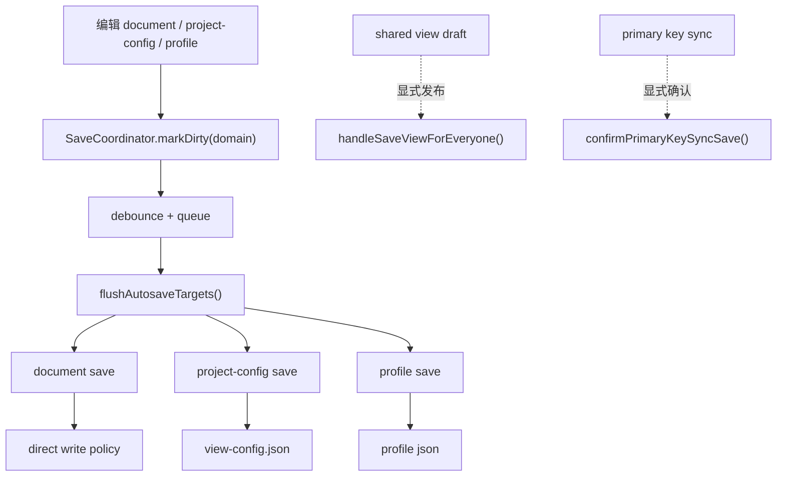

# 自动保存与去备份 Implementation Plan

> **For agentic workers:** REQUIRED SUB-SKILL: Use `superpowers:subagent-driven-development` (recommended) or `superpowers:executing-plans` to implement this plan task-by-task. Steps use checkbox (`- [ ]`) syntax for tracking.

**Goal:** 移除工具栏手动保存按钮，将数据文件、`view-config` 与 profile 的普通落盘统一收敛为自动保存，并让 `data-editor` 所有 project 默认直接覆盖写入、不再生成数据备份文件，同时保留 shared view 发布和主键跨文件同步确认的显式动作边界。

**Architecture:** 先把保存框架拆成 `save domains + SaveCoordinator + save policy` 三层，再让 `document / project-config / profile` 三个保存域进入统一 autosave 调度。`shared-view-publish` 与 `primary-key-sync-commit` 是显式命令边界，不属于普通 autosave 保存域。现有 `persistChanges()` 和 `saveViewConfigOnly()` 作为过渡实现被收缩，最终普通写盘统一经由新的 autosave flush 入口完成。

**Tech Stack:** React 18, TypeScript, Node.js, local fetch API, CSS, Playwright e2e, Node.js `node:test`.

---

## 方案概述

### 总体目标和范围

本计划执行 [自动保存与去备份方案](C:/Code/data-editor/docs/plans/2026-06-08-自动保存与去备份方案.md)，并采用方案中经复核确认的框架边界：

- 工具栏移除手动保存按钮
- 数据文件自动保存
- `view-config` 全量普通写入自动保存
- profile 完全并入统一 autosave 协调器，并删除当前独立 `250ms` 自动保存定时器
- relation / primary key 配置统一并入 autosave，不再保留长期即时写特例
- `data-editor` 所有 project 默认直接覆盖写入，不再生成数据备份文件
- `为所有人保存` 和主键跨文件同步确认继续作为显式动作保留

范围不包括：

- 不把 shared view draft 自动发布到团队共享配置
- 不取消主键跨文件同步确认对话框
- 不引入离线队列、冲突合并、撤销版本库或 Git UI

### 各阶段任务概要

1. **框架收敛阶段**：引入保存域、协调器和保存状态模型，切断 autosave 与旧 UI orchestration 的强耦合。
2. **普通写盘接管阶段**：让 `document / project-config / profile` 进入统一 autosave 调度，并收缩 `persistChanges()` 与 `saveViewConfigOnly()`。
3. **去备份阶段**：把数据文件保存改为默认直接写入，并同步 API 契约、状态文案和测试。
4. **交互切换阶段**：移除工具栏保存按钮，改造工具栏与生命周期提示为 autosave 语义。
5. **验证回归阶段**：补静态测试、行为测试和服务相关回归，锁定 shared draft / 主键同步边界。

### 整体结构框架



---

## 文件职责

- Modify: `src/App.tsx`
  - 新增保存域状态、autosave 调度器、flush 入口与聚合状态；收缩 `persistChanges()`；移除 `saveViewConfigOnly()` 的长期职责。
- Create: `src/save-coordinator.ts` 或 `src/view/save-coordinator.mjs`
  - 承载 `markDirty / flush / queue / status` 之类的协调器职责，避免继续把 autosave 堆在 `App.tsx` 中。
- Modify: `src/components/Toolbar.tsx`
  - 删除手动保存按钮，改为展示 autosave 状态。
- Modify: `src/components/ViewFilterBar.tsx`
  - 保持 shared draft 发布区不进入 autosave；必要时调整 `saving` / disabled 语义以兼容新的状态模型。
- Modify: `src/api/client.ts`
  - 更新 `saveDocument` / `saveDocuments` 返回类型，去掉对 `backupPath` 的依赖。
- Modify: `src/api/save-documents.mjs`
  - 让批量保存结果不再假定底层返回 `.bak` 路径。
- Modify: `src/file-service.mjs`
  - 将 `writeTextFileWithBackup()` 收敛为默认直接写入策略，或改造成不生成备份的统一写盘接口。
- Modify: `server.mjs`
  - `/api/save` 返回值与写盘路径调整，和新的无备份协议对齐。
- Modify: `tests/save-documents.test.mjs`
  - 更新批量保存测试，不再断言 `.bak`。
- Modify: `tests/view-state.test.mjs`
  - 新增 / 更新 autosave、shared draft 保留、即时写收敛等静态结构断言。
- Modify: `tests/data-editor.spec.ts`
  - 重写当前依赖点击保存按钮的 E2E，改为等待 autosave 状态稳定。

---

## Task 1: 建立保存域与统一状态模型

**Files:**
- Create: `src/save-coordinator.ts` 或 `src/view/save-coordinator.mjs`
- Modify: `src/App.tsx`
- Test: `tests/view-state.test.mjs`

- [ ] **Step 1: 为保存框架定义保存域与状态类型**

目标：

- 定义至少以下保存域：
  - `document`
  - `project-config`
  - `profile`
- 定义 autosave 状态：
  - `idle`
  - `pending`
  - `saving`
  - `saved`
  - `error`
  - `blocked-confirmation`

交付要求：

- 状态模型必须能表达“普通 autosave 正在进行”和“shared draft 未发布”是两件不同的事。
- 新模型不能继续只靠 `dirty: boolean` 承载全部含义。

- [ ] **Step 2: 在协调器模块中定义最小接口**

目标：

- 提供协调器的最小职责接口，例如：
  - `markDirty(domain)`
  - `scheduleFlush()`
  - `flush(reason?)`
  - `getStatus()`
  - `hasBlockingChanges()`

交付要求：

- 协调器只处理普通 autosave 域，不直接发布 shared view，也不直接确认主键同步。
- 协调器本身不依赖 React component tree。
- 协调器不得直接持有 React state setter。
- 协调器只允许接收：
  - snapshot reader
  - flush callback
  - status callback
- React 层只负责桥接当前 refs / state 到协调器，不允许在 `App.tsx` 再散落新的 autosave `setTimeout` 分支。

- [ ] **Step 3: 让 `App.tsx` 改为消费统一状态，而不是拼接旧布尔值**

目标：

- 将当前 `toolbarDirty / globalDirty / saving` 相关语义映射到新状态模型。
- 保留 shared draft 和主键同步的独立风险语义，但不再把它们混成“点击保存按钮可解决”的状态。

交付要求：

- `Toolbar` 接收到的状态不应再只是“dirty + saving”。
- `hasUnsavedChanges()` / close / rebuild / recover 判断必须建立在新状态模型之上。
- `profileSaveTimerRef` 独立链路必须并入新协调器；本步骤结束后不再保留旧 `250ms` 定时保存分支。

- [ ] **Step 4: 为状态模型补静态测试**

Run:

```powershell
node --test tests/view-state.test.mjs
```

Expected: PASS，且新增断言能证明：

- autosave 状态与 shared draft 状态分离
- `saveViewConfigOnly()` 不再作为普通配置长期旁路语义存在

---

## Task 2: 让普通 document / project-config / profile 写盘进入统一 autosave

**Files:**
- Modify: `src/App.tsx`
- Modify: `src/components/ViewFilterBar.tsx`
- Test: `tests/view-state.test.mjs`

- [ ] **Step 1: 新增普通 autosave flush 入口**

目标：

- 从旧 `persistChanges()` 中提取更窄的普通落盘逻辑，例如 `flushAutosaveTargets()`。
- 该入口只处理：
  - 当前 document 保存
  - 当前 `view-config` 保存
  - profile flush

交付要求：

- 不在该入口中自动发布 shared view
- 不在该入口中直接提交主键跨文件同步

- [ ] **Step 2: 先枚举并分类全部 `saveViewConfigOnly()` 调用点**

目标：

- 在进入迁移前，先列出现有 `saveViewConfigOnly()` 调用点清单。
- 当前已确认普通调用点至少包括：
  - `src/App.tsx:1213`
  - `src/App.tsx:1222`
  - `src/App.tsx:1267`
- 同时标记 `src/App.tsx:1228` 的函数定义和最终去留。

交付要求：

- 每个调用点必须被分类到以下三类之一：
  - 并入 autosave
  - 保留为特殊命令
  - 删除
- 无调用点分类清单，不得开始后续迁移。

- [ ] **Step 3: 让 relation / primary key 配置退出即时写旁路**

目标：

- 收缩 `saveViewConfigOnly()`，不再让 relation / primary key 配置改完立刻写盘。
- 这些配置变更只标记 `project-config` 域 dirty，由 autosave 统一保存。

交付要求：

- `saveViewConfigOnly()` 若保留，只能作为过渡兼容壳或特殊命令，不再承担普通配置实时写盘语义。
- `handleConfigureRelation`、`handleClearRelation`、primary key 相关普通配置写入统一走 autosave dirty 标记。

- [ ] **Step 4: 保持 shared draft 与主键同步边界不变**

目标：

- `handleSaveViewForEveryone()` 继续是显式发布命令。
- `confirmPrimaryKeySyncSave()` 继续是显式确认命令。

交付要求：

- autosave 不得调用 `handleSaveViewForEveryone()`
- autosave 不得绕过 `shouldInterceptPrimaryKeySync(...)`

- [ ] **Step 5: 为 autosave flush 与边界行为补静态测试**

Run:

```powershell
node --test tests/view-state.test.mjs
```

Expected: PASS，且新增断言能证明：

- 普通配置不再依赖点击保存按钮
- shared draft 仍需显式发布
- 主键同步仍需显式确认

---

## Task 3: 去掉数据备份并收敛保存 API 契约

**Files:**
- Modify: `src/file-service.mjs`
- Modify: `server.mjs`
- Modify: `src/api/client.ts`
- Modify: `src/api/save-documents.mjs`
- Test: `tests/save-documents.test.mjs`

- [ ] **Step 1: 将数据写盘接口改为默认直接写入**

目标：

- 去掉 `.bak` 复制步骤。
- 对 `data-editor` 所有 project 默认生效。

交付要求：

- 保存策略必须明确为默认 `direct-write`。
- 不再要求上层消费 `backupPath`。

- [ ] **Step 2: 收敛 `/api/save` 返回协议**

目标：

- 服务端返回值不再包含 `backupPath`。
- 客户端 `saveDocument()` / `saveDocuments()` 类型同步更新。

交付要求：

- 所有引用 `result.backupPath` 的状态文案与逻辑都要清理。
- 批量保存结果仍需保留：
  - `ok`
  - `savedPaths`
  - `failedPath`
  - `errorMessage`

- [ ] **Step 3: 更新底层单测**

Run:

```powershell
node --test tests/save-documents.test.mjs
```

Expected: PASS，且测试不再断言返回 `.bak`。

---

## Task 4: 移除工具栏保存按钮并改造成 autosave 状态反馈

**Files:**
- Modify: `src/components/Toolbar.tsx`
- Modify: `src/App.tsx`
- Modify: `src/styles.css`
- Test: `tests/data-editor.spec.ts`

- [ ] **Step 1: 从 `Toolbar` 中移除手动保存按钮**

目标：

- 删除当前 `.primary-button` 的保存入口。
- 保留 `Reset view`、外观设置、刷新构建、关闭服务等入口。

交付要求：

- `ToolbarProps` 不再要求 `onSave`。
- 工具栏布局在删除按钮后不应出现明显断层或错位。

- [ ] **Step 2: 将 `dirty-pill` 改造成 autosave 状态展示**

目标：

- 用 autosave 状态替代旧 `Unsaved` 文案。
- 建议至少支持：
  - `待保存`
  - `保存中...`
  - `保存失败`

交付要求：

- 成功保存后直接回到静默状态，不显示短暂 `已保存`。
- 状态栏文案不得再提及“备份路径”。

- [ ] **Step 3: 保留 `Ctrl/Cmd + S` 为立即 flush 命令**

目标：

- 保留快捷键，但语义改为“立刻执行当前 autosave 队列”。

交付要求：

- 快捷键触发协调器 `flush()`，不重新走旧手动保存函数。

- [ ] **Step 4: 更新工具栏与保存状态相关 E2E**

交付要求：

- 新增专门的 autosave 测试命名，优先使用稳定 grep 前缀，例如 `autosave`、`shared publish boundary`。
- 不依赖脆弱的长文本测试名作为长期执行入口。

Run:

```powershell
npm test -- --grep "autosave"
```

Expected: PASS，且覆盖工具栏按钮移除、状态提示、快捷键 flush 与 shared draft 边界。

---

## Task 5: 同步保存策略文档并完成回归

**Files:**
- Modify: `docs/07_校验与保存机制.md` 或 `docs/08_系统结构.md`
- Modify: `tests/data-editor.spec.ts`
- Modify: `tests/view-state.test.mjs`
- Modify: `tests/save-documents.test.mjs`

- [ ] **Step 1: 文档化默认 direct-write 策略**

目标：

- 在系统文档中明确：`data-editor` 当前默认保存策略是 `direct-write`，不提供本地 `.bak` 备份层。

交付要求：

- 文档说明这是产品级默认策略，而不是临时调试行为。

- [ ] **Step 2: 执行回归并清理旧路径**

Run:

```powershell
node --test tests/view-state.test.mjs
node --test tests/save-documents.test.mjs
npm test -- --grep "autosave"
```

Expected: PASS，且满足以下完成定义：

- `handleSave()` 已删除，或仅保留为协调器 `flush()` 的兼容壳
- `saveViewConfigOnly()` 不再被普通配置路径调用
- `ToolbarProps` 不再要求 `onSave`
- `profileSaveTimerRef` 独立自动保存链路已删除
- shared publish 与主键同步确认仍为显式动作边界

Run:

```powershell
$env:DATA_EDITOR_E2E_PORT='8788'; npm run test:e2e -- --grep "toolbar renders settings, refresh, and close buttons after save|close button asks for confirmation when unsaved changes would be lost|refresh build asks for confirmation when unsaved changes would be lost"
```

Expected:

- 原有依赖保存按钮的用例改写为 autosave 语义后通过
- 关闭服务 / 刷新构建在存在 pending / error / blocked-confirmation / shared draft 时仍给出合理提示

---

## Task 5: 回归普通编辑、shared draft 与主键同步行为

**Files:**
- Modify: `tests/data-editor.spec.ts`
- Modify: `tests/view-state.test.mjs`
- Inspect: `src/App.tsx`

- [ ] **Step 1: 重写 document / view-config 保存用例为 autosave 流程**

目标：

- 将现有 “编辑 -> 点击保存 -> 断言写盘” 的 E2E 用例，改为：
  - 编辑
  - 等待 autosave 状态稳定
  - 断言写盘结果

交付要求：

- 不能继续通过点击已删除的保存按钮推进测试。
- 优先等待稳定的状态信号，而不是纯 `waitForTimeout`。

- [ ] **Step 2: 增加 relation / primary key 配置不再即时写的回归**

目标：

- 覆盖 relation 配置、primary key 配置改动后：
  - 不会立刻写盘
  - 会进入 autosave
  - 主键跨文件同步仍保留确认

- [ ] **Step 3: 确认 shared view draft 不被 autosave 发布**

目标：

- shared view draft 仍只在 `为所有人保存` 后进入团队共享配置。

交付要求：

- 增加或更新测试，证明 autosave 不会修改 shared views 文件。

- [ ] **Step 4: 跑定向 E2E 回归**

Run:

```powershell
$env:DATA_EDITOR_E2E_PORT='8788'; npm run test:e2e -- --grep "shared view|primary key|detail panel reuses table select and multi-select editors|select column dragged to the first position keeps select rendering when title falls back to first field"
```

Expected: PASS

---

## Task 6: 全量静态校验与服务收尾

**Files:**
- Inspect: `package.json`
- Inspect: `scripts/service-finalize.mjs`

- [ ] **Step 1: 跑类型与 node:test**

Run:

```powershell
npm test
```

Expected: PASS  
说明：如果存在与本任务无关的既有失败项，必须在实施记录中明确标注，不得混同为本次回归失败。

- [ ] **Step 2: 跑 autosave 关键 E2E 集**

Run:

```powershell
$env:DATA_EDITOR_E2E_PORT='8788'; npm run test:e2e
```

Expected: PASS 或仅剩与当前任务无关的已知失败项

- [ ] **Step 3: 执行服务收尾**

Run:

```powershell
npm run service:finalize
```

Expected:

- `8787/api/health` 正常
- `8791/health` 正常
- 临时测试端口与相关进程被清理

---

## 提交建议

- [ ] **Commit 1: 引入保存域与 autosave 协调器骨架**
- [ ] **Commit 2: 普通写盘接入 autosave，并收缩 `saveViewConfigOnly()`**
- [ ] **Commit 3: 去掉数据备份与 API 契约调整**
- [ ] **Commit 4: 工具栏与 autosave 状态反馈改造**
- [ ] **Commit 5: 测试与文档回归**

---

## 执行备注

- 这是结构性改造，执行时应优先遵守“先框架边界，后行为接入”的顺序，不要先删按钮再补调度器。
- relation / primary key 配置已明确采用统一方案：并入 autosave，不保留长期即时写特例。
- `为所有人保存` 与主键跨文件同步确认是本计划的硬边界，不得在实现中被 autosave 偷渡接管。
