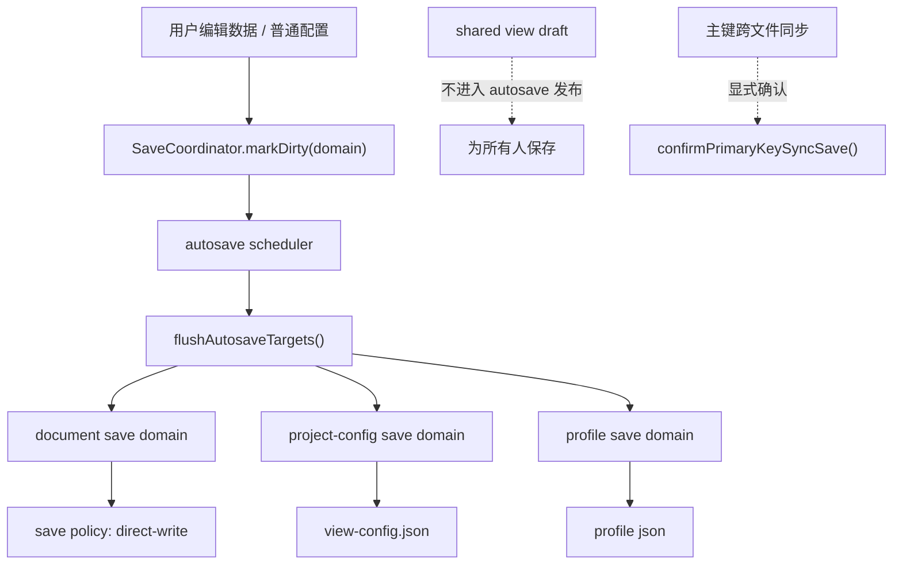

# 自动保存与去备份方案

## 方案概述

### 1. 总体目标和范围

本方案的目标是移除编辑器右上角的手动“保存”按钮，将当前编辑器中的**数据文件保存**与**项目视图配置保存**改为自动保存；同时按当前需求，**移除数据保存时生成备份文件的机制**，改为直接覆盖写入，因为数据已由 Git 跟踪。

本次范围包含：

- 移除工具栏中的手动“保存”按钮。
- 将当前数据文件的磁盘写入改为自动保存。
- 将项目级 `view-config` 保存改为自动保存。
- 将个人 `profile` 自动保存并入新的统一自动保存协调器，并移除当前独立 `250ms` 定时器。
- 重构工具栏与状态栏中的保存反馈语义。
- 调整关闭服务、刷新构建、断线恢复时对“未保存改动”的判断逻辑。
- 移除数据文件 `.bak` 备份生成逻辑。
- 补充单测、E2E 和必要文档，锁定新的保存语义。

本次范围不包含：

- 不将 `为所有人保存` 改为自动发布。
- 不移除主键变更引发的跨文件同步确认。
- 不引入离线草稿、冲突合并、版本快照等额外机制。
- 不将 Git 集成到编辑器 UI 中作为回滚入口。

### 2. 各阶段任务概要

1. **保存语义收敛阶段**
   - 明确哪些变更进入自动保存，哪些变更继续保留显式确认。
   - 预期成果：形成统一的保存边界，避免把“本地落盘”和“团队发布”混在一起。
2. **自动保存调度阶段**
   - 增加统一 autosave scheduler，为数据文件和项目视图配置提供 debounce、串行化和状态合并能力。
   - 预期成果：用户编辑后自动落盘，无需点击保存按钮。
3. **保存框架收敛阶段**
   - 引入保存域、统一调度器和保存策略三层结构，明确 autosave 不直接耦合到现有 UI orchestration。
   - 预期成果：普通保存行为有稳定的框架边界，后续可以继续演化而不把更多职责堆进 `App.tsx`。
4. **去备份阶段**
   - 移除数据写入链路中的 `.bak` 备份生成逻辑，改为直接覆盖写入。
   - 预期成果：自动保存不会制造高频备份文件和额外写放大。
5. **交互反馈与边界验证阶段**
   - 重构 `Unsaved / 保存中 / 保存失败` 状态提示，并验证 close / rebuild / recover / shared view / 主键同步等边界行为。
   - 预期成果：用户无需手动保存，但始终知道当前保存状态和失败风险。

执行顺序必须先收敛保存语义，再接入自动保存调度，最后处理 UI 和测试；否则很容易出现“按钮删了，但写盘语义仍不一致”的中间态。

### 3. 整体结构框架

---

## 当前机制评估

### 1. 当前保存不是单一路径

当前代码中的“保存”至少分为四类：

1. **数据文件保存**
   - 当前文件 JSON / CSV 内容写回磁盘。
   - 主链路位于 `src/App.tsx` 的 `persistChanges()` 与 `handleSave()`。
2. **项目视图配置保存**
   - 保存 `view-config`，覆盖字段类型、relation、primary key 等项目级配置。
   - 由 `persistChanges()` 和 `saveViewConfigOnly()` 触发。
3. **个人 profile 保存**
   - 当前已经是准自动保存。
   - `selectedViewProfile` 变化后，通过独立 `250ms` 定时器异步写入 profile。
4. **团队共享视图发布**
   - `ViewFilterBar` 中的 `为所有人保存`。
   - 语义是把当前 shared view draft 发布到团队共享配置，不是普通本地落盘。

因此，“移除右上角保存按钮”不能理解成“系统内所有写入都自动化”；必须先区分本地落盘、个人偏好保存、团队共享发布三类责任。

### 4. 当前普通保存链路是混合型 orchestration，不是稳定的 autosave 边界

当前 `persistChanges()` 已经同时处理：

- 数据文件保存
- 项目视图配置保存
- profile flush
- 主键同步拦截
- 保存状态文案与 UI 状态切换

这说明它更像“当前 App 层的保存总调度函数”，而不是一个天然适合被 autosave 直接调用的纯保存器。

如果让 autosave scheduler 直接绑定 `persistChanges()`，未来只要再增加新的保存语义，调度层就会继续吸收 UI 分支和跨文件确认逻辑，框架边界会越来越模糊。

### 5. 当前 `view-config` 还有即时写旁路

当前项目视图配置并不完全走统一保存链路，还存在 `saveViewConfigOnly()` 这类即时写旁路，用于 relation / primary key 等配置变更时直接落盘。

这意味着现状不是“一个 autosave 能接管全部普通配置保存”，而是：

- 一部分配置通过 `persistChanges()` 保存
- 一部分配置通过 `saveViewConfigOnly()` 立即保存

如果这条旁路不收敛，改造后会形成“两套普通保存语义并存”的框架：

- 普通编辑：防抖 autosave
- 特定配置：即时写盘

这不是本方案希望长期保留的结构。

### 2. 当前数据保存会生成备份

当前 `server -> file-service` 写盘链路中，数据文件通过 `writeTextFileWithBackup()` 落盘，流程是：

1. 复制当前目标文件到 `.bak`
2. 再写入新内容

这条链路在手动保存模式下问题不大，但一旦切换为自动保存，会带来两类明显副作用：

- 高频编辑时生成大量 `.bak` 文件
- 每次自动保存都附带一次额外复制，造成写放大和保存延迟

在“数据都由 Git 跟踪”的前提下，这套备份机制不再适合作为自动保存的默认行为，应在本次改造中直接移除。

### 3. 当前未保存状态承担的不只是按钮使能

当前 `dirty` 相关状态至少被用于：

- 工具栏 `保存` 按钮是否可点击
- `dirty-pill` 是否显示 `Unsaved`
- 关闭服务前是否弹出“会丢失改动”的确认
- 刷新构建前是否弹出“会丢失改动”的确认
- 断线恢复后是否可以直接 reload

这意味着自动保存上线后，不能只删除按钮，而要同步重定义：

- 什么叫“待保存”
- 什么叫“保存中”
- 什么叫“保存失败”
- 什么场景仍然会“丢失改动”

---

## 推荐方案

### 1. 保存语义边界

推荐采用 **“局部自动保存 + 保留显式发布/确认 + 保存框架收敛”** 的方案。

自动保存范围：

- 当前数据文件内容
- 项目视图配置
- 个人 profile

其中项目视图配置包含：

- 普通 `view-config` 变更
- relation 配置
- primary key 配置

这几类配置统一并入 autosave，不再保留 `saveViewConfigOnly()` 这类长期即时写特例。

继续保留显式动作的范围：

- `为所有人保存`
- 主键变更引发的跨文件同步确认

这样改完后的语义会比较清晰：

- **本地编辑**：自动落盘
- **个人偏好**：自动落盘
- **团队共享视图**：继续显式发布
- **跨文件 rewrite**：继续显式确认

### 2. 为什么不建议“全部自动保存”

#### 不建议自动发布 shared view

当前 shared view 的价值就在于：

- 用户先在本地/profile 中形成 draft
- 只有点击 `为所有人保存` 才覆盖团队共享配置

如果把这一步也自动化，会导致：

- 用户试验过滤条件时，团队共享视图被立即改写
- shared draft 和 shared publish 的语义完全消失
- 当前基于 draft 的测试和分层设计全部失效

#### 不建议自动执行主键跨文件同步

主键同步保存不是单文件本地落盘，而是多文件 rewrite：

- 影响 relation 源文件
- 需要阻断重复主键、空主键、来源文件缺失等问题
- 当前已有专门的确认流和 blocking issue 处理

因此，autosave 在命中这类场景时，应继续进入“待确认”状态，而不是静默直接写盘。

---

## 详细设计

### 1. 自动保存调度器

#### 目标

为普通本地变更提供统一 autosave scheduler，替代用户手动点击工具栏保存。

这里的“统一”不是指把一切都塞进一个函数，而是指通过统一调度器管理多个保存域。

#### 调度原则

- debounce 建议值：`800ms`
- 持续编辑期间不断延后触发
- 同一时刻只允许一个保存请求进行中
- 保存期间若出现新 dirty，合并到下一轮保存
- 不为 shared view publish 生成 autosave 任务
- relation / primary key 配置与普通 `view-config` 一样进入 autosave，而不是即时写

#### 推荐状态机

1. `idle`
2. `pending`
3. `saving`
4. `saved`
5. `error`
6. `blocked-confirmation`（仅主键同步这类需要确认的场景）

其中：

- `pending` 表示存在待自动保存变更，但 debounce 尚未到时
- `saving` 表示保存请求已发出
- `error` 表示最近一次保存失败，用户当前改动尚未可靠落盘
- `blocked-confirmation` 表示 autosave 命中必须人工确认的写入

### 2. 保存框架分层

#### 总体原则

在框架层先拆清三层职责：

1. **保存域（save domains）**
   - `document`
   - `project-config`
   - `profile`
2. **统一调度器（SaveCoordinator / AutosaveController）**
   - 负责 `markDirty(domain)`、debounce、串行化、flush、状态聚合
3. **保存策略（save policy）**
   - 决定具体写盘时是否备份、是否允许立即写、是否需要确认

#### 协调器与 React 的装配边界

这是本次改造的硬约束：

- `SaveCoordinator` 不直接持有 React state setter。
- `SaveCoordinator` 只接收三类依赖：
  - snapshot reader
  - flush callback
  - status callback
- React 层负责把 `modelRef / dataDirtyRef / viewConfigRef / selectedPathRef / profile` 等当前状态桥接给协调器，而不是反过来把协调器做成新的 UI 容器。
- 不允许在 `App.tsx` 中再散落新增独立 autosave `setTimeout` 分支；普通自动保存的调度只能集中在协调器里。

#### 推荐结构

普通 autosave 只接管以下保存域：

- `document`
- `project-config`
- `profile`

以下内容不属于普通 autosave 域，而是显式命令边界：

- `shared-view-publish`
- `primary-key-sync-commit`

这样可以让调度器只负责“普通本地落盘”，而不会直接吞下团队发布和跨文件确认逻辑。

### 3. 持久化入口收敛

#### 总体原则

不要新造第二套普通保存逻辑，但也不要让 autosave 直接依附当前混合型 `persistChanges()`。

#### 原因

当前 `persistChanges()` 更适合被拆解后复用其内部能力，而不是原样作为 autosave 主入口。否则：

- 调度层会直接耦合到 UI 状态切换
- 主键同步拦截会混入普通 autosave
- 后续 shared / recovery / rebuild 分支还会继续往里堆

#### 调整建议

- 新增一个更窄的普通落盘入口，例如 `flushAutosaveTargets()`，只处理：
  - 数据文件保存
  - 项目视图配置保存
  - profile flush
- `profile` 必须并入统一 autosave 协调器；当前独立 `250ms` 定时器只允许作为迁移过渡，最终要删除。
- `persistChanges()` 可以作为现阶段兼容壳存在，但其长期职责应被收缩。
- `handleSave()` 最终应退出主路径，或者退化成“立即 flush autosave 队列”的兼容入口。
- 工具栏删除保存按钮后，不再需要单独的 click-save 交互。
- 保留 `Ctrl/Cmd + S`：
  - 推荐保留
  - 但其语义改为“立即执行当前待保存队列”，而不是“必须手动保存”
  - 它应调用调度器的 `flush()`，而不是重新走旧手动保存函数

### 4. 去掉数据备份机制

#### 目标

将数据文件写盘从“备份后覆盖”改为“直接覆盖写入”。

#### 改造原则

- 不把“无备份”写成一次性 UI 偏好，而是明确为编辑器默认 `save policy`
- 对数据文件写盘不再返回 `backupPath`
- 工具栏状态文案不再展示“备份：xxx”
- 不引入新的本地快照目录替代 `.bak`
- 对 `data-editor` 的所有 project 默认生效
- Git 作为主要版本回退来源

#### 预期结果

- 自动保存链路明显变轻
- 不会产生大量 `.bak` 文件
- 保存提示能聚焦在“是否成功写入”，而不是“备份落在哪”

### 5. 工具栏与状态反馈

#### 工具栏改动

- 移除右上角 `保存` 按钮
- 保留 `Reset view`、外观设置、刷新构建、关闭服务等入口

#### 状态反馈改造

当前 `dirty-pill` 的 `Unsaved` 文案应重构为保存状态反馈，而不是单纯表示“等你点击保存”。

建议状态：

- `待保存`
- `保存中...`
- `保存失败`

#### 交互建议

- 用户编辑后很快看到 `保存中...`
- 成功后直接回到静默状态，不显示短暂 `已保存`
- 失败后保留 `保存失败`，并允许下一次编辑重新触发保存

不建议完全取消保存反馈。自动保存如果失败却没有可见状态，用户会误以为磁盘已更新。

### 6. close / rebuild / recover 的语义调整

#### 当前问题

当前这些流程大多基于 `globalDirty` 判断“是否有未保存改动”，但自动保存模式下，这个语义会发生变化。

#### 改造后的建议

需要区分以下状态：

- 有待保存变更（debounce 尚未触发）
- 正在保存
- 最近一次保存失败
- shared view draft 仍未发布
- 主键同步等待确认

#### 推荐判断

- **关闭服务 / 刷新构建**
  - 若仅存在已落盘内容，不提示丢失
  - 若存在 `pending / saving / error / blocked-confirmation / 未发布 shared draft`，继续提示
- **断线恢复**
  - 若本地变更已落盘，可直接 reload
  - 若仍有失败或待确认状态，继续保持谨慎路径

### 7. shared view 的保留边界

本方案中，shared view 继续维持“草稿 -> 发布”的两阶段模型：

- 草稿编辑仍通过 `updateActiveViewDraft(...)`
- `ViewFilterBar` 仍显示：
  - `重置`
  - `为所有人保存`
- autosave 不接管 shared view draft 发布

这样可以保证本地视图试验与团队共享配置仍然有清晰边界。

### 8. 主键同步保存的保留边界

本方案中，主键同步相关逻辑继续保留：

- blocking issues 检查
- dialog 确认
- 多文件写入

autosave 在遇到这类场景时，不应绕过现有确认流，而应把状态切换到 `blocked-confirmation` 或同等语义，再等待用户确认。

### 9. relation / primary key 配置统一并入 autosave

#### 设计决策

本方案明确采用统一方案：

- relation 配置
- primary key 配置
- 其他普通 `view-config` 配置

全部进入同一 autosave 框架。

#### 含义

这意味着当前 `saveViewConfigOnly()` 只作为过渡期实现参考，不作为长期保留路径。

在实施前必须先枚举现有全部 `saveViewConfigOnly()` 调用点，并给出迁移分类清单。当前已确认至少有以下普通调用点：

- `src/App.tsx:1213`
- `src/App.tsx:1222`
- `src/App.tsx:1267`

这些调用点都必须明确归类为：

- 并入 autosave
- 保留为特殊命令
- 删除

没有这份清单，不进入实施。

后续目标是：

- 不再保留“改完立刻写盘”的 `view-config` 特例
- 由统一调度器对 `project-config` 域做防抖保存
- 所有普通 `view-config` 写入共享同一状态反馈和失败处理模型

#### 好处

- 框架语义最统一
- 状态模型最容易维护
- 后续无需解释“为什么这个配置是即时写，那个配置是自动稍后写”

---

## 受影响模块

预计主要涉及以下文件：

- `src/App.tsx`
- `src/components/Toolbar.tsx`
- `src/components/ViewFilterBar.tsx`
- `src/view` 下与 shared draft / save state 相关的状态辅助模块
- `src/api/client.ts`
- `src/file-service.mjs`
- `server.mjs`
- `tests/data-editor.spec.ts`
- `tests/save-documents.test.mjs`
- `tests/view-state.test.mjs`
- 与保存状态文案、backup 返回值、autosave 行为相关的单测和 E2E

---

## 风险评估

### 高风险

1. **自动保存触发过于频繁**
   - 会造成磁盘高频写入和状态抖动。
   - 必须通过 debounce 和串行化控制。

2. **保存失败后状态不透明**
   - 用户可能误以为内容已落盘。
   - 必须提供明确失败提示，并保留再次触发保存的能力。

3. **主键同步流被误当成普通自动保存**
   - 会导致跨文件 rewrite 在无确认情况下发生。
   - 必须继续保留确认与阻断机制。

### 中风险

1. **关闭服务 / 刷新构建 / 恢复流程的语义变化较大**
   - 这部分现在依赖“是否有未保存改动”。
   - 自动保存后需要重写判断条件和测试。

2. **测试改动面较大**
   - 当前大量 E2E 直接点击 `.toolbar .primary-button`。
   - 需要系统性重写为等待 autosave 完成或状态稳定。

3. **去掉备份后，状态文案和 API 契约要一起调整**
   - 不能只改底层写盘，不改返回值和文案。

4. **若不先收敛保存域，autosave 会继续加重 `App.tsx` 的 orchestration**
   - 这是框架层风险，而不只是实现细节。
   - 必须先拆出统一调度器与更窄的普通落盘入口。

### 低风险

1. **个人 profile 自动保存链路已存在**
   - 当前系统已经接受这一模式。
   - 可作为 autosave 状态反馈整合的参考路径。

---

## 验证与验收建议

### 必测场景

1. 编辑单元格后自动保存成功。
2. 连续快速编辑只触发合并后的保存，而不是每次击键写盘。
3. 自动保存失败时能显示明确错误状态。
4. 自动保存失败后再次编辑可继续触发保存。
5. 项目视图配置变更能自动落盘。
6. relation / primary key 配置变更也走 autosave，而不是即时写盘。
7. profile 自动保存改为进入统一协调器，旧 `250ms` 独立定时器不再生效。
8. 主键同步场景仍然弹确认，不静默写多文件。
9. shared view draft 不会自动发布到团队共享配置。
10. 关闭服务时：
   - 已落盘普通改动不再提示丢失
   - 保存失败、待确认、未发布 shared draft 仍提示风险
11. 刷新构建、断线恢复时上述语义一致。
12. 数据保存后不再生成 `.bak` 文件。
13. `Ctrl/Cmd + S` 若保留，应触发立即 flush，而不是报错或失效。

### 验收标准

满足以下条件即可视为改造成功：

- 用户无需点击右上角保存按钮即可完成普通编辑。
- 数据文件与项目视图配置在可接受延迟内自动落盘。
- 不再生成数据备份文件。
- shared view 发布和主键同步确认语义保持不变。
- 保存失败可见、可恢复、不会静默丢数据。

---

## 推荐实施顺序

1. 收敛保存域、状态机与保存策略。
2. 引入统一调度器 `SaveCoordinator / AutosaveController`。
3. 收缩 `persistChanges()`，建立更窄的普通 autosave 落盘入口。
4. 将 `saveViewConfigOnly()` 路径并入统一 autosave。
5. 将 profile 并入统一协调器，并移除旧 `250ms` 独立 autosave 定时器。
6. 移除数据备份写入逻辑。
7. 移除工具栏保存按钮并改造状态提示。
8. 回归 close / rebuild / recover / shared view / 主键同步边界。
9. 最后清理旧文案、旧测试和过渡兼容路径。

---

## 最终建议

推荐执行以下收敛版方案：

- 移除右上角手动保存按钮。
- 将数据文件与项目视图配置改为自动保存。
- relation / primary key 配置统一并入 autosave，不保留长期即时写特例。
- 保持个人 profile 自动保存。
- 保留 `为所有人保存` 作为显式团队发布动作。
- 保留主键同步确认作为显式跨文件写入确认。
- 移除数据保存时的备份生成逻辑，直接覆盖写入。

这条路线不仅满足“移除手动保存”和“去掉备份”的需求，也把保存框架本身收敛成更稳定的三层结构，避免继续把 autosave 逻辑堆进当前 `App.tsx` 的大 orchestration。
