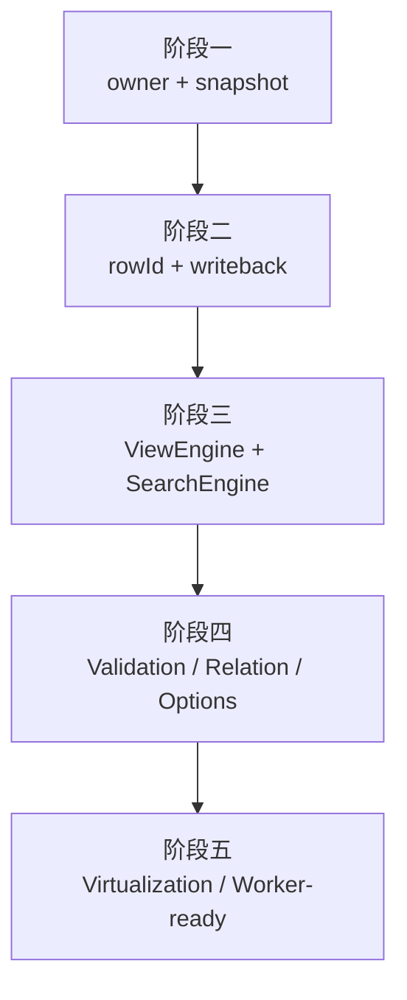

# 大数据编辑架构治理路线图

## 概述

### 1. 总体目标和范围

本路线图承接 [2026-06-09-大数据编辑长期架构治理方案.md](C:/Code/data-editor/docs/plans/2026-06-09-大数据编辑长期架构治理方案.md)，用于把长期架构方向拆成阶段级 milestone。它不写具体代码步骤，只定义每个阶段的目标、输入、输出、验收门槛和阶段依赖，避免后续执行计划偏离长期方向。

本路线图覆盖：

- 渲染边界治理
- 数据身份与写回语义
- 视图派生引擎
- 增量计算引擎
- 渲染伸缩性

本路线图不覆盖：

- 每个阶段的逐文件改法
- 每个 API 的最终 TypeScript 类型
- 一次性完成所有阶段的实施任务

### 2. 各阶段任务概要

1. **阶段一：状态所有权与渲染边界**
   - 明确 `DocumentStoreOwner`、`SelectionOwner`、`TableLayoutOwner`、`DetailLayoutOwner`、`ViewChromeOwner`、`DerivedViewOwner`
   - 输出订阅矩阵和第一版 `tableSnapshot` / `detailSnapshot` / `viewChromeSnapshot`
   - 验证 detail-only 操作不再触发主表大额 commit

2. **阶段二：稳定 row identity 与写回边界**
   - 引入稳定 `rowId`
   - 明确 `rowId -> sourceIndex/root location`
   - 保证排序、筛选、删除、插入后的编辑写回仍指向正确记录

3. **阶段三：ViewEngine 与 SearchEngine 收口**
   - 用 `visibleRowIds` 取代临时 `viewRows`
   - 移除临时 `viewModel`
   - 搜索、筛选、排序通过候选 id 集和 snapshot 表达

4. **阶段四：ValidationEngine / RelationEngine / FieldOptionIndex**
   - 把校验、relation、字段选项派生移出组件 render 期
   - 建立 collection / view / detail 三层 issue 作用域
   - relation 与 option 派生不再由 `DataTable` 渲染触发全量扫描

5. **阶段五：渲染伸缩性**
   - 支持动态行高虚拟化
   - 预编译列定义
   - 为 worker 化保留稳定输入输出

### 3. 整体结构框架



---

## 一、阶段依赖

### 1.1 阶段一是所有后续阶段的入口

阶段一必须先完成，因为当前真实 profiling 的主热区是 `main-content` 大范围 commit，而不是某一个纯计算函数。只有先确定状态 owner 和订阅边界，后续 `DocumentStore`、`ViewEngine`、`ValidationEngine` 才不会被迫服务当前混乱的 props 结构。

阶段一完成后才允许进入阶段二。

### 1.2 阶段二必须早于 ViewEngine 正式落地

`ViewEngine` 如果继续用 `rowIndex` 表达视图结果，会把 selection、编辑写回、删除、插入和 record-map 顺序问题继续带入新架构。因此阶段二必须先定义稳定 `rowId` 与写回映射。

阶段二完成后才允许进入阶段三。

### 1.3 阶段三完成后再做增量引擎

Validation / Relation / Options 的缓存粒度依赖 `visibleRowIds`、field snapshot 和 row identity。阶段三之前过早实现这些 engine，容易继续围绕旧的 `viewRows` / `viewModel` 适配。

阶段三完成后才允许进入阶段四。

---

## 二、阶段路线图

### 2.1 阶段一：状态所有权与渲染边界

目标：

- detail-only 操作不再让 `DataTable` 成为热路径
- `Toolbar`、`ViewTabs`、`ViewFilterBar` 不再通过隐式大 props 订阅整棵派生状态
- `main-content` 仍可作为 DOM 容器，但不再作为所有状态的统一 React commit 热区

输入：

- 长期架构治理方案
- 当前 profiling 基线
- `App.tsx` 中 `viewRows`、`viewModel`、`fieldConfig`、`issues`、`selectedRowIndex` 的现状依赖

输出：

- owner 划分
- 订阅矩阵
- `tableSnapshot`
- `detailSnapshot`
- `viewChromeSnapshot`
- detail reorder profiling 复测结果

阶段门槛：

| 指标 | 目标 |
| --- | --- |
| `detail-reorder:react-main-content` | `<= 250ms` |
| `detail-reorder:total` | `<= 320ms` |
| detail-only `react-data-table` | `<= 80ms`，最好不出现 |
| 正式 `8787` 开文件 | 不高于 `700ms`，禁止回退 |
| 正式 `8787` 清搜索 | 不高于 `700ms`，禁止回退 |

阶段状态：

- 已完成

阶段结果：

- `DataTable`、`DetailPanel`、`Toolbar`、`ViewTabs`、`ViewFilterBar` 已全部切到 snapshot 输入
- detail-only 路径上的 `tableFieldConfig` 与 `activeView` 渲染输入已稳定化
- 真实 profiling 表明表格主链已退出 detail reorder 热区

阶段结果指标：

| 指标 | 基线 | 阶段一完成后 |
| --- | --- | --- |
| `detail-reorder:react-data-table` | 首轮误判为未出现，补 sample 后确认曾有 `~1153ms` 级重渲染 | `0ms` |
| `detail-reorder:react-main-content` | `~1116.3ms` | `17.7ms` sample 总耗时 |
| 正式 `8787` 开文件 | `~905ms` 早期复测值 | `218.89ms` |
| 正式 `8787` 搜索“部署物” | `~84.72ms` 早期静态复测值 | `50.5ms` |
| 正式 `8787` 清搜索 | `~653ms` 早期复测值 | `72.29ms` |
| 正式 `8787` 打开 detail | `~24.76ms` 早期静态复测值 | `17.44ms` |

对下一阶段的影响：

- 阶段二、阶段三可以在已稳定的 snapshot/owner 边界上继续推进
- 下一性能重点不再是 detail reorder；第一阶段已经把正式模式主交互压到低双位数到两百毫秒级，后续应转向稳定 `rowId`、消除临时 `viewModel`、引入增量 engine

### 2.2 阶段二：稳定 row identity 与写回边界

目标：

- 所有 UI 层选择、编辑、打开详情、滚动恢复都可通过稳定 `rowId` 表达
- 写回层明确 `rowId -> sourceIndex/root location`
- 排序 / 筛选后的编辑不会写错源记录

输入：

- 第一阶段的 owner / snapshot 边界
- 当前 `__rowIndex` 使用清单
- `document-model.mjs` 的 array / record-map 读写语义

输出：

- `DocumentStore` 初版
- `rowId` 生成规则
- source order 策略
- `rowId` 写回适配层
- row identity 回归测试

阶段门槛：

| 场景 | 目标 |
| --- | --- |
| 排序后编辑 | 写回原始记录正确 |
| 筛选后编辑 | 写回原始记录正确 |
| 删除行 | 删除目标记录正确 |
| record-map 默认顺序 | source order 稳定 |
| detail 打开 / 切换行 | selection 不漂移 |

### 2.3 阶段三：ViewEngine 与 SearchEngine 收口

目标：

- `viewRows` 退化为 `visibleRowIds`
- 不再创建临时 `viewModel`
- 搜索、筛选、排序通过 id 集和 snapshot 表达

输入：

- `DocumentStore`
- 稳定 `rowId`
- `SearchEngine` 候选集
- active view draft / shared view config

输出：

- `ViewEngine`
- `SearchEngine`
- `visibleRowIds`
- view-level table / detail / chrome snapshot

阶段门槛：

| 指标 | 目标 |
| --- | --- |
| 正式 `8787` 开文件 | `<= 350ms` |
| 正式 `8787` 搜索“部署物” | `<= 180ms` |
| 正式 `8787` 清搜索 | `<= 260ms` |
| 搜索 / 清搜索 | 不重建临时 `viewModel` |

### 2.4 阶段四：增量计算引擎

目标：

- 校验、relation、字段选项派生不再由组件 render 触发全量扫描
- issue 分成 collection / view / detail 三个作用域
- relation 详情按需计算，主表浏览态只拿轻量数据

输入：

- `DocumentStore`
- `ViewEngine`
- 稳定 field snapshot
- relation config / primary key config

输出：

- `ValidationEngine`
- `RelationEngine`
- `FieldOptionIndex`
- issue lookup
- relation option cache

阶段门槛：

| 场景 | 目标 |
| --- | --- |
| detail-only 操作 | 不触发全量 validation |
| 表格渲染 | 不扫描全量 rows 构建 option |
| relation target lookup | 复用缓存 |
| detail relation 分析 | 按需执行 |

### 2.5 阶段五：渲染伸缩性

目标：

- wrap 不再导致全量渲染退化
- 表格列定义预编译
- 为 worker 化计算保留清晰输入输出

输入：

- 稳定 snapshot
- 稳定 row identity
- 增量 engine 结果

输出：

- 动态行高虚拟化方案
- 预编译 column defs
- worker-ready engine contract

阶段门槛：

| 场景 | 目标 |
| --- | --- |
| wrap 开启 | 不退化为全量 DOM 渲染 |
| 大文件滚动 | row window 稳定 |
| worker 化评估 | 输入输出边界清晰 |

---

## 三、阶段交付规则

每个阶段必须独立交付：

1. 阶段执行计划
2. 代码实现
3. 单元 / e2e / profiling 验证
4. 阶段结果记录
5. 是否进入下一阶段的判断

下一阶段执行计划必须基于上一阶段真实结果编写，不能提前锁死后续阶段的实现细节。

---

## 四、当前推荐动作

当前只应进入阶段一执行计划，不应直接编写全部阶段的代码级执行清单。

理由：

- 第一阶段结果会决定后续 `DocumentStore` 与 `ViewEngine` 的接口形态
- `rowId` 写回语义需要在状态边界稳定后设计
- 搜索、校验、relation 的缓存粒度依赖前两阶段的输出

推荐下一份文档：

```text
docs/plans/2026-06-09-大数据编辑第一阶段执行计划.md
```
