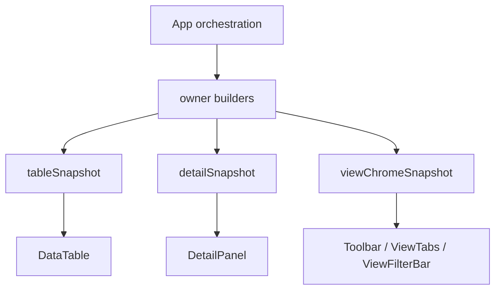

# 大数据编辑第一阶段执行计划

> **For agentic workers:** REQUIRED SUB-SKILL: Use `superpowers:subagent-driven-development` or `superpowers:executing-plans` to implement this plan task-by-task. Steps use checkbox (`- [ ]`) syntax for tracking.

**Goal:** 完成大数据编辑架构治理的第一阶段：收口状态所有权，切断 detail-only 操作对 `main-content` / `DataTable` 的大范围重渲染，并用固定 profiling 规程验证结果。

**Architecture:** 本阶段不引入正式 `DocumentStore`，不迁移 `rowId`，不重写 `ViewEngine`。本阶段只处理 owner、snapshot 和订阅边界，让后续阶段有稳定落点。

**Tech Stack:** React + TypeScript + Playwright + 本地 profiling + data-editor profile/view layout 状态

---

## 概述

### 1. 总体目标和范围

本执行计划承接：

- [2026-06-09-大数据编辑长期架构治理方案.md](C:/Code/data-editor/docs/plans/2026-06-09-大数据编辑长期架构治理方案.md)
- [2026-06-09-大数据编辑架构治理路线图.md](C:/Code/data-editor/docs/plans/2026-06-09-大数据编辑架构治理路线图.md)

本阶段目标是把当前隐式共享在 `App.tsx` 中的状态拆出明确 owner，并用 `tableSnapshot`、`detailSnapshot`、`viewChromeSnapshot` 收口 `Toolbar`、`ViewTabs`、`ViewFilterBar`、`DataTable`、`DetailPanel` 的订阅边界。

本阶段范围包括：

- `App.tsx` 中的状态 owner 划分
- `DataTable` 输入边界收口
- `DetailPanel` 输入边界收口
- `Toolbar / ViewTabs / ViewFilterBar` 的 view chrome 输入边界收口
- detail reorder profiling 复测

本阶段不包括：

- 正式 `DocumentStore` 实现
- `rowId` 迁移
- `viewRows -> visibleRowIds` 的完整替换
- 搜索索引、增量校验、relation cache
- 动态行高虚拟化

### 2. 各阶段任务概要

1. **阶段 1A：ownership 收口**
   - 梳理当前 `App.tsx` 中 table、detail、selection、view chrome、derived view 的状态来源
   - 写出订阅矩阵
   - 定义第一版 snapshot 类型和 builder

2. **阶段 1B：组件订阅改造**
   - 第一批：让 `DataTable` 消费 `tableSnapshot`，让 `DetailPanel` 消费 `detailSnapshot`
   - 第一批完成后先验证 detail-only layout 更新是否不再触发表格大额 commit
   - 第二批：让 `Toolbar / ViewTabs / ViewFilterBar` 消费 `viewChromeSnapshot`
   - 避免把 5 个组件的 props 改造混成一个不可分辨的大提交

3. **阶段 1C：profiling 与回归验证**
   - 使用固定脚本连续采样 3 次
   - 取中位数与基线对比
   - 验证正式 `8787` 开文件和清搜索没有回退

### 3. 整体结构框架



---

## 一、当前证据链

### 1.1 热区证据

真实 profiling 基线：

| 指标 | 当前基线 |
| --- | --- |
| `detail-reorder:total` | `~1149ms` |
| `detail-reorder:react-main-content` | `~1116.3ms` |
| `detail-reorder:react-detail-panel` | `~3.4ms` |
| `detail-reorder:build-field-config` | `~0.2ms` |
| `detail-reorder:build-issues` | `~0.8ms` |

结论：

- 当前首要问题是 `main-content` 大范围 commit
- `DetailPanel` 自身不是主要热区
- 本阶段先处理渲染边界，不处理 row identity 和数据内核

### 1.2 当前扩散链路

当前 detail 字段重排链路：

```text
DetailPanel onReorderFields
-> handleReorderDetailFields
-> updateActiveViewLayout(..., { affectsTable: false })
-> selectedViewProfile / local view state 更新
-> fieldConfig 变化
-> main-content commit
-> DataTable / DetailPanel / view chrome 可能共同参与渲染
```

当前问题不是 `affectsTable` 信号完全无效，而是 table、detail、view chrome 仍通过 `App.tsx` 的大状态树共享依赖。

---

## 二、目标订阅矩阵

第一阶段完成后，目标订阅关系如下：

| UI 区域 | 允许订阅的输入 | 禁止直接订阅 |
| --- | --- | --- |
| `Toolbar` | `viewChromeSnapshot` 中的路径、计数、query、autosave 状态 | 原始 `model`、完整 `fieldConfig`、完整 `viewModel` |
| `ViewTabs` | `viewChromeSnapshot` 中的 view tabs 状态 | `DocumentStoreOwner`、`TableLayoutOwner`、`DetailLayoutOwner` |
| `ViewFilterBar` | `viewChromeSnapshot` 中的字段摘要、筛选、排序、选项摘要 | 原始 `rows`、完整 `DataTable` props |
| `DataTable` | `tableSnapshot`、表格选择状态、表格操作回调 | `detailSnapshot`、`DetailLayoutOwner` |
| `DetailPanel` | `detailSnapshot`、当前 row 状态、detail 操作回调 | `tableSnapshot`、完整表格布局状态 |

---

## 三、目标 Snapshot

### 3.1 `tableSnapshot`

建议初版只包装现有数据，不在本阶段改变数据身份：

```ts
type TableSnapshot = {
  model: DocumentModel;
  schemaModel: DocumentModel | null;
  sourcePath: string | null;
  collectionPath: string;
  fieldConfig: TableFieldConfig;
  fieldViewConfigs: Record<string, FieldViewConfig>;
  backlinkColumns: BacklinkGridColumn[];
  backlinkValuesByRowIndex: Record<number, Record<string, RelationBacklink[]>>;
  relationOptions: Record<string, RelationOption[]>;
  relationConfigs: Record<string, RelationConfig>;
  issues: Record<string, ValidationIssue | null>;
  titleField: string | null;
  sort: { field: string; direction: "asc" | "desc" } | null;
};
```

注意：

- 本阶段允许 `tableSnapshot` 内部继续携带 `rowIndex` / `viewModel`
- 本阶段目标是隔离订阅边界，不是完成 row identity 迁移
- `fieldConfig.detailOrder` 不应进入 `tableSnapshot`

### 3.2 `detailSnapshot`

```ts
type DetailSnapshot = {
  open: boolean;
  panelWidth: number;
  row: DataRecord | null;
  rowIndex: number | null;
  rowCount: number;
  sourcePath: string | null;
  collectionPath: string;
  titleField: string | null;
  detailOrder: string[];
  displayTypes: Record<string, FieldDisplayType>;
  fieldViewConfigs: Record<string, FieldViewConfig>;
  issues: Record<string, ValidationIssue | null>;
  relationOptions: Record<string, RelationOption[]>;
  relationConfigs: Record<string, RelationConfig>;
  relationBacklinks: RelationBacklink[];
  primaryKeyImpacts: Record<string, PrimaryKeyImpact>;
  primaryKeySyncPlan: PrimaryKeySyncPlan | null;
  primaryKeySyncResult: SaveDocumentsResult | null;
};
```

注意：

- `detailSnapshot` 可以读取当前 row 和 detail layout
- `detailSnapshot` 不应把 `tableSnapshot` 作为输入
- detail-only reorder 应只更新 `detailSnapshot`

### 3.3 `viewChromeSnapshot`

```ts
type ViewChromeSnapshot = {
  currentPath: string | null;
  collectionPath: string;
  rowCount: number;
  visibleCount: number;
  query: string;
  views: CollectionView[];
  activeViewId: string | null;
  dirtyViewIds: Set<string>;
  filterBarVisible: boolean;
  hasActiveFilters: boolean;
  viewOrderDirty: boolean;
  activeView: CollectionView | null;
  fields: string[];
  fieldSummaries: Record<string, FieldSummary>;
  hiddenFieldSummaries: FieldSummary[];
  relationFilterOptions: Record<string, MultiSelectOptionView[]>;
};

type FieldSummary = {
  fieldName: string;
  displayType: FieldDisplayType;
  hidden: boolean;
  wrapped: boolean;
  filterOptions: MultiSelectOptionView[];
  relationOptions: MultiSelectOptionView[];
  chipLabelSource: "field-config" | "field-view-config" | "inferred";
};
```

注意：

- `ViewFilterBar` 需要字段摘要，不应再吃完整表格 props
- `Toolbar` 的 `visibleCount` 可来自 view snapshot，不应强制依赖 `viewRows`
- `Toolbar` 的隐藏字段入口应使用 `hiddenFieldSummaries`，不应继续穿透完整 `fieldConfig`
- `ViewFilterBar` 的字段类型、chip 文案和选项来源都必须来自 `FieldSummary`

---

## 四、实施任务

### Task 1：补充 owner / snapshot 类型

**Files:**

- Modify: `src/App.tsx`
- Optional add: `src/render-snapshots.ts`

- [ ] 定义 `TableSnapshot`
- [ ] 定义 `DetailSnapshot`
- [ ] 定义 `ViewChromeSnapshot`
- [ ] 定义 `FieldSummary`
- [ ] 定义 `buildTableSnapshot(...)`
- [ ] 定义 `buildDetailSnapshot(...)`
- [ ] 定义 `buildViewChromeSnapshot(...)`
- [ ] 定义 table-only field config，不能包含 `detailOrder`
- [ ] 定义 table-scope issue lookup，不能依赖 detail layout

验收：

- 类型编译通过
- builder 只包装现有数据，不改变行为
- detail-only reorder 后 `tableSnapshot`、table-only field config、table-scope issues 引用应保持稳定

### Task 2：DataTable 输入收口

**Files:**

- Modify: `src/table/DataTable.tsx`
- Modify: `src/App.tsx`

- [ ] 把 `DataTableProps` 收口为 `snapshot + callbacks`
- [ ] 从 `tableSnapshot.fieldConfig` 中移除 `detailOrder`
- [ ] `tableSnapshot.issues` 只接收 table-scope issue lookup
- [ ] table-scope issues 不能因为 `detailOrder` 变化重建
- [ ] `buildValidationIssues(...)` 必须使用 table-only field config，不能直接使用包含 `detailOrder` 的完整 `fieldConfig`
- [ ] 确认 detail reorder 后 `DataTable` memo 比较不受 `detailOrder` 影响
- [ ] 保留现有 row index 行为

验收：

- 主表显示、编辑、排序、筛选入口行为不变
- detail 字段重排不再因为 `fieldConfig.detailOrder` 变化触发表格 props 变化
- detail 字段重排不再因为 detail layout 变化重建 table-scope issues
- detail 字段重排后，table-only field config 和 table-scope issues 的输入引用保持稳定

### Task 3：DetailPanel 输入收口

**Files:**

- Modify: `src/detail/DetailPanel.tsx`
- Modify: `src/App.tsx`

- [ ] 把 `DetailPanel` 输入收口为 `detailSnapshot + callbacks`
- [ ] 保留现有 detail 字段拖拽行为
- [ ] 保留 relation backlink、primary key impact、sync plan 显示
- [ ] 确认 detail-only 操作不修改 `tableSnapshot`

验收：

- detail 打开、编辑、字段拖拽、宽度调整行为不变
- profile/local layout 持久化行为不变

### Task 4：View chrome 输入收口

**Files:**

- Modify: `src/components/Toolbar.tsx`
- Modify: `src/components/ViewTabs.tsx`
- Modify: `src/components/ViewFilterBar.tsx`
- Modify: `src/App.tsx`

- [ ] 把 `Toolbar` 输入收口到 `viewChromeSnapshot`
- [ ] 把 `ViewTabs` 输入收口到 `viewChromeSnapshot`
- [ ] 把 `ViewFilterBar` 输入收口到字段摘要和 filter/sort snapshot
- [ ] `Toolbar` 的隐藏字段展示和 unhide 操作改用 `hiddenFieldSummaries`
- [ ] `ViewFilterBar` 的字段类型、chip 文案、筛选选项改用 `FieldSummary`
- [ ] 保留现有 query、filter、sort、view tabs 行为

验收：

- 搜索、筛选、排序、切换 view 行为不变
- view chrome 不直接订阅完整 table props
- `Toolbar` 不再需要完整 `fieldConfig` 即可显示隐藏字段与执行 unhide
- `ViewFilterBar` 不再需要完整 `FieldConfig` 即可渲染筛选字段、chip 和选项

### Task 4A：第一批验收门槛

Task 2 和 Task 3 完成后必须先停下来验证，不应立刻进入 Task 4。

第一批验收：

- detail 字段拖拽行为不变
- `DataTable` props 不再因为 `detailOrder` 变化而变化
- `detail-reorder:react-data-table` 不出现或 `<= 80ms`
- `detail-reorder:react-main-content` 应明显下降；若仍接近基线，先排查 `DataTable` 之外的子树，不直接进入 view chrome 改造

执行结果：

- 已执行
- 初次复测发现旧埋点只能记录首个 `data-table` update，误判为表格已退出热区
- 补充 `:sample` 级 React Profiler 采样后，确认真实瓶颈仍在 `DataTable`
- 根因不是 `ViewTabs / ViewFilterBar`，而是 `detailOrder` 变化仍通过不稳定的 `tableFieldConfig` / `activeView` 渲染输入触发 `viewRows/viewModel` 链重算
- 修复后 `DataTable` sample 总耗时降为 `0ms`
- 因此 Task 4A 结论为通过，但通过条件来自“稳定输入修复 + 二次复测”，不是第一次复测

### Task 5：profiling 固化

**Files:**

- Add: `tests/perf/prototypes-expansion-profile.mjs`
- Add: `tests/perf/prototypes-expansion-static.mjs`
- Modify: `package.json`

- [ ] 固化正式 `8787` 开文件、搜索、清搜索采样脚本
- [ ] 固化 `dev` detail reorder React Profiler 采样脚本
- [ ] 每个脚本连续运行 3 次并取中位数
- [ ] 输出原始数据和中位数
- [ ] 在 `package.json` 增加本地手动命令，例如 `profile:prototypes-expansion`

运行方式：

- profiling 脚本只作为本地手动工具，不进入默认 `npm test`
- profiling 脚本不使用 `.spec.ts` 后缀，避免被 `playwright.config.ts` 的默认 `testMatch: "**/*.spec.ts"` 收进 `npm run test:e2e`
- CI 不对绝对耗时做硬断言
- 阶段验收时由执行者手动运行 profiling 命令，并把原始数据和中位数写回阶段结果

验收门槛：

| 指标 | 目标 |
| --- | --- |
| `detail-reorder:react-main-content` | `<= 250ms` |
| `detail-reorder:total` | `<= 320ms` |
| detail-only `react-data-table` | `<= 80ms`，最好不出现 |
| 正式 `8787` 开文件 | 不高于 `700ms` |
| 正式 `8787` 清搜索 | 不高于 `700ms` |

### Task 5A：阶段结果回写

阶段一已完成，真实结果如下：

1. 第一批完成内容
   - `DataTable` 改为消费 `tableSnapshot`
   - `DetailPanel` 改为消费 `detailSnapshot`
   - `buildValidationIssues(...)` 改为使用 `TableFieldConfig`
   - `tableFieldConfig` 做值相等复用
   - `activeView` 渲染输入收敛为稳定的 `query / filters / sorts`

2. 第二批完成内容
   - `Toolbar` 改为消费 `toolbarSnapshot`
   - `ViewTabs` 改为消费 `viewTabsSnapshot`
   - `ViewFilterBar` 改为消费 `viewFilterBarSnapshot`
   - `ViewFilterBar` 不再依赖完整 `fieldConfig`，只读取 `displayTypes`

3. profiling 工具完成内容
   - 已新增 `npm run profile:prototypes-expansion`
   - 已新增 `npm run profile:prototypes-expansion:static`
   - 脚本使用动态端口，不进入默认测试集

4. 最终实测结果

基线：

| 指标 | 基线 |
| --- | --- |
| `detail-reorder:total` | `~1149ms` |
| `detail-reorder:react-main-content` | `~1116.3ms` |
| `detail-reorder:react-detail-panel` | `~3.4ms` |

阶段一完成后：

| 指标 | 实测 |
| --- | --- |
| `detail-reorder:react-data-table` sample 总耗时 | `0ms` |
| `detail-reorder:react-main-content` sample 总耗时 | `17.7ms` |
| `detail-reorder:react-detail-panel` sample 总耗时 | `15.4ms` |
| 正式 `8787` 开文件 | `218.89ms` |
| 正式 `8787` 搜索“部署物” | `50.5ms` |
| 正式 `8787` 清搜索 | `72.29ms` |
| 正式 `8787` 打开 detail | `17.44ms` |

5. 阶段结论

- 阶段一核心目标已达成：detail-only 操作不再触发表格主链重算
- `detail-reorder:react-main-content <= 250ms` 目标达成
- detail-only `react-data-table <= 80ms` 目标达成，实测为 `0ms`
- 正式 `8787` 清搜索未回退
- 正式 `8787` 开文件与清搜索均已显著进入阶段一门槛内，说明 snapshot 收口叠加 `viewModel` 复用、空筛选 fast-path、字段选项按需扫描，已经把正式模式主交互链路压回可接受区间
- 后续阶段不应回退到“继续微调 detail reorder”，而应转入稳定 `rowId`、`ViewEngine`、增量 cache 的长期架构工作

---

## 五、验证方式

### 5.1 静态验证

```powershell
npm run typecheck
```

### 5.2 单元 / e2e 验证

```powershell
npm test
npm run test:e2e
```

如果执行全量 e2e 成本过高，至少运行覆盖以下路径的定向用例：

- 打开 `prototypes_expansion.json`
- 搜索和清搜索
- 打开 detail
- detail 字段拖拽重排
- 主表编辑和 autosave

### 5.3 profiling 验证

每个 profiling 场景连续运行 3 次，取中位数：

- 正式 `8787` 开文件
- 正式 `8787` 搜索“部署物”
- 正式 `8787` 清搜索
- `dev` detail reorder React Profiler

结果必须写回本执行计划或独立阶段结果文档。

---

## 六、风险与控制

### 6.1 主要风险

1. 只是包装 snapshot，但 owner 没有真正隔离
2. `DataTable` 仍因 callbacks 或 field config 引用变化重渲染
3. `ViewFilterBar` 仍通过字段选项或 field config 间接订阅全量 rows
4. profiling 在 dev 模式下波动较大

### 6.2 控制策略

1. 每个 snapshot builder 都要列出输入依赖
2. detail-only 操作后检查 `tableSnapshot` 是否稳定
3. view chrome 单独成 snapshot，不挂在 `tableSnapshot` 上
4. profiling 连续 3 次取中位数
5. 第一阶段禁止引入 rowId 正式迁移，避免混入第二阶段风险

---

## 七、完成定义

第一阶段完成必须同时满足：

1. owner 和订阅矩阵落到代码结构中
2. `DataTable`、`DetailPanel`、view chrome 输入边界收口
3. detail-only reorder 不再触发表格大额 commit
4. 正式服务开文件和清搜索没有回退
5. 验证结果记录清楚

完成后再决定是否进入第二阶段 `rowId + 写回边界`。
