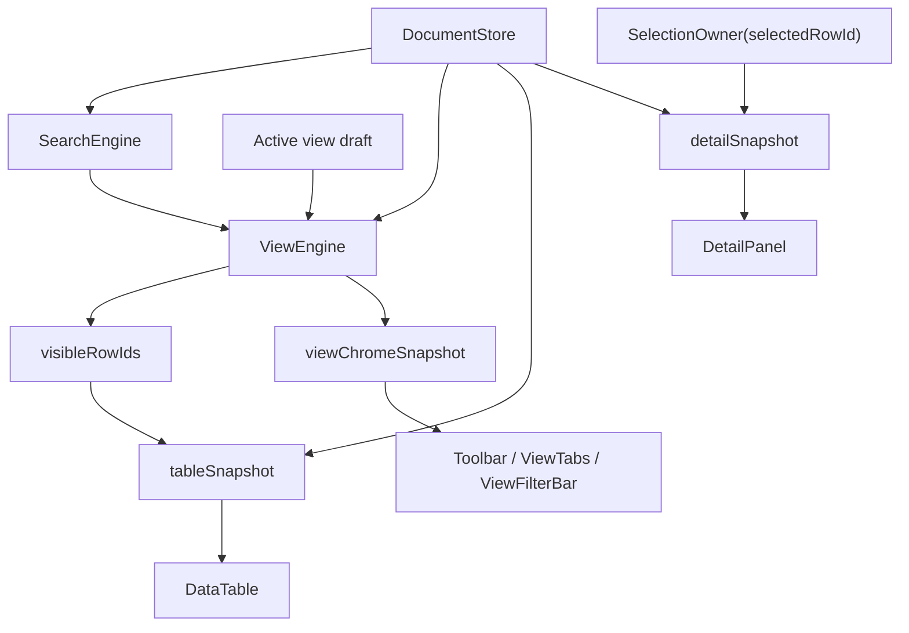

# 大数据编辑第三阶段执行计划

> **For agentic workers:** REQUIRED SUB-SKILL: Use `superpowers:subagent-driven-development` or `superpowers:executing-plans` to implement this plan task-by-task. Steps use checkbox (`- [ ]`) syntax for tracking.

**Goal:** 完成大数据编辑架构治理的第三阶段：正式引入 `ViewEngine` 与 `SearchEngine`，用稳定 `visibleRowIds`、`tableSnapshot`、`detailSnapshot`、`viewChromeSnapshot` 取代当前 `App.tsx` 内部临时 `viewRows` / `viewModel` 派生链。

**Architecture:** 本阶段不再继续扩张第二阶段的 row identity 迁移范围，而是在已落地的 `DocumentStore`、`rowId`、`writeback adapter` 基础上，把搜索、筛选、排序、可见行选择、结果统计和 snapshot 生成统一收口到 engine 层。`App.tsx` 只负责 owner 协调与订阅，不再自己拼装视图结果。

**Tech Stack:** React + TypeScript + `DocumentStore` / `rowId` / `writeback-adapter` + `ViewEngine` / `SearchEngine` + Playwright 回归 + 正式 `8787` 性能复测

---

## 概述

### 1. 总体目标和范围

本执行计划承接：

- [2026-06-09-大数据编辑长期架构治理方案.md](C:/Code/data-editor/docs/plans/2026-06-09-大数据编辑长期架构治理方案.md)
- [2026-06-09-大数据编辑架构治理路线图.md](C:/Code/data-editor/docs/plans/2026-06-09-大数据编辑架构治理路线图.md)
- [2026-06-09-大数据编辑第二阶段执行计划.md](C:/Code/data-editor/docs/plans/2026-06-09-大数据编辑第二阶段执行计划.md)

第二阶段已经完成稳定 `rowId`、`DocumentStore`、`writeback adapter` 和 UI 端 `data-row-id` 契约迁移，但当前仍存在一个关键结构问题：

- 视图结果仍主要由 `App.tsx` 在 render 期临时派生
- 搜索、筛选、排序的组合结果还没有收敛为稳定 engine 输出
- `viewRows` / `viewModel` 仍是中间态，继续阻碍第四阶段增量引擎

因此第三阶段的目标不是“继续修局部卡顿”，而是把“视图派生”从组件实现细节提升为明确的框架层能力。

本阶段范围包括：

- `visibleRowIds`、候选 id 集语义定义
- `ViewEngine` 与 `SearchEngine` 初版落地
- 搜索、筛选、排序从 `App.tsx` 内联派生迁移到 engine
- `tableSnapshot` / `detailSnapshot` / `viewChromeSnapshot` 的视图级收口
- 去掉临时 `viewModel` 和 `viewRows` 作为核心中间态
- 把 selection / detail navigation / restore 的主链收敛到 `rowId + visibleRowIds/collectionStore`
- 第三阶段关键性能与行为回归验证

本阶段不包括：

- `ValidationEngine` / `RelationEngine` / `FieldOptionIndex` 正式增量化
- worker 化
- 动态行高虚拟化
- 第二阶段内部剩余的极小兼容桥之外的写回协议重写

### 2. 各阶段任务概要

1. **阶段 3A：视图结果契约收口**
   - 定义 `SearchResult`、`ViewResult`、`visibleRowIds`、`selectedRowId`
   - 把 `App.tsx` 当前搜索/筛选/排序派生链拆成可替换的 engine 输入输出
   - 明确 table/detail/chrome 三类 snapshot 的 owner 边界

2. **阶段 3B：SearchEngine 落地**
   - 建立 collection 级搜索输入
   - 输出候选 `rowId` 集，不直接拼表格数据
   - 统一正式搜索、清搜索、query 恢复和视图切换后的搜索行为

3. **阶段 3C：ViewEngine 落地**
   - 让搜索候选、筛选、排序按固定顺序收敛为统一 `visibleRowIds`
   - 用 `visibleRowIds + collectionStore` 生成 `tableSnapshot`
   - 用 `selectedRowId + collectionStore + view result` 生成 `detailSnapshot`

4. **阶段 3D：清理临时派生链与回归验证**
   - 移除核心 `viewRows` / `viewModel` 依赖
   - 复测正式 `8787` 开文件、搜索、清搜索
   - 验证 shared view / filter / sort / detail / row action 行为不回退

### 3. 整体结构框架



---

## 一、当前证据链

### 1.1 第二阶段已经提供了第三阶段所需底座

当前已经具备的输入条件：

- `DocumentStore` 已能稳定提供 `rowId -> sourceIndex/sourceKey`
- `DataTable` DOM 契约已切到 `data-row-id`
- `DetailPanel`、row action、relation/backlink 关键路径已能围绕 `rowId` 工作
- e2e/perf 侧 `data-row-index` 依赖已清空

这意味着第三阶段不需要再为“记录身份漂移”兜底，可以直接开始抽离视图派生。

但第二阶段仍保留了一小层内部 bridge：

- `App.tsx` 内仍存在少量 `selectedRowIndex` / source-index 辅助状态
- reopen / next-prev / restore / openDocumentAt 等导航语义还没有完全提升成 `rowId + visibleRowIds` 主链

因此第三阶段除了收口 view-level engine，还必须把 selection / detail navigation 的主路径一并收口；否则第四阶段仍会被迫兼容两套导航语义。

### 1.2 当前真正未收口的是视图派生职责

从长期方案和现状实现看，当前仍有这几个结构性症状：

- 搜索、筛选、排序仍主要在 `App.tsx` 中组合
- `viewRows` 仍承担“可见结果 + 临时行对象”双重职责
- `viewModel` 仍是给表格消费而临时重组的数据形态
- table/detail/chrome snapshot 还没有统一共享一份 view-level 结果

这类问题不会直接导致“写错行”，但会继续导致：

- 搜索与清搜索成本受 render 期全量派生影响
- shared view / local draft / filter / sort 的组合语义分散
- 第四阶段增量 validation / relation / options 没有稳定上游

### 1.3 第三阶段的主要收益目标已从 correctness 转为 view-level 成本控制

第二阶段解决的是“写回目标正确”。第三阶段要解决的是：

- 搜索、筛选、排序不再通过临时整行对象反复重组
- 表格只消费 `visibleRowIds` 结果，不再承担视图推导责任
- detail 和 chrome 不再各自从不同中间态反推出当前 view 结果

因此第三阶段的关键产物不是一个新组件，而是一套稳定的 engine 输入输出。

---

## 二、第三阶段目标模型

### 2.1 推荐方案：SearchEngine 候选集 + ViewEngine 可见集

推荐把视图派生拆成两层：

```ts
type SearchResult = {
  query: string;
  candidateRowIds: string[] | null;
  totalMatched: number;
};

type ViewResult = {
  visibleRowIds: string[];
  totalRowCount: number;
  visibleRowCount: number;
  activeSorts: Array<{ field: string; direction: "asc" | "desc" }>;
  activeFilters: FilterRule[];
};
```

原则：

- `SearchEngine` 只负责 query 到候选 id 集
- `SearchEngine` 的上游输入必须来自 `collectionStore` 的稳定 row registry / 字段读取能力，不能依赖 UI 侧 `viewRows` 或 render 期临时数组
- `ViewEngine` 负责把候选 id 集、筛选、排序、active view draft 合成为最终可见结果
- `DataTable` 不直接理解搜索和筛选规则，只消费 `visibleRowIds`
- `DetailPanel` 通过 `selectedRowId` 和 `collectionStore` 取当前行，不再依赖 `viewRows[selectedIndex]`

#### 候选集与可见集语义

- `candidateRowIds = null` 表示“当前未启用搜索约束”，不是“没有结果”
- `candidateRowIds = []` 表示“搜索已启用，但没有命中结果”
- `visibleRowIds` 表示当前 view result 的最终可见顺序
- `visibleRowIds` 的基准顺序在未显式排序时必须继承 `collectionStore` 的 `sourceOrder`，不能退回对象遍历隐式顺序
- 当当前 `selectedRowId` 不在 `visibleRowIds` 中时，详情面板保持当前选中记录，不自动跳转首条可见记录；next/prev 导航仅在当前 view 的 `visibleRowIds` 范围内生效

#### 执行顺序

第三阶段执行顺序必须固定为：

```text
collectionStore.sourceOrder
-> SearchEngine candidateRowIds
-> ViewEngine filters
-> ViewEngine sorts
-> visibleRowIds
-> table/detail/chrome snapshots
```

禁止在实现过程中临时改成别的组合顺序，否则 shared view / local draft / search 的行为会失去稳定口径。

### 2.2 视图级 snapshot 的职责

建议第三阶段正式把 snapshot 划分为三类：

```ts
type TableSnapshot = {
  rowIds: string[];
  rowViews: TableRowView[];
  issues: Record<string, ValidationIssue | null>;
  backlinkValuesByRowId: Record<string, Record<string, RelationBacklink[]>>;
};

type DetailSnapshot = {
  rowId: string | null;
  rowView: TableRowView | null;
  fieldConfig: DetailFieldConfig;
};

type ViewChromeSnapshot = {
  totalRowCount: number;
  visibleRowCount: number;
  query: string;
  hasActiveFilters: boolean;
  hasActiveSorts: boolean;
};
```

其中：

- `TableSnapshot` 只表达表格浏览态
- `DetailSnapshot` 只表达当前选中行详情态
- `ViewChromeSnapshot` 只表达 toolbar / tab / filter bar / counter 需要的信息

补充约束：

- `DetailSnapshot.rowId` 就是当前 `selectedRowId` 的快照值，不引入第二套“详情专用选择 id”语义
- 当 `selectedRowId` 不在当前 `visibleRowIds` 中时，表格高亮消失，计数仍只反映当前可见集，详情面板保持当前记录；next/prev 按钮在当前 view 中没有可导航目标时禁用

边界说明：

- 第三阶段允许 `issues` 和 `backlinkValuesByRowId` 继续由现有实现生成，再挂到 snapshot 上
- 第三阶段不重写 issue / backlink 的生成机制，只重写它们的 view-level owner 和消费边界
- `ValidationEngine` / `RelationEngine` 的正式增量化推迟到第四阶段

禁止继续让 `Toolbar`、`DataTable`、`DetailPanel` 分别从 `App.tsx` 的不同中间态自行推导 view 结果。

### 2.3 第三阶段后的状态边界

第三阶段完成后，职责应变成：

| 语义 | 当前第二阶段末状态 | 第三阶段目标 |
| --- | --- | --- |
| 搜索结果 | `App.tsx` 组合派生 | `SearchEngine` 输出候选 `rowId` 集 |
| 可见结果 | `viewRows` | `ViewEngine.visibleRowIds` |
| 表格输入 | `rowViews + 旧 view 组合态` | `tableSnapshot` |
| 详情输入 | `selectedRowId + App 内部派生` | `detailSnapshot` |
| 顶部计数 / chrome | 各处零散读取 | `viewChromeSnapshot` |
| 临时 `viewModel` | 仍存在 | 删除核心依赖 |
| selection / next-prev / restore | `selectedRowId + selectedRowIndex bridge` | `selectedRowId + visibleRowIds/collectionStore` |

### 2.4 第三阶段必须保留的约束

1. 不在本阶段引入 validation / relation / option 的正式增量缓存
2. 不把 `SearchEngine` 写成 UI 组件内部 hook 私有状态
3. 不继续允许 `DataTable` 自己拼临时“可见行对象数组”作为唯一数据源
4. 允许在短期内保留少量 adapter，但不能让 `viewRows` 继续作为架构中心
5. `selectedRowIndex` 一类旧 bridge 若保留，只允许留在 writeback adapter 或极薄的导航兼容层，不能继续成为 UI 主链
6. query 的持久化边界必须先写死再实现：第三阶段固定采用“query 只属于本地当前会话，不进入 shared view 持久化”规则
7. 第三阶段完成后，第四阶段应能直接消费 `visibleRowIds` 和稳定 snapshot，而不是重新围绕 `viewModel` 适配

---

## 三、建议文件结构

### 3.1 新增 engine 文件

- Add: `src/view/contracts.ts`
  - 负责 `SearchResult`、`ViewResult`、snapshot 等共享类型
- Add: `src/view/search-engine.ts`
  - 负责 query -> candidate row ids
- Add: `src/view/view-engine.ts`
  - 负责 filters / sorts / candidate ids -> visible row ids
- Add: `src/view/view-snapshot.ts`
  - 负责从 `collectionStore + view result + selection` 生成 snapshot

### 3.2 调整现有边界

- Update: `src/App.tsx`
  - 只做 owner 协调、事件分发、snapshot 订阅
- Update: `src/components/ViewTabs.tsx`
  - 只消费 `viewChromeSnapshot` / active view state，不再自行推导 view 结果
- Update: `src/components/ViewFilterBar.tsx`
  - 只消费 `viewChromeSnapshot` / active filter draft，不再自行推导结果计数
- Update: `src/view/filtering.*`
  - 抽离为 `ViewEngine` 可复用逻辑，不再直接服务组件 render
- Update: `src/table/DataTable.tsx`
  - 明确只消费 `tableSnapshot.rowViews`
- Update: `src/components/Toolbar.tsx`
  - 计数、搜索态、按钮态只消费 `viewChromeSnapshot`

### 3.3 测试与 profiling

- Update: `tests/data-editor.spec.ts`
  - shared view / filter / search / sort / detail 关键回归
- Add/Update: `tests/perf/*`
  - 正式 `8787` 开文件、搜索、清搜索基线

---

## 四、执行步骤

### 4.1 阶段 3A：梳理当前视图派生链

- [ ] 盘点 `App.tsx` 中当前 `viewRows`、`viewModel`、`searchQuery`、filter、sort、counter 的依赖链
- [ ] 标出哪些是 `SearchEngine` 输入，哪些是 `ViewEngine` 输入
- [ ] 定义 `SearchResult`、`ViewResult`、三类 snapshot 的类型与最小字段集
- [ ] 按既定规则落文：query 只属于本地当前会话，不进入 shared view 持久化
- [ ] 按既定规则落文：detail next-prev / restore / openDocumentAt 统一基于当前 `visibleRowIds`；若当前 `selectedRowId` 不在可见集内，详情保持当前记录，不自动跳转
- [ ] 先写纯函数级 contract / engine 测试，再接入 `App.tsx`

预期产物：

- `ViewEngine` 输入输出定义
- `SearchEngine` 输入输出定义
- `table/detail/chrome` snapshot 契约

### 4.2 阶段 3B：SearchEngine 初版落地

- [ ] 从 `collectionStore` 的稳定 row registry / 字段读取接口构建搜索输入，而不是从组件内临时数组或 `viewRows` 搜索
- [ ] 输出 `candidateRowIds`
- [ ] 统一 query 为空与 query 非空两条路径
- [ ] 固化 `candidateRowIds = null` 与 `[]` 的语义
- [ ] 保持现有搜索匹配语义不回退

预期产物：

- `src/view/search-engine.ts`
- 搜索 query 与候选集测试
- `query` 持久化边界文档化

### 4.3 阶段 3C：ViewEngine 初版落地

- [ ] 按 `candidate -> filters -> sorts -> visibleRowIds` 固定顺序收口视图结果
- [ ] 让 `visibleRowIds` 成为表格可见结果的唯一主来源
- [ ] 让 `selectedRowId` 通过 `collectionStore` 解析 detail，而不是通过 `viewRows[index]`
- [ ] 让 detail next-prev / restore / openDocumentAt 统一依赖当前 `visibleRowIds` 或 `collectionStore`
- [ ] 生成 `tableSnapshot` / `detailSnapshot` / `viewChromeSnapshot`

预期产物：

- `src/view/view-engine.ts`
- `src/view/view-snapshot.ts`
- `App.tsx` 的视图派生链显著收缩

### 4.4 阶段 3D：移除临时中心态并验证

- [ ] 移除核心 `viewModel` 依赖
- [ ] 把 `viewRows` 降级为 snapshot 生成过程中的中间结果，能删则删
- [ ] 把 `selectedRowIndex` 从 UI 主链移除；若保留，仅允许存在于极薄兼容层
- [ ] 清理当前 `selectedRowIndex` 残余点位，至少包括：
  - `selectedRowView` 的 `selectedRowIndex` fallback
  - `detailSnapshot.rowIndex`
  - `addField(model, collectionPath, selectedRowIndex, ...)`
  - `openDocumentAt(..., selectedRowIndex, ..., selectedRowId)`
  - 依赖 `selectedRowIndex` 的维护信息加载与 restore 链路
- [ ] 跑 shared view / filter / sort / search / detail 关键回归
- [ ] 跑正式 `8787` 开文件、搜索、清搜索复测

预期产物：

- 关键行为不回退
- 第四阶段可直接接入稳定 view-level 结果

---

## 五、验收门槛

### 5.1 行为正确性

至少验证以下链路：

- 搜索后编辑、切换详情、再清搜索，selection 不漂移
- shared view 下保存筛选与排序后，reload 结果一致
- detail 打开、切换上一条/下一条仍绑定正确 `rowId`
- filter / sort / search 的组合结果与第二阶段末行为一致
- 切换 shared view / local view / collection 后，query、counter、visible rows 恢复一致
- record-map 集合在未显式排序时仍遵守 `sourceOrder`

### 5.2 性能门槛

按长期方案与路线图约束，本阶段目标为：

| 指标 | 目标 |
| --- | --- |
| 正式 `8787` 开文件 | `<= 350ms` |
| 正式 `8787` 搜索“部署物” | `<= 180ms` |
| 正式 `8787` 清搜索 | `<= 260ms` |
| 搜索 / 清搜索 | 不再重建临时 `viewModel` |

采样规程沿用长期方案：

- 正式静态服务指标和 `dev` profiling 指标分开记录
- 同一脚本连续运行 `3` 次，取中位数作为阶段结论
- 每轮都记录文件、行数、字段数、端口与 profiling 开关状态
- 默认性能验收样本固定为 `prototypes_expansion.json`，除非文档显式补充新的标准样本

### 5.3 架构完成定义

满足以下条件才算第三阶段完成：

- `visibleRowIds` 已成为可见结果主契约
- `SearchEngine` 与 `ViewEngine` 已从 `App.tsx` 临时派生链中独立出来
- `table/detail/chrome` 三类 snapshot 都基于统一 view result 生成
- `viewModel` 不再是主链核心依赖
- selection / detail navigation / restore 已以 `selectedRowId + visibleRowIds/collectionStore` 为主链
- `selectedRowIndex` 若仍存在，只能位于 writeback 或极薄兼容层，不能继续成为 UI 主状态
- 第四阶段可以直接围绕 `visibleRowIds`、snapshot、`rowId` 做增量引擎

---

## 六、风险与决策点

### 6.1 最大风险

最大风险不是代码量，而是“第三阶段只做了一半”：

- 搜索抽出去了，但排序和筛选仍留在 `App.tsx`
- `visibleRowIds` 有了，但 `DataTable` 还在吃旧 `viewRows`
- `tableSnapshot` 有了，但 `viewChromeSnapshot` 继续分散读取
- `rowId` 主链有了，但 selection / next-prev / restore 仍偷偷走旧 `selectedRowIndex`

这种半迁移会直接拖慢第四阶段，因为增量引擎会被迫同时适配新旧两套视图结果。

### 6.2 推荐决策

推荐把第三阶段作为一个完整阶段执行完，不拆成“先搜再排再快照”的长期悬置状态。原因是：

- `SearchEngine`、`ViewEngine`、snapshot 契约天然是同一层职责
- 如果只做一部分，后续每次改 filter / sort / search 都要重复迁移
- 只有完整收口后，第四阶段才有稳定上游

---

## 七、交付结果

第三阶段结束时，仓库中应至少具备：

- `ViewEngine` 初版实现
- `SearchEngine` 初版实现
- `visibleRowIds` 主契约
- `tableSnapshot` / `detailSnapshot` / `viewChromeSnapshot` 稳定输入
- 正式 `8787` 搜索、清搜索、开文件的复测记录
- 能支撑第四阶段增量引擎的稳定上游结构

---

## 八、实际完成结果（2026-06-09）

### 8.1 本轮实际落地范围

本阶段已按计划完成以下收口：

- `src/view/contracts.ts`、`src/view/search-engine.mjs`、`src/view/view-engine.mjs` 正式落地
- `App.tsx` 已移除 `viewRows` / `viewModel` 作为视图主链核心中间态
- `tableSnapshot` 已收口到 `schemaModel + visibleRowViews`
- selection 主链已切到 `rowId + collectionStore`
- `DetailPanel` 的 next / prev 与“当前记录已不在可见集”语义已切到 `visibleRowIds`
- `openDocumentAt` 已改成 `targetRowId` 优先，`targetRowIndex` 仅保留兼容 fallback
- `tests/view-state.test.mjs` 已对齐当前 snapshot 结构
- `tests/data-editor.spec.ts` 已补“当前详情记录被搜索隐藏但不丢失选中态”的关键回归

### 8.2 实际验证结果

已完成验证：

- `npx tsc --noEmit`：通过
- `node --test tests/view-engine.test.mjs tests/filtering.test.mjs tests/sorting.test.mjs tests/document-store.test.mjs tests/writeback-adapter.test.mjs tests/relation-maintenance.test.mjs tests/backlink-grid.test.mjs tests/view-state.test.mjs`：`76/76` 通过
- Playwright 关键场景：
  - `shared view filter and sort drafts persist through save and reload`
  - `relation popover still opens and selects target after option field shell migration`
  - `detail panel option field draft stays bound to the original row when navigating records`
  - `toolbar search filters visible table rows, not just the counter`
  - `detail keeps the selected record when search hides it from the current view`
  - 以上 `5/5` 通过

### 8.3 实际性能结果

静态复测脚本：`node tests/perf/prototypes-expansion-static.mjs`

连续 `3` 次结果：

| Run | goto | openDocument | search | clearSearch | openDetail |
| --- | --- | --- | --- | --- | --- |
| 1 | `226.47ms` | `295.09ms` | `56.23ms` | `95.53ms` | `28.05ms` |
| 2 | `198.59ms` | `252.68ms` | `43.00ms` | `89.06ms` | `34.40ms` |
| 3 | `177.54ms` | `254.37ms` | `47.06ms` | `76.86ms` | `42.94ms` |

中位数：

- `openDocument = 254.37ms`
- `search = 47.06ms`
- `clearSearch = 89.06ms`

结论：

- 已满足第三阶段门槛中的 `openDocument <= 350ms`
- 已满足第三阶段门槛中的 `search <= 180ms`
- 已满足第三阶段门槛中的 `clearSearch <= 260ms`
- 与本阶段开始前约 `560ms` 级别的 `openDocument` 相比，正式样本已明显下降

### 8.4 第三阶段收口结论

第三阶段可以视为完成，原因是：

- 新的 view-level 主契约已经稳定为 `visibleRowIds` / snapshot / `rowId`
- 旧的 `viewModel` 中间态已经退出主链
- 第四阶段不再需要同时适配新旧两套视图表达
- 性能门槛与关键行为回归都已有真实证据

因此下一步不应再继续补第三阶段局部细节，而应进入第四阶段：把 validation / relation / field option 的全量扫描改为增量引擎。
