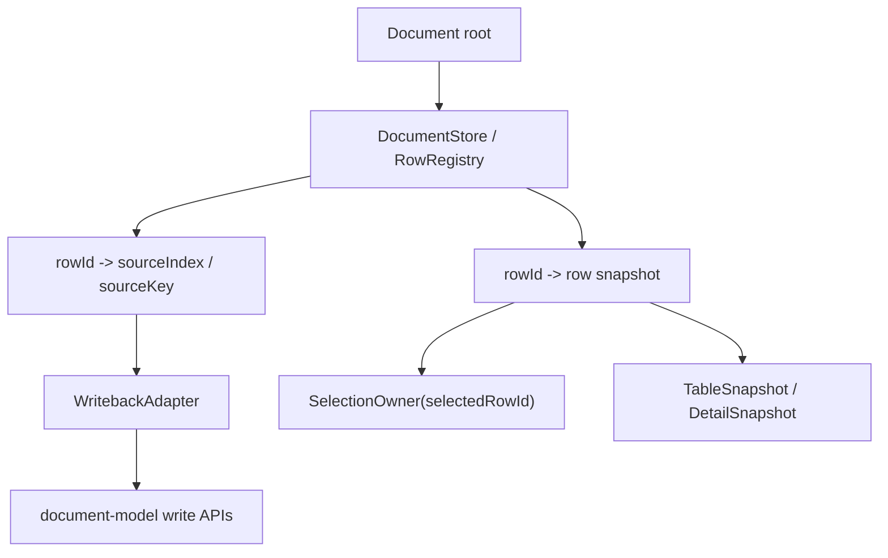

# 大数据编辑第二阶段执行计划

> **For agentic workers:** REQUIRED SUB-SKILL: Use `superpowers:subagent-driven-development` or `superpowers:executing-plans` to implement this plan task-by-task. Steps use checkbox (`- [ ]`) syntax for tracking.

**Goal:** 完成大数据编辑架构治理的第二阶段：引入稳定 `rowId` 与明确写回边界，让选择、详情、编辑、删除、插入、排序、筛选都不再依赖临时 `rowIndex` / `__rowIndex`。

**Architecture:** 本阶段不正式进入 `ViewEngine` / `SearchEngine` 重构，也不做阶段三的 `visibleRowIds` 全量替换。重点是先在 `DocumentStore` 边界内建立稳定 row identity、source order 和 writeback adapter，再把 `App.tsx`、`DataTable`、详情面板相关入口从 `selectedRowIndex` 逐步迁到 `selectedRowId`。

**Tech Stack:** React + TypeScript + document-model helpers + 本地 profiling / Playwright 回归 + JSON array / `record-map` 双模型支持

---

## 概述

### 1. 总体目标和范围

本执行计划承接：

- [2026-06-09-大数据编辑长期架构治理方案.md](C:/Code/data-editor/docs/plans/2026-06-09-大数据编辑长期架构治理方案.md)
- [2026-06-09-大数据编辑架构治理路线图.md](C:/Code/data-editor/docs/plans/2026-06-09-大数据编辑架构治理路线图.md)
- [2026-06-09-大数据编辑第一阶段执行计划.md](C:/Code/data-editor/docs/plans/2026-06-09-大数据编辑第一阶段执行计划.md)

本阶段目标不是“把 `rowIndex` 改名成 `rowId`”，而是把以下四件事一次性收口：

- 稳定 row identity
- 稳定 source order
- 稳定 `rowId -> sourceIndex/root location` 写回映射
- 稳定 selection / detail open / row action 的调用边界

此外，本阶段必须同时处理所有“以 row index 为 key 的派生结果”，否则只迁选择态会留下半迁移状态。

本阶段范围包括：

- 当前 `__rowIndex` / `selectedRowIndex` / `openDetail(rowIndex)` 依赖链梳理
- `DocumentStore` 初版或等价 row identity adapter
- array root 与 `record-map` root 的统一 row handle
- `setCellValue` / `setNestedValue` / `addRow` / `deleteRow` / relation 跳转等写操作适配层
- `App.tsx`、`DataTable`、`DetailPanel`、选择状态从 row index 迁移到 row id
- `issues`、`backlinkValuesByRowIndex`、DOM row marker、restore state 等 index-keyed 派生结构迁移
- 第二阶段回归测试与 profiling 护栏

本阶段不包括：

- `visibleRowIds` 完整落地
- `ViewEngine` / `SearchEngine` 正式拆分
- validation / relation / field option cache
- worker 化和虚拟化重构

### 2. 各阶段任务概要

1. **阶段 2A：row identity 盘点与契约定义**
   - 梳理所有 `rowIndex` / `__rowIndex` 使用点
   - 定义 `rowId`、`sourceIndex`、`sourceOrder`、`row locator` 的语义边界
   - 明确 array 与 `record-map` 的统一行抽象

2. **阶段 2B：DocumentStore / writeback adapter 落地**
   - 建立 collection 级 row registry
   - 提供 `rowId -> row`、`rowId -> sourceIndex`、`rowId -> source key/root path`
   - 让写操作都通过 adapter 进入 `document-model`

3. **阶段 2C：UI 入口切换**
   - `selectedRowIndex` 迁移为 `selectedRowId`
   - `openDetail`、表格点击、详情编辑、删除、插入、relation 打开等入口统一改成 row id
   - 保留最小必要的 index bridge，只允许在 adapter 内部存在

4. **阶段 2D：顺序语义与回归验证**
   - 明确 `record-map` 默认顺序
   - 验证排序、筛选、删除、插入后写回目标不漂移
   - 验证正式模式交互耗时不回退

### 3. 整体结构框架



---

## 一、当前证据链

### 1.1 当前 row identity 仍是运行态补丁

当前代码中的关键事实：

- [src/view/filtering.mjs](C:/Code/data-editor/src/view/filtering.mjs) 通过 `attachRowIndexes(...)` 在运行态附加 `__rowIndex`
- [src/table/DataTable.tsx](C:/Code/data-editor/src/table/DataTable.tsx) 继续把 `tableData` 生成为 `{ ...row, __rowIndex }`
- 同文件 `getRowId` 当前直接返回 `String(row.__rowIndex)`
- 表格 cell 编辑、标题打开详情、relation / backlink 打开等动作都依赖 `row.original.__rowIndex`

这说明当前表格 identity 仍然是“为了让视图层能工作而临时拼出来的 index”。

### 1.2 当前选择与详情语义仍依赖 source index

当前 [src/App.tsx](C:/Code/data-editor/src/App.tsx) 中：

- `selectedRowIndex` 是全局选择态
- `openDetail(rowIndex)` 直接写入 `selectedRowIndex`
- `selectedRow = rows[selectedRowIndex]`
- `confirmDeleteRow()`、`confirmAddField()`、详情编辑、relation draft 提交等都直接把 `selectedRowIndex` 传给写操作

这意味着只要可见顺序、默认顺序、source order、筛选结果之间的映射关系有任何漂移，写回目标就可能错位。

### 1.3 当前写操作 API 的边界是 rowIndex，不是 rowId

当前 [src/document-model.mjs](C:/Code/data-editor/src/document-model.mjs) 中：

- `setCellValue(model, collectionPath, rowIndex, fieldName, value)`
- `setNestedValue(model, collectionPath, rowIndex, pathParts, value)`
- `deleteRow(model, collectionPath, rowIndex)`
- `addField(model, collectionPath, rowIndex, ...)`

并且在 `record-map` 模式下，内部仍是：

- `Object.entries(root)[rowIndex]`
- `getRecordMapRows(root, keyField)` 直接把当前对象遍历结果映射成 rows

这说明第二阶段必须先定义 `rowId -> source key/source index`，否则 `record-map` 的顺序与写回语义仍是隐式且脆弱的。

### 1.4 当前还有一批 index-keyed 派生结构

当前代码里不只是选择态依赖 row index，至少还包括：

- [src/table/DataTable.tsx](C:/Code/data-editor/src/table/DataTable.tsx) 中的 `snapshot.backlinkValuesByRowIndex[originalRowIndex]`
- [src/table/DataTable.tsx](C:/Code/data-editor/src/table/DataTable.tsx) 中的 `snapshot.issues[\`${originalRowIndex}:${fieldName}\`]`
- [src/table/DataTable.tsx](C:/Code/data-editor/src/table/DataTable.tsx) 中的 `data-row-index`
- [src/App.tsx](C:/Code/data-editor/src/App.tsx) 中的 `openDocumentAt(path, targetCollection, targetRowIndex, ...)`
- [src/App.tsx](C:/Code/data-editor/src/App.tsx) 中的 reopen / detail restore / DOM 选中恢复链路

这意味着第二阶段如果只把 `selectedRowIndex` 改为 `selectedRowId`，但不迁这些派生结构，就会出现：

- 选中的记录是对的，但 issue 高亮打到别的行
- detail 打开的是对的，但 backlink 面板仍按旧 index 取值
- reopen / refresh 后恢复到错误行
- 表格虚拟化窗口移动后，DOM 选中高亮与真实 selection 脱节

### 1.5 第一阶段已经完成，当前瓶颈已变化

第一阶段已把 detail-only 热区从主渲染链剥离，最新正式模式静态复测结果为：

- 开文件 `218.89ms`
- 搜索“部署物” `50.5ms`
- 清搜索 `72.29ms`
- 打开 detail `17.44ms`

因此第二阶段的主要目标不再是性能止血，而是结构正确性，为第三阶段的 `ViewEngine` 和增量 cache 打地基。

---

## 二、第二阶段目标模型

### 2.1 推荐方案：显式 row registry + 写回适配层

推荐方案是引入一个轻量但明确的 row identity 层，而不是继续让 UI 自己拼 `__rowIndex`。

建议核心结构：

```ts
type RowId = string;

type RowHandle = {
  rowId: RowId;
  collectionPath: string;
  sourceIndex: number;
  sourceKey: string | null;
  sourceOrder: number;
};

type CollectionStore = {
  collectionPath: string;
  rowIds: RowId[];
  rowById: Map<RowId, DataRecord>;
  handleById: Map<RowId, RowHandle>;
};
```

建议第二阶段先引入一个明确的中间行契约，而不是让 `DataTable` 继续自己拼运行态索引：

```ts
type TableRowView = {
  rowId: RowId;
  row: DataRecord;
  sourceIndex: number;
  sourceKey: string | null;
};

type TableSnapshot = {
  rows: TableRowView[];
  rowOrder: RowId[];
  issueByCellKey: Record<string, ValidationIssue | null>;
  backlinkValuesByRowId: Record<RowId, Record<string, RelationBacklink[]>>;
};
```

第二阶段不要求一步做到最终版 `visibleRowIds`，但必须先让表格和详情都能消费稳定的 `rowId` / `TableRowView`，否则 Task 2/3 与 Task 4 之间没有可落地的连接点。

原则：

- `rowId` 用于 UI 选择、详情、表格 key、回归测试断言
- `sourceIndex` 只用于底层写回桥接，不再暴露给 UI 逻辑直接消费
- `sourceKey` 只在 `record-map` 场景下存在
- `sourceOrder` 明确表达“默认顺序”，不能继续隐式依赖对象遍历
- 表格、详情、issue、backlink 等渲染层只允许消费 `rowId` 或 `TableRowView`，不允许继续直接拼 `__rowIndex`

### 2.2 迁移后的职责边界

第二阶段完成后，职责应变成：

| 语义 | 阶段一现状 | 第二阶段目标 |
| --- | --- | --- |
| 选择态 | `selectedRowIndex` | `selectedRowId` |
| 表格 row key | `__rowIndex` | `rowId` |
| 详情打开 | `openDetail(rowIndex)` | `openDetail(rowId)` |
| 编辑写回 | UI 传 `rowIndex` | UI 传 `rowId`，adapter 定位 source |
| 默认顺序 | array index / `Object.entries()` 隐式决定 | `sourceOrder` 显式决定 |
| `record-map` 键重命名 | 行内改 key，顺序依赖当前对象重建 | 通过 writeback adapter 保持 row identity 与 source order 一致 |

### 2.3 第二阶段必须保留的约束

1. 不在本阶段顺手重写 `ViewEngine`
2. 不在本阶段引入 validation / relation / option cache
3. 不把第二阶段和第三阶段混在一个大提交里
4. UI 层允许短期同时携带 `rowId` 与旧 `rowIndex bridge`，但桥接只允许存在于 adapter / compatibility helper
5. 旧的 `__rowIndex` 最终只能作为阶段性兼容字段，不能继续成为真实 identity
6. 第二阶段必须同时迁移 index-keyed 派生结构，禁止出现“selection 用 rowId，issue/backlink/restore 仍用 rowIndex”的半迁移状态

### 2.4 `record-map` 的决策前置项

第二阶段开始执行前，必须先把下面这条规则写死到文档与实现：

- 推荐规则：`record-map` 的 `rowId` 不从当前 key 文本直接派生；key rename 后，记录 identity 保持不变，只更新 `sourceKey`

推荐这个规则的原因是：

- 这样 `selectedRowId`、detail restore、scroll restore 不会因为 key rename 直接漂移
- 写回层只需要更新 `rowHandle.sourceKey`，不需要强迫 UI 全链重选
- 它更符合“rowId 表示记录身份，key 只是该记录当前 source key”的职责分离

如果不接受这条规则，就必须在执行前明确另一条完整规则；不能在实现过程中边写边决定

---

## 三、目标文件结构

建议新增或调整以下文件边界：

### 3.1 核心 identity / store 文件

- Add: `src/model/row-id.ts`
  - 负责 `rowId` 生成、序列化、解析辅助
- Add: `src/model/document-store.ts`
  - 负责从 `DocumentModel` 构建 `CollectionStore`
- Add: `src/model/writeback-adapter.ts`
  - 负责 `rowId -> sourceIndex/sourceKey` 定位与写回桥接
- Add: `tests/document-store.test.mjs`
  - 覆盖 array / `record-map` 两种模型下的 row registry 语义
- Add: `tests/writeback-adapter.test.mjs`
  - 覆盖排序、筛选、删除、插入后的写回正确性
- Optional add: `src/model/table-row-view.ts`
  - 定义第二阶段中间行契约，承接 `rowId` 到表格 / 详情渲染层

### 3.2 现有文件修改边界

- Modify: `src/App.tsx`
  - 选择态、详情打开态、row action、编辑入口切换为 `rowId`
- Modify: `src/table/DataTable.tsx`
  - `getRowId`、row click、title open detail、cell edit 全部改用 `rowId`
  - `backlinkValuesByRowIndex`、`issues["rowIndex:field"]`、`data-row-index` 迁到 rowId 语义
- Modify: `src/detail/DetailPanel.tsx`
  - detail snapshot 中承载 `rowId`
- Modify: `src/document-model.mjs`
  - 保持底层 mutation API 可用，但新增或配合 adapter 使用的 source 定位入口
- Modify: `src/view/filtering.mjs`
  - 为阶段三过渡保留最小 bridge，避免继续把 `__rowIndex` 当唯一 identity
- Modify: `tests/filtering.test.mjs`
  - 调整 identity 相关断言，避免把旧 `__rowIndex` 语义写死为长期行为
- Modify: 相关 restore / reopen 测试
  - 覆盖 `openDocumentAt(...targetRowIndex...)` 迁移后的行为

---

## 四、实施任务

### Task 1：完成 row identity 盘点与契约文档

**Files:**

- Modify: `docs/plans/2026-06-09-大数据编辑第二阶段执行计划.md`
- Optional add: `docs/plans/2026-06-09-row-identity-迁移清单.md`

- [ ] 列出 `selectedRowIndex`、`__rowIndex`、`openDetail(rowIndex)`、`getRowId(String(__rowIndex))` 的全部触点
- [ ] 列出 `backlinkValuesByRowIndex`、`issues["rowIndex:field"]`、`data-row-index`、`openDocumentAt(...targetRowIndex...)` 的全部触点
- [ ] 区分“UI identity”“source order”“writeback locator”三种语义
- [ ] 定义 array / `record-map` 下 `rowId` 的稳定性要求
- [ ] 明确第二阶段中间行契约：`TableRowView` / `rowId + row lookup` 二选一并写死
- [ ] 定义允许临时保留 index bridge 的边界
- [ ] 固定 `record-map` key rename 后 identity 保持规则

验收：

- 迁移清单覆盖表格、详情、删除、插入、relation、保存后 reopen、scroll restore、issue/backlink/DOM 选中恢复
- 文档中不再混用 `rowId` 和 `rowIndex` 语义

### Task 2：实现 `DocumentStore` 初版与 row registry

**Files:**

- Add: `src/model/row-id.ts`
- Add: `src/model/document-store.ts`
- Add: `tests/document-store.test.mjs`

- [ ] 从 `DocumentModel` 构建 collection 级 `rowIds`
- [ ] 提供 `rowById`、`handleById`、`sourceIndexByRowId`
- [ ] 为 `record-map` 保存 `sourceKey` 与显式 `sourceOrder`
- [ ] 明确 reopen / rebuild 时 rowId 稳定策略
- [ ] 输出 `TableRowView[]` 或等价行视图，作为表格与详情统一输入

验收：

- 相同 source document 在无结构变化时，重建 store 不改变既有 rowId
- `record-map` 模式下默认顺序不依赖裸 `Object.entries(root)` 推断
- 表格层不需要再自行根据窗口偏移拼 `__rowIndex`

### Task 3：实现 writeback adapter

**Files:**

- Add: `src/model/writeback-adapter.ts`
- Modify: `src/document-model.mjs`
- Add: `tests/writeback-adapter.test.mjs`

- [ ] 提供 `setCellValueByRowId(...)`
- [ ] 提供 `setNestedValueByRowId(...)`
- [ ] 提供 `deleteRowByRowId(...)`
- [ ] 提供 `addFieldByRowId(...)`
- [ ] 提供 `openDocumentTargetByRowId(...)` 或等价 reopen / detail restore 定位入口
- [ ] 按“key rename 后 rowId 保持不变，只更新 sourceKey”实现 `record-map` 规则

验收：

- 排序后编辑写回原始记录正确
- 筛选后编辑写回原始记录正确
- 删除后剩余行 identity 不发生错误复用
- 插入后新行拿到新 `rowId`
- key rename 后原 `rowId` 保持不变，restore / selection 命中同一记录

### Task 4：迁移 UI 入口到 `rowId`

**Files:**

- Modify: `src/App.tsx`
- Modify: `src/table/DataTable.tsx`
- Modify: `src/detail/DetailPanel.tsx`

- [ ] `selectedRowIndex` 迁移为 `selectedRowId`
- [ ] `openDetail(rowIndex)` 改为 `openDetail(rowId)`
- [ ] 表格 row key 从 `__rowIndex` 改为 `rowId`
- [ ] 编辑、relation、删除、详情字段操作都改为传 `rowId`
- [ ] 保证 `selectedRow` 从 store / handle lookup 获取，不再直接 `rows[selectedRowIndex]`
- [ ] `backlinkValuesByRowIndex` 迁移为 `backlinkValuesByRowId`
- [ ] `issues["rowIndex:field"]` 迁移为 `issues["rowId:field"]` 或等价 cell key
- [ ] `data-row-index` 与 DOM 高亮恢复迁移为 `data-row-id`
- [ ] `openDocumentAt(...targetRowIndex...)` 迁移为 rowId 语义入口

验收：

- 排序、筛选、清搜索、重开 detail 后选中行不漂移
- 表格和详情面板不再依赖 source index 作为长期状态
- issue/backlink/DOM 高亮与真实 selection 命中同一条记录

### Task 5：处理 `record-map` 顺序语义与 reopen 恢复

**Files:**

- Modify: `src/model/document-store.ts`
- Modify: `src/App.tsx`
- Modify: `tests/document-model.test.mjs`
- Add or modify: 针对 reopen / restore 的回归测试文件

- [ ] 定义 `record-map` 默认顺序来源
- [ ] 按“rowId 保持不变、sourceKey 更新”规则校准 key rename
- [ ] 校准 reopen / refresh / autosave 后的 selection 恢复逻辑
- [ ] 校准 scroll restore 与 detail restore 使用 `rowId`
- [ ] 校准 relation / backlink 打开目标时的跨文档 row locator

验收：

- `record-map` 根集合重开后默认顺序稳定
- key rename 不会把详情选中漂移到错误记录
- reopen 后可恢复到正确记录而不是错误 index
- 跨文档 relation / backlink 打开后命中正确记录

### Task 6：回归验证与阶段结果回写

**Files:**

- Modify: `tests/filtering.test.mjs`
- Modify: `tests/data-editor.spec.ts`
- Modify: `docs/plans/2026-06-09-大数据编辑架构治理路线图.md`
- Modify: `docs/plans/2026-06-09-大数据编辑长期架构治理方案.md`

- [ ] 增加 row identity 回归测试
- [ ] 增加排序后编辑、筛选后编辑、删除后详情恢复等 e2e 场景
- [ ] 增加 issue/backlink/DOM 高亮与 rowId 对齐回归
- [ ] 增加 `record-map` key rename 后 reopen / refresh / detail restore 场景
- [ ] 复跑正式模式 profiling
- [ ] 把阶段二结果写回路线图与长期方案

验收：

- 功能正确性优先通过
- 正式 `8787` 开文件 / 搜索 / 清搜索 / 打开 detail 相对第一阶段最新基线不出现明显回退
- 第二阶段文档明确哪些问题已解决，哪些问题留给第三阶段

---

## 五、关键设计决策

### 5.1 为什么推荐显式 `rowId`，而不是继续强化 `__rowIndex`

推荐显式 `rowId`，原因是：

- `__rowIndex` 天然绑定某一时刻的 source index，不适合作为选择态与表格 key 的长期 identity
- 一旦进入第三阶段的 `visibleRowIds`，继续沿用 `__rowIndex` 只会把旧约束带进新引擎
- `record-map` 场景并不存在天然稳定的数组 index，继续依赖 index 只会放大顺序漂移问题

### 5.2 为什么第二阶段不直接做 `visibleRowIds`

因为那是第三阶段的责任。第二阶段要先解决“谁是这条记录”与“怎么把修改写回正确记录”，否则 `visibleRowIds` 只是把不稳定 identity 换一种容器表达。

### 5.3 为什么 writeback adapter 必须单独成层

因为底层 `document-model.mjs` 现在仍是 index-oriented API。直接在 UI 到处散落 `rowId -> index` 换算，会让第二阶段失去意义。adapter 单独成层后：

- UI 只关心 `rowId`
- 底层模型仍可阶段性保留现有 mutation API
- 第三阶段以后再决定是否把 `document-model` 底层 API 正式改成 rowId-oriented

### 5.4 为什么必须同时迁移 issue / backlink / restore

因为这些结构现在同样使用 row index 编址。只迁 `selectedRowId` 会留下“身份语义已经迁移，但派生结果仍对着旧索引”的错误状态，执行后表面上看像完成了迁移，实际交互仍会错位。

---

## 六、阶段门槛

### 6.1 正确性门槛

| 场景 | 目标 |
| --- | --- |
| 排序后编辑 | 写回原始记录正确 |
| 筛选后编辑 | 写回原始记录正确 |
| 删除后继续编辑 | 不写错下一条记录 |
| 新增后打开详情 | 命中新建记录 |
| `record-map` key rename | 详情与选择不漂移 |
| reopen / refresh | 恢复到正确记录 |

### 6.2 性能护栏

| 指标 | 护栏 |
| --- | --- |
| 正式 `8787` 开文件 | 相对 `218.89ms` 基线不得明显回退 |
| 正式 `8787` 搜索“部署物” | 相对 `50.5ms` 基线不得明显回退 |
| 正式 `8787` 清搜索 | 相对 `72.29ms` 基线不得明显回退 |
| 正式 `8787` 打开 detail | 相对 `17.44ms` 基线不得明显回退 |

说明：

- 第二阶段主目标是正确性，不追求再做一次大幅性能跃迁
- 但不能为了 rowId 迁移把第一阶段已经拿到的正式模式收益回退掉

---

## 七、风险与约束

1. `rowId` 引入后，现有依赖 `selectedRowIndex` 的逻辑会非常分散，必须先盘点再动手
2. `record-map` 如果不先定义 `sourceOrder`，第二阶段会在 reopen / rename 场景出现隐性错位
3. 如果把第二阶段和第三阶段混在一起，很容易把问题从“写回正确性”扩散成“整条视图引擎重写”
4. `DataTable` 当前虚拟化窗口仍在本地拼接 `tableData`，迁移时必须防止 row key 与 window offset 重新耦合
5. relation / backlink / primary key sync 等跨文档路径如果仍偷用 row index，会成为第二阶段后期的漏网点
6. 如果不先固定 `record-map` key rename 后 `rowId` 保持不变的规则，执行过程中会反复返工 reopen / restore / selection 逻辑

---

## 八、推荐执行顺序

推荐严格按以下顺序推进：

1. 先做 Task 1，把 row identity 契约写死
2. 再做 Task 2，让 store / registry 成为唯一可信来源
3. 再做 Task 3，把写回桥接集中到 adapter
4. 再做 Task 4，迁 UI 入口和 index-keyed 派生结构
5. 最后做 Task 5 和 Task 6，处理 `record-map` 边界、restore 语义和全链回归

不推荐的顺序：

- 先改 `DataTable` 再补 store
- 一边迁 `rowId` 一边顺手做 `visibleRowIds`
- 继续让 UI 自己计算 `rowId -> rowIndex`

---

## 九、完成标准

第二阶段完成后，应满足以下结果：

1. UI 层选择态、详情态、表格 key、编辑入口统一使用 `rowId`
2. 写回层统一通过 adapter 把 `rowId` 定位到正确 source record
3. `record-map` 的默认顺序与 key rename 语义被显式定义
4. 排序、筛选、删除、插入、reopen 后不会再因 row index 漂移而写错记录
5. 文档和代码边界都为第三阶段 `visibleRowIds` / `ViewEngine` 准备好稳定基础

完成后再决定是否进入第三阶段 `ViewEngine + SearchEngine` 收口。
