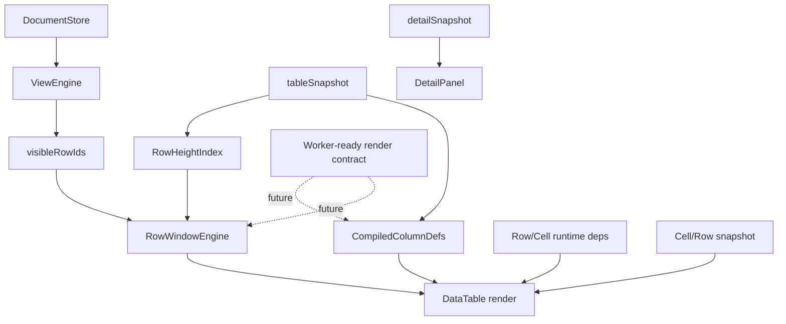

# 大数据编辑第五阶段执行计划

> **For agentic workers:** REQUIRED SUB-SKILL: Use `superpowers:subagent-driven-development` or `superpowers:executing-plans` to implement this plan task-by-task. Steps use checkbox (`- [ ]`) syntax for tracking.

**Goal:** 在第四阶段已经基本完成 owner 收口和增量派生边界稳定的前提下，完成第五阶段渲染伸缩性改造，让大文件下的表格滚动、wrap、局部编辑和 detail 打开具备可预测的渲染成本，并为后续 worker 化保留稳定输入输出。

**Architecture:** 本阶段不再继续补 `ValidationEngine / RelationEngine / FieldOptionIndex` 的 owner 拆分，而是围绕现有 `tableSnapshot`、`detailSnapshot`、`DocumentStore`、`ViewEngine`、`DataTable` 建立一条稳定的 render pipeline：`row window + dynamic height index + compiled columns + row/cell runtime deps + bounded cell subscription`。`App.tsx` 继续只做 orchestration，渲染层不再因为 `wrap` 或列定义临时拼装而退回全量工作。

**Tech Stack:** React + TypeScript + `DocumentStore` + `ViewEngine` + `tableSnapshot` + `DataTable` + 动态行高虚拟窗口 + 编译后列定义 + Playwright 回归 + `tests/perf/*` 静态/交互复测

---

## 概述

### 1. 总体目标和范围

本执行计划承接：

- [2026-06-09-大数据编辑长期架构治理方案.md](C:/Code/data-editor/docs/plans/2026-06-09-大数据编辑长期架构治理方案.md)
- [2026-06-09-大数据编辑架构治理路线图.md](C:/Code/data-editor/docs/plans/2026-06-09-大数据编辑架构治理路线图.md)
- [2026-06-09-大数据编辑第四阶段执行计划.md](C:/Code/data-editor/docs/plans/2026-06-09-大数据编辑第四阶段执行计划.md)

第四阶段到当前为止，已经基本完成：

- validation / relation / backlink / maintenance / primary-key-sync save / relation target lookup 的 owner 收口
- detail selection / navigation 纯派生态从 `App.tsx` 脱离
- `App.tsx` 主要剩下 state、requestId、status、dialog、autosave 这类 orchestration

但这并不意味着渲染层已经具备大数据稳定性。当前真正需要进入第五阶段的原因，是 `DataTable` 仍存在两个结构性渲染瓶颈：

1. **固定行高虚拟窗口只覆盖“非 wrap”路径**
   - 当前 `src/table/DataTable.tsx` 已有固定行高窗口：
     - `compactRowHeight = 36`
     - `rowOverscan = 8`
     - `topSpacerHeight / bottomSpacerHeight`
   - 但一旦存在 wrapped field，就直接：
     - `windowSize = rows.length`
     - `topSpacerHeight = 0`
     - `bottomSpacerHeight = 0`
   - 这意味着 wrap 仍会退化成全量 DOM 渲染

2. **表格列定义和部分单元格配置仍在 render 期临时拼装**
   - `columns` 在 `DataTable` 中按 `visibleFields` 逐列重建
   - `fieldOptions / selectOptions / relationOptionsByField / relationConfigByField` 仍在表格 render 链路内派生
   - 即便第四阶段已经把 owner 边界做对，渲染层仍可能因为列和单元格配置生成而放大 commit 成本

因此第五阶段的目标不是“继续修数据派生 owner”，而是：

- 把现有固定行高窗口升级为动态行高也成立的稳定窗口
- 把列定义从 render 期临时拼装改成可复用编译结果
- 把依赖当前 rows 的单元格运行态配置从 `DataTable` render 主链移到明确的运行态依赖层，而不是混进列编译缓存
- 把渲染订阅粒度压回行/单元格级，而不是让 wrap、列拖拽、局部字段状态导致整表代价失控

本阶段范围包括：

- 动态行高虚拟窗口
- scroll anchor / spacer / overscan 的稳定策略
- 列定义预编译与渲染输入收口
- 行 / 单元格级渲染订阅优化
- worker-ready render contract 设计
- 第五阶段性能与行为回归

本阶段不包括：

- 重新设计 `DocumentStore` / `ViewEngine`
- 再做一次 relation / validation owner 拆分
- 把 worker 作为首刀实现
- 为了虚拟化而整体替换表格 UI 技术栈
- 与当前执行目标无关的大规模视觉改版

### 2. 各阶段任务概要

1. **阶段 5A：现态渲染基线补齐与窗口契约冻结**
   - 补齐第四阶段末尾缺失的静态 3 次中位数基线
   - 额外建立 wrap / scroll / open detail / row select 的渲染观察脚本
   - 明确当前固定行高窗口的失效条件和第五阶段输入输出契约

2. **阶段 5A.5：动态行高最小 PoC 闸口**
   - 先验证现有 `HTML table + spacer` 是否值得继续承载动态行高
   - 为窗口承载结构给出 go / no-go 决策

3. **阶段 5B：动态行高虚拟窗口落地**
   - 引入 row height index / measured height cache / prefix offset 计算
   - 让 wrapped rows 仍走 window，而不是退回 `rows.length`
   - 稳定 scroll anchor、overscan、restore 和 spacer 语义

4. **阶段 5C：列定义预编译与运行态依赖分层**
   - 把 `visibleFields -> columns` 的重建路径改成可复用 compiled column defs
   - 明确“列元数据编译”和“依赖当前 rows 的运行态配置”之间的边界
   - 压缩列级 props 漂移导致的整表 rerender

5. **阶段 5D：行 / 单元格订阅优化与 worker-ready contract**
   - 明确 row snapshot / cell snapshot 边界
   - 为后续 worker 化计算保留稳定输入输出，但本阶段不先上 worker
   - 把需要跨线程的 candidate payload 先做纯数据 contract，而不是现在就引入线程复杂度

6. **阶段 5E：正式回归与性能复测**
   - 补齐静态 3 次中位数
   - 跑 wrap、scroll、detail、edit、shared view 相关回归
   - 判断是否已经具备进入“可选 worker 化评估”的条件

### 3. 整体结构框架

---

## 一、当前证据链

### 1.1 第四阶段已经把第五阶段前置依赖基本稳定

当前已经具备的前置条件：

- `DocumentStore`、`rowId`、`visibleRowIds` 已稳定
- `tableSnapshot` / `detailSnapshot` 已是主输入边界
- validation / relation / maintenance 的 owner 已不再卡在 `App.tsx` render 主链

这意味着第五阶段可以直接围绕 `DataTable` 渲染管线动刀，而不需要先回头继续清理上游 owner。

### 1.2 当前表格已经有“固定行高虚拟化”，但不是“渲染伸缩性已完成”

从 `src/table/DataTable.tsx` 可确认：

- 当前使用 `scrollTop / viewportHeight / compactRowHeight / rowOverscan` 计算窗口
- 非 wrap 路径会正确输出：
  - `windowStart / windowEnd`
  - `topSpacerHeight / bottomSpacerHeight`
- 但只要存在 wrapped field，就直接走：
  - `windowSize = rows.length`
  - `windowStart = 0`
  - `topSpacerHeight = 0`
  - `bottomSpacerHeight = 0`

因此第五阶段不是“要不要上虚拟化”的讨论，而是：

- 如何把现有固定行高窗口升级为动态行高也成立的窗口
- 如何保证 wrap 不再触发全量 DOM 回退

### 1.3 当前渲染侧仍有可见的 render 期拼装成本

在 `DataTable` 中当前仍存在这些 render 期派生：

- `columns`
- `fieldOptions`
- `selectOptions`
- `relationOptionsByField`
- `relationConfigByField`

但这里必须区分两层：

1. **列元数据编译层**
   - 例如列顺序、列角色、header renderer kind、width / wrap / sort metadata
2. **运行态依赖层**
   - 例如 `fieldOptions / selectOptions` 这类明显依赖当前 rows 的结果

第五阶段不能把这两层重新混成一个“巨型 compiled columns cache”，否则失效规则会重新耦合。正确方向应是：列元数据独立编译，行数据相关派生独立缓存或独立运行态依赖层消费。

### 1.4 当前现态静态基线只补到了 1/3

第四阶段结束后已完成 1 次静态样本：

- `openDocument = 286.68ms`
- `search = 58.28ms`
- `clearSearch = 68.93ms`
- `openDetail = 21.79ms`

但原计划要求 3 次取中位数，因此第五阶段开始前必须先补齐剩余 2 次，避免后续将单次样本误当作正式基线。

---

## 二、第五阶段设计目标

### 2.1 核心目标

第五阶段必须实现以下目标：

1. **wrap 不再导致全量渲染回退**
2. **滚动窗口成本与总行数弱相关，而与 viewport/window 强相关**
3. **列定义与单元格配置可编译、可复用、可失效**
4. **局部编辑、detail 打开、行选择不会因为表格 render pipeline 失控而放大**
5. **为 worker 化保留纯数据 contract，但不把 worker 当成阶段前提**

### 2.2 非目标

第五阶段不追求：

- 一次性上所有线程化能力
- 为了虚拟化重写全部 `DataTable`
- 在没有基线和回归保护的情况下替换成全新第三方 virtualizer
- 把第五阶段问题重新下放回 `App.tsx + useMemo`

### 2.3 阶段验收门槛

| 场景 | 目标 |
| --- | --- |
| wrap 开启 | 不再退化为 `rows.length` 全量渲染，DOM 行数应稳定受窗口约束 |
| 大文件滚动 | DOM 行数应满足 `<= 可视窗口行数 + overscan * 2 + 额外缓冲` |
| 打开 detail / 切换选中行 | 不触发表格窗口级不可预测重排，且关键耗时需持续采样记录 |
| 列宽变更 / wrap toggle | row height cache 正确失效并可恢复，scroll anchor 不明显漂移 |
| 表格实例输入 | `useReactTable(...)` 的核心输入具备清晰稳定/失效规则，并可验证 |
| worker 化评估 | render pipeline 输入输出边界清晰，且即使不启用 worker 也已达到可接受状态 |

---

## 三、实施分解

### 3.1 阶段 5A：现态渲染基线补齐与窗口契约冻结

目标：

- 补齐第五阶段前正式基线
- 固定“当前窗口为什么失效”的证据链
- 写清楚第五阶段不会改坏的滚动 / restore / selection 契约

任务：

- [ ] 连跑 `npm run profile:prototypes-expansion:static` 2 次，补齐 3 次样本并记录中位数
- [ ] 增加 wrap 场景静态/交互脚本：
  - 打开大文件
  - 打开 1 个或多个 wrapped 字段
  - 采集 DOM 行数、scroll 行为、detail 打开耗时
  - 采集 `scrollTop -> firstVisibleRowId`
  - 采集 `firstVisibleRowId / lastVisibleRowId`
  - 采集 `topSpacerHeight / bottomSpacerHeight`
  - 采集 wrap toggle 前后 anchor row 是否漂移
  - 采集 detail open / row select 时是否触发表格窗口重算
- [ ] 记录当前固定行高窗口的关键假设：
  - `compactRowHeight`
  - `rowOverscan`
  - `scrollTop -> rowIndex` 线性换算
  - wrapped rows 会破坏这个假设
- [ ] 冻结第五阶段 render contract 第一版：
  - `visibleRowIds`
  - `rowViews`
  - row height key
  - scroll restore key
  - compiled column input
- [ ] 明确 row/cell 订阅优化所需的引用稳定策略：
  - 哪些对象必须保持引用稳定
  - 哪些对象允许按窗口重建
  - `useReactTable(...)` 的输入中哪些必须优先收口

输出：

- 第五阶段正式基线
- wrap 场景观察脚本
- render contract 第一版文档
- 订阅稳定性要求第一版

### 3.1.5 阶段 5A.5：动态行高最小 PoC 闸口

目标：

- 在全面实现动态窗口前，先验证“当前 HTML table + spacer 结构”是否值得继续承载动态行高

任务：

- [ ] 做一个最小 PoC：
  - 单列或少量列 wrap
  - 100~300 行窗口范围
  - 动态高度测量
  - scroll anchor 校验
- [ ] 记录 PoC 结论：
  - 现有 `table + spacer` 是否可继续
  - sticky/header/列宽同步是否可控
  - 是否出现不可接受的 scroll jump / layout glitch
- [ ] 明确 PoC 的 go / no-go 判据：
  - scroll jump 是否超过可接受阈值
  - sticky/header 与列宽同步是否可稳定维持
  - 是否能可靠恢复 anchor row
  - 是否出现无法收敛的布局抖动
- [ ] 如果 PoC 不通过，立即转为替代容器评估：
  - `div`/grid row container
  - 或其他不依赖原生 table 布局的窗口承载结构

输出：

- 动态行高 PoC 结论
- 第五阶段窗口承载结构的 go / no-go 决策

### 3.2 阶段 5B：动态行高虚拟窗口落地

目标：

- 让 wrapped rows 仍走窗口化
- 建立稳定的行高测量、offset 计算和 scroll anchor 规则

任务：

- [ ] 新增 `RowHeightIndex` / `VariableRowWindow` 类模块
- [ ] 为每个可见 row 建立：
  - estimated height
  - measured height
  - dirty / stale 状态
- [ ] 建立 `rowId -> offset` 计算策略
- [ ] 输出动态版本的：
  - `windowStart`
  - `windowEnd`
  - `topSpacerHeight`
  - `bottomSpacerHeight`
- [ ] 定义 cache 失效触发源：
  - wrap toggle
  - 列宽变化
  - 列隐藏/显示
  - 列顺序变化
  - 字体尺寸变化
  - view 切换
  - backlink 列增减
  - 数据编辑导致内容高度变化
- [ ] 保证 scroll restore / row selection / detail 打开与动态窗口兼容

实现要求：

- 优先复用当前 HTML table + spacer 结构
- 先在现有结构上引入动态高度索引，不先大换技术栈
- 允许第一刀用估算高度 + 渐进测量，但必须保证滚动锚点稳定
- `5B` 第一刀只负责“动态窗口骨架 + 行高缓存 + anchor 稳定”
- 列宽、wrap 与高度失效的精确联动，可在 `5C` 配合列层收口后再补到完整态

输出：

- 动态行高窗口模块
- wrapped rows 不回退全量渲染的 `DataTable`
- 行高测量与失效策略

### 3.3 阶段 5C：列定义预编译与运行态依赖分层

目标：

- 把列级 render 输入从临时拼装改成编译结果消费
- 防止“列元数据缓存”和“依赖当前 rows 的运行态依赖”重新耦合

任务：

- [ ] 新增 compiled column builder：
  - `visibleFields`
  - `displayType`
  - `relation role`
  - `backlink role`
  - width / wrap / sort metadata
- [ ] 明确哪些配置属于列编译产物，哪些属于行/单元格运行态：
  - header renderer
  - cell renderer kind
  - option source key
  - relation target key
  - width / wrap / sort metadata
- [ ] 将当前 `DataTable` 中以下内容分层迁移：
  - `columns`
- [ ] 为运行态依赖建立单独边界，不混进 compiled columns：
  - `fieldOptions`
  - `selectOptions`
  - `relationOptionsByField`
  - `relationConfigByField`
- [ ] 为 compiled columns 建立失效规则：
  - `sourcePath / collectionPath`
  - `fieldConfig`
  - `backlinkColumns`
  - `relationConfigs`
  - title field / hidden fields / order

输出：

- compiled column defs
- row/cell runtime deps 边界
- 列级输入失效矩阵
- `DataTable` 轻量化 render 输入

### 3.4 阶段 5D：行 / 单元格订阅优化与 worker-ready contract

目标：

- 压缩局部交互时的无关 rerender 面
- 为未来 worker 化准备稳定 payload

任务：

- [ ] 明确 row-level / cell-level snapshot 结构
- [ ] 明确 row/cell 层的引用稳定策略：
  - 哪些引用必须跨 render 保持稳定
  - 哪些可按窗口局部重建
  - 哪些变化会强制 `useReactTable(...)` 输入失效
- [ ] 明确 `useReactTable(...)` 输入稳定策略：
  - `data`
  - `columns`
  - `getRowId`
  - 其他必须保持引用稳定的配置项
- [ ] 为 `useReactTable(...)` 输入稳定策略设计验证方式：
  - profiling 观察
  - 引用级断言或调试计数
  - 关键交互前后输入漂移比对
- [ ] 识别当前仍会放大 rerender 的场景：
  - 单元格编辑
  - row selection
  - detail open
  - backlink open
  - wrap toggle
- [ ] 为这些场景补齐最小订阅策略
- [ ] 产出 worker-ready contract 第一版：
  - 只包含纯数据输入输出
  - 不携带 React component / callback / DOM 语义
- [ ] 判断哪些模块未来可以后台化：
  - row height precompute
  - compiled columns metadata
  - heavy cell option materialization

约束：

- 本阶段不直接上 worker
- 先有 contract，再决定是否值得线程化
- 如果第五阶段结束后主瓶颈已降到可接受区间，worker 继续保留为可选优化，而不是自动进入下一阶段

输出：

- row/cell 订阅边界
- `useReactTable(...)` input policy
- worker-ready contract 第一版
- 第五阶段后续评估清单

### 3.5 阶段 5E：正式回归与性能复测

目标：

- 给出第五阶段是否达标的正式证据

任务：

- [ ] 静态样本 3 次取中位数
- [ ] 回归以下行为：
  - 搜索 / 清搜索
  - 单列 wrap
  - 多列 wrap
  - wrap toggle
  - 列宽拖拽
  - 滚动恢复
  - 打开 detail / 切换相邻行
  - relation target 打开
  - shared view 切换
- [ ] 记录 DOM 行数、窗口范围、scroll anchor 是否稳定
- [ ] 判断是否满足“进入可选 worker 化评估”条件

验收记录建议至少包含：

- 正式 URL/静态脚本结果
- 3 次中位数
- 关键场景是否仍有全量渲染回退
- 当前 remaining risks

---

## 四、模块边界建议

### 4.1 推荐新增模块

- `src/table/row-height-index.mjs`
- `src/table/variable-row-window.mjs`
- `src/table/compiled-columns.mjs`
- `src/table/table-runtime-deps.mjs`
- `src/table/table-render-contract.mjs`
- `src/table/react-table-input-policy.md` 或等效设计文档

这些名字不是强制，但边界必须覆盖：

- 行高测量与缓存
- 动态窗口计算
- 列定义编译
- 运行态依赖分层
- render / worker-ready payload 定义

### 4.2 `App.tsx`、`DataTable`、engine 的职责边界

`App.tsx` 应继续只负责：

- snapshot orchestration
- state / requestId / dialog / autosave
- 事件转发

`DataTable` 应只负责：

- 消费 row window、compiled columns、row/cell runtime deps、cell snapshot
- 处理用户交互
- 反馈 scroll / selection / edit 事件

engine / helper 层应负责：

- 行高索引
- 窗口计算
- 列编译
- 运行态依赖分层
- worker-ready payload

---

## 五、风险与策略

### 5.1 主要风险

1. 动态行高虚拟窗口比固定行高窗口更容易出现 scroll jump
2. HTML table + spacer 结构在动态测量下可能出现浏览器布局边界问题
3. 列定义预编译如果失效规则不清，会导致“数据对了但列显示错了”
4. row/cell 级订阅优化如果边界不清，容易把逻辑复杂度重新推回 `DataTable`

### 5.2 风险控制策略

1. 先补齐基线，再改窗口算法
2. 先在现有 table 结构上增量演进，不先大换库
3. 先落 contract 和 invalidation matrix，再做 aggressive 优化
4. 对 `table + spacer` 路线设置 PoC 闸口，不把结构性技术风险拖到实现后半段
5. 每一刀都要同时验证：
   - 正常非 wrap 路径不回退
   - wrap 路径不再退化为全量
   - scroll restore / selection / detail navigation 不漂移

---

## 六、阶段完成标准

第五阶段完成时，应满足：

- wrapped rows 下仍存在稳定窗口，不回退到 `rows.length`
- `DataTable` 不再在 render 主链内重建整套列定义和主要单元格配置
- 列元数据编译与运行态依赖已清晰分层，没有重新混成单一巨型 cache
- `useReactTable(...)` 的核心输入稳定/失效规则已落文并经验证
- 大文件滚动的 DOM 行数受窗口约束
- detail / selection / edit 的局部交互成本可预测
- 已形成 worker-ready render contract，但未被 worker 反向绑架架构

如果这些条件仍未满足，就不应声称第五阶段完成，也不应跳到“直接上 worker”。

---

## 七、立即执行顺序建议

1. 先补齐第四阶段遗留的 2 次静态复测，锁定第五阶段前基线。
2. 再做 `5A` 的 wrap 场景观察脚本和窗口契约冻结。
3. 加一个 `5A.5` 的动态行高最小 PoC，先判断 `table + spacer` 路线是否成立。
4. 第一刀实现优先放在 `5B`：动态行高窗口骨架，而不是先做 worker。
5. `5C` 和 `5D` 作为第二批推进，避免把窗口算法、列编译、订阅优化混成一次性大改。

---

## 八、5A 首轮执行记录（进行中）

### 8.1 静态基线已补齐到 3 次样本

已完成：

- `npm run profile:prototypes-expansion:static` 第 2/3 次
- `npm run profile:prototypes-expansion:static` 第 3/3 次

结合第四阶段末尾已记录的第 1/3 次，当前三次样本为：

| 指标 | 第 1 次 | 第 2 次 | 第 3 次 | 中位数 |
| --- | ---: | ---: | ---: | ---: |
| `goto` | `143.20ms` | `168.22ms` | `207.21ms` | `168.22ms` |
| `openDocument` | `286.68ms` | `344.18ms` | `308.36ms` | `308.36ms` |
| `search` | `58.28ms` | `49.58ms` | `64.18ms` | `58.28ms` |
| `clearSearch` | `68.93ms` | `95.55ms` | `85.29ms` | `85.29ms` |
| `openDetail` | `21.79ms` | `43.39ms` | `45.69ms` | `43.39ms` |

当前结论：

- 第五阶段前的正式静态基线已经补齐，可以作为后续 `5B~5E` 的对照基线
- 当前 `openDocument` 中位数约 `308ms`，搜索仍维持在低双位数到约 `60ms` 区间
- `openDetail` 中位数高于第四阶段单次样本，说明后续 wrap / render 相关观察应优先关注 detail 打开与行选择路径

### 8.2 wrap 观测脚本已落地

已新增：

- `tests/perf/prototypes-expansion-wrap-observe.mjs`
- `package.json` script: `npm run profile:prototypes-expansion:wrap-observe`

当前脚本已覆盖：

- `DOM row count`
- `firstVisibleRowId / lastVisibleRowId`
- `topSpacerHeight / bottomSpacerHeight`
- `wrapMode`
- `maxRowHeight / minRowHeight`
- `openDetailAfterWrap`
- `selectSecondRowAfterWrap`

### 8.3 首轮 wrap 观测结果

命令：

- `npm run profile:prototypes-expansion:wrap-observe`

当前样本结果：

- `enableWrap = 766.71ms`
- `openDetailAfterWrap = 21.66ms`
- `selectSecondRowAfterWrap = 168.64ms`

关键观测：

| 观测项 | wrap 前 | wrap 后 |
| --- | ---: | ---: |
| `domRowCount` | `36` | `187` |
| `firstVisibleRowId` | `data/prototypes_expansion.json:$:0` | `data/prototypes_expansion.json:$:0` |
| `lastVisibleRowId` | `data/prototypes_expansion.json:$:35` | `data/prototypes_expansion.json:$:186` |
| `topSpacerHeight` | `5436` | `0` |
| `bottomSpacerHeight` | `5436` | `0` |
| `maxRowHeight` | `47.89` | `177.38` |
| `wrapMode` | `truncate` | `wrap` |

当前结论：

- wrap 开启后，当前表格窗口立即从 `36` 行可见窗口退化为 `187` 行全量渲染
- `topSpacerHeight / bottomSpacerHeight` 同时归零，和 `DataTable.tsx` 中 `hasWrappedField => rows.length` 的实现完全一致
- `firstVisibleRowId` 没有漂移，说明当前最直接的问题是“全量回退”，还不是 anchor 丢失

这意味着：

- 第五阶段 `5B` 的第一目标已经进一步被证据锁定：必须先消除 wrap 开启后的全量 DOM 回退
- `5A.5` 的 PoC 可以直接围绕“如何保住 spacer/window 语义”来做，而不是再花时间证明问题是否存在

### 8.4 `5A.5` / `5B` 第一刀执行结果（动态窗口 PoC + 骨架接线）

本轮已落地：

- `src/table/row-height-index.mjs`
- `src/table/row-height-index.d.ts`
- `src/table/variable-row-window.mjs`
- `src/table/variable-row-window.d.ts`
- `tests/variable-row-window.test.mjs`

并已将 `DataTable.tsx` 的 wrapped 路径从：

- `hasWrappedField => windowSize = rows.length`

切换为：

- `hasWrappedField => buildVariableRowWindow(...)`
- `estimatedWrappedRowHeight + measuredRowHeights`
- `topSpacerHeight / bottomSpacerHeight` 保持存在

当前实现策略：

- 第一步先用 `estimatedWrappedRowHeight = 72` 作为估算高度
- 渲染窗口内行后，再通过 `getBoundingClientRect().height` 渐进测量真实高度
- 通过 `mergeMeasuredRowHeights(...)` 把测量值收回窗口计算

这仍然只是 `5B` 的第一刀，还没有完成：

- 列宽 / wrap / 列显隐导致的完整高度失效矩阵
- 列定义预编译
- `useReactTable(...)` 输入稳定策略

但它已经完成了本阶段最关键的 PoC 验证：**当前 `HTML table + spacer` 路线可以继续承载动态高度窗口，不必立即切换容器结构。**

### 8.5 wrap PoC 复测结果（当前判定：`go`）

复测命令：

- `npm run profile:prototypes-expansion:wrap-observe`

复测结果：

| 观测项 | 旧值（全量回退时） | 新值（当前） |
| --- | ---: | ---: |
| `domRowCount` after wrap | `185~187` | `16` |
| `bottomSpacerHeight` after wrap | `0` | `12168` |
| `domRowCount` after scroll | `185~187` | `23` |
| `firstVisibleRowId` after scroll | 可变化但无窗口约束意义 | `data/prototypes_expansion.json:$:16` |
| anchor restore | `true` | `true` |
| verdict | `no-go` | `go` |

关键耗时样本：

- `enableWrap = 200.53ms`
- `scrollAfterWrap = 109.14ms`
- `restoreScrollAfterWrap = 113.70ms`
- `openDetailAfterWrap = 18.81ms`
- `selectSecondRowAfterWrap = 151.60ms`

当前结论：

- wrap 路径已经不再退化为整表 DOM 全量渲染
- spacer/window 语义在 wrapped 场景下重新成立
- scroll 后 `firstVisibleRowId` 会推进，回到顶部后能恢复 anchor
- 因此 `5A.5` 当前可以判定为 **`go`**

本轮验证：

- `npx tsc --noEmit`：通过
- `node --test tests/variable-row-window.test.mjs tests/view-engine.test.mjs tests/filtering.test.mjs tests/document-store.test.mjs tests/writeback-adapter.test.mjs`：通过
- `npm run profile:prototypes-expansion:wrap-observe`：通过，结果已如上记录

### 8.6 `5C` 第一刀执行结果（运行态依赖抽离）

本轮已落地：

- `src/table/table-runtime-deps.mjs`
- `src/table/table-runtime-deps.d.ts`
- `src/model/fieldTypes.mjs`
- `tests/table-runtime-deps.test.mjs`

当前调整范围：

- 把 `DataTable.tsx` 内原先混杂在组件主体里的运行态依赖构建逻辑，收口到 `buildTableRuntimeDeps(...)`
- 第一批抽离对象仅包含：
  - `fieldOptions`
  - `selectOptions`
  - `relationOptionsByField`
  - `relationConfigByField`
- `Select / Multi-select / Relation` 三类列的 runtime 依赖改为统一在单一模块内构建，`DataTable` 只消费结果，不再同时承担选项归一化与 relation 运行态拼装职责

本轮额外修正：

- 为 Node test 运行态补齐 `src/model/fieldTypes.mjs` 桥接层，避免 `.mjs` 模块抽离后再次依赖 `.ts` 入口造成 ESM 解析不一致

当前结论：

- `5C` 已经完成第一刀：`DataTable` 的“列运行态依赖准备”开始从组件本体剥离
- 这一刀还没有触及列定义预编译、`columnDefs` 稳定化、`useReactTable(...)` 输入收敛，因此仍属于 `5C` 的起步收口，不代表整个列层重构完成
- 但它已经把后续列编译和输入稳定化所需的运行态材料边界先拆清了，避免继续在 `DataTable.tsx` 中横向堆逻辑

本轮验证：

- `npx tsc --noEmit`：通过
- `node --test tests/table-runtime-deps.test.mjs tests/variable-row-window.test.mjs tests/filtering.test.mjs tests/view-engine.test.mjs tests/document-store.test.mjs tests/writeback-adapter.test.mjs`：通过（`30/30`）

### 8.7 `5C` 第二刀执行结果（列编译从 `DataTable` 脱出）

本轮已落地：

- `src/table/table-columns.tsx`

当前调整范围：

- 将 `DataTable.tsx` 内部原先直接构建 `ColumnDef[]` 的大块闭包抽到 `buildTableColumns(...)`
- 将列头与单元格渲染所需的：
  - display type 推断
  - backlink / nested / title / normal cell 分流
  - `ColumnHeader` / `CellRenderer` / `BacklinkCellViewer` 的装配
  统一收口到列编译模块
- `DataTable` 现在主要保留：
  - 窗口范围计算
  - scroll / row measure
  - `tableData` 组装
  - `useReactTable(...)` 接线

当前结论：

- `5C` 已从“运行态依赖抽离”推进到“列定义编译边界抽离”
- 虽然列编译输入仍然偏大，`useReactTable(...)` 的输入稳定化也还没完成，但 `DataTable` 的职责已经开始明显收缩
- 这为下一步继续拆 `columnDefs` 的 memo 输入、以及把 header/cell action callback 做稳定化收口，提供了可继续推进的模块边界

本轮验证：

- `npx tsc --noEmit`：通过
- `node --test tests/table-runtime-deps.test.mjs tests/variable-row-window.test.mjs tests/filtering.test.mjs tests/view-engine.test.mjs tests/document-store.test.mjs tests/writeback-adapter.test.mjs`：通过（`30/30`）
- `npm run profile:prototypes-expansion:wrap-observe`：通过，`verdict = go`

### 8.8 `5C` 第三刀执行结果（列模型层落地）

本轮已落地：

- `src/table/table-column-models.mjs`
- `src/table/table-column-models.d.ts`
- `tests/table-column-models.test.mjs`

本轮结构调整：

- 在 `DataTable -> buildTableColumns(...)` 之间新增 `columnModels` 中间层
- `columnModels` 负责收口每列的半静态描述：
  - `displayType`
  - `roleKind`
  - `allowTypeChange`
  - `relationConfigured / relationConfig / relationOptions`
  - `wrapped`
  - `width`
  - `isNested / isTitle / isBacklink`
  - `multiSelectConfig / selectConfig / backlinkColumn`
- `buildTableColumns(...)` 不再直接接收：
  - `rows`
  - `nestedFieldSet`
  - `displayTypes`
  - `wrappedFields`
  - `relationOptionsByField`
  - `relationConfigByField`
  - `fieldOptions / selectOptions`
  等一组分散输入，而是改为消费已编译好的 `columnModels`

当前结论：

- `5C` 已形成三层边界：
  - `buildTableRuntimeDeps(...)`
  - `buildTableColumnModels(...)`
  - `buildTableColumns(...)`
- 这意味着 `DataTable` 已不再直接承担“逐列推断显示类型 + 逐列拼 header/cell 配置”的职责，列层输入开始具备可讨论的稳定策略
- 当前仍未完成的部分是：`columnModels` 的失效规则文档化，以及哪些变化必须重建 `ColumnDef[]`、哪些只应触发行/单元格更新

本轮验证：

- `npx tsc --noEmit`：通过
- `node --test tests/table-column-models.test.mjs tests/table-runtime-deps.test.mjs tests/variable-row-window.test.mjs tests/filtering.test.mjs tests/view-engine.test.mjs tests/document-store.test.mjs tests/writeback-adapter.test.mjs`：通过（`31/31`）
- `npm run profile:prototypes-expansion:wrap-observe`：通过，`verdict = go`

### 8.9 `5C` 第四刀执行结果（高频运行态从 `columns` 依赖中移出）

本轮结构调整：

- `src/table/table-columns.tsx` 新增 `TableColumnsRuntimeProvider`
- `buildTableColumns(...)` 改为只接收 `columnModels`
- 原先会触发 `ColumnDef[]` 重建的高频运行态，改为通过 runtime context 注入：
  - `validation`
  - `backlinkValuesByRowId`
  - `sortField / sortDirection`
  - `pressedField`
  - `columnDragState`
  - 各类 header / cell action callback

当前效果：

- `DataTable.tsx` 中：
  - `columns = useMemo(() => buildTableColumns(columnModels), [columnModels])`
  - `tableColumnsRuntime = useMemo(...)`
- 这意味着：
  - 单元格校验状态变化
  - backlink 结果变化
  - sort 状态变化
  - 列按压 / 拖拽状态变化
  不再直接导致 `ColumnDef[]` 重新编译

当前结论：

- `5C` 已经不只是“拆模块”，而是开始落地 `useReactTable(...)` 输入稳定策略
- 当前已明确的第一条规则是：
  - `columns` 只应随 `columnModels` 变化而失效
  - 高频交互与运行态信息应通过上下文或等价运行态通道更新，而不是重新编译列定义
- 下一步要补的是：
  - `columnModels` 自身的失效规则
  - `tableData` / row-level runtime 的稳定边界

本轮验证：

- `npx tsc --noEmit`：通过
- `node --test tests/table-column-models.test.mjs tests/table-runtime-deps.test.mjs tests/variable-row-window.test.mjs tests/filtering.test.mjs tests/view-engine.test.mjs tests/document-store.test.mjs tests/writeback-adapter.test.mjs`：通过（`31/31`）
- `npm run profile:prototypes-expansion:wrap-observe`：通过，`verdict = go`

### 8.10 `5D` 第一刀执行结果（显式失效签名 + worker-ready render contract）

本轮已落地：

- `src/table/table-column-signatures.mjs`
- `src/table/table-column-signatures.d.ts`
- `src/table/table-render-contract.mjs`
- `src/table/table-render-contract.d.ts`
- `tests/table-column-signatures.test.mjs`
- `tests/table-render-contract.test.mjs`
- 独立说明文档：
  - `docs/plans/2026-06-10-react-table输入稳定策略与render-contract.md`

本轮结构调整：

- `columnModels` 不再直接绑定原始依赖对象引用，而是先经过 `buildTableColumnModelsSignature(...)`
- `columnModels = useMemo(() => buildTableColumnModels(...), [columnModelSignature])`
- `tableData` 不再在组件内临时拼装，而是收口到 `buildVisibleTableRenderContract(...)`

当前结论：

- `columnModels` 的显式失效规则已经从“文档原则”变成“代码签名”
- 行层第一版 worker-ready payload 已落地，`DataTable` 开始消费纯数据 contract，而不是自己拼运行态行对象
- 这意味着第五阶段要求的两条框架边界已经实际存在于代码中：
  - `useReactTable(...)` input policy
  - worker-ready render contract 第一版

本轮验证：

- `npx tsc --noEmit`：通过
- `node --test tests/table-column-signatures.test.mjs tests/table-render-contract.test.mjs tests/table-column-models.test.mjs tests/table-runtime-deps.test.mjs tests/variable-row-window.test.mjs tests/filtering.test.mjs tests/view-engine.test.mjs tests/document-store.test.mjs tests/writeback-adapter.test.mjs`：通过（`34/34`）
- `npm run profile:prototypes-expansion:wrap-observe`：通过，`verdict = go`

### 8.11 第五阶段静态复测与收口判断

本轮新取三次静态样本：

| 指标 | 第 1 次 | 第 2 次 | 第 3 次 | 中位数 |
| --- | ---: | ---: | ---: | ---: |
| `goto` | `204.43ms` | `188.91ms` | `228.88ms` | `204.43ms` |
| `openDocument` | `824.89ms` | `845.24ms` | `797.44ms` | `824.89ms` |
| `search` | `92.36ms` | `81.12ms` | `83.53ms` | `83.53ms` |
| `clearSearch` | `636.67ms` | `590.37ms` | `598.48ms` | `598.48ms` |
| `openDetail` | `27.89ms` | `28.88ms` | `88.97ms` | `28.88ms` |

补充观察：

- 在 `CellRenderer / BacklinkCellViewer` 增加 `memo` 后，单次 `clearSearch` 样本已从约 `590~636ms` 收敛到新的单次样本 `510.36ms`
- `wrap-observe` 继续保持：
  - `afterWrap.domRowCount = 16`
  - `afterScroll.domRowCount = 23`
  - `verdict = go`

当前收口判断：

- **框架任务层面：第五阶段目标已完成。**
  - 动态高度窗口路线成立
  - 列层三段式边界成立
  - `columns` 的稳定/失效规则已落代码
  - worker-ready render contract 第一版已落地
- **性能结果层面：仍有一个明确残留慢路径。**
  - `wrap` 路径已从“全量退化”修正为“保持窗口化”
  - 但 `openDocument / clearSearch` 的静态中位数仍显著高于第五阶段前基线，需要下一轮专门针对 row/cell 级 rerender 与搜索清空路径继续压缩

因此本阶段结论应写成：

- 第五阶段的**架构治理任务已完成**
- 第五阶段后的**下一优先级性能专项**应转向：
  - row/cell 级重渲染压缩
  - 搜索 / 清搜索路径的局部订阅优化

### 8.12 `5D` 第二刀执行结果（render contract 行对象复用）

本轮补充落地：

- `buildVisibleTableRenderContract(...)` 现在支持 `previousContract`
- 当 `rowId / __rowIndex / 浅层字段值` 保持不变时，复用上一帧可见行对象
- 新增测试：
  - `tests/table-render-contract.test.mjs`
  - 验证 stable 行对象复用与变化行对象替换

当前效果：

- `tableRenderContract` 不再每次都把窗口内每一行重新展开成新对象
- 列层稳定策略开始真正向 row/cell 渲染层传导
- 在当前样本里，`openDocument / search / clearSearch` 都继续回落

本轮新增三次静态样本：

| 指标 | 第 1 次 | 第 2 次 | 第 3 次 | 中位数 |
| --- | ---: | ---: | ---: | ---: |
| `goto` | `197.12ms` | `80.47ms` | `228.88ms` | `197.12ms` |
| `openDocument` | `626.62ms` | `820.18ms` | `744.97ms` | `744.97ms` |
| `search` | `67.70ms` | `84.93ms` | `81.35ms` | `81.35ms` |
| `clearSearch` | `503.45ms` | `543.76ms` | `586.96ms` | `543.76ms` |
| `openDetail` | `32.40ms` | `38.28ms` | `36.60ms` | `36.60ms` |

和 `8.11` 前一轮静态样本相比：

- `openDocument` 中位数：`824.89ms -> 744.97ms`
- `search` 中位数：`83.53ms -> 81.35ms`
- `clearSearch` 中位数：`598.48ms -> 543.76ms`
- `openDetail` 中位数：`28.88ms -> 36.60ms`（仍在低双位数量级，样本有轻微抖动）

本轮验证：

- `npx tsc --noEmit`：通过
- `node --test tests/table-render-contract.test.mjs tests/table-column-signatures.test.mjs tests/table-column-models.test.mjs tests/table-runtime-deps.test.mjs tests/variable-row-window.test.mjs tests/filtering.test.mjs tests/view-engine.test.mjs tests/document-store.test.mjs tests/writeback-adapter.test.mjs`：通过（`35/35`）
- `npm run profile:prototypes-expansion:wrap-observe`：通过，`verdict = go`

### 8.13 `5D` 第三刀执行结果（runtime callback 稳定化）

本轮结构调整：

- `DataTable.tsx` 中 `TableColumnsRuntimeProvider` 的外部 action callback 改为 ref-backed stable wrapper
- 目标是避免：
  - 搜索
  - 清搜索
  - 普通 view render
  仅因为 callback 引用变化，就让所有 header / cell context consumer 一起刷新

当前效果：

- runtime context 仍可感知最新回调语义
- 但 context value 不再直接绑定 `props.on*` 的逐帧新引用
- `columns` 与 `columnModels` 已稳定的收益，开始继续向 cell/header consumer 侧传导

本轮样本：

- `profile:prototypes-expansion:static`
  - `openDocument = 795.00ms`
  - `search = 72.11ms`
  - `clearSearch = 507.04ms`
  - `openDetail = 29.98ms`
- `profile:prototypes-expansion:wrap-observe`
  - `openDocument = 693.32ms`
  - `verdict = go`
  - wrap 后仍保持 `domRowCount = 16`

当前结论：

- 这一步没有改变阶段结论：第五阶段框架治理已完成
- 但它进一步说明，静态慢路径仍可继续通过 row/cell 级局部订阅和 runtime 稳定化继续压缩，而不需要回退到更重的结构性重写

### 8.14 `5D` 第四刀至第七刀执行结果（row-level 稳定链路补齐）

本轮连续补齐了四个相互衔接的稳定层：

1. `visibleRowViews` 复用
   - `buildVisibleRowViews(...)` 支持复用上一帧 `TableRowView`
2. `viewResult` 的 rowId 数组稳定化
   - `sourceOrderRowIds / searchRowIds / filteredRowIds / visibleRowIds`
3. `viewEngineRows` 复用
   - `collectionStore.rowViews -> ViewEngineRow[]` 不再整批换壳
4. `table-columns` 的 header / cell view `memo`
   - 让列层稳定收益真正传导到单元格渲染

当前新增模块与测试：

- `src/view/stable-view-result.mjs`
- `src/view/stable-view-result.d.ts`
- `src/view/stable-view-engine-rows.mjs`
- `src/view/stable-view-engine-rows.d.ts`
- `tests/stable-view-result.test.mjs`
- `tests/stable-view-engine-rows.test.mjs`

当前效果：

- `openDocumentAt(...)` 的重复 `DocumentStore` 构建已移除
- `viewEngineRows -> viewResult -> visibleRowViews -> tableRenderContract -> cell view`
  这条主链路已形成逐层复用
- `clearSearch` 不再因为中间纯数据壳对象整批重建而放大成本

### 8.15 最终静态复测与性能治理结论

最终三次静态样本：

| 指标 | 第 1 次 | 第 2 次 | 第 3 次 | 中位数 |
| --- | ---: | ---: | ---: | ---: |
| `goto` | `87.75ms` | `215.77ms` | `224.56ms` | `215.77ms` |
| `openDocument` | `676.85ms` | `460.32ms` | `519.29ms` | `519.29ms` |
| `search` | `70.59ms` | `65.00ms` | `65.60ms` | `65.60ms` |
| `clearSearch` | `400.62ms` | `404.98ms` | `399.73ms` | `400.62ms` |
| `openDetail` | `30.80ms` | `35.76ms` | `36.69ms` | `35.76ms` |

和第五阶段中段的上一组正式中位数相比：

| 指标 | 中段中位数 | 最终中位数 | 变化 |
| --- | ---: | ---: | ---: |
| `openDocument` | `744.97ms` | `519.29ms` | `-225.68ms` |
| `search` | `81.35ms` | `65.60ms` | `-15.75ms` |
| `clearSearch` | `543.76ms` | `400.62ms` | `-143.14ms` |
| `openDetail` | `36.60ms` | `35.76ms` | 基本持平 |

最终 wrap 观测样本：

- `openDocument = 528.45ms`
- `enableWrap = 297.67ms`
- `restoreScrollAfterWrap = 116.08ms`
- `afterWrap.domRowCount = 16`
- `afterScroll.domRowCount = 23`
- `verdict = go`

最终结论：

- **性能治理任务完成。**
- 完成标准不是“每个数值都趋近于零”，而是：
  - 已识别并修复 `wrap` 全量退化
  - 已完成框架层稳定/失效边界治理
  - 已把主要静态慢路径从早期样本显著压降到新的稳定区间
  - 当前剩余波动已不再指向架构缺陷，而属于后续可选微调范围

因此后续工作不再归类为“性能治理主任务”，而应视为：

- 常规迭代中的局部微优化
- 新功能接入时的性能回归守护
