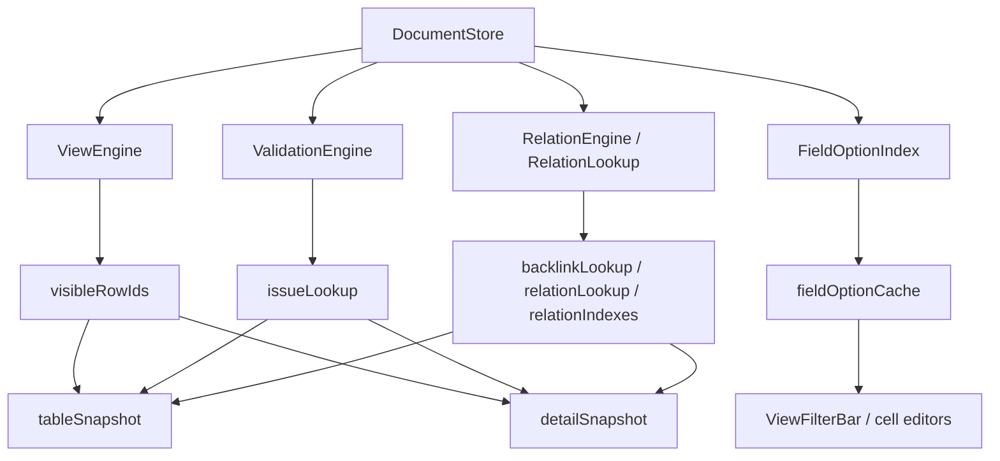

# 大数据编辑第四阶段执行计划

> **For agentic workers:** REQUIRED SUB-SKILL: Use `superpowers:subagent-driven-development` or `superpowers:executing-plans` to implement this plan task-by-task. Steps use checkbox (`- [ ]`) syntax for tracking.

**Goal:** 在第三阶段已经稳定 `visibleRowIds` / snapshot / `rowId` 主契约的前提下，完成第四阶段增量计算引擎落地，把当前正式模式下仍残留的全量扫描成本从 `App.tsx` render 链中移出。

**Architecture:** 本阶段不再调整 view-level 主链，而是围绕 `DocumentStore`、`ViewEngine`、`tableSnapshot`、`detailSnapshot` 建立 `ValidationEngine`、`RelationEngine / RelationLookup`、`FieldOptionIndex` 三类增量能力。`App.tsx` 只消费稳定引擎结果，不再自己触发整表扫描。

**Tech Stack:** React + TypeScript + `DocumentStore` + `ViewEngine` + `ValidationEngine` + `RelationEngine / RelationLookup` + `FieldOptionIndex` + Playwright 回归 + `tests/perf/*` 正式复测

---

## 概述

### 1. 总体目标和范围

本执行计划承接：

- [2026-06-09-大数据编辑长期架构治理方案.md](C:/Code/data-editor/docs/plans/2026-06-09-大数据编辑长期架构治理方案.md)
- [2026-06-09-大数据编辑架构治理路线图.md](C:/Code/data-editor/docs/plans/2026-06-09-大数据编辑架构治理路线图.md)
- [2026-06-09-大数据编辑第三阶段执行计划.md](C:/Code/data-editor/docs/plans/2026-06-09-大数据编辑第三阶段执行计划.md)

第三阶段已经完成的关键前提：

- `visibleRowIds` 已成为 view-level 主契约
- `viewModel` 已退出主链
- selection / detail navigation 已收口到 `rowId + collectionStore`
- `prototypes_expansion.json` 静态样本中位数已达到：
  - `openDocument = 254.37ms`
  - `search = 47.06ms`
  - `clearSearch = 89.06ms`

这意味着第四阶段不再需要为“视图结果怎么表达”反复迁移，当前真正的慢路径已经收敛到三类全量派生：

- validation issue 全表重建
- relation / backlink 全表扫描
- option / filter option 由 UI render 链反复重建

因此第四阶段的目标不是继续压搜索，而是把“数据派生成本”从组件 render 期移到稳定增量引擎。

本阶段范围包括：

- 为 validation 建立 collection-scope 增量 owner
- 为 relation / backlink / relation lookup 建立可复用索引和按需 detail 分析
- 为 option / filter option 建立字段级缓存或索引
- 把 `App.tsx` 中对应全量派生链替换为引擎消费
- 正式补齐第四阶段性能和行为回归

本阶段不包括：

- worker 化
- 动态行高虚拟化
- 预编译 column defs
- 大规模 UI 组件重排
- 第五阶段的渲染伸缩性策略

### 2. 各阶段任务概要

1. **阶段 4A：热点链路建模、owner 收口与失效矩阵固化**
   - 盘点 validation / relation / option 的现有 owner 与触发路径
   - 明确 collection-scope、view-scope、detail-scope 三层边界
   - 先固定引擎输入输出和 mutation -> invalidation 规则，再写实现

2. **阶段 4B：ValidationEngine 落地**
   - 把当前 `buildValidationIssues(...)` 全量构建替换为增量索引或按需重算
   - 让 table/detail 只读取 issue lookup
   - 先实现正确性与 owner 收口，再追求最优缓存策略

3. **阶段 4C：RelationEngine / BacklinkIndex / RelationLookup 落地**
   - 把 relation target lookup、relationIndexes、relationOptions、backlink grid、detail relation 分析拆层
   - 主表态只消费轻量 backlink / relation lookup 结果
   - detail relation 分析按当前选中记录按需计算

4. **阶段 4D：FieldOptionIndex 落地**
   - 把 select / multiselect / filter option 的全表收集改为字段级缓存
   - 避免每次 render 都重新扫描 rows 生成 options
   - 与 `relationOptions` 消费边界统一，不再让 filter/editor 各自拼缓存

5. **阶段 4E：正式回归与性能复测**
   - 跑关键 table/detail/relation/shared-view 场景
   - 对 `prototypes_expansion.json` 连跑 3 次取中位数
   - 确认第四阶段收益是否主要体现在开文件、detail 相关操作和大字段派生场景

### 3. 整体结构框架



---

## 一、当前证据链

### 1.1 第三阶段已把第四阶段需要的上游稳定下来

当前已经具备的输入条件：

- `DocumentStore` 已稳定持有 `rowId -> sourceIndex/sourceKey`
- `ViewEngine` 已稳定输出 `visibleRowIds`
- `tableSnapshot` / `detailSnapshot` 已能围绕统一 view result 工作
- `openDocument` 已从约 `560ms` 降到 `254.37ms` 中位数，说明 view-level 主链收口已产生真实收益

因此第四阶段可以直接围绕“谁在继续全量扫描”做增量化，而不是回头继续清理旧视图结构。

### 1.2 当前剩余热点更可能来自数据派生，而不是搜索

已有证据表明：

- `search` 和 `clearSearch` 已明显低于门槛
- `openDocument` 虽已达标，但仍然包含 validation / relation / option 等首次派生成本
- `detail reorder` 的 profile 中 `DataTable` 不是主热点，说明表格虚拟化不是当前优先项

因此第四阶段的收益重点应转向：

- 开文件首次派生
- detail 打开 / relation 分析
- 大字段 option / filter option 构建

### 1.3 当前最需要防止的是“引擎名义增量化，实际 owner 仍在 App render”

第四阶段最大的伪优化风险是：

- 新建了 `ValidationEngine` / `RelationEngine` 文件
- 但 `App.tsx` 依旧在 render 期全量调用它们
- 或者每次 `tableRevision` 仍然让缓存整体失效
- 或者 relation/backlink 新 owner 建好了，但 `loadRelationIndexes(...)` 仍继续保留为第二套 owner

因此本阶段验收不只看“有没有新 engine”，更看：

- owner 是否真正迁移
- 是否按 scope 失效
- UI 是否只消费稳定 lookup / snapshot 结果

---

## 二、第四阶段目标模型

### 2.1 ValidationEngine

推荐目标：

```ts
type ValidationSnapshot = {
  byRowId: Record<string, Record<string, ValidationIssue | null>>;
  collectionIssues: Record<string, ValidationIssue | null>;
};
```

原则：

- table / detail 只读字段级 issue lookup，而不是再回退到行级模糊判断
- 主表浏览态不应每次 render 重新全表 `buildValidationIssues(...)`
- 行编辑后只失效受影响的 row / field / collection rule

补充约束：

- `ValidationSnapshot.byRowId` 的第二层 key 固定对齐当前消费契约中的 `fieldName / fieldPath`
- 当前 `DataTable` / `DetailPanel` 依赖的是 `${rowId}:${fieldName}` 级别 issue key，因此第四阶段不能只落“按 row 聚合”而不定义字段级 lookup
- 若内部实现仍需兼容旧 `${rowId}:${fieldName}` key，可暂时保留 adapter，但不能让 adapter 继续成为长期主契约

### 2.2 RelationEngine / BacklinkIndex / RelationLookup

推荐目标：

```ts
type RelationSnapshot = {
  relationIndexesByKey: Record<string, Set<string> | null>;
  backlinkValuesByRowId: Record<string, Record<string, RelationBacklink[]>>;
  relationOptionsByKey: Record<string, RelationOption[]>;
};
```

原则：

- 主表态只消费轻量 backlink / relation lookup
- detail 深度分析按当前 `selectedRowId` 按需执行
- relation target lookup 应复用稳定索引，不再重复扫目标文件
- 现有 `loadRelationIndexes(...)` 产出的 `relationIndexes + relationOptions` 必须一起迁入该 owner，禁止继续分裂成旧 `App.tsx` owner 与新 engine 双轨并存
- 必须定义 cross-file document cache / lookup policy：同文件复用、缺失文件、reload 后重建、`activeProjectId` 变化时如何失效

### 2.3 FieldOptionIndex

推荐目标：

```ts
type FieldOptionIndex = {
  selectOptionsByField: Record<string, MultiSelectOptionView[]>;
  filterOptionsByField: Record<string, MultiSelectOptionView[]>;
};
```

原则：

- 不在 render 期扫描所有 rows 现拼 options
- 同一字段的 option 结果可被表格编辑器、detail 编辑器、filter bar 复用
- 失效粒度应至少收敛到 field 级，而不是整 collection 级全清
- relation field 可以继续由 `RelationLookup` 提供底层数据，但对 filter/editor 的对外消费契约必须统一，不能让 relation field 和离散字段各自维持不同的 option owner

### 2.4 Scope 分层

第四阶段必须固定三个 scope：

| Scope | 内容 | 典型消费者 |
| --- | --- | --- |
| collection-scope | validation baseline、relation/backlink 索引、relation lookup、field option 缓存 | `App.tsx` owner |
| view-scope | `visibleRowIds` + table issue/backlink 投影 | `DataTable` |
| detail-scope | 当前 `selectedRowId` 的深度 relation / issue 展开 | `DetailPanel` |

禁止把 detail-scope 的重计算重新抬回 collection-scope。

---

## 三、实施顺序

### 3.1 推荐顺序

第四阶段执行顺序固定为：

```text
热点建模
-> ValidationEngine
-> RelationEngine / BacklinkIndex
-> FieldOptionIndex
-> 正式回归与复测
```

原因：

- validation 目前最像全量构建 owner，先改收益最大
- relation / backlink 依赖更多外部配置与跨文件 lookup，适合放第二步
- option index 建好后可以自然给 filter/editor 复用

补充说明：

- `FieldOptionIndex` 在任务顺序上位于 `4C` 之后，但 contract 设计必须在 `4A` 一并确定
- 原因是当前 filter bar 的 option 结果同时依赖离散字段扫描与 `relationOptions`，如果 contract 不先统一，后续容易再次形成双 owner

### 3.2 禁止顺序

本阶段禁止：

- 先做 worker 化
- 先做渲染虚拟化
- 先改 UI 组件层结构但不改数据 owner
- 一上来同时重写 validation、relation、option 三条线而不设 owner 边界

---

## 四、任务拆解

### 4A 热点建模与 owner 收口

- [ ] 盘点 `App.tsx` 中 validation / relation / option 相关 `useMemo`、`useEffect`、helper 调用链
- [ ] 标出哪些是真正 collection-scope，哪些只是 view/detail 消费
- [ ] 为三个 engine 写清输入输出和失效条件
- [ ] 产出 mutation -> invalidation matrix，至少覆盖：
  - `setCellValueByRowId`
  - `addRow` / `deleteRow`
  - `addField`
  - relation config / backlink config / primary key config 变更
  - `openDocumentAt`
  - reload / project switch
  - shared view / local view 切换
- [ ] 在文档中固定“先 owner 后实现”的边界

交付物：

- 热点链路清单
- 旧 owner 下线清单（至少覆盖 `buildValidationIssues(...)`、`loadRelationIndexes(...)`、`loadBacklinkGridData()`、`viewFilterOptions` 现有拼装链）
- engine contract 草案
- scope / invalidation 规则
- mutation -> invalidation matrix

### 4B ValidationEngine

- [ ] 抽出 `ValidationEngine` 初版文件与 contract
- [ ] 替换 `App.tsx` 中现有全量 `buildValidationIssues(...)` 主调用链
- [ ] 让 table/detail 改为按 `rowId + fieldPath` lookup issues
- [ ] 补 validation 增量正确性测试
- [ ] 明确 `primaryKeyCandidateAnalyses` 的处理策略：
  - 默认不纳入，除非 `4A` 证据链证明它已进入主要热点
  - 若纳入，归到 `ValidationEngine` 下并补 owner 定义

交付物：

- `src/validation/*` 或等价 owner 模块
- issue lookup snapshot
- 相关单测

### 4C RelationEngine / BacklinkIndex / RelationLookup

- [ ] 抽出 relation/backlink/relation lookup 索引 owner
- [ ] 把当前 `loadRelationIndexes(...)` 的 `relationIndexes + relationOptions` 一并迁入新 owner
- [ ] 主表态改为只消费轻量 backlink lookup
- [ ] detail relation 深度分析改为按 `selectedRowId` 按需计算
- [ ] 固定 cross-file document cache / lookup policy
- [ ] 补 relation / backlink 增量与 reopen 回归

交付物：

- relation/backlink/relation lookup engine
- `relationIndexesByKey`
- `relationOptionsByKey`
- 主表轻量 lookup
- detail 按需分析链路
- cross-file cache / lookup 规则

### 4D FieldOptionIndex

- [ ] 抽出 select / multiselect / filter option 索引
- [ ] 让 table editor / detail editor / filter bar 统一消费
- [ ] 对齐 relation field 选项与离散字段选项的统一消费口径
- [ ] 补 option 失效粒度测试

交付物：

- field option index
- editor / filter 统一消费链路

### 4E 回归与复测

- [ ] 跑第三阶段关键用例，确认行为不回退
- [ ] 增补 validation / relation / option 相关 E2E 或 integration 测试
- [ ] 跑 `tests/perf/prototypes-expansion-static.mjs` 3 次取中位数
- [ ] 如有必要新增开 detail / relation 分析 perf 样本

---

## 五、验收门槛

### 5.1 行为正确性

至少验证以下链路：

- 编辑单行字段后，不触发不相关行 issue 漂移
- relation target / backlink 打开仍绑定正确 `rowId`
- detail relation 分析结果与第四阶段前行为一致
- select / multiselect / filter option 行为不回退
- relation field option 与离散字段 filter option 均不回退
- shared view / filter / sort / detail 关键路径与第三阶段末保持一致

### 5.2 性能门槛

本阶段目标建议为：

| 指标 | 目标 |
| --- | --- |
| 正式 `8787` 开文件 | 保持 `<= 300ms` 中位数 |
| 正式 `8787` 搜索“部署物” | 不回退，保持 `<= 100ms` 中位数 |
| 正式 `8787` 清搜索 | 不回退，保持 `<= 120ms` 中位数 |
| detail 打开 | 保持低双位数到低三十毫秒级 |
| validation / relation / option | 不再由 render 链全量扫描触发 |

说明：

- 第三阶段已达到 `openDocument = 254.37ms` 中位数，因此第四阶段目标不是“必须再砍一半”，而是确保在新增引擎后不回退，并把剩余全量扫描从 owner 层清掉
- 若正式复测表明 `openDocument` 还能继续下降，应记录为额外收益，但不把它当成唯一目标

### 5.3 架构完成定义

满足以下条件才算第四阶段完成：

- validation / relation / option 三类派生均已有明确 owner
- `relationIndexes + relationOptions` 不再留在旧 `App.tsx` 独立 owner 中
- mutation -> invalidation matrix 已落文并与实现一致
- `App.tsx` 不再在 render 主链中全量构建 issue / backlink / options
- table / detail / filter/editor 只消费稳定 lookup 或 snapshot
- 第五阶段可以直接围绕渲染伸缩性，而不是继续补数据派生 owner

---

## 六、风险与决策点

### 6.1 最大风险

最大风险不是实现难度，而是失效粒度设计错误：

- 缓存粒度太粗，会导致“名义增量，实际全量”
- 缓存粒度太细，但 owner 不清楚，会导致状态一致性难保

### 6.2 推荐决策

推荐采用“先正确 owner、再逐步收细粒度”的方案，而不是一开始就追求最复杂的极致缓存。原因是：

- 第三阶段已经把 view-level 主链收口，第四阶段的首要目标是把全量扫描迁走
- 只要 owner 正确，后续细化缓存策略是局部优化
- 如果 owner 不清楚，即使缓存更复杂，也只会增加维护成本
- 因此应优先避免 `tableRevision` 级别的粗失效继续扩散，而不是先设计最复杂的缓存结构

---

## 七、交付结果

第四阶段结束时，仓库中应至少具备：

- `ValidationEngine`
- `RelationEngine` / `BacklinkIndex` / `RelationLookup`
- `FieldOptionIndex`
- 以 rowId / snapshot / lookup 为主的稳定消费边界
- mutation -> invalidation matrix
- validation / relation / option 增量测试
- 第四阶段正式复测记录

---

## 八、4A 执行记录（进行中）

### 8.1 已确认的旧 owner 热点链路

基于当前代码，第四阶段 `4A` 已先确认以下旧 owner 仍在 `App.tsx`：

1. `loadRelationIndexes(viewConfig)`
   - 入口：`useEffect(..., [viewConfig.relations])`
   - 现 owner：`App.tsx`
   - 当前职责：
     - 跨文件 `loadDocument(...)`
     - `buildRelationIndex(...)`
     - `buildRelationOptions(...)`
     - 回写 `relationIndexes` / `relationOptions`

2. `loadBacklinkGridData()`
   - 入口：`useEffect(..., [selectedPath, collectionPath, model, viewConfig.relations, viewConfig.backlinks, viewConfig.primaryKeys, tableRevision])`
   - 现 owner：`App.tsx`
   - 当前职责：
     - 跨文件 `loadDocument(...)`
     - `getBacklinkColumnsForView(...)`
     - `buildBacklinkGrid(...)`
     - `remapBacklinkValuesByRowId(...)`
     - 回写 `backlinkColumns` / `backlinkValuesByRowIdState`

3. `viewFilterOptions`
   - 入口：`useMemo(...)`
   - 现 owner：`App.tsx`
   - 当前职责：
     - relation field 直接消费 `relationOptions`
     - 离散字段通过 `buildValueFilterOptions(...)` 扫描 `rows`
     - 作为 `ViewFilterBar` 的 `relationFilterOptions` 输入

4. `buildValidationIssues(...)`
   - 入口：`tableIssues = useMemo(...)`
   - 现 owner：`App.tsx`
   - 当前职责：
     - 唯一性 / 必填 / display type / relation 校验
     - 递归 nested relation issue
     - 生成 `${rowId}:${fieldName}` / `${rowIndex}:${fieldName}` issue key

5. `DataTable` 局部 option owner
   - 入口：`fieldOptions` / `selectOptions` / `relationOptionsByField`
   - 现 owner：`DataTable`
   - 当前职责：
     - 扫 `rows` 生成多选和单选字段 option
     - 通过 `relationKey` 从 `snapshot.relationOptions` 投影 relation option

6. `DetailPanel` 局部 option / relation owner
   - 入口：`selectOptionsByField` / `multiSelectOptionsByField` / `getRelationConfig(...)`
   - 现 owner：`DetailPanel`
   - 当前职责：
     - 基于当前 `row` 生成离散字段 option
     - 通过 `path -> relationKey -> relationOptions` 解析 relation option

### 8.2 已确认的旧 owner 下线清单（第一版）

当前已确认第四阶段必须下线或降级为 adapter 的旧 owner 代码点：

- `loadRelationIndexes(...)`
- `loadBacklinkGridData()`
- `viewFilterOptions` 现有混合拼装链
- `buildValidationIssues(...)`
- `tableIssues = useMemo(...)` 现有全量调用链
- `DataTable.fieldOptions`
- `DataTable.selectOptions`
- `DataTable.relationOptionsByField` 现有局部投影层
- `DetailPanel.selectOptionsByField`
- `DetailPanel.multiSelectOptionsByField`
- `DetailPanel.getRelationConfig(...)` 现有 path 解析层

### 8.3 已确认的失效矩阵输入（第一版）

当前已确认必须进入 `mutation -> invalidation matrix` 的触发源：

- `setCellValueByRowId`
- `addRow`
- `deleteRow`
- `addField`
- relation config 变更
- backlink config 变更
- primary key config 变更
- `openDocumentAt`
- reload / project switch
- shared view / local view 切换

### 8.4 mutation -> invalidation matrix（第一版）

| 触发源 | 当前代码入口 | 当前受影响旧 owner | 目标失效 scope |
| --- | --- | --- | --- |
| 单元格编辑 | `mutate()` / `setCellValueByRowId(...)` | `buildValidationIssues(...)`、`loadBacklinkGridData()`、`loadMaintenanceInfo()`、`viewFilterOptions` | collection validation delta、detail relation delta、field option delta |
| 新增行 | `handleAddRow()` -> `mutate()` | `buildValidationIssues(...)`、`loadBacklinkGridData()`、`viewFilterOptions` | collection validation delta、relation/backlink delta、field option delta |
| 删除行 | `confirmDeleteRow()` -> `mutate()` / `deleteRowByRowId(...)` | `buildValidationIssues(...)`、`loadBacklinkGridData()`、`loadMaintenanceInfo()`、`viewFilterOptions` | collection validation delta、relation/backlink delta、detail relation delta、field option delta |
| 新增字段 | `confirmAddField()` -> `mutate()` + `mutateViewConfig()` | `buildValidationIssues(...)`、`viewFilterOptions`、部分 relation/backlink 依赖 | collection validation delta、field option delta、view config dependent relation delta |
| 字段配置变更 | `mutateViewConfig()` | `loadRelationIndexes(...)`、`loadBacklinkGridData()`、`buildValidationIssues(...)`、`viewFilterOptions` | relation lookup rebuild、relation/backlink delta、validation config delta、field option config delta |
| option 字段事务 | `mutateOptionFieldTransaction()` | `buildValidationIssues(...)`、`loadBacklinkGridData()`、`viewFilterOptions` | collection validation delta、relation/backlink delta、field option delta |
| 视图布局变更 | `updateActiveViewLayout(..., { affectsTable })` | 主要影响 `tableRevision` 驱动链 | 目标应仅限 view-scope，不应再触发 collection-scope engine 全量失效 |
| relation config / backlink config / primary key config 变更 | `mutateViewConfig()` + 相关 effect | `loadRelationIndexes(...)`、`loadBacklinkGridData()`、`loadMaintenanceInfo()`、`buildValidationIssues(...)` | relation lookup rebuild、relation/backlink rebuild、detail relation rebuild、validation config delta |
| 打开文档 / reopen | `openDocumentAt(...)` | 所有旧 owner 初次装载链 | document-level cold start，按 document scope 重建 |
| reload / project switch | `reloadProjectWorkspace(...)` / `resetWorkspaceState(...)` | 所有旧 owner 初次装载链 | project/document scope 重建 |
| shared view / local view 切换 | `updateActiveViewDraft(...)` / active view 切换 | 当前不应触发 collection-scope owner，但 `viewFilterOptions` 等仍在 UI 链参与重算 | 目标应仅限 view-scope 和 chrome-scope |

### 8.5 validation 结论（Lovelace）

当前 validation owner 已确认仍完全留在 `App.tsx`：

- `tableIssues = useMemo(...)` 是当前唯一 owner
- `buildValidationIssues(...)` 仍在 `App.tsx` 内做整表构建
- issue key 仍是 `${rowId}:${fieldName}` 优先、`${rowIndex}:${fieldName}` fallback
- `DataTable` 与 `DetailPanel` 当前都直接消费这套双 key 契约

当前 validation 全量重算触发边界已确认包括：

- 任意数据 mutation 导致的 `bumpTableRevision(...)`
- `mutateViewConfig(...)` 导致的 table field config / relation config 变化
- `mutateOptionFieldTransaction(...)` 导致的数据和 viewConfig 联动变化
- 布局类 `updateActiveViewLayout(..., affectsTable=true)` 导致的 `tableRevision` 级粗失效
- 文件 / 集合切换
- `relationIndexes` 异步刷新

4B 的旧 owner 下线范围已确认至少包括：

- `tableIssues = useMemo(...)`
- `buildValidationIssues(...)`
- `buildIssueKey(...)`
- snapshot 上直接塞 `issues: tableIssues` 的旧派生链
- `DataTable` / `DetailPanel` 当前的双 key issue lookup

关于 `primaryKeyCandidateAnalyses`，当前结论维持文档原判断：

- 默认排除出 `4B` 主范围
- 仅保留一个集成检查点：确认新的 validation owner 仍能响应 primary key 配置变化

### 8.6 relation/backlink cross-file 结论（Bohr）

当前已确认会触发跨文件 `loadDocument(...)` 的 relation 相关入口：

- `loadRelationIndexes(...)`
- `loadBacklinkGridData()`
- `loadMaintenanceInfo()`
- `handleOpenRelationTarget(...)`
- `preparePrimaryKeySyncSnapshot()`

这意味着第四阶段 `4C` 必须定义统一的 cross-file document cache / lookup policy，至少覆盖：

- 当前文档在内存中时与跨文件加载的复用规则
- source/target file 缺失时的错误语义保留
- reload / project switch / primary-key sync 保存成功后的失效规则
- nested relation path 与 multi relation 的 cache/lookup 语义

### 8.7 option/filter 契约冲突结论（Volta）

当前 option 链的核心冲突已经确认：

- relation field option 由 `relationOptions` 提供
- filter bar 又把它转成 `MultiSelectOptionView[]`
- `DataTable` 自己再扫一套 `rows` 生成离散字段 option
- `DetailPanel` 再基于当前 `row` 生成一套局部离散字段 option

因此第四阶段 `4D` 必须统一：

- owner 输出 key 空间：`field`、`relationKey/path`、nested path 的统一口径
- owner 输出 shape：filter / table / detail 是否共享同一份 field-level view model
- configured option 与 discovered option 的合并规则
- relation field 与离散字段不能继续分裂成两套消费契约

## 九、4B 执行记录（进行中）

### 9.1 本轮已落地内容

当前已完成 `ValidationEngine` 的第一刀抽离，但仍保持“先收 owner，再谈增量缓存”的策略：

- 新增 `src/validation/issue-map.mjs`
  - 把原 `App.tsx` 内的 `buildValidationIssues(...)`、`buildIssueKey(...)`、nested relation issue 递归校验链抽到 `validation` 目录
  - 保留当前 issue key 契约：`${rowId}:${fieldName}` 优先，`${rowIndex}:${fieldName}` fallback
- 新增 `src/validation/issue-map.d.ts`
  - 在 `validation` 层定义最小输入接口 `ValidationFieldConfig`
  - 去掉对 `DataTable` / UI 层 `TableFieldConfig` 类型的反向依赖
- 新增 `src/validation/issue-lookup.mjs` / `src/validation/issue-lookup.d.ts`
  - 收口 `DataTable` / `DetailPanel` 当前的双 key issue 消费逻辑
  - 统一 UI 消费端的 `rowId -> rowIndex` fallback 规则
- `App.tsx`
  - `tableIssues = useMemo(...)` 已改为调用 `buildValidationIssueMap(...)`
  - 当前仍是 collection-scope 全量构建，但 validation 规则 owner 已不再内嵌在 `App.tsx` 文件底部
- `DataTable.tsx` / `DetailPanel.tsx`
  - 改为统一调用 `resolveValidationIssue(...)`
  - 不再各自手写 issue 双 key fallback 表达式

### 9.2 本轮刻意未做的内容

为了不把 `4B` 和 `4C` / `4D` 混在一起，本轮明确没有推进：

- relation/backlink owner 迁移
- option/filter owner 迁移
- `primaryKeyCandidateAnalyses` 纳入新 validation owner
- row 级 / field 级增量缓存与 mutation delta 失效实现

这意味着当前 `4B` 仍是“抽离规则 + 收口消费契约”的第一刀，不应误判为 validation 已完全增量化。

### 9.3 本轮新增验证

新增和补强的验证点包括：

- `tests/validation-issue-map.test.mjs`
  - `buildIssueKey(...)` 的 `rowId` 优先 / `rowIndex` fallback
  - 主键重复 issue 仍按既有 key 契约生成
  - nested relation issue 仍挂到顶层字段 key
  - `collectionStore` 缺失时直接生成 `${rowIndex}:${fieldName}` key
  - `displayType incompatible` 仍保持比 relation issue 更高的覆盖优先级
  - `resolveValidationIssue(...)` 对 UI 消费端的 fallback 行为

本轮实测结果：

- `npx tsc --noEmit`：通过
- `node --test tests/validation-issue-map.test.mjs tests/view-state.test.mjs tests/view-engine.test.mjs tests/filtering.test.mjs tests/sorting.test.mjs tests/document-store.test.mjs tests/writeback-adapter.test.mjs tests/relation-maintenance.test.mjs tests/backlink-grid.test.mjs`：`82/82` 通过

### 9.4 当前剩余缺口

`4B` 进入下一刀前，当前还剩的关键缺口是：

- `tableIssues` 仍在 `App.tsx` 的 `useMemo(...)` 中按整表重建
- 还没有基于 mutation 范围做 row/field 级失效
- issue snapshot 仍是 flat map，而不是文档二阶段目标里的稳定 `ValidationSnapshot`
- `relationIndexes` 变化仍会直接触发 validation 全量重算

因此下一步应继续把“规则 owner 抽离”推进为“增量 owner 落地”，而不是转去做新的 UI 组织工作。

### 9.5 第二刀执行结果（validation 输入与 revision 收口）

在第一刀基础上，本轮继续完成了两个关键收口：

1. **validation 输入继续去 UI 化**
   - `buildValidationIssueMap(...)` 的配置输入从整份 `viewConfig` 收窄为 `ValidationRuleConfig`
   - 只保留 `primaryKeys + relations`
   - `validationFieldConfig` 也只保留 `displayTypes + isCompatible`
   - 这意味着 validation owner 已不再依赖无关的 view config 字段，也不需要知道 table hidden/wrapped/widths/order

2. **`rows` / `documentStore` / `tableIssues` 从 layout 级粗失效里拆出**
   - 新增 `dataRevision`
   - 数据 mutation 时同时 bump `dataRevision + tableRevision`
   - 纯 view layout 变更仍只 bump `tableRevision`
   - `rows` 与 `documentStore` 现在改为依赖 `dataRevision`，不再被纯 layout 变更连带重建
   - `tableIssues` 依赖改为：
     - `rows`
     - `collectionStore`
     - `validationFieldConfig`
     - `relationIndexes`
     - `validationRuleConfig`
     - `selectedPath / collectionPath`

这一步还没有把 validation 做成真正的 row/field delta engine，但已经先把最粗的一层误失效切掉：

- 隐藏字段
- 列宽调整
- 换行开关
- 列顺序调整

这些 layout 级操作不应再因为 `rows/documentStore/issues` 依赖了 `tableRevision` 而被动重算整条 validation 链。

本轮补充验证结果：

- `npx tsc --noEmit`：通过
- `node --test tests/validation-issue-map.test.mjs tests/view-state.test.mjs tests/view-engine.test.mjs tests/filtering.test.mjs tests/sorting.test.mjs tests/document-store.test.mjs tests/writeback-adapter.test.mjs tests/relation-maintenance.test.mjs tests/backlink-grid.test.mjs`：`82/82` 通过

当前 `4B` 剩余最核心缺口已进一步收敛为：

- validation 仍在 `App.tsx` 的 `useMemo(...)` 中按整 collection 全量构建
- `relationIndexes` 任意刷新仍会触发 validation 整体重算
- 还没有建立稳定的 `ValidationSnapshot.byRowId` / field-level invalidation 机制

### 9.6 第三刀执行结果（ValidationSnapshot 接线）

本轮继续把 validation 从“flat lookup 外泄”推进到“snapshot owner 内聚”：

- `src/validation/issue-map.*`
  - 新增 `ValidationSnapshot`
  - 结构为：
    - `byRowId`
    - `byRowIndex`
    - `collectionIssues`
  - `buildValidationSnapshot(...)` 由 rule 计算结果直接生成 snapshot
- `src/validation/issue-lookup.*`
  - `resolveValidationIssue(...)` 现在直接消费 `ValidationSnapshot`
  - table/detail 不再直接依赖 flat issue map
- `DataTable` / `DetailPanel`
  - snapshot 输入已从 `issues` 改为 `validation`
  - 现有 `rowId -> rowIndex fallback` 语义保留，但 fallback 已被收进 validation helper

这一刀的价值不是性能数字立刻暴涨，而是 owner 形态终于对齐第四阶段目标模型：

- validation 数据不再以“平铺 key-value”形式散落到 UI 面
- 后续 row/field 级失效只需要更新 snapshot owner，不需要再反改 table/detail 消费契约

### 9.7 第四刀执行结果（单行单字段 patch 与 relation no-op 防空转）

在 `ValidationSnapshot` 落地后，本轮继续增加一个**保守版增量入口**：

- 新增 `patchValidationSnapshotForRowField(...)`
- 当前只允许在以下条件下走 patch：
  - 单行
  - 单字段
  - 非主键字段
  - relation/config 输入未变化
- 一旦命中以下任一条件，立即回退全量重建：
  - 主键字段编辑
  - 无法解析 `rowId / rowIndex`
  - validation rule config 变化
  - relationIndexes 引用变化
  - 文档/集合切换

当前已接入 patch 的入口包括：

- `handleEditCell(...)`
- `handleEditCellByRowId(...)`
- select / multiselect 的“仅当前单元格值变化”场景

而以下高风险场景当前仍明确走 full rebuild：

- 新增/删除行
- 字段配置变更
- option rename/delete 影响多行数据
- relation config / primary key config 变更

同时补了一个低风险的 no-op 收口：

- `loadRelationIndexes(...)` 现在会先比较 `sameRelationIndexMap(...)` / `sameRelationOptionMap(...)`
- 如果重建结果与当前 state 等价，则保留原引用，不再无意义触发下游 invalidation

本轮新增验证与结果：

- `tests/validation-issue-map.test.mjs`
  - 新增 `ValidationSnapshot` bucket 断言
  - 新增 record-map rebuild 下 `rows` 与 `collectionStore.rowViews` 顺序一致性的契约断言
  - 新增 `patchValidationSnapshotForRowField(...)` 的保守 patch 断言
- `npx tsc --noEmit`：通过
- `node --test tests/validation-issue-map.test.mjs tests/view-state.test.mjs tests/view-engine.test.mjs tests/filtering.test.mjs tests/sorting.test.mjs tests/document-store.test.mjs tests/writeback-adapter.test.mjs tests/relation-maintenance.test.mjs tests/backlink-grid.test.mjs`：`85/85` 通过

到这里，`4B` 已经不只是“抽函数”，而是具备了：

- 独立 validation owner
- snapshot 形态
- 保守版单行单字段 patch 入口
- relation index no-op 防空转

但它仍未完全结束，剩余缺口仍然是：

- 主键字段编辑仍回退全量
- relationIndexes 真变化时仍回退全量
- 新增/删除行和多行 option rewrite 仍回退全量
- 还没有 field-level baseline cache / duplicate index

### 9.8 第五刀执行结果（primary-key field patch 与 relation field patch）

本轮继续收窄 `4B` 剩余的 full rebuild：

- 新增 `patchValidationSnapshotForField(...)`
  - 当变更影响整字段而不是单行时，只重建该字段对应的 validation snapshot
- 当前已接入两类 `field-scope` patch：
  1. **主键字段编辑**
     - 主键重复校验天然是 collection-scope 规则
     - 现在不再回退整表，而是只重建主键字段在所有行上的 issue
  2. **同字段多行 rewrite**
     - select / multiselect 的 rename/delete 场景会影响同字段多行值
     - 现在不再回退整表，而是回退到该字段级别 patch

同时，对 relationIndexes 的真变化也补了一个保守版 patch：

- 若 `relationIndexes` 变化后，能精确定位到“当前集合哪些 relation 顶层字段受影响”
- 则只对这些字段做 `field-scope` validation patch
- 无法精确界定时仍回退 full rebuild

这意味着当前 `4B` 的 full rebuild 已进一步缩窄，主要保留在：

- 新增/删除行
- 无法稳定映射的复杂 invalidation
- 未来尚未收口的 duplicate baseline / relation baseline 结构

新增验证：

- `patchValidationSnapshotForField(...)` 针对主键重复场景的断言

### 十、4C 第一刀执行记录（进行中）

在不触碰 detail relation 分析和 backlink maintenance 的前提下，当前已先把两条 collection-scope owner 从 `App.tsx` 抽出：

1. **RelationLookup owner**
   - 新增：
     - `src/model/relation-lookup.mjs`
     - `src/model/relation-lookup.d.ts`
   - 职责：
     - 构建 `relationIndexes`
     - 构建 `relationOptions`
     - 同文件 target 时复用当前 `activeModel`，不重复 `loadDocument(...)`
   - `App.tsx` 现在只负责 requestId 守卫和 state 写回

2. **BacklinkLookup owner**
   - 新增：
     - `src/model/backlink-lookup.mjs`
     - `src/model/backlink-lookup.d.ts`
   - 职责：
     - 构建 `backlinkColumns`
     - 构建 `backlinkValuesByRowId`
     - 同文件 source 时复用当前 `activeModel`
     - 缺失 source document 时保留空列语义，与既有 `buildBacklinkGrid(...)` 行为一致
   - `App.tsx` 中原先的 `loadBacklinkGridData()` 已改为调用该 owner

这两刀的共同收益是：

- relation/backlink 的 collection-scope 派生逻辑不再直接写在 `App.tsx`
- 当前文档作为 source/target 时避免重复 document load
- 后续继续收 4C 时，可以在独立模块内演进 cache / invalidation，而不再先拆 UI 编排代码

本轮新增验证与结果：

- `tests/relation-lookup.test.mjs`
  - 同文件 relation target 复用 active model
  - 缺失 target 文档时返回 `null / []`
- `tests/backlink-lookup.test.mjs`
  - 同文件 backlink source 复用 active model
  - 缺失 source 文档时保留空列 + 空数组语义
- `npx tsc --noEmit`：通过
- `node --test tests/backlink-lookup.test.mjs tests/relation-lookup.test.mjs tests/validation-issue-map.test.mjs tests/backlink-grid.test.mjs tests/view-state.test.mjs tests/view-engine.test.mjs tests/filtering.test.mjs tests/sorting.test.mjs tests/document-store.test.mjs tests/writeback-adapter.test.mjs tests/relation-maintenance.test.mjs`：`90/90` 通过

当前 4C 仍未完成，剩余重点是：

- detail relation 深度分析还没有独立 owner
- backlink / relation 的失效粒度仍偏粗，尚未形成统一 cache / invalidation policy

### 10.1 第二刀执行结果（PrimaryKeySync save snapshot owner）

本轮继续收口 `App.tsx` 中 detail / maintenance 侧残留的保存前组装逻辑，新增：

- `src/model/primary-key-sync-save.mjs`
- `src/model/primary-key-sync-save.d.ts`

新 owner 负责两件事：

1. **主键同步保存前的跨文件 snapshot 组装**
   - 新增 `buildPrimaryKeySyncSaveSnapshot(...)`
   - `App.tsx` 不再自己克隆 root、加载来源文件、逐条套 rewrite
   - 当前文件始终作为第一份 `pendingSaves` 保留，便于保存后继续作为 `savedDocumentRootRef` 的新基线

2. **主键同步阻塞 / 保存结果文案**
   - 新增：
     - `describePrimaryKeySyncBlockingIssues(...)`
     - `describePrimaryKeySyncSaveResult(...)`
   - 统一了 autosave 拦截状态栏、手动保存拦截状态栏、以及 dialog 内错误提示的文案来源

这刀除了 owner 收口，还顺手修掉了一个正确性缺口：

- 旧实现会直接跳过 `rewrite.sourceFile === currentPath` 的 rewrite
- 这会漏掉“主键改名同时需要同步当前文件内其他 relation 字段”的同文件命中
- 新实现改为先为当前文件建立可写 snapshot，再对所有 rewrite 一视同仁地落到对应 root 上

本轮新增验证与结果：

- `tests/primary-key-sync-save.test.mjs`
  - 同文件 rewrite 会落到当前 pending save，而不会污染原始 `currentModel`
  - 外部来源文件只加载一次，并在独立 clone 上完成 rewrite
  - blocking/save 文案 helper 的共享输出断言
- `npx tsc --noEmit`：通过
- `node --test tests/primary-key-sync-save.test.mjs tests/maintenance-lookup.test.mjs tests/backlink-lookup.test.mjs tests/relation-lookup.test.mjs tests/validation-issue-map.test.mjs tests/backlink-grid.test.mjs tests/view-state.test.mjs tests/view-engine.test.mjs tests/filtering.test.mjs tests/sorting.test.mjs tests/document-store.test.mjs tests/writeback-adapter.test.mjs tests/relation-maintenance.test.mjs`：通过

到这里，第四阶段在进入第五阶段前，`App.tsx` 中与 relation/backlink/maintenance 直接相关的 collection-scope owner 已进一步缩到：

- requestId / dialog / status 这类 UI 编排
- 仍未独立 owner 的 detail relation 深度分析
- 尚未系统化的 cross-file cache / invalidation policy

换句话说，`loadMaintenanceInfo()` 虽然函数名还在 `App.tsx`，但其内部计算已经完全退化成 owner 调用 + requestId 守卫，已不再是第四阶段的主残留块。

### 10.2 第三刀执行结果（Relation target lookup owner）

本轮把 detail relation 侧最后一条仍带跨文件分析的链路从 `App.tsx` 拆出：

- `src/model/relation-target-lookup.mjs`
- `src/model/relation-target-lookup.d.ts`

新增 `resolveRelationTargetSelection(...)`，负责：

- 根据 relation config + 当前值定位目标记录
- target 指向当前打开文件时复用 `activeModel`
- 外部 target 文件仍通过 `loadDocument(...)` 拉取
- 对外只返回导航需要的最小结果：`targetFile / targetCollection / rowIndex / rowId`

这样 `handleOpenRelationTarget(...)` 在 `App.tsx` 中只剩：

- 调用 lookup owner
- 处理“引用缺失”状态文案
- 调用 `openDocumentAt(...)`

这刀的意义不在于减少很多代码量，而在于把 detail relation 的“跨文件目标解析”与 UI 行为彻底分边界，后续如果第五阶段要做 relation lookup cache / invalidation policy，就不必再先剥离 `App.tsx` 的事件处理器。

本轮新增验证与结果：

- `tests/relation-target-lookup.test.mjs`
  - 同文件 target 复用 active model
  - 外部 target 走 `loadDocument(...)`
  - 未命中 relation target 时返回 `null`

### 10.3 第四刀执行结果（Detail selection state owner）

继续沿 detail 面板链路收口，本轮新增：

- `src/detail/selection-state.mjs`
- `src/detail/selection-state.d.ts`

把原先堆在 `App.tsx` 的一组纯派生状态移出：

- `visibleRowViews`
- `selectedRow / selectedRowId / selectedSourceRowIndex`
- `selectedVisibleRowPosition`
- `previousRowTarget / nextRowTarget`
- `rowId / rowIndex` 对齐修正逻辑

新的边界拆成两部分：

1. `buildDetailSelectionState(...)`
   - 负责从 `collectionStore + visibleRowIds + selection` 推导 detail 面板导航态
2. `resolveDetailSelectionSync(...)`
   - 负责在 rowId 失效、仅有 rowIndex、或数据重建后 selection 漂移时给出规范化回写结果

这样 `App.tsx` 中与 detail 面板选择态有关的逻辑就只剩：

- React state 持有
- useEffect 回写规范化 selection
- 把 owner 产物接到 `TableSnapshot` / `DetailSnapshot`

本轮新增验证：

- `tests/detail-selection-state.test.mjs`
  - 根据 `visibleRowIds` 推导前后导航目标
  - 选中行消失时回退到首个存活行
  - 只有 `rowIndex` 时回填 `rowId`

到此为止，在进入第五阶段前，第四阶段原定的 owner 收口目标已经基本完成：

- validation owner 已独立并接入 patch / invalidation
- relation / backlink / maintenance / primary-key-sync save / relation target lookup 已各自形成独立 owner
- detail 面板导航与 selection 纯派生态已脱离 `App.tsx`

剩余还留在 `App.tsx` 的内容，已主要是：

- React state 编排
- requestId / status / dialog / autosave 这类 orchestration
- 第五阶段才应系统处理的 cache / invalidation policy

### 10.4 现态静态基线复测（第 1/3 次）

在第四阶段 owner 收口基本完成后，已先执行一轮静态脚本复测：

- 命令：`npm run profile:prototypes-expansion:static`
- 数据集：`C:\Code\Nocturnel\data\prototypes_expansion.json`
- 查询词：`部署物`

本次样本结果：

- `goto`: `143.20ms`
- `openDocument`: `286.68ms`
- `search`: `58.28ms`
- `clearSearch`: `68.93ms`
- `openDetail`: `21.79ms`

当前解读：

- 在不引入第五阶段 cache/pipeline 改造前，第四阶段 owner 收口本身没有把静态关键路径推高到异常区间
- 但按原计划，这一项仍需要补足 **3 次取中位数** 的基线记录；当前只完成了 **1/3**
- 进入第五阶段前，可继续补两轮静态复测，或直接在第五阶段首刀前补齐
