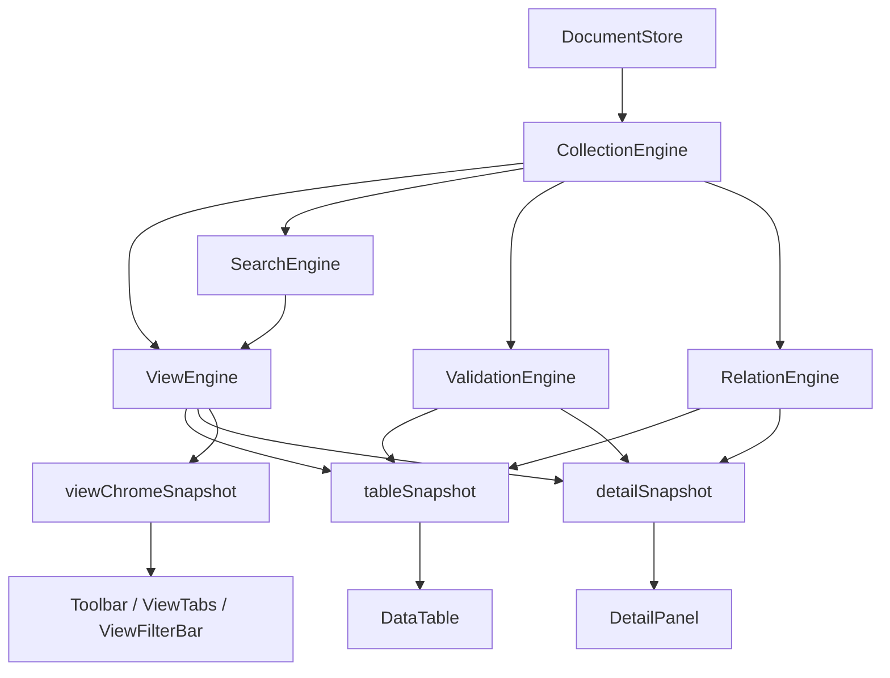

# 大数据编辑长期架构治理方案

## 概述

### 1. 总体目标和范围

本方案面向 `prototypes_expansion.json` 这类“数据量不算极端、但已足以触发明显卡顿”的真实业务文件，目标不是继续做局部补丁，而是从框架层面重建 data-editor 的前端数据与渲染边界，让交互成本只落在真正受影响的区域。

本轮真实 profiling 结论如下：

- 目标文件：`C:\Code\Nocturnel\data\prototypes_expansion.json`
- 文件规模：`170` 行、`17` 个字段、约 `221 KB`
- 正式静态服务 `8787` 采样：
  - 开文件约 `635ms`
  - 搜索“部署物”约 `265ms`
  - 清搜索约 `653ms`
  - 打开详情约 `233ms`
- 临时 `dev` profiling 采样：
  - `detail-reorder:total ≈ 1149ms`
  - `detail-reorder:react-main-content ≈ 1116.3ms`
  - `detail-reorder:react-detail-panel ≈ 3.4ms`
  - `detail-reorder:build-field-config ≈ 0.2ms`
  - `detail-reorder:build-issues ≈ 0.8ms`

这说明当前主热区不在 `DetailPanel` 自身，也不在本次采样下的校验计算，而在一次局部交互之后触发的 `main-content` 大范围 commit。

本方案范围包括：

- 前端状态边界与模块拆分
- 主表数据派生链路重构
- 视图引擎、校验引擎、关系引擎的长期落位
- 表格渲染层的输入契约与虚拟化演进

本方案不包含：

- 后端 API 协议重写
- JSON / CSV 文件格式调整
- 业务项目数据建模规则变更
- 一次性完成所有实现细节的执行清单

#### 当前 profiling 基线

后续所有阶段的验收都以这组基线为比较对象：

| 指标 | 当前基线 |
| --- | --- |
| 正式 `8787` 开文件 | `~635ms` |
| 正式 `8787` 搜索“部署物” | `~265ms` |
| 正式 `8787` 清搜索 | `~653ms` |
| 正式 `8787` 打开详情 | `~233ms` |
| `dev` detail reorder 总耗时 | `~1149ms` |
| `dev` detail reorder `react-main-content` | `~1116.3ms` |
| `dev` detail reorder `react-detail-panel` | `~3.4ms` |
| `dev` detail reorder `build-field-config` | `~0.2ms` |
| `dev` detail reorder `build-issues` | `~0.8ms` |

#### profiling 采样规程

为了避免单次采样受 Vite、React Profiler 和机器瞬时负载影响，后续每个阶段的性能验收必须遵守同一套采样规程：

- 正式静态服务指标和 `dev` React Profiler 指标分开记录，不混用。
- 同一脚本连续运行 `3` 次，取中位数作为阶段结论。
- 每轮采样都记录文件名、行数、字段数、服务模式、端口和 profiling 开关状态。
- 如果任一轮出现明显离群值，需要保留原始数据并说明是否重跑。
- 阶段结论必须同时报告：
  - 正式 `8787` 开文件
  - 正式 `8787` 搜索
  - 正式 `8787` 清搜索
  - `dev` detail reorder `react-main-content`
  - `dev` detail reorder `react-data-table`
  - `dev` detail reorder `total`

### 2. 各阶段任务概要

1. **渲染边界治理阶段**
   - 先定义 table、detail、selection、layout、view chrome、derived view 的状态所有权
   - 再切断 detail/profile/view layout 对 `main-content` 和 `DataTable` 的整片重渲染
   - 让局部交互只刷新局部 owner 和局部 snapshot
   - 以 React Profiler 作为阶段验收依据

2. **数据内核重构阶段**
   - 引入稳定 `rowId`
   - 用 `DocumentStore` 统一管理 collection、row lookup、schema snapshot
   - 让视图计算不再依赖 React render 期临时拼装

3. **视图派生引擎阶段**
   - 引入 `ViewEngine`
   - 搜索、筛选、排序只操作 row id 集，而不是重建整份 rows
   - 产出稳定的 `tableSnapshot` / `detailSnapshot`

4. **增量计算引擎阶段**
   - 校验、relation/backlink、字段选项、搜索索引从 UI 组件中下沉
   - 建立按字段、按 rowId、按 collection 的缓存和增量失效机制

5. **渲染伸缩性阶段**
   - 重构 `DataTable` 为纯消费层
   - 引入动态行高虚拟化能力
   - 为更大文件规模预留 worker / 后台计算扩展点

### 3. 整体结构框架



最终目标是把现在的：

```text
App.tsx 大状态树 -> useMemo 临时派生 -> DataTable/DetailPanel 同步重跑
```

改成：

```text
Store / Engine 增量派生 -> 稳定 snapshot -> RenderLayer 按需订阅
```

---

## 一、现状问题与证据链

### 1.1 当前最优先的问题不是“某个函数慢”，而是“渲染边界过宽”

这次 profiling 的决定性证据是：

- `detail-reorder:total ≈ 1149ms`
- `detail-reorder:react-main-content ≈ 1116.3ms`
- `detail-reorder:react-detail-panel ≈ 3.4ms`

从框架角度看，这说明当前最先需要修的不是：

- `DetailPanel` 内部算法
- `buildFieldConfig(...)`
- `buildValidationIssues(...)`

而是：

- detail 层状态为什么会扩散到主内容树
- `DataTable` 为什么在不该重渲染时仍然参与 commit
- `App.tsx` 为什么承载了过多跨区域状态

也就是说，症状本质上是“局部交互触发了错误粒度的 UI 更新”。

### 1.2 当前 `App.tsx` 同时承担了四类职责

从现有实现看，`App.tsx` 同时维护：

- 原始文档与 collection 数据
- 视图草稿、profile、layout、shared view 相关状态
- relation / backlink / validation 派生状态
- 选中行、detail 打开态、滚动恢复等 UI 状态

这些状态同处于一个大组件中，意味着：

- 任意一次状态替换都容易让主内容树整体重跑
- 即使某次变更理论上只影响 detail，也可能让 table 相关逻辑失效
- `useMemo` 只能减轻部分重算，无法从根本上修正边界错误

### 1.3 现有数据管线过度依赖 render 期现算

当前关键链路大致是：

```text
model
-> rows
-> fieldConfig / fieldViewConfigs / filterFieldTypes / filterOptions
-> viewRows
-> viewModel
-> issues
-> DataTable
```

这条链有几个结构性问题：

1. 视图派生和 UI 渲染没有清晰分层
2. 表格组件依然承担数据准备职责
3. row identity 不稳定，仍需依赖 `__rowIndex`
4. 搜索、筛选、排序的结果没有收敛成稳定 snapshot

这会让“局部交互”很容易失效整条数据链。

### 1.4 当前缺的不是新名词，而是状态所有权

仅仅把现有 props 改名成 `tableSnapshot` / `detailSnapshot` 还不够，因为当前真正的问题是 ownership 不清晰。结合现有代码，可以把状态大致分成 5 类：

| 状态 | 当前主要持有位置 | 当前下游消费者 | 长期目标 owner |
| --- | --- | --- | --- |
| 原始文档与集合数据 | `App.tsx` 中的 `model` / `rows` | `DataTable`、`DetailPanel`、validation、relation | `DocumentStore` |
| 视图派生结果 | `App.tsx` 中的 `viewRows` / `viewModel` | `Toolbar`、`DataTable`、`DetailPanel` | `ViewEngine` |
| 表格布局状态 | `App.tsx` 中的 `fieldConfig` | `DataTable`、部分 `Toolbar` | `TableLayoutOwner` / `tableSnapshot` |
| 详情布局状态 | `App.tsx` 中的 `fieldConfig.detailOrder` | `DetailPanel` | `DetailLayoutOwner` / `detailSnapshot` |
| view chrome 状态 | `App.tsx` 中的 `activeView`、`filterBarVisible`、`viewRows.length`、`viewFilterOptions` | `Toolbar`、`ViewTabs`、`ViewFilterBar`、banner | `ViewChromeOwner` / `viewChromeSnapshot` |
| selection / detail 打开态 | `App.tsx` 中的 `selectedRowIndex` / `detailOpen` | `DataTable`、`DetailPanel`、scroll restore | `SelectionOwner` |

现状中的关键问题不是“这些状态在 `App.tsx` 里”，而是：

- 它们的 owner 没有清楚区分
- detail-only 更新仍然经过共享的 `App.tsx` 状态树扩散
- `viewModel`、`selectedRow`、`fieldConfig`、`DetailPanel`、`DataTable` 之间仍存在错误粒度的耦合

因此第一阶段必须先收口 owner，再谈 snapshot。

### 1.5 当前性能瓶颈表现为两类

第一类是**渲染扩散型瓶颈**：

- detail 重排这类交互触发 `main-content` 大额 commit
- 主表和详情没有真正隔离

第二类是**全量派生型瓶颈**：

- 搜索 / 清搜索会对全量数据重走视图派生
- 选项收集、字段推断、校验和 relation 数据准备存在全量扫描

长期方案必须先解决第一类，再系统清理第二类；但这不等于第一阶段可以完全忽略第二类。尤其开文件和清搜索这两条真实体感路径，后续仍要保留量化跟踪，避免把它们无期限后置。

---

## 二、长期架构目标

### 2.1 核心原则

长期架构按以下原则设计：

1. **稳定 identity**
   - 所有行都用稳定 `rowId` 表达
   - 不再依赖临时 `__rowIndex`

2. **视图派生脱离 render**
   - 搜索、筛选、排序不在 React render 期现算
   - 统一由 store / engine 产出 snapshot

3. **局部更新只影响局部订阅者**
   - detail-only 交互不能让 table tree 失效
   - table-only 交互不能强迫 detail 重建

4. **重计算显式缓存与显式失效**
   - 字段选项、校验结果、relation index、search blob 都由引擎缓存
   - 通过 change set 决定失效范围

5. **RenderLayer 只负责显示**
   - `DataTable` / `DetailPanel` 不再自己准备全量数据
   - 只消费 `tableSnapshot` / `detailSnapshot`

### 2.2 长期目标状态

目标中的主链路应变成：

```text
DocumentStore.ingest
-> CollectionEngine.build
-> ViewEngine.resolve
-> ValidationEngine / RelationEngine enrich
-> RenderSnapshot output
-> DataTable / DetailPanel consume
```

在这个结构下：

- 搜索只更新 `visibleRowIds`
- 排序只重排 row id 序列
- detail 字段顺序调整只更新 detail snapshot
- 表格不再因为无关 layout 变更整体重绘

### 2.3 第一阶段的真正目标不是“引入 snapshot”，而是“定义 ownership”

第一阶段只要没有明确以下 ownership，就不应进入实现：

1. 谁拥有 table layout state
2. 谁拥有 detail layout state
3. 谁拥有 selection / detail open state
4. 谁拥有 derived view state
5. 谁拥有 view chrome state
6. 哪些状态允许驱动 `DataTable`，哪些状态禁止驱动 `DataTable`

因此第一阶段的顺序必须是：

```text
owner 划分
-> 订阅边界定义
-> snapshot 契约收口
-> 组件改造
```

不能直接从“抽 snapshot”开始，否则大概率只是换一个更好听的 props 包装层，无法保证真正切断主表重渲染。

---

## 三、目标模块结构

### 3.1 DocumentStore

职责：

- 管理原始文档 root
- 标准化 collection 结构
- 分配稳定 `rowId`
- 提供 `rowId -> row`、`rowId -> sourceIndex` lookup
- 记录事务变更集

建议结构：

```ts
type DocumentStore = {
  documentId: string;
  collections: Record<string, CollectionStore>;
  rootAdapter: RootAdapter;
  revision: number;
};

type CollectionStore = {
  collectionPath: string;
  rowIds: string[];
  rowsById: Map<string, DataRecord>;
  sourceIndexByRowId: Map<string, number>;
  schemaSnapshot: CollectionSchemaSnapshot;
};
```

引入它的目的不是抽象好看，而是把“当前 document root 长什么样”和“UI 需要怎么读行数据”彻底分开。

此外，`DocumentStore` 在 record-map 根模型下必须显式定义保序语义，不能继续隐式依赖 `Object.entries(root)` 的当前遍历结果。建议在这一层明确：

- 初始 ingest 时记录稳定的 source order
- `rowId` 与 source order 分离
- 后续排序、筛选、回到默认顺序时都以显式 source order 为准

### 3.2 CollectionEngine

职责：

- 维护 collection 级的静态与半静态派生数据
- 提供字段目录、字段类型提示、字段值统计、选项索引、search blob

建议缓存：

- `fieldCatalog`
- `fieldTypeHints`
- `fieldOptionIndex`
- `searchTextByRowId`
- `nestedFieldPaths`
- `rowShapeSummary`

它是 `ViewEngine`、`ValidationEngine`、`RelationEngine` 的上游基础层。

### 3.3 SearchEngine

职责：

- 维护每行预处理后的搜索文本
- 为离散字段提供可复用的候选 row id 集
- 为 `ViewEngine` 提供 query / filter 的候选集，不直接驱动 UI

归属：

- `SearchEngine` 是 `CollectionEngine` 的子模块或邻近模块，输入来自 collection 级 row / field cache。
- `ViewEngine` 只消费 `SearchEngine` 的候选结果，并负责把候选集与排序、可见字段、布局状态合成最终 snapshot。
- 第三阶段的搜索与清搜索指标，必须由 `ViewEngine + SearchEngine` 的组合结果负责。

### 3.4 ViewEngine

职责：

- 接收 query / filters / sorts / visible fields / layout state
- 输出视图级 snapshot

建议输出：

```ts
type TableSnapshot = {
  rowIds: string[];
  visibleFieldIds: string[];
  sortState: SortState;
  filterState: FilterState;
  rowWindowHint: RowWindowHint;
};

type DetailSnapshot = {
  rowId: string | null;
  fieldOrder: string[];
  visibleSections: DetailSection[];
};

type ViewChromeSnapshot = {
  totalRowCount: number;
  visibleRowCount: number;
  activeViewId: string | null;
  query: string;
  filterBarVisible: boolean;
  availableFilterFields: FieldSummary[];
};
```

关键要求：

- 排序只操作 `rowIds`
- 搜索与筛选只产生候选 id 集
- 不再创建临时 `viewModel`

### 3.5 ValidationEngine

职责：

- 管理 required / unique / type / relation 等问题集合
- 支持按字段、按 rowId、按 relationKey 的增量更新

建议分层：

- `structuralIssues`
- `constraintIssues`
- `relationIssues`

不要再让 UI 每次需要 issue 时自己重建整张问题表。

这里需要额外明确分层边界，否则后续实现仍会回到 render 期拼装：

- `collection-scope`：与当前视图无关、只与 collection 数据有关的 issue
- `view-scope`：与当前可见字段或当前排序 / 过滤展示相关的 issue 映射
- `detail-scope`：只在 detail 展示时需要的补充 issue

长期目标不是把所有 issue 都塞进一个 engine，而是先把 issue 的作用域区分清楚。

### 3.6 RelationEngine

职责：

- relation option 生成
- target lookup
- backlink index
- 按需的 detail relation 分析

原则：

- 主表浏览态只拿轻量 relation 数据
- detail 打开时再取该行的重 relation 信息
- 跨文件 relation 文档做 LRU 缓存

### 3.7 RenderLayer

RenderLayer 只负责把 snapshot 映射到组件 props。

`DataTable` 输入应收敛为：

- `rowIds`
- `fieldDefs`
- `rowAccessor`
- `cellMetaAccessor`
- `selectionState`

`DetailPanel` 输入应收敛为：

- `rowId`
- `detailFieldOrder`
- `detailFieldMeta`
- `detailIssueLookup`

这一步是长期性能治理里最关键的“接口收口”。

### 3.8 订阅矩阵

第一阶段实施计划必须先输出订阅矩阵。建议目标如下：

| UI 区域 | 允许订阅的 owner | 禁止直接订阅 |
| --- | --- | --- |
| `Toolbar` | `ViewChromeOwner`、`SelectionOwner` 的轻量计数与状态 | 原始 `model`、完整 `fieldConfig`、完整 `viewModel` |
| `ViewTabs` | `ViewChromeOwner` | `DocumentStoreOwner`、`TableLayoutOwner`、`DetailLayoutOwner` |
| `ViewFilterBar` | `ViewChromeOwner`、字段摘要 snapshot | 原始 `rows`、完整 `DataTable` props |
| `DataTable` | `tableSnapshot`、`SelectionOwner` 的表格选择状态 | `detailSnapshot`、`DetailLayoutOwner` |
| `DetailPanel` | `detailSnapshot`、`SelectionOwner` 的当前行状态 | `tableSnapshot`、表格布局完整状态 |
| dialogs / popovers | 与自身任务对应的局部 owner | `main-content` 的整棵派生对象 |

这个矩阵的目标是让 `main-content` 不再作为一个隐式共享订阅容器。即使 `main-content` 仍是 DOM 结构上的父级，也不能再成为所有状态变化的统一 React commit 热区。

---

## 四、阶段拆解与优先级

### 4.1 第一阶段：渲染边界治理

这是最高优先级阶段，原因来自真实 profiling。

目标：

- detail 交互不再触发 `main-content` 大额 commit
- `DataTable` 对 detail-only layout 变更保持稳定

主要动作：

1. 先定义状态所有权：
   - `DocumentStoreOwner`
   - `SelectionOwner`
   - `TableLayoutOwner`
   - `DetailLayoutOwner`
   - `ViewChromeOwner`
   - `DerivedViewOwner`
2. 列出每个 owner 的订阅者与禁止影响面
3. 输出 `Toolbar`、`ViewTabs`、`ViewFilterBar`、`DataTable`、`DetailPanel` 的订阅矩阵
4. 在 owner 划分稳定后，再抽出 `tableSnapshot`、`detailSnapshot` 和 `viewChromeSnapshot`
5. 让 `DataTable` 从大 props 改为只消费 `tableSnapshot`
6. 让 detail layout 更新只失效 `detailSnapshot`
7. 让 view chrome 只消费 `viewChromeSnapshot`
8. 清理 `App.tsx` 中会导致主树广播更新的状态路径

验收标准：

- 重新跑 detail reorder profiling
- `detail-reorder:react-main-content` 从 `~1116.3ms` 降到 `<= 250ms`
- `detail-reorder:total` 从 `~1149ms` 降到 `<= 320ms`
- `react-detail-panel` 允许维持当前量级，不作为主要优化对象
- `react-data-table` 不再在 detail-only 操作中成为主要耗时源；若仍出现，单次应控制在 `<= 80ms`
- 如果 `react-main-content` 仍高于阈值，需要同时报告 `DataTable`、`DetailPanel`、view chrome 三个子树的 profiler 结果，避免只看到父级总耗时

### 4.1A 第一阶段子阶段：ownership 收口

为了避免“先改一堆接口再看效果”，第一阶段拆为两个子阶段：

1. `1A ownership 收口`
   - 只定义 owner、状态边界、依赖方向
   - 允许保留现有组件接口
   - 输出状态图和订阅边界图

2. `1B snapshot 与组件订阅改造`
   - 让 `DataTable` / `DetailPanel` 改为消费新的 snapshot
   - 以 profiler 验证是否真的切断 commit 扩散

### 4.2 第二阶段：稳定 row identity 与数据内核

目标：

- 所有后续优化都建立在稳定 `rowId` 之上

主要动作：

1. 引入 `DocumentStore`
2. 统一 array / record-map 的行抽象
3. 逐步用 `rowId` 替换 `__rowIndex`

验收标准：

- 搜索、排序、选中行、打开 detail 均不依赖临时 row 复制

补充要求：在进入这一阶段前，必须先完成 `rowId` 迁移清单。至少覆盖：

1. filtering 阶段的 `attachRowIndexes`
2. `DataTable` 的 `tableData`、`getRowId`、row action、selection
3. `DetailPanel` 的自然字段顺序和 row 读取方式
4. scroll restore / page context 中与 `rowIndex` 相关的恢复语义
5. 搜索、排序、筛选后 selection 是否仍指向同一条记录
6. record-map 模型下的 source order 和 rowId 关系
7. 保存写回路径：`rowId -> sourceIndex/root location` 必须在排序、筛选、删除、插入后仍指向正确记录
8. `setCellValue`、`setNestedValue`、`deleteRow`、`addRow` 这类模型写操作必须有 rowId 适配层或明确保留 source index 调用边界

### 4.3 第三阶段：ViewEngine 收口

目标：

- 搜索、筛选、排序只更新视图结果，不重建文档视图模型

主要动作：

1. 让 `viewRows` 退化为 `visibleRowIds`
2. 去掉 `viewModel` 这一层临时 root 拼装
3. 把字段显示、表格窗口提示、排序状态收敛到 snapshot

验收标准：

- 正式 `8787` 搜索“部署物”从 `~265ms` 降到 `<= 180ms`
- 正式 `8787` 清搜索从 `~653ms` 降到 `<= 260ms`
- 正式 `8787` 开文件从 `~635ms` 降到 `<= 350ms`
- 全量恢复路径不再重走整条 UI 数据链

### 4.4 第四阶段：增量引擎化

目标：

- 把重计算集中到可缓存、可增量失效的 engine 中

主要动作：

1. ValidationEngine
2. SearchEngine
3. RelationEngine
4. FieldOptionIndex

验收标准：

- 字段选项、校验、relation 结果不再在组件 render 中全量扫描
- `buildValidationIssues` 不再阻塞主表交互路径
- relation / option 派生不再由 `DataTable` render 期触发全量扫描

### 4.5 第五阶段：渲染伸缩性

目标：

- 为更大数据规模做结构性预留

主要动作：

1. 支持动态行高的虚拟化
2. 列定义预编译
3. 行 / 单元格级订阅优化
4. 必要时引入 worker 化后台计算

验收标准：

- wrap 不再意味着潜在的全量渲染退化
- 大文件下滚动和局部交互可预测
- 为 worker 化保留清晰输入输出，但不把 worker 作为修复渲染边界的前提

---

## 五、关键设计决策

### 5.1 先修渲染边界，不先修搜索索引

理由：

- 当前最重的真实热点是 `react-main-content`
- 如果先做索引和增量校验，detail-only 交互仍会卡
- 用户最直观感知的是“局部操作却拖慢整页”

补充限定：

- 这条优先级只适用于“先落地哪一阶段”
- 不代表第一阶段可以完全忽略开文件 / 清搜索基线
- 因此第一阶段之后必须立刻复测正式静态服务的开文件与清搜索路径

### 5.2 先收口 owner 和 snapshot，再引入 worker

理由：

- worker 只能转移计算，不能修复错误的渲染边界
- 在状态边界混乱时上 worker，会放大调试成本
- owner 与 snapshot 先稳定，后续 worker 化才有明确输入输出

### 5.3 不继续依赖 `App.tsx + useMemo` 追加优化

理由：

- 当前症状已经说明这条路径到了结构上限
- 再堆 `useMemo` 只能局部减压，不能定义真正的模块职责
- 长期维护成本会越来越高

---

## 六、风险与迁移策略

### 6.1 主要风险

1. `rowId` 引入后，现有依赖 `rowIndex` 的逻辑需要全面梳理
2. `DataTable` 输入契约改变，短期回归面较大
3. relation / validation / profile layout 都与当前 `App.tsx` 强耦合，拆分过程中容易遗漏依赖
4. 如果 ownership 没定义清楚就直接做 snapshot，可能出现“接口变了，但 commit 面没缩小”
5. record-map 模型如果不先定义 source order，`rowId` 迁移后会出现默认顺序不稳定

### 6.2 风险控制策略

1. 按阶段迁移，不做一次性大爆破
2. 每阶段都要有 profiler 基线
3. 保持旧接口外观一段时间，用适配层平滑过渡
4. 先落 owner，再落 snapshot，再逐步替换内部实现
5. 每个阶段结束都要同时复测：
   - detail reorder
   - open file
   - search
   - clear search

---

## 七、验收指标

长期架构治理完成后，至少应满足以下指标：

1. detail 字段重排不再触发 `main-content` 级大额 commit
2. detail-only layout 更新不再让 `DataTable` 整体重渲染
3. 搜索与清搜索只更新 view snapshot，不重建整条数据准备链
4. `DataTable` 不再扫描全量 rows 构建 option/type/relation 数据
5. validation / relation / search 结果均来源于缓存与增量失效机制
6. 对同等规模的真实文件，交互耗时相较当前基线明显下降

建议阶段性量化门槛如下：

| 阶段 | 指标 | 目标 |
| --- | --- | --- |
| 第一阶段 | `detail-reorder:react-main-content` | `<= 250ms` |
| 第一阶段 | `detail-reorder:total` | `<= 320ms` |
| 第一阶段 | detail-only 操作中的 `react-data-table` | `<= 80ms`，最好不出现 |
| 第一阶段 | 正式 `8787` 开文件 | 不高于 `700ms`，禁止回退 |
| 第一阶段 | 正式 `8787` 清搜索 | 不高于 `700ms`，禁止回退 |
| 第三阶段 | 正式 `8787` 开文件 | `<= 350ms` |
| 第三阶段 | 正式 `8787` 搜索“部署物” | `<= 180ms` |
| 第三阶段 | 正式 `8787` 清搜索 | `<= 260ms` |

当前进度注记：

- 第一阶段已实做完成，detail-only 热区已从 `main-content` / `DataTable` 主链移出
- 最新静态复测结果：
  - 正式 `8787` 开文件：`218.89ms`
  - 正式 `8787` 搜索“部署物”：`50.5ms`
  - 正式 `8787` 清搜索：`72.29ms`
  - 正式 `8787` 打开 detail：`17.44ms`
- 因此后续架构重心不应继续停留在第一阶段微调，而应进入第二阶段的稳定 `rowId` 与写回边界治理

---

## 八、推荐下一步

推荐按以下顺序继续：

1. 先基于本方案写实施计划文档
2. 实施计划第一阶段先做 `ownership 收口`
3. 只在 ownership 稳定后进入 `snapshot` 与组件订阅改造
4. 跑同一组 profiling，确认 `react-main-content` 是否按阈值下降
5. 再进入 `DocumentStore` 和 `ViewEngine` 的正式重构

这份方案的核心判断是：

> 当前 data-editor 的长期性能问题，首要矛盾不是某段计算单独太慢，而是局部交互缺乏正确的状态边界和渲染边界；只有先把这两层边界做对，后续搜索索引、增量校验、relation 缓存和虚拟化升级才会稳定见效。
