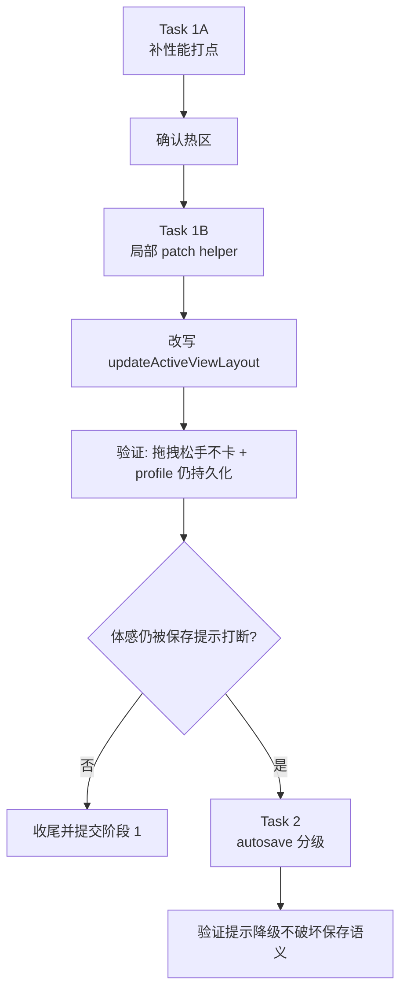

# 详情页字段拖拽重排卡顿执行方案

> **For agentic workers:** REQUIRED SUB-SKILL: Use superpowers:subagent-driven-development (recommended) or superpowers:executing-plans to implement this plan task-by-task. Steps use checkbox (`- [ ]`) syntax for tracking.

**Goal:** 消除详情页字段拖拽重排在松手瞬间的明显卡顿，并在此基础上决定是否继续治理 autosave 状态提示的打断感。

**Architecture:** 本次执行不直接跳到“大改状态架构”，而是先通过性能打点确认热区，再决定后续路线是继续做 `detailOrder` 的局部 profile patch，还是转向 React 渲染/提交尾部的性能治理。只有在主热区明确且修正后仍存在明显体感打断，才继续推进 autosave domain 分级。

**Tech Stack:** React 19 + TypeScript + Playwright + 本地 JSON/profile 持久化 + `save-coordinator`

---

## 概述

### 1. 总体目标和范围

本执行方案对应前置架构文档 [2026-06-09-详情页字段拖拽重排卡顿治理方案.md](C:/Code/data-editor/docs/plans/2026-06-09-详情页字段拖拽重排卡顿治理方案.md)，把其中的推荐路径拆成可执行的任务：

- 阶段 1A：补性能测量，确认热区
- 阶段 1B：把详情页字段重排改为局部 profile patch
- 阶段 2：仅在必要时继续做 autosave 分级

本方案范围只覆盖：

- `DetailPanel` 字段拖拽重排
- `App.tsx` 中 `handleReorderDetailFields / updateActiveViewLayout / mutateSelectedViewProfile`
- `UserViewProfile.viewLayouts` 相关局部 patch
- `Toolbar` autosave 状态呈现的后续分级判断

### 2. 各阶段任务概要

1. **阶段 1A：证据采样**
   - 给拖拽结束链路补 `performance.mark/measure`
   - 确认主要耗时是在 profile 全量 clone、`buildFieldConfig`、`buildValidationIssues`，还是别处
   - 保存测量步骤和结论，作为阶段 1B 的验收基线

2. **阶段 1B：热路径瘦身**
   - 引入局部 `view layout` patch helper
   - 改写 `updateActiveViewLayout`
   - 保留现有文件格式与 autosave 机制，验证只修松手卡顿

3. **阶段 2：交互反馈分级**
   - 仅在阶段 1B 后仍然明显“卡手”时执行
   - 拆分 `profile` dirty domain
   - 调整 `Toolbar` 对布局类 autosave 的提示强度

### 3. 整体结构框架



---

## 文件结构与职责

### 核心改动文件

- `src/App.tsx`
  - 当前详情页重排热路径的核心入口
  - 需要补测量、引入局部 patch 调用点、决定 autosave dirty domain

- `src/view-state-storage.mjs`
  - 已有 `viewLayouts` 读取/回退/复制工具
  - 适合新增或承接 `view layout` 局部 patch 帮助函数

- `src/components/Toolbar.tsx`
  - 当前“待保存 / 保存中...”的展示位置
  - 若阶段 2 启动，需要在这里做 autosave 分级呈现

- `tests/data-editor.spec.ts`
  - 已经覆盖详情页拖拽重排和 profile 持久化
  - 需要补强松手后顺序稳定、提示行为和后续分级场景

### 建议新增文件

- `tests/view-layout-patch.test.mjs`
  - 专门验证局部 patch helper 的对象引用边界
  - 避免把“非目标 view 引用保持不变”的验证塞进 e2e

- `src/profile-layout-patch.ts` 或 `src/profile-layout-patch.mjs`
  - 如果不想继续把 `App.tsx` 撑大，建议抽出单一职责 helper
  - 如果团队更偏向现有文件集中，也可直接放进 `src/view-state-storage.mjs`

### 文档文件

- `docs/plans/2026-06-09-详情页字段拖拽重排卡顿治理方案.md`
  - 已有架构方案

- `docs/plans/2026-06-09-详情页字段拖拽重排卡顿执行方案.md`
  - 当前执行清单

---

## Task 1A：性能测量与热区确认

**Files:**
- Modify: `src/App.tsx`
- Test: `tests/data-editor.spec.ts`
- Document: `docs/plans/2026-06-09-详情页字段拖拽重排卡顿执行方案.md`

- [x] **Step 1: 在热路径上补最小性能打点**

目标：只采集，不改逻辑。

建议打点位置：

```ts
performance.mark("detail-reorder:start");
performance.mark("detail-reorder:before-profile-update");
performance.mark("detail-reorder:after-profile-update");
performance.mark("detail-reorder:before-build-field-config");
performance.mark("detail-reorder:after-build-field-config");
performance.mark("detail-reorder:before-build-issues");
performance.mark("detail-reorder:after-build-issues");
performance.mark("detail-reorder:stable");
```

建议封装方式：

```ts
function markPerf(name: string) {
  if (typeof performance === "undefined" || typeof performance.mark !== "function") return;
  performance.mark(name);
}

function measurePerf(name: string, start: string, end: string) {
  if (typeof performance === "undefined" || typeof performance.measure !== "function") return;
  try {
    performance.measure(name, start, end);
  } catch {
    // ignore missing marks during dev-only profiling
  }
}
```

- [x] **Step 2: 给现有详情拖拽 e2e 增加测量数据读取入口**

不要在 CI 里对绝对毫秒做硬断言，只把数据采出来。

可以在测试里读取：

```ts
const measures = await page.evaluate(() =>
  performance.getEntriesByType("measure").map((entry) => ({
    name: entry.name,
    duration: Math.round(entry.duration * 100) / 100,
  })),
);
```

当前实现已经拆成一条独立的详情拖拽采样用例：

- `detail panel reorder emits profiling measures in profile mode`

只校验关键 measure 存在，不对绝对毫秒做 CI 断言，例如：

- `detail-reorder:profile-update`
- `detail-reorder:build-field-config`
- `detail-reorder:build-issues`

- [x] **Step 3: 本地运行一次 profile 模式详情拖拽并记录基线**

Run:

```powershell
$env:DATA_EDITOR_E2E_PORT='9787'
$env:DATA_EDITOR_E2E_BRIDGE_PORT='9791'
npx playwright test tests/data-editor.spec.ts -g "detail panel reorder"
```

当前已执行：

- `npx playwright test tests/data-editor.spec.ts -g "detail panel reorder emits profiling measures in profile mode"`
- 一次性 Playwright 探针脚本直连 `http://127.0.0.1:8787/` 打印 measure 明细

结果：测试通过，且能稳定读到完整 measure 集合。

- [x] **Step 4: 做出阶段 1B 的进入判断**

判断标准：

- 如果 `profile-update` 明显高于其他 measure，按局部 patch 路线继续
- 如果 `buildFieldConfig` 或 `buildValidationIssues` 更重，先转向那条热区，不急着做 patch

- [x] **Step 5: 提交阶段 1A 结论到文档注记**

把测量结论补回本文档或架构方案文档，至少记录：

- profile 模式是否确实是主要问题场景
- 最大耗时段落是哪一段
- 阶段 1B 是否继续执行

---

## Task 1B：局部 Profile Patch

**Files:**
- Modify: `src/App.tsx`
- Modify or Create: `src/view-state-storage.mjs` 或 `src/profile-layout-patch.ts`
- Test: `tests/view-layout-patch.test.mjs`
- Test: `tests/data-editor.spec.ts`

- [ ] **Step 1: 写失败的局部 patch 单测**

新增测试覆盖以下语义：

1. 只替换目标 `collectionKey + viewId` 的 layout
2. 非目标 `collectionKey` 的对象引用保持不变
3. 同一 `collectionKey` 下非目标 `viewId` 的对象引用保持不变
4. 目标 layout 的 `detailOrder` 正确更新
5. 旧 `collections` 不被顺手重写

示意：

```js
test("updateProfileViewLayout only replaces the targeted layout branch", () => {
  const profile = {
    sidebarWidth: null,
    detailPanelWidth: null,
    fileOrder: [],
    lastActiveViews: { "data/runes.json:$": "all" },
    viewDrafts: {},
    viewOrderDrafts: {},
    viewLayouts: {
      "data/runes.json:$": {
        all: { hidden: [], wrapped: [], order: [], detailOrder: ["a"], widths: {} },
        utility: { hidden: [], wrapped: [], order: [], detailOrder: ["b"], widths: {} },
      },
      "data/skills.json:$": {
        all: { hidden: [], wrapped: [], order: [], detailOrder: ["c"], widths: {} },
      },
    },
    collections: {
      "data/runes.json:$": { hidden: [], wrapped: [], order: [], detailOrder: ["legacy"], widths: {} },
    },
  };

  const next = updateProfileViewLayout(profile, "data/runes.json:$", "all", (layout) => {
    layout.detailOrder = ["x", "y"];
  });

  assert.notEqual(next, profile);
  assert.notEqual(next.viewLayouts["data/runes.json:$"], profile.viewLayouts["data/runes.json:$"]);
  assert.notEqual(next.viewLayouts["data/runes.json:$"].all, profile.viewLayouts["data/runes.json:$"].all);
  assert.equal(next.viewLayouts["data/runes.json:$"].utility, profile.viewLayouts["data/runes.json:$"].utility);
  assert.equal(next.viewLayouts["data/skills.json:$"], profile.viewLayouts["data/skills.json:$"]);
  assert.deepEqual(next.viewLayouts["data/runes.json:$"].all.detailOrder, ["x", "y"]);
  assert.deepEqual(next.collections, profile.collections);
});
```

- [ ] **Step 2: 跑新单测，确认它先失败**

Run:

```powershell
node --test tests/view-layout-patch.test.mjs
```

预期：

- FAIL
- 提示 `updateProfileViewLayout` 不存在，或引用边界不满足

- [ ] **Step 3: 实现局部 patch helper**

推荐 helper 语义：

```ts
updateProfileViewLayout(profile, collectionKey, viewId, mutator)
```

约束：

- 只复制必要路径
- 未修改分支维持原引用
- helper 之外禁止对返回对象继续原地 mutate

建议实现轮廓：

```ts
export function updateProfileViewLayout(profile, collectionKey, viewId, mutator) {
  const currentViews = profile.viewLayouts?.[collectionKey] ?? {};
  const currentLayout = currentViews[viewId] ?? emptyViewLayoutState();
  const nextLayout = cloneViewLayoutState(currentLayout);
  mutator(nextLayout);

  return {
    ...profile,
    viewLayouts: {
      ...profile.viewLayouts,
      [collectionKey]: {
        ...currentViews,
        [viewId]: nextLayout,
      },
    },
  };
}
```

- [ ] **Step 4: 改写 `updateActiveViewLayout` 只在 profile 模式走局部 patch**

把当前：

```ts
mutateSelectedViewProfile((draft) => {
  const viewLayout = ensureViewLayout(draft, selectedPath, collectionPath, activeViewLayoutId);
  mutator(viewLayout);
})
```

改成：

- 先定位 `collectionKey` 与 `viewId`
- 用局部 patch helper 生成 `nextProfile`
- 再统一做：
  - `selectedViewProfileRef.current = nextProfile`
  - `setSelectedViewProfile(nextProfile)`
  - `profileDirtyRef.current = true`
  - `setProfileDirty(true)`
  - `saveCoordinator.markDirty("profile")`
  - `bump(...)`

注意：

- 不要破坏 `readViewLayoutState(...)` 对旧 `collections` 的回退语义
- 不要顺手改其他 profile 更新链路

- [ ] **Step 5: 跑单测确认结构共享成立**

Run:

```powershell
node --test tests/view-layout-patch.test.mjs
```

预期：

- PASS

- [ ] **Step 6: 补或收紧详情拖拽 e2e**

需要覆盖：

1. 拖拽结束后顺序立即生效
2. profile 模式下仍写入对应 profile 文件
3. reload 后顺序仍保留
4. 测量链路仍可读到 measure

- [ ] **Step 7: 运行定向验证**

Run:

```powershell
$env:DATA_EDITOR_E2E_PORT='9787'
$env:DATA_EDITOR_E2E_BRIDGE_PORT='9791'
npx playwright test tests/data-editor.spec.ts -g "detail panel reorder"
npm run typecheck
npm run build
```

预期：

- e2e PASS
- typecheck PASS
- build PASS

- [ ] **Step 8: 形成阶段 1B 结论**

结论至少包含：

- 局部 patch 后，profile 模式松手卡顿是否下降
- autosave 提示是否仍被明显感知为打断
- 是否进入阶段 2

---

## Task 2：Autosave 分级（条件执行）

**Only execute if:** 阶段 1B 后，用户仍明确反馈“保存状态很打断”。

**Files:**
- Modify: `src/save-coordinator.ts`
- Modify: `src/App.tsx`
- Modify: `src/components/Toolbar.tsx`
- Test: `tests/data-editor.spec.ts`

- [ ] **Step 1: 写失败测试，定义布局类 autosave 的降级行为**

建议先定义最小行为，不要一步到位重写所有提示：

1. `profile-layout` 进入 dirty 时，默认不显示“待保存”
2. `profile-layout` 保存失败时，仍能显示错误
3. `profile-settings` 仍保持现有强提示

- [ ] **Step 2: 细分 autosave domain**

把：

```ts
type AutosaveDomain = "document" | "project-config" | "profile";
```

改成：

```ts
type AutosaveDomain =
  | "document"
  | "project-config"
  | "profile-layout"
  | "profile-settings";
```

并收敛调用点：

- `detailOrder / order / hidden / wrapped / widths` -> `profile-layout`
- `appearance / fileOrder / shared-view 个人配置` -> `profile-settings`

- [ ] **Step 3: 在 `Toolbar` 做最小可控降级**

推荐第一版只做：

- `profile-layout + pending` 不显示文字 pill
- `profile-layout + saving` 可先复用现状，或仅保留轻量图标
- `error` 不降级

这样风险比“一次性重做全部保存提示”更低。

- [ ] **Step 4: 跑行为验证**

Run:

```powershell
$env:DATA_EDITOR_E2E_PORT='9787'
$env:DATA_EDITOR_E2E_BRIDGE_PORT='9791'
npx playwright test tests/data-editor.spec.ts -g "detail panel reorder|autosave"
npm run typecheck
npm run build
```

预期：

- 拖拽重排后不再明显弹出强提示
- profile 保存语义不丢
- 错误状态仍可见

---

## Task 3：回滚与交付边界

**Files:**
- Modify: `docs/plans/2026-06-09-详情页字段拖拽重排卡顿治理方案.md`
- Modify: `docs/plans/2026-06-09-详情页字段拖拽重排卡顿执行方案.md`

- [ ] **Step 1: 保留单点回滚路径**

要求：

- 局部 patch helper 单独封装
- `updateActiveViewLayout` 保留清晰的替换入口
- 不把阶段 1B 和阶段 2 搅在同一个 helper 里

- [ ] **Step 2: 记录最终验收结果**

需要在文档里补充：

1. 阶段 1A 的实际热区结论
2. 阶段 1B 的实际收益
3. 是否执行了阶段 2
4. 当前是否还存在 local 模式下的独立性能问题

- [ ] **Step 3: 提交建议**

建议拆成两次提交：

1. `阶段 1A + 1B`
   - 性能打点
   - 局部 patch
   - 对应测试

2. `阶段 2`
   - 仅在真的需要时再做
   - autosave 分级与 toolbar 提示调整

---

## 验收标准

### 阶段 1A 完成标准

- 能稳定采集 `detail reorder` 关键 measure
- 能明确主要热区是否在 profile 更新链路

当前一次 profile 模式基线样本（2026-06-09）：

样本 A：早期 scratch profile 采样

- `detail-reorder:total`：约 `266.8ms`
- `detail-reorder:profile-update`：约 `0.1ms`
- `detail-reorder:build-field-config`：约 `0.3ms`
- `detail-reorder:build-issues`：约 `3.9ms`

样本 B：独立详情拖拽采样用例 + 当前正式服务探针

- `detail-reorder:total`：约 `69.5ms`
- `detail-reorder:profile-update`：约 `0.2ms`
- `detail-reorder:rows`：约 `0ms`
- `detail-reorder:build-field-config`：约 `0.3ms`
- `detail-reorder:view-rows`：约 `0ms`
- `detail-reorder:view-model`：约 `0ms`
- `detail-reorder:build-issues`：约 `2.0ms`
- `detail-reorder:backlinks`：约 `0ms`
- `detail-reorder:maintenance`：约 `0.1ms`

样本 C：临时 scratch 服务 + React Profiler 采样

- `detail-reorder:total`：约 `261.3ms`
- `detail-reorder:profile-update`：约 `0.1ms`
- `detail-reorder:build-field-config`：约 `0.2ms`
- `detail-reorder:build-issues`：约 `1.7ms`
- `detail-reorder:react-main-content`：约 `230.0ms`
- `detail-reorder:react-data-table`：约 `226.8ms`
- `detail-reorder:react-detail-panel`：约 `2.7ms`
- `detail-reorder:backlinks`：约 `0.1ms`
- `detail-reorder:maintenance`：约 `0ms`

当前结论：

- `profile-update` 不是主要热区，至少在当前采样里远小于整体交互耗时
- `rows / viewRows / viewModel / backlinks / maintenance` 也都不是主要热区
- `buildFieldConfig` 和 `buildValidationIssues` 依然只解释了很小一部分总时长
- 当前最大热区已经被进一步定位到 React commit：
  - `main-content` 约 `230ms`
  - `DataTable` 约 `226.8ms`
  - `DetailPanel` 自身只有约 `2.7ms`
- 这说明“详情字段拖拽卡顿”主要不是详情面板自身渲染，而是拖拽结束后把整张表一起带着重渲染了
- 顺着代码继续定位，当前高概率直接原因是：
  - `handleReorderDetailFields -> updateActiveViewLayout -> mutateSelectedViewProfile` 最后会统一 `bump(viewRevision)`
  - `DataTable` 的 `React.memo` 比较器把 `revision` 作为关键输入
  - `DataTable` 虽然不使用 `detailOrder`，但仍会因为 `revision` 变化被迫重渲染
- 按本执行方案原本的进入条件，**不应直接进入 Task 1B**
- 原定 Task 1B“局部 profile patch”不再是优先级最高的切口
- 下一步更值得做的是“拆分 revision 语义”，至少把“详情布局重排”从“表格需要重刷”的 revision 通道里拿出去

下一步推荐实现方向：

1. **优先方案：拆分 `viewRevision`**
   - 把当前统一的 `viewRevision` 至少拆成：
     - `tableRevision`
     - `detailLayoutRevision` 或等价的局部刷新信号
   - 只有 `hidden / wrapped / order / widths / 数据编辑` 这类会影响表格的变更才推动 `tableRevision`
   - `detailOrder` 只驱动 `DetailPanel` 自己刷新，不再让 `DataTable` 因 `revision` 一起重渲染

2. **备选方案：收窄 `DataTable` 接收的 props**
   - 让 `DataTable` 不再接收整份 `fieldConfig`
   - 只传表格真正需要的 `displayTypes / hidden / wrapped / widths / order`
   - 这样即便 `detailOrder` 在上层变化，也更难误伤表格

当前更推荐先做方案 1，因为它更直接切中这次卡顿链上的强制刷新信号。

已落地结果（当前分支未提交）：

- 已把统一 `viewRevision` 拆成：
  - `uiRevision`
  - `layoutRevision`
  - `tableRevision`
- `detailOrder` 重排不再推动 `DataTable.revision`
- 详情拖拽 profiling 改成按需开启，只在测试显式设置 `localStorage["data-editor:enable-detail-reorder-profiling"] = "1"` 时生效

修正后最新采样（临时 scratch 服务）：

- `detail-reorder:total`：约 `15.9ms`
- `detail-reorder:profile-update`：约 `0.2ms`
- `detail-reorder:build-field-config`：约 `0.2ms`
- `detail-reorder:build-issues`：约 `2.3ms`
- `detail-reorder:react-main-content`：约 `3.3ms`
- `detail-reorder:react-detail-panel`：约 `2.8ms`
- `detail-reorder:react-data-table`：未出现

这说明本轮修复已经把“详情字段重排误伤整表重渲染”的主热区切掉了。

### 阶段 1B 完成标准

- profile 模式下，详情字段拖拽松手顺序立即稳定
- 目标 `viewLayouts[collectionKey][viewId]` 被替换，非目标分支引用保持不变
- profile 文件仍能正确持久化 `detailOrder`
- `typecheck / build / 相关 e2e` 全部通过

### 阶段 2 完成标准

- 若执行，布局类 autosave 提示显著弱化
- 保存失败提示仍然可靠
- 不影响非布局类 profile 保存提示

---

## 推荐执行顺序

1. 先做 `Task 1A`
2. 确认热区后做 `Task 1B`
3. 只在用户体感仍明显不佳时再做 `Task 2`
4. 最后按 `Task 3` 收尾与拆提交

这样可以避免：

- 没测量就误修
- 一上来扩大改造面
- 把“松手卡顿”和“保存提示打断”混成一个问题一次性硬改

---

## 执行后续

Plan complete and saved to `docs/plans/2026-06-09-详情页字段拖拽重排卡顿执行方案.md`。Two execution options:

**1. Subagent-Driven (recommended)** - 我按任务逐段推进、每段后复核，再继续下一段。

**2. Inline Execution** - 直接在当前会话里从 `Task 1A` 开始连续执行。

如果你要我继续，直接回复：

- `按 1 执行`
- `按 2 执行`
