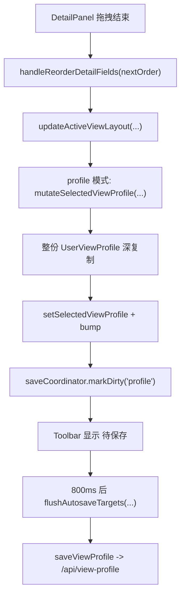

# 详情页字段拖拽重排卡顿治理方案

## 概述

### 1. 总体目标和范围

本方案聚焦 `DetailPanel` 中“拖拽字段重新排序”在松手瞬间出现明显卡顿，并紧接着出现“待保存 / 保存中...”状态提示的问题。目标不是只做一次局部性能补丁，而是从框架设计角度重新梳理：

- 详情字段重排属于哪一层状态
- 哪些状态更新应该同步发生，哪些应该延后
- autosave 机制应该感知什么，应该忽略什么
- profile 持久化的最小写入单元应该是什么

本方案范围限定为：

- 详情页字段顺序 `detailOrder` 的交互链路
- `UserViewProfile.viewLayouts` 的内存更新与持久化
- autosave 协调器对 profile dirty 状态的调度
- 顶部工具栏“待保存 / 保存中...”状态的触发语义

本方案不包含：

- 表格列拖拽排序的整体重构
- shared view 的发布链路重写
- relation / primary key sync 的保存链路调整
- 服务端数据格式的大规模兼容层

### 2. 各阶段任务概要

1. **现状归因阶段**
   - 梳理拖拽结束后的调用链
   - 用实测标记确认卡顿主要耗时发生在前端同步状态更新，而不是网络写盘返回
   - 明确 autosave 状态提示为什么会和这次交互绑定

2. **热路径瘦身阶段**
   - 把 `detailOrder` 更新从“整份 profile 深复制”收窄为“局部 view layout patch”
   - 明确局部 patch 的 copy-on-write 边界，避免共享引用污染
   - 验证松手瞬间的主线程工作量是否明显下降

3. **交互反馈分级阶段**
   - 重新定义“view layout 局部变更”和“profile 全量对象”的关系
   - 确定详情字段重排是否应该触发全局 `saving` 视觉反馈
   - 把 autosave 从“所有 profile 变更同等处理”改为“可区分交互等级”

4. **长期解耦评估阶段**
   - 评估 runtime layout store 是否值得引入
   - 收敛最小状态单元、最小持久化单元、最小渲染影响面
   - 为拖拽结束场景补充性能与行为回归测试

### 3. 整体结构框架



当前高概率卡顿点不在 `J`，而在 `D -> E -> F` 这段同步主线程工作。工具栏保存状态只是同一条链路的后续显性表现。这里先写成“高概率”，因为正式实施前仍需要性能标记来确认这段是否是主要耗时源。

---

## 一、现状设计与问题定位

### 1.1 当前状态分层

当前仓库中，和视图布局相关的状态分成三层：

1. **共享视图配置**
   - 文件：`shared-views.json`
   - 语义：团队共享的 `query / filters / sorts / tabs`
   - 文档依据：[docs/05_数据与配置模型.md](C:/Code/data-editor/docs/05_数据与配置模型.md)

2. **个人 profile**
   - 文件：`view-configs/<profile>.json`
   - 语义：用户级 `viewLayouts / fileOrder / appearance / shared-view drafts`
   - 核心结构：`UserViewProfile.viewLayouts[collectionKey][viewId]`
   - 代码：`src/view-profile.mjs`、`src/view-state-storage.mjs`

3. **浏览器本地状态**
   - 存储：`localStorage`
   - 语义：未选中 profile 时的本地布局与草稿
   - 代码：`src/view-state-storage.mjs`

从语义上看，详情字段重排属于第二层或第三层的“个人布局状态”，不属于第一层团队共享配置。

### 1.2 详情字段拖拽的实际调用链

证据链如下：

1. `DetailPanel` 在 `mouseup` 时调用 `onReorderFields(nextOrder)`  
   代码：[src/detail/DetailPanel.tsx](C:/Code/data-editor/src/detail/DetailPanel.tsx)

2. `App` 把这个回调接到 `handleReorderDetailFields(nextOrder)`  
   代码：[src/App.tsx](C:/Code/data-editor/src/App.tsx)

3. `handleReorderDetailFields` 继续调用 `updateActiveViewLayout(...)`，只修改 `draft.detailOrder`

4. 但 `updateActiveViewLayout(...)` 在 profile 模式下不是做局部 patch，而是进入 `mutateSelectedViewProfile(...)`

5. `mutateSelectedViewProfile(...)` 会先构造一份新的完整 `UserViewProfile`：
   - `fileOrder`
   - `lastActiveViews`
   - `viewDrafts`
   - `viewOrderDrafts`
   - `appearance`
   - `viewLayouts`
   - `collections`

6. 然后执行：
   - `selectedViewProfileRef.current = next`
   - `setSelectedViewProfile(next)`
   - `profileDirtyRef.current = true`
   - `setProfileDirty(true)`
   - `saveCoordinator.markDirty("profile")`
   - `bump(...)`

这意味着一次非常小的 `detailOrder` 调整，被扩展成：

- 一次完整 profile 深复制
- 一次全局 React 状态替换
- 一次 autosave dirty 标记
- 一次工具栏保存状态切换

### 1.3 为什么手感会“卡手”

卡顿来自两个叠加因素：

#### 因素 A：同步主线程负担过大

`mouseup` 当下就发生整份 `UserViewProfile` 复制和 React 状态替换。  
如果当前 profile 中存在较多：

- `viewLayouts`
- `viewDrafts`
- `viewOrderDrafts`
- `collections`

那么这次复制会随 profile 规模线性放大，而不是只和当前 `detailOrder` 长度相关。

#### 因素 B：交互完成信号和保存信号被耦合

拖拽结束本来应该优先保证两件事：

1. 顺序立即稳定落在界面上
2. 交互结束不打断用户节奏

但当前设计把“交互结束”直接绑定到“profile dirty + autosave pending + toolbar save affordance”上，所以用户会感知到：

- 松手时先卡一下
- 紧接着工具栏变成“待保存 / 保存中...”

这会强化“我一松手系统就在做重事”的主观感受。

### 1.4 为什么这不是单纯的网络慢

`saveCoordinator` 本身有 `800ms` 延迟，只有在 `markDirty("profile")` 之后才会进入 `pending -> saving`。  
代码：[src/save-coordinator.ts](C:/Code/data-editor/src/save-coordinator.ts)

因此：

- 如果卡顿发生在松手瞬间，它先于真正的 autosave flush
- 说明首要瓶颈在前端同步更新，而不是 `/api/view-profile` 的返回时间

### 1.5 当前还缺的最终证据

现有代码证据已经足以说明：

- 详情拖拽结束会触发 profile 更新
- profile 更新会触发 autosave pending / saving
- `saveCoordinator` 的网络保存在 `800ms` 之后才真正开始

但要把“整份 profile 深复制”认定为首要瓶颈，仍缺少一轮实测。正式实施前建议先加一组轻量性能标记：

1. `handleReorderDetailFields` 前后打点
2. `mutateSelectedViewProfile` 前后打点
3. `buildFieldConfig(...)` 前后打点
4. `buildValidationIssues(...)` 前后打点
5. `Toolbar` autosave 状态切换时打点

建议输出：

- 单次拖拽结束到首次稳定渲染的总耗时
- `mutateSelectedViewProfile` 自身耗时
- `buildFieldConfig` 和 `buildValidationIssues` 是否也占显著比例

这样可以避免把“高概率根因”误写成“唯一已证实根因”。

---

## 二、框架层面的根因

### 2.1 根因一：状态最小单元和持久化最小单元不一致

当前真正发生变化的是：

```ts
viewLayouts[collectionKey][viewId].detailOrder
```

这是一个非常小的局部状态。

但框架实际更新单元却是：

```ts
UserViewProfile
```

也就是整份 profile 对象。

这会造成典型问题：

- 小变更放大成大对象替换
- 难以控制重渲染范围
- 后续任何 profile 相关功能都容易重复踩到同类性能问题

### 2.2 根因二：profile 领域对象承担了过多即时交互职责

`UserViewProfile` 当前既是：

- 持久化载体
- 运行时 UI 状态容器
- autosave dirty 判断依据

这三种职责叠在一起，导致所有 profile 相关改动都天然带上“持久化重量级路径”。  
从框架设计看，这是把“编辑态局部状态”和“持久化快照对象”混成了同一个抽象。

### 2.3 根因三：autosave 只按 domain 分层，不按交互等级分层

当前 autosave 的 domain 是：

- `document`
- `project-config`
- `profile`

但对 `profile` 来说，实际内部还有至少两类完全不同的交互：

1. **高语义变更**
   - appearance
   - file order
   - shared view drafts
   - panel width

2. **高频轻量布局变更**
   - detailOrder
   - order
   - hidden
   - wrapped
   - widths

当前这两类都被统一为 `profile dirty`。  
结果是：轻量交互也会获得和高语义配置相同的保存反馈和持久化路径。

### 2.4 根因四：`viewRevision` 把“详情布局刷新”和“表格刷新”绑成了同一条通道

进一步的 React Profiler 采样已经说明，本次卡顿的最大热区不在 `DetailPanel` 自身，而在拖拽结束后的整表 commit：

- `detail-reorder:react-main-content` 约 `230ms`
- `detail-reorder:react-data-table` 约 `226.8ms`
- `detail-reorder:react-detail-panel` 仅约 `2.7ms`

沿代码追踪后，可以看到当前机制是：

1. `handleReorderDetailFields(...)` 只修改 `detailOrder`
2. 但它会进入 `updateActiveViewLayout(...)`
3. profile 模式下继续进入 `mutateSelectedViewProfile(...)`
4. 最后统一执行 `bump(viewRevision)`
5. `DataTable` 把 `revision` 当作 `React.memo` 的关键比较项之一

这导致一个结构性问题：

- `detailOrder` 本身并不是 `DataTable` 真正消费的状态
- 但因为 `revision` 被统一推进，`DataTable` 仍会被强制拉进这次更新

也就是说，当前“详情布局变化”和“表格需要重渲染”并没有在框架层被拆开，而是被混成了一条公共刷新信号。这比“整份 profile 深复制”更直接地解释了为什么用户会在松手瞬间感知到明显卡顿。

当前分支的实际修正已经按这条根因落地：

- 统一 `viewRevision` 被拆成更细的刷新信号
- `detailOrder` 不再推动 `DataTable` 的 `revision`
- 最新采样中 `react-data-table` 已不再出现在详情重排链路里
- `detail-reorder:total` 从之前约 `261.3ms` 降到约 `15.9ms`

### 2.5 根因五：兼容遗留结构增加了 profile 复制成本

虽然当前设计已经转向 `viewLayouts` 作为主要 source of truth，但运行时仍保留：

- `viewLayouts`
- `collections`

代码里多处 clone / normalize 仍同时复制这两份结构：

- `src/App.tsx`
- `src/view-state-storage.mjs`
- `src/view-profile.mjs`

这会让本来只应该操作 `viewLayouts[collectionKey][viewId]` 的链路，多承担一层遗留结构成本。  
从框架角度看，遗留字段虽然还保留了语义兼容，但在运行时热路径里不该继续放大更新成本。

### 2.6 根因六：热路径与冷路径没有分离

当前 `UserViewProfile` 同时被用于：

- 拖拽后的即时 UI 反馈
- autosave dirty 聚合
- 最终持久化落盘

这三类路径的性能要求并不相同：

- 即时 UI 反馈需要低延迟
- dirty 聚合需要可恢复、可追踪
- 最终落盘允许稍晚发生

现在它们共享同一条更新链路，导致所有操作默认走“最重那条路径”。从框架设计角度，这属于热路径与冷路径没有正确分层。

---

## 三、设计目标

这次治理需要满足以下目标：

### 3.1 交互目标

- 拖拽松手后，字段顺序应立即稳定
- 主线程同步工作尽可能小
- 工具栏保存提示不应破坏交互连续性

这里要额外区分两个不同验收面：

- **性能验收**：松手瞬间不卡
- **体感验收**：保存提示不打断

两者相关，但不是同一件事。阶段一最多保证前者，不能默认视为已经解决后者。

### 3.2 状态目标

- 详情字段重排只更新当前 active view layout
- profile 运行时编辑态和持久化快照职责分离
- 遗留 `collections` 不再参与热路径状态复制

### 3.3 持久化目标

- 仍保留 autosave，不要求用户手动保存
- 但 autosave 应能区分“高频轻量布局变更”和“重型 profile 配置变更”
- 最终落盘仍可保持单文件 profile，不引入额外兼容层

### 3.4 安全目标

- 局部 patch 不得引入共享引用污染
- 旧 profile 的 `collections -> viewLayouts` 迁移语义不能被破坏
- 若局部 patch 回归，必须可以单点回退到当前全量 clone 路径

---

## 四、候选方案对比

### 方案 A：继续沿用当前结构，只做 `startTransition`

#### 做法

- 在 `handleReorderDetailFields` 或 `mutateSelectedViewProfile` 外层包 `startTransition`

#### 优点

- 改动小
- 代码侵入低

#### 问题

- 没解决整份 profile 深复制的根因
- 只是把一部分 React 渲染优先级降低
- 同步 clone 成本依旧存在
- autosave 提示耦合依旧存在

#### 结论

不推荐作为主方案，只能作为局部 patch 之后的辅助手段。React 官方文档也说明 `startTransition` 适合把状态更新标记为非阻塞，但不会消掉本身已经发生的同步工作量。

### 方案 B：保留 profile 单体模型，但把局部更新改成精准 patch

#### 做法

- 为 `viewLayouts` 提供专门的局部更新函数
- 只复制：
  - 根 profile 对象
  - 对应 `collectionKey` 的 views map
  - 对应 `viewId` 的 layout
  - 对应 layout 的 `detailOrder`
- 不再整份深复制 `viewDrafts / viewOrderDrafts / appearance / 全部 viewLayouts`

#### 优点

- 直接命中当前卡顿根因
- 不改文件格式
- 不改 autosave 基本机制
- 实现成本可控，风险最小

#### 问题

- profile 仍然同时承担运行时状态和持久化职责
- autosave 的“轻重不分”问题仍然只被部分缓解
- 必须非常明确 copy-on-write 边界，否则容易制造对象别名污染

#### 结论

推荐作为第一阶段落地方案。

### 方案 C：把布局编辑态从 profile 中拆成独立 runtime store

#### 做法

- 运行时维护单独的 `activeViewLayoutState`
- 拖拽、列宽、隐藏、换行等都先改 runtime store
- autosave 或切换场景时再合并回 profile snapshot

#### 优点

- 交互最顺
- 运行时状态边界最清晰
- 更适合后续所有高频布局交互统一治理

#### 问题

- 改造面大
- 涉及：
  - 初始化加载
  - view 切换
  - profile 切换
  - reset
  - duplicate view
  - local/profile 双模式
- 短期回归面明显扩大

#### 结论

适合作为长期框架演进方向，不适合直接作为这次首发修复。

### 方案 D：把布局持久化从 profile 中彻底拆成单独文件

#### 做法

- 将 `viewLayouts` 单独落盘到专门文件
- profile 只保留非布局偏好和 shared-view 草稿

#### 优点

- 数据模型最纯
- 持久化边界非常清晰

#### 问题

- 改动过大
- 会引入新的文件组织和迁移策略
- 当前收益和改造成本不匹配

#### 结论

当前阶段不推荐。

---

## 五、推荐方案

推荐采用 **“方案 B 为主，方案 C 的边界原则前置吸收”**。

也就是：

1. **阶段 1A：先测量**
   - 给重排热路径补充 `performance.mark/measure`
   - 先确认主要耗时到底落在 profile clone、fieldConfig 重建、validation 还是其他位置

2. **阶段 1B：短期实现**
   - 保留现有 profile 文件模型
   - 但把 `updateActiveViewLayout` 从“整份 profile 深复制”改成“局部 layout 精准 patch”

3. **中期边界调整**
   - 把 autosave 中 `profile` domain 进一步细分为：
     - `profile-layout`
     - `profile-settings`
   - 让高频布局类变更可以使用更轻的视觉反馈策略

4. **长期演进方向**
   - 为布局交互引入独立 runtime layout store
   - profile 退化为持久化快照，而不是交互热状态容器

这个组合的好处是：

- 先解决最痛的主线程卡顿
- 在真正动刀前先拿到性能证据，避免误判热区
- 不一次性推翻现有体系
- 后续还能继续演进，不会把这次修复做成死胡同

---

## 六、推荐实施设计

### 6.1 引入局部 profile patch 工具

新增一个明确职责的工具函数，例如：

```ts
updateProfileViewLayout(
  profile,
  collectionKey,
  viewId,
  mutator,
)
```

它只负责：

- 复制 profile 顶层壳
- 复制目标 `viewLayouts[collectionKey]`
- 复制目标 `viewLayouts[collectionKey][viewId]`
- 对目标 layout 做最小变更

禁止它：

- 顺手复制全部 `viewDrafts`
- 顺手复制全部 `viewOrderDrafts`
- 顺手复制全部 `viewLayouts`
- 顺手写遗留 `collections`

同时必须明确 copy-on-write 规则：

- 可以复用未修改的 `viewDrafts / viewOrderDrafts / appearance / fileOrder` 引用
- 只允许替换本次修改路径上的对象
- helper 之外的调用方不得在返回对象上继续做原地修改
- 若后续某条链路仍需要“可任意 mutate 的完整 draft”，必须继续使用现有全量 clone 工具，不能偷用这个局部 patch helper

也就是说，这个 helper 的语义不是“通用 profile draft”，而是“只服务于已知局部 layout 变更的结构共享 patch”。

### 6.2 `updateActiveViewLayout` 改为两条路径

#### profile 模式

- 使用局部 patch 更新 `selectedViewProfile`
- 仅在必要时更新 `selectedViewProfileRef`
- 不走整份 `normalizeUserViewProfile + full clone`

这里要补一个约束：如果调用链后续需要读取依赖旧 `collections` 的兼容行为，必须保证读取入口仍通过 `readViewLayoutState(...)` 这类带回退语义的函数，而不是直接假设 `collections` 永远为空。

#### local 模式

- 继续维持当前 `readLocalViewState -> mutate -> writeLocalViewState` 思路
- 但可考虑后续加内存缓存，避免每次都全量扫 `localStorage`

这一点也意味着：本轮性能收益主要面向 **profile 模式**。  
local 模式当前没有 `UserViewProfile` 全量 clone，因此不会获得同等幅度的收益；如果用户主要在 local 模式下使用，后续要另开议题治理 `localStorage` 扫描成本。

### 6.3 遗留 `collections` 退出热路径

当前 `collections` 的职责已经是遗留兼容。  
推荐原则：

- 读取时允许 `view-profile.mjs` 做一次性迁移
- 运行时读取 `view layout` 时仍允许 `readViewLayoutState(...)` 回退到 `collections`
- 运行时编辑链路不再依赖 `collections`
- 持久化输出时不再为布局交互同步维护 `collections`

这样可以避免一次 `detailOrder` 变更又把旧结构带进热路径。

### 6.4 autosave 语义分层

建议把 `profile` dirty 进一步拆层：

```ts
type AutosaveDomain =
  | "document"
  | "project-config"
  | "profile-layout"
  | "profile-settings";
```

其中：

- `profile-layout`
  - 列顺序
  - 详情字段顺序
  - 列宽
  - hidden
  - wrapped

- `profile-settings`
  - fileOrder
  - appearance
  - lastActiveViews
  - 与 shared-view 个人状态强绑定的配置

然后在 UI 层允许差异化反馈：

- `profile-layout`
  - 可以延迟更长一点再 flush
  - 可以不立刻显示强烈“保存中...”提示
  - 甚至只在错误时才显式提示

- `profile-settings`
  - 保持当前明显的 autosave 状态反馈

### 6.5 保存提示降级策略

工具栏现在把：

- `pending` 显示为“待保存”
- `saving` 显示为“保存中...”

对于详情字段拖拽这种高频布局微交互，建议改成：

- 默认不显示 `profile-layout` 的 `pending`
- `saving` 也可以只显示轻量图标，不显示文字
- 只有出现 `error` 时再明确暴露

核心原则是：

> 保存机制应该可靠，但不应该喧宾夺主地抢占高频微交互的反馈中心。

但这里需要强调顺序：  
**先做阶段 1A/1B，再决定是否推进这一步。**  
如果局部 patch 之后松手卡顿已经明显下降，而用户仍接受当前提示强度，可以把 autosave 分级延后，避免一次性扩大回归面。

---

## 七、分阶段落地建议

### 阶段 1A：证据采样

目标：先确认真正热区，避免错修。

工作：

- 在拖拽结束链路补 `performance.mark/measure`
- 记录 `handleReorderDetailFields / mutateSelectedViewProfile / buildFieldConfig / buildValidationIssues` 耗时
- 对比 profile 模式与 local 模式

预期收益：

- 把“高概率根因”升级为“已验证根因”
- 为后续 patch 范围收敛提供实测依据

### 阶段 1B：热路径瘦身

目标：先把“松手卡一下”消掉。

工作：

- 引入局部 layout patch 工具
- 改写 `updateActiveViewLayout`
- 让 `handleReorderDetailFields` 不再触发整份 profile 深复制

预期收益：

- 拖拽松手时主线程负担显著下降
- 不改动现有文件格式和 autosave 总体行为
- 但不承诺同时消除工具栏保存提示带来的体感打断

### 阶段二：autosave 分级

目标：把“轻量布局变更”和“重型配置变更”的反馈分开。

工作：

- 细分 `AutosaveDomain`
- 修改 `saveCoordinator` snapshot 聚合逻辑
- 调整 `Toolbar` 的文案与显示规则

预期收益：

- 详情字段重排不再频繁显示强提示
- 保存机制仍然完整保留

### 阶段三：运行时状态进一步解耦

目标：为后续所有布局交互提供统一高性能底座。

工作：

- 评估是否把 active layout 独立成 runtime store
- profile 仅承担加载与落盘
- 交互态布局只在切换/flush 时同步回 profile

预期收益：

- 所有高频布局交互统一受益
- 代码边界更清晰，可维护性更高

---

## 八、测试与验证建议

### 8.1 行为验证

已有相关测试入口：

- `tests/data-editor.spec.ts` 中 detail panel reorder 场景

需要新增或加强：

1. 拖拽结束后顺序立即生效
2. profile 模式下仍能正确持久化到对应 profile 文件
3. 切换记录、切换文件、reload 后顺序仍正确恢复

### 8.2 性能验证

建议新增轻量性能断言，不做绝对时间硬编码，而做结构性验证：

1. 拖拽结束时不再走当前整份 profile 克隆路径
2. `updateActiveViewLayout` 只替换目标 layout 对象
3. 非目标 collection / view 的对象引用保持不变

这类测试更稳定，也更能防止后续回退到“全量 clone”。

另外建议补一组开发态 profiling 步骤，作为非 CI 验证：

1. 打开带 profile 的典型大集合
2. 拖动详情字段一次
3. 记录：
   - `mouseup -> 首次稳定渲染`
   - `mutateSelectedViewProfile`
   - `buildFieldConfig`
   - `buildValidationIssues`
4. 保存为对比基线，供阶段 1B 前后比较

### 8.3 视觉反馈验证

需要验证：

1. 阶段 1B 后，当前提示机制是否仍被用户主观感知为打断
2. 若引入 `profile-layout` / `profile-settings`，工具栏是否按预期分级显示
3. 保存失败时错误状态是否仍然可靠可见

### 8.4 回滚验证

需要保留一个清晰回滚点：

- 局部 patch helper 封装在单独入口
- `updateActiveViewLayout` 可以在单点切回当前全量 clone 路径

这样如果出现：

- 布局不落盘
- 切 view 后错乱
- 旧 profile 兼容回退失效

可以快速回退，而不必回滚整组 autosave 或布局代码。

---

## 九、最终建议

从框架设计角度看，这个卡顿问题不是单点 bug，而是一个典型的“状态粒度设计过粗”问题。

真正需要修正的不是拖拽逻辑本身，而是这三个边界：

1. **运行时局部布局状态**
   - 应该按 `collectionKey + viewId + layout field` 精准更新

2. **profile 持久化对象**
   - 不应直接充当所有高频 UI 交互的热路径状态容器

3. **autosave 反馈**
   - 不应把所有 profile 变更都当成同等级事件

因此，推荐执行顺序是：

1. 先做性能采样，确认真正热区
2. 再做局部 layout patch，消除松手卡顿
3. 视体感结果决定是否继续做 autosave 分级
4. 最后视需要推进 runtime layout store 解耦

这是当前收益最大、风险最可控、并且不会和现有 view/profile 架构方向冲突的治理路径。
