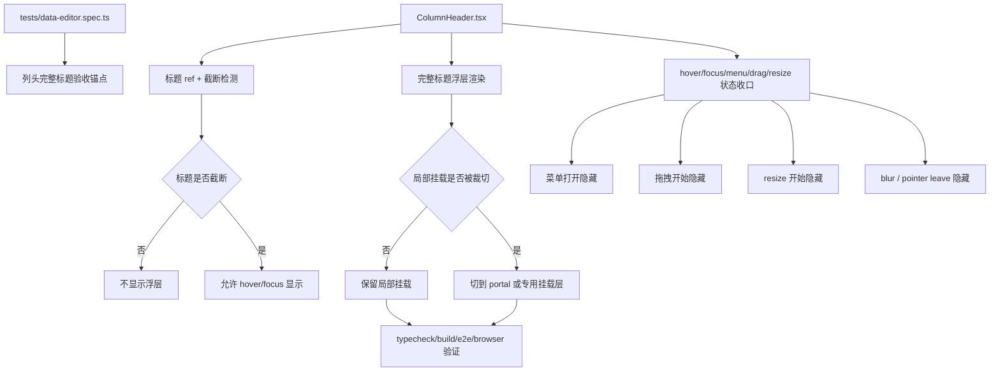

# 列头截断即时完整标题显示执行方案

## 方案概述

### 总体目标和范围

本方案用于把“列头标题被截断时，hover 一段时间后才出现浏览器原生 tooltip”的现状，替换为一套前端受控的即时完整标题预览能力。目标行为是：

- 仅当列头标题在当前列宽下真实被截断时，才显示完整标题浮层。
- 鼠标 hover 或键盘 focus 到列头后，立即显示完整标题。
- 浮层展示在列头上方，黑色背景、浅色文字，不再次省略。
- 浮层不干扰列头菜单、列拖拽、列宽调整和键盘操作。
- 实现后有明确的自动化验证和浏览器验收口径。

本轮范围包括：

- `ColumnHeader` 的受控完整标题显示逻辑。
- 标题截断检测与重算时机。
- 浮层挂载层选择与顶部不裁切校验。
- hover / focus / blur / drag / resize / menu open 的状态收口。
- 最小必要的 e2e、类型检查和构建验证。

本轮不包括：

- 不改表体 cell 的文本截断策略。
- 不把这套浮层能力推广到其他 UI 区域。
- 不重构列头菜单和列拖拽体系。
- 不先建一整套全局 tooltip 基础设施。

### 各阶段任务概要

第一阶段：建立测试锚点与现状基线。
主要工作是先为列头完整标题行为补出可断言的 DOM 合同和 e2e 验证入口，避免实现后只能靠肉眼判断。预期成果是“截断列头出现浮层、非截断列头不出现、菜单/拖拽时隐藏”都有可自动验证的基线。

第二阶段：在列头组件内接入受控状态。
主要工作是在 `ColumnHeader.tsx` 内增加标题节点 ref、截断检测、hover/focus 状态、无障碍可访问名称，并移除原生 `title` 依赖。预期成果是列头内部具备“知道自己是否截断，以及当前是否应该显示浮层”的最小状态机。

第三阶段：落地浮层渲染与挂载策略。
主要工作是先用最小实现验证局部挂载是否会被 `.table-scroll` 顶部裁切；若会裁切，则立刻切到 portal 或专用挂载层方案。预期成果是完整标题浮层在真实滚动表格中稳定可见，而不是只在静态 DOM 中存在。

第四阶段：收口交互边界和样式细节。
主要工作是把菜单打开、拖拽开始、resize 开始、blur、pointer leave 等路径全部接入隐藏条件，并收口浮层尺寸、换行、层级和边界表现。预期成果是功能不打断现有交互，且视觉行为一致。

第五阶段：执行自动化与运行态验证。
主要工作是跑 `npm run typecheck`、`npm run build`、目标 e2e 用例，并按需要做浏览器验证与 `service:finalize` 收尾。预期成果是该功能具备稳定的交付闭环，而不是只在本地临时可用。

执行顺序为：测试基线 -> 组件状态 -> 浮层挂载 -> 交互收口 -> 自动化与运行态验证。

### 整体结构框架



---

## 文件结构与职责

### 主要改动文件

- `src/table/ColumnHeader.tsx`
  - 当前列头的唯一真实入口。
  - 本轮核心逻辑都应尽量收口在这里，包括标题截断检测、可访问名称、hover/focus 状态、浮层渲染、拖拽和 resize 期间隐藏。
- `src/table/table-columns.tsx`
  - `ColumnHeader` 的 runtime 装配层。
  - 本轮需要确认 tooltip 所需 header state、dragging state 和 runtime callback 是否都能稳定透传。
- `src/table/DataTable.tsx`
  - 当前列拖拽的真实宿主，负责 drag session、preview store、auto-scroll、drag ghost、drag end 和 drag cancel。
  - tooltip 若要正确响应拖拽开始、拖拽中、取消和顶部 portal/挂载层策略，这里属于正式改动面。
- `src/styles.css`
  - 负责列头浮层的黑底视觉、换行、最大宽度、层级和必要的挂载层样式。
- `tests/data-editor.spec.ts`
  - 增加完整标题浮层的 Playwright 回归用例。
  - 迁移当前依赖 `.column-trigger[title="..."]` 与 `getAttribute("title")` 的列头 selector / 断言。

### 可能新增的薄文件

- `src/table/ColumnHeaderTooltip.tsx`
  - 仅当 `ColumnHeader.tsx` 实现后明显过重时再引入。
  - 只负责浮层展示，不负责业务状态。

- 不预设新增 `OverlayPortal`。
  - 当前项目已有 `createPortal` / `Popover.Portal` / `Dialog.Portal` 现成模式，本轮应优先复用。
  - 只有当现有模式无法满足列头 tooltip 的定位需求时，才考虑抽一个很薄的封装。

### 不应改动的文件

- `src/table/column-dnd.mjs`
  - 本轮原则上不改列拖拽算法；只有在 tooltip 与 preview target/auto-scroll 的节拍确实冲突时，才重新评估。
- `src/view-*`、`src/model-*`
  - 本轮不涉及。

---

## 执行阶段

## 第一阶段：建立测试锚点与现状基线

### 目标

先把需求转成稳定断言，避免实现后再倒推“怎么证明它对了”。

### 具体执行

1. 盘点现有测试中对列头的定位方式。
2. 盘点并列出当前列头测试依赖：
   - `.column-trigger[title="..."]`
   - `getAttribute("title")`
   - 任何通过 `title` 读取列头顺序的断言
3. 决定新的 DOM 合同，建议至少包含以下两类：
   - 浮层节点 class，例如 `.column-header-full-title-tooltip`
   - 列头稳定定位锚点，例如 `data-column-field`、`aria-label` 或专门的 `data-column-trigger`
4. 在 `tests/data-editor.spec.ts` 中增加一条列头完整标题用例，覆盖：
   - 长字段名列头 hover 后出现浮层
   - 短字段名列头 hover 后不出现浮层
   - 开菜单后浮层消失
5. 如果键盘路径要覆盖到 e2e，同一用例中再补：
   - `Tab` 聚焦到截断列头时出现浮层
   - `Tab` 离开时浮层消失
6. 同阶段把现有列头 selector 迁移掉，避免后续“功能代码对了但现有用例集体炸掉”。

### 这一阶段的建议验证方式

- 先只跑目标单测，不跑全量：
  - `npx playwright test tests/data-editor.spec.ts -g "column header full title tooltip"`

### 验收输出

- 明确一个可断言的浮层 DOM 合同。
- 明确一个长字段和一个短字段的测试场景。
- 明确列头 selector 从 `title` 迁移后的统一定位方式。

---

## 第二阶段：在列头组件内接入受控状态

### 目标

让 `ColumnHeader` 在与当前 runtime 拖拽结构对齐的前提下，具备完整标题浮层所需的最小状态机。

### 具体执行

1. 给标题文本 `span` 增加 ref。
2. 在 `ColumnHeader` 内新增截断检测函数：
   - 输入：标题 DOM 节点
   - 输出：当前是否截断
   - 判定：`scrollWidth > clientWidth`
3. 增加本地状态：
   - `hovered`
   - `focusVisible`
   - `truncated`
   - 如实现需要，可加 `showTooltip`
4. 给列头按钮补：
   - `onPointerEnter`
   - `onPointerLeave`
   - `onFocus`
   - `onBlur`
5. 去掉当前 `.column-trigger` 上的 `title={props.fieldName}`。
6. 补上无障碍可访问名称：
   - 优先用 `aria-label={props.fieldName}`
7. 先把显示条件收口成单一布尔表达式：
   - `(hovered || focusVisible) && truncated && !menuOpen && !props.isDragging && !isResizing`
8. 同步确认 `props.isDragging`、`onDragCancel` 和 runtime 注入的 drag lifecycle 已足够表达 tooltip 的隐藏条件；如果不够，在 `table-columns.tsx` / `DataTable.tsx` 补最小状态透传。

### 关键注意点

- 不要在这一阶段先引入新的自定义 portal 封装。
- 不要一上来把状态拆到多个子组件。
- 先保证 `ColumnHeader` 自己能正确判断“该不该显示”。
- 但不要假设 `ColumnHeader` 能单独拥有全部拖拽语义；当前拖拽真实宿主在 `DataTable`。

### 这一阶段的建议验证方式

- 本地保存后先跑类型检查：
  - `npm run typecheck`

---

## 第三阶段：落地浮层渲染与挂载策略

### 目标

让浮层真的出现在列头上方，并在真实滚动容器里可见。

### 具体执行

1. 先在 `ColumnHeader` 内渲染最小浮层节点：
   - 渲染条件：上一阶段收口出的显示布尔值
   - 内容：完整 `props.fieldName`
2. 先尝试局部挂载：
   - 浮层作为 `.column-header` 子节点
   - `position: absolute`
   - `bottom: calc(100% + 6px)`
   - `left: 0`
3. 立即验证顶部是否被 `.table-scroll` 裁切：
   - 表头处于顶部可见区域
   - hover 截断列头
   - 看浮层是否被裁掉
4. 如果未裁切：
   - 保留局部挂载
   - 继续第四阶段
5. 如果被裁切：
   - 优先复用当前项目已有的 `createPortal` / `Popover.Portal` 类模式
   - 必要时在 `DataTable` 外层增加专用挂载容器
   - 使用 `getBoundingClientRect()` 计算浮层锚点坐标
   - 仍保持浮层为纯展示层，不接管交互
6. 若采用 portal / 专用挂载层，顺手确认拖拽 ghost、列菜单和 tooltip 三者层级关系。

### 挂载策略决策规则

- 只要出现顶部裁切，就不要继续死守局部挂载。
- 本轮优先“稳定可见”，而不是“实现最短”。

### 这一阶段的建议验证方式

- 先做人工快速验证，再进入 e2e：
  - 截断列头在表头顶部是否能完整看到黑底浮层

---

## 第四阶段：收口交互边界和样式细节

### 目标

保证这个功能不会打坏现有列头交互，同时把浮层视觉收紧到可交付状态。

### 具体执行

1. 在 `beginDrag` 路径上确保浮层隐藏。
2. 在 drag preview / auto-scroll 活跃期间确保浮层不重新出现。
3. 在 `onDragCancel` 路径上确保浮层不会残留旧态，并按当前 hover/focus 状态重新评估。
4. 在 `beginResize` 路径上确保浮层隐藏。
5. 在打开列菜单时确保浮层隐藏。
6. 在 `pointer leave`、`blur` 时确保浮层隐藏。
7. 在 `styles.css` 中增加浮层样式，至少包括：
   - 黑色背景
   - 浅色文字
   - 小圆角
   - 适度阴影
   - `pointer-events: none`
   - `max-width: min(360px, calc(100vw - 24px))`
   - `white-space: normal`
   - `word-break: break-word`
8. 如使用 portal/专用挂载层，补对应层级规则：
   - 高于表头
   - 低于更高优先级的全局浮层
9. 处理边缘位置：
   - 左边缘不要飞出视口
   - 右边缘不要超出屏幕

### 关键注意点

- 浮层内不再使用 `ellipsis`。
- 浮层不可抢鼠标，不可导致 hover 抖动。
- 不要把视觉处理扩散成列头整体重做。

---

## 第五阶段：自动化、运行态验证与收尾

### 目标

完成交付闭环，而不是停在“代码看起来合理”。

### 自动化验证顺序

1. 类型检查：
   - `npm run typecheck`
2. 构建验证：
   - `npm run build`
3. 目标 e2e：
   - `npx playwright test tests/data-editor.spec.ts -g "column header full title tooltip"`
4. 列头 selector 迁移后的相关回归组：
   - 现有点击列头开菜单路径
   - 现有列头拖拽重排路径
5. 若目标用例通过，再决定是否跑更大范围表格回归组。

### 浏览器运行态验证口径

- 截断列头 hover 立即显示完整标题
- 截断列头 focus 立即显示完整标题
- 非截断列头不显示浮层
- 打开列菜单后浮层立即消失
- 开始拖拽列头后浮层立即消失
- 拖拽取消后浮层不会残留错误状态
- 开始列宽调整后浮层立即消失
- 浮层不被顶部裁切
- 现有列头测试在移除原生 `title` 后仍全部通过

### 服务收尾要求

如果本轮执行中启动过本地服务、Browser 或其他临时验证环境，结束前必须运行：

```powershell
npm run service:finalize
```

并在收尾记录中补：

- `8787/api/health` 结果
- `8791/health` 结果
- 正式 URL：`http://127.0.0.1:8787/`
- 临时进程和目录清理结果

---

## 建议的提交切分

如果实现过程中需要保持干净提交边界，推荐按下面方式切分：

1. `test: 迁移列头 selector 并增加完整标题浮层回归用例`
2. `feat: 列头支持截断时即时显示完整标题`
3. `style: 收口列头完整标题浮层样式与 portal/层级边界`

如果改动量很小，也可以合并成一个提交，但仍建议保持“测试先行、功能后落地”的实现顺序。

---

## 风险点与执行闸口

### 风险点 1：局部挂载看似简单，但实际被顶部裁切

处理原则：

- 先证伪再坚持。
- 一旦裁切，立即切换挂载策略。

### 风险点 2：去掉原生 `title` 后，键盘路径退化

处理原则：

- `focus-visible` 和 `aria-label` 不是可选优化，而是本轮正式范围。

### 风险点 3：截断检测只在 `props.width` 变化时重算，导致漏判

处理原则：

- 先最小实现。
- 若运行态暴露问题，补 `ResizeObserver`，不要靠猜。

### 风险点 4：浮层影响列拖拽与 resize

处理原则：

- 浮层必须 `pointer-events: none`
- drag / resize / menu open 路径一律优先隐藏

### 风险点 5：移除原生 `title` 会让现有 e2e 大面积失效

处理原则：

- 把 selector 迁移放到第一阶段，不要留到最后修补。
- 新的稳定锚点优先用 `data-column-field`、`aria-label` 或专用 `data-*`，不要再把原生 tooltip 属性当测试合同。

---

## 最终执行建议

真正的执行顺序建议是：

1. 先迁移列头测试锚点并补目标 e2e。
2. 再改 `ColumnHeader.tsx` 的状态和无障碍。
3. 同步检查 `table-columns.tsx` / `DataTable.tsx` 是否需要补 drag lifecycle 透传或挂载层支撑。
4. 先做局部挂载验证可见性。
5. 如有裁切，优先复用现有 portal 模式。
6. 最后收样式、补拖拽相关回归、跑验证、做服务收尾。

这条顺序的核心原因是：这不是一个纯 CSS 需求，而是一个“截断检测 + 挂载层可见性 + 拖拽生命周期 + 测试合同迁移”组合需求。按这个顺序推进，可以最早暴露真正的技术风险，避免后面返工。
