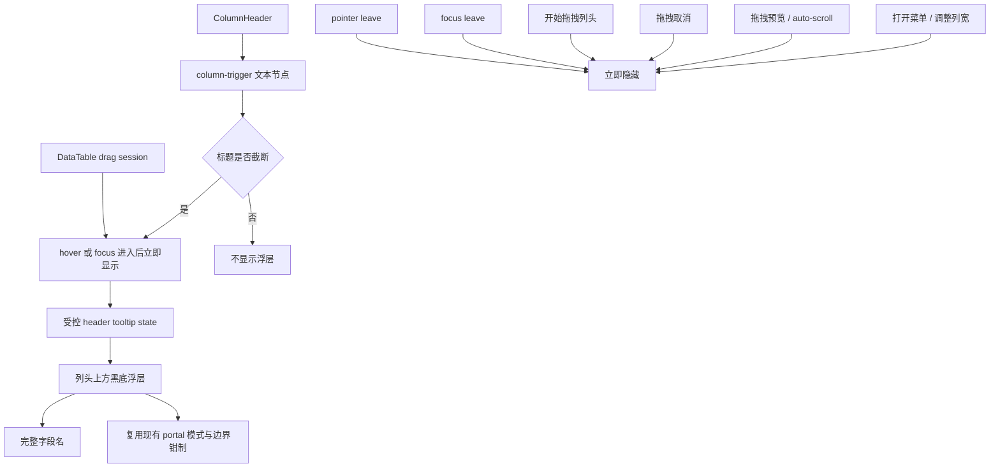

# 列头截断即时完整标题显示方案

## 方案概述

### 总体目标和范围

本方案目标是改善 data-editor 主表列头在字段名较长时的可读性问题：当列头标题内容在当前列宽下被截断时，鼠标悬停到列头后，应立即在列头上方显示完整标题；该提示采用黑色背景浮层，而不是继续依赖浏览器原生 `title` 的延迟 tooltip。

本轮范围包括：

- 主表列头标题的“是否被截断”判定。
- 仅在标题实际被截断时显示即时浮层。
- 浮层在列头上方展示完整字段名，使用黑底浅色文字样式。
- 浮层与现有列头交互共存，包括点击打开列菜单、拖拽列头、调整列宽。
- 与当前列拖拽生命周期共存，包括拖拽开始、拖拽预览、自动滚动、拖拽完成和拖拽取消。
- 同时覆盖鼠标 hover 与键盘 focus 的完整标题可见性。
- 补充自动化验证，并同步迁移当前对 `.column-trigger[title="..."]` 的测试依赖。

本轮范围不包括：

- 不改动列头菜单结构和字段操作能力。
- 不处理表体单元格文本截断问题。
- 不把该浮层能力泛化到侧栏、toolbar、detail panel 或其他组件。
- 不保留“原生 tooltip 与自定义 tooltip 并存”的兼容路径，直接收敛到受控方案。

### 各阶段任务概要

第一阶段：固化当前列头显示链路与问题边界。
主要工作是确认列头文本的真实渲染节点、当前截断规则、原生 tooltip 来源，以及与拖拽、菜单、列宽调整的交互关系。预期成果是把本轮问题明确为“原生 `title` 延迟提示替换为受控浮层”，而不是泛化成整套 tooltip 系统改造。

第二阶段：定义列头完整标题浮层的交互契约。
主要工作是明确何时显示、何时隐藏、显示位置、与 pointer/drag/menu 的优先级，以及非截断列头不出现浮层的规则。预期成果是后续实现不会在“所有列头都弹”“拖拽时残留”“菜单打开仍遮挡”等细节上反复返工。

第三阶段：实现最小受控浮层。
主要工作是在 `ColumnHeader` 层内增加受控 hover/focus 状态、截断检测和上方定位浮层，移除当前按钮上的原生 `title` 依赖，并用局部样式完成黑底浮层视觉；同时与 `DataTable` 当前托管的 drag session / preview / cancel 生命周期对齐。预期成果是列头浮层不会与新的拖拽体系互相打架。

第四阶段：补回归验证并校准样式细节。
主要工作是补 e2e 断言，验证截断列头 hover/focus 立即显示、非截断列头不显示、开始拖拽或移出时隐藏；同时校准浮层层级、最大宽度、顶部不裁切和边缘位置。预期成果是后续再调列头样式或表格布局时，不会把即时完整标题能力打坏。

执行顺序为：现状固化 -> 交互契约定义 -> 受控浮层落地 -> 回归验证与样式校准。

### 整体结构框架

---

## 背景与现状

当前主表列头真实入口位于 `src/table/ColumnHeader.tsx`。列头按钮 `.column-trigger` 直接把字段名挂在 `title={props.fieldName}` 上，而标题文本本身渲染在内部 `span` 节点。与此同时，`src/styles.css` 对 `.column-trigger span` 明确设置了：

- `overflow: hidden`
- `text-overflow: ellipsis`
- `white-space: nowrap`

这意味着当前行为链路非常明确：

1. 列宽不足时，字段名在列头内被单行省略。
2. 用户只能依赖按钮元素上的原生 `title` 查看完整字段名。
3. 原生 `title` 的出现时机和样式由浏览器控制，因此会有固定延迟，且视觉不可控。

当前问题不是“没有 tooltip”，而是“tooltip 的触发时机和样式不符合产品预期”。

---

## 当前实现结论

基于当前代码结构，可以先固定以下结论：

### 1. 原生 tooltip 是问题根源，不是附属现象

`ColumnHeader.tsx` 当前直接把 `props.fieldName` 传给列头按钮的 `title` 属性，因此 hover 延迟来自浏览器原生行为，而不是项目内任何受控逻辑。

### 2. 截断发生在标题文本节点，而不是整个列头容器

当前真正负责省略的节点是 `.column-trigger span`。因此“是否被截断”的判断应围绕标题文本节点本身，而不是拿整个 `th` 或 `button` 做粗粒度判断。

### 3. 列头已有多种高优先级交互，浮层不能干扰它们

`ColumnHeader` 当前同时承担：

- 点击打开列菜单
- Pointer down 后判断是否进入列拖拽
- 列宽 resize handle 调整列宽

而新的拖拽真实 session、preview order、auto-scroll 和 cancel 收口已经上移到 `DataTable` / `table-columns runtime`。

因此新浮层必须满足：

- `pointer-events: none`
- 拖拽开始后立即消失
- 拖拽预览期间不重新出现
- 拖拽取消后按当前 hover/focus 状态重新评估，而不是残留旧态
- 不覆盖 resize handle 的可操作区域

### 4. 当前仓库没有现成的通用 tooltip 组件在用，但已有成熟 portal 模式可复用

虽然依赖中包含 `@radix-ui/react-tooltip`，但现有前端代码没有实际启用通用 tooltip 组件。
不过仓库里已经广泛使用 `Popover.Portal`、`Dialog.Portal` 和 `createPortal` 处理浮层与内联层，因此本轮如果要避免顶部裁切，应优先复用现有 portal 组织方式，而不是新造一层通用 overlay 基础设施。

### 5. 浮层存在被滚动容器顶部裁切的真实风险

当前表格头部位于 `.table-scroll` 滚动容器内部，而该容器使用 `overflow: auto`。
列头本身虽然是 sticky header，但如果完整标题浮层只是 `th` 或 `.column-header` 内部的绝对定位子节点，并向列头上方溢出，就有较大概率被滚动容器顶部直接裁切。

这意味着“浮层显示在列头上方”不能只当作样式问题处理，而必须先明确挂载层策略。

---

## 目标交互语义

本轮采用已经确认的目标语义：

- 只有当列头标题在当前宽度下被截断时，hover 或 focus 才显示完整标题浮层。
- hover 或键盘 focus 进入后立即显示，不依赖浏览器原生延迟。
- 浮层出现在当前列头上方，默认与列头左边缘对齐。
- 浮层使用黑色背景、浅色文字、小圆角、适度阴影。
- hover 离开或 focus 离开后立即隐藏。
- 如果用户开始拖拽列头、打开列菜单、或执行会改变交互焦点的动作，浮层应立即隐藏。
- 非截断列头不显示浮层，也不保留原生 `title` 作为后备。
- 浮层展示完整字段名，允许换行，但不允许再次省略成看不全的短文本。

这意味着本轮交互语义不是“统一给列头加 tooltip”，而是“给被截断的列头补一层即时完整内容预览”。

---

## 方案选型

### 方案 A：继续使用原生 `title`，尝试用样式或延迟技巧绕过

优点：

- 实现最省事。
- 不需要新增状态和样式节点。

缺点：

- 浏览器原生 `title` 的触发延迟不可控。
- 样式不可控，无法稳定做黑底浮层。
- 无法做到“仅截断时显示”和“拖拽时立即消失”这类精细交互。

结论：排除。

### 方案 B：在 `ColumnHeader` 内实现局部受控浮层

优点：

- 改动范围小，直接收口在列头组件。
- 可以精准控制显示时机、位置和隐藏条件。
- 能与当前列拖拽、菜单、列宽调整逻辑一起建模。

缺点：

- 需要自己处理截断检测和定位细节。
- 后续如果全站大量需要 tooltip，可能还要再抽象。

结论：采用。当前需求只落在列头，做局部受控方案最稳妥。

### 方案 C：先引入通用 tooltip 基础设施，再接入列头

优点：

- 长期看更可复用。
- 若后续多个区域都要一致 tooltip，可作为基础设施。

缺点：

- 对当前需求明显过度设计。
- 会把一次列头体验修复扩大成组件基础设施决策。
- 仍需要额外补“仅截断时显示”的列头专用逻辑。

结论：本轮不采用。

---

## 推荐实现方案

### 1. 在 `ColumnHeader` 内新增标题文本 ref 与截断检测

建议给当前标题文本 `span` 单独加 ref，并在以下时机重新判断是否截断：

- 组件挂载后
- `props.fieldName` 变化后
- `props.width` 变化后
- 列头节点尺寸变化后
- 标题文本节点尺寸变化后，例如窗口缩放、字体加载、容器布局变化后

判定规则建议采用最直接的 DOM 比较：

- `scrollWidth > clientWidth` 视为已截断

这是当前场景下最稳的判定方式，足以覆盖单行省略文本。

重算策略建议分两层：

- 最小实现：先覆盖 `fieldName + width` 变化。
- 稳定实现：若运行态验证发现存在漏判，再补 `ResizeObserver` 到标题文本节点或列头节点，确保窗口缩放、容器宽度变化和字体加载后能自动重算。

### 2. 用本地 hover/focus state 替代原生 `title`

建议移除 `.column-trigger` 上的 `title={props.fieldName}`，避免自定义浮层与原生 tooltip 叠加。

但这一步不能只看组件本身，还要同步处理当前测试体系中大量依赖 `title` 的 selector 与排序断言。

随后在 `ColumnHeader` 内维护最小状态：

- 当前是否 hover
- 当前是否 focus-visible
- 当前是否已截断
- 当前是否允许显示浮层

显示条件建议收口为：

- hover 中或 focus-visible 中
- 标题已截断
- `menuOpen === false`
- 当前不在列拖拽中
- 当前不在 resize 中

其中“当前不在列拖拽中”不应只依赖 `ColumnHeader` 本地指针状态，而应以 runtime 注入的 `isDragging` 和必要的 drag cancel/drag preview 生命周期为准。

同时应补一层无障碍兜底：

- 列头按钮保留可访问名称，例如 `aria-label={props.fieldName}` 或等价语义。

这样即使完全移除原生 `title`，键盘用户和读屏路径也不会丢失完整字段名。

### 3. 浮层挂载方式优先遵循“先验证裁切，再决定挂载层”

本轮不应先验假设“列头内部绝对定位一定可行”。
建议把挂载策略定义为两步：

第一步：优先验证局部绝对定位是否会被 `.table-scroll` 顶部裁切。
如果实测不会裁切，可以保留局部实现。

第二步：如果实测存在裁切或边缘定位不稳定，则直接改为：

- 复用当前项目已存在的 portal 模式，挂到 `document.body`
- 或挂到表格滚动容器外的专用可见层，并用 `getBoundingClientRect()` 做坐标换算

不应为了保住“局部实现更简单”而接受顶部被裁掉的结果。

当挂载层可见性问题解决后，默认定位策略建议为：

- `position: absolute`
- `bottom: calc(100% + 6px)` 或等价 top 偏移
- `left: 0`

为避免长标题在窄列上被裁切或飞出视口，样式层应至少提供：

- `max-width`
- `white-space: normal`
- `word-break: break-word`
- 合理的内边距、圆角、阴影和层级

本轮推荐优先使用：

- `max-width: min(360px, calc(100vw - 24px))`
- `white-space: normal`
- `word-break: break-word`

原因是这个浮层的目标就是读完整标题，优先级应高于继续单行省略。
因此本轮不应再引入 `ellipsis` 作为浮层内的回退语义。

### 4. 浮层必须是纯展示层，不参与交互

样式和行为上都应确保：

- `pointer-events: none`
- 浮层不抢占 hover 焦点
- 不影响列头按钮点击
- 不覆盖 resize handle 的交互路径

### 5. 与现有交互的冲突处理

以下行为发生时，应主动隐藏浮层：

- `onPointerLeave`
- `onBlur`
- `beginDrag` 进入拖拽阈值后
- `onDragCancel` 进入取消分支时
- drag preview 与 auto-scroll 活跃期间
- `setMenuOpen(true)` 打开列菜单时
- `beginResize` 开始列宽调整时

这样可以避免“浮层悬挂在拖拽中的列头上”或“菜单弹出时上面还残留黑框”的视觉噪声。

---

## 文件影响范围

预计主要改动文件如下：

- `src/table/ColumnHeader.tsx`
  - 增加标题文本 ref、hover/focus state、截断检测和受控浮层节点。
  - 移除当前列头按钮上的原生 `title` 依赖。
  - 补充 `aria-label` 或等价可访问名称。
- `src/table/table-columns.tsx`
  - 作为 `ColumnHeader` 的 runtime 装配层，需要同步确认 tooltip 所需的 header state / drag state 是否都能从这里拿到。
- `src/table/DataTable.tsx`
  - 当前已经托管列拖拽 session、preview store、auto-scroll 和 cancel；若 tooltip 需要依赖更明确的 drag lifecycle 或 portal 挂载层，这里属于正式影响面，不应再视为“原则上不改”。
- `src/styles.css`
  - 新增列头完整标题浮层样式。
  - 必要时补充列头相对定位、层级和边界样式。
- 如局部挂载不可行，新增或调整浮层挂载层对应样式与定位支持。
- `tests/data-editor.spec.ts`
  - 增加或补充列头截断 hover/focus 浮层的 e2e 验证。
  - 同步迁移现有 `.column-trigger[title="..."]` 和 `getAttribute("title")` 相关断言。

本轮不建议额外新建通用 tooltip 文件；除非实现中发现 `ColumnHeader.tsx` 已经被交互逻辑压得过重，才考虑拆出一个很薄的 `ColumnHeaderTooltip` 局部组件。
但“复用现有 portal 模式”已经应当视为优先选项，而不是最后才考虑的异常分支。

---

## 实施阶段建议

### 阶段一：实现基础显示链路

- 给列头标题 `span` 增加 ref。
- 增加截断检测函数。
- 去掉 `.column-trigger` 的原生 `title`。
- 补上 `aria-label` 或等价可访问名称。
- 先让“已截断 + hover/focus”时能稳定渲染一个黑底浮层。

这一阶段先同时验证“功能出现”和“顶部不会被滚动容器裁切”；如果会裁切，立刻切换挂载策略，不把问题拖到样式微调阶段。

### 阶段二：收口隐藏条件与交互边界

- 把菜单打开、拖拽开始、拖拽取消、drag preview / auto-scroll、resize 开始等状态都纳入隐藏条件。
- 验证 hover/focus 移出与快速移动鼠标时不会出现闪烁或残留。

### 阶段三：补定位与长标题边界

- 根据实际验证结果确定最终挂载层。
- 调整浮层最大宽度。
- 必要时增加视口边缘钳制。
- 校准 `z-index`，确保它高于列头本身，但低于需要更高优先级的全局浮层体系。

### 阶段四：补回归验证

- 用较长字段名 fixture 或现有长字段列验证截断状态。
- 同时验证短字段不出现浮层。
- 验证 hover 与 focus 后立即出现，不依赖长等待。

---

## 验证口径

本轮完成后，至少要满足以下验收口径：

1. 字段名较短、未被截断时，hover 或 focus 列头不出现黑底完整标题浮层。
2. 字段名较长、已被截断时，hover 或 focus 列头立即出现黑底完整标题浮层。
3. 浮层展示的是完整字段名，而不是再次截断后的短文本。
4. 点击列头打开菜单时，浮层不会与菜单同时残留。
5. 开始拖拽列头或拖动列宽时，浮层立即消失，不影响操作。
6. 拖拽取消后，浮层状态不会残留错误的显示态；是否重新出现应由当前 hover/focus 与截断状态重新决定。
7. 浮层不会遮挡或破坏列头原有 hover、focus、点击、拖拽和 resize 行为。
8. 表格位于顶部可见区域时，浮层不会被 `.table-scroll` 或其他容器顶部裁切。
9. 当前列头相关测试不再依赖 `.column-trigger[title="..."]` 才能通过。

推荐验证方式：

- `npm run typecheck`
- `npm run build`
- 针对列头浮层新增一条 `tests/data-editor.spec.ts` 的 e2e 用例

如果实现阶段需要实际打开本地服务做浏览器验证，则结束前仍需遵守仓库的 `npm run service:finalize` 收尾要求。

---

## 风险与取舍

### 1. `ColumnHeader.tsx` 继续变重

当前列头组件已经承担菜单、拖拽、resize 等职责。
本轮再加 hover 浮层，文件复杂度会继续上升。

取舍：

- 本轮先接受局部复杂度增加，因为需求边界很小。
- 如果后续列头再继续叠加更多 hover 反馈，再考虑按“显示态逻辑 / 交互态逻辑”拆分局部子组件。

### 2. 长标题浮层可能越界或显得过重

如果字段名极长，黑底浮层可能在窄列场景下显得突兀。

取舍：

- 先保证“能立即看全”。
- 通过 `max-width` 和换行控制限制最坏情况。
- 只有在确认局部挂载可见时才保留局部实现；若存在裁切，允许使用 portal 或专用挂载层。

### 3. 截断检测依赖 DOM 尺寸，可能受字体加载或缩放影响

`scrollWidth > clientWidth` 是当前最合适的检测方法，但本质仍是运行时布局判断。

取舍：

- 这是前端单行省略判断的标准做法，足够支撑本轮需求。
- 若后续出现字体缩放、窗口变化或主题切换引发的边缘问题，再按真实场景补 `ResizeObserver` 或重算时机。

### 4. 去掉原生 `title` 后，键盘与无障碍路径不能退化

如果只保留鼠标 hover，而不补 focus-visible 与可访问名称，列头完整标题能力会对键盘路径退化。

取舍：

- 本轮直接把 focus-visible 纳入正式交互契约。
- 同时补 `aria-label` 或等价语义，不把可访问性留到后续补丁。

### 5. 去掉原生 `title` 后，现有测试会系统性失效

当前仓库中大量 e2e 通过 `.column-trigger[title="..."]` 定位列头，部分排序与重排断言也直接读取 `getAttribute("title")`。

取舍：

- 本轮必须把测试 selector 迁移视为正式范围，不是收尾时顺手修。
- 新的稳定 DOM 合同建议改用 `data-column-field`、`aria-label` 或专门的 `data-*` 标记，不再把原生 `title` 当测试锚点。

---

## 最终建议

本轮直接在 `src/table/ColumnHeader.tsx` 内落地一个“仅截断时显示”的局部受控浮层，是当前成本最低、行为最可控的方案。

核心原则只有三条：

- 不再依赖原生 `title`
- 只对真实被截断的列头显示
- 绝不干扰列头原有菜单、拖拽和 resize 交互

另外还有两个必须成立的实现闸口：

- 浮层不能被表格滚动容器顶部裁切
- 键盘 focus 路径也必须能看到完整标题

以及一个当前代码结构新增的闸口：

- tooltip 实现必须和 `DataTable` 当前托管的 drag session / preview / cancel 生命周期对齐

按这个边界推进，既能解决当前体验问题，也不会把一次局部需求膨胀成整套 tooltip 基础设施改造。
