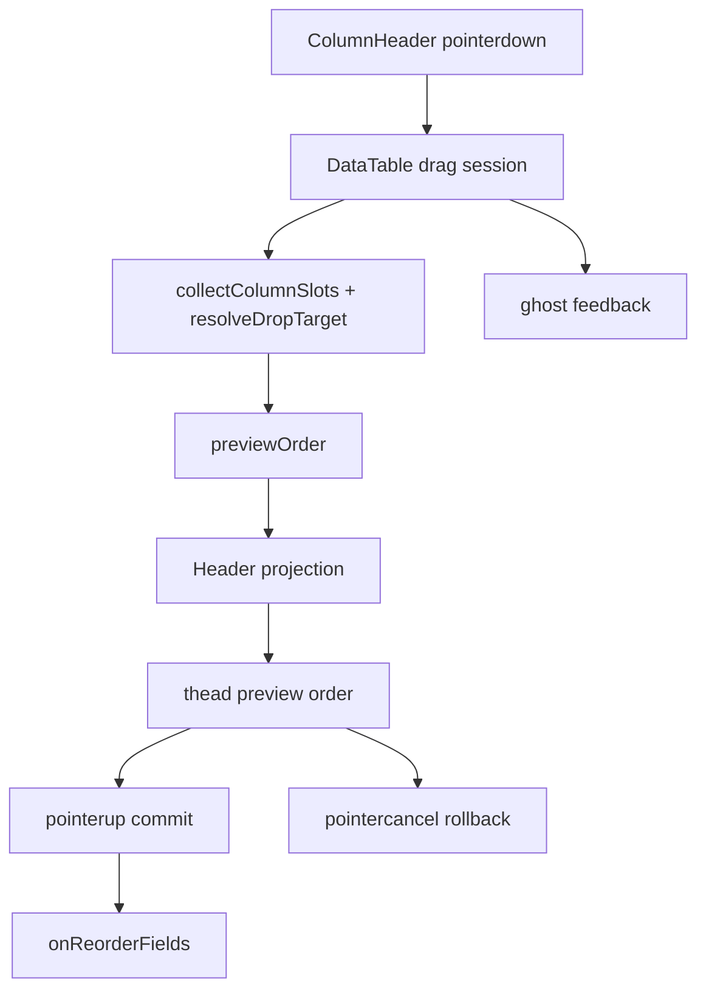

# 列拖拽表头真实重排预览 Implementation Plan

> **For agentic workers:** REQUIRED SUB-SKILL: Use `superpowers:subagent-driven-development` (recommended) or `superpowers:executing-plans` to implement this plan task-by-task. Steps use checkbox (`- [ ]`) syntax for tracking.

**Goal:** 把主表列拖拽从“slot 位移模拟 + 独立 ghost”升级为“`thead` 按 `previewOrder` 真实临时重排、`tbody` 延迟提交”的预览机制，让用户能直接读懂拖拽中的落位结果。

**Architecture:** 保留现有 column drag session、slot 命中和 auto-scroll 几何模型，但把 `previewOrder` 从样式层提升为 `thead` 的直接渲染输入。`DataTable.tsx` 负责 header projection、preview 生命周期和 commit/cancel 收口；`table-columns.tsx` 继续只负责稳定 header view/cell view；`ColumnHeader.tsx` 只负责手势起点与 cancel/commit 分流。

**Tech Stack:** React 18, TypeScript, external store via `useSyncExternalStore`, Node.js `node:test`, Playwright, Vite profiling scripts.

---

## 概述

### 总体目标和范围

本实施计划只覆盖主表列拖拽预览机制重构，不扩展到侧边栏文件树、详情页字段拖拽或统一拖拽内核迁移。目标是把拖拽中的视觉真相收敛到 `previewOrder`：`thead` 直接按预览顺序真实输出 header，ghost 只做跟手镜像，`tbody` 在拖拽期间保持稳定，drop 时才正式提交字段顺序。

### 各阶段任务概要

第一阶段：先锁定纯函数与状态契约。
主要工作是把 `previewOrder`、cancel/commit 语义和 header projection 需要的纯函数锁进单测，避免后面一边改渲染一边猜状态规则。

第二阶段：重构 `DataTable` 的 header projection 主链路。
主要工作是移除 `column-slot transform` 作为主预览机制，让 `thead` 直接按 `previewOrder` 组织 `th`。

第三阶段：收口 `ColumnHeader` 手势出口与样式。
主要工作是把 `pointercancel` 从提交路径中分离，明确 dragging header/ghost/placeholder 的视觉分工。

第四阶段：补 e2e 和性能复测。
主要工作是把“拖拽中 header 已重排、但尚未持久化”的行为写进自动化，并确认没有把高频拖拽成本扩散到整表。

### 整体结构框架



---

## 文件结构

- Modify: `src/table/column-dnd.mjs`
  - 增补 `previewOrder` 相关纯函数，弱化旧 `buildColumnPreviewOffsetMap(...)` 的主职责。
- Modify: `tests/column-dnd.test.mjs`
  - 锁定 preview 顺序、拖拽列保留、目标槽位投影等语义。
- Modify: `src/table/DataTable.tsx`
  - 接入 header projection，分离 preview order 与 ghost state，移除旧 slot transform 主链路。
- Modify: `src/table/table-columns.tsx`
  - 扩展 column drag runtime 接口，补齐 cancel 回调透传。
- Modify: `src/table/ColumnHeader.tsx`
  - 把 `pointercancel` 从提交路径中拆出，显式走 cancel 回滚。
- Modify: `src/styles.css`
  - 收口 dragging header、ghost、placeholder 和 preview 态样式。
- Modify: `tests/data-editor.spec.ts`
  - 增加拖拽中 header 顺序临时变化、cancel 回滚、drop 后才持久化的 e2e。
- Optional Modify: `tests/perf/prototypes-expansion-wrap-observe.mjs`
  - 如现有脚本不便覆盖列拖拽，可补最小拖拽观测。

---

## Task 1: 锁定 preview 纯函数与状态契约

**Files:**
- Modify: `src/table/column-dnd.mjs`
- Modify: `tests/column-dnd.test.mjs`

- [ ] **Step 1: 为 header preview 语义写失败测试**

Update `tests/column-dnd.test.mjs`:

```js
import assert from "node:assert/strict";
import test from "node:test";
import {
  buildColumnPreviewOrderState,
  buildPreviewOrderFromTarget,
  projectHeaderFieldsByPreviewOrder,
} from "../src/table/column-dnd.mjs";

test("projectHeaderFieldsByPreviewOrder returns preview order as the rendered header order", () => {
  const baseOrder = ["id", "status", "title", "tags"];
  const previewOrder = buildPreviewOrderFromTarget(baseOrder, "title", "id", "before");
  assert.deepEqual(projectHeaderFieldsByPreviewOrder(baseOrder, previewOrder), ["title", "id", "status", "tags"]);
});

test("buildColumnPreviewOrderState keeps base and preview orders separate", () => {
  const state = buildColumnPreviewOrderState(["id", "status"], ["status", "id"]);
  assert.deepEqual(state.baseOrder, ["id", "status"]);
  assert.deepEqual(state.previewOrder, ["status", "id"]);
});
```

- [ ] **Step 2: 运行单测并确认失败**

Run:

```powershell
node --test tests/column-dnd.test.mjs
```

Expected:

```text
not ok ... projectHeaderFieldsByPreviewOrder is not a function
```

- [ ] **Step 3: 实现最小纯函数**

Update `src/table/column-dnd.mjs`:

```js
export function buildColumnPreviewOrderState(baseOrder, previewOrder) {
  return {
    baseOrder: [...baseOrder],
    previewOrder: Array.isArray(previewOrder) && previewOrder.length ? [...previewOrder] : [...baseOrder],
  };
}

export function projectHeaderFieldsByPreviewOrder(baseOrder, previewOrder) {
  if (!Array.isArray(previewOrder) || !previewOrder.length) return [...baseOrder];
  const allowed = new Set(baseOrder);
  return previewOrder.filter((field) => allowed.has(field));
}
```

- [ ] **Step 4: 运行单测并确认通过**

Run:

```powershell
node --test tests/column-dnd.test.mjs
```

Expected:

```text
# pass 2
```

- [ ] **Step 5: Commit**

```powershell
git add src/table/column-dnd.mjs tests/column-dnd.test.mjs
git commit -m "补齐列拖拽预览顺序纯函数契约"
```

---

## Task 2: 在 `DataTable` 落地 header projection

**Files:**
- Modify: `src/table/DataTable.tsx`
- Modify: `src/table/column-dnd.mjs`
- Modify: `src/table/table-columns.tsx`

- [ ] **Step 1: 先写一个失败测试，锁定“空 preview 回退到 baseOrder，且 preview 之外的 base 字段按原顺序补尾”**

Append in `tests/column-dnd.test.mjs`:

```js
test("projectHeaderFieldsByPreviewOrder falls back to base order when preview order is empty", () => {
  assert.deepEqual(
    projectHeaderFieldsByPreviewOrder(["id", "status", "title"], []),
    ["id", "status", "title"],
  );
});

test("projectHeaderFieldsByPreviewOrder appends base-only fields in original order", () => {
  assert.deepEqual(
    projectHeaderFieldsByPreviewOrder(["id", "status", "title"], ["title", "id"]),
    ["title", "id", "status"],
  );
});
```

- [ ] **Step 2: 运行单测确认当前辅助函数覆盖不足**

Run:

```powershell
node --test tests/column-dnd.test.mjs
```

Expected:

```text
not ok ... expected [ 'title', 'id', 'status' ]
```

- [ ] **Step 3: 扩展 `projectHeaderFieldsByPreviewOrder(...)`，补齐回退和补尾语义**

Update `src/table/column-dnd.mjs`:

```js
export function projectHeaderFieldsByPreviewOrder(baseOrder, previewOrder) {
  if (!Array.isArray(previewOrder) || !previewOrder.length) return [...baseOrder];
  const allowed = new Set(baseOrder);
  const projected = previewOrder.filter((field) => allowed.has(field));
  const seen = new Set(projected);
  const rest = baseOrder.filter((field) => !seen.has(field));
  return [...projected, ...rest];
}
```

- [ ] **Step 4: 先迁移 preview store 形状，避免后续渲染改造时混用 `order` 和 `previewOrder`**

Update `src/table/DataTable.tsx`:

```tsx
function createColumnDragPreviewStore() {
  let state: { baseOrder: string[]; previewOrder: string[]; ghostLeft: number } = {
    baseOrder: [],
    previewOrder: [],
    ghostLeft: 0,
  };
  const listeners = new Set<() => void>();
  return {
    getState() {
      return state;
    },
    setState(nextState: { baseOrder: string[]; previewOrder: string[]; ghostLeft: number }) {
      if (
        state.baseOrder === nextState.baseOrder &&
        state.previewOrder === nextState.previewOrder &&
        state.ghostLeft === nextState.ghostLeft
      ) return;
      state = nextState;
      listeners.forEach((listener) => listener());
    },
    subscribe(listener: () => {
      listeners.add(listener);
      return () => listeners.delete(listener);
    }),
  };
}
```

And update state writes/reads:

```tsx
columnDragPreviewStoreRef.current.setState({
  baseOrder: [...baseVisibleFields],
  previewOrder: [...baseVisibleFields],
  ghostLeft: rect.left,
});
```

```tsx
const nextPreviewOrder = buildPreviewOrderFromSlots(
  columnDragPreviewStoreRef.current.getState().previewOrder,
  current.draggingField,
  slots,
  pointerX,
);
```

```tsx
columnDragPreviewStoreRef.current.setState({ baseOrder: [], previewOrder: [], ghostLeft: 0 });
```

- [ ] **Step 5: 在 `DataTable.tsx` 引入 header projection 顺序**

Update `src/table/DataTable.tsx` around header rendering:

```tsx
const previewState = useSyncExternalStore(
  columnDragPreviewStoreRef.current.subscribe,
  columnDragPreviewStoreRef.current.getState,
  columnDragPreviewStoreRef.current.getState,
);

const renderedHeaderFields = useMemo(() => {
  if (!columnDragSession) return baseVisibleFields;
  return projectHeaderFieldsByPreviewOrder(baseVisibleFields, previewState.previewOrder);
}, [columnDragSession, baseVisibleFields, previewState.previewOrder]);
```

And replace:

```tsx
{group.headers.map((header) => (
```

with a projected render loop:

```tsx
const headerByField = new Map(group.headers.map((header) => [header.id, header]));

{renderedHeaderFields.map((fieldName) => {
  const header = headerByField.get(fieldName);
  if (!header) return null;
  return (
    <th key={header.id} data-column-field={header.id}>
      {flexRender(header.column.columnDef.header, header.getContext())}
    </th>
  );
})}
```

- [ ] **Step 6: 显式声明当前 projection 只覆盖现有单层 leaf header 结构**

Add a guard comment near the projected `thead` render:

```tsx
// The current table renders a single leaf-header row only.
// Header projection intentionally reorders leaf headers in that row.
```

- [ ] **Step 7: 移除 `MemoColumnPreviewSlot` 作为主预览壳**

Delete the old render wrapper:

```tsx
<MemoColumnPreviewSlot ...>
  {flexRender(...)}
</MemoColumnPreviewSlot>
```

Replace with direct header rendering and, if needed, a lightweight non-transform wrapper:

```tsx
<div className={`column-slot ${columnDragSession?.draggingField === header.id ? "column-slot-placeholder" : ""}`}>
  {flexRender(header.column.columnDef.header, header.getContext())}
</div>
```

- [ ] **Step 8: 运行类型检查**

Run:

```powershell
npx tsc --noEmit
```

Expected:

```text
Done in ...
```

- [ ] **Step 9: 运行单测并确认 projection 纯函数通过**

Run:

```powershell
node --test tests/column-dnd.test.mjs
```

Expected:

```text
all pass
```

- [ ] **Step 10: Commit**

```powershell
git add src/table/DataTable.tsx src/table/column-dnd.mjs src/table/table-columns.tsx tests/column-dnd.test.mjs
git commit -m "改造列拖拽表头预览为真实重排投影"
```

---

## Task 3: 拆分 cancel/commit 语义并收口视觉样式

**Files:**
- Modify: `src/table/ColumnHeader.tsx`
- Modify: `src/styles.css`
- Modify: `src/table/DataTable.tsx`
- Modify: `src/table/table-columns.tsx`
- Modify: `tests/data-editor.spec.ts`

- [ ] **Step 1: 先写失败测试，锁定 `pointercancel` 不提交**

Add to `tests/data-editor.spec.ts`:

```ts
test("column header pointercancel rolls back preview without committing order", async ({ page }) => {
  const before = await page.locator(".column-trigger").evaluateAll((items) => items.map((item) => item.getAttribute("title")).filter(Boolean));
  await beginColumnHeaderDrag(page, "description_zh");
  await moveColumnHeaderDrag(page, "rune_name");
  await cancelColumnHeaderDrag(page);
  const after = await page.locator(".column-trigger").evaluateAll((items) => items.map((item) => item.getAttribute("title")).filter(Boolean));
  expect(after.slice(0, 3)).toEqual(before.slice(0, 3));
});
```

- [ ] **Step 2: 抽出 DataTable 取消回调**

Add a dedicated cancel path in `src/table/DataTable.tsx`:

```tsx
const handleColumnDragCancel = useCallback((fieldName: string) => {
  setPressedField(null);
  columnDragPointerXRef.current = null;
  columnDragAutoScrollDirectionRef.current = 0;
  stopColumnAutoScroll();
  const current = columnDragSessionRef.current;
  if (!current || current.draggingField !== fieldName) return;
  columnDragPreviewStoreRef.current.setState({ baseOrder: [], previewOrder: [], ghostLeft: 0 });
  columnDragSessionRef.current = null;
  setColumnDragSession(null);
}, []);
```

- [ ] **Step 3: 扩展 `table-columns.tsx` runtime 接口，补齐 `onDragCancel` 透传**

Update `src/table/table-columns.tsx`:

```tsx
type TableColumnsRuntime = {
  onDragStart: (fieldName: string, rect: DOMRect, pointerOffsetX: number) => void;
  onDragMove: (fieldName: string, clientX: number) => void;
  onDragEnd: (fieldName: string) => void;
  onDragCancel: (fieldName: string) => void;
  // ...
};
```

And pass it through `TableColumnHeaderView`:

```tsx
<ColumnHeader
  // ...
  onDragStart={runtime.onDragStart}
  onDragMove={runtime.onDragMove}
  onDragEnd={runtime.onDragEnd}
  onDragCancel={runtime.onDragCancel}
  onPressChange={runtime.onPressChange}
/>
```

Also wire it in `src/table/DataTable.tsx` runtime creation:

```tsx
onDragCancel: handleColumnDragCancel,
```

- [ ] **Step 4: 让 `ColumnHeader.tsx` 的 `pointercancel` 显式走取消路径**

Update `src/table/ColumnHeader.tsx`:

```tsx
const onPointerCancel = () => {
  props.onPressChange(props.fieldName, false);
  document.body.classList.remove("is-dragging-column");
  props.onDragCancel(props.fieldName);
  pressStateRef.current = null;
  window.removeEventListener("pointermove", onPointerMove);
  window.removeEventListener("pointerup", onPointerUp);
  window.removeEventListener("pointercancel", onPointerCancel);
};
```

And extend props:

```tsx
onDragCancel: (fieldName: string) => void;
```

- [ ] **Step 5: 调整样式，只保留真实 header + ghost 的视觉分工**

Update `src/styles.css`:

```css
.column-slot.column-slot-previewing {
  position: relative;
  transition: background 120ms ease, box-shadow 120ms ease;
  will-change: auto;
}

.column-header.is-column-dragging .column-trigger {
  opacity: 0.35;
}

.column-slot-placeholder {
  background: #eceae6;
  box-shadow: inset 0 0 0 1px #d7d3cc;
}
```

Delete any rule whose only purpose is moving headers by transform during preview.

- [ ] **Step 6: 运行类型检查和定向测试**

Run:

```powershell
npx tsc --noEmit
$env:DATA_EDITOR_E2E_PORT='8788'; npx playwright test tests/data-editor.spec.ts --grep "column header pointercancel"
```

Expected:

```text
1 passed
```

- [ ] **Step 7: Commit**

```powershell
git add src/table/ColumnHeader.tsx src/table/DataTable.tsx src/table/table-columns.tsx src/styles.css tests/data-editor.spec.ts
git commit -m "拆分列拖拽取消语义并收口预览样式"
```

---

## Task 4: 补拖拽中预览行为的 e2e 与性能复测

**Files:**
- Modify: `tests/data-editor.spec.ts`
- Optional Modify: `tests/perf/prototypes-expansion-wrap-observe.mjs`

- [ ] **Step 1: 增加拖拽中 header 已临时重排、但尚未持久化的 e2e**

Add helpers to `tests/data-editor.spec.ts`:

```ts
async function beginColumnHeaderDrag(page: Page, sourceField: string) {
  const source = page.locator(`.column-trigger[title="${sourceField}"]`);
  const box = await source.boundingBox();
  expect(box).not.toBeNull();
  await page.mouse.move(box!.x + box!.width / 2, box!.y + box!.height / 2);
  await page.mouse.down();
  await page.mouse.move(box!.x + box!.width / 2 - 18, box!.y + box!.height / 2, { steps: 4 });
}

async function moveColumnHeaderDrag(page: Page, targetField: string) {
  const target = page.locator(`.column-trigger[title="${targetField}"]`);
  const box = await target.boundingBox();
  expect(box).not.toBeNull();
  await page.mouse.move(box!.x + box!.width * 0.25, box!.y + box!.height / 2, { steps: 10 });
}

async function cancelColumnHeaderDrag(page: Page) {
  await page.evaluate(() => {
    window.dispatchEvent(new PointerEvent("pointercancel", {
      bubbles: true,
      cancelable: true,
      composed: true,
      pointerId: 1,
      pointerType: "mouse",
      isPrimary: true,
      button: 0,
      buttons: 0,
    }));
  });
}
```

If the repo already has equivalent helpers, prefer reusing them instead of introducing duplicate drag utilities.

- [ ] **Step 2: 写主 e2e 用例**

```ts
test("column header drag previews reordered headers before drop and persists only on release", async ({ page }) => {
  const before = await page.locator(".column-trigger").evaluateAll((items) => items.map((item) => item.getAttribute("title")).filter(Boolean));
  await beginColumnHeaderDrag(page, "description_zh");
  await moveColumnHeaderDrag(page, "rune_name");

  const preview = await page.locator(".column-trigger").evaluateAll((items) => items.map((item) => item.getAttribute("title")).filter(Boolean));
  expect(preview.slice(0, 3)).toEqual(["description_zh", "rune_name", "description"]);

  expect(await page.evaluate(() => localStorage.getItem("data-editor:data/runes.json:$:all:__order"))).not.toContain("description_zh,rune_name,description");

  await page.mouse.up();

  await expect.poll(async () => page.evaluate(() => localStorage.getItem("data-editor:data/runes.json:$:all:__order"))).toContain("description_zh,rune_name,description");
  const after = await page.locator(".column-trigger").evaluateAll((items) => items.map((item) => item.getAttribute("title")).filter(Boolean));
  expect(after.slice(0, 3)).toEqual(["description_zh", "rune_name", "description"]);
});
```

- [ ] **Step 3: 跑定向 e2e**

Run:

```powershell
$env:DATA_EDITOR_E2E_PORT='8788'; npx playwright test tests/data-editor.spec.ts --grep "column header drag previews reordered headers before drop"
```

Expected:

```text
1 passed
```

- [ ] **Step 4: 做拖拽性能观测**

If the existing static script is insufficient, run a focused manual profile:

```powershell
npm run profile:prototypes-expansion:wrap-observe
```

Expected:

```text
verdict: "go"
```

If this script cannot exercise column drag preview, create `tests/perf/column-drag-preview-observe.mjs` that:

```js
await beginColumnHeaderDrag(page, "icon_path");
await moveColumnHeaderDrag(page, "dev_status");
await page.waitForTimeout(120);
```

and verify no table-wide regression signal appears during the move phase.

- [ ] **Step 5: 跑回归测试组合**

Run:

```powershell
npx tsc --noEmit
node --test tests/column-dnd.test.mjs
$env:DATA_EDITOR_E2E_PORT='8788'; npx playwright test tests/data-editor.spec.ts --grep "column header drag|select column dragged"
```

Expected:

```text
all passed
```

- [ ] **Step 6: Commit**

```powershell
git add tests/data-editor.spec.ts tests/column-dnd.test.mjs tests/perf
git commit -m "补齐列拖拽表头真实重排的验证与回归"
```

---

## 收口检查

- [ ] 旧 `buildColumnPreviewOffsetMap(...)` 不再是列拖拽主预览来源。
- [ ] `pointercancel` 不再通过 `onDragEnd(...)` 提交顺序。
- [ ] 拖拽中的 `.column-trigger` DOM 顺序会临时变化。
- [ ] drop 前 `localStorage` 不更新，drop 后才更新。
- [ ] `tbody` 在拖拽进行中不做实时重排。
- [ ] 大数据样本下列拖拽没有明显退回整表级卡顿。

---

## 推荐执行顺序

1. 先完成 Task 1，锁死纯函数与 store 命名，避免中途再改数据形状。
2. 再完成 Task 2，把 `DataTable` 的 header projection 主链路切过去。
3. 然后完成 Task 3，拆掉 cancel/commit 混用并收口样式。
4. 最后完成 Task 4，用 e2e 和 profile 证明行为与性能边界都成立。
