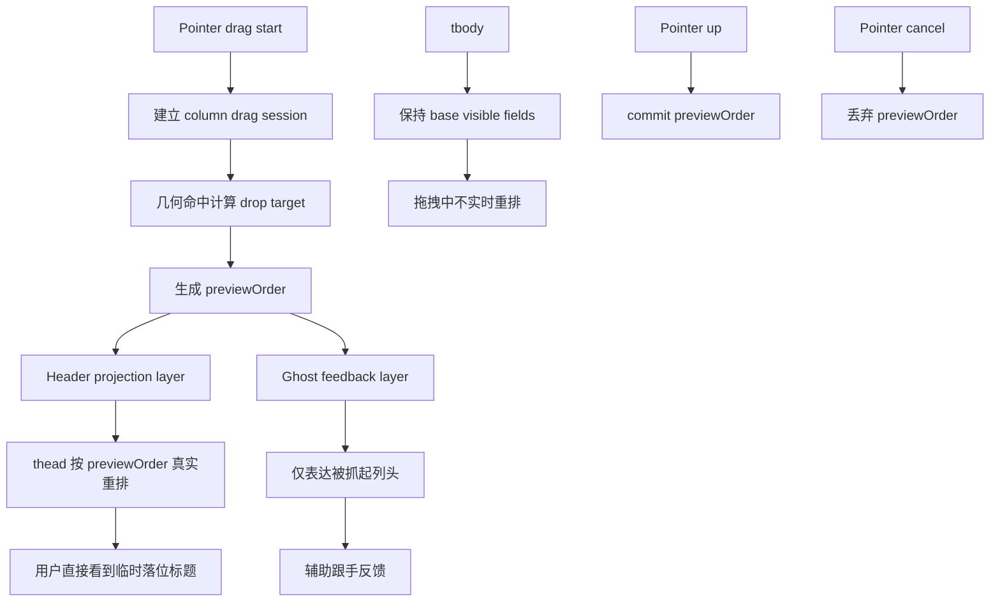

# 列拖拽表头真实重排预览方案

## 方案概述

### 总体目标和范围

本方案目标是把 data-editor 主表当前“位移模拟式”的列拖拽预览，重构为一套真正可读、可判定的表头临时重排预览机制。拖拽过程中，用户应直接在表头区域看到按 `previewOrder` 重排后的真实标题顺序，从而准确判断“当前放手后会落到哪里”，而不是继续依赖 ghost 浮层和原地轻微平移来猜测结果。

本轮范围包括：

- 主表列拖拽过程中 `thead` 的真实临时重排预览。
- 用单一 `previewOrder` 驱动表头预览顺序、落位判断和 ghost 文案。
- 让目标位置直接显示即将落位的列头标题，而不是空占位或原位残影。
- 明确拖拽列本体、ghost 和 placeholder 的单一可视化规则，避免双重表达。
- 保持 `tbody` 在拖拽过程中稳定，仅在 drop 时正式提交列顺序。
- 收口当前 `column-slot transform` 方案，移除其作为主预览机制的职责。
- 补齐单测与 e2e，覆盖 drag preview、cancel、commit 与 auto-scroll 下的表头行为。

本轮范围不包括：

- 不把拖拽中的 `tbody` 一并做实时重排。
- 不把这套机制泛化到侧边栏文件树、详情页字段拖拽或排序弹层。
- 不在本轮把列拖拽整体并入统一拖拽内核。
- 不保留旧的 slot-offset 预览作为兼容路径，旧机制直接退出主链路。

### 各阶段任务概要

第一阶段：固化当前列拖拽预览链路与问题边界。
主要工作是确认 `previewOrder` 当前只停留在样式层、`thead` 仍按原顺序渲染、ghost 承担了过多“结果表达”职责，以及标题被原列框裁切的具体成因。预期成果是把问题定性为“预览模型错误”，而不是局部 CSS 或动画细节问题。

第二阶段：重构表头预览渲染模型。
主要工作是把 `previewOrder` 提升为 `thead` 的直接渲染输入，建立 `field -> header render payload` 的稳定映射，拖拽中按预览顺序真实输出 header，而不是继续输出原顺序 header 后再做 `transform`。预期成果是占位位置能直接显示即将到达的标题，拖拽结果在视觉上变成“预览即结果”。

第三阶段：收口交互细节与视觉反馈。
主要工作是缩减 ghost 职责、校准 placeholder / dragging 态样式、处理 auto-scroll 下的 preview 稳定性，并明确 resize、menu、sort 与 drag 的优先级边界。预期成果是拖拽过程稳定可信，不再出现标题闪回、跳位或“被自己列框截断”的残影。

第四阶段：补测试与性能回归验证。
主要工作是更新单测与 e2e，让自动化直接断言“拖拽中 header 顺序已临时改变”，并确认这次重构没有把第五阶段已经完成的表格性能治理打坏。预期成果是后续再改列表格渲染或拖拽细节时，不会回退到旧的位移模拟方案。

执行顺序为：现状固化 -> 表头预览重构 -> 交互与视觉收口 -> 测试与性能回归。

### 整体结构框架

---

## 背景与现状

当前主表列拖拽主链路位于 `src/table/DataTable.tsx`、`src/table/column-dnd.mjs` 与 `src/table/ColumnHeader.tsx`。

现有实现已经把“高频拖拽状态”从 React 普通 state 中抽离出来一部分，避免了每次 pointer move 都触发表格主体大面积刷新；但预览表达仍沿用“原顺序 header + 独立 ghost + slot transform 位移”的组合模型。

现状的关键特征是：

1. `previewOrder` 已经存在，但它只用于计算横向偏移量，不直接驱动 `thead` 的真实输出顺序。
2. `thead` 仍按 react-table 原始 header 顺序渲染。
3. 真实被拖动的列头内容主要通过独立 `column-drag-ghost` 呈现。
4. 其它列头只是通过 `translate3d(...)` 做左右让位。
5. 因为标题内容仍活在原 `th` / slot 布局上下文里，所以会被原列宽和容器边界裁切。

因此，当前体验天然更接近“移动中的视觉提示”，而不是“放手后的真实落位预览”。

---

## 当前问题拆解

### 1. 预览顺序停留在样式层，没有进入渲染层

当前 `buildPreviewOrderFromSlots(...)` 可以实时算出拖拽中的顺序，但它最终只流向 `buildColumnPreviewOffsetMap(...)`，再生成每一列的横向位移。

这意味着：

- 预览结果没有变成 header DOM 顺序。
- 占位位置不会真正渲染“临时过来的列头”。
- 用户看到的是位移，而不是重排。

### 2. 真实预览职责被 ghost 和 slot 分裂

被抓起的列头内容在 ghost 中跟随鼠标，而原表头区仍保留一套原地 header。这样虽然能给出拖拽中的运动反馈，但“当前顺序到底是什么”被拆成了两套视觉对象，阅读成本很高。

用户必须同时理解：

- 哪个是正在被抓起的列头
- 哪些列只是被挤开
- 空出来的位置最终是不是目标位置

这正是当前“无法判定是否移动成功”的核心原因。

### 3. 标题被原列框裁切是模型副作用，不是独立样式 bug

因为 `ColumnHeader` 仍在原 `th` 里渲染，slot 也仍对应原列宽与原布局边界，所以哪怕做了 transform，标题本质上没有真正进入目标位置的布局上下文。

结果就是：

- 只是左右轻微平移
- 标题仍被自己原来的盒子裁切
- 即便视觉上“靠近”目标位置，也不像真正落进了那个槽位

### 4. 当前自动化契约只验证最终顺序，不验证拖拽中的真实预览

现有测试重点仍是：

- drop 之后顺序是否提交成功
- reload 之后顺序是否持久化成功

但它没有把“拖拽中表头应该真实重排”写成行为契约。因此即使现在的预览体验不达标，自动化也不会失败。

---

## 需求收敛

本轮需求可以收敛成一句话：

> 列拖拽过程中，`thead` 必须按 `previewOrder` 做真实临时重排渲染，让用户直接看到即将提交的列头顺序；`tbody` 保持稳定，仅在 drop 时正式提交。

这一定义包含五个具体要求：

1. 表头目标槽位直接显示即将落位的标题。
2. 被挪开的表头进入各自临时位置，而不是只做让位动画。
3. ghost 只负责“被抓起列”的跟手反馈，不再负责表达整体预览结果。
4. cancel 时回退到原顺序，commit 时一次性提交。
5. 不把高频拖拽代价重新扩散到整表 body。

---

## 方案选型

### 方案 A：仅表头真实重排预览，body 延迟提交

做法：

- 拖拽中生成 `previewOrder`。
- `thead` 按 `previewOrder` 重排渲染。
- `tbody` 继续按正式 `visibleFields` 渲染。
- pointer up 后调用已有字段重排提交逻辑。

优点：

- 用户能直接读懂即将落位的位置和标题。
- 改动集中在 header 预览层，风险可控。
- 不会把 drag move 的代价重新打回整表 body。

缺点：

- 拖拽中 header 与 body 顺序短暂不一致。

### 方案 B：thead + tbody 一起实时重排

做法：

- 拖拽中整张表按 `previewOrder` 实时刷新。

优点：

- 视觉最彻底一致。

缺点：

- 高频拖拽成本显著上升。
- 容易破坏前面已经完成的性能治理收益。
- 大数据表格下风险远高于收益。

### 方案 C：继续沿用当前 slot transform，只增强样式和动画

做法：

- 保留现有预览模型，只优化 placeholder、动画、裁切样式。

优点：

- 实现成本低。

缺点：

- 无法解决“预览即结果”的核心诉求。
- 目标槽位仍不会真实替换标题。
- 只是在旧模型上继续堆补丁。

### 推荐方案

推荐采用方案 A：**表头真实重排预览，body 延迟提交**。

这是当前体验问题与性能边界之间最合理的平衡点：用户最关心的是“我现在将落到哪里”，而不是拖拽过程中 body 也同步重排。只要表头预览足够真实，核心可用性问题就已经解决。

---

## 重构设计

### 1. 预览状态模型

当前拖拽预览 store 主要维护：

- `order`
- `ghostLeft`

本轮应把它升级为更明确的预览状态：

- `baseOrder`
- `previewOrder`
- `draggingField`
- `ghostLeft`
- `dropTarget`

其中最关键的变化是：`previewOrder` 不再只是几何推导的中间产物，而是进入 header 渲染层的正式输入。

### 2. Header Projection Layer

新增一层“表头投影层”，职责是：

- 维护 `fieldName -> header render payload`
- 在拖拽中根据 `previewOrder` 决定 `thead` 实际输出顺序
- 保持 header view 的稳定 identity，避免每次 pointer move 都重建整套 header renderer

这层的重点不是引入新 UI，而是把“拖拽预览顺序”从样式层上提到渲染层。

它的实现边界应明确为：

- 投影顺序编排放在 `src/table/DataTable.tsx`，因为这里已经持有 drag session、preview store、`baseVisibleFields` 与 `thead` 输出链路。
- `src/table/table-columns.tsx` 继续负责稳定的 header view / cell view 生产，不直接承担拖拽中的顺序控制。
- 不在 `table-columns` 和 `DataTable` 两侧同时维护两套“header 顺序来源”，避免形成双源。

### 3. `thead` 重排而非 slot 位移

当前模型是：

- 原顺序渲染 `th`
- 每个 `th` 内部包一个 `column-slot`
- `column-slot` 再按 offset 做 `transform`

调整后应改成：

- 直接按 `previewOrder` 组织 `th`
- `th` 本身就处于预览位置
- 旧的 slot transform 逻辑不再承担主预览职责

这样占位位置看到的将不再是空壳，而是真实的目标列头。

### 3.1 拖拽列的可视化规则

本轮必须把拖拽中的三种视觉对象定死，避免实现时自由发挥：

- `previewOrder` 中的目标槽位直接渲染真实 header 内容。
- 被拖拽列在 `thead` 中仍保留真实 header，但进入 `isDragging` 态，使用低透明度或弱化样式表示“该列正在被抓起”。
- ghost 仅作为跟手镜像，表达“当前抓着的是哪一列”，不再承担整体顺序预览职责。
- 不引入“目标槽位空 placeholder + ghost 代替真实标题”的旧模式。
- 如果保留 placeholder，它只能承担背景强调或边框提示，不能替代标题内容本身。

这样用户在表头上读到的顺序就是预期落位顺序，ghost 只是辅助手势反馈，而不是结果来源。

### 4. Ghost 职责收窄

ghost 保留，但职责收窄为：

- 表达“当前手里抓着的是哪一列”
- 给出跟手反馈

ghost 不再承担：

- 表达整体预览顺序
- 代替目标槽位显示最终位置

换句话说，ghost 变成辅助手势反馈，而不是预览真相来源。

### 5. `tbody` 保持稳定

`tbody` 继续使用正式 `visibleFields` 和当前稳定的 cell 渲染链路。拖拽过程中不实时重排 body，只在 drop commit 后才进入正式列顺序更新。

这样可以守住两条边界：

- 交互上，用户已经能从 header 读懂结果。
- 性能上，不把 drag move 放大为整表列重排。

### 5.1 列宽语义

本轮需要明确：拖拽中的 header 预览使用“目标槽位宽度”，而不是“被拖拽字段原宽度跟着走”的模型。

原因是：

- 当前表格宽度仍由 `colgroup + visibleFields` 决定。
- `tbody` 在拖拽过程中保持正式顺序不动。
- 因此 `thead` 临时重排时，header 应占用当前槽位的布局宽度，直接表达“落在这里后会如何显示”。

这既符合用户对落位预览的预期，也避免在拖拽过程中额外引入“列宽一起迁移”的复杂几何模型。

---

## 文件级落点

### `src/table/DataTable.tsx`

主要承担：

- 拖拽 session 生命周期
- `previewOrder` 更新
- `thead` 渲染顺序切换
- ghost 渲染与 commit / cancel 收口

这一文件会是本轮主修改入口。

### `src/table/column-dnd.mjs`

继续承担：

- slot 收集
- drop target 计算
- `previewOrder` 生成

但不再让 `buildColumnPreviewOffsetMap(...)` 作为主预览机制核心。它要么退场，要么退化为仅服务过渡样式的辅助工具。

### `src/table/table-columns.tsx`

继续承担：

- 稳定的 header view / cell view 输出
- 列模型与 header 渲染载荷的局部 memo

如果要新增 header projection 所需的稳定映射，这里可能需要配合收口。

### `src/styles.css`

主要承担：

- dragging header 占位样式
- preview 态层级与反馈
- 删除或弱化旧的 slot-previewing 位移样式

### `tests/column-dnd.test.mjs`

应补：

- `previewOrder` 到 header projection 的语义断言
- cancel / commit 对预览状态的影响

### `tests/data-editor.spec.ts`

应补：

- 拖拽进行中 header 顺序已临时变化
- cancel 后 header 立即回滚
- drop 后 header 顺序与持久化顺序一致
- auto-scroll 场景下预览顺序仍可读

---

## 行为契约

### Drag Start

- 建立 drag session
- 初始化 `baseOrder` 与 `previewOrder`
- 显示 ghost
- `thead` 进入 preview 模式

### Drag Move

- 基于 pointer 与 slots 计算 `dropTarget`
- 生成新的 `previewOrder`
- `thead` 按新顺序立即重排
- `tbody` 不变

### Drag Cancel

- 清空 `previewOrder`
- 隐藏 ghost
- `thead` 回到正式顺序
- 不触发字段顺序提交

### Cancel Matrix

以下情况统一视为 cancel，不得提交字段顺序：

- 浏览器触发 `pointercancel`
- 指针离开窗口或交互被系统中断，最终未完成有效 drop
- 进入拖拽后被外部交互打断，且当前链路无法保证有效落位
- 后续若补充 `Esc` 取消快捷键，也归入同一 cancel 语义

以下情况不算 cancel：

- 未过拖拽阈值直接松手：按普通点击处理，可继续打开列菜单
- 已过拖拽阈值并正常 `pointerup`：按 commit 处理

实现时必须保证 `onPointerCancel` 不再走当前的“复用 onDragEnd 提交”语义，而是显式走取消路径。

### Drag Commit

- 将当前 `previewOrder` 提交给 `onReorderFields(...)`
- 清空预览态
- 等正式顺序刷新后，`thead` 与 `tbody` 再次一致

---

## 风险与边界

### 风险一：拖拽中 header / body 短暂不一致

这是刻意接受的架构权衡，而不是缺陷。因为本轮目标是先解决“用户看不懂当前落位”，同时守住大数据表格下的性能边界。

### 风险二：header 渲染 identity 处理不好会丢失当前 memo 收益

如果拖拽中直接粗暴重建整套 header renderer，可能会把当前已经做过的列模型稳定化收益抵消掉。因此 projection 层必须建立在已有稳定 header payload 之上，而不是每帧重造列定义。

### 风险三：auto-scroll 会持续改变 slot 几何

拖拽靠近边缘时，scrollLeft 会变化，slot 几何也会跟着变。必须保证 preview 更新链路在 auto-scroll 下仍使用最新的 slots，否则容易出现落位跳动。

### 风险四：旧 transform 预览逻辑残留会制造双重表达

如果新旧方案并存，就会出现“真实 header 已重排，但 slot 还在继续位移”的双重视觉。由于项目当前允许直接重构，不做兼容双轨，因此本轮应直接清理旧主链路。

### 风险五：缺少高频拖拽阶段的性能验证，会让“没回退”停留在主观判断

当前自动化更偏向验证 drop 后顺序是否正确，而不是 drag move 高频阶段的重排代价。如果本轮只验证行为，不补性能观察，就可能在功能正确的情况下把 header 高频刷新成本 silently 拉高。

---

## 验收标准

达到以下条件，才能认为本轮方案落地成功：

1. 拖拽过程中，目标位置直接显示即将落位的列头标题。
2. 被挪开的列头进入各自临时位置，不再只是轻微让位。
3. 不再出现“标题固定在原列头里，只是左右晃动”的旧体验。
4. cancel 后立即回到原顺序，drop 后顺序提交正确并可持久化。
5. 大数据场景下拖拽过程中没有明显回退到整表级卡顿。
6. 自动化测试明确覆盖“拖拽中 header 已真实临时重排”这一行为契约。

---

## 验证计划

### 行为验证

- 单测验证 `previewOrder` 生成、cancel 回滚、commit 提交三条基本语义。
- e2e 验证拖拽进行中 `.column-trigger` 的 DOM 顺序已临时变化，而对应 `localStorage` 排序值尚未写入。
- e2e 验证 cancel 后 header 顺序立即恢复，drop 后才持久化。
- e2e 验证 auto-scroll 场景下 header 临时顺序仍能正确变化。

### 性能验证

- 至少补一次针对列拖拽过程的 profile / observe 复测，重点观察 drag move 期间是否出现整表级 rerender 或明显掉帧。
- 若已有 `wrap-observe` 类脚本不适合覆盖拖拽，应新增或临时补一条只针对 column drag preview 的观测脚本。
- 验证重点不是把拖拽做到零刷新，而是确认高频变更仍局限在 header 预览层与 ghost 层，没有把 `tbody` 和大批 cell consumer 一起唤醒。

只有当行为验证和性能验证都通过，才能声称这次重构真正达成了“更可读且不回退性能边界”。

---

## 结论

当前列拖拽体验的问题，根因不在于某个动画参数或 CSS 样式，而在于预览模型仍停留在“原顺序渲染 + 视觉位移模拟”的阶段。只要 `previewOrder` 继续停留在样式层，用户就仍然需要靠猜测理解结果。

因此，本轮正确方向不是继续修补 slot transform，而是把 `previewOrder` 升格为 `thead` 的真实渲染输入，建立一套**表头真实临时重排、表体延迟提交**的拖拽预览机制。这样既能直接解决可判定性问题，也能维持当前大数据表格下已经建立起来的性能边界。
