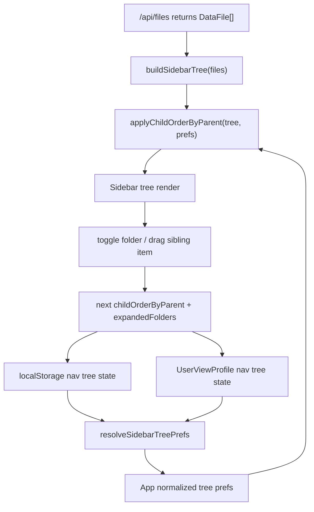

# 左侧文件树与视图排序方案

## 方案概述

### 总体目标和范围

目标是在左侧 `Files` 区域引入真实目录树浏览体验，并支持用户自定义导航顺序，同时保持磁盘目录、文件归属和服务端文件发现逻辑不变。

本方案覆盖：

- 基于现有 `DataFile.path` / `displayPath` 构建真实文件夹树。
- 第一层按 `data source` 分组；仅有 1 个 `data source` 时默认隐藏该层。
- 同一父节点下文件夹与文件混排显示，并允许同级拖拽排序。
- 文件夹展开状态、同级子项排序状态在 `localStorage` 与个人 `profile` 中持久化。
- 与当前选中文件、现有文件打开逻辑、现有 `Sidebar` 拖拽交互衔接。

本方案不覆盖：

- 不移动、重命名、创建或删除真实磁盘文件夹/文件。
- 不修改 `/api/files` 返回结构，不要求服务端额外返回 folder 节点。
- 不显示没有任何数据文件叶子的空文件夹。
- 不把导航树排序或展开状态写入共享 `ViewConfig` / shared views。
- 不支持跨父节点拖拽，不支持用拖拽改变文件归属。

### 各阶段任务概要

1. **树模型阶段**：新增纯函数，把扁平 `DataFile[]` 投影成带 `data source`、文件夹、文件节点的导航树，并支持根据同级排序状态输出稳定顺序。
2. **状态模型阶段**：把当前一维 `fileOrder` 升级为“按父节点记录子项顺序”的 `childOrderByParent`，再补 `expandedFolders` 持久化。
3. **应用接入阶段**：`App.tsx` 统一读取/保存树导航偏好，负责把本地模式与 profile 模式的状态归一化后传给 `Sidebar`。
4. **交互阶段**：`Sidebar` 改成树渲染，支持展开/折叠、自动展开当前选中文件祖先链、同级拖拽预览与提交。
5. **验证阶段**：补纯函数测试、状态持久化测试、最小 e2e，确认刷新后树状态恢复、单 data source 隐藏分组、同级拖拽边界成立。

### 整体结构框架



---

## 背景与当前约束

- [src/file-service.mjs](C:/Code/data-editor/src/file-service.mjs:72) 已经递归扫描真实目录，并返回 `path`、`displayPath`、`dataSourceId`、`dataSourceLabel`。
- [src/components/Sidebar.tsx](C:/Code/data-editor/src/components/Sidebar.tsx:24) 当前只渲染平铺文件按钮，没有文件夹节点或展开状态。
- [src/file-order.mjs](C:/Code/data-editor/src/file-order.mjs:5) 当前排序模型是单一全局 `fileOrder`，不具备“按父节点独立排序”的语义。
- [src/App.tsx](C:/Code/data-editor/src/App.tsx:4109) 当前 profile 顶层已承载侧栏宽度、详情宽度、`fileOrder` 等个人偏好，适合作为树导航偏好的承载层。

因此，这次不能继续把树排序硬塞进单一 `fileOrder`；否则无法满足“只允许同级拖拽、拖拽不影响别的父节点”的需求。

---

## 需求规则

1. 左侧显示真实文件夹树，文件夹由真实 `path` 分段推导，不是虚构分类。
2. 第一层按 `data source` 分组显示；如果项目只有 1 个 `data source`，默认隐藏该分组层，直接显示该 source 根下子项。
3. 在任一父节点下，文件夹和文件混排显示。
4. 同级文件夹和文件都支持拖拽排序。
5. 拖拽只允许发生在同一父节点内：
   - 可以调整同级文件夹与文件的先后顺序。
   - 不允许拖到别的文件夹。
   - 不允许提升到父级或降到子级。
6. 拖拽只影响导航显示顺序：
   - 不影响真实磁盘结构。
   - 不影响文件归属。
   - 不影响服务端 `/api/files` 的原始发现结果。
7. 文件夹展开/折叠状态刷新后保留。
8. 当前选中文件的祖先链自动展开，但不应覆盖用户手动展开的其他目录。
9. 排序和展开状态属于用户自己的视图偏好：
   - local 模式走 `localStorage`。
   - profile 模式进入个人 `UserViewProfile`。
   - 不进入共享配置。
10. 当当前选中文件丢失或为空时，应用应按树的当前显示顺序选择第一个可见 `file` 叶子作为 fallback 打开项。
11. 空文件夹不会显示，因为当前树完全由 `/api/files` 返回的文件路径推导，无法感知没有任何叶子文件的真实目录。

---

## 数据模型

### 节点模型

建议新增树节点纯类型，供 `Sidebar` 与排序纯函数使用：

```ts
type SidebarTreeNode =
  | {
      kind: "source";
      id: string;
      label: string;
      parentId: null;
      children: SidebarTreeNode[];
    }
  | {
      kind: "folder";
      id: string;
      label: string;
      parentId: string;
      children: SidebarTreeNode[];
      dataSourceId: string;
      folderPath: string;
    }
  | {
      kind: "file";
      id: string;
      label: string;
      parentId: string;
      dataSourceId: string;
      filePath: string;
      file: DataFile;
    };
```

其中：

- `source` 节点只在多 `data source` 模式下参与显示。
- `folder` 节点由真实路径分段推导。
- `file` 节点仍然持有原始 `DataFile`，便于复用当前打开文件逻辑。
- 所有排序和展开状态都基于稳定 `id` 操作，而不是 DOM 顺序。

### 节点 ID 规则

`childOrderByParent` 与展开状态都依赖稳定主键，因此需要在方案里固定编码规则：

- `source` 节点：`source:<dataSourceId>`
- `folder` 节点：`folder:<dataSourceId>/<normalized-folder-path>`
- `file` 节点：`file:<virtual-file-path>`

约束：

- 一律使用 `/` 作为分隔符。
- `normalized-folder-path` 使用 `displayPath` 的目录部分；不带首尾 `/`。
- `virtual-file-path` 直接使用现有 `DataFile.path`，例如 `data/items/potion.json`。
- 单 `data source` 隐藏首层只影响渲染，不影响 `source:<id>` 作为内部根节点 id。

这样可以保证：

- 同一个真实目录在刷新、切换 profile、切换展开状态后有稳定 id。
- 多 source 下同名目录不会冲突。
- 1 source 与 multi-source 两种显示形态切换时，排序状态不丢失。

### 偏好模型

建议把导航树偏好建成独立结构：

```ts
type SidebarTreePreferences = {
  childOrderByParent: Record<string, string[]>;
  expandedNodeIds: string[];
};
```

语义：

- `childOrderByParent[parentId]` 只记录该父节点直属子项的顺序。
- 子项 id 可以同时包含 folder 与 file。
- 未记录的父节点回退到默认顺序。
- `expandedNodeIds` 保存已展开 folder/source 节点 id；自动展开当前选中文件祖先链时，在渲染层合并，不必强制写回持久化。

### 默认顺序

当某个父节点没有用户自定义顺序时，建议默认顺序为：

1. 按原始路径层级构树后的自然插入顺序。
2. 同层若要稳定，可退化为 `label` + `kind` 的稳定字典序。

这里的关键不是默认规则本身，而是：

- 一旦用户拖拽过某个父节点，该父节点后续只受自己的 `childOrderByParent[parentId]` 控制。
- 某个父节点的顺序变更不应扩散到其他父节点。

### 默认打开文件规则

当前应用仍需要一个稳定的“默认打开哪个文件”规则。新树方案应明确替代旧 `fileOrder` 的 fallback 语义：

1. 如果当前 `selectedPath` 仍然存在，保持该文件。
2. 如果当前 `selectedPath` 丢失，按当前树的显示顺序深度优先遍历。
3. 取遍历遇到的第一个可见 `file` 叶子作为新的 fallback 打开项。
4. 多 `data source` 时，遵循 source 根节点及其子项的当前显示顺序，而不是服务端原始返回顺序。

这样可以保证：

- 刷新后默认打开文件与用户可见导航顺序一致。
- 排序状态真正影响“默认工作上下文”。
- 不再依赖旧 `fileOrder` 作为首个文件选择来源。

---

## 持久化边界

### localStorage

当前已有 `data-editor:__file-order`。本方案建议不要在其上叠加树语义，而是新增独立 key，例如：

- `data-editor:__sidebar-tree-prefs`

本方案直接定稿为单对象 key，原因是读写和迁移边界更清楚，也更容易与 profile 端共用同一套 normalize/serialize 逻辑。

### UserViewProfile

建议在 `UserViewProfile` 顶层新增字段，例如：

```ts
sidebarTree?: {
  childOrderByParent: Record<string, string[]>;
  expandedNodeIds: string[];
};
```

原因：

- 它和 `sidebarWidth`、`detailPanelWidth` 一样，属于侧栏级导航偏好。
- 不属于某个 collection 的字段布局，不应塞进 `viewLayouts` 或 `collections`。
- 与共享视图配置职责边界清楚。

### 兼容策略

项目仍可能存在旧 `fileOrder` 数据。由于当前处于早期阶段，本方案采用单一策略：

- 新树功能启用后，`Sidebar` 不再消费旧 `fileOrder`。
- 旧 `fileOrder` 不做自动迁移投影。
- 用户在新树模型下重新整理导航顺序。
- `normalizeViewProfile()` 仍可容忍旧 profile JSON 中存在 `fileOrder` 字段，但该字段不再参与左侧导航树渲染。

这样做的好处是边界单一：

- 不需要长期双写或双读。
- 不需要解释“旧全局顺序如何拆到多个父节点”。
- 与项目当前“早期重构不做防御性兼容”的原则一致。

---

## 组件与模块改造

### `src/file-order.mjs`

现有文件顺序纯函数职责不再匹配树模型。建议：

- 保留旧函数，避免影响其他逻辑。
- 新增独立树导航纯函数模块，例如 `src/sidebar-tree-order.mjs`。

该模块负责：

- 根据 `DataFile[]` 构建树节点。
- 归一化 `childOrderByParent`。
- 归一化 `expandedNodeIds`。
- 在同一父节点内移动子项。
- 解析某个节点祖先链。
- 按当前树显示顺序解析 fallback 文件。

### `src/App.tsx`

`App` 负责：

- 从 local/profile 读取树导航偏好。
- 根据 `files` 构建与排序树数据。
- 把选中文件路径转换成祖先链信息传给 `Sidebar`。
- 当当前文件失效时，按树显示顺序解析新的 fallback 打开项。
- 处理拖拽提交、展开状态切换和持久化。

注意：

- 不应让 `Sidebar` 自己决定持久化。
- `App` 仍是偏好状态与文件打开状态的总边界。

### `src/components/Sidebar.tsx`

`Sidebar` 需要从“平铺列表”改成“树节点递归渲染”：

- 渲染 source / folder / file 三类节点。
- folder/source 节点支持展开按钮。
- file 节点继续保持当前 `onSelectFile(file.path)` 语义。
- 拖拽命中只允许在当前父节点可见兄弟项范围内生效。

对于单 `data source` 隐藏第一层的规则：

- 构树时仍可保留 source 根节点；
- 渲染时如果 source 数量为 1，则直接渲染其 children。

这样可以避免内部数据结构分叉。

---

## 拖拽交互规则

1. 只允许同一父节点下的兄弟节点互相调整顺序。
2. 如果拖拽目标不在同一父节点内，则预览无效，释放后不提交。
3. folder 与 file 可互相前后插入，因为需求已明确“同层级应支持拖动排序”。
4. 被折叠目录的子项不参与当前层拖拽命中。
5. 展开/折叠点击与拖拽起手要隔离，避免拖拽触发展开按钮误点。
6. 拖拽结束后仍需保留现有 click suppression，避免松手误打开文件。

---

## 测试范围

### 单元测试

- 树构建：
  - 多 source。
  - 单 source 隐藏分组时的渲染输入。
  - 多层文件夹。
- 顺序归一化：
  - 旧节点丢失时过滤。
  - 新节点追加。
  - 某父节点排序不影响其他父节点。
- 默认打开文件：
  - 当前文件存在时保持不变。
  - 当前文件失效时按树显示顺序选第一个 file。
- 祖先链解析：
  - 当前选中文件自动展开链路正确。

### 状态持久化测试

- local 模式下 `childOrderByParent` / `expandedNodeIds` 写入与恢复。
- profile 模式下顶层 `sidebarTree` 保存与读取。
- shared view reset 不清除导航树偏好。
- 旧 `fileOrder` 存在时不会再驱动树渲染顺序。

### e2e 测试

- 多 `data source` 时显示第一层分组。
- 单 `data source` 时隐藏第一层分组。
- 展开某文件夹后刷新，状态保留。
- 当前选中文件刷新后其祖先链自动展开。
- 在同一父节点内拖动 file / folder 成功并持久化。
- 试图跨父节点拖拽时不生效。
- 空文件夹不显示。

---

## 风险与建议

### 风险

1. 现有 `Sidebar` 拖拽逻辑基于平铺按钮列表，迁移到树后，命中计算和预览范围会复杂化。
2. 默认打开文件的来源从旧 `fileOrder` 切到树显示顺序后，需要补足单测和 e2e，避免刷新后上下文漂移。
3. 多 source 与单 source 隐藏第一层是显示层规则，不应污染内部树 id 设计。

### 建议

1. 把“树构建”和“树排序”抽成纯函数模块，先用 `node:test` 锁住。
2. `Sidebar` 只消费已经排序好的树和回调，不承担状态归一化职责。
3. 直接废弃旧 `fileOrder` 作为 Sidebar 来源，避免长期双写。

---

## 推荐落地顺序

1. 先写树节点与排序纯函数测试。
2. 再定义 `SidebarTreePreferences` 的 local/profile 持久化。
3. 然后改 `App.tsx` 接入新状态。
4. 最后改 `Sidebar.tsx` 和拖拽交互。
5. 以 e2e 验证“展开保留 + 同级拖拽 + 单 source 隐藏分组”为主收口。
