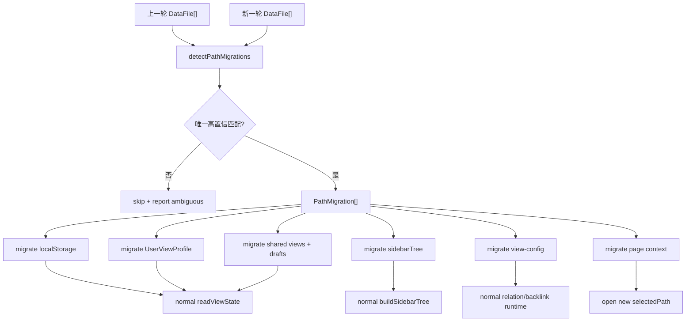

# 文件路径变更配置迁移方案

## 方案概述

### 总体目标和范围

目标是在数据文件被移动、重命名或随文件夹整体移动后，让 data-editor 已保存的个人视图配置和项目配置能够跟随文件路径迁移，避免列宽、列顺序、隐藏列、筛选、排序、当前打开文件、文件树展开/排序等状态因为 `path` 改变而表现为“丢失”。

本方案覆盖：

- 文件路径变更的高置信识别。
- 本地 `localStorage` 视图状态迁移。
- 个人 `UserViewProfile` 视图状态迁移。
- shared view draft / last active view / view order draft 的 key 迁移。
- shared views 正式配置中的 collection key 迁移。
- 文件树 `sidebarTree` 偏好的 file node 与 folder node id 迁移。
- 当前打开文件和页面上下文迁移。
- 项目级配置中以文件路径为 key 的 relation、backlink、primary key、field view config 迁移。
- 单测、e2e 和冲突保护策略。

本方案不覆盖：

- 不把所有配置身份立即改成全局不可变文件 ID。
- 不在第一版实现复杂人工合并 UI。
- 不自动迁移低置信或多候选匹配的文件。
- 不把不同文件内容相同但语义不同的场景强行合并。
- 不改变真实磁盘文件移动行为，data-editor 只响应已经发生的文件列表变化。

### 各阶段任务概要

第一阶段：固化路径身份问题与迁移边界。

主要工作是梳理所有使用 `path` / `collectionConfigKey(path, collectionPath)` 的配置面，明确哪些配置必须跟随文件路径迁移，哪些配置只能在高置信匹配时迁移。预期成果是形成一份完整的配置迁移 surface 清单，避免只修列宽但漏掉排序、shared draft 或 relation。

第二阶段：新增路径迁移核心模块。

主要工作是实现 `PathMigration`、文件 fingerprint 缓存、surface 专用 key rewrite、sidebar node id rewrite、migration report 等纯函数。预期成果是迁移规则可以在不启动 React UI 的情况下独立测试，并避免用脆弱的字符串替换误改 key。

第三阶段：接入文件列表刷新流程。

主要工作是在 `/api/files` 刷新后、`selectedPath` fallback 前，比较上一轮 files 与新 files，推断 `oldPath -> newPath`，并先执行配置迁移，再进入正常打开文件流程。预期成果是用户移动文件后刷新，当前文件和配置都自动落到新路径。

第四阶段：迁移本地、profile、shared views 和项目级配置。

主要工作是分别迁移 `localStorage`、`UserViewProfile`、shared views 正式配置、shared draft、page context、sidebarTree、view-config 中的路径引用。预期成果是列宽、排序、筛选、文件树状态、字段类型、primary key、relation/backlink 等路径相关配置一致迁移。

第五阶段：补冲突保护、可观测性和回归测试。

主要工作是为多候选、低置信、跨 data source、批量文件夹移动建立跳过策略和测试，并在开发日志或 UI 状态中暴露迁移结果。预期成果是能自动迁移确定场景，同时不误迁移不确定场景。

### 整体结构框架



---

## 背景与根因

当前 data-editor 的视图状态身份主要由文件路径决定。

[collectionConfigKey](C:/Code/data-editor/src/view-state-storage.mjs:27) 当前实现是：

```js
export function collectionConfigKey(path, collectionPath) {
  return `${path}:${collectionPath}`;
}
```

这意味着同一个文件移动前后会变成两个不同的配置身份：

```text
旧 key：data/old-folder/runes.json:$
新 key：data/new-folder/runes.json:$
```

本地模式下，列宽、隐藏列、列顺序等 layout 状态会继续挂在旧 localStorage 前缀下：

```text
data-editor:data/old-folder/runes.json:$:<viewId>:description:width
```

profile 模式下，layout 状态会继续挂在旧 profile key 下：

```json
{
  "viewLayouts": {
    "data/old-folder/runes.json:$": {
      "all": {
        "widths": {
          "description": 320
        }
      }
    }
  }
}
```

文件移动后，系统用新路径读取状态，自然读不到旧 key，于是表现为列宽、排序、筛选、隐藏列等配置丢失。

这不是配置真的丢了，而是缺少路径迁移。

---

## 设计原则

### 保留 path 作为运行时身份，但补迁移层

短期内不建议直接把 view layout 的主 key 改成全局文件 ID。原因是当前代码、profile 文件、shared draft、page context、relation/backlink key 都已经围绕 `path` 建模。直接更换主身份会牵动过大，且旧配置迁移仍然不可避免。

推荐做法是：

1. 运行时继续使用当前路径作为当前文件身份。
2. 文件路径变化时，集中生成 `PathMigration[]`。
3. 将所有旧 path key 迁移到新 path key。
4. 迁移完成后，系统继续按新路径读取配置。

### 只自动迁移高置信匹配

自动迁移必须保守。

允许自动迁移：

- 旧路径消失，新路径出现。
- fingerprint 唯一匹配。
- 文件内容、结构或大小足以证明是同一文件。
- 文件夹批量移动时，每个旧文件都能唯一匹配一个新文件。

禁止自动迁移：

- 一个旧文件匹配多个新文件。
- 多个旧文件匹配同一个新文件。
- 文件内容太小或太普通，无法区分。
- 新旧文件只是同名，但内容和结构明显不同。

### 所有配置 surface 通过同一迁移入口

不允许在 `App.tsx`、`view-state-storage.mjs`、`view-profile.mjs`、`Sidebar.tsx` 里各自写一份路径替换逻辑。应新增集中模块，提供纯函数和面向 storage/profile 的薄封装。

推荐模块：

```text
src/path-migration.mjs
tests/path-migration.test.mjs
```

### 使用专用 key rewrite，不做裸字符串替换

现有 key 大量使用 `:` 拼接，例如：

```text
data-editor:${path}:${collectionPath}:${viewId}:${field}:width
${path}:${collectionPath}
${sourceFile}:${sourceCollection}:${fieldPath}
```

迁移时不能做裸 `startsWith(oldPath)` 或全局字符串替换。原因是：

- `path`、`collectionPath`、`fieldPath`、`fieldName`、`viewId` 都可能包含 `:` 或未来扩展出更复杂形态。
- relation key、field view config key、view layout key 的 segment 语义不同。
- 直接替换可能误改字段名、collectionPath 或普通文本。
- 当前 key 格式并非完全自描述，不能靠单个通用 parser 无歧义拆分所有 segment。

因此第一批实现必须包含按 surface 定制的 rewrite：

```ts
type RewriteContext = {
  migration: PathMigration;
  knownCollectionPaths: string[];
  knownViewIds?: string[];
};

type RewriteResult = {
  value: string;
  changed: boolean;
} | null;
```

核心规则：

- collection key：以已知 `oldPath:` 为前缀，再用已知 collectionPath 集合确认右侧 collection segment。
- local view key：以 `data-editor:${oldPath}:${collectionPath}:${encodedViewId}:` 构造完整前缀；字段名和 suffix 从右侧解析。
- field view config key：以 `${oldPath}:${collectionPath}:` 构造前缀；右侧整体作为 fieldName。
- relation key：以 `${oldPath}:${sourceCollection}:` 构造前缀；右侧整体作为 fieldPath。
- page scroll key：以 `${oldPath}:${collectionPath}:` 构造前缀；右侧整体作为 viewId。
- sidebar node id：使用 `file:${oldPath}` 和高置信 folder prefix mapping 精确替换。

所有 rewrite 必须走：

```text
identify surface -> match exact old path segment with known context -> rewrite only that segment -> serialize with original right-side payload
```

无法匹配或缺少必要上下文的 key 不迁移，只进入 report。允许在 local view layout 内部继续使用“完整 prefix startsWith”，因为这是由 `oldPath + collectionPath + viewId` 构造出的完整业务前缀；禁止的是对未知 key 做裸 `oldPath` 前缀匹配或全局 replace。

---

## 路径迁移数据结构

### PathMigration

```ts
type PathMigration = {
  oldPath: string;
  newPath: string;
  reason: "file-move" | "folder-move" | "rename";
  confidence: "high";
};
```

第一版只产出 `confidence: "high"` 的迁移。低置信结果只用于日志或后续 UI 提示，不进入自动迁移。

### FileFingerprint

```ts
type FileFingerprint = {
  path: string;
  dataSourceId: string;
  extension: string;
  size: number;
  modifiedAt: string;
  contentHash: string;
  schemaSignature: string;
};
```

字段说明：

- `path`：当前文件路径，仅用于输出迁移，不作为匹配依据。
- `dataSourceId`：作为置信度辅助，不能作为硬阻断。
- `extension`：必须一致。
- `size`：辅助匹配。
- `modifiedAt`：只用于缓存失效判断，不作为同一文件的强匹配条件。
- `contentHash`：核心匹配依据。
- `schemaSignature`：JSON root shape、字段集合、CSV header 等结构签名，降低误判。

### schemaSignature 建议

JSON root array：

```text
json:array:id,name,description,tags
```

JSON root object：

```text
json:object:skills,traits,equipment
```

CSV：

```text
csv:id,name,description,tags
```

内容 hash 是主判断，schemaSignature 是辅助判断。对于空数组、空对象、空 CSV，应降低置信，不自动迁移。

### Fingerprint 缓存

不能等文件路径消失后再读取旧文件 fingerprint。文件移动后，旧路径通常已经不存在，因此旧 fingerprint 必须在文件仍存在时提前缓存。

推荐新增本地 cache：

```text
data-editor:__file-fingerprints
```

缓存结构：

```ts
type FingerprintCache = {
  version: 1;
  files: Record<string, {
    size: number;
    modifiedAt: string;
    fingerprint: FileFingerprint;
  }>;
};
```

缓存规则：

- 项目首次加载或刷新后，应异步为当前可见文件预热 fingerprint cache。
- cache 预热未完成前，如果发生文件移动，缺少旧 fingerprint 的 removed path 只能 skipped，不得低置信迁移。
- 文件列表刷新时，对当前存在的文件更新 fingerprint cache。
- `path + size + modifiedAt` 未变化时复用缓存。
- 只对 changed / added / removed 候选计算或读取 fingerprint，避免每次刷新都全量 hash。
- `removed` 文件只能从 cache 读取旧 fingerprint；cache miss 时不自动迁移。
- 迁移成功后，将 cache 中 old path 条目迁移到 new path，再根据新文件状态刷新。

---

## 迁移识别流程

### 输入

```ts
detectPathMigrations({
  previousFiles,
  nextFiles,
  fingerprintCache,
  readFingerprint,
})
```

### 流程

1. 标准化路径，得到：

```text
removed = previousPaths - nextPaths
added = nextPaths - previousPaths
stable = previousPaths ∩ nextPaths
```

2. 对 `removed` 从 fingerprint cache 读取旧 fingerprint；cache miss 的 removed path 不能自动迁移。

3. 对 `added` 计算或读取新 fingerprint。

4. 按 fingerprint 建立候选：

```text
old fingerprint -> new files[]
new fingerprint -> old files[]
```

5. 只保留一对一匹配：

```text
oldA -> newB
```

且没有任何其他 old/new 共享同一 fingerprint。

6. 推断 reason：

- basename 相同、目录不同：`file-move`
- basename 不同、父目录相同：`rename`
- 多个文件 old prefix 和 new prefix 成批对应：`folder-move`

reason 只用于日志和可观测性，不影响迁移规则。

### 文件夹批量移动

文件夹移动不是通过真实 folder event 识别，而是通过多文件迁移聚合推断：

```text
data/analysis/a.json -> data/archive/analysis/a.json
data/analysis/b.json -> data/archive/analysis/b.json
data/analysis/nested/c.json -> data/archive/analysis/nested/c.json
```

如果这些迁移共享同一 old prefix / new prefix，可标记为 `folder-move`。迁移仍然按单文件 path 执行。

第一版必须支持高置信的单文件夹整体移动：

- 至少两条以上 file migration 共享相同 old prefix / new prefix。
- old prefix 下没有未匹配文件。
- new prefix 下没有额外冲突文件。
- 每条 file migration 都是一对一 fingerprint 匹配。

满足这些条件时，可以推导 folder id migration，用于迁移 `sidebarTree` 的 folder 排序和展开状态。

---

## 需要迁移的配置 surface

### 1. localStorage view layout

当前本地 layout key 包含完整 path：

```text
data-editor:${path}:${collectionPath}:${viewId}:${field}:width
data-editor:${path}:${collectionPath}:${viewId}:${field}:hidden
data-editor:${path}:${collectionPath}:${viewId}:${field}:wrapped
data-editor:${path}:${collectionPath}:${viewId}:__order
data-editor:${path}:${collectionPath}:${viewId}:__detail-order
```

迁移规则：

- 枚举 localStorage key。
- 使用 `rewriteLocalViewStorageKey` 按完整业务前缀匹配：
  - `data-editor:${oldPath}:${collectionPath}:${encodedViewId}:`
  - `collectionPath` 来自当前文件模型或已知 profile/shared view collection key。
  - `viewId` 来自 shared views、drafts、profile layout 或 localStorage key 右侧候选。
- 只重写解析结果中的 `path` segment，不改 `collectionPath`、`viewId`、`field`、suffix。
- 使用 serializer 构造新 key。
- 如果新 key 不存在，rename 后删除旧 key。
- 如果新 key 已存在，保留新 key，不覆盖旧配置，并记录 conflict。

第一版建议保守处理冲突：

```text
old key exists + new key missing -> migrate
old key exists + new key exists -> keep new + keep old + report conflict
key parse failed -> skip + report skipped
```

### 2. localStorage top-level file order

key：

```text
data-editor:__file-order
```

迁移规则：

- 数组内 `oldPath` 替换成 `newPath`。
- 去重。
- 保持原顺序。

### 3. localStorage sidebarTree

key：

```text
data-editor:__sidebar-tree-prefs
```

迁移内容：

- `childOrderByParent` 的 parent id。
- `childOrderByParent` 的 child ids。
- `expandedNodeIds`。

文件 id：

```text
file:${oldPath} -> file:${newPath}
```

文件夹 id：

```text
folder:${dataSourceId}/${oldFolderPath} -> folder:${dataSourceId}/${newFolderPath}
```

文件夹 id 迁移不能只看单文件；需要从一批 `PathMigration[]` 里推导 folder prefix migration：

```text
old folder prefix: data/analysis
new folder prefix: data/archive/analysis
```

第一版可以先实现 file node id 迁移，再针对 folder-move 聚合实现 folder id 迁移。若无法推导唯一 folder prefix，则只迁移 file ids，folder 展开状态允许丢失。

### 4. shared views 正式配置与 localStorage shared draft

需要覆盖两类配置：

- shared views 正式配置：项目级共享视图定义和 collection 绑定。
- localStorage shared draft：用户未保存或个人本地的 active view、draft、order draft。

localStorage key：

```text
data-editor:shared-view-drafts
```

对象字段：

- `lastActiveViews`
- `viewDrafts`
- `viewOrderDrafts`

迁移规则：

```text
oldCollectionKey = oldPath:collectionPath
newCollectionKey = newPath:collectionPath
```

对所有 collection key 走 `rewriteCollectionConfigKey`，规则是用 `oldPath:` 精确匹配左侧 path segment，并用已知 collectionPath 候选确认右侧。不能直接字符串替换。

shared views 正式配置也必须迁移保存态 collection key，例如：

```ts
sharedViews.collections[oldCollectionKey] -> sharedViews.collections[newCollectionKey]
```

如果新 key 已存在，保守合并：

- `lastActiveViews`：保留新 key。
- `viewDrafts`：保留新 key，旧 key 不覆盖。
- `viewOrderDrafts`：保留新 key，旧 key不覆盖。
- shared views 正式配置：保留新 key，旧 key 不覆盖，记录 conflict；无冲突时迁移后删除旧 key。

### 5. page context

page context 里保存当前项目的 selectedPath、collectionPath、scroll 等状态。

真实结构为：

```ts
{
  selectedPath: string | null;
  collectionPath: string;
  scrollByView: Record<string, { scrollTop: number; scrollLeft: number }>;
}
```

迁移规则：

- 如果 `selectedPath === oldPath`，替换成 `newPath`。
- collectionPath 不因文件移动而修改。
- `scrollByView` key 使用 `${path}:${collectionPath}:${viewId}`，用已知 `oldPath + collectionPath` 前缀迁移，右侧 viewId 原样保留。
- 当前打开文件如果是 old path，刷新后打开 new path。
- page context 迁移必须发生在 fallback/open 之前，否则会先落到第一个文件并覆盖用户上下文。

### 6. UserViewProfile

Profile 中需要迁移：

- `fileOrder`
- `sidebarTree`
- `lastActiveViews`
- `viewDrafts`
- `viewOrderDrafts`
- `viewLayouts`
- legacy `collections`
- shared view 相关 profile 字段中所有 collection key。

核心规则与 localStorage 相同：所有 collection key 都必须通过 `rewriteCollectionConfigKey` 只重写 path segment。无法匹配的 key 跳过并进入 report。

推荐函数：

```ts
applyProfilePathMigrations(profile, migrations): UserViewProfile
```

函数必须纯净，不直接写文件，由调用方决定保存时机。

### 7. 项目级 view-config

项目级共享配置中也有路径引用。其中 `fields` 与 `primaryKeys` 会直接影响字段类型、主键识别、排序筛选行为，必须进入第一批；`relations` / `backlinks` 可作为第二批，但不能长期缺失。

可能包含：

- `fields` / field view config key：首批迁移。
- `primaryKeys`：首批迁移。
- `relations`：第二批迁移。
- `backlinks`：第二批迁移，优先由 relation 重新 sync/prune。

常见 key 模式：

```text
${sourceFile}:${sourceCollection}:${fieldPath}
${targetFile}:${targetCollection}
${filePath}:${collectionPath}
```

迁移规则：

- 只替换 path segment，不修改 collectionPath 和 fieldPath。
- `fieldViewConfigKey(path, collectionPath, fieldName)` 需要专用 rewrite，不得用 relation rewrite 兼容。
- relation config 中 `targetFile`、`sourceFile` 都要替换。
- backlink 不直接双写旧 key。迁移 relations 后调用现有 `syncBacklinksWithRelations` 重新派生 backlink key，并保留可兼容的 `displayMode`。
- 无法解析的 key 不迁移，进入 report。

本地 `localStorage` 当前不是 project-scoped，例如 `data-editor:__file-order`、`data-editor:shared-view-drafts` 是全局 key。第一版迁移只能按 active project 执行，并可能影响另一个使用相同文件路径的项目。更稳妥的长期修复是把这些 key project-scoped 化；若不在本批完成，必须在风险和测试里保留这个边界。

---

## 模块设计

### src/path-migration.mjs

建议导出：

```js
export function normalizePathForMigration(value) {}

export function rewriteCollectionConfigKey(key, migrations, context) {}

export function rewriteLocalViewStorageKey(key, migrations, context) {}

export function rewriteFieldViewConfigKey(key, migrations, context) {}

export function rewriteRelationKey(key, migrations, context) {}

export function rewritePageScrollContextKey(key, migrations, context) {}

export function readFingerprintCache(localStorage) {}
export function updateFingerprintCache(cache, files, fingerprints) {}
export function migrateFingerprintCache(cache, migrations) {}

export async function detectPathMigrations({
  previousFiles,
  nextFiles,
  fingerprintCache,
  readFingerprint,
}) {}

export function rewritePath(value, migrations) {}

export function rewriteSidebarTreePreferences(sidebarTree, migrations, folderMigrations = []) {}

export function rewriteSharedDraftState(draftState, migrations) {}

export function rewriteSharedViewsConfig(sharedViewsConfig, migrations) {}

export function rewriteViewLayouts(viewLayouts, migrations) {}

export function rewriteFileOrder(fileOrder, migrations) {}

export function applyViewConfigPathMigrations(viewConfig, migrations) {}

export function applyProfilePathMigrations(profile, migrations) {}

export function applyLocalPathMigrations(localStorage, migrations) {}
```

所有 apply/rewrite 函数应返回 `{ value, report }` 或同等结构，不能只返回新值。调用方需要根据 report 决定是否保存、是否展示维护提示、是否清理旧 key。

`context` 至少包含：

```ts
type PathRewriteContext = {
  collectionPathsByFile: Record<string, string[]>;
  viewIdsByCollectionKey: Record<string, string[]>;
};
```

实现时优先从 `DocumentModel`、`sharedViewsConfig.collections`、`UserViewProfile.viewLayouts`、`lastActiveViews`、`viewDrafts`、`viewOrderDrafts` 收集 collectionPath / viewId 候选。缺少上下文时跳过，而不是猜测拆分。

### MigrationReport

建议统一 report 结构：

```ts
type MigrationReport = {
  migrated: Array<{ surface: string; oldKey?: string; newKey?: string; oldPath?: string; newPath?: string }>;
  conflicts: Array<{ surface: string; oldKey: string; newKey: string; action: "kept-new" }>;
  skipped: Array<{ surface: string; key?: string; path?: string; reason: string }>;
};
```

原则：

- 成功迁移且无冲突时，删除旧 key。
- 新 key 已存在时，不覆盖新 key，也不删除旧 key。
- parser 失败、cache miss、多候选、低置信都只进入 skipped。
- report 可先写入 console/debug；后续再接入 maintenance panel。

### src/file-fingerprint.mjs

如果 fingerprint 逻辑较重，建议单独拆出：

```js
export async function buildDataFileFingerprint({ projectContext, file }) {}
```

也可以先放在 `path-migration.mjs`，等逻辑膨胀后再拆。

### App.tsx 接入点

推荐接入位置：

1. 文件刷新拿到 `nextFiles`。
2. 使用 `filesRef.current` 或 loaded project snapshot 作为 `previousFiles`。
3. 读取 fingerprint cache，并对当前文件列表补齐/更新 cache。
4. 执行 `detectPathMigrations`。
5. 如果有 migrations：
   - 迁移 localStorage。
   - 迁移 selected profile。
   - 迁移当前内存中的 selectedViewProfile。
   - 迁移 shared views 正式配置。
   - 迁移 viewConfig。
   - 迁移 page context。
   - 保存必要文件。
6. 将 fingerprint cache 的 old path 条目迁移到 new path，并刷新 nextFiles 对应条目。
7. 再进入 `setFiles(nextFiles)`、`findSidebarFallbackFilePath`、`openDocumentAt`。

持久化约束：

- `localStorage` 迁移是同步写入，成功写入后才能删除旧 key。
- shared views 正式配置必须调用 `saveSharedViews` 保存成功。
- view-config 必须调用 `saveViewConfig` 保存成功。
- profile 模式下，selected profile 必须调用 `saveViewProfile` 保存成功。
- 任一项目级保存失败时，不删除对应旧 key，不进入 fallback/open 覆盖页面上下文，只记录 failed report 并显示错误。
- 全部必须在 `setFiles(nextFiles)`、`findSidebarFallbackFilePath`、`openDocumentAt` 之前完成。

伪代码：

```ts
const migrations = await detectPathMigrations({
  previousFiles: filesRef.current,
  nextFiles,
  fingerprintCache,
  readFingerprint: (file) => buildDataFileFingerprint(projectContext, file),
});

if (migrations.length) {
  const localResult = applyLocalPathMigrations(window.localStorage, migrations);

  const profileResult = applyProfilePathMigrations(selectedViewProfileRef.current, migrations);
  const sharedViewsResult = rewriteSharedViewsConfig(sharedViewsConfig, migrations);
  const viewConfigResult = applyViewConfigPathMigrations(viewConfig, migrations);
  const pageContextResult = applyPageContextPathMigrations(window.localStorage, activeProjectId, migrations);

  await Promise.all([
    profileResult.changed && selectedViewProfileName
      ? saveViewProfile(selectedViewProfileName, profileResult.value, projectId)
      : Promise.resolve(),
    sharedViewsResult.changed
      ? saveSharedViews(sharedViewsResult.value, projectId)
      : Promise.resolve(),
    viewConfigResult.changed
      ? saveViewConfig(viewConfigResult.value, projectId)
      : Promise.resolve(),
  ]);

  setSelectedViewProfile(profileResult.value);
  selectedViewProfileRef.current = profileResult.value;
  setSharedViewsConfig(sharedViewsResult.value);
  setViewConfig(viewConfigResult.value);
  if (pageContextResult.changed) writePageContextState(window.localStorage, pageContextResult.value);

  mergeMigrationReports(localResult.report, profileResult.report, sharedViewsResult.report, viewConfigResult.report, pageContextResult.report);
}

setFiles(nextFiles);
```

这里的关键约束是：迁移必须在任何 fallback 选择和打开文档动作之前完成；否则 UI 会先按旧 path miss 后改选其他文件，并把错误状态写回配置。

---

## 冲突策略

### 新旧 key 同时存在

当旧 key 和新 key 都有配置时，第一版保留新 key，不覆盖。

理由：

- 新 key 可能是用户在移动后已经重新调过的配置。
- 覆盖新 key 会造成更不可恢复的误操作。

可记录：

```ts
{
  type: "conflict",
  surface: "localStorage.viewLayout",
  oldKey,
  newKey,
  action: "kept-new"
}
```

旧 key 是否删除的规则必须明确：

- 无冲突迁移：写入 new key 后删除 old key。
- 有冲突迁移：保留 new key，保留 old key，记录 conflict。
- rewrite 上下文不足、保存失败或低置信：不写 new key，不删 old key，记录 skipped/failed。

### 多候选 fingerprint

跳过自动迁移。

```text
old a.json -> candidates [new/x.json, new/y.json]
```

后续可以在 maintenance panel 提示用户手动选择。

### 空文件或模板文件

跳过自动迁移，除非有额外强信号。

空 JSON array、空 object、只有 header 的 CSV 容易出现重复 fingerprint。

### 跨 data source

允许自动迁移，但要求 fingerprint 唯一。

如果用户把文件从 `data` 移到 `mods`，配置应能跟随；但 data source 改变可能也意味着语义改变，所以必须保守。

---

## 测试计划

### 单元测试

新增 `tests/path-migration.test.mjs`：

1. 单文件移动生成 `oldPath -> newPath`。
2. 单文件重命名生成迁移。
3. 文件夹整体移动生成多条迁移。
4. fingerprint 多候选时跳过。
5. 同名不同内容不迁移。
6. removed 文件 cache miss 时不迁移。
7. fingerprint cache 预热后，下一次移动可读取 removed 旧 fingerprint。
8. `rewriteCollectionConfigKey` 正确替换 path，不破坏 collectionPath。
9. `rewriteLocalViewStorageKey` 用完整业务前缀替换，不破坏包含 `:` 的 fieldName。
10. `rewriteFieldViewConfigKey` 正确替换 path，不破坏包含 `:` 的 fieldName。
11. `rewriteRelationKey` 正确替换 source path，不破坏包含 `:` 或 `.` 的 fieldPath。
12. `rewritePageScrollContextKey` 正确替换 path，不破坏 viewId。
13. `rewriteFileOrder` 替换 path 并去重。
14. `rewriteSidebarTreePreferences` 替换 file node id 和高置信 folder id。
15. `rewriteSharedDraftState` 替换 `viewDrafts` / `lastActiveViews` / `viewOrderDrafts`。
16. `rewriteSharedViewsConfig` 替换保存态 shared views collection key。
17. `applyViewConfigPathMigrations` 迁移 `fields`、`primaryKeys`、`relations`，并通过 backlink sync 生成新 `backlinks`。
18. `applyProfilePathMigrations` 迁移 `viewLayouts`、`collections`、`fileOrder`、`sidebarTree`。

### 本地存储测试

扩展 `tests/view-state-storage.test.mjs`：

1. 旧路径列宽 key 迁移到新路径。
2. 旧路径 order/detailOrder 迁移到新路径。
3. 新路径已有 key 时不覆盖。
4. `data-editor:__sidebar-tree-prefs` 迁移。
5. `data-editor:shared-view-drafts` 迁移。
6. 迁移成功后旧 key 删除。
7. 冲突时旧 key 保留且 report 记录 `kept-new`。
8. 缺少 collectionPath/viewId 上下文时跳过，不猜测拆分。

### Profile 测试

扩展 `tests/view-profile.test.mjs`：

1. profile `viewLayouts` 迁移。
2. profile `lastActiveViews` / `viewDrafts` / `viewOrderDrafts` 迁移。
3. legacy `collections` 迁移。
4. `sidebarTree` 与 `fileOrder` 同步迁移。
5. shared views 正式配置迁移。
6. view-config `fields` 与 `primaryKeys` 迁移。
7. 保存 profile 失败时，不进入 fallback/open 覆盖 page context。

### E2E 测试

扩展 `tests/data-editor.spec.ts`：

1. 创建 `data/e2e_move_config/a.json`。
2. 打开文件，调整列宽、列顺序、排序、筛选。
3. 模拟文件移动到 `data/e2e_move_config/nested/a.json`。
4. 刷新文件列表或页面。
5. 断言：
   - 当前打开的是新路径。
   - 列宽保留。
   - 列顺序保留。
   - 排序/筛选 draft 保留。
   - 保存态 shared view 的排序/筛选保留。
   - 字段类型和 primary key 保留。
   - 文件树选中状态指向新路径。
   - 刷新页面后上述配置仍保留，证明 shared views、view-config、profile 已持久化。
6. 模拟 `saveViewConfig` 或 `saveSharedViews` 失败，断言不删除旧配置、不 fallback 到第一个文件，并显示错误。

---

## 实施顺序

### 第一批：解决用户可见的列宽、排序、筛选、字段配置丢失

范围：

- `PathMigration` 纯函数。
- 专用 key rewrite。
- fingerprint cache 预热、读取和迁移。
- `fileOrder`。
- local view layout。
- profile view layout。
- shared views 正式配置。
- `shared-view-drafts`。
- view-config `fields`。
- view-config `primaryKeys`。
- selectedPath / page context。
- shared views / view-config / profile 的保存事务。

这批完成后，移动文件后列宽、隐藏列、列顺序、排序、筛选、字段类型、primary key、当前打开文件应能保留。

### 第二批：补 sidebarTree 与 relation 路径

范围：

- `sidebarTree.childOrderByParent`。
- `sidebarTree.expandedNodeIds`。
- 文件夹批量移动的 folder id migration。
- `relations`。
- `backlinks`。
- relation-derived backlink sync/prune。

这批完成后，文件树排序/展开和 relation/backlink 配置能跟随路径迁移。

### 第三批：冲突可观测性与维护入口

范围：

- MigrationReport 聚合。
- debug 日志。
- maintenance panel 中展示 skipped/conflict。
- 后续手动选择低置信迁移的入口。

这批完成后，低置信、冲突、cache miss 不再静默失败。

---

## 风险与规避

### 风险：误把不同文件识别为同一文件

规避：

- 只自动迁移唯一 fingerprint。
- 空文件、模板文件、重复内容跳过。
- 冲突时保留新配置，不覆盖。

### 风险：配置 surface 漏迁移

规避：

- 建立集中迁移模块。
- 增加 source-level grep checklist：
  - `collectionConfigKey(`
  - `fileOrder`
  - `sidebarTree`
  - `viewLayouts`
  - `viewDrafts`
  - `lastActiveViews`
  - `primaryKeys`
  - `relations`
  - `backlinks`

### 风险：刷新流程中先 fallback，后迁移

规避：

- 迁移必须发生在 `findSidebarFallbackFilePath` 和 `openDocumentAt` 之前。
- 如果当前 `selectedPath` 被迁移，应优先打开 `newPath`，不能 fallback 到第一个文件。

### 风险：profile 和 local 模式行为不一致

规避：

- 迁移纯函数共享。
- local/profile 只在读写容器层不同。
- 同一批 `PathMigration[]` 同时应用到 local 和当前 profile。

### 风险：项目级配置只改内存，没有落盘

规避：

- shared views 正式配置迁移后必须 `saveSharedViews` 成功。
- view-config 迁移后必须 `saveViewConfig` 成功。
- profile 模式迁移后必须 `saveViewProfile` 成功。
- 保存失败时不删除旧 key，不进入 fallback/open，并把失败写入 report。

### 风险：fingerprint cache 尚未预热

规避：

- 项目加载后异步预热当前文件 fingerprint。
- cache miss 的 removed path 只 skipped，不自动迁移。
- UI 或 debug report 明确标记 `fingerprint-cache-miss`。

### 风险：localStorage 不是 project-scoped

规避：

- 第一版只在 active project 刷新流程中执行迁移。
- report 中记录 active project id。
- 测试覆盖相同路径的另一个 project 不被项目级配置迁移影响。
- 后续单独规划 localStorage project-scoped 化，避免全局 key 长期混用。

---

## 验收标准

1. 移动单个文件后，原文件的列宽、列顺序、隐藏列、换行状态保留。
2. 移动单个文件后，当前 shared view draft 中的筛选和排序保留。
3. 移动单个文件后，保存态 shared view 中的筛选和排序保留。
4. 移动单个文件后，字段类型和 primary key 保留。
5. 移动单个文件后，当前打开文件自动切到新路径。
6. 移动文件夹后，文件树排序和展开状态尽可能保留；无法唯一推导 folder id 时至少文件 layout 保留。
7. profile 模式和 local 模式都通过相同行为测试。
8. 多候选、cache miss 或低置信场景不会误迁移。
9. relation/backlink 配置在第二批完成后随路径迁移。
10. 保存态 shared views、view-config、profile 在页面刷新后仍保留迁移结果。
11. 模拟保存失败时，不删除旧配置，不 fallback 到第一个文件，并显示错误。
12. 所有 key rewrite 都通过 surface 专用 rewrite，不允许新增裸 `startsWith(oldPath)` 或全局 replace；允许基于完整业务前缀的匹配。
13. 所有迁移逻辑有纯函数单测覆盖，关键用户路径有 e2e 覆盖。

---

## 推荐结论

推荐采用“path 继续作为运行时 key + 高置信路径迁移层”的方案。

理由：

- 能最小化对现有 view state、profile、shared draft、relation key 的破坏。
- 能直接解决移动文件后配置看似丢失的问题。
- 能通过 fingerprint 控制误迁移风险。
- 能按批次交付：先修列宽/排序这类高频痛点，再扩展到文件树和 relation/backlink。

不推荐第一版直接引入永久 file id 作为全局主身份。那会牵动所有 key 体系，并且仍然要为旧 path key 做一次迁移；收益不如先建立可靠路径迁移层。
