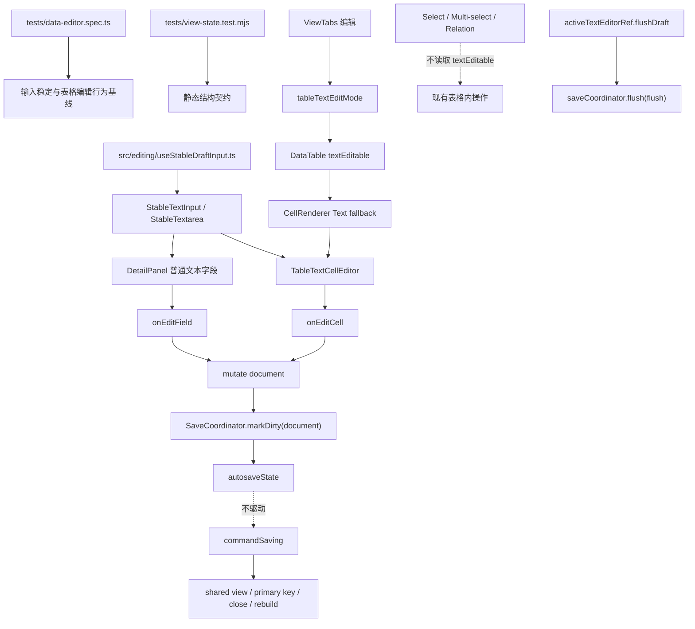

# 文本输入稳定与表格编辑模式统一治理 Implementation Plan

> **For agentic workers:** REQUIRED SUB-SKILL: Use `superpowers:subagent-driven-development` (recommended) or `superpowers:executing-plans` to implement this plan task-by-task. Steps use checkbox (`- [ ]`) syntax for tracking.

**Goal:** 修复详情页文本输入被 autosave 状态打断的问题，并新增表格普通 Text 单元格的显式文本编辑模式，同时确保标题列不可编辑、Select / Multi-select / Relation 在编辑关闭时仍可按现有方式操作。

**Architecture:** 先建立可复用的稳定文本输入层，再接入详情页和表格文本单元格；普通 autosave 状态从全局显式命令状态中拆出，避免后台保存驱动编辑区域重渲染或禁用；表格文本编辑使用短 debounce 和 active editor flush 机制，保证生命周期命令前不会漏保存当前 draft。

**Tech Stack:** React 18, TypeScript, TanStack Table, CSS, Playwright e2e, Node.js `node:test`.

---

## 方案概述

### 1. 总体目标和范围

本执行方案落地 [文本输入稳定与表格编辑模式统一治理方案](C:/Code/data-editor/docs/plans/2026-06-11-文本输入稳定与表格编辑模式统一治理方案.md)，执行范围包括：

- 移除 `DetailPanel` 普通文本 input / textarea 的 value-based `key`，避免每次输入触发 DOM remount。
- 新增 `src/editing` 稳定输入基础设施，统一处理 draft、IME composition、debounce、flush、cancel。
- 将普通 autosave 与显式命令保存状态拆分为 `autosaveState` / `commandSaving`。
- 在 `ViewTabs` 的 `筛选` 与 `调整` 中间新增 `编辑` 按钮。
- 将该按钮定义为“普通 Text 单元格文本编辑模式”，状态命名为 `tableTextEditMode` / `textEditable`。
- 标题列第一版不支持表格内编辑，继续点击打开详情页。
- `编辑` 关闭时，Select / Multi-select / Relation 仍允许表格内原有操作。
- 表格 Text 单元格使用短 debounce 写入 model，blur / Enter / 生命周期命令前必须 flush 当前 draft。

本执行方案不包括：

- 不恢复手动保存按钮。
- 不把 `编辑` 模式持久化到 profile。
- 不支持标题列表格内编辑。
- 不把 Select / Multi-select / Relation / Checkbox 改成普通文本 input。
- 不实现 Excel 式方向键 / Tab 跨单元格导航。
- 不引入撤销栈、批量粘贴、区域填充。

### 2. 各阶段任务概要

1. **测试基线阶段**
   - 主要工作：补详情页输入稳定、表格文本编辑开关、非文本字段不受影响、active draft flush 的失败测试。
   - 预期成果：先看到可解释的失败，锁定目标行为。
   - 执行顺序：第一步。

2. **稳定输入基础设施阶段**
   - 主要工作：新增 `useStableDraftInput`、`StableTextInput`、`StableTextarea`、`TableTextCellEditor` 和 `src/editing/index.ts`。
   - 预期成果：详情页和表格复用同一套输入稳定机制。
   - 执行顺序：第二步。

3. **详情页接入阶段**
   - 主要工作：替换 `DetailPanel` 普通 input / textarea，移除 value-based key，收缩 `DetailSnapshot` 的 autosave 订阅。
   - 预期成果：详情页输入不再被 autosave 打断。
   - 执行顺序：稳定输入基础设施完成后。

4. **保存状态拆分阶段**
   - 主要工作：将 `saving` 清理为 `commandSaving`，普通 autosave 只更新 `autosaveState` 和 in-flight ref。
   - 预期成果：后台 autosave 不再禁用或重建编辑区域。
   - 执行顺序：详情页接入后，表格编辑接入前。

5. **表格文本编辑模式阶段**
   - 主要工作：新增 `tableTextEditMode`，接入 `ViewTabs -> DataTable -> table-columns -> CellRenderer`，只对普通 Text 单元格启用 `TableTextCellEditor`。
   - 预期成果：用户开启 `编辑` 后可编辑普通 Text 单元格；关闭时 Text 只读，但 Select / Multi-select / Relation 仍可操作。
   - 执行顺序：保存状态拆分后。

6. **生命周期 flush 与验证阶段**
   - 主要工作：注册 active text editor，close / rebuild / 文件切换 / shared view 显式命令前先 flush draft，再 flush autosave；补文档与回归。
   - 预期成果：不会漏保存 debounce 中的当前输入；自动化和运行态验证完整。
   - 执行顺序：最后。

### 3. 整体结构框架



---

## 文件结构与职责

### 新增文件

- `src/editing/useStableDraftInput.ts`
  - 单输入框 draft、IME composition、debounce、flush、cancel 的基础 hook。
  - 不负责字段可编辑判断，不负责表格键盘语义。

- `src/editing/types.ts`
  - 放置编辑基础设施共享类型，例如 `ActiveTextEditorHandle`。
  - 避免 `StableTextInput` 反向依赖 `TableTextCellEditor`。

- `src/editing/StableTextInput.tsx`
  - 导出 `StableTextInput` 和 `StableTextarea`。
  - 负责把 `useStableDraftInput` 接到 DOM input / textarea。

- `src/editing/TableTextCellEditor.tsx`
  - 表格普通 Text 单元格编辑器。
  - 负责 `initialValueOnFocus`、Enter / Escape / blur 语义，以及 active editor 注册。

- `src/editing/index.ts`
  - 编辑基础设施导出边界。
  - 其他模块只从 `src/editing` 引入，不做深层 import。

### 修改文件

- `src/detail/DetailPanel.tsx`
  - 替换普通文本 input / textarea。
  - 移除 value-based `key`。
  - 将 `saving` 语义收缩为 `commandSaving` 或更窄状态。

- `src/App.tsx`
  - `saving -> commandSaving` 迁移。
  - 普通 `flushAutosaveTargets()` 不再设置全局保存锁。
  - 新增 `tableTextEditMode`。
  - 新增 active text editor registry / flush 入口。
  - 将 `tableTextEditMode` 和 active editor 注册能力传入表格。

- `src/components/ViewTabs.tsx`
  - 新增 `编辑` toggle，位于 `筛选` 和 `调整` 中间。
  - Props / snapshot 新增 `tableTextEditMode` 和 `onToggleTableTextEditMode`。

- `src/components/icons.ts`
  - 若已有合适 edit 图标则复用；否则新增一个 `edit` 图标导出。

- `src/table/DataTable.tsx`
  - `TableSnapshot` 新增 `textEditable`。
  - runtime context 新增 active editor 注册能力。
  - 将 `textEditable` 透传到列 / 单元格渲染。

- `src/table/table-columns.tsx`
  - `TableColumnsRuntime` 新增 `textEditable` 或从 snapshot / runtime 传入 cell。
  - `CellRenderer` 增加 `textEditable`。
  - 标题列分支不使用 `TableTextCellEditor`。

- `src/table/CellRenderer.tsx`
  - 普通 Text fallback 在 `textEditable === true` 时渲染 `TableTextCellEditor`。
  - Select / Multi-select / Relation 分支不读取 `textEditable`。

- `src/styles.css`
  - 新增编辑 toggle active 样式。
  - 新增表格文本编辑 input 样式，保持单元格尺寸稳定。

- `tests/data-editor.spec.ts`
  - 增加详情页输入稳定、表格文本编辑、非文本字段不受影响、active draft flush 的 E2E。

- `tests/view-state.test.mjs`
  - 增加静态结构断言，锁定新框架边界。

- `docs/04_信息架构与交互.md`
  - 补充 `筛选 / 编辑 / 调整` 的视图级操作说明。

- `docs/08_系统结构.md`
  - 补充 `src/editing` 输入稳定层、autosave / commandSaving 边界、active editor flush 顺序。

---

## Task 1: 建立失败测试与静态契约

**Files:**
- Modify: `tests/data-editor.spec.ts`
- Modify: `tests/view-state.test.mjs`

- [ ] **Step 1: 先抽真实测试 helper，替代伪 helper**

当前 `tests/data-editor.spec.ts` 已有可复用入口，例如：

- `page.goto("/")`
- `page.evaluate(() => localStorage.clear())`
- `page.reload()`
- `page.locator('.sidebar-item[title="data/e2e_mixed.json"]').click()`
- `tableRow(page, 0)`
- `waitForAutosaveWrite(page, predicate)`
- `columnHeaderTrigger(page, fieldName)`

先在 `tests/data-editor.spec.ts` 内抽出本任务专用的真实 helper：

```ts
async function openScratchMixedFile(page: Page) {
  await page.goto("/");
  await page.evaluate(() => localStorage.clear());
  await page.reload();
  await page.locator('.sidebar-item[title="data/e2e_mixed.json"]').click();
  await expect(page.locator(".data-table")).toBeVisible();
}

async function openFirstScratchRowDetail(page: Page) {
  await tableRow(page, 0).locator('[data-cell-role="title-action"]').click();
  await expect(page.locator(".detail-panel.primary")).toBeVisible();
}

async function waitForScratchMixedWrite(page: Page, expectedText: string) {
  await waitForAutosaveWrite(page, async () => {
    const text = await readFile(path.resolve("tests/.scratch/data/e2e_mixed.json"), "utf8");
    return text.includes(expectedText);
  });
}
```

如果当前文件已有同等 helper，复用已有 helper，不重复创建。禁止在新测试里直接使用尚不存在的 `openScratchProject`、`openFirstRowDetail`、`expectAutosaveIdle`、`assertScratchFileContains` 这类伪 helper。

- [ ] **Step 2: 增加详情页输入稳定 E2E**

在 `tests/data-editor.spec.ts` 增加用例，覆盖普通 input 和 textarea：

```ts
test("detail text input keeps focus while autosave runs", async ({ page }) => {
  await openScratchMixedFile(page);
  await openFirstScratchRowDetail(page);

  const input = page.locator(".detail-input").first();
  await input.click();
  await input.evaluate((node) => {
    (node as HTMLElement).dataset.identityProbe = "detail-input-probe";
  });
  await input.fill("focus-stable-value");

  await waitForScratchMixedWrite(page, "focus-stable-value");

  await expect(input).toBeFocused();
  await expect(input).toHaveAttribute("data-identity-probe", "detail-input-probe");
});

test("detail textarea keeps content and focus while autosave runs", async ({ page }) => {
  await openScratchMixedFile(page);
  await openFirstScratchRowDetail(page);

  const textarea = page.locator("textarea.detail-input").first();
  await textarea.click();
  await textarea.fill("line 1\nline 2\nline 3");

  await waitForScratchMixedWrite(page, "line 2");

  await expect(textarea).toBeFocused();
  await expect(textarea).toHaveValue("line 1\nline 2\nline 3");
});
```

这里用 `data-identity-probe` 检查同一个 DOM 节点是否仍然存在，不使用 `input.evaluate((node) => node)` 这类跨浏览器上下文不可稳定比较的写法。

- [ ] **Step 3: 增加 IME composition E2E / DOM 事件级测试**

在 `tests/data-editor.spec.ts` 增加：

```ts
test("detail text input commits after ime composition ends", async ({ page }) => {
  await openScratchMixedFile(page);
  await openFirstScratchRowDetail(page);

  const input = page.locator(".detail-input").first();
  await input.click();

  await input.evaluate((node) => {
    node.dispatchEvent(new CompositionEvent("compositionstart", { bubbles: true, data: "" }));
    (node as HTMLInputElement).value = "测";
    node.dispatchEvent(new InputEvent("input", { bubbles: true, data: "测", inputType: "insertCompositionText", isComposing: true }));
  });

  await page.waitForTimeout(250);
  const fileDuringComposition = await readFile(path.resolve("tests/.scratch/data/e2e_mixed.json"), "utf8");
  expect(fileDuringComposition).not.toContain("测");

  await input.evaluate((node) => {
    (node as HTMLInputElement).value = "测试";
    node.dispatchEvent(new CompositionEvent("compositionend", { bubbles: true, data: "测试" }));
    node.dispatchEvent(new InputEvent("input", { bubbles: true, data: "试", inputType: "insertText" }));
  });

  await waitForScratchMixedWrite(page, "测试");
  await expect(input).toHaveValue("测试");
});
```

若 Playwright / 浏览器不稳定支持 `CompositionEvent` 构造参数，就改为 `new Event("compositionstart", { bubbles: true })` 并通过 `Object.defineProperty(event, "data", ...)` 注入数据；测试意图必须保持为“composition 期间不提交，compositionend 后提交”。

实现侧必须同时检查：

- 内部 `composingRef.current`
- `event.nativeEvent.isComposing`

`compositionend` 和紧随其后的 `input` 事件必须幂等提交，不能因浏览器事件顺序差异重复写入或漏写。

- [ ] **Step 4: 增加表格文本编辑模式 E2E**

新增用例：

```ts
test("table text cells are read-only when text edit mode is off", async ({ page }) => {
  await openScratchMixedFile(page);

  const textCell = page.locator(".editable-cell.cell-text-content").first();
  await textCell.click();

  await expect(page.locator(".table-text-cell-editor")).toHaveCount(0);
});

test("table text edit mode allows text cell editing and autosaves", async ({ page }) => {
  await openScratchMixedFile(page);
  await page.getByRole("button", { name: "编辑" }).click();

  const editor = page.locator(".table-text-cell-editor input").first();
  await editor.click();
  await editor.fill("table-edit-value");

  await waitForScratchMixedWrite(page, "table-edit-value");
  await expect(editor).toHaveValue("table-edit-value");
});
```

第一版交互定义为：开启 `编辑` 后，可见普通 Text 单元格直接渲染 input，不需要再次点击静态展示进入编辑。不要使用 `contenteditable`。

- [ ] **Step 5: 增加非文本字段不受编辑开关影响的 E2E**

新增用例：

```ts
test("table text edit mode off still allows select multiselect relation operations", async ({ page }) => {
  await openScratchMixedFile(page);

  await expect(page.getByRole("button", { name: "编辑" })).toHaveAttribute("aria-pressed", "false");

  const selectValue = await operateFirstSelectCell(page);
  const multiSelectValue = await operateFirstMultiSelectCell(page);
  const relationValue = await operateFirstRelationCell(page);

  await waitForAutosaveWrite(page, async () => {
    const text = await readFile(path.resolve("tests/.scratch/data/e2e_mixed.json"), "utf8");
    return text.includes(selectValue) && text.includes(multiSelectValue) && text.includes(relationValue);
  });
  await expect(page.locator(".table-text-cell-editor")).toHaveCount(0);
});
```

这里的 `operateFirstSelectCell` / `operateFirstMultiSelectCell` / `operateFirstRelationCell` 必须复用当前测试里已有的 Select / Multi-select / Relation 操作方式；如果没有 helper，先在测试文件内抽最小 helper，并让每个 helper 返回写入文件中可断言的具体字符串，避免测试里出现不可执行的示意值。

- [ ] **Step 6: 增加 active draft flush E2E**

新增用例：

```ts
test("table text cell active draft flushes before lifecycle command", async ({ page }) => {
  await openScratchMixedFile(page);
  await page.getByRole("button", { name: "编辑" }).click();

  const editor = page.locator(".table-text-cell-editor input").first();
  await editor.click();
  await editor.fill("draft-before-flush");

  await triggerRefreshBuildWithConfirmation(page);

  await waitForScratchMixedWrite(page, "draft-before-flush");
});
```

该测试重点是“不等待 debounce 就触发生命周期命令”，从而证明 active editor draft 会先 flush。`triggerRefreshBuildWithConfirmation(page)` 若不存在，必须从当前 refresh build / close confirmation 用例中抽真实 helper。

- [ ] **Step 7: 增加静态契约测试**

在 `tests/view-state.test.mjs` 增加断言：

```js
test("stable text editing structure is wired", async () => {
  const detailPanel = await readFile(new URL("../src/detail/DetailPanel.tsx", import.meta.url), "utf8");
  assert(!detailPanel.includes("key={`${props.fieldName}:${String(props.value ?? \"\")}`"));
  assert(detailPanel.includes("StableTextInput"));
  assert(detailPanel.includes("StableTextarea"));

  const app = await readFile(new URL("../src/App.tsx", import.meta.url), "utf8");
  assert(!app.includes("const [saving, setSaving] = useState(false)"));
  assert(app.includes("const [commandSaving, setCommandSaving] = useState(false)"));
  assert(app.includes("activeTextEditorRef"));

  const cellRenderer = await readFile(new URL("../src/table/CellRenderer.tsx", import.meta.url), "utf8");
  assert(cellRenderer.includes("textEditable"));
  assert(cellRenderer.includes("TableTextCellEditor"));
  assert(/displayType === \"Text\"[\s\S]+textEditable/.test(cellRenderer));

  const viewTabs = await readFile(new URL("../src/components/ViewTabs.tsx", import.meta.url), "utf8");
  assert(viewTabs.includes("tableTextEditMode"));
  assert(viewTabs.includes("onToggleTableTextEditMode"));
  assert(viewTabs.includes('title="编辑文本单元格"'));
  assert(viewTabs.includes("aria-pressed"));
});
```

静态测试不要依赖 `>编辑<` 这种易受格式化影响的字符串。

- [ ] **Step 8: 运行失败测试确认基线**

Run:

```powershell
node --test tests/view-state.test.mjs
$env:DATA_EDITOR_E2E_PORT='8792'
$env:DATA_EDITOR_E2E_BRIDGE_PORT='8794'
npm run test:e2e -- --grep "detail text input keeps focus|detail textarea keeps content|table text cells are read-only|table text edit mode|active draft flushes"
```

Expected:

- 静态测试失败，原因是新文件 / 新状态尚未存在。
- E2E 失败，原因是详情页输入 remount、表格编辑按钮不存在、active draft flush 未实现。

---

## Task 2: 新增稳定输入基础设施

**Files:**
- Create: `src/editing/useStableDraftInput.ts`
- Create: `src/editing/types.ts`
- Create: `src/editing/StableTextInput.tsx`
- Create: `src/editing/TableTextCellEditor.tsx`
- Create: `src/editing/index.ts`
- Test: `tests/view-state.test.mjs`

- [ ] **Step 1: 创建 `useStableDraftInput`**

实现接口：

```ts
export type StableDraftInputCommitMode = "realtime" | "debounced";

export type StableDraftInputOptions = {
  identityKey: string;
  value: unknown;
  commitMode?: StableDraftInputCommitMode;
  commitDelayMs?: number;
  onChangeValue: (value: string) => void;
};

export type StableDraftInputApi = {
  draft: string;
  composing: boolean;
  setDraftFromInput: (next: string, nativeEvent?: Event) => void;
  handleFocus: () => void;
  handleBlur: () => void;
  handleCompositionStart: () => void;
  handleCompositionEnd: (next: string) => void;
  flushDraft: () => void;
  replaceDraft: (next: string) => void;
};
```

核心规则：

- `identityKey` 变化时重置 draft，并清理 pending debounce。
- 聚焦中外部 `value` 改变但 `identityKey` 不变时，不覆盖 draft。
- 非聚焦状态同步外部 `value`。
- `compositionstart` 后不调用 `onChangeValue`。
- `compositionend` 后提交最终 draft。
- `setDraftFromInput(next, nativeEvent)` 必须同时检查 `composingRef.current` 和 `(nativeEvent as InputEvent).isComposing`。
- `compositionend` 与后续 `input` 事件必须通过 `lastCommittedDraftRef` 或等效机制幂等处理，避免同一个最终值重复提交。
- `commitMode === "realtime"` 立即提交。
- `commitMode === "debounced"` 延迟提交，默认 150ms。
- `flushDraft()` 同步提交当前 draft，并清理 debounce。

- [ ] **Step 2: 创建 `src/editing/types.ts`**

共享类型放在独立文件中，避免 `StableTextInput` 依赖 `TableTextCellEditor`：

```ts
export type ActiveTextEditorHandle = {
  identityKey: string;
  flushDraft: () => void;
  cancelDraft?: () => void;
};
```

`flushDraft()` 第一版必须保持同步：它要同步调用 `onChangeValue`，而 `onChangeValue -> mutate -> saveCoordinator.markDirty(...)` 也必须在同一调用栈内完成。这样生命周期入口执行：

```ts
flushActiveTextEditorDraft();
await saveCoordinator.flush("flush");
```

时，`saveCoordinator.flush("flush")` 能看到最新 dirty domain。如果未来实现异步提交，再把 `flushDraft` 和 `flushActiveTextEditorDraft` 统一改成 `Promise<void>`，不能只局部异步化。

- [ ] **Step 3: 创建 `StableTextInput` 和 `StableTextarea`**

导出 props：

```ts
export type StableTextInputProps = {
  identityKey: string;
  value: unknown;
  className?: string;
  title?: string;
  placeholder?: string;
  commitMode?: "realtime" | "debounced";
  commitDelayMs?: number;
  onChangeValue: (value: string) => void;
  onKeyDown?: React.KeyboardEventHandler<HTMLInputElement>;
};

export type StableTextareaProps = Omit<StableTextInputProps, "onKeyDown"> & {
  onKeyDown?: React.KeyboardEventHandler<HTMLTextAreaElement>;
};
```

实现要求：

- input / textarea 使用 `value={api.draft}`，但不从父组件 value 每次输入后强制回填。
- `onInput` 调用 `api.setDraftFromInput(...)`。
- `onCompositionStart` / `onCompositionEnd` 接入 hook。
- `onBlur` 调用 `api.flushDraft()`。
- textarea 保留自动高度行为；如果现有 `AutoSizeTextarea` 只能非受控使用，则把高度测量逻辑迁移到 `StableTextarea` 内，不保留 value-based key。
- `StableTextInput` 不接收 `onRegisterActiveEditor`，不感知 active editor registry。
- 如 `TableTextCellEditor` 需要访问 `flushDraft()`，通过 `ref` 或 render callback 暴露 `StableDraftInputApi` 的窄接口。

- [ ] **Step 4: 创建 `TableTextCellEditor`**

实现 props：

```ts
import type { ActiveTextEditorHandle } from "./types";

export type TableTextCellEditorProps = {
  cellId: string;
  value: unknown;
  wrapped?: boolean;
  issue?: ValidationIssue | null;
  onChangeValue: (value: string) => void;
  onRegisterActiveEditor?: (handle: ActiveTextEditorHandle | null) => void;
};
```

行为：

- 聚焦时记录 `initialValueOnFocus`。
- 默认 `commitMode="debounced"`，`commitDelayMs={150}`。
- `Enter`：`flushDraft()` 后 blur。
- `Escape`：恢复 `initialValueOnFocus`，调用 `onChangeValue(initialValueOnFocus)`，然后 blur。
- `Tab` / `Shift+Tab` 不拦截，保持浏览器默认。
- className 至少包含 `table-text-cell-editor` 和原有 `editable-cell cell-display cell-text-content` 的视觉语义。
- active editor 注册只在 `TableTextCellEditor` 内执行，不下放给 `StableTextInput`。

- [ ] **Step 5: 创建 `src/editing/index.ts`**

导出：

```ts
export { StableTextInput, StableTextarea } from "./StableTextInput";
export { TableTextCellEditor } from "./TableTextCellEditor";
export type { ActiveTextEditorHandle } from "./types";
export { useStableDraftInput } from "./useStableDraftInput";
export type { StableDraftInputCommitMode } from "./useStableDraftInput";
```

- [ ] **Step 6: 跑静态测试和类型检查**

Run:

```powershell
node --test tests/view-state.test.mjs
npm run typecheck
```

Expected:

- 与新文件存在相关的静态断言开始通过。
- 仍可能因为尚未接入 `DetailPanel` / `App` 失败。

---

## Task 3: 接入详情页并修复 autosave 打断输入

**Files:**
- Modify: `src/detail/DetailPanel.tsx`
- Modify: `src/App.tsx`
- Test: `tests/data-editor.spec.ts`
- Test: `tests/view-state.test.mjs`

- [ ] **Step 1: 替换详情页普通 input**

将 `src/detail/DetailPanel.tsx` 中普通文本 input：

```tsx
<input
  key={`${props.fieldName}:${String(props.value ?? "")}`}
  defaultValue={props.value == null ? "" : String(props.value)}
  onInput={(event) => props.onEditField(props.fieldName, (event.target as HTMLInputElement).value)}
/>
```

替换为：

```tsx
<StableTextInput
  identityKey={`${props.cellId}:${props.fieldName}`}
  className="detail-input"
  value={props.value}
  commitMode="realtime"
  onChangeValue={(next) => props.onEditField(props.fieldName, next)}
/>
```

如果当前 props 没有 `cellId`，使用稳定 row / source identity 与 `fieldName` 拼接，不能使用当前字段值。

- [ ] **Step 2: 替换详情页 textarea**

将 textarea / `AutoSizeTextarea` 的 value-based key 替换为：

```tsx
<StableTextarea
  identityKey={`${props.cellId}:${props.fieldName}`}
  className="detail-input detail-textarea"
  value={props.value}
  commitMode="realtime"
  onChangeValue={(next) => props.onEditField(props.fieldName, next)}
/>
```

要求：

- 不再出现 `key={`${props.fieldName}:${String(props.value ?? "")}`}`。
- autosave 状态变化不改变输入框 identity。
- textarea 的 Enter 继续插入换行。

- [ ] **Step 3: 收缩 `DetailSnapshot` 的保存状态订阅**

将：

```ts
saving: boolean;
```

改为：

```ts
commandSaving: boolean;
```

如果仅 `RelationBacklinksPanel` 需要同步态，优先传更窄的 `syncingPrimaryKey`；不要把普通 `autosaveState` 传入详情页。

- [ ] **Step 4: 在 `App.tsx` 更新 `detailSnapshot`**

将 `detailSnapshot` 里的旧 `saving` 改为 `commandSaving` 或删除：

```ts
const detailSnapshot = useMemo<DetailSnapshot>(() => ({
  ...,
  commandSaving,
}), [..., commandSaving]);
```

依赖数组不得包含普通 `autosaveState`，除非详情页某个非输入区域确实需要展示 autosave 状态。

- [ ] **Step 5: 运行详情页定向验证**

Run:

```powershell
node --test tests/view-state.test.mjs
$env:DATA_EDITOR_E2E_PORT='8792'
$env:DATA_EDITOR_E2E_BRIDGE_PORT='8794'
npm run test:e2e -- --grep "detail text input keeps focus|detail textarea keeps content|detail text input commits after ime"
```

Expected: PASS。

---

## Task 4: 拆分普通 autosave 与 `commandSaving`

**Files:**
- Modify: `src/App.tsx`
- Modify: `src/components/Toolbar.tsx`
- Modify: `src/components/ViewTabs.tsx`
- Modify: `src/components/ViewFilterBar.tsx`
- Test: `tests/view-state.test.mjs`

- [ ] **Step 1: 执行前枚举全部保存状态调用点**

Run:

```powershell
rg -n "saving|setSaving|flushAutosaveTargets|autosaveState|saveCoordinator.flush" src/App.tsx src/components
```

把每个调用点先归类到以下之一，再开始改代码：

| 类别 | 例子 | 目标状态 |
| --- | --- | --- |
| 普通 autosave | `flushAutosaveTargets()`、document / project-config / profile flush | `autosaveState` / `autosaveInFlightRef` |
| 显式命令 | shared view 创建 / 重命名 / 删除 / 复制 / 为所有人保存 | `commandSaving` |
| 同步确认 | primary key / relation 同步确认 | `commandSaving` 或更窄同步状态 |
| 生命周期命令 | close server / refresh build / rebuild | `commandSaving`，并先 flush active editor draft |
| 状态展示 | toolbar 保存状态 | `autosaveState + commandSaving` |
| view 控制禁用 | ViewTabs / ViewFilterBar shared view 操作 | 仅显式命令使用 `commandSaving` |

没有完成这张调用点归类表，不进入下一步。

- [ ] **Step 2: 将 `saving` state 改名并收缩为显式命令状态**

在 `src/App.tsx` 将：

```ts
const [saving, setSaving] = useState(false);
```

替换为：

```ts
const [commandSaving, setCommandSaving] = useState(false);
const autosaveInFlightRef = useRef(false);
```

按 Step 1 的分类处理所有 `saving` / `setSaving` 调用点：

| 调用点 | 处理方式 |
| --- | --- |
| `flushAutosaveTargets()` | 移除 `setSaving`，改用 `autosaveInFlightRef` 与 `autosaveState` |
| shared view 创建 / 重命名 / 删除 / 复制 / 为所有人保存 | 使用 `commandSaving` |
| primary key / relation 同步确认 | 使用 `commandSaving` 或更窄同步状态 |
| close server / refresh build / rebuild | 使用 `commandSaving` |
| toolbar 状态显示 | `autosaveState + commandSaving` |
| ViewTabs / ViewFilterBar disabled | 仅显式命令使用 `commandSaving` |

- [ ] **Step 3: 修改 `flushAutosaveTargets()`**

当前普通 autosave flush 不得再：

```ts
setSaving(true);
setSaving(false);
```

改为：

```ts
autosaveInFlightRef.current = true;
setAutosaveState("saving");
try {
  // existing document / project-config / profile flush
  setAutosaveState("idle");
} catch (error) {
  setAutosaveState("error");
  throw error;
} finally {
  autosaveInFlightRef.current = false;
}
```

如果 `SaveCoordinator` 已经维护状态，避免双重状态源；React 层只保留必要 ref 用于并发判断。

- [ ] **Step 4: 更新 Toolbar / ViewTabs / ViewFilterBar props**

规则：

- `Toolbar` 接收 `autosaveState` 和 `commandSaving`。
- `ViewTabs` 接收 `commandSaving`，不接收普通 autosave saving。
- `ViewFilterBar` 接收 `commandSaving`，不因普通 autosave 禁用筛选编辑。

禁止出现：

```ts
saving={autosaveState === "saving"}
```

这种把普通 autosave 重新包装成全局锁的写法。

- [ ] **Step 5: 跑静态契约**

Run:

```powershell
node --test tests/view-state.test.mjs
npm run typecheck
```

Expected:

- 不再存在 `const [saving, setSaving] = useState(false)`。
- 普通 autosave flush 不再调用 `setCommandSaving(true)`。
- 类型检查通过。

---

## Task 5: 新增 `ViewTabs` 文本编辑按钮

**Files:**
- Modify: `src/App.tsx`
- Modify: `src/components/ViewTabs.tsx`
- Modify: `src/components/icons.ts`
- Modify: `src/styles.css`
- Test: `tests/view-state.test.mjs`
- Test: `tests/data-editor.spec.ts`

- [ ] **Step 1: 在 `App.tsx` 新增状态**

新增：

```ts
const [tableTextEditMode, setTableTextEditMode] = useState(false);
```

刷新后默认关闭，不写入 profile。

- [ ] **Step 2: 扩展 `ViewTabsSnapshot` 和 props**

在 `src/components/ViewTabs.tsx`：

```ts
export type ViewTabsSnapshot = {
  ...
  tableTextEditMode: boolean;
};

type ViewTabsProps = {
  ...
  onToggleTableTextEditMode: () => void;
};
```

- [ ] **Step 3: 插入 `编辑` 按钮**

按钮位置必须是：

```text
筛选  编辑  调整
```

实现：

```tsx
<button
  className={[
    "view-tab-action",
    "table-edit-toggle",
    "view-tabs-table-edit-toggle",
    tableTextEditMode ? "active" : "",
  ].filter(Boolean).join(" ")}
  onClick={onToggleTableTextEditMode}
  aria-pressed={tableTextEditMode}
  title="编辑文本单元格"
  type="button"
>
  <icons.edit size={14} />
  <span>编辑</span>
</button>
```

若 `icons.edit` 不存在，在 `src/components/icons.ts` 中新增或复用现有 pencil/edit 图标。

- [ ] **Step 4: 在 `App.tsx` 装配 snapshot 和 callback**

```ts
const viewTabsSnapshot = useMemo<ViewTabsSnapshot>(() => ({
  ...,
  tableTextEditMode,
}), [..., tableTextEditMode]);
```

传入：

```tsx
<ViewTabs
  ...
  onToggleTableTextEditMode={() => setTableTextEditMode((current) => !current)}
/>
```

- [ ] **Step 5: 样式收口**

在 `src/styles.css` 增加：

```css
.view-tabs-table-edit-toggle.active {
  background: var(--accent-soft);
  color: var(--accent-strong);
}
```

如果项目没有这些变量，使用现有 view-tab action active 样式变量，不新增一套色彩体系。

- [ ] **Step 6: 验证按钮存在和状态切换**

Run:

```powershell
node --test tests/view-state.test.mjs
$env:DATA_EDITOR_E2E_PORT='8792'
$env:DATA_EDITOR_E2E_BRIDGE_PORT='8794'
npm run test:e2e -- --grep "table text cells are read-only|table text edit mode"
```

Expected:

- `编辑` 按钮出现在 `筛选` 与 `调整` 中间。
- `aria-pressed` 能随点击切换。
- 表格 Text 编辑能力仍未完全通过，直到 Task 6 完成。

---

## Task 6: 接入表格普通 Text 单元格编辑

**Files:**
- Modify: `src/App.tsx`
- Modify: `src/table/DataTable.tsx`
- Modify: `src/table/table-columns.tsx`
- Modify: `src/table/CellRenderer.tsx`
- Modify: `src/styles.css`
- Test: `tests/data-editor.spec.ts`
- Test: `tests/view-state.test.mjs`

- [ ] **Step 1: `TableSnapshot` 新增 `textEditable`**

在 `DataTable` snapshot 类型中新增：

```ts
textEditable: boolean;
```

在 `App.tsx` 构造 `tableSnapshot` 时：

```ts
textEditable: tableTextEditMode,
```

- [ ] **Step 2: 透传 `textEditable` 到 `CellRenderer`**

在 `src/table/table-columns.tsx`：

```tsx
<CellRenderer
  ...
  textEditable={runtime.textEditable}
  onEdit={(next) => runtime.onEditCell(originalRowIndex, rowId, columnModel.fieldName, next)}
/>
```

`TableColumnsRuntime` 增加：

```ts
textEditable: boolean;
```

- [ ] **Step 3: 修改 `CellRendererProps`**

在 `src/table/CellRenderer.tsx`：

```ts
type CellRendererProps = {
  ...
  textEditable?: boolean;
  onRegisterActiveEditor?: (handle: ActiveTextEditorHandle | null) => void;
};
```

注意 Select / Multi-select / Relation 分支不要读取 `textEditable`。

- [ ] **Step 4: 普通 Text fallback 接入 `TableTextCellEditor`**

在文本 fallback 前增加：

```tsx
const isPlainEditableText =
  displayType === "Text" &&
  textEditable === true &&
  (value == null || typeof value === "string" || typeof value === "number");

if (isPlainEditableText) {
  return (
    <TableTextCellEditor
      cellId={cellId}
      value={value}
      wrapped={wrapped}
      issue={issue}
      onChangeValue={onEdit}
      onRegisterActiveEditor={onRegisterActiveEditor}
    />
  );
}
```

保持原有 fallback：

```tsx
return (
  <div className={`editable-cell cell-display cell-text-content ${wrapped ? "cell-text-wrap" : ""}`}>
    <span>{textValue}</span>
    {shouldShowIssue ? <Issue issue={issue} /> : null}
  </div>
);
```

- [ ] **Step 5: 标题列保持打开详情**

在 `table-columns.tsx` 标题列分支保持：

```tsx
<button className="title-cell title-cell-button ...">
```

不接入 `TableTextCellEditor`。如需说明，给 title 增加：

```tsx
title="标题列请在详情页编辑"
```

- [ ] **Step 6: 表格文本 input 样式**

在 `src/styles.css` 增加：

```css
.table-text-cell-editor {
  min-width: 0;
  width: 100%;
}

.table-text-cell-editor input {
  width: 100%;
  min-width: 0;
  border: 0;
  background: transparent;
  color: inherit;
  font: inherit;
  padding: 0;
  outline: none;
}

.table-text-cell-editor input:focus {
  box-shadow: inset 0 0 0 1px var(--focus-ring);
}
```

如果项目已有 cell input 样式，复用现有变量和 focus ring，不新增孤立视觉体系。

- [ ] **Step 7: 跑表格编辑验证**

Run:

```powershell
node --test tests/view-state.test.mjs
$env:DATA_EDITOR_E2E_PORT='8792'
$env:DATA_EDITOR_E2E_BRIDGE_PORT='8794'
npm run test:e2e -- --grep "table text cells are read-only|table text edit mode allows|table text edit mode off still allows"
```

Expected: PASS。

---

## Task 7: 实现 active editor flush 顺序

**Files:**
- Modify: `src/App.tsx`
- Modify: `src/table/DataTable.tsx`
- Modify: `src/table/table-columns.tsx`
- Modify: `src/table/CellRenderer.tsx`
- Modify: `src/editing/TableTextCellEditor.tsx`
- Test: `tests/data-editor.spec.ts`
- Test: `tests/view-state.test.mjs`

- [ ] **Step 1: 在 `App.tsx` 新增 active editor ref**

```ts
import type { ActiveTextEditorHandle } from "./editing";

const activeTextEditorRef = useRef<ActiveTextEditorHandle | null>(null);

const registerActiveTextEditor = useCallback((handle: ActiveTextEditorHandle | null) => {
  activeTextEditorRef.current = handle;
}, []);

const flushActiveTextEditorDraft = useCallback(() => {
  activeTextEditorRef.current?.flushDraft();
}, []);
```

`flushActiveTextEditorDraft()` 第一版保持同步。它只负责把当前 active input draft 同步推入 model 并标记 dirty，真正写盘仍由随后的 `await saveCoordinator.flush("flush")` 负责。

- [ ] **Step 2: 传递注册函数**

传递路径：

```text
App.tableSnapshot.onRegisterActiveTextEditor
-> DataTable
-> TableColumnsRuntime
-> CellRenderer
-> TableTextCellEditor
```

类型中使用：

```ts
onRegisterActiveTextEditor?: (handle: ActiveTextEditorHandle | null) => void;
```

- [ ] **Step 3: `TableTextCellEditor` 聚焦 / 清理时注册**

规则：

- focus：注册当前 handle。
- blur：先 `flushDraft()`，再清理注册。
- unmount：如果仍是当前 handle，清理注册。

handle 中的 `flushDraft` 必须调用 `StableTextInput` 暴露的 flush，而不是直接读 DOM value。

如果 blur / unmount 清理时发现当前注册的 `identityKey` 已不是自己，不能清空别的编辑器注册。

- [ ] **Step 4: 生命周期命令前接入 flush 顺序**

所有以下入口在执行命令前必须调用：

```ts
flushActiveTextEditorDraft();
await saveCoordinator.flush("flush");
```

适用入口：

- close server
- refresh build / rebuild
- 文件切换
- project / collection 切换
- shared view 发布前需要确保数据已落盘的入口

如果某个入口目前已经调用 `await saveCoordinator.flush("flush")`，在它前面插入 `flushActiveTextEditorDraft()`。

- [ ] **Step 5: 跑 active draft E2E**

Run:

```powershell
node --test tests/view-state.test.mjs
$env:DATA_EDITOR_E2E_PORT='8792'
$env:DATA_EDITOR_E2E_BRIDGE_PORT='8794'
npm run test:e2e -- --grep "active draft flushes"
```

Expected: PASS。

---

## Task 8: 补文档、全量验证与服务收尾

**Files:**
- Modify: `docs/04_信息架构与交互.md`
- Modify: `docs/08_系统结构.md`
- Inspect: `package.json`
- Inspect: `scripts/service-finalize.mjs`

- [ ] **Step 1: 更新交互文档**

在 `docs/04_信息架构与交互.md` 补：

- `ViewTabs` 操作顺序为 `筛选 / 编辑 / 调整`。
- `编辑` 是普通 Text 单元格文本编辑开关。
- 标题列继续点击打开详情。
- Select / Multi-select / Relation 不受该开关禁用。

- [ ] **Step 2: 更新系统结构文档**

在 `docs/08_系统结构.md` 补：

- `src/editing` 是输入稳定基础设施层。
- `autosaveState` 只表示普通后台保存状态。
- `commandSaving` 只表示显式命令忙碌。
- active text editor draft 必须先于 `saveCoordinator.flush("flush")` flush。

- [ ] **Step 3: 跑静态与类型验证**

Run:

```powershell
npm run typecheck
npm test
```

Expected: PASS。

- [ ] **Step 4: 跑定向 E2E**

Run:

```powershell
$env:DATA_EDITOR_E2E_PORT='8792'
$env:DATA_EDITOR_E2E_BRIDGE_PORT='8794'
npm run test:e2e -- --grep "detail text input keeps focus|detail textarea keeps content|detail text input commits after ime|table text cells are read-only|table text edit mode|active draft flushes|autosave persists scratch json edits"
```

Expected: PASS。

- [ ] **Step 5: 浏览器验收**

验证口径：

- 详情页普通文本输入时，autosave 不导致失焦。
- 详情页 textarea 输入时，autosave 不重置内容、高度或焦点。
- `筛选 / 编辑 / 调整` 顺序正确。
- 默认关闭 `编辑`，普通 Text 单元格不出现 input。
- 开启 `编辑` 后，普通 Text 单元格可编辑并自动保存。
- 标题列仍点击打开详情。
- `编辑` 关闭时，Select / Multi-select / Relation 仍可在表格内操作。
- close / refresh build 前不会漏保存当前正在输入但尚未 debounce 完成的内容。

- [ ] **Step 6: 服务收尾**

如果执行中启动过本地服务、Browser、Playwright 或临时端口，结束前运行：

```powershell
npm run service:finalize
```

最终实施记录必须包含：

- `8787/api/health` 结果
- `8791/health` 结果
- 正式 URL：`http://127.0.0.1:8787/`
- 临时进程和目录清理结果

---

## 建议提交切分

建议按可回滚边界切分：

1. `test: 增加文本输入稳定与表格编辑模式回归`
2. `feat: 新增稳定文本输入基础设施`
3. `fix: 详情页文本输入不再被 autosave 打断`
4. `refactor: 拆分 autosave 与显式命令保存状态`
5. `feat: 新增表格文本编辑模式`
6. `fix: 生命周期命令前 flush 当前文本编辑 draft`
7. `docs: 更新文本编辑与保存状态结构文档`

如果用户要求一次性提交，也必须先用 `git status` / `git diff` 确认 scope，只提交本任务相关文件。

---

## 执行闸口与风险控制

### 闸口 1：不能先做表格编辑再修详情页输入

原因：表格编辑会复用同一输入稳定层；如果先写表格，很容易复制详情页当前的 remount 问题。

通过标准：

- `StableTextInput` / `StableTextarea` 先存在。
- `DetailPanel` 已经不再使用 value-based key。

### 闸口 2：不能把 `编辑` 做成整表锁

原因：用户已明确要求编辑关闭时 Select / Multi-select / Relation 仍允许表格内操作。

通过标准：

- 状态命名为 `tableTextEditMode` / `textEditable`。
- Select / Multi-select / Relation 分支不读取 `textEditable`。
- E2E 覆盖编辑关闭时这些字段仍可操作。

### 闸口 3：不能让普通 autosave 继续驱动全局锁

原因：这正是详情页输入被“保存状态”打断的放大因素之一。

通过标准：

- 代码中不再存在 `const [saving, setSaving] = useState(false)`。
- `flushAutosaveTargets()` 不再设置 `commandSaving`。
- `DetailPanel` 和 `DataTable` 不订阅普通 `autosaveState` 作为输入禁用或 remount 条件。

### 闸口 4：debounce 必须配 active draft flush

原因：表格文本编辑采用 debounce 后，生命周期命令可能发生在 debounce 到期前。

通过标准：

- `activeTextEditorRef.current?.flushDraft()` 先于 `saveCoordinator.flush("flush")`。
- close / rebuild / 文件切换至少一个 E2E 覆盖该顺序。

---

## 最终完成定义

完成后必须同时满足：

- `npm run typecheck` 通过。
- `npm test` 通过。
- 定向 E2E 通过。
- 方案文档与系统文档已同步。
- 浏览器验收口径全部通过。
- 如果启动过服务或 Browser，已运行 `npm run service:finalize` 并记录 health / URL / cleanup。
