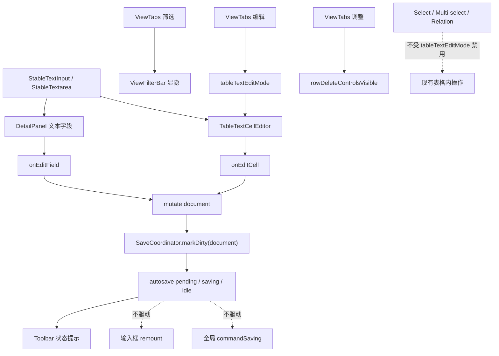

# 文本输入稳定与表格编辑模式统一治理方案

## 方案概述

### 1. 总体目标和范围

本方案合并两个相关需求：

1. 治理 `DetailPanel` 中编辑文本内容时被 autosave 状态打断的问题。
2. 在 `ViewTabs` 的 `筛选` 和 `调整` 中间新增 `编辑` 按钮，开启后允许用户在数据表格中实时编辑普通文本字段单元格，关闭后只禁止表格普通文本单元格编辑。

这两个需求必须合并设计，因为它们共享同一条技术路径：

```text
文本输入
-> onEdit
-> mutate document
-> SaveCoordinator.markDirty("document")
-> autosave 状态变化
-> App / DetailPanel / DataTable re-render
```

如果只修详情页，再单独实现表格编辑模式，表格内联输入很容易复现同样的失焦、光标跳动、输入法组合中断问题。因此本方案把它们统一为一个目标：建立可复用的稳定文本输入层，并让 autosave 状态不打断任何正在进行的文本编辑。

本方案范围包含：

- 新增通用稳定文本输入组件，供详情页和表格内联编辑复用。
- 修复 `DetailPanel` 普通文本 input / textarea 被 autosave 打断的问题。
- 将普通 autosave 状态与全局显式命令 `commandSaving` 拆分。
- 新增视图级 `编辑` 模式按钮，位于 `筛选` 和 `调整` 中间。
- 仅在 `编辑` 模式开启时允许表格普通 `Text` 单元格内联编辑。
- `编辑` 模式关闭时，Select / Multi-select / Relation 仍保持现有表格内操作能力，不被此开关禁用。
- 为详情页输入稳定性、表格编辑模式、autosave 落盘补充 E2E 和静态测试。

本方案范围不包含：

- 不恢复手动保存按钮。
- 不把 `编辑` 模式默认持久化到 profile。
- 不允许第一版直接编辑标题列 `title-cell`，标题列继续通过详情页编辑。
- 不把 Select / Multi-select / Relation / Checkbox 改成普通文本编辑。
- 不重写整个 `DetailPanel` 或 `DataTable`。
- 不改变 shared view 的 `为所有人保存` 语义。
- 不改变主键跨文件同步确认语义。

### 2. 各阶段任务概要

1. **输入稳定契约阶段**
   - 主要工作：补充失败测试，明确详情页和未来表格内联输入在 autosave 期间必须保持焦点、光标、输入法组合和 DOM identity 稳定。
   - 预期成果：形成统一的文本输入稳定契约。
   - 执行顺序：第一步。

2. **通用稳定输入层阶段**
   - 主要工作：新增 `StableTextInput` / `StableTextarea`，移除 `DetailPanel` 中基于字段值的动态 `key`。
   - 预期成果：详情页和表格编辑模式复用同一套输入稳定机制，避免重复实现。
   - 执行顺序：第二步。

3. **autosave 状态语义拆分阶段**
   - 主要工作：普通 autosave 不再驱动全局 `commandSaving`；`commandSaving` 只用于 shared view 发布、主键同步、close / rebuild 等显式命令。
   - 预期成果：autosave 状态只作为状态提示，不再让编辑区域误进入全局保存锁定。
   - 执行顺序：稳定输入层接入后执行。

4. **详情页接入阶段**
   - 主要工作：将 `DetailPanel` 普通文本 input / textarea 替换为稳定输入组件，并收缩 `DetailSnapshot` 对普通 autosave 状态的订阅。
   - 预期成果：详情页编辑不再被 autosave 打断。
   - 执行顺序：先修复现有 bug。

5. **表格编辑模式阶段**
   - 主要工作：在 `ViewTabs` 增加 `编辑` toggle；通过 `App -> DataTable -> CellRenderer` 传递 `tableTextEditMode`；在普通 `Text` 单元格中启用 `TableTextCellEditor`。
   - 预期成果：用户可显式开启表格文本单元格内联编辑，关闭后普通文本单元格只读；Select / Multi-select / Relation 保持原有表格内操作。
   - 执行顺序：详情页输入稳定后执行。

6. **验证与文档阶段**
   - 主要工作：补 E2E、静态测试和必要交互文档。
   - 预期成果：锁定统一输入稳定契约和表格编辑模式边界。
   - 执行顺序：最后。

### 3. 整体结构框架



---

## 当前机制与证据链

### 1. `筛选` 和 `调整` 的位置

`筛选` 和 `调整` 位于 `ViewTabs`，不是全局 toolbar。

相关位置：

- `src/components/ViewTabs.tsx`
- `docs/04_信息架构与交互.md`

当前 `ViewTabs` 已有：

- `filterBarVisible`
- `rowDeleteControlsVisible`
- `onToggleFilterBar`
- `onToggleRowDeleteControls`

因此新增 `编辑` 的自然位置是同一行、同一组 view-level toggle：

```text
筛选  编辑  调整
```

### 2. 表格普通文本单元格当前是只读展示

当前 `CellRenderer` 对普通文本字段的最终 fallback 是：

```tsx
<div className="editable-cell cell-display cell-text-content">
  <span>{textValue}</span>
</div>
```

它虽然 class 叫 `editable-cell`，但实际没有 input，也没有 contenteditable。写数据的能力已经存在于回调链路中：

```text
CellRenderer.onEdit
-> DataTable runtime.onEditCell
-> App.handleEditCellByRowId
-> mutate()
-> autosave
```

所以表格编辑模式不需要新建写盘链路，只需要在 `Text` 单元格中按模式切换渲染。

### 3. 详情页输入当前存在 value-based key

`DetailPanel` 普通文本 input 和 textarea 当前使用类似结构：

```tsx
key={`${props.fieldName}:${String(props.value ?? "")}`}
defaultValue={props.value == null ? "" : String(props.value)}
onInput={(event) => props.onEditField(...)}
```

这个 `key` 包含字段值。每输入一个字符，上层 model 更新，`props.value` 改变，`key` 也改变，React 会把输入节点卸载并重建。

直接风险：

- 光标位置重置。
- 输入焦点丢失。
- 中文输入法组合态中断。
- textarea 高度和滚动位置闪动。
- autosave 状态变化放大这个问题。

### 4. 普通 autosave 当前复用全局 `saving`

普通 autosave flush 中会进入 `setSaving(true)` / `setSaving(false)`。同时：

- `DetailSnapshot` 订阅 `saving`
- `ToolbarSnapshot` 订阅 `saving`
- `ViewTabs` / `ViewFilterBar` 也把 `saving` 当作显式命令禁用状态

这导致后台 autosave 与显式命令保存语义混在一起。  
对表格编辑模式来说，这个问题会更明显，因为表格比详情面板更容易因状态变化产生大范围 re-render。

---

## 统一设计原则

### 原则 1：输入框 identity 不能包含当前字段值

错误模型：

```tsx
key={`${fieldName}:${value}`}
```

正确模型：

```tsx
identityKey={`${sourcePath}:${collectionPath}:${rowId}:${fieldName}`}
```

对 nested path 或表格 cell：

```tsx
identityKey={`${rowId}:${fieldPath}`}
identityKey={`${rowId}:${columnField}`}
```

identity 表达“这是哪个输入框”，不能表达“这个输入框当前是什么值”。

### 原则 2：详情页和表格内联编辑复用同一套稳定输入层

不要分别实现：

- `DetailTextInput`
- `TableTextInput`

而是抽通用 hook 和组件：

- `useStableDraftInput`
- `StableTextInput`
- `StableTextarea`

统一位置：

- `src/editing/useStableDraftInput.ts`
- `src/editing/StableTextInput.tsx`

原因：

- 这是编辑基础设施，不是普通视觉组件。
- hook 负责 identity、draft、focus、composition、外部值同步。
- DOM 组件只负责 input / textarea 呈现。
- 后续如果需要表格专用视觉，也可以复用 hook，而不是复制状态机。

职责边界必须保持清晰：

- `useStableDraftInput` 只负责单个输入框的 draft、composition、debounce、flush / cancel 基础动作。
- `StableTextInput` / `StableTextarea` 只负责把 hook 接到 DOM input / textarea。
- `TableTextCellEditor` 负责表格单元格语义，包括进入编辑时的 `initialValueOnFocus`、Enter / Escape / blur 行为，以及是否注册为当前 active editor。
- `App` 不感知输入法、光标和键盘细节，只接收最终的 edit event，并继续走 `mutate -> autosave`。

不要把 `initialValueOnFocus`、Escape 回滚、单元格键盘语义塞进 `useStableDraftInput`，否则这个 hook 会从“稳定输入基础设施”膨胀成“表格编辑器状态机”，后续详情页复用会变得困难。

### 原则 3：普通 autosave 不等于显式命令 commandSaving

普通 autosave：

- 只影响 `autosaveState`
- 只用于状态提示
- 不禁用编辑输入
- 不强制刷新详情面板输入子树

显式命令 `commandSaving`：

- 用于 shared view 发布
- 用于 view rename / duplicate / delete 等会立即写 shared config 的动作
- 用于主键跨文件同步确认
- 用于 close server / refresh build
- 可禁用相关按钮或阻断重复提交

### 原则 4：表格编辑模式第一版只控制普通 Text 单元格

第一版允许：

- `displayType === "Text"`
- 非标题列
- 非 nested 字段
- 非 backlink 派生列
- 非 relation 字段
- 值为 `string | number | null`

第一版不允许：

- 标题列
- nested object / array
- backlink
- Checkbox

第一版不把以下字段转成文本 input，但它们原有的表格内操作不受 `编辑` 开关影响：

- Relation
- Select
- Multi-select

也就是说，`编辑` 更准确地说是“文本编辑模式”，不是整表锁定模式。关闭 `编辑` 时，普通 Text 单元格只读；Select / Multi-select / Relation 仍然按现有组件逻辑操作。这样可以避免和现有交互冲突，特别是标题列点击打开详情的行为，也避免把不同字段类型的编辑能力错误绑到同一个开关上。

---

## 详细设计

## 1. 通用稳定输入组件

### 1.1 `useStableDraftInput`

建议先抽 hook，再用 hook 组装 input / textarea：

```ts
type StableDraftInputOptions = {
  identityKey: string;
  value: unknown;
  commitMode: "realtime" | "debounced";
  commitDelayMs?: number;
  onChangeValue: (value: string) => void;
};
```

hook 职责：

- 维护本地 `draft`。
- 维护 `focused` 状态。
- 维护 `composing` 状态。
- `identityKey` 改变时重置 `draft`、清空 pending debounce。
- 聚焦状态下，外部 `value` 改变但 `identityKey` 不变时，不强行覆盖 `draft`。
- 非聚焦状态下，同步外部 `value`。
- composition 期间只更新本地 draft，不向上层提交半成品。
- compositionend 后按当前 `commitMode` 提交最终文本。
- 暴露 `flushDraft()`，让 blur / Enter / 生命周期切换能立即提交当前 draft。
- 暴露 `replaceDraft(next)`，让上层编辑器在明确取消时恢复 draft。

hook 不负责：

- 判断当前字段是否可编辑。
- 记录表格单元格进入编辑前的值。
- 决定 Escape 是否回滚 model。
- 决定 Tab / Enter 是否跨单元格导航。

这些属于具体编辑器职责。

### 1.2 IME composition 契约

必须显式支持中文、日文等输入法组合态：

```text
compositionstart -> composing = true
compositionupdate -> 只更新 draft，不调用 onChangeValue
compositionend -> composing = false，提交最终 draft
```

硬约束：

- composition 期间不触发 `mutate()`。
- composition 期间不触发 autosave dirty。
- compositionend 后再触发一次最终写入。
- autosave 状态变化不得取消 composition。

这是输入稳定层的核心契约，不能留给单个使用方各自处理。

### 1.3 `StableTextInput`

建议接口：

```ts
type StableTextInputProps = {
  identityKey: string;
  value: unknown;
  className?: string;
  title?: string;
  wrapped?: boolean;
  commitMode?: "realtime" | "debounced";
  commitDelayMs?: number;
  onChangeValue: (value: string) => void;
};
```

行为规则：

- 内部使用 `useStableDraftInput`。
- `onInput` 更新本地 `draft`。
- 非 composition 状态下，按 `commitMode` 调用 `onChangeValue`。
- 不根据 autosave 状态重置。
- 支持 `selectionStart` / `selectionEnd` 不被父级 render 重置。

### 1.4 `StableTextarea`

基于现有 `AutoSizeTextarea` 能力实现：

- 输入时自动调整高度。
- identity 切换时重置内容并重新测量高度。
- autosave 状态变化时不重置内容、高度或滚动位置。
- textarea 中 `Enter` 插入换行，不触发表格单元格的提交/跳转语义。

`StableTextarea` 应作为 `AutoSizeTextarea` 的 state wrapper，而不是把 draft / composition / debounce 逻辑塞进 `AutoSizeTextarea`。`AutoSizeTextarea` 继续只负责 DOM 高度行为。

### 1.5 为什么不用完全受控 input

完全受控 input 会让每个字符都依赖父组件 render 完成后再回填。当前编辑链路每次输入都会更新 model、validation、table revision、autosave 状态，完全受控更容易暴露输入延迟和光标问题。

推荐模型：

```text
input DOM 本地 draft 为主
-> 按 commitMode 同步上层 model
-> identity 变化时重置
-> 非聚焦外部更新时回填
```

### 1.6 编辑基础设施导出边界

新增目录建议为：

```text
src/editing/
  useStableDraftInput.ts
  StableTextInput.tsx
  TableTextCellEditor.tsx
  index.ts
```

`index.ts` 作为导出边界，其他模块只从 `src/editing` 引入稳定输入组件，避免后续形成跨目录深层 import。

---

## 2. 详情页接入

### 2.1 替换普通文本 input

替换 `DetailPanel` 中普通文本 fallback：

```tsx
<input ... />
```

为：

```tsx
<StableTextInput
  identityKey={`${props.cellId}:${props.fieldName}`}
  className="detail-input"
  value={props.value}
  onChangeValue={(next) => props.onEditField(props.fieldName, next)}
/>
```

### 2.2 替换 multiline textarea

替换当前：

```tsx
<AutoSizeTextarea
  key={`${props.fieldName}:${String(props.value ?? "")}`}
  ...
/>
```

为：

```tsx
<StableTextarea
  identityKey={`${props.cellId}:${props.fieldName}`}
  className="detail-input detail-textarea"
  value={props.value}
  onChangeValue={(next) => props.onEditField(props.fieldName, next)}
/>
```

### 2.3 收缩 `DetailSnapshot`

当前 `DetailSnapshot` 包含普通 `saving`。  
建议统一改为：

```ts
commandSaving: boolean
```

如果后续进一步收窄，也可以在 `RelationBacklinksPanel` 等具体使用点改成更窄的：

```ts
syncingPrimaryKey: boolean
```

关键是不要让普通 autosave 的 `pending / saving / idle` 进入 `DetailPanel` 的订阅边界。

---

## 3. autosave 与 commandSaving 语义拆分

### 3.1 当前问题

`flushAutosaveTargets()` 中普通 autosave 使用：

```ts
setSaving(true);
...
setSaving(false);
```

这会让 autosave 期间所有依赖 `saving` 的 UI 都重渲染或被禁用。

### 3.2 调整目标

普通 autosave：

- 由 `SaveCoordinator` 串行化。
- 通过 `autosaveState` 表达 `pending / saving / error / blocked-confirmation`。
- 通过 `autosaveInFlightRef` 或 `SaveCoordinator.getState()` 判断普通后台保存并发。
- 不调用 `setCommandSaving(true/false)`。

显式命令：

- 继续调用 `setCommandSaving(true/false)`。
- 包括 shared view 发布、view 重命名/复制/删除、主键同步确认、关闭服务、刷新构建。

状态命名必须写死为：

```ts
const [commandSaving, setCommandSaving] = useState(false);
const [autosaveState, setAutosaveState] = useState<AutosaveState>("idle");
const autosaveInFlightRef = useRef(false);
```

迁移后不再保留语义混合的泛化 `saving` state。需要向子组件传递锁定状态时，使用 `commandSaving`。

### 3.3 并发控制

普通 autosave 自己负责 in-flight 串行化。  
显式命令执行前，如果需要保证数据已落盘，应调用：

```ts
await saveCoordinator.flush("flush");
```

不要靠 `commandSaving` 表示普通 autosave 是否正在进行。

### 3.4 子组件订阅规则

- `Toolbar` 可以订阅 `autosaveState` 和 `commandSaving`。
- `ViewTabs` / `ViewFilterBar` 只订阅 `commandSaving`，用于阻断 shared view 显式命令。
- `DetailPanel` 不订阅普通 `autosaveState`。
- `DataTable` 不订阅普通 `autosaveState`。
- `DetailPanel` / `DataTable` 的输入控件只根据自身 identity、value、edit mode 变化更新。

### 3.5 `saving -> commandSaving` 迁移矩阵

迁移时必须逐入口处理，不做兼容保留旧 `saving`。

| 入口 / 行为 | 旧语义 | 新语义 |
| --- | --- | --- |
| `flushAutosaveTargets()` 普通 autosave | `setSaving(true/false)` | 不再触发 `commandSaving`；只更新 `autosaveState` 和 `autosaveInFlightRef` |
| document / project config / profile autosave | 复用全局 `saving` | 只走 `SaveCoordinator` 状态；不禁用输入 |
| shared view 创建 / 重命名 / 删除 / 复制 / 为所有人保存 | 复用 `saving` 禁用按钮 | 使用 `commandSaving` 禁用相关按钮并防重复提交 |
| relation / primary key 同步确认 | 复用 `saving` | 使用 `commandSaving`，必要时可进一步拆成 `syncingPrimaryKey` |
| close server / refresh build / rebuild | 复用 `saving` | 先 flush active editor draft，再 `saveCoordinator.flush("flush")`，命令执行期间使用 `commandSaving` |
| `Toolbar` 保存状态显示 | `saving` + 文字 | `autosaveState` 显示后台保存状态，`commandSaving` 显示显式命令忙碌 |
| `DetailPanel` | 订阅 `saving` | 不订阅普通 autosave；只在确有必要时接收 `commandSaving` 或更窄的同步状态 |
| `DataTable` | 可能被 `saving` 级联重渲染 | 不订阅普通 autosave；文本编辑只受 `tableTextEditMode` 和字段类型控制 |
| `ViewTabs` / `ViewFilterBar` | `saving` 禁用 view 操作 | 使用 `commandSaving` 禁用 shared view 显式命令；不影响筛选、文本编辑开关的普通切换 |

完成迁移后，代码里不应再存在语义混合的：

```ts
const [saving, setSaving] = useState(false);
```

如果某个旧调用点无法立即判断属于 autosave 还是显式命令，必须先沿调用链确认实际行为，再归入上表之一；不要临时继续传 `saving`。

---

## 4. 表格编辑模式

### 4.1 App 状态

新增：

```ts
const [tableTextEditMode, setTableTextEditMode] = useState(false);
```

第一版建议不持久化，刷新后默认关闭。

原因：

- 表格内联编辑是风险较高的操作模式。
- 会话级开关更符合“显式开启编辑”的安全预期。
- 后续如果确认用户需要记住状态，再进入 profile。

### 4.2 ViewTabs 按钮

`ViewTabsSnapshot` 新增：

```ts
tableTextEditMode: boolean;
```

`ViewTabsProps` 新增：

```ts
onToggleTableTextEditMode: () => void;
```

在 `筛选` 与 `调整` 中间插入：

```tsx
<button
  className={[
    "view-tab-action",
    "table-edit-toggle",
    "view-tabs-table-edit-toggle",
    tableTextEditMode ? "active" : "",
  ].filter(Boolean).join(" ")}
  aria-pressed={tableTextEditMode}
  onClick={onToggleTableTextEditMode}
  title="编辑文本单元格"
  type="button"
>
  <icons.edit size={14} />
  <span>编辑</span>
</button>
```

按钮顺序：

```text
筛选  编辑  调整
```

### 4.3 TableSnapshot 传递

`TableSnapshot` 新增：

```ts
textEditable: boolean;
```

传递路径：

```text
App.tableSnapshot.textEditable
-> DataTable
-> tableColumnsRuntime
-> TableColumnCellView
-> CellRenderer
```

### 4.4 CellRenderer 文本编辑

`CellRendererProps` 新增：

```ts
textEditable?: boolean;
```

普通文本 fallback 分支：

- `textEditable === false`：普通文本单元格保持当前静态展示。
- `textEditable === true`：普通文本单元格渲染 `TableTextCellEditor`。
- Select / Multi-select / Relation 不读取 `textEditable`，继续走自己的原有组件和操作逻辑。

示意：

```tsx
if (displayType === "Text" && textEditable && isEditableTextValue(value)) {
  return (
    <TableTextCellEditor
      cellId={cellId}
      value={value}
      wrapped={wrapped}
      issue={issue}
      onChangeValue={onEdit}
    />
  );
}
```

`TableTextCellEditor` 复用 `StableTextInput`，而不是新写一套 input 状态机。

### 4.5 表格编辑提交粒度

“实时编辑”定义为视觉实时，不等于每个字符都必须立即写入全局 model。

第一版建议：

- input 本地 draft 实时更新。
- 非 IME 输入使用 `commitMode: "debounced"`。
- 表格文本单元格默认 `commitDelayMs = 150`。
- blur / Enter 立即 flush 当前 draft。
- Escape 恢复进入编辑前的值，并 flush cancel 状态。
- composition 期间不提交，compositionend 后再进入 debounce 或立即提交。

原因：

- 表格编辑比详情页更容易触发大范围派生更新。
- 每个字符都 `mutate -> validation -> table revision -> autosave dirty` 会放大大表输入成本。
- 用户看到的是单元格内容实时变化，但 model 写入可以做很短 debounce。

详情页输入可以继续使用 `commitMode: "realtime"`，因为详情页的编辑范围更小；如果后续仍有性能问题，再把详情页也切成短 debounce。

### 4.6 active editor 注册与 flush 顺序

表格文本单元格使用 debounce 后，必须补一个 active editor flush 机制，否则 close / rebuild / 切换文件 / 生命周期确认可能只 flush 到上一次 model 状态，漏掉当前 input draft。

建议在 `App` 或靠近表格编辑入口的位置维护：

```ts
type ActiveTextEditorHandle = {
  identityKey: string;
  flushDraft: () => void;
  cancelDraft?: () => void;
};

const activeTextEditorRef = useRef<ActiveTextEditorHandle | null>(null);
```

`TableTextCellEditor` 聚焦时注册当前 handle，blur 或 unmount 时清理。`StableTextInput` 提供 `flushDraft()`，但不直接知道自己是否是全局 active editor。

所有可能导致当前编辑上下文切换或服务生命周期变化的入口，顺序必须是：

```text
1. activeTextEditorRef.current?.flushDraft()
2. await saveCoordinator.flush("flush")
3. 执行 close / rebuild / 文件切换 / shared view 显式命令
```

适用入口：

- close server
- refresh build / rebuild
- 切换 project / file / collection
- shared view 发布前需要保证当前数据已落盘的入口
- 任何后续新增的“离开当前数据上下文”入口

这个机制只 flush 当前 active 文本编辑器 draft，不负责保存 Select / Multi-select / Relation。后者仍按现有组件交互直接进入原有 edit 链路。

### 4.7 键盘契约

表格内联编辑第一版必须定义键盘行为：

- `Enter`：单行 input 立即提交当前 draft 并 blur。
- `Escape`：由 `TableTextCellEditor` 使用 `initialValueOnFocus` 恢复进入编辑前的值，提交回滚结果并 blur。
- `Tab`：第一版保持浏览器默认焦点移动，不实现 Excel 式单元格跳转。
- `Shift+Tab`：同样保持浏览器默认。
- textarea 中 `Enter`：插入换行，不提交。

不在第一版实现：

- 方向键跨单元格导航。
- Tab 自动移动到下一个可编辑单元格并选中文本。
- 批量填充、复制粘贴区域编辑。

### 4.8 标题列第一版不编辑

标题列当前是：

```text
title-cell button -> open detail
```

第一版不改变它，避免单击编辑与打开详情冲突。

UI 需要明确这个边界：

- 标题列在编辑模式下仍保持打开详情。
- 不渲染普通文本 input。
- 可以通过 tooltip 或 title 说明“标题列请在详情页编辑”。

后续如果要支持标题列编辑，需要单独设计：

- 双击进入编辑
- Enter 进入编辑
- 或编辑模式下显示独立的小编辑按钮

不建议把这个放进第一版。

---

## 5. 输入与 autosave 的统一契约

详情页和表格编辑都必须满足：

1. 视觉输入必须实时更新本地 draft。
2. 是否立即更新内存 model 由 `commitMode` 决定：
   - 详情页默认 `realtime`
   - 表格单元格默认 `debounced`
3. autosave debounce 后自动落盘。
4. autosave 状态变化不得：
   - 让输入框失焦
   - 重置 selection
   - 中断 IME composition
   - 清空本地 draft
   - 重建 input DOM
5. 保存失败时：
   - toolbar 显示 `保存失败`
   - 当前输入框继续可编辑
   - 用户继续输入后可重新进入 `pending`
6. IME composition 期间不得触发 model 写入或 autosave dirty。
7. row / field / file / collection identity 变化时：
   - draft 重置为新字段值
   - 普通 autosave flush / 生命周期确认仍按现有规则处理

---

## 6. 测试方案

### 6.1 详情页 E2E

新增：

1. `detail text input keeps focus while autosave runs`
   - 打开详情页。
   - 聚焦普通 `.detail-input`。
   - 输入文本。
   - 等待 autosave 完成。
   - 断言 activeElement 仍是同一个 input。
   - 断言文件内容已落盘。

2. `detail text input keeps caret position across autosave`
   - 在文本中间设置 selection。
   - 插入字符。
   - 等待 autosave 完成。
   - 断言 selectionStart 不被重置到末尾。

3. `detail textarea keeps focus and content across autosave`
   - 编辑 multiline 字段。
   - 等待 autosave。
   - 断言焦点、内容、高度稳定。

4. `detail text input commits after ime composition ends`
   - 用 DOM event 模拟 `compositionstart / input / compositionend`。
   - composition 期间断言文件未落盘。
   - compositionend 后等待 autosave。
   - 断言最终文本落盘。

### 6.2 表格编辑模式 E2E

新增：

1. `table text cells are read-only when edit mode is off`
   - 默认关闭文本编辑模式。
   - 点击普通文本单元格。
   - 断言没有 input 出现。
   - 数据文件不变。

2. `table edit mode allows text cell editing and autosaves`
   - 点击 `编辑`。
   - 编辑普通 `Text` 单元格。
   - 等待 autosave。
   - 断言文件落盘。

3. `table edit mode keeps text input focus while autosave runs`
   - 开启编辑。
   - 聚焦表格文本 input。
   - 输入文本。
   - 等待 autosave。
   - 断言 activeElement 仍是同一个 input。

4. `table edit mode does not turn select relation checkbox into text inputs`
   - 开启编辑。
   - 检查 Select / Relation / Checkbox 仍走原组件。
   - 断言没有普通文本 input 替代这些字段。

5. `table edit mode off still allows select multiselect relation operations`
   - 默认关闭文本编辑模式。
   - 在表格内操作 Select / Multi-select / Relation。
   - 断言它们仍按现有交互更新数据并进入 autosave。
   - 断言普通 Text 单元格仍不出现 input。

6. `table edit mode is session-only`
   - 开启编辑。
   - reload。
   - 断言编辑模式回到关闭。

7. `table text cell debounces model commit while keeping draft realtime`
   - 开启编辑。
   - 连续输入多个字符。
   - 断言 input 显示实时更新。
   - 断言 model / 文件写入按 debounce 后结果落盘，不要求每个字符单独触发保存。

8. `table text cell keyboard contract`
   - `Enter` 提交并 blur。
   - `Escape` 恢复进入编辑前的值。
   - `Tab` 保持默认焦点移动。

9. `table text cell active draft flushes before lifecycle command`
   - 开启编辑。
   - 在文本单元格输入但不等待 debounce。
   - 触发 refresh build / close 前置 flush。
   - 断言最新 draft 先进入 model 并完成 autosave flush。

### 6.3 保存失败恢复 E2E

新增：

1. `stable text input remains editable after autosave failure`
   - mock `/api/save` 失败。
   - 在详情页或表格输入。
   - 断言 toolbar 显示 `保存失败`。
   - 继续输入。
   - 恢复 `/api/save`。
   - 断言后续 autosave 成功。

### 6.4 静态测试

在 `tests/view-state.test.mjs` 增加：

- `DetailPanel.tsx` 不再出现 value-based key。
- `StableTextInput` 被 `DetailPanel` 使用。
- `useStableDraftInput` 处理 composition 事件。
- `CellRenderer` 的文本编辑只在 `textEditable` 且 `displayType === "Text"` 时启用。
- `ViewTabs` 包含 `tableTextEditMode`、`onToggleTableTextEditMode` 和 `编辑` 按钮。
- Select / Multi-select / Relation 分支不读取 `textEditable`，不被文本编辑模式关闭。
- active text editor flush 在 `saveCoordinator.flush("flush")` 之前执行。
- `flushAutosaveTargets()` 普通 autosave 不再调用全局 `setCommandSaving(true)`。
- 不再保留语义混合的 `const [saving, setSaving] = useState(false)`。

### 6.5 回归命令

```powershell
npm run typecheck
npm test
```

定向 E2E：

```powershell
$env:DATA_EDITOR_E2E_PORT='8792'
$env:DATA_EDITOR_E2E_BRIDGE_PORT='8794'
npm run test:e2e -- --grep "detail text input keeps focus|table edit mode|autosave persists scratch json edits"
```

---

## 风险与控制

### 风险 1：输入 draft 与外部值不同步

控制：

- 聚焦中不覆盖 draft。
- identity 变化时强制重置。
- 非聚焦状态下同步外部值。

### 风险 2：IME composition 被半成品提交

控制：

- composition 期间只更新本地 draft。
- compositionend 后提交最终值。
- E2E / DOM 事件级测试覆盖中文输入法组合态。

### 风险 3：表格编辑导致大表 DOM 成本上升

控制：

- 默认关闭文本编辑模式。
- 仅文本编辑模式开启时渲染普通 Text input。
- 仅 Text 普通单元格渲染 input。
- 不把 Select / Relation / Checkbox 变成文本 input。
- 表格单元格 model commit 使用短 debounce。

### 风险 4：标题列编辑与打开详情冲突

控制：

- 第一版不支持标题列内联编辑。
- 保持标题列点击打开详情。
- tooltip 明确标题列需要在详情页编辑。

### 风险 5：autosave 与显式命令并发

控制：

- 显式命令入口需要落盘前，先 flush active text editor draft，再 `await saveCoordinator.flush("flush")`。
- 普通 autosave 不再复用 `commandSaving`。
- `SaveCoordinator` 保持串行化。

### 风险 6：旧测试依赖普通 autosave 期间 UI disabled

控制：

- 更新测试语义：普通 autosave 检查状态提示和落盘结果，不检查大范围 disabled。
- 显式命令继续检查 disabled。

### 风险 7：`编辑` 开关误伤非文本字段操作

控制：

- 状态命名使用 `tableTextEditMode` / `textEditable`，避免理解成整表编辑锁。
- Select / Multi-select / Relation 不读取该开关。
- E2E 覆盖编辑关闭时这些字段仍可操作。

---

## 受影响文件

预计修改：

- `src/App.tsx`
- `src/components/ViewTabs.tsx`
- `src/components/icons.ts`
- `src/detail/DetailPanel.tsx`
- `src/detail/AutoSizeTextarea.tsx`
- `src/table/CellRenderer.tsx`
- `src/table/DataTable.tsx`
- `src/table/table-columns.tsx`
- `src/styles.css`
- `tests/data-editor.spec.ts`
- `tests/view-state.test.mjs`
- `docs/04_信息架构与交互.md`
- `docs/08_系统结构.md`

预计新增：

- `src/editing/useStableDraftInput.ts`
- `src/editing/StableTextInput.tsx`
- `src/editing/TableTextCellEditor.tsx`
- `src/editing/index.ts`

---

## 验收标准

完成后必须满足：

- 详情页普通文本输入时，autosave 不导致失焦。
- 详情页 textarea 输入时，autosave 不重置内容、高度或焦点。
- 表格默认不允许普通 Text 单元格内联编辑，不出现文本编辑 input。
- 点击 `编辑` 后，普通 Text 单元格可内联编辑。
- 表格 Text 单元格编辑后自动保存落盘。
- 表格内联编辑时，autosave 不导致失焦或光标跳动。
- IME composition 期间不会提交半成品，compositionend 后提交最终文本。
- 表格内联编辑使用短 debounce 写入 model，视觉输入实时。
- 表格内联编辑支持 Enter / Escape / Tab 的第一版键盘契约。
- Select / Multi-select / Relation 不被普通文本 input 替代，且在 `编辑` 关闭时仍允许表格内原有操作。
- Checkbox 不被普通文本 input 替代。
- 标题列仍保持点击打开详情。
- `编辑` 模式刷新后默认关闭。
- shared view 发布和主键同步确认仍使用显式命令状态。
- close / rebuild / 文件切换等生命周期入口会先 flush 当前 active text editor draft，再 flush autosave。
- `npm run typecheck` 通过。
- `npm test` 通过。
- 新增详情页和表格编辑 E2E 通过。

---

## 推荐实施顺序

1. 写详情页输入稳定失败测试。
2. 写表格编辑模式只读 / 开启编辑的失败测试。
3. 新增 `useStableDraftInput` / `StableTextInput` / `StableTextarea`。
4. 替换 `DetailPanel` 普通 input / textarea。
5. 拆分普通 autosave 与全局显式 `commandSaving`。
6. 新增 `ViewTabs` 的 `编辑` toggle。
7. 打通 `tableTextEditMode` 到 `DataTable / CellRenderer`。
8. 新增 `TableTextCellEditor`，复用稳定输入组件。
9. 实现表格内联编辑 debounce、IME、键盘契约和 active editor 注册。
10. 给 close / rebuild / 文件切换等入口接入 active draft flush 顺序。
11. 补样式、静态测试、交互文档。
12. 跑 typecheck、单测和定向 E2E。

---

## 最终建议

建议按本合并方案执行，不要把“详情页输入稳定”和“表格编辑模式”拆成两个独立实现。

最关键的复用点是 `useStableDraftInput / StableTextInput / StableTextarea`。先把输入稳定性作为基础设施打好，再接入详情页和表格编辑模式，可以避免重复工作，也能防止表格编辑模式刚上线就复现同一类 autosave 打断问题。
