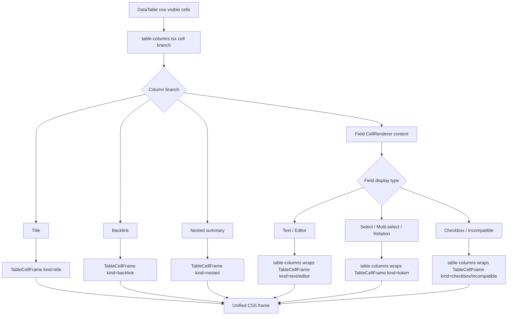

# 表格单元格布局框架统一 Implementation Plan

> **For agentic workers:** REQUIRED SUB-SKILL: Use `superpowers:subagent-driven-development` or `superpowers:executing-plans` to implement this plan task-by-task. Steps use checkbox (`- [ ]`) syntax for tracking.

**Goal:** 落地 [表格单元格布局框架统一方案](C:/Code/data-editor/docs/plans/2026-06-11-表格单元格布局框架统一方案.md)，用统一 `TableCellFrame` contract 收敛主表 body 单元格的上下留白、视觉基线、wrapped 对齐和编辑态浮框边界，避免继续用局部 `vertical-align` / padding 修补。

**Architecture:** `td.data-cell` 只保留表格语义、边框、列宽、背景和定位上下文；所有 body cell 内容必须经过 `TableCellFrame -> table-cell-content`。`table-columns.tsx` 是唯一 outer frame 入口，普通 `CellRenderer` 只负责字段类型内容分派并返回内容节点，不允许自行渲染 `.table-cell-frame`。Text、Title、Token、Backlink、Nested、Checkbox、Incompatible、Editor 都由 `table-columns.tsx` 显式声明 `kind` 和 `layout`。

**Tech Stack:** React 18, TypeScript, TanStack Table, CSS, Playwright e2e, Node.js `node:test`.

---

## 方案概述

### 1. 总体目标和范围

本执行方案解决主表格单元格布局框架不统一导致的视觉问题：

- 标题列、chip、普通文本在同一行内上下视觉中心不一致。
- 单行单元格在同行被其它内容撑高时出现底部额外留白。
- 编辑态浮框曾依赖负 margin / `td` padding 推算，容易只贴合局部区域。
- Select / Multi-select / Relation trigger 自身 padding / min-height 影响整格节奏。
- Backlink、Nested summary、Checkbox、Incompatible 等特殊分支未纳入统一框架，容易遗漏。

执行范围包括：

- 新增 `src/table/TableCellFrame.tsx`。
- 调整 `table-columns.tsx` 的 body cell render 分支，确保所有分支在同一个 outer frame 入口返回统一 frame。
- 调整 `CellRenderer.tsx`，让其只返回内容节点，不承担 frame 包裹职责。
- 收敛 `styles.css` 中 `td.data-cell`、文本 cell、标题 cell、token trigger、编辑态浮框相关样式职责。
- 补充 Playwright E2E，覆盖同一行标题/chip/text 视觉中心、特殊分支、wrapped、编辑态浮框和保存语义。

执行范围不包括：

- 不改字段类型推断和字段配置模型。
- 不改 autosave / save coordinator 架构。
- 不改详情页布局。
- 不改表头、列拖拽、列宽调整。
- 不重构 Radix Popover 内部实现。
- 不引入长期兼容双框架；完成后清理旧布局职责。

### 2. 各阶段任务概要

1. **基线与失败测试阶段**
   - 主要工作：新增/调整 E2E，先覆盖当前真实失败场景。
   - 预期成果：至少一个测试能证明标题、chip、普通文本或单行高行留白当前不满足目标。
   - 执行顺序：第一步，先失败再实现。

2. **统一 frame 基础设施阶段**
   - 主要工作：新增 `TableCellFrame` 类型、组件和基础 CSS contract，并同步建立 `table-columns.tsx` 中的 frame meta 推导入口。
   - 预期成果：具备 `kind` / `layout` 显式声明能力，且明确 `table-columns.tsx` 是唯一 outer frame 入口。
   - 执行顺序：测试基线后。

3. **Text 与 Title 迁移阶段**
   - 主要工作：迁移普通文本和标题列，让最常见的同一行文本类内容共享 frame。
   - 预期成果：标题列和普通文本在普通行、高行内垂直中心一致；wrapped 文本仍顶部对齐。
   - 执行顺序：frame 基础设施完成后。

4. **Token 类迁移阶段**
   - 主要工作：迁移 Select / Multi-select / Relation，收敛 trigger padding / min-height 和点击热区。
   - 预期成果：chip 与文本在同一行内视觉中心一致；popover 触发区域不缩小。
   - 执行顺序：Text/Title 通过后。

5. **特殊分支迁移阶段**
   - 主要工作：迁移 Backlink、Nested summary、Checkbox、Incompatible。
   - 预期成果：所有非普通 `CellRenderer` 分支都进入统一 frame，不再形成新旧框架共存。
   - 执行顺序：Token 类通过后。

6. **编辑态浮框迁移阶段**
   - 主要工作：让 `TableTextCellEditor` 在统一 frame 下工作，保持 blur-only 保存语义，并确保浮框贴合整个 `td`。
   - 预期成果：普通行、高行、wrapped 情况下编辑态边框均贴合单元格边界。
   - 执行顺序：所有普通展示分支迁移后。

7. **旧样式清理与文档验证阶段**
   - 主要工作：删除或降级旧 `td padding`、`vertical-align`、trigger 高度修补等样式职责，跑完整验证。
   - 预期成果：没有旧布局职责残留；E2E、`npm test` 和截图级核对通过。
   - 执行顺序：最后。

### 3. 整体结构框架

目标 DOM contract：

```tsx
<td
  className="data-cell"
  data-cell-kind="data"
  data-column-field={fieldName}
  data-wrap-mode="truncate|wrap"
>
  <div
    className="table-cell-frame"
    data-cell-frame-kind="text|title|token|editor|checkbox|nested|backlink|incompatible"
    data-cell-frame-layout="center|top|editor"
  >
    <div className="table-cell-content" data-cell-content-kind="...">
      <div className="table-cell-content-main">
        {mainContent}
      </div>
      {issue ? <span className="table-cell-issue-slot">{issue}</span> : null}
    </div>
  </div>
</td>
```

`td` 不再承载 `data-cell-layout`。布局模式只写在 `.table-cell-frame[data-cell-frame-layout]` 上，避免 `DataTable.tsx` 的 `td` 渲染层和 `table-columns.tsx` 的内容渲染层之间产生反向传递依赖。

渲染职责流：



---

## 文件结构与职责

### 新增文件

- `src/table/TableCellFrame.tsx`
  - 导出 `TableCellFrame`、`TableCellContentKind`、`TableCellLayout`。
  - 负责统一 DOM contract。
  - 不负责字段类型判断，不负责保存逻辑。

### 修改文件

- `src/table/table-columns.tsx`
  - 作为唯一 outer frame 入口统一包裹所有 body cell 分支。
  - 新增或内联 `resolveCellFrameMeta()`，根据 `columnModel`、最终 `displayType`、`value`、`wrapped`、`textEditable` 推导 `kind` 和 `layout`。
  - 标题列、Backlink、Nested summary 必须显式接入 frame。
  - 普通字段分支先推导 frame meta，再把 `CellRenderer` 返回的内容节点放入 frame。

- `src/table/CellRenderer.tsx`
  - 只负责字段类型内容分派和内容节点渲染。
  - 不 import `TableCellFrame`，不输出 `.table-cell-frame`。
  - Text、Checkbox、Incompatible、Select、Multi-select、Relation、Editor 内容必须能被 `table-columns.tsx` 的 frame 包裹。
  - 不允许遗漏 `shouldShowIssue` 的布局位置；issue 必须作为内容层 trailing accessory，不得改变主内容垂直中心。

- `src/table/BacklinkCellViewer.tsx`
  - 清理只属于整格布局的 class 职责。
  - 保留 backlink 文本/chip 的内容外观和打开行为。

- `src/table/OptionFieldEditor.tsx`
  - 收敛 table surface 下 trigger 的 `padding` / `min-height` 职责。
  - 保持 trigger 可聚焦、可点击、作为 Popover anchor。

- `src/table/RelationCellEditor.tsx`
  - 与 token 类 contract 对齐。
  - 保持 Relation open target 和 popover 行为。

- `src/editing/TableTextCellEditor.tsx`
  - 保持 manual commit / blur-only 保存语义。
  - 配合 frame 后调整编辑态浮框定位，不恢复负 margin 模型。

- `src/styles.css`
  - 新增 `.table-cell-frame` / `.table-cell-content` 样式。
  - 清理 `td.data-cell` 内容 padding。
  - 清理业务性 `vertical-align`。
  - 新增或调整 issue/accessory 内容层样式，确保校验图标不撑偏主内容中心。
  - 收敛 `.multi-select-trigger`、`.title-cell-button`、`.cell-display` 等只承担内容职责。

- `tests/data-editor.spec.ts`
  - 新增同一行多内容类型视觉中心测试。
  - 新增特殊分支测试。
  - 调整已有表格文本编辑和 wrapped 测试。

- `tests/view-state.test.mjs`
  - 增加静态结构契约测试，锁定 `TableCellFrame` 引入和 `CellRenderer` / `table-columns` 分工。
  - 至少断言 `table-columns.tsx` 引入 `TableCellFrame`，Title / Backlink / Nested / 普通字段四类分支均经过 frame。
  - 至少断言 `CellRenderer.tsx` 不 import `TableCellFrame`，不渲染 `.table-cell-frame`。

---

## 执行任务清单

### Task 1：建立失败测试与现状基线

- [ ] 在 `tests/data-editor.spec.ts` 新增临时 fixture：一行包含 `title`、`element/status` chip、普通 text、wrapped text。
- [ ] 新增测试：标题、chip、普通文本同一行视觉中心接近。
- [ ] 新增测试：单行 text 在 wrapped 高行内上下 gap 基本一致。
- [ ] 新增测试：chip 在 wrapped 高行内视觉中心接近 cell center。
- [ ] 新增测试：标题列在 wrapped 高行内视觉中心接近 cell center。
- [ ] 新增测试：wrapped 文本仍顶部对齐。
- [ ] 新增测试：编辑态浮框在普通行、高行、wrapped 三种场景下贴合 `td`。
- [ ] 新增截图验证点：标题、chip、普通文本同一行。
- [ ] 运行目标 E2E，确认至少一个测试因当前布局失败。

建议命令：

```powershell
$env:DATA_EDITOR_E2E_PORT='8792'
$env:DATA_EDITOR_E2E_BRIDGE_PORT='8794'
npm run test:e2e -- --grep "cell layout|single line table cells|table text edit"
```

完成标准：

- 有可解释的失败，失败来自布局问题而不是选择器错误。
- 测试 fixture 不污染仓库数据，临时文件有 `finally` 清理。

### Task 2：新增 `TableCellFrame`

- [ ] 新增 `src/table/TableCellFrame.tsx`。
- [ ] 定义：
  - `TableCellContentKind = "text" | "title" | "token" | "editor" | "checkbox" | "nested" | "backlink" | "incompatible"`
  - `TableCellLayout = "center" | "top" | "editor"`
- [ ] 组件输出 `.table-cell-frame` 和 `.table-cell-content`。
- [ ] 增加 `data-cell-frame-kind`、`data-cell-frame-layout`、`data-cell-content-kind`。
- [ ] 不引入业务逻辑，不 import field model。
- [ ] 在 `tests/view-state.test.mjs` 加静态测试，确认文件和关键 data attribute 存在。
- [ ] 在 `table-columns.tsx` 建立 `resolveCellFrameMeta()` 或等价内部 helper，作为唯一 frame meta 推导入口。

完成标准：

- `TableCellFrame` 只被 `table-columns.tsx` 作为 outer frame 引用。
- `CellRenderer.tsx` 不 import `TableCellFrame`。
- TypeScript 类型通过。

### Task 3：建立基础 frame CSS

- [ ] 新增 `.table-cell-frame`。
- [ ] 新增 `.table-cell-content`。
- [ ] `center` layout 使用 `align-items: center`。
- [ ] `top` layout 使用 `align-items: flex-start`。
- [ ] `editor` layout 使用 `align-items: stretch`。
- [ ] 在迁移第一个可见分支时同步将 `td.data-cell` 内容 padding 改为 `padding: 0`。
- [ ] 不允许把“旧 `td` padding + 新 frame padding”作为任何阶段完成状态。
- [ ] 删除 `td.data-cell[data-wrap-mode="wrap"]` 上表达业务布局的 `vertical-align`。

初始 CSS 建议：

```css
.table-cell-frame {
  align-items: center;
  box-sizing: border-box;
  display: flex;
  min-height: 36px;
  padding: 7px 8px;
  width: 100%;
}

.table-cell-frame[data-cell-frame-layout="top"] {
  align-items: flex-start;
}

.table-cell-frame[data-cell-frame-layout="editor"] {
  align-items: stretch;
}

.table-cell-content {
  align-items: center;
  display: flex;
  gap: 6px;
  min-width: 0;
  width: 100%;
}

.table-cell-content-main {
  min-width: 0;
  width: 100%;
}

.table-cell-issue-slot {
  flex: 0 0 auto;
}
```

完成标准：

- 不存在 `td.data-cell` 与 `.table-cell-frame` 同时控制整格上下 padding。
- 无 TypeScript / CSS selector 拼写错误。

### Task 4：迁移普通 Text 分支

- [ ] 在 `table-columns.tsx` 中让普通 Text 内容经过 `TableCellFrame kind="text"`。
- [ ] `wrapped ? "top" : "center"`。
- [ ] `CellRenderer` 只返回文本内容节点，不输出 `.table-cell-frame`。
- [ ] 确保 `issue` 图标仍在内容区域内显示，并作为 trailing accessory 处理。
- [ ] 保持 `title={textValue}`、截断、wrapped 展示行为。
- [ ] 运行普通 text 单元格相关 E2E。

完成标准：

- 普通 Text 单元格视觉中心测试通过。
- wrapped text 顶部对齐测试仍通过。

### Task 5：迁移标题列

- [ ] 在 `table-columns.tsx` 标题列分支外包 `TableCellFrame kind="title"`。
- [ ] 标题列 wrapped 使用 `layout="top"`，非 wrapped 使用 `layout="center"`。
- [ ] 清理 `.title-cell-button` 中决定整格高度的 padding/min-height 职责。
- [ ] 保持整格点击打开详情。
- [ ] 保持标题列不可表格内编辑。

完成标准：

- 标题列与普通文本同一行视觉中心一致。
- 标题点击打开详情 E2E 不回退。

### Task 6：迁移 Select / Multi-select / Relation

- [ ] Select 分支包 `TableCellFrame kind="token"`。
- [ ] Multi-select 分支包 `TableCellFrame kind="token"`。
- [ ] Relation 分支包 `TableCellFrame kind="token"`。
- [ ] table surface 下 `.multi-select-trigger` / `.relation-trigger` 不再决定整格上下 padding。
- [ ] trigger 仍占满 frame 的有效点击宽度。
- [ ] hover 背景覆盖合理区域。
- [ ] Popover anchor 仍来自 trigger。

完成标准：

- chip 与文本同一行视觉中心一致。
- Select / Multi-select / Relation 点击、搜索、选择、Relation open target 不回退。
- 编辑关闭时 Select / Multi-select / Relation 仍可操作。

### Task 7：迁移 Backlink / Nested / Checkbox / Incompatible

- [ ] Backlink 分支包 `TableCellFrame kind="backlink"`。
- [ ] Nested summary 分支包 `TableCellFrame kind="nested"`。
- [ ] Checkbox 分支包 `TableCellFrame kind="checkbox"`。
- [ ] Incompatible 分支包 `TableCellFrame kind="incompatible"`。
- [ ] 清理这些 class 中决定整格布局的职责。
- [ ] 补 E2E 和静态测试确认这些分支经过 frame。

完成标准：

- 所有 body cell 分支经过 frame。
- Backlink wrapped chip flow 仍正常。
- Checkbox 点击不回退。
- Nested summary 行为不回退。

### Task 8：迁移编辑态浮框

- [ ] `table-columns.tsx` 对可编辑 Text 状态包 `TableCellFrame kind="editor" layout="editor"`。
- [ ] `TableTextCellEditor` 保持为内容组件，不自行输出 outer frame。
- [ ] 保持 manual commit，不恢复输入中 autosave。
- [ ] 保持 blur / Enter / 文件切换前 flush。
- [ ] 编辑态浮框以 `td` 为定位上下文，外层编辑框使用 `position: absolute; inset: 0` 贴合单元格边界。
- [ ] 单行 input 不主动撑高行，编辑框高度等于当前 `td` 高度。
- [ ] wrapped textarea 采用内部滚动兜底：内容增长时不被外层裁切，若当前行高不能即时扩展，则 textarea 内部滚动。
- [ ] 不在输入过程中触发 autosave、row rerender 或 focus replacement。
- [ ] 删除负 margin 相关实现。

完成标准：

- 普通行、高行、wrapped 三种编辑态边框贴合 `td`。
- 输入中不写盘，blur 后保存。
- 切文件前 flush draft。

### Task 9：清理旧布局职责

- [ ] 复核 `td.data-cell` 已经是 `padding: 0`。
- [ ] 复核业务性 `td.data-cell[data-wrap-mode="wrap"] vertical-align` 已删除。
- [ ] 删除或降级 `.cell-text-content` 的整格对齐职责。
- [ ] 删除或降级 `.multi-select-trigger` 的整格 padding/min-height 职责。
- [ ] 删除或降级 `.title-cell-button` 的整格 padding/min-height 职责。
- [ ] 删除或降级 `Issue` / `.issue` 对整格垂直中心的影响，保留为 trailing accessory。
- [ ] 保留内容外观 class：chip 颜色、文本截断、按钮 hover 等。
- [ ] 用 `rg` 检查旧布局职责残留。

建议检查：

```powershell
rg -n "vertical-align|padding-top|padding-bottom|min-height|cell-text-content|multi-select-trigger|title-cell-button" src/styles.css src/table
```

完成标准：

- 旧布局样式只保留明确必要项。
- 不存在新旧 frame 并行控制整格上下留白。

### Task 10：验证与收尾

- [ ] 跑新增 E2E 子集。
- [ ] 跑表格编辑相关 E2E 子集。
- [ ] 跑 `npm test`。
- [ ] 使用 in-app browser 打开 `http://127.0.0.1:8787/` 进行截图级人工核对。
- [ ] 在桌面视口至少记录三类截图核对结果：普通行、wrapped 高行、编辑态短文本 cell。
- [ ] 如果启动/清理过服务，执行 `npm run service:finalize`。
- [ ] 记录 `8787/api/health` 和 `8791/health`。

建议 E2E：

```powershell
$env:DATA_EDITOR_E2E_PORT='8792'
$env:DATA_EDITOR_E2E_BRIDGE_PORT='8794'
npm run test:e2e -- --grep "cell layout|single line table cells|table text edit|keeps select"
```

完整验证：

```powershell
npm test
npm run service:finalize
Invoke-RestMethod -Uri http://127.0.0.1:8787/api/health | ConvertTo-Json -Depth 5
Invoke-RestMethod -Uri http://127.0.0.1:8791/health | ConvertTo-Json -Depth 5
```

完成标准：

- 新增和相关 E2E 通过。
- `npm test` 通过。
- 截图中标题、chip、普通文本同一行视觉中心一致。
- 截图覆盖普通行、wrapped 高行、编辑态短文本 cell。
- Browser 停留在 `http://127.0.0.1:8787/`。

---

## 测试设计细节

### 1. 同一行多内容类型 fixture

建议临时文件：

```json
[
  {
    "title": "燃烧之心",
    "element": "element",
    "description": "火焰技能暴击率+10%",
    "long_text": "这是一段用于撑高同行的长文本..."
  }
]
```

测试准备：

- 将 `element` 配置为 Select。
- 将 `long_text` 设置为 wrapped，并压窄列宽。
- 测 `title`、`element chip`、`description` 的中心点。

### 2. 几何断言

建议 helper：

```ts
function center(rect: DOMRect) {
  return (rect.top + rect.bottom) / 2;
}
```

断言：

```ts
expect(Math.abs(titleCenter - rowCellCenter)).toBeLessThanOrEqual(2);
expect(Math.abs(chipCenter - rowCellCenter)).toBeLessThanOrEqual(2);
expect(Math.abs(textCenter - rowCellCenter)).toBeLessThanOrEqual(2);
```

### 3. 截图核对

需要至少覆盖：

- 桌面视口普通行：标题 + chip + 文本。
- 桌面视口高行：wrapped 长文本撑高同一行。
- 桌面视口编辑态：短文本 cell 聚焦。

截图不是替代自动化，而是补足文字字形视觉中心与 DOM box center 的差异。

---

## 风险控制

### 1. 不要把 `td` 改成 flex

`td` 必须保留 table-cell 语义。否则可能影响 TanStack Table 列宽、sticky header、虚拟行测量和表格布局。

### 2. 不要只迁移 `CellRenderer`

标题列、Backlink、Nested summary 不走普通 `CellRenderer`。只迁移 `CellRenderer` 会复现同一类问题。

本执行方案采用更严格约束：`CellRenderer` 不允许 import 或输出 `TableCellFrame`，所有 outer frame 都由 `table-columns.tsx` 统一生成。

### 3. 不要缩小 token 点击区域

Select / Multi-select / Relation 的 trigger 仍然必须是可点击、可聚焦、可作为 Popover anchor 的元素。

### 4. 不要让 wrapped 内容居中

wrapped 内容必须顶部对齐。单行内容居中和 wrapped 顶部对齐是两个不同布局模式。

### 5. 不要恢复输入中 autosave

表格 Text 编辑器仍保持 manual commit。任何 frame 改造都不能把 `commitMode` 改回 debounced/realtime。

### 6. 不要让新旧 padding 共存

`td.data-cell` 和 `.table-cell-frame` 不能同时承担整格上下 padding。引入 frame 后必须同步把 `td.data-cell` 内容 padding 归零，否则会复现底部额外留白。

### 7. 不要让 issue 图标改变主内容中心

校验图标只能作为 trailing accessory。它可以占据右侧宽度，但不能改变标题、chip、普通文本的垂直中心计算，也不能压缩 token trigger 的点击热区。

### 8. 不要让 `td` 承担 layout 状态

`td` 不写 `data-cell-layout`，layout 只由 `.table-cell-frame[data-cell-frame-layout]` 表达。这样可以避免 `DataTable.tsx` 需要反向读取 `table-columns.tsx` 的内容布局决策。

---

## 完成判定

全部满足才算完成：

- [ ] `td.data-cell` 不再直接负责内容上下 padding。
- [ ] 所有 body cell 分支经过 `TableCellFrame`。
- [ ] `TableCellFrame` 只由 `table-columns.tsx` 作为 outer frame 渲染。
- [ ] `CellRenderer.tsx` 不 import `TableCellFrame`，不输出 `.table-cell-frame`。
- [ ] `TableCellFrame` 明确暴露 `kind` 和 `layout`。
- [ ] `td` 不依赖 `data-cell-layout` 表达内容布局。
- [ ] Text、Title、Token、Backlink、Nested、Checkbox、Incompatible、Editor 均已迁移。
- [ ] issue/accessory 不改变主内容垂直中心。
- [ ] 同一行标题、chip、普通文本视觉中心一致。
- [ ] 单行内容在高行中上下留白一致。
- [ ] wrapped 内容仍顶部对齐。
- [ ] 编辑态浮框贴合整个 `td`。
- [ ] Select / Multi-select / Relation 操作不回退。
- [ ] 表格 Text 输入中不 autosave，blur/切换前保存不回退。
- [ ] 新增 E2E、相关 E2E、静态结构测试、`npm test` 通过。
- [ ] 桌面视口截图核对覆盖普通行、wrapped 高行、编辑态短文本 cell。
- [ ] 完成服务 finalize 和 health 结果记录。
