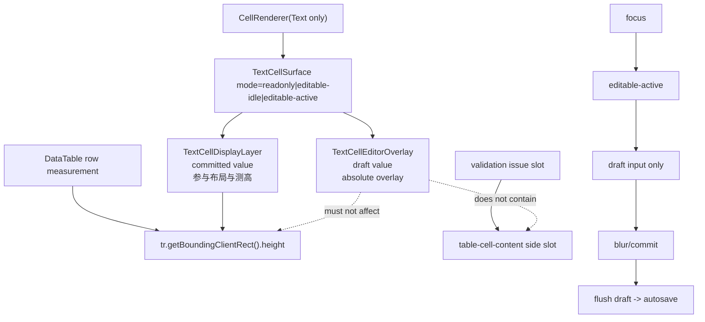

# 文本编辑态行高稳定治理 Implementation Plan

> **For agentic workers:** REQUIRED SUB-SKILL: Use `superpowers:subagent-driven-development` or `superpowers:executing-plans` to implement this plan task-by-task. Steps use checkbox (`- [ ]`) syntax for tracking.

**Goal:** 落地 [文本编辑态行高稳定治理方案](C:/Code/data-editor/docs/plans/2026-06-12-文本编辑态行高稳定治理方案.md)，彻底消除主表格普通 `Text` 单元格在 wrapped 行中进入编辑态时的轻微行高变化，同时保持输入不中断、autosave 延后到退出编辑态后执行、并确保 validation issue 图标继续稳定显示。

**Architecture:** 文本 cell 从“只读态 / 编辑态互相替换布局节点”重构为“稳定 display layer + 非测高 editor overlay”。`TextCellDisplayLayer` 永远参与布局与测高，且只读取 committed value；`TextCellEditorOverlay` 仅在 `editable-active` 状态渲染，只读取 draft value，并通过绝对定位覆盖文本主区而不参与行高真相。全局编辑模式只切换 cell 进入 `editable-idle`，不直接挂载 overlay；只有具体 cell 激活后才进入 `editable-active`。issue slot 继续保留在 overlay 外。

**Tech Stack:** React 18, TypeScript, TanStack Table, CSS, Playwright e2e, Node.js `node:test`.

---

## 方案概述

### 1. 总体目标和范围

本执行方案解决的是当前主表格普通文本单元格在 wrapped 行中的编辑态行高轻微跳动问题。核心目标有四个：

- 进入全局编辑模式但未激活具体 cell 时，wrapped 行高不变
- 激活具体文本 cell 进入编辑态时，wrapped 行高不变
- 输入过程中不触发 autosave 打断，也不让 draft 改变行高真相
- validation issue 图标继续可见，但不重新参与文本编辑浮层内部布局

本执行方案执行范围包括：

- 重构表格普通 `Text` cell 的显示/编辑结构
- 新增 `TextCellSurface`、`TextCellDisplayLayer`、`TextCellEditorOverlay`
- 调整 `CellRenderer` 文本路径的 committed / draft 分层
- 调整 `TableTextCellEditor` 角色，使其退化为 overlay 内部输入控件
- 调整 `styles.css` 中文本 cell、overlay、issue slot 的样式职责
- 复核 `DataTable.tsx` 的 wrapped 行高测量时机
- 补充 E2E 和静态结构契约测试

本执行方案不包括：

- 不让 title 列进入表格内编辑
- 不把 `Number / ID / Select / Multi-select / Relation / Checkbox / Nested / Backlink` 纳入同一轮 overlay 架构
- 不再次重构详情页输入体系
- 不实现键盘跨 cell 导航、批量粘贴、撤销栈
- 不修改主表格之外的 detail panel、toolbar、column header 结构
- 不使用 portal 把文本编辑 overlay 挂到表格结构之外

### 2. 各阶段任务概要

1. **测试基线阶段**
   - 主要工作：先补失败测试，锁定“编辑模式开关”和“cell 激活编辑”两个层级都不能改 wrapped 行高。
   - 预期成果：至少有失败用例能证明当前结构仍会触发行高变化。
   - 执行顺序：第一步，严格先红后绿。

2. **文本结构基础设施阶段**
   - 主要工作：引入 `TextCellSurface / TextCellDisplayLayer / TextCellEditorOverlay`，建立 committed / draft 双层 contract。
   - 预期成果：文本 cell 具备稳定布局层和独立输入浮层。
   - 执行顺序：测试基线后。

3. **渲染链接入阶段**
   - 主要工作：将 `CellRenderer` 的普通 `Text` 路径切到新结构，并保留 title 与非文本路径不受影响。
   - 预期成果：表格文本 cell 不再在只读态和编辑态之间互斥替换 outer layout 节点。
   - 执行顺序：基础设施完成后。

4. **样式与 issue 协同阶段**
   - 主要工作：完成 overlay 定位、越界显示、z-index、pointer 事件和 issue slot 协同。
   - 预期成果：多行输入可越出 row，issue icon 仍稳定显示且不进入 overlay。
   - 执行顺序：渲染链接入后。

5. **测高与 autosave 保护阶段**
   - 主要工作：确认 `DataTable` 行高缓存不会把编辑态临时浮层当作新真相，必要时补充编辑期间冻结保护。
   - 预期成果：编辑模式切换与输入 draft 更新都不再触发行高真相漂移。
   - 执行顺序：样式协同后。

6. **完整验证与收尾阶段**
   - 主要工作：跑定向 E2E、静态结构测试、类型检查，并补文档。
   - 预期成果：行为、结构和样式三层都被锁住，后续不易回归。
   - 执行顺序：最后。

### 3. 整体结构框架

---

## 一、执行前约束

### 1. 必须遵守的核心 contract

实现时必须严格遵守以下三条，不允许边做边弱化：

1. `display layer owns layout`
2. `overlay owns interaction`
3. `commit is the only boundary that may change measured height`

展开后就是：

- `TextCellDisplayLayer` 是唯一布局真相
- `TextCellEditorOverlay` 只是交互层
- 进入编辑态、输入 draft、退出未改内容都不能改变 wrapped 行高
- 只有 commit 之后 committed value 真正变化，才允许行高重测

### 2. 本轮硬决策

这两点已经在框架方案中确认，本执行方案按硬约束处理：

1. 多行编辑浮层允许超出当前 row 高度，覆盖下方行，不通过继续撑高 row 来展示输入内容
2. validation issue 图标继续显示，且保留在 overlay 外，不并入文本编辑浮层

### 3. editable-active 的唯一激活入口与状态源

本轮必须把 `editable-active` 的来源收敛到唯一入口，禁止出现双轨激活：

- 全局状态源仍是现有 `tableTextEditMode`
- `tableTextEditMode = true` 只允许 cell 进入 `editable-idle`
- `editable-active` 只能由“当前文本 cell 主区被点击或通过键盘激活”进入
- `blur / commit / cancel / 失焦切换到其他 cell` 必须退出 `editable-active`
- 表格范围内同一时刻只允许一个 `editable-active` 文本 cell

明确禁止：

- 仅因全局编辑按钮开启就直接挂载 overlay
- 在 `CellRenderer` 内部额外新建独立全局 store 管理 active 状态
- 让 active editor 注册链和 cell 点击链各自维护一份不同的 active truth

### 4. overlay 的 ownership 与 scroll 同步规则

本轮必须把 overlay 的归属关系和滚动行为写死：

- overlay 只能归属于当前文本 cell 的 `TextCellSurface`
- overlay 不能提升为 row 级共享 overlay
- overlay 不能提升为 table 级共享 overlay
- overlay 不能挂到 `td.data-cell` 之外的独立宿主层
- 表格滚动时，overlay 必须继续随所属 cell 同步移动
- 如果所属 cell 离开可视区，必须先执行 `flush/blur`，再卸载 overlay

明确禁止：

- 用 row 级 manager 托管多个文本 cell 的 overlay
- 用 table 级全局 active overlay 逃避当前 cell ownership
- 滚动后保留一个已脱离原 cell 可视语义的悬空 overlay

### 5. display / overlay 共享样式 contract

为避免几何真相稳定后重新出现视觉起点分叉，本轮要求 display layer 与 overlay 输入控件共享同一套样式 token 来源：

- typography token
- content inset token
- focus frame inset token

明确禁止：

- display layer 单独硬编码 `font / line-height / padding`
- overlay input/textarea 再单独写一套不同的 `font / line-height / padding`
- 通过局部补丁让两层视觉接近，但不共用同一套 token

### 6. 本轮字段边界

本轮只治理：

- `displayType === "Text"` 的普通表格单元格

本轮明确不治理：

- title
- number
- id
- relation
- select
- multi-select
- checkbox
- nested
- backlink

---

## 二、任务拆解

### Task 1：补测试基线，先看到失败

- [ ] 在 `tests/data-editor.spec.ts` 新增“开启全局编辑模式但未激活 cell 时，wrapped 行高不变”的用例。
- [ ] 新增“激活具体 wrapped 文本 cell 后，row height 不变”的用例。
- [ ] 新增“输入过程中 row height 不变”的用例。
- [ ] 新增“blur 未改值时，row height 不漂移”的用例。
- [ ] 新增“commit 后内容变长时，row height 只在 commit 后变化”的用例。
- [ ] 新增“issue 图标在编辑态仍可见，且不进入 overlay”的用例。

建议测试数据：

- 一列短文本 + 一列长 wrapped 文本，构造高行
- 一列带 validation issue 的文本字段
- 至少一条数据能验证 overlay 越出 row 但不改 row height

通过标准：

- 至少一个测试在当前实现下明确失败
- 失败原因能对应到“编辑态替换布局节点”而不是 unrelated 样式问题

### Task 2：前置排查裁剪链与定位链

- [ ] 沿 `td.data-cell -> tr -> tbody -> table -> table outer wrapper -> scroll container` 逐层检查 `overflow`、`position`、`z-index`、stacking context。
- [ ] 确认 overlay 如果挂在 `TextCellSurface` 下，越界内容不会被祖先容器直接裁剪。
- [ ] 如果存在祖先裁剪，先决定是调整裁剪链，还是重选 overlay 挂载层；未完成前不得进入样式细调。

排查输出必须回答三件事：

1. overlay 的 containing block 是谁
2. overlay 最先会被哪一层裁剪
3. 是否存在会压过 overlay 的现有 stacking context

建议把排查结果以简短结论记录到执行日志或提交说明中：

- containing block
- first clipping ancestor
- top competing stacking context

特别约束：

- 本轮不允许用 portal 规避裁剪链问题
- 必须先在表格现有 DOM 内收口 containing block 和裁剪边界

通过标准：

- 能明确写出 overlay 所在层级的 containing block
- 能证明越界显示策略在当前 DOM 结构下可行，或提前发现必须调整的祖先容器

### Task 3：建立文本 cell 新结构

- [ ] 新增 `TextCellSurface` 组件。
- [ ] 新增 `TextCellDisplayLayer` 组件。
- [ ] 新增 `TextCellEditorOverlay` 组件。
- [ ] 设计 `mode="readonly|editable-idle|editable-active"` 的明确 props contract。

结构约束：

- `TextCellSurface`
  - `position: relative`
  - 是 overlay 唯一 containing block
  - 负责 `data-mode`
  - 只能替换当前文本主内容节点，不能包裹 `table-cell-issue-slot`
  - 只能拥有当前 cell 的唯一 overlay，不得共享到 row / table 级

- `TextCellDisplayLayer`
  - 永远渲染
  - 只吃 committed value
  - wrapped 时继续承担真实文本排版
  - 必须复用共享 typography / inset token

- `TextCellEditorOverlay`
  - 仅在 `editable-active` 挂载
  - 只吃 draft value
  - 不承担布局真相
  - 必须复用与 display layer 相同的 typography / inset token

通过标准：

- 代码中不再存在“只读文本 outer shell / 编辑文本 outer shell”两条互斥布局路径

### Task 4：接入 `CellRenderer` 文本路径

- [ ] 让 [src/table/CellRenderer.tsx](C:/Code/data-editor/src/table/CellRenderer.tsx) 中普通 `Text` 分支统一走 `TextCellSurface`。
- [ ] 保留 title 点击打开详情页行为，不接入 overlay。
- [ ] 非文本字段逻辑不得被误改。

具体要求：

- `readonly`：只渲染 display layer
- `editable-idle`：仍只渲染 display layer
- `editable-active`：display layer + overlay 共存

特别约束：

- `TextCellDisplayLayer` 不能订阅 draft
- overlay 不能读取 committed value 作为实时显示源，除初始化外应以 draft 为准
- `table-cell-issue-slot` 必须继续作为 `TextCellSurface` 的 sibling 保留在外层，不能被包入 `TextCellSurface`
- 点击 issue icon 默认先触发当前文本 cell 的 `flush/blur`，再处理 issue 交互，不能留下悬空 active overlay

通过标准：

- 开编辑按钮不再触发文本 cell outer layout 替换
- 只有具体 cell 激活时才挂载 overlay

### Task 5：调整 `TableTextCellEditor` 职责

- [ ] 将 [src/editing/TableTextCellEditor.tsx](C:/Code/data-editor/src/editing/TableTextCellEditor.tsx) 收敛成 overlay 内部输入控件。
- [ ] 保留 `flushDraft / cancelDraft / registerActiveEditor`。
- [ ] 移除其作为文本 cell 几何壳层的职责。

具体要求：

- 单行仍使用 `StableTextInput`
- 多行仍使用 `StableTextarea`
- draft 生命周期不变
- 但 `textarea.scrollHeight` 的变化只服务 overlay 自身，不再成为 row 高度真相

通过标准：

- 编辑控件能继续复用现有稳定输入逻辑
- 不再通过 `.table-text-cell-editor` 直接定义 cell outer geometry

### Task 6：实现 overlay 与 issue slot 协同

- [ ] 在 `styles.css` 中新增：
  - `text-cell-surface`
  - `text-cell-display-layer`
  - `text-cell-editor-overlay`
  - `data-mode` 三态样式
- [ ] 让 overlay 只覆盖 `table-cell-content-main`
- [ ] 保持 issue slot 在 overlay 外部继续可见
- [ ] 保证 overlay 越出 row 时不穿透点击到底层行
- [ ] 补充编辑态下 display layer 的 `aria-hidden` 语义处理
- [ ] 增加“overlay 越界内容不被裁剪”的可视化或几何测试
- [ ] 保证 display layer 与 overlay 输入控件使用同一组 typography / inset token
- [ ] 明确滚动中 overlay 的跟随与离屏卸载行为

关键样式规则：

- `TextCellSurface { position: relative; }`
- `TextCellEditorOverlay { position: absolute; inset: 0; z-index: ... }`
- overlay 可越界，但不得遮住关键 toolbar / header 交互
- display layer 在 `editable-active` 下可 `visibility: hidden`，但不能 `display: none`

通过标准：

- 编辑态下 issue icon 仍显示
- issue icon 不进入 overlay 内部
- overlay 多行输入可覆盖下方行，但 row 几何不变
- overlay 越界内容未被祖先错误裁剪
- overlay 与下方行视觉重叠时，不会误触下方行

### Task 7：复核 `DataTable` 测高更新时机

- [ ] 检查 [src/table/DataTable.tsx](C:/Code/data-editor/src/table/DataTable.tsx) 中 `useLayoutEffect` 的测高时机。
- [ ] 确认全局编辑模式切换不会触发行高真相变化。
- [ ] 确认 draft 输入过程中不会把 overlay 几何写入 `measuredRowHeights`。
- [ ] 如仍有残余漂移，补“编辑期间冻结当前测量值，commit 后解冻重测”的辅助保护。
- [ ] 复核滚动时 active overlay 的 flush / blur / 卸载链路，确保不会在 cell 离屏后保留悬空 active 状态

冻结保护只允许作为兜底层，不能替代 display/editor 分层。

通过标准：

- `readonly -> editable-idle` 不更新有效行高真相
- `editable-idle -> editable-active` 不更新有效行高真相
- commit 后内容真变长时，才允许测高更新

### Task 8：补静态结构测试

- [ ] 在 `tests/view-state.test.mjs` 或等效静态契约测试中新增断言。

至少锁定：

- 文本 cell 统一经过 `TextCellSurface`
- display layer 始终存在
- overlay 为额外层而非替换层
- display layer 读取 committed value
- overlay 读取 draft value
- `TextCellSurface` 是 overlay 的唯一 positioned ancestor
- `table-cell-issue-slot` 不在 `TextCellSurface` JSX 子树中
- overlay 直接挂在 `TextCellSurface` 下，不额外再套一层竞争性的 positioned wrapper
- 同一时刻只允许一个 active text overlay

通过标准：

- 后续如果有人把文本路径重新改回“只读/编辑互斥 outer shell”，测试会直接失败

---

## 三、推荐实施顺序

1. 先补 E2E，确认当前失败
2. 再做裁剪链 / 定位链前置排查
3. 再建 `TextCellSurface` 三件套
4. 接 `CellRenderer` 文本路径
5. 调整 overlay / issue slot 样式
6. 复核 `DataTable` 测高保护
7. 补静态结构测试
8. 跑定向验证与全量必要验证

原因：

- 先锁失败行为，防止重构过程中丢失目标
- 先确认裁剪链和定位链，避免 overlay 结构做完后再返工挂载层
- 先建新结构，再接旧渲染路径，避免边补边乱
- 测高保护放在后面做，是为了先验证 display/editor 分层本身能解决多少问题

---

## 四、验证方案

### 1. 必跑验证

- [ ] `node --test tests/view-state.test.mjs`
- [ ] `npm run typecheck`
- [ ] 定向 `playwright`：
  - 开编辑模式但未 focus cell，row height 不变
  - 激活 wrapped 文本 cell，row height 不变
  - 输入过程中 row height 不变
  - commit 后内容变长，row height 才变化
  - issue icon 编辑态仍可见且不进入 overlay
  - overlay 越界后仍完整可见，没有被祖先裁剪
  - 滚动后 overlay 继续跟随所属 cell，或在 cell 离屏时正确 flush/卸载

### 2. 建议人工验证

在正式服务 `http://127.0.0.1:8787/` 上人工确认：

- 开编辑按钮时页面不再轻微跳动
- 单行 wrapped 文本进入编辑态时高度不变
- 多行 wrapped 文本输入变长时，浮层向下覆盖而不是把 row 撑高
- issue 图标仍在原位
- blur 后再触发保存状态
- 滚动表格时，overlay 不会悬空停留在旧位置

### 3. 验收标准

必须全部满足：

1. 开启全局编辑模式但未进入具体 cell 时，wrapped 行高变化误差 `<= 1px`
2. 激活具体文本 cell 前后，wrapped 行高变化误差 `<= 1px`
3. 同一环境下连续切换编辑态不出现累积漂移
4. 输入过程中不触发 autosave 打断
5. commit 后内容变长时，行高只按 committed value 重测
6. 多行输入允许越界覆盖，但不改 row 几何
7. issue 图标继续显示，且不在 overlay 内
8. overlay 滚动时跟随所属 cell，离屏后不残留悬空 active 状态
9. `Select / Multi-select / Relation` 既有行为不回归

---

## 五、风险控制

### 1. 主要风险

- overlay 越界后遮挡相邻行交互
- overlay 被祖先容器裁剪，导致方案逻辑正确但视觉失败
- issue slot 与 overlay z-index 冲突
- committed / draft 双值分层写错，导致 display layer 仍跟着 draft 变化
- 测高冻结保护做得过重，反而掩盖真实 commit 后的高度变化
- scroll 后 overlay 与 active 状态不同步

### 2. 控制策略

- 每一阶段完成后都跑定向 E2E，不等到最后一次性验证
- 将 committed / draft 分层写成显式 props，不靠隐式闭包共享
- overlay 与 issue slot 用明确 DOM 层级，不靠偶然 CSS 叠加
- 先解决 containing block / overflow 链，再做 overlay 样式微调
- display layer 与 overlay 输入统一从同一套 typography / inset token 取值
- 若引入冻结保护，必须配单独测试证明“commit 后仍能更新行高”

---

## 六、完成定义

当且仅当以下条件都成立时，本方案才算完成：

- 普通 `Text` 表格单元格已切到 `TextCellSurface` 新结构
- wrapped 行进入编辑态不再产生可感知几何跳动
- draft 与 committed 值职责分离
- overlay 越界策略和 issue slot 外置策略都已落地
- overlay ownership、scroll 同步和单活 active editor 约束都已落地
- 定向 E2E、静态结构测试、类型检查通过
- 不引入 title / select / relation 等额外范围膨胀

这份执行方案完成后，主表格文本编辑态行高稳定问题才算真正从框架层面收口，而不是继续依赖 CSS 微调。
