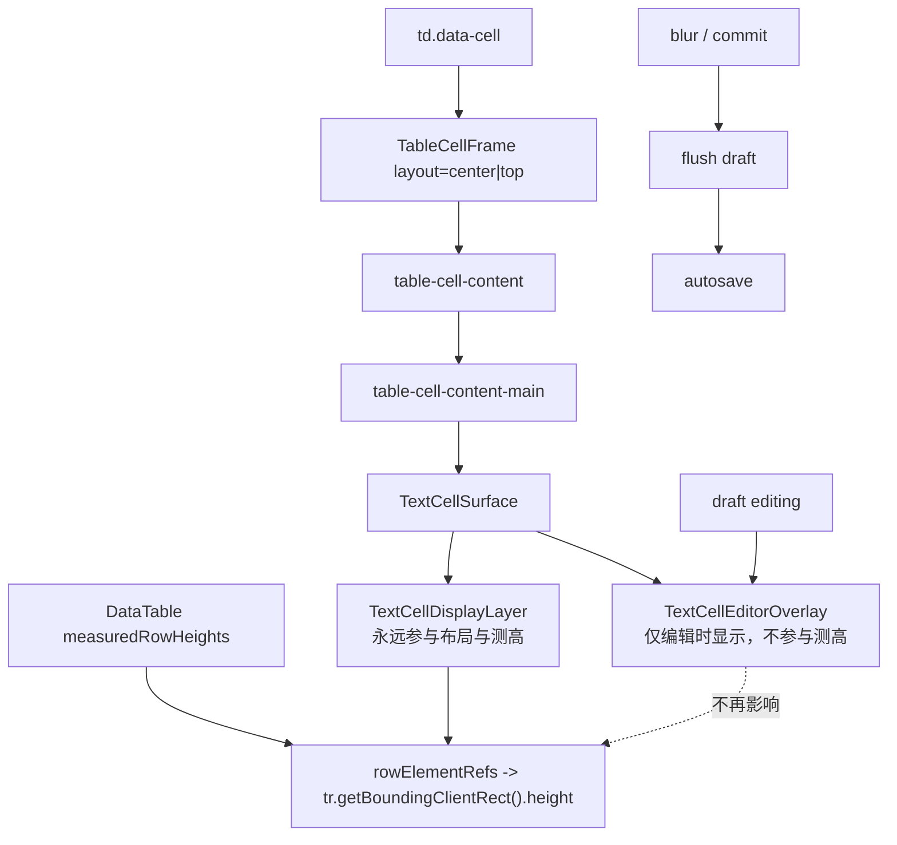

# 文本编辑态行高稳定治理方案

## 方案概述

### 1. 总体目标和范围

本方案目标是彻底治理 data-editor 主表格中普通文本单元格在进入编辑态时出现的轻微行高变化问题，重点解决 wrapped 行在“只读态 -> 编辑态 -> 退出编辑态”过程中由于内部 DOM 结构替换、表单控件行盒差异、亚像素取整和行高缓存重测所引发的视觉跳动。

本方案聚焦主表格 body 内的普通 `Text` 单元格，覆盖以下场景：

- 表格进入 `top-layout` 后的 wrapped 行
- 编辑按钮开启后，普通文本单元格进入实时编辑
- 输入过程中 autosave 延后到退出编辑态后再执行
- wrapped 行高缓存与文本编辑切换之间的交互

本方案不包括：

- 标题列在表格内可编辑；标题列继续保持当前“点击打开详情页”的行为
- `Select / Multi-select / Relation / Checkbox / Nested / Backlink` 的编辑架构统一改造
- 详情页输入组件的再次重构
- 键盘跨 cell 导航、批量粘贴、撤销栈等扩展能力

### 2. 各阶段任务概要

1. **问题收敛阶段**
   - 主要工作：明确当前行高测量真相、文本 cell 的只读/编辑渲染链、autosave flush 时序。
   - 预期成果：确认问题不是外层纵向对齐框架未统一，而是编辑态替换了参与测高的真实 DOM。
   - 执行顺序：第一步。

2. **文本 cell 结构重构阶段**
   - 主要工作：引入稳定的 `TextCellSurface`，把显示层和编辑层彻底拆开。
   - 预期成果：只读态和编辑态不再互相替换布局节点。
   - 执行顺序：问题收敛后。

3. **测高机制收敛阶段**
   - 主要工作：将 wrapped 行高真相固定到 display layer，编辑 overlay 不再参与行高计算。
   - 预期成果：编辑开关不再成为行高变化触发源。
   - 执行顺序：文本 cell 结构重构后。

4. **交互与 autosave 时序阶段**
   - 主要工作：输入过程中只维护 draft，不触发 autosave；在 blur / commit 时再 flush 并进入保存链。
   - 预期成果：既不打断输入，也不因为保存状态重渲染导致测高抖动。
   - 执行顺序：测高机制收敛后。

5. **验证与回归阶段**
   - 主要工作：补 E2E 和静态结构测试，锁定编辑态前后行高稳定。
   - 预期成果：从测试层明确禁止“进入编辑态导致 wrapped 行高变化”的回归。
   - 执行顺序：最后。

### 3. 整体结构框架

最终结构必须从“编辑态替换布局节点”收敛为“稳定显示层 + 非测高编辑浮层”：



这一版方案的核心 contract 必须固定为：

> `display layer owns layout; overlay owns interaction; commit is the only boundary that may change measured height.`

---

## 一、问题定义

当前问题不是大幅布局错误，而是 wrapped 行在进入文本编辑态时仍会发生轻微高度变化，通常表现为：

- 单行 wrapped 文本进入编辑态后，整行高度变化约 `0.5px ~ 1px`
- 多行 wrapped 文本在编辑开关切换时发生 `61.5 -> 62`、`148.5 -> 149` 这类级别的变化
- 问题已经不再来自 `TableCellFrame` / `top-layout` 的整体垂直对齐框架，而来自文本 cell 内部的参与测高节点发生了切换

这类变化虽然小，但会让用户在切换编辑模式时明显感觉表格轻微跳动，因此属于需要从架构层面处理的问题，而不是继续做 CSS 微调。

---

## 二、现状证据链

### 1. wrapped 行高是实测缓存，而不是纯样式推导

[src/table/DataTable.tsx](C:/Code/data-editor/src/table/DataTable.tsx) 中：

- `hasWrappedField` 决定表格是否进入 `top-layout`
- `rowElementRefs` 保存当前可见 `tr`
- `useLayoutEffect` 会在 wrapped 场景下遍历 `rowElementRefs`
- 使用 `element.getBoundingClientRect().height` 写入 `measuredRowHeights`

这说明：

1. wrapped 行高的真相来自最终渲染出来的 `tr` 几何结果
2. 任何会改变 `tr` 内部排版结果的 DOM 替换，都会影响行高缓存

### 2. 文本 cell 的只读态和编辑态当前不是同一套排版对象

当前普通文本 cell 在 [src/table/CellRenderer.tsx](C:/Code/data-editor/src/table/CellRenderer.tsx) 与 [src/editing/TableTextCellEditor.tsx](C:/Code/data-editor/src/editing/TableTextCellEditor.tsx) 中存在两套不同结构：

- 只读态：展示壳层 + `span`
- 编辑态：`.table-text-cell-editor` + `input` / `textarea`

这意味着进入编辑态时，参与布局的内部节点会从文本展示节点切换成表单控件节点。

### 3. `textarea` 还会进行自身高度同步

在 [src/editing/StableTextInput.tsx](C:/Code/data-editor/src/editing/StableTextInput.tsx) 中，`StableTextarea` 会：

- 先把 `style.height = "0px"`
- 再用 `scrollHeight` 回写高度

因此编辑态不仅切换了 DOM 类型，还引入了另一套高度计算机制。

### 4. autosave 只是放大器，不是根因

当前输入稳定治理已经将“输入过程中立即 autosave 打断”问题大幅缓解，但对于这里的轻微行高变化来说，autosave 只是放大现象的因素之一。根因仍然是：

**进入编辑态时，参与 wrapped 行高测量的真实布局节点发生了替换。**

---

## 三、为什么继续修 CSS 不够

如果继续尝试只调这些属性：

- `padding`
- `line-height`
- `align-items`
- `min-height`
- `border`

最多只能让误差变小，不能保证彻底消失。

原因有三点：

1. `span` 和 `input / textarea` 不是同一类排版对象  
   浏览器对文本行盒、控件 baseline、内建 box model 的计算不同。

2. `textarea.scrollHeight` 和只读文本自然高度不是同一测量体系  
   即便 `font`、`line-height`、`padding` 完全一致，也可能产生亚像素差异。

3. 现在的行高缓存测的是最终整行 box  
   不是某个“逻辑高度变量”，所以只要内部参与布局的节点变了，缓存就会更新。

结论是：  
**只要编辑态仍然替换掉参与布局的显示节点，行高轻微变化就会长期存在。**

---

## 四、目标态设计

### 1. 设计原则

本方案采用以下原则：

1. 只读态和编辑态必须共享同一套“显示高度真相”
2. wrapped 行高必须只由稳定 display layer 决定
3. 编辑器只能作为 overlay 覆盖在显示层之上
4. 进入编辑态和退出编辑态不应再成为行高变化触发事件
5. autosave 必须在退出编辑态后再执行，不能在输入中打断
6. `TextCellDisplayLayer` 只能渲染已提交值，`TextCellEditorOverlay` 只能渲染本地 draft；在 `blur / commit` 前二者不能共享同一个实时值
7. 全局编辑模式开启本身不能替换参与布局的 display layer，只能允许具体 cell 在激活后挂载 overlay

### 2. 目标结构

普通文本 cell 统一收口为：

```tsx
<TextCellSurface mode="readonly|editable-idle|editable-active" wrapped={wrapped}>
  <TextCellDisplayLayer value={committedValue} wrapped={wrapped} />
  {mode === "editable-active" ? (
    <TextCellEditorOverlay
      value={draft}
      wrapped={wrapped}
      onChange={onChange}
      onCommit={onCommit}
      onCancel={onCancel}
    />
  ) : null}
</TextCellSurface>
```

其中：

- `TextCellSurface`
  - 必须是 `position: relative`
  - 必须作为 overlay 的唯一 containing block
  - 必须显式暴露三态：`readonly / editable-idle / editable-active`

- `TextCellDisplayLayer`
  - 始终存在
  - 始终参与布局
  - 始终负责撑开 wrapped 行高度
  - 只读取 committed value
  - 编辑态下可 `visibility: hidden`，但不能 `display: none`
  - 编辑态若隐藏，需同步 `aria-hidden="true"`

- `TextCellEditorOverlay`
  - 仅在 `editable-active` 状态渲染
  - 绝对定位覆盖在 display layer 之上
  - 只提供输入交互和视觉焦点框
  - 不再参与 table row 的高度真相
  - 只读取 draft value

### 3. 编辑状态机

为避免“开编辑按钮”本身重新触发布局替换，本方案要求文本 cell 使用三态而不是二元 `editing=true/false`：

1. `readonly`
   - 全局编辑模式关闭
   - 只渲染 display layer

2. `editable-idle`
   - 全局编辑模式开启
   - 当前 cell 未激活
   - 仍然只渲染 display layer

3. `editable-active`
   - 全局编辑模式开启
   - 当前 cell 获得 focus 或被显式激活
   - 渲染 display layer + editor overlay

其中最关键的约束是：

- `readonly -> editable-idle` 不能改变参与布局的 DOM 结构
- 只有 `editable-idle -> editable-active` 才允许挂载 overlay
- overlay 挂载后也不能接管行高真相

### 4. overlay 超高策略

本方案明确采用以下硬规则：

- 多行 `textarea` 在编辑态允许超出当前 row 高度
- overlay 通过更高的 `z-index` 覆盖下方行，而不是把当前 row 继续撑高
- overlay 内部不使用自身滚动条作为主交互方式，优先保持完整可见输入体验

采用该策略的原因是：

1. 如果要求 overlay 不越出 row，就必须引入内部滚动或重新撑高 row，高度真相又会重新耦合
2. 当前目标是“编辑切换不改变表格几何”，因此允许 overlay 视觉越界比重新让 row 高度变化更符合目标

同时必须补充两个边界：

- overlay 越界时不能遮住固定表头或顶部工具栏的关键交互
- overlay 的点击与选择事件不能穿透到底层相邻行

### 5. validation issue slot 协同规则

当前表格内已存在 `issue` / `table-cell-issue-slot`。本方案必须明确：

- issue slot 继续属于 cell outer layout，不并入文本 overlay
- 在 `editable-active` 状态下，issue slot 仍可见
- overlay 只覆盖 `table-cell-content-main` 的文本区域，不覆盖 issue slot
- issue slot 不得重新定义文本主内容的顶部起点，也不得成为 overlay 的 containing block

这样可以避免：

- overlay 把 issue icon 遮掉
- issue icon 被错误吸收到输入浮层中
- issue slot 再次影响主内容几何真相

---

## 五、推荐方案与取舍

### 方案 A：稳定显示层 + 非测高编辑浮层（推荐）

做法：

- 保留稳定 display layer 作为唯一测高真相
- 编辑态增加 overlay，不替换 display layer
- display layer 可在编辑态下 `visibility: hidden`，但不能 `display: none`

优点：

- 能从根因上消除 wrapped 行高轻微变化
- 与当前 `measuredRowHeights` 机制兼容
- 不需要把所有只读文本伪装成输入控件
- 后续也能平滑扩展到其他文本型 cell

缺点：

- 需要重构文本 cell 结构
- overlay / focus / selection / pointer 事件要重新收口

### 方案 B：只读态也统一使用隐藏 textarea 参与测高

做法：

- 不再使用 `span`
- 只读态也渲染与编辑态同构的 textarea 或镜像节点

优点：

- 理论上测高模型完全统一

缺点：

- 只读语义会被输入控件污染
- hover、复制、tooltip、可访问性更复杂
- 维护成本高，不符合当前主表简单展示语义

### 方案 C：编辑期间冻结旧行高

做法：

- 进入编辑态时记录当前行高
- 编辑期间锁定该行高度
- 提交或退出时再重新测量

优点：

- 修改量相对小

缺点：

- 只是控制结果，不是修正原因
- 输入更长内容时容易引出 overlay 溢出问题
- 会引入额外的“冻结行高状态机”

### 结论

推荐采用 **方案 A**。  
这是唯一真正把“显示真相”和“输入控件”分层的方案，也是长期最稳的架构。

---

## 六、详细实施方案

### Phase 1：引入统一文本 surface

新增文本 cell 专用 outer surface，例如：

- `TextCellSurface`
- `TextCellDisplayLayer`
- `TextCellEditorOverlay`

职责边界：

- `CellRenderer`
  - 不再在只读态和编辑态之间直接返回两套互斥 DOM
  - 统一返回 `TextCellSurface`

- `TextCellSurface`
  - 负责组合 display layer 和 editor overlay
  - 负责 `data-mode`、`data-wrap-mode`、`data-cell-role` 等结构契约
  - 必须提供 `position: relative`
  - 不能让“编辑按钮开启”直接触发 overlay 挂载

- `TextCellDisplayLayer`
  - 只读取 committed value
  - 不能订阅本地 draft

- `TextCellEditorOverlay`
  - 只读取 draft value
  - 不能承担几何真相

### Phase 2：固定 display layer 为唯一测高真相

`TextCellDisplayLayer` 需要满足：

- 永远存在于 DOM
- wrapped 时使用普通文本流自然撑高
- 使用与当前只读态一致的文本展示样式
- 在编辑态下允许 `visibility: hidden`，但必须继续占位
- 编辑态若隐藏，必须同步 `aria-hidden="true"`
- 必须继续保留完整宽高 box，不能退化为零尺寸占位

不允许的做法：

- 编辑态把 display layer 整体卸载
- 编辑态把 display layer 改为 `display: none`
- 让 overlay 的 `textarea` 重新承担 cell 高度真相

### Phase 3：overlay 只做交互，不做测高

`TextCellEditorOverlay` 需要：

- `position: absolute`
- `inset: 0`
- 与 display layer 使用同一组 inset 和文本样式
- 承担 Notion 风格焦点边框、阴影、输入状态
- 不得成为行高缓存的直接测量源
- 不得覆盖 issue slot

内部：

- 单行：`input`
- 多行：`textarea`

但是：

- `input / textarea` 高度变化只影响 overlay 自身
- overlay 不能重新定义 `tr` 高度
- overlay 允许视觉上越出当前 row，并覆盖下方行
- overlay 必须阻止点击穿透相邻行

### Phase 4：测高缓存更新规则收敛

[src/table/DataTable.tsx](C:/Code/data-editor/src/table/DataTable.tsx) 中 `measuredRowHeights` 的更新语义需要明确：

允许触发行高重测的事件：

- wrapped 文本内容在 commit 后发生真实变化
- 列宽变化
- wrapped 开关变化
- 数据文件 / collection / revision 切换

不应触发行高真相变化的事件：

- 开启全局编辑模式但未进入具体 cell focus
- 开启编辑按钮
- cell 获得焦点
- 输入过程中 draft 变化
- 退出编辑但未改变真实内容

如果现有状态链仍导致编辑期间执行重测，可增加辅助保护：

- 编辑期间冻结当前测量值
- blur / commit 后再解冻并按真实 display layer 重测

但这层保护只是辅助手段，不能替代 display/editor 分层。

### Phase 5：autosave 与编辑态解耦

这部分必须和现有自动保存治理保持一致：

1. `focus`
   - 注册 active editor
   - 进入本地 draft 模式
   - 暂停 autosave flush

2. `input`
   - 只更新 draft
   - 不写文件
   - 不触发 autosave 状态切换

3. `blur / Enter / 显式提交`
   - flush draft
   - 更新 model
   - 然后触发 autosave

4. `Escape`
   - 恢复初始值
   - 退出 overlay
   - 不保存

---

## 七、文件级实施边界

### 1. [src/table/CellRenderer.tsx](C:/Code/data-editor/src/table/CellRenderer.tsx)

需要调整为：

- 文本字段统一进入 `TextCellSurface`
- 不再让 display path 和 editor path 成为互斥的 outer layout 分支
- 仅普通 `Text` 字段纳入本轮改造，`Number / ID / Title / Relation / Select / Multi-select` 不扩散进同一套 overlay 方案

### 2. [src/editing/TableTextCellEditor.tsx](C:/Code/data-editor/src/editing/TableTextCellEditor.tsx)

需要调整为：

- 从“文本 cell 整体壳层”退化为“editor overlay 内部输入组件”
- 保留 draft / flush / cancel 逻辑
- 不再承担 cell 几何职责

### 3. [src/editing/StableTextInput.tsx](C:/Code/data-editor/src/editing/StableTextInput.tsx)

保留：

- `StableTextInput`
- `StableTextarea`
- `flushDraft`
- `replaceDraft`

但要明确：

- `textarea` 自适应高度只服务于 overlay 交互
- 不再作为 wrapped 行高真相来源

### 4. [src/styles.css](C:/Code/data-editor/src/styles.css)

需要新增或收敛：

- `text-cell-surface`
- `text-cell-display-layer`
- `text-cell-editor-overlay`
- `data-mode="readonly|editable-idle|editable-active"` 的视觉状态

并删除或降级以下旧职责：

- 让 `.table-text-cell-editor` 既是布局壳层又是输入壳层的混合职责

### 5. [src/table/DataTable.tsx](C:/Code/data-editor/src/table/DataTable.tsx)

需要复核：

- `measuredRowHeights` 的更新时机
- 编辑期间是否需要临时冻结当前测量值
- 提交后何时触发解冻与重测

---

## 八、测试与验收方案

### 1. 必补 E2E

需要新增或改造以下测试口径：

1. 开启全局编辑模式但未进入具体 cell focus 时，`tr` 高度不变
1. wrapped 单行文本 cell，开启编辑前后 `tr` 高度不变
2. wrapped 多行文本 cell，开启编辑前后 `tr` 高度不变
3. 输入过程中 `tr` 高度不变
4. blur 后如果内容未变，行高缓存不漂移
5. blur 后如果内容变长，行高只在 commit 后按 display layer 重测
6. autosave 不会在输入过程中打断焦点

### 2. 静态结构断言

需要补结构契约测试，至少锁定：

- 文本 cell 统一经过 `TextCellSurface`
- `TextCellDisplayLayer` 始终存在
- 编辑态 overlay 为额外层，而不是替换 display layer
- display layer 读取 committed value，overlay 读取 draft value
- `TextCellSurface` 是 overlay 的唯一 positioned ancestor

### 3. 验收标准

最终验收必须满足：

1. 开启全局编辑模式但未进入具体 cell 时，wrapped 行高变化误差 `<= 1px`
2. 进入具体文本编辑态前后，wrapped 行高变化误差 `<= 1px`
3. 同一环境下连续切换编辑态不出现累积漂移
4. 行高真相不再由 `input / textarea` 切换决定
5. 输入过程中不触发 autosave 打断
6. blur 后再保存
7. `Select / Multi-select / Relation` 行为不受影响
8. title 列继续不可表内编辑

---

## 九、风险与边界

### 1. 这是架构调整，不是局部样式修补

会影响：

- 文本只读渲染路径
- 文本编辑渲染路径
- wrapped 行高缓存语义
- E2E 几何基准

### 2. 不建议本轮顺手扩散到其他字段类型

本轮应只治理普通 `Text` 表格单元格。  
不要顺手把：

- title
- number
- id
- relation
- select
- multi-select
- detail panel

都并入同一批改动，否则范围会失控。

### 3. 冻结行高只能作为辅助保护

如果后续确实要加“编辑期间冻结测量值”，它只能是保护层，不能替代 display/editor 分层本身。  
否则系统仍然建立在“编辑态替换测高节点”的旧前提上。

---

## 十、最终建议

本问题已经超出“继续调 padding / line-height”的范畴。  
正确的治理方向不是继续修补 `textarea` 的视觉高度，而是把文本 cell 的结构改成：

1. **稳定 display layer 永远参与布局与测高**
2. **editor overlay 只负责输入交互与视觉焦点**
3. **committed value 与 draft value 严格分层**
4. **autosave 延后到退出编辑态后**

这套方案能把“wrapped 行在编辑切换时轻微跳动”的根因彻底消除，同时与当前已经建立起来的 `TableCellFrame`、`top-layout`、autosave 稳定输入框架保持一致。

如果后续进入执行阶段，建议先单独产出一份对应的执行方案文档，再按测试优先的方式落代码。
