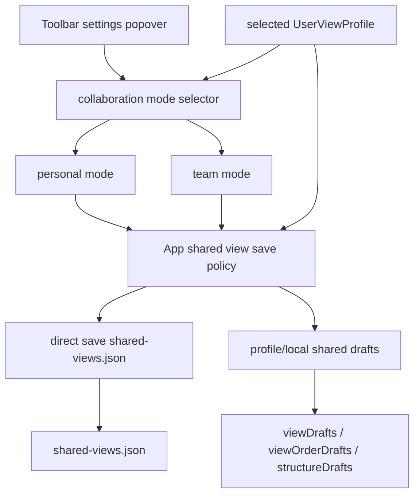

# 个人模式与团队模式切换方案

## 方案概述

### 总体目标和范围

本方案的目标，是为 `data-editor` 增加一套明确的 shared view 协作模式切换能力，让用户可以在设置面板中像切换主题一样，在 `个人模式` 和 `团队模式` 之间切换 shared view 的保存策略，从而降低单人使用项目时反复出现团队保存入口和待发布草稿的干扰。

本次收敛后的关键约束如下：

- 模式切换入口位于现有工具栏设置浮框内，与主题、基础字号同级展示
- 模式值包含 `个人模式` 和 `团队模式`
- `团队模式` 保持当前 shared draft + 显式团队发布语义不变
- `个人模式` 下，shared view 的改动直接写入团队正式配置，不再要求额外点击团队保存按钮
- 模式状态必须持久化到个人配置文件，不得写入团队共享配置，也不得让所有人共用同一个模式值
- 未选择命名 profile 时，不允许把该模式作为团队共享配置的一部分持久化

本次范围包括：

- 在设置面板中增加 shared view 协作模式切换入口
- 为 shared view 写路径新增“个人模式直存 / 团队模式 draft”两套分流语义
- 明确模式值的持久化位置、默认值和无 profile fallback 行为
- 统一梳理 shared view 内容改动、结构改动和显式命令在两种模式下的行为边界
- 设计保存失败时的降级与提示策略
- 补充对应的状态层、组件层和 e2e 验证方案

本次不包括：

- 多人冲突检测、协作锁、版本比较或发布历史
- 按 collection / 按文件再细分模式
- 把模式值同步到 `shared-views.json` 或 `view-config.json`
- 修改业务数据 autosave、project config autosave 的既有保存框架
- 第一版引入“部分动作直存、部分动作仍显式发布”的混合策略

### 各阶段任务概要

第一阶段：模式模型与持久化边界收敛。

主要工作是定义 `个人模式 / 团队模式` 的行为契约，并把模式值挂到个人配置文件中，确保它只代表“当前用户在当前项目里的 shared view 保存偏好”，而不是团队级项目真相。预期成果是：模式语义、默认值、无 profile fallback 和迁移策略都明确，不再和团队共享配置混淆。

第二阶段：设置面板与状态接线。

主要工作是在设置浮框中新增模式切换 UI，并让 `App.tsx` 能基于当前模式决定 shared view 写路径。预期成果是：用户可以直接在现有设置面板里切换模式，且界面上能稳定反映当前模式，而不会再出现“按钮文案和实际保存语义不一致”的情况。

第三阶段：shared view 写路径分流。

主要工作是把筛选、排序、查询、结构拖拽、复制、重命名、删除、新建等 shared view 改动统一分成两条链路：团队模式写 draft，个人模式直写正式配置；同时定义切模式时对已有 draft 的迁移规则。预期成果是：单人工作时 shared view 改动无需再走显式发布；团队协作时仍保留明确发布边界；模式切换本身不会制造悬空状态。

第四阶段：失败降级、状态反馈与验证回归。

主要工作是补充直存失败时的降级行为、状态提示和重试入口，并增加自动化测试覆盖模式切换、个人模式直存、团队模式显式发布和切换后 reload 稳定性。预期成果是：个人模式的主路径足够无感，失败时也不会让 shared view 状态静默丢失，同时不会把用户重新拉回“频繁出现团队保存按钮”的旧心智。

执行顺序为：模式模型 -> 设置入口 -> 写路径分流 -> 失败降级与测试验证。

### 整体结构框架



---

## 现状调查结论

### 当前 shared view 的保存边界

当前实现已经明确区分两类状态：

- 普通 autosave 域：业务数据、项目级配置、命名 profile
- shared view 协作域：`shared-views.json` 正式配置 + profile/local shared draft

对应证据：

- [docs/07_校验与保存机制.md](C:/Code/data-editor/docs/07_校验与保存机制.md)
- [docs/05_数据与配置模型.md](C:/Code/data-editor/docs/05_数据与配置模型.md)
- [docs/superpowers/specs/2026-06-25-共享视图团队保存入口弱化与个人草稿持久化设计.md](C:/Code/data-editor/docs/superpowers/specs/2026-06-25-共享视图团队保存入口弱化与个人草稿持久化设计.md)

其中关键事实是：shared view draft dirty 目前独立存在，不属于普通 autosave 落盘域；团队正式配置只在显式团队保存时更新。

### 当前个人配置的可扩展性

当前 `UserViewProfile` 已经承载多类个人态：

- `appearance`
- `viewLayouts`
- `lastActiveViews`
- `viewDrafts`
- `viewOrderDrafts`
- `structureDrafts`

这说明“当前用户的编辑器偏好 + 当前用户对 shared view 的个人态”本来就在 profile 文件里维护。把“协作模式选择”继续落在 profile 文件中，与现有模型是连续的；反而如果把模式值放进团队共享配置，会把“团队真相”和“个人偏好”重新混在一起。

### 当前设置面板的位置和角色

当前主题、基础字号已经通过设置浮框维护个人偏好。这个入口已经承担了“当前用户的全局编辑体验设置”职责，因此共享协作模式切换进入该浮框是合理的，不需要再新增独立对话框或项目设置页。

---

## 目标语义

### 模式切换是项目内生效的 shared view 保存策略，而不是团队共享配置

这里要区分两层概念：

1. 模式作用范围：
   影响“当前用户在这个项目里”对 shared view 改动的保存路径
2. 模式持久化位置：
   只写入当前用户的个人配置文件，不进入团队共享配置

因此，本方案不是“所有人看到同一个项目模式”，而是“每个用户都可以对同一个项目选择自己的 shared view 保存策略”。

### 团队模式

团队模式下保持现有语义：

- shared view 内容改动先进入 draft
- 结构改动先进入 draft
- 团队保存按钮按现有规则出现
- 只有显式团队保存时才更新 `shared-views.json`

### 个人模式

个人模式下采用“直存 shared view 正式配置”语义：

- shared view 内容改动直接保存到 `shared-views.json`
- shared view 结构改动直接保存到 `shared-views.json`
- 重命名 / 删除 / 新建 / 复制 / 分组等 shared view 命令直接保存到 `shared-views.json`
- 不再展示团队保存按钮
- 不再依赖“先改 draft、再发布”的主心智

这里虽然叫“个人模式”，但它不是“只保存给自己”；它的真正含义是：当前用户单人工作时，不再需要显式团队发布，shared view 改动直接成为正式配置。

---

## 持久化边界设计

### 推荐存储位置：当前命名 profile 文件

推荐把模式值写入 `UserViewProfile`，例如：

```ts
type SharedViewCollaborationMode = "team" | "personal";

type UserViewProfile = {
  // ...
  sharedViewCollaborationMode?: SharedViewCollaborationMode;
};
```

理由：

- 它属于个人偏好，而不是团队配置
- 它直接影响当前用户对 shared view 的工作流体验
- 现有 `appearance` 已经证明 profile 文件适合承载这种“项目内的个人全局设置”
- 与 `Lans` 这类长期使用的个人配置习惯一致

### 不推荐的存储位置

不推荐写入以下位置：

- `shared-views.json`
  原因：这是团队共享视图的正式真相，不应承载某个用户选择的保存策略
- `view-config.json`
  原因：虽然它是项目级配置，但你已明确要求模式值不应被所有人共用
- 浏览器本地 localStorage 作为主真相
  原因：切浏览器或清缓存会丢失；而你的需求已经明确是“保存到个人配置文件”

### 无 profile fallback

无命名 profile 时，推荐行为为：

- 设置 UI 仍可展示当前模式说明
- `个人模式` 选项显示但禁用
- 禁用说明明确写成“需先选择或创建命名视图配置”
- 默认回退到 `团队模式`

原因：

- 你的约束已经要求模式状态保存到个人配置文件
- 没有 profile 时没有可靠的个人文件承载这个状态
- 如果退回 localStorage，就会重新引入“状态位置不一致”的二义性

因此建议第一版明确要求：**要使用个人模式，必须先处于命名 profile 模式。**

### 模式切换时已有 draft 的迁移规则

这是本方案必须先定死的关键规则，推荐如下：

- `团队模式 -> 个人模式`
  - 若当前存在 shared drafts，切换动作本身就视为一次“接受直存语义”的显式确认
  - 立即把当前 collection 的 `viewDrafts / viewOrderDrafts / structureDrafts` 合并并保存到 `shared-views.json`
  - 保存成功后清空对应 drafts，再正式落下 `sharedViewCollaborationMode = "personal"`
  - 保存失败则保持原模式不变，并提示“切换到个人模式前未能发布当前共享视图草稿”
- `个人模式 -> 团队模式`
  - 不做任何逆向迁移
  - 现有正式 shared view 配置继续作为团队真相
  - 从切换成功后的下一次 shared view 改动开始重新进入 draft 模型

推荐采用这套规则，而不是“切换时丢弃 drafts”或“弹额外迁移确认框”，原因如下：

- 丢弃 drafts 风险太高，等同于切模式即删用户当前工作成果
- 额外迁移确认会把模式切换重新做成高摩擦流程，违背你要的轻量设置体验
- “切到个人模式就立刻把当前未发布改动发布掉”与该模式本身的语义最一致

因此，本方案把“切到个人模式”定义成一个有副作用但可理解的动作：**从这一刻开始，当前用户接受 shared view 改动直接成为正式配置，包括当前已存在的 shared drafts。**

---

## 两种模式下的行为矩阵

### 当前仓库里已经存在的直写动作

现状并不是所有 shared view 相关动作都走 draft。当前代码里，以下动作本来就直接保存正式配置：

- 新建 shared view
- 新建 group
- 在组内新建 view
- 复制标签页
- 复制标签组

这些路径当前都已直接调用 `saveSharedViews(...)`，只是周边还会补 `lastActiveViews`、layout 复制或 draft 衍生状态。

因此，本方案的真正改动重点不是“把所有动作第一次变成直写”，而是：

- 让目前仍走 draft 的内容/结构编辑在个人模式下也改成直写
- 让现有已直写动作在团队模式与个人模式下的周边状态统一
- 消除“有的动作无按钮直写，有的动作要显式发布”的语义割裂

### 内容编辑类

包括：

- query
- 普通筛选
- 高级筛选
- sorts

团队模式：

- 更新 `viewDrafts`
- 按现有规则显示团队保存按钮

个人模式：

- 直接更新并保存对应 shared view 正式配置
- 不产生团队保存按钮
- 不写入 `viewDrafts` 作为主路径

### 结构编辑类

包括：

- top-level tab 排序
- 拖入组 / 拖出组
- group 排序
- group 展开后子 tab 排序

团队模式：

- 更新 `viewOrderDrafts` / `structureDrafts`
- 保留显式团队发布

个人模式：

- 直接保存结构变换后的 `shared-views.json`
- 不保留结构 draft 作为主路径
- 失败时才生成临时 pending 结构 draft

### 显式命令类

包括：

- 新建 shared view
- 新建 group
- 重命名
- 删除
- 复制标签页
- 复制标签组
- reset shared view

团队模式：

- 保持当前显式命令行为
- 对当前已直写正式配置的命令，继续允许直写
- 但其衍生出的内容/结构后续编辑仍回到团队 draft 语义
- 团队模式的核心边界是“普通 shared view 编辑不自动发布”，不是要求所有命令都必须经过发布按钮

个人模式：

- 统一按“直接保存正式配置”处理
- 不再额外制造待发布状态

### 推荐动作矩阵

| 动作 | 团队模式 | 个人模式 |
|---|---|---|
| 查询 / 筛选 / 排序编辑 | 写 `viewDrafts`，显示团队保存按钮 | 直接保存 `shared-views.json` |
| 顶层/组内拖拽排序 | 写 `viewOrderDrafts` / `structureDrafts`，显示团队保存按钮 | 直接保存 `shared-views.json` |
| 新建 view / group | 继续直接保存正式配置 | 直接保存正式配置 |
| 复制标签页 / 标签组 | 继续直接保存正式配置 | 直接保存正式配置 |
| 重命名 / 删除 | 团队模式下推荐继续保持显式命令直写；不额外制造发布按钮 | 直接保存正式配置 |
| reset shared view | 清当前 draft，不触团队保存 | 直接把正式配置 reset 后保存 |
| 图标修改 | 保持现有直写正式配置语义 | 保持现有直写正式配置语义 |

---

## 失败策略

### 主路径

个人模式的主路径应该是：

- 用户操作
- 前端立即更新 UI
- 直接保存 `shared-views.json`
- 成功则无额外提示或仅保留轻量状态反馈

### 失败降级

当个人模式直存失败时，不建议弹出抢占式确认框。推荐降级为：

1. 保留当前 UI 结果
2. 将失败改动暂存为本地 pending shared draft
3. 状态栏提示“共享视图自动保存失败”
4. 在设置浮框内和状态文本中提供轻量“重试共享视图保存”入口
5. 不重新显示常驻团队保存按钮

这样可以满足你的要求：

- 成功时无感
- 失败时才进入额外处理

这里要特别强调：失败后的 pending draft 只是一个**故障恢复机制**，不是用户的长期主工作流。也就是说：

- 个人模式成功路径下，shared draft 不应重新成为常态 source of truth
- 只有在失败态下，前端才临时保留一份待重试状态
- 一旦重试成功，应立即清空这份 pending draft
- 失败态不应复用当前“团队保存按钮出现”的旧视觉规则，否则会把用户重新拉回团队模式心智

### 为什么不建议失败后立刻回滚

如果保存失败立刻回滚到旧 shared view：

- 用户会感觉刚才操作“没生效”
- 复杂结构操作的回滚很难解释
- 容易把失败和数据丢失混在一起

因此更合理的是“保留当前前端态 + 显式提示失败 + 允许重试”。

---

## UI 设计建议

### 设置面板

在现有设置浮框中新增一段：

- 标题：`协作模式`
- 选项：
  - `个人模式`
  - `团队模式`

建议文案：

- `个人模式`：共享视图改动将直接保存到项目，不再需要团队保存
- `团队模式`：共享视图改动先保存为草稿，需要手动发布

### 可见性提示

虽然你不希望频繁看到团队保存按钮，但当前模式仍需要有轻量可见性。推荐：

- 设置面板内文案解释完整
- 工具栏平时不额外常驻大提示
- 仅在模式切换成功时给一次状态反馈

不建议：

- 常驻大色块提示
- 再加一个新的高频状态 pill
- 把个人模式做成一直闪烁或过强提醒

---

## 风险与权衡

### 风险一：个人模式下会直接改团队正式配置

这是该模式的本质，不是副作用。风险在于：

- 用户可能在“试试看”的时候也直接改了正式共享视图

缓解方式：

- 通过设置文案把语义写清楚
- 让 `团队模式` 和 `个人模式` 的说明足够直白

### 风险二：模式值如果无 profile fallback，会增加使用门槛

要求“必须先选命名 profile 才能长期使用个人模式”会让首次使用多一步操作。

但这是合理的，因为你已经把持久化边界明确限定在个人配置文件中。相比引入 profile / localStorage 双真相，这个门槛更值得接受。

### 风险三：两套模式并存会扩大测试面

几乎所有 shared view 相关操作都要覆盖：

- 团队模式路径
- 个人模式路径

这是成本，但无法避免。因为这里改的是 shared view 的保存协议，不是单个按钮样式。

---

## 推荐决策

推荐采用以下收敛版本：

- 协作模式切换入口放在设置浮框中
- 模式值只有 `个人模式 / 团队模式`
- 模式状态保存到当前命名 profile 文件
- 无 profile 时默认按 `团队模式` 处理，`个人模式` 选项展示但禁用
- `团队模式` 保持当前 shared draft + 显式团队保存模型
- `个人模式` 把 shared view 改动直接保存到 `shared-views.json`
- `团队模式 -> 个人模式` 时，先自动发布当前 shared drafts，成功后再完成模式切换
- 失败时降级为 pending draft + 轻量重试入口，而不是抢占式确认，也不重新显示常驻团队保存按钮

这版方案同时满足了三件事：

- 单人使用时不再频繁被团队保存按钮打断
- 模式值不进入所有人共用的项目配置
- shared view 协作边界依然清楚，不会把团队真相和个人偏好重新混淆

---

## 后续实施建议

如果进入实现，建议下一步拆成两份文档：

1. 规格文档
   明确 `UserViewProfile.sharedViewCollaborationMode`、设置面板 UI、无 profile fallback、失败降级语义
2. 实施计划
   把 `App.tsx` shared view 写路径分流、Toolbar / settings UI 接线、测试矩阵拆成可执行任务

在你确认这份方案后，再进入计划与实现，会更稳。
