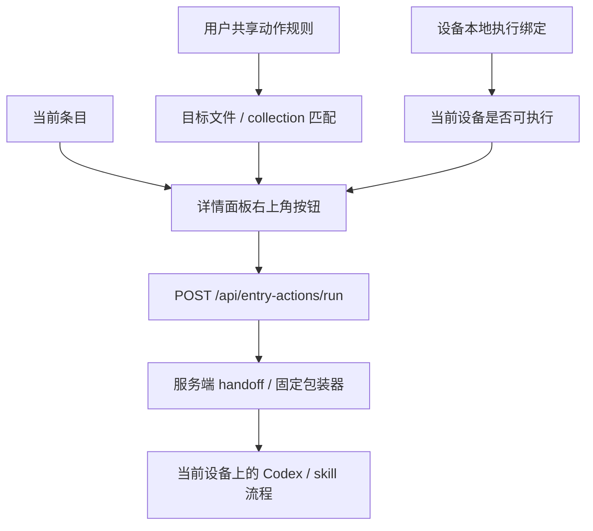

# entryActions 第二版体验方案

## 方案概述

### 总体目标和范围

本方案用于把条目级 Codex 自动化从“项目共享动作定义”收敛为“双层个人化配置”：

- 上层是用户跨设备共享的动作规则
- 下层是设备本地的执行绑定

当前第一版已经证明详情面板右上角动作按钮、服务端 handoff 和固定包装器链路可以稳定跑通，但它建立在项目级 `entryActions` 真值的前提上。继续沿这条方向做第二版体验，会遇到两个根本问题：

1. 不同用户绑定的 Codex 不同、安装的 skill 不同
2. 同一个用户在不同电脑上，执行环境也可能不同

如果项目级配置里不直接绑定实际 skill / Codex 入口，那么共享配置只会留下一个“空按钮壳”；如果项目级配置里直接绑定某个人、某台电脑的 skill / 环境，又会让这套配置天然不可移植。

因此，本方案的长期方向明确改为：

- 条目动作配置不再以项目共享为目标
- 每个用户维护自己的“动作规则”
- 动作规则可以跨设备共享
- 真正的执行绑定留在当前设备本地

本轮方案范围只覆盖产品与实现方向修订，不进入代码实现。

本轮推荐范围包括：

- 重新定义配置归属：项目级共享 -> 双层个人化
- 重新定义 UI 入口：`Project Settings` -> 用户级自动化设置入口
- 重新定义第二版编辑器目标：表单化编辑器 + target 选择器 + 设备本地绑定
- 重新定义后续实现优先级和验收边界

本轮不包括：

- 实际代码改造
- executor 扩展
- 自动回写和结果轮询
- 团队共享动作协议
- 动作模板市场化配置

### 各阶段任务概要

第一阶段：否定项目共享方向。

主要工作是明确说明为什么“项目级共享 `entryActions`”不适合作为最终产品形态。预期成果是后续实现不再围绕共享真值做体验增强。

第二阶段：定义双层个人化模型。

主要工作是把“我想在哪看到什么按钮”和“这台电脑怎么执行它”拆成两层。预期成果是跨设备共享需求和设备差异需求可以同时成立。

第三阶段：定义用户级 UI 入口和交互。

主要工作是重新安排配置入口，不再借用 `Project Settings`，而是为用户本地动作配置提供独立入口。预期成果是产品语义和配置归属一致。

第四阶段：定义后续实现优先级。

主要工作是明确第二版先做哪些能力、后做哪些能力，避免把运行状态面板、模板系统和执行历史混入首轮个人化重构。预期成果是实现范围稳定可控。

执行顺序为：否定共享方向 -> 设计双层个人化模型 -> 设计 UI 入口 -> 收口后续实现顺序。

### 整体结构框架



---

## 当前状态与问题归因

### 当前真实边界

基于当前已落地实现，现状是：

- `entryActions` 的正式维护入口在 `Project Settings`
- 运行时真值在 `project-registry -> /api/projects -> client`
- 详情面板按钮显示与执行链路已经稳定

这套实现适合作为第一版 MVP，因为它先证明了“按钮能显示、动作能触发、handoff 能落地”。

### 为什么共享方向不适合作为长期方案

如果继续按项目共享方向推进，会遇到下面几类结构性问题。

#### 1. 共享配置无法直接承载真实执行能力

真正有价值的不是“这里有个按钮”，而是“这个按钮能调用我自己的 Codex 能力”。

但不同用户的：

- skill 名称
- skill 是否安装
- Codex 启动入口
- 本地工作流约定

都可能不同。

如果项目配置里不写这些执行细节，共享出来的就只剩一个没有实际功能担保的按钮定义。

#### 2. 把执行细节写进项目配置会导致不可移植

如果项目级动作直接绑定某个 skill 或某个本地入口：

- 团队里第二个人未必装了同名 skill
- 第三个人的 Codex 环境可能完全不同
- 某个用户的私有路径、私有命名和私有工作流不应进入项目真值

这样做会让项目配置天然依赖个人环境，不具备稳定共享意义。

#### 3. 同一个用户跨设备也未必有同一套执行环境

这不是只有“不同用户”才有的问题。

即使同一个用户：

- 家里的电脑装了 `recheck`
- 公司的电脑可能没有装，或绑定的是另一套本地入口

如果把“动作规则”和“执行绑定”都强行同步，就会出现：

- 规则同步过来了
- 但当前设备无法实际执行

所以第二版也不能简单做成“所有个人配置都跨设备完全同步”。

### 当前最合理的产品判断

因此更合理的方向是：

- 彻底承认这是“个人自动化能力配置”
- 但继续拆成“跨设备共享的规则层”和“当前设备本地的执行层”
- 项目不再承诺提供一套团队共享动作协议

一句话总结：

第二版不是要把 `entryActions` 做成团队共享规则，也不是要把所有个人执行细节硬同步到所有设备，而是要把它做成“用户共享动作规则 + 设备本地执行绑定”的双层个人化方案。

---

## 推荐方案

## 方案结论

长期方向明确改为：

1. 放弃项目共享 `entryActions` 作为最终产品方向
2. 改为双层个人化配置
3. 上层共享“动作规则”，下层保留“设备本地执行绑定”

### 配置归属原则

新的归属原则应当是：

- 项目数据继续属于项目
- 动作规则属于用户，并可跨设备共享
- skill 绑定、Codex 入口、私有执行参数属于当前设备本地

这三类边界不能再混在 `Project Settings` 里。

---

## 新的配置模型

## 上层：用户共享动作规则

这层描述的是：

- 我想在哪些条目上看到什么按钮
- 按钮叫什么
- 图标是什么
- 需要带哪些条目上下文

它更像“我的工作习惯和自动化意图”，适合跟着用户跨设备共享。

每个用户的共享动作规则建议包含：

- 动作显示名 `label`
- 动作图标 `icon`
- 命中哪些文件 `targets.files`
- 命中哪些 collection `targets.collections`
- `payload.includeRow`
- `payload.includeNeighbors`
- 是否启用 `enabled`

推荐概念形态：

```json
[
  {
    "id": "my-recheck",
    "label": "Recheck",
    "icon": "refresh",
    "targets": {
      "files": ["data/skills.json"],
      "collections": ["skills"]
    },
    "payload": {
      "includeRow": true,
      "includeNeighbors": true
    },
    "enabled": true
  }
]
```

### 这层推荐落点

这层推荐放在独立于 `selectedViewProfile` 的用户级正式配置里。

原因是：

- 它本质上是“这个用户在这个项目里的个人工作台规则”
- 它不应随着 view profile 切换而变化
- 它比 `localStorage` 更正式
- 它可以先复用现有用户配置基础设施，但语义上不再属于视图档本身

这里要明确一个边界：

- 这层默认定义为“正式的用户级配置”
- 但不默认承诺“天然跨设备同步”
- 是否跨设备共享，由后续 profile home / 部署方式决定

## 下层：设备本地执行绑定

这层描述的是：

- 这条动作在这台电脑上绑定哪个 skill
- 走哪个 Codex 入口
- 是否在当前设备可用
- 当前设备上是否启用

它更像“这台机器怎么把我的动作规则真正跑起来”。

推荐概念形态：

```json
{
  "my-recheck": {
    "provider": "codex",
    "skill": "recheck",
    "enabled": true
  }
}
```

### 这层必须是本地

这层不应跨设备共享。

原因是：

- 家里和公司电脑的 skill 不一定一致
- 同一个用户在不同设备上的 Codex 环境也可能不同
- 这类差异是设备属性，不是用户意图

### 这层推荐落点

这层推荐放在独立的本地正式配置里，而不是 `localStorage`。

原因是：

- 它是长期存在的执行绑定，不适合当作浏览器临时缓存
- 它需要可排查、可迁移、可明确清理
- 它和共享规则层要形成清晰的“双文件 / 双配置面”边界

### `actionId` 的语义

在双层方案下，`id` 的作用是：

- 共享动作规则里的稳定主键
- 设备本地执行绑定的对接键

它不再承载团队共享协议的语义，而是承载“同一个用户的规则层和设备层如何对上”的语义。

---

## 不同用户、不同 Codex、不同 skill 的处理方式

## 处理原则

新的处理方式不再试图统一所有人的动作定义，而是直接承认差异存在：

- A 用户可以把某个条目规则命名成 `Recheck`
- B 用户可以在同类条目上配置 `Explain`
- A 用户在家里的电脑把 `my-recheck` 绑定到 `recheck`
- A 用户在公司的电脑可以不绑定，或绑定到另一种本地入口

系统只关心：

- 当前用户有没有共享动作规则
- 当前规则有没有命中当前条目
- 当前设备有没有完成本地执行绑定

## 这样做的收益

1. 用户跨电脑时，自己的动作规则还能保留。
2. 设备差异不会污染共享的用户规则层。
3. 不再出现“项目里有按钮，但我本地没有任何实际能力”的空壳状态。
4. 不再要求团队统一安装同一套 skill。
5. 后续如果某台设备的 Codex 入口变了，只需要改那台设备的本地绑定。

## 失败状态怎么处理

在双层方案下，失败状态也要分层处理：

- 共享规则不存在：不显示按钮
- 共享规则命中，但本地绑定缺失：详情面板不显示可点击按钮；在用户级设置页标记“当前设备未绑定”
- 本地绑定失效：在设置页提示 skill/binding 无效

这里推荐默认策略是：

- 详情面板只在“规则命中 + 当前设备绑定可用”时显示按钮
- 不在详情面板里堆禁用按钮
- 把“缺绑定/绑定失效”的提示集中留在用户级设置页

### 设置页状态提示模型

为了避免新设备上出现“按钮没了，但不知道为什么”的不可发现问题，`Automation Settings` 需要提供最小状态提示模型。

页面至少要有两层提示：

#### 1. 顶部总览提示

用于快速回答“我这台设备现在有没有缺绑定”。

推荐展示：

- 共有多少条共享规则
- 当前设备已绑定多少条
- 当前设备未绑定多少条
- 当前设备绑定失效多少条

推荐文案形态：

- `3 rules imported`
- `2 bindings ready on this device`
- `1 binding missing on this device`
- `1 binding invalid`

#### 2. 规则级状态提示

每条规则旁边都应展示当前设备状态。推荐最小状态集：

- `ready`：规则命中且当前设备绑定可用
- `missing_binding`：规则存在，但当前设备还没绑定
- `invalid_binding`：存在绑定记录，但当前设备校验失败
- `disabled_rule`：共享规则被用户停用
- `disabled_binding`：本地绑定存在，但当前设备被手动停用

推荐交互：

- `missing_binding`：展示 `Bind on this device`
- `invalid_binding`：展示 `Fix binding`
- `disabled_rule`：展示规则层启用开关
- `disabled_binding`：展示设备层启用开关

这里不要求第二版首批做“运行历史面板”，但必须让用户在设置页里看清：

- 规则有没有过来
- 当前设备有没有绑
- 绑定是不是坏了

否则详情面板里“不显示按钮”的策略会变成黑盒。

### 服务端执行结果与错误原因枚举

第二版虽然不做完整运行历史，但 `run-entry-action` 的结果原因需要比第一版更细，至少要能支持设置页排障和前端提示。

推荐分成两层：

#### 1. 顶层执行状态

保持最小集合：

- `started`
- `rejected`
- `error`

语义是：

- `started`：动作已经通过校验并成功发起
- `rejected`：动作没有进入执行阶段，是已知业务拒绝
- `error`：系统异常、执行器异常或未预期失败

#### 2. 细分原因码 `reason`

当状态不是单纯成功时，返回稳定原因码。第二版最小建议集：

- `rule_not_found`
- `rule_disabled`
- `target_not_matched`
- `binding_missing`
- `binding_disabled`
- `binding_invalid`
- `device_unavailable`
- `row_not_found`
- `executor_launch_failed`
- `internal_error`

推荐语义：

- `rule_not_found`：当前用户没有这条共享规则
- `rule_disabled`：规则存在，但规则层被停用
- `target_not_matched`：规则存在，但当前条目不属于它的 target
- `binding_missing`：当前设备没有本地绑定
- `binding_disabled`：本地绑定被停用
- `binding_invalid`：绑定存在，但 skill / provider / 入口校验失败
- `device_unavailable`：当前设备运行环境不可用
- `row_not_found`：条目定位失败
- `executor_launch_failed`：已经进入执行阶段，但固定包装器或 executor 无法启动
- `internal_error`：其他未归类异常

### 推荐接口契约

推荐把 `POST /api/entry-actions/run` 的响应收敛成：

```json
{
  "ok": true,
  "status": "rejected",
  "reason": "binding_missing",
  "message": "Action rule exists, but this device is not bound yet."
}
```

成功发起时：

```json
{
  "ok": true,
  "status": "started",
  "runId": "20260701-abc123",
  "handoffPath": ".data-editor/runtime/entry-actions/20260701-abc123/handoff.json"
}
```

系统异常时：

```json
{
  "ok": false,
  "status": "error",
  "reason": "executor_launch_failed",
  "message": "Failed to launch local executor."
}
```

### 前端使用原则

前端不需要把所有原因码都展示在详情面板里，但至少要遵守下面规则：

- 详情面板只消费 `started` 成功发起反馈
- `rejected` 用于 toast 或轻提示
- 设置页要能消费 `missing_binding` / `invalid_binding` / `disabled_binding` 这类原因，指导用户修复
- 不把“无按钮”本身当成唯一反馈

---

## UI 设计方向

## 不再使用 `Project Settings`

因为新方向已经不是项目配置，所以 `Project Settings` 不应该继续承载这套功能。

推荐从产品语义上彻底拆出去，改成单独的用户级入口，例如：

- `Automation Settings`
- `My Entry Actions`
- `Personal Actions`

推荐用偏个人化的命名，而不是继续隐藏在项目设置里。

这里还应明确：

- 自动化规则不绑定 `selectedViewProfile`
- 切换视图档不会切换个人自动化规则集
- 视图档负责“怎么看数据”
- 自动化规则负责“我想对这类条目做什么”

## 推荐交互形态

新的交互形态建议明确分成两个区：

- 共享规则区
- 当前设备绑定区

最小可用结构建议：

- 左侧：我的动作规则列表
- 右侧上半：当前动作规则编辑表单
- 右侧下半：当前设备执行绑定

规则层支持：

- `Add Action`
- `Delete`
- 排序
- 选择 target file / target collection
- 配置 label / icon / payload

设备层支持：

- 选择或填写 skill 绑定
- 选择 provider / 入口类型
- 显示当前设备是否已绑定

### 为什么列表式编辑仍然合理

即使变成双层个人化，这部分交互仍然适合“列表 + 当前项编辑”：

- 一个人通常会配置多条动作规则
- 各条规则针对不同文件和 collection
- 每条规则都需要单独看它在当前设备上的绑定状态
- 后续加模板时也能自然复用 `Add Action`

---

## 第二版应该先做什么

## 推荐首批实现项

双层方向确定后，推荐第二版首批只做四件事：

1. 用户级动作配置入口
2. 共享动作规则编辑器
3. target file / target collection 选择器
4. 当前设备执行绑定编辑器
5. 设置页最小状态提示模型
6. `run-entry-action` 细分原因码

### 具体目标

- 不再手写整段 JSON
- 不再手填路径和 collection
- 用户换电脑后，规则仍然在
- 但新设备需要单独补绑定
- 用户能在设置页直接看出“缺绑定 / 绑定失效”
- 服务端拒绝原因可被前端稳定消费

## 本轮不做

本轮仍然不推荐一起混入：

- 常用动作模板
- 运行结果历史
- 最近一次执行状态持久化
- 结果轮询
- 自动回写

原因和之前类似，但这里更强：

- 双层个人化本身已经是一次架构方向切换
- 如果再把运行状态面板混进来，范围会明显膨胀

---

## 迁移与清理建议

## 当前已落地实现如何看待

当前基于 `project-registry` 的第一版实现，不需要被否定为“错误实现”。

它仍然有价值，因为它完成了：

- 按钮显示闭环
- 详情条目 payload 闭环
- handoff 与固定包装器闭环

但它更适合作为：

- 验证执行链路的 MVP
- 不是最终产品形态

### 迁移建议

后续真正实现第二版时，推荐顺序是：

1. 新增用户共享动作规则存储
2. 新增设备本地执行绑定存储
3. 新增用户级配置入口
4. 详情面板先切成“双层判定”：
   - 规则命中
   - 当前设备绑定可用
5. 服务端执行校验切到新的个人配置链
6. 提供一次性的项目级 `entryActions` 导入 / 迁移动作
7. 清理 `Project Settings` 中旧入口
8. 清理项目级 `entryActions` 旧真值，不保留兼容双读

也就是说，第二版的本质不是“在现有 Project Settings 上再做漂亮一点”，而是“把这套能力迁移到正确的配置归属”。

这里明确不采用：

- 项目级 `entryActions` 与个人化规则长期双读
- 在 `Project Settings` 中保留旧编辑入口
- 为了兼容早期草稿版本而长期保留旧真值

---

## 验收标准

满足以下条件即可认为新方向成立：

- 方案文档明确否定项目共享 `entryActions` 作为长期产品方向
- 方案文档明确采用“双层个人化”而不是“所有个人配置完全本地”或“所有个人配置完全跨设备同步”
- 方案文档明确共享规则层与设备本地绑定层的边界
- 方案文档明确新的 UI 入口不再挂在 `Project Settings`
- 方案文档明确第二版首批实现包含设备本地绑定编辑器
- 方案文档明确设置页最小状态提示模型
- 方案文档明确 `run-entry-action` 的细分原因码

---

## 推荐后续顺序

在双层个人化方向落地后，后续优先级建议是：

1. 常用动作模板
2. 最近一次执行状态展示

原因是：

- 模板属于规则层配置效率增强，和当前方向一致
- 运行状态展示依然更重，适合下一轮单独做
