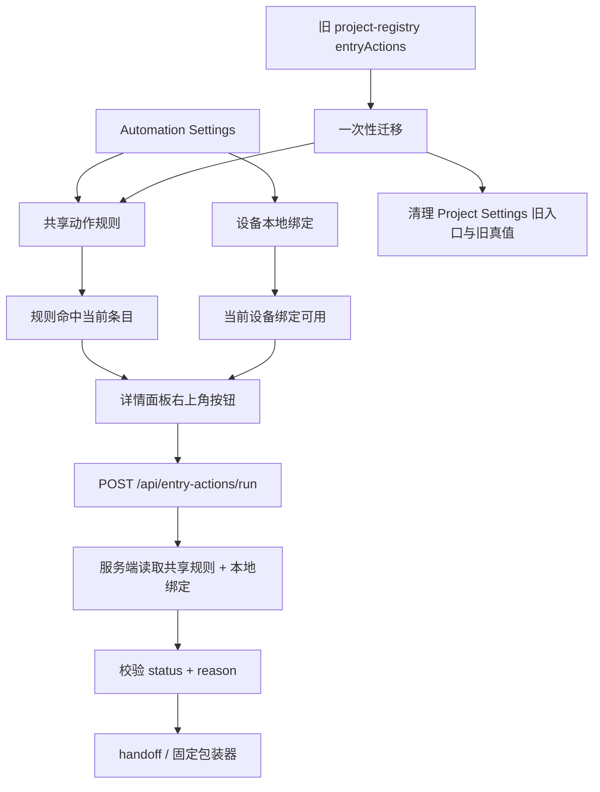

# entryActions 第二版具体执行方案

## 方案概述

### 总体目标和范围

本方案用于把当前第一版“项目级 `entryActions` + `Project Settings` + `project-registry` 真值”的实现，迁移为第二版正式结构：

- 上层：独立于 `selectedViewProfile` 的用户级共享动作规则
- 下层：当前设备本地执行绑定
- 运行时：服务端按“共享规则 + 本地绑定”双层真值执行 `run-entry-action`
- 信息架构：入口从 `Project Settings` 迁出，改为独立 `Automation Settings`

第二版的目标不是继续美化第一版 JSON 编辑入口，而是完成一次真实的配置归属切换。落地后应满足：

- 用户可以在正式的自动化设置页里维护自己的动作规则
- 当前设备可以单独维护本地 skill / provider 绑定
- 详情面板只在“规则命中 + 本地绑定可用”时显示按钮
- `POST /api/entry-actions/run` 不再从项目级 `entryActions` 读真值
- 第一版项目级 `entryActions` 只做一次性迁移来源，迁移完成后清理旧入口和旧真值

本轮范围包括：

- 自动化配置的第二版数据模型
- `Automation Settings` 前端入口与状态提示模型
- 服务端用户规则 / 设备绑定读取链
- `run-entry-action` 新状态与 `reason` 契约
- 一次性迁移与旧链路清理
- 第二版的验证、验收与提交边界

本轮不包括：

- 运行历史面板
- 结果轮询、取消、跨刷新恢复
- 自动回写条目
- 动作模板市场
- 团队级共享动作协议

### 各阶段任务概要

第一阶段：建立第二版真值结构。

主要工作是定义“共享规则层 + 本地绑定层”的正式数据落点、读写链和前后端类型。预期成果是第二版不再依赖项目级 `entryActions` 作为长期真值。

第二阶段：落地 `Automation Settings`。

主要工作是新增独立入口、规则编辑器、本地绑定编辑器和状态提示模型。预期成果是用户可以在 UI 内正式管理第二版配置，而不是手写 JSON。

第三阶段：切换详情面板与服务端执行链。

主要工作是让详情按钮和 `run-entry-action` 一起改读双层真值，并返回稳定的 `status + reason`。预期成果是第二版从“能配”走到“能真正执行并可排障”。

第四阶段：一次性迁移并清理旧链路。

主要工作是导入旧项目级 `entryActions`、完成用户确认后的迁移、移除 `Project Settings` 旧入口与项目级旧真值。预期成果是后续实现只维护第二版单一语义。

第五阶段：验证与收尾。

主要工作是覆盖前端、服务端、迁移和浏览器验收，确认状态提示、错误原因、运行链和旧配置清理都真实成立。预期成果是第二版具备开始实施的清晰路线，不留语义分裂。

执行顺序为：真值结构 -> 设置页 -> 执行链切换 -> 迁移清理 -> 验证收尾。

### 整体结构框架



---

## 现状与目标差异

### 当前第一版真实状态

当前仓库的真实链路是：

- `src/App.tsx` 通过活动项目读取 `entryActions`
- `Project Settings` 用 JSON 文本维护 `entryActions`
- `server.mjs` 的 `POST /api/entry-actions/run` 从 `project-registry` 查动作定义
- `src/api/client.ts` 只理解项目级 `ProjectDefinition.entryActions`

这套链路已经证明第一版执行面成立，但不适合作为第二版长期形态，因为：

- 动作规则和设备绑定混在项目配置里
- 自动化语义被错误挂在 `Project Settings`
- `selectedViewProfile` 与自动化规则尚未解耦
- 新设备缺绑定时，用户缺少正式的状态提示入口

### 第二版完成后的目标状态

第二版要把上面四个问题一起解决：

- 自动化规则成为独立的正式用户配置
- 本地绑定成为独立的正式设备配置
- 设置页承担“缺绑定 / 失效”的可发现性
- 服务端只认第二版双层真值，不再双读项目级旧真值

---

## 第二版正式数据结构

## 共享动作规则层

### 语义

这层描述的是：

- 哪些条目显示什么动作
- 动作名称和图标
- 是否启用
- 点击时要带哪些条目上下文

这层不绑定 `selectedViewProfile`，也不把“天然跨设备同步”写成硬承诺。它只是正式用户配置；是否跨设备共享，由 `profile home` 或后续部署方式决定。

### 推荐存储形态

推荐新增独立 automation profile，而不是把字段直接塞进现有 `UserViewProfile` 结构。

这里补一条硬决策：

- 第二版 `automation profile` 采用“每项目唯一一份”的模型
- 不新增命名 automation profile
- 不引入类似 `selectedAutomationProfileName` 的第二套切换系统
- 同一项目下，当前用户默认只维护一份个人自动化规则集

建议新增：

- `src/automation-profile.mjs`
- `src/api/client.ts` 中对应的 `UserAutomationProfile` 类型
- `server.mjs` 的：
  - `GET /api/automation-profile`
  - `POST /api/automation-profile`

推荐数据结构：

```ts
type EntryActionRule = {
  id: string;
  label: string;
  icon: string;
  enabled: boolean;
  targets: {
    files: string[];
    collections: string[];
  };
  payload: {
    includeRow: boolean;
    includeNeighbors: boolean;
  };
};

type UserAutomationProfile = {
  rules: EntryActionRule[];
};
```

### 推荐落盘位置

为了尽量复用现有 profile 目录体系，但避免污染视图档语义，推荐与 `view-profile` 平行新增目录，例如：

```text
<profile-home>/<project-id>/automation-profile.json
```

如果当前没有 `DATA_EDITOR_PROFILE_HOME`，默认仍可落在项目内 `.data-editor` 语义下，但文档和代码都应避免把它表述成“自动同步层”。

这也意味着：

- 共享规则层可以复用 profile 体系
- 但它不是 view profile
- 它也不是“可切换的多份自动化配置”

## 设备本地执行绑定层

### 语义

这层描述的是：

- 当前设备上某条规则绑定哪个 provider
- 当前设备上某条规则绑定哪个 skill / 入口
- 当前设备是否启用
- 当前设备绑定当前是否可用

### 推荐存储形态

这层必须独立于共享规则层，也不使用 `localStorage` 作为长期承载。

建议新增：

- `src/automation-bindings.mjs`
- `src/api/client.ts` 中对应的 `DeviceEntryActionBindings` 类型
- `server.mjs` 的：
  - `GET /api/automation-bindings`
  - `POST /api/automation-bindings`

推荐数据结构：

```ts
type EntryActionBinding = {
  provider: "codex";
  skill: string;
  enabled: boolean;
};

type DeviceEntryActionBindings = {
  bindings: Record<string, EntryActionBinding>;
};
```

### 推荐落盘位置

建议使用独立 machine-local 根目录中的本地正式配置文件，不走 `profile home`。推荐例如：

```text
<project-root>/.data-editor/local/automation-bindings.json
```

如果后续需要把本地绑定迁出项目目录，也应迁到单独 machine-local home，而不是复用共享 profile 根目录。

关键要求只有两个：

- 这是正式本地配置，不是浏览器缓存
- 它与共享规则层在文件和模块职责上分离

这里补一条硬约束：

- 本地 bindings 必须与 `profile home` 解耦
- 即使 `profile home` 将来是跨设备同步目录，本地 bindings 也不能跟着同步

---

## 前端执行方案

## 第一阶段：新增 `Automation Settings` 入口

### 目标

把第二版配置入口从 `Project Settings` 中完全迁出。

### 具体执行

1. 在主界面新增独立入口，命名使用 `Automation Settings`。
2. 入口层级与 `Project Settings` 并列，不再借其弹窗承载自动化配置。
3. 入口打开后读取：
   - `GET /api/automation-profile`
   - `GET /api/automation-bindings`
4. 入口关闭时按实际变更分别保存：
   - `POST /api/automation-profile`
   - `POST /api/automation-bindings`

### 主要改动文件

- `src/App.tsx`
- 可新增：`src/components/AutomationSettingsDialog.tsx`
- `src/api/client.ts`

### 验收标准

- 页面上存在独立 `Automation Settings` 入口
- 自动化设置不再通过 `Project Settings` 编辑
- 打开设置页时能同时加载规则层和本地绑定层

## 第二阶段：规则编辑器与本地绑定编辑器

### 目标

提供第二版最小可用编辑体验，不再依赖整段 JSON 文本。

### 具体执行

1. 左侧规则列表：
   - 显示 `label`
   - 显示当前状态标记
   - 支持新增、删除、选择当前规则
2. 右侧规则编辑区：
   - 编辑 `label`
   - 编辑 `icon`
   - 编辑 `enabled`
   - 选择 `targets.files`
   - 选择 `targets.collections`
   - 配置 `payload.includeRow`
   - 配置 `payload.includeNeighbors`
3. 右侧本地绑定区：
   - 编辑 `provider`
   - 编辑 `skill`
   - 编辑本地 `enabled`
   - 显示结构校验结果
   - 显示最近一次运行或测试得到的可用性结果

### target 选择器原则

第二版不再手填任意字符串。`files` 和 `collections` 应来自当前项目现有数据：

- 文件列表可复用现有文件枚举链
- collection 列表首版只从“当前项目已扫描文件中可解析出的顶层 collection”生成静态候选

这里补一条收口：

- 第二版不要求做全仓库 schema discovery
- 只要能基于当前文件扫描和现有文档解析链产出稳定候选即可
- 对未进入候选集的 collection，不提供自由手填兜底

### 主要改动文件

- `src/components/AutomationSettingsDialog.tsx`
- 可新增：`src/components/EntryActionRuleEditor.tsx`
- 可新增：`src/components/EntryActionBindingEditor.tsx`
- `src/api/client.ts`

### 验收标准

- 可以可视化创建规则
- 可以为当前设备配置本地绑定
- 不需要手写整段 JSON

## 第三阶段：设置页状态提示模型

### 目标

解决“按钮没显示，但不知道为什么”的可发现性问题。

### 具体执行

#### 1. 顶部总览提示

显示：

- `rules_total`
- `bindings_ready`
- `bindings_missing`
- `bindings_invalid`

推荐文案：

- `3 rules imported`
- `2 bindings ready on this device`
- `1 binding missing on this device`
- `1 binding invalid`

#### 2. 规则级状态

每条规则至少展示一种状态：

- `ready`
- `missing_binding`
- `invalid_binding`
- `disabled_rule`
- `disabled_binding`

并提供直接动作：

- `missing_binding` -> `Bind on this device`
- `invalid_binding` -> `Fix binding`
- `disabled_rule` -> 规则开关
- `disabled_binding` -> 本地绑定开关

### 主要改动文件

- `src/components/AutomationSettingsDialog.tsx`
- 可新增：`src/entry-action-status.mjs`

### 验收标准

- 新设备上即使详情面板不显示按钮，用户也能在设置页看到“缺绑定”
- 失效绑定可以在设置页直接定位到规则项

---

## 服务端执行方案

## 第四阶段：新增第二版读取链

### 目标

让服务端能读取“共享规则 + 本地绑定”双层真值，而不是继续读项目级 `entryActions`。

### 具体执行

1. 新增 `src/automation-profile.mjs`
   - `loadAutomationProfile(...)`
   - `saveAutomationProfile(...)`
   - `normalizeAutomationProfile(...)`
2. 新增 `src/automation-bindings.mjs`
   - `loadAutomationBindings(...)`
   - `saveAutomationBindings(...)`
   - `normalizeAutomationBindings(...)`
3. 在 `server.mjs` 新增 API：
   - `GET /api/automation-profile`
   - `POST /api/automation-profile`
   - `GET /api/automation-bindings`
   - `POST /api/automation-bindings`
4. 在 `src/api/client.ts` 补客户端类型与请求封装。

### 服务端保存校验边界

第二版不能只靠前端表单约束，服务端保存时必须做正式校验。

共享规则层至少校验：

- `rule.id` 非空且在当前 profile 内唯一
- `label` 非空
- `icon` 为允许的图标标识
- `targets.files` / `targets.collections` 为非空字符串数组
- `payload` 只允许已知字段
- `enabled` 为布尔值

本地绑定层至少校验：

- `binding.provider` 属于允许白名单
- `binding.skill` 为非空字符串
- `enabled` 为布尔值

这些校验应在：

- `normalizeAutomationProfile(...)`
- `normalizeAutomationBindings(...)`
- 对应 `POST` API 保存链

同时生效。

### 主要改动文件

- 新增：`src/automation-profile.mjs`
- 新增：`src/automation-bindings.mjs`
- 修改：`server.mjs`
- 修改：`src/api/client.ts`

### 验收标准

- 前端可通过正式 API 读写规则层和本地绑定层
- 规则层与视图档逻辑完全分离
- 本地绑定不再落在 `localStorage`

## 第五阶段：切换 `run-entry-action`

### 目标

让第二版执行链只认新真值，并返回稳定的 `status + reason`。

### 具体执行

1. `server.mjs` 的 `handleRunEntryAction` 改为：
   - 读取 automation profile
   - 读取 automation bindings
   - 查找 `ruleId`
   - 校验规则层 `enabled`
   - 校验 target 是否命中
   - 校验本地绑定是否存在
   - 校验本地绑定是否启用
   - 校验 provider 是否属于受支持白名单
   - 校验 binding 结构是否合法
   - 通过后再进入 handoff / wrapper
2. 保留现有：
   - `buildEntryActionHandoff(...)`
   - `writeEntryActionHandoff(...)`
   - 固定包装器调用
3. 去掉项目级 `project.entryActions` 作为执行真值的依赖。

### 返回契约

顶层 `status` 固定为：

- `started`
- `rejected`
- `error`

细分 `reason` 最小集合：

- `rule_not_found`
- `rule_disabled`
- `target_not_matched`
- `binding_missing`
- `binding_disabled`
- `binding_invalid`
- `device_unavailable`
- `row_not_found`
- `executor_launch_failed`
- `internal_error`

推荐响应结构：

```json
{
  "ok": true,
  "status": "rejected",
  "reason": "binding_missing",
  "message": "Action rule exists, but this device is not bound yet."
}
```

### `binding_invalid` 的判定来源

第二版不引入新的全局 skill registry，也不假设仓库里已经存在“已安装 skill 清单”。

因此要把 `binding_invalid` 拆成两层：

#### 1. 保存时结构校验

只回答“这条绑定结构上是否合法”，例如：

- provider 是否受支持
- skill 是否为空
- 字段格式是否正确

这一步不负责回答“这个 skill 在这台机器上现在一定可用”。

#### 2. 运行时 / 测试时可用性校验

真正回答“当前绑定能不能在这台机器上跑起来”的 authoritative 来源，是包装器启动回执或设置页测试绑定结果。

也就是说：

- 包装器成功启动并消费 handoff -> 视为当前绑定可用
- 包装器返回启动失败 -> 标记为 `binding_invalid` 或 `executor_launch_failed`

第二版先用真实执行结果作为权威来源，不额外构建 skill 发现基础设施。

### 前端消费原则

- 详情面板只需要消费 `started`
- `rejected` 用于轻提示
- 设置页消费 `binding_missing` / `binding_invalid` / `binding_disabled`
- 不把“没显示按钮”当成唯一反馈

### 主要改动文件

- 修改：`server.mjs`
- 修改：`src/api/client.ts`
- 可能补强：`src/entry-actions.mjs`

### 验收标准

- `run-entry-action` 已不依赖 `project.entryActions`
- `status + reason` 可稳定区分业务拒绝与系统错误
- 设置页和详情面板能按角色消费结果

## 第六阶段：切换详情面板可见性计算

### 目标

让详情面板根据第二版双层状态显示按钮。

### 具体执行

1. `src/App.tsx` 不再从活动项目读取 `entryActions` 做可见性过滤。
2. 改为读取 automation profile + bindings 后，在前端计算：
   - 规则命中
   - 绑定存在
   - 绑定启用
   - 绑定校验通过
3. 仅当以上条件同时满足时，把动作传给 `DetailPanel`。

### 主要改动文件

- `src/App.tsx`
- `src/detail/DetailPanel.tsx`

### 切换黑洞防护

不能出现“按钮逻辑已经切到第二版，但用户还没迁移，所以所有按钮突然消失”的黑洞。

因此这里要增加一个前置规则：

- 只有在旧 `entryActions` 已完成导入，或当前 profile 本身已有规则时，详情面板才切到第二版显示逻辑

推荐实现方式二选一：

1. 首次打开 `Automation Settings` 自动检测并要求先导入
2. 首次进入第二版时自动完成导入，再允许切换详情按钮可见性逻辑

推荐第一种，因为用户感知更清楚。

### 验收标准

- 命中规则且绑定可用时显示按钮
- 未绑定或绑定失效时不显示按钮，但设置页有明确提示

---

## 迁移与清理方案

## 第七阶段：一次性迁移

### 目标

把第一版项目级 `entryActions` 转成第二版共享规则层，不保留长期双读。

### 具体执行

1. 新增一次性迁移入口，例如：
   - 首次打开 `Automation Settings` 时检测项目级旧配置
   - 若存在旧 `entryActions` 且当前 automation profile 为空，则提示导入
2. 导入行为只迁移“规则层”字段：
   - `id`
   - `label`
   - `icon`
   - `targets`
   - `payload`
3. 不迁移设备绑定：
   - 所有导入规则默认在当前设备状态为 `missing_binding`
4. 迁移完成后立即保存到新 automation profile。

### 迁移阶段的旧字段保留策略

这里把顺序写死成三步：

#### 第一步：旧字段只读保留

- `ProjectDefinition.entryActions`
- `project-registry` 里的旧持久化字段
- `Project Settings` 旧入口

先保留，但只作为迁移来源，不再继续增强。

#### 第二步：完成导入并切换新真值

- 用户完成一次性导入
- `Automation Settings` 开始作为正式编辑入口
- 详情按钮和 `run-entry-action` 切到第二版双层真值

#### 第三步：单独一轮清理旧链路

- 删除 `Project Settings` 旧入口
- 删除 `ProjectDefinition.entryActions` 长期语义
- 删除 `project-registry` 对旧字段的持久化依赖

不允许在第一步和第二步之间提前删掉迁移源。

### 迁移提示要求

用户必须能明确看到：

- 导入了多少条规则
- 哪些规则还没有本地绑定
- 迁移完成后旧项目级入口将被移除

### 主要改动文件

- `src/components/AutomationSettingsDialog.tsx`
- 修改：`server.mjs` 或新增薄 API（如需要服务端执行导入）
- 修改：`src/api/client.ts`

### 验收标准

- 旧 `entryActions` 可以一次性导入到新规则层
- 导入后用户能立刻看到缺绑定状态

## 第八阶段：清理旧链路

### 目标

让第二版结束后仓库中不再长期维护两套自动化语义。

### 具体执行

1. 从 `Project Settings` 删除 `entryActions` JSON 文本编辑入口。
2. 从 `ProjectDefinition` 中移除长期使用的 `entryActions` 语义。
3. `server.mjs` 移除 `handleRunEntryAction` 对项目级 `entryActions` 的读取依赖。
4. 更新相关测试 fixture，全部改用第二版配置。
5. 更新文档，明确第一版只作为历史实现记录。

### 注意

这一阶段不做“长期兼容双读”，也不做“隐形 fallback”。

允许保留的只有：

- 一次性迁移检测
- 历史文档说明

不允许保留的包括：

- 项目级 `entryActions` 和第二版规则层并行作为长期真值
- `Project Settings` 中保留旧编辑入口
- `run-entry-action` 在运行时偷偷 fallback 到旧链路

这里再补一条：

- 清理旧链路必须发生在迁移完成和新真值切换之后，不能和导入阶段混做

### 主要改动文件

- `src/App.tsx`
- `src/api/client.ts`
- `server.mjs`
- `src/project-registry.mjs`
- 相关测试文件

### 验收标准

- 运行时只存在第二版单一真值
- 旧入口和旧真值都被移除
- 仓库中不再存在长期双读逻辑

---

## 验证方案

## 自动化验证

建议至少覆盖四组测试：

1. 规则层存储测试
   - `load/save/normalize automation profile`
2. 本地绑定存储测试
   - `load/save/normalize automation bindings`
3. 服务端执行测试
   - `binding.provider` 白名单校验
   - `binding_missing`
   - `binding_invalid`
   - `target_not_matched`
   - `started`
4. 前端浏览器测试
   - 设置页加载与保存
   - 迁移后状态提示
   - 详情面板按钮显示 / 不显示

建议新增或扩展：

- `tests/automation-profile.test.mjs`
- `tests/automation-bindings.test.mjs`
- `tests/open-stop.test.mjs`
- `tests/data-editor.spec.ts`

## 浏览器验收路径

至少走通一条完整路径：

1. 打开 `Automation Settings`
2. 导入旧 `entryActions`
3. 看到 `missing_binding` 提示
4. 给一条规则补本地绑定
5. 返回详情面板打开命中条目
6. 看到按钮显示
7. 点击后确认：
   - 前端收到 `started`
   - handoff 文件生成
   - 包装器记录生成

## 静态校验

执行：

```powershell
npm run typecheck
npm run build
```

如本轮启动过本地服务、浏览器或临时验证链，结束前必须执行：

```powershell
npm run service:finalize
```

---

## 提交边界建议

建议按 4 个提交边界实施：

1. `automation profile + automation bindings + api client`
2. `Automation Settings UI + status model`
3. `run-entry-action truth switch + detail panel visibility switch`
4. `migration import + old entryActions cleanup + tests + docs`

这样拆的原因是：

- 数据层、UI 层、执行层、清理层职责清晰
- 每轮验证面可控
- 旧链路清理放到最后，便于前几轮局部验证

这也对应更稳的实施顺序：

1. 先落读取链与保存链
2. 再做 `Automation Settings` 和迁移入口
3. 再切 `run-entry-action` 和详情按钮
4. 最后删除旧 `entryActions`

---

## 风险与约束

- 不要把第二版规则直接塞回 `UserViewProfile`，否则会和 `selectedViewProfile` 语义重新耦合。
- 不要用 `localStorage` 承载本地绑定，避免长期排障和迁移失控。
- 不要把本地 bindings 放进 `profile home`，否则跨设备同步时会污染设备层语义。
- 不要把“状态提示模型”降级成 toast；它必须有设置页常驻可见面。
- 不要保留项目级旧真值的长期 fallback，否则后续所有改动都要维护两套配置语义。
- 不要在第二版假装存在全局 skill registry；`binding_invalid` 的真实可用性先以包装器回执为准。
- 不要在本轮混入执行历史、轮询和自动回写，否则范围会再次膨胀。

---

## 完成定义

本执行方案完成并开始实施时，应满足：

- 第二版 source of truth 已明确到文件、模块和 API
- `Automation Settings` 的交互、状态和迁移流程已明确
- `run-entry-action` 的 `status + reason` 契约已明确
- 旧项目级 `entryActions` 的迁移与清理顺序已明确
- 实现可以按阶段推进，而不会在中途重新打开架构归属问题
