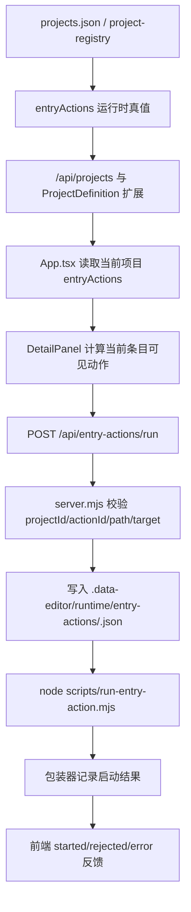

# 详情面板条目级 Codex 自动化执行方案

## 方案概述

### 总体目标和范围

本方案用于把 [2026-07-01-详情面板条目级Codex自动化方案.md](/C:/Code/data-editor/docs/plans/2026-07-01-详情面板条目级Codex自动化方案.md) 落成第一版可运行实现。目标行为是：

- 当前项目可以在现有 `projects.json` 运行时配置链中声明 `entryActions`。
- 详情面板右上角能按当前条目命中规则显示动作按钮。
- 点击按钮后，前端调用 `POST /api/entry-actions/run`。
- 后端完成白名单校验、条目目标解析、handoff 文件写入，并调用固定本地包装器。
- 前端收到 `started/rejected/error` 结果并做最小状态反馈。
- 第一版不做自动回写、不做结果轮询、不做跨刷新恢复。

本轮范围包括：

- `project-registry` / `/api/projects` 的 `entryActions` 运行时承载。
- `api/client` 的动作发起接口。
- `server.mjs` 的 `entry-actions/run` endpoint。
- `scripts/run-entry-action.mjs` 固定包装器。
- `DetailPanel` 的动作按钮接入与当前页面会话态反馈。
- 最小必要的单元测试、接口测试和浏览器验证。

本轮不包括：

- `data-editor.project.json` 模板直读链路。
- 自动回写当前条目。
- 动作执行历史面板。
- 结果轮询、取消、跨刷新恢复。
- nested detail 子结构动作。
- 任意 skill 名或任意命令直连。

### 各阶段任务概要

第一阶段：收口运行时配置真值。

主要工作是扩展 `project-registry`、服务端项目接口和前端类型，让 `entryActions` 能作为当前运行时项目配置的一部分被安全读写。预期成果是动作配置先在现有 registry/API 链上落地，而不是依赖新的项目模板加载链。

第二阶段：落地服务端动作执行链。

主要工作是新增 `POST /api/entry-actions/run`、实现目标条目校验、handoff 文件写入和固定包装器调用。预期成果是按钮背后有真实、可验证、可审计的执行面。

第三阶段：接入详情面板动作按钮。

主要工作是从 `detailSnapshot` 取当前条目上下文，计算可见动作，发起请求并维护当前页面会话内的最小运行状态。预期成果是右上角动作按钮在正确条目上显示并可点击。

第四阶段：验证与收尾。

主要工作是补充 registry / server / client / e2e 验证，确认 handoff 文件与包装器记录真实生成，并执行必要的服务收尾。预期成果是功能具备交付闭环，而不是只在本地临时可用。

执行顺序为：运行时配置链 -> 服务端执行链 -> 详情面板接入 -> 自动化验证与运行态验证。

### 整体结构框架



---

## 文件结构与职责

### 主要改动文件

- `src/project-registry.mjs`
  - 扩展项目定义，承载 `entryActions` 运行时真值。
  - 负责默认值、归一化、校验和持久化。
- `src/api/client.ts`
  - 扩展 `ProjectDefinition` 类型。
  - 新增 `runEntryAction(...)` 客户端调用。
- `server.mjs`
  - 新增 `POST /api/entry-actions/run`。
  - 负责动作白名单校验、目标解析、handoff 文件生成和包装器启动。
- `src/App.tsx`
  - 从当前活动项目读取 `entryActions`。
  - 将当前条目命中的动作和触发回调传入 `DetailPanel`。
- `src/detail/DetailPanel.tsx`
  - 在 `detail-nav` 中渲染动作按钮。
  - 维护当前页面会话内的动作 running/error 状态展示。
- `scripts/run-entry-action.mjs`
  - 第一版固定包装器。
  - 读取 handoff 文件并留下真实启动记录；首版可以先收敛到“包装与记录启动”，不承担自动回写。
- `src/styles.css`
  - 若现有 `icon-button` 状态不足，补最小动作按钮状态样式。

### 主要测试文件

- `tests/project-registry.test.mjs`
  - 覆盖 `entryActions` 的归一化、默认值和非法输入拒绝。
- `tests/open-stop.test.mjs`
  - 覆盖 `POST /api/entry-actions/run` 的服务端集成行为。
- `tests/api-client.test.mjs`
  - 覆盖 `runEntryAction(...)` 请求封装。
- `tests/data-editor.spec.ts`
  - 覆盖详情面板按钮可见性、点击触发和最小状态反馈。

### 可新增的薄文件

- `src/entry-actions.mjs`
  - 第一版建议直接新增，不再作为可选项。
  - 负责纯函数层的：
    - 动作命中
    - 顶层条目目标解析
    - handoff payload 组装
  - 避免把目标校验、条目解析和 handoff 写入细节全部堆进 `server.mjs`。

### 不应改动的文件

- `src/view-config.mjs`
  - 本轮不承载条目动作。
- `src/shared-views.mjs`
  - 本轮不承载条目动作。
- `src/view-profile.mjs`
  - 本轮不承载条目动作。

---

## 执行阶段

## 执行前固定约束

### runtime 目录归属

本轮先把 `entry-actions` 运行产物明确归属到项目内 runtime，而不是全局 runtime：

- handoff 文件写入：`<projectRoot>/.data-editor/runtime/entry-actions/`
- 包装器启动记录写入：`<projectRoot>/.data-editor/runtime/entry-actions/`

这样做的原因是：

- 本次动作目标和当前项目数据强绑定，项目内 runtime 更符合“按项目审计”的语义。
- 当前主服务的运行态文件已经使用项目内 `.data-editor/runtime` 语义，和 `src/project-context.mjs` / `src/runtime-state.mjs` 更一致。
- `project-registry.mjs` 中的 `runtimeHome()` 与 `service-finalize` 更偏全局服务收尾，不适合作为条目动作业务产物的默认宿主。

第一版同时明确：

- `service-finalize` 不负责清理 `entry-actions` 产物。
- `entry-actions` 产物默认保留，作为审计与调试记录。
- 若后续要做清理策略，单独开下一轮，不在本轮顺手混入。

实现约束再补一条硬规则：

- 本功能不得用 `runtimeDir(projectRootString)` 这一类 string 入口来解析 runtime 路径。
- 本功能必须传入 project context/object，或新增专用 helper，确保路径固定落在 `<projectRoot>/.data-editor/runtime/entry-actions/`。

原因是当前 `src/runtime-state.mjs` 对 string 目标和 project context 目标存在双语义，误用会把产物写到 `<projectRoot>/.runtime/`。

### 包装器第一版完成标准

第一版包装器的完成标准写死为：

- 必须成功读取 handoff 文件。
- 必须产出可核对的启动记录文件。
- 必须向调用方返回“包装器已成功接收并处理请求”的结果。

第一版明确不要求：

- 真正拉起 Codex 图形界面。
- 真正创建 Codex 线程。
- 真正执行某个 skill 全流程。

也就是说，第一版先验证“编辑器到包装器”的执行链是真实可用的，把“包装器到 Codex”的最终接入留给下一轮。

## 第一阶段：收口运行时配置真值

### 目标

让 `entryActions` 在现有 `project-registry -> server -> client` 链路中成为正式运行时项目配置。

### 具体执行

1. 扩展 `src/api/client.ts` 中的 `ProjectDefinition`：
   - 增加 `entryActions` 字段类型。
   - 第一版字段至少包含：
     - `id`
     - `label`
     - `icon`
     - `targets.files`
     - `targets.collections`
     - `payload.includeRow`
     - `payload.includeNeighbors`
2. 扩展 `src/project-registry.mjs`：
   - 在 `normalizeProjectDefinition(...)` 中归一化 `entryActions`
   - 在 `validateProjectRegistry(...)` 中校验：
     - `action.id` 唯一
     - `targets.files` / `targets.collections` 非空字符串数组
     - `payload` 仅接受已知布尔字段
3. 明确默认值：
   - 缺省时 `entryActions = []`
   - 不允许 `null`、对象或非法数组元素直接进入持久化结果
4. 确认 `server.mjs` 的 `/api/projects`、`/api/project-update` 在现有序列化路径上自动带出 `entryActions`。
5. 明确第一版动作配置写入路径：
   - 不做项目管理 UI 编辑入口
   - 允许通过 `project-update` 写入
   - 第一版默认只修改当前活动项目，避免测试和运行态出现“动作定义写在 A 项目、动作执行却只允许 B 项目调用”的分裂
   - 测试与本地验证可直接使用 fixture 或临时 `projects.json`
6. 如需要，补一份最小 fixture 到测试里，证明带 `entryActions` 的项目可以正常加载与保存。

### 文件与改动点

- 修改：`src/api/client.ts`
- 修改：`src/project-registry.mjs`
- 测试：`tests/project-registry.test.mjs`

### 验收标准

- `loadProjectRegistry()` 能读出合法 `entryActions`
- `saveProjectRegistry()` 能拒绝非法动作定义
- `/api/projects` 返回结果中可见 `entryActions`

---

## 第二阶段：落地服务端动作执行链

### 目标

新增受控 `POST /api/entry-actions/run`，让按钮点击后有真实、可审计的执行面。

### 具体执行

1. 在 `server.mjs` 注册新路由：

```text
POST /api/entry-actions/run
```

2. 在 `server.mjs` 中实现 `handleRunEntryAction(req, res)`，顺序固定为：
   - 读取并校验请求体
   - 解析当前项目
   - 只允许当前活动项目调用
   - 从项目 `entryActions` 中查找 `actionId`
   - 校验 `sourcePath` 命中 `targets.files`
   - 校验 `collectionPath` 命中 `targets.collections`
   - 校验 `sourcePath` 在当前项目数据源边界内
   - 校验 `rowId` / `sourceRowIndex` 至少一个存在
   - 解析当前顶层条目数据
3. 生成 `runId`。
4. 写入 handoff 文件：

```text
.data-editor/runtime/entry-actions/<runId>.json
```

5. handoff 内容至少包含：
   - `runId`
   - `projectId`
   - `projectRoot`
   - `actionId`
   - `sourcePath`
   - `collectionPath`
   - `rowId`
   - `sourceRowIndex`
   - `primaryKeyField`
   - `row`
6. 解析当前顶层条目的真值来源固定为：
   - 服务端读取 `sourcePath`
   - 复用现有文档解析链得到 document model 或等价顶层结构
   - 基于 `collectionPath + sourceRowIndex` 解析当前顶层条目
   - 如果存在 `rowId`，只作为增强校验，不把它当作第一版唯一真值来源
6. 新建 `scripts/run-entry-action.mjs`：
   - 接收 `runId`
   - 读取 handoff 文件
   - 校验文件存在
   - 在第一版至少留下启动记录，例如：

```text
.data-editor/runtime/entry-actions/<runId>.started.json
```

   - 为后续真实 Codex 启动预留稳定输入格式
   - 第一版只要求记录“包装器已被调用且已消费 handoff”
7. `server.mjs` 用 `execFile` 或等价方式调用：

```text
node scripts/run-entry-action.mjs <runId>
```

8. 返回协议固定为：
   - `started`
   - `rejected`
   - `error`

### 文件与改动点

- 修改：`server.mjs`
- 新增：`scripts/run-entry-action.mjs`
- 新增：`src/entry-actions.mjs`
- 测试：`tests/open-stop.test.mjs`

### 验收标准

- 合法请求返回 `started + runId`
- 非法 `actionId` 返回 `rejected`
- 越界 `sourcePath` 返回 `rejected`
- 成功发起后同时存在：
  - handoff 文件
  - 包装器启动记录文件
  - 且启动记录可证明包装器成功消费了 handoff 文件

---

## 第三阶段：接入详情面板动作按钮

### 目标

让 `DetailPanel` 基于当前条目和当前项目 `entryActions` 渲染最小动作按钮，并发起后端请求。

### 具体执行

1. 在 `src/api/client.ts` 新增：

```text
runEntryAction({ projectId, actionId, sourcePath, collectionPath, rowId, sourceRowIndex })
```

2. 在 `src/App.tsx` 中：
   - 从当前活动项目对象读取 `entryActions`
   - 基于 `detailSnapshot.sourcePath`、`detailSnapshot.collectionPath` 过滤出命中的动作
   - 只针对主详情面板顶层条目计算，不对 nested detail 做动作透传
3. 在 `src/App.tsx` 中新增最小回调：
   - 调用 `runEntryAction(...)`
   - 维护当前页面一次只允许一个条目动作运行的状态
   - 把可见动作、running 状态、触发回调传给 `DetailPanel`
4. 在 `src/detail/DetailPanel.tsx` 的 `detail-nav` 中插入动作按钮：
   - 顺序建议放在 document toggle 和上一条/下一条之间
   - 继续复用 `icon-button`
   - `title` 使用动作 `label`
5. 第一版前端状态边界：
   - 只维护当前页面会话内状态
   - 刷新页面不恢复
   - 当前页面全局同一时间只允许一个条目动作 running
   - 失败后展示最小错误提示并解除禁用
6. 如现有样式不够，再在 `src/styles.css` 补：
   - `icon-button.running`
   - `icon-button.error`

### 文件与改动点

- 修改：`src/api/client.ts`
- 修改：`src/App.tsx`
- 修改：`src/detail/DetailPanel.tsx`
- 修改：`src/styles.css`
- 测试：`tests/api-client.test.mjs`
- 测试：`tests/data-editor.spec.ts`

### 验收标准

- 命中 `targets` 的条目显示动作按钮
- 不命中的条目不显示动作按钮
- 点击按钮后前端发送正确请求
- running 状态会禁用重复点击
- 刷新页面后不恢复 running 状态

---

## 第四阶段：验证与收尾

### 目标

确认配置、接口、UI、handoff 文件和包装器记录都真实工作，并完成规范收尾。

### 具体执行

1. 运行目标单元测试：

```powershell
node --test tests/project-registry.test.mjs
node --test tests/api-client.test.mjs
node --test tests/open-stop.test.mjs
```

2. 运行目标 e2e：

```powershell
npm run test:e2e -- tests/data-editor.spec.ts
```

3. 至少补一条浏览器验收路径：
   - 打开一个命中动作的条目
   - 确认按钮显示
   - 点击后确认：
     - UI 进入 running
     - `.data-editor/runtime/entry-actions/<runId>.json` 生成
     - `.started.json` 记录生成
     - 且产物没有落到 `<projectRoot>/.runtime/`
4. 运行静态校验：

```powershell
npm run typecheck
npm run build
```

5. 如果本轮启动过本地服务或浏览器验证，按仓库约定执行：

```powershell
npm run service:finalize
```

### 文件与改动点

- 测试：`tests/project-registry.test.mjs`
- 测试：`tests/api-client.test.mjs`
- 测试：`tests/open-stop.test.mjs`
- 测试：`tests/data-editor.spec.ts`
- 可更新：`docs/plans/2026-07-01-详情面板条目级Codex自动化方案.md`

### 验收标准

- 目标测试全部通过
- `typecheck` 通过
- `build` 通过
- handoff 文件与启动记录可核对
- 若启动过服务，`service:finalize` 收尾成功

---

## 执行清单

### 第一轮建议提交边界

建议至少拆成 3 个提交：

1. `project-registry + client types + tests`
2. `server endpoint + wrapper + tests`
3. `DetailPanel/App 接入 + e2e + docs`

这样做的原因是：

- 配置层、执行层、UI 层边界清晰
- 每次回归更容易定位
- 若 executor 落地受阻，不会污染前端接入提交

### 关键风险提醒

- 不要在第一版偷偷把 `data-editor.project.json` 直读链一起做掉，会把范围炸开。
- 不要把包装器直接做成任意命令转发器，必须固定输入和固定入口。
- 不要把第一版“包装器可调用”偷换成“已经真正接通 Codex 最终入口”；这是下一轮目标。
- 不要误用 `runtimeDir(projectRootString)` 一类 string 入口，否则产物会落到 `.runtime/` 而不是 `.data-editor/runtime/`。
- 不要把 nested detail 子结构动作混进第一版。
- 不要在没有测试锚点前先做按钮视觉层。

### 完成定义

本执行方案完成的定义是：

- 当前项目可声明 `entryActions`
- 详情面板能按条目显示动作按钮
- 点击后真实生成 handoff 文件，成功调用固定包装器，并留下可核对的 started 记录
- 前端可见最小状态反馈
- 自动化验证和服务收尾口径完整
