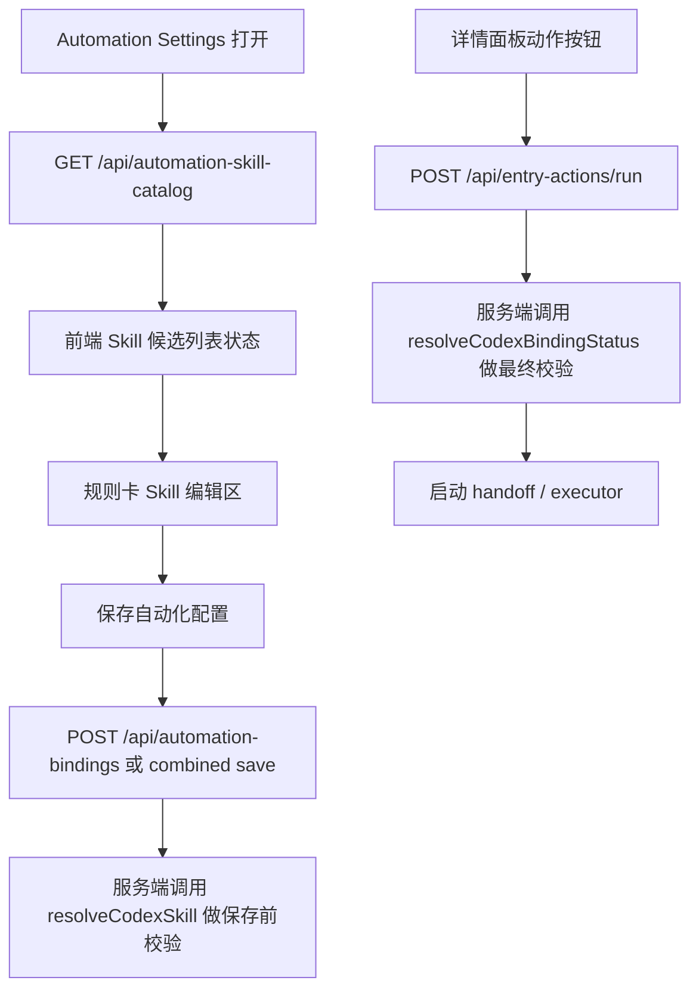

# Automation Settings Skill 选择与校验具体执行方案

## 概述

### 1. 总体目标和范围

本方案的目标，是把 `Automation Settings` 里的 `Skill` 配置从当前的自由文本输入，收敛成一条可真实落地的正式链路：前端能看到当前可选 skill，保存时能做真实校验，执行前还能再做一次最终校验。

本轮范围只覆盖以下内容：

- 新增 `Skill` 候选列表读取接口
- 重构 `Automation Settings` 中的 `Skill` 编辑交互
- 补齐保存前校验与错误提示
- 统一执行前最终校验与失败原因

本轮明确不做以下内容：

- 不做后台定时轮询 skill 列表
- 不做多 provider 扩展，仍只支持 `codex`
- 不做 skill 文档预览、详情页、复杂分类
- 不新增第二套 skill 解析规则
- 不把派生状态写回 `automation-profile` / `automation-bindings`

### 2. 各阶段任务概要

第一阶段：补齐服务端 skill catalog 读取接口。  
主要工作是复用现有 `codex-runtime` 搜索规则，提供前端可用的候选 skill 列表。预期成果是前端不再只能靠手填。

第二阶段：重构 `Automation Settings` 的 `Skill` 字段交互。  
主要工作是把单纯输入框改成“当前值 + 状态 + 选择器 + 刷新”的组合交互。预期成果是用户能明确知道当前 skill 是否可用。

第三阶段：补齐保存前真实校验。  
主要工作是服务端保存自动化配置时复用既有 `resolveCodexSkill` 链路，而不是只做空值校验。预期成果是错误尽量前置到设置页。

第四阶段：收口执行前最终校验与失败状态。  
主要工作是继续以 `resolveCodexBindingStatus` 作为最终真值，并把失败原因映射成稳定 UI 状态。预期成果是“设置合法”和“运行时仍可能失效”的边界清楚。

第五阶段：完成联调与验收。  
主要工作是覆盖候选 skill、手动绝对路径、skill 缺失、运行时漂移等关键场景。预期成果是这一轮能力可稳定交付。

### 3. 整体结构框架



## 一、现状与落点

### 1. 当前真实运行链

当前仓库里，skill 合法性的真实判断已经存在于：

- [src/codex-runtime.mjs](/C:/Code/data-editor/src/codex-runtime.mjs)
  - `resolveCodexSkill`
  - `resolveCodexBindingStatus`
- [server.mjs](/C:/Code/data-editor/server.mjs)
  - `POST /api/automation-profile`
  - `GET /api/automation-bindings`
  - `POST /api/automation-bindings`
  - `POST /api/entry-actions/run`

同时要明确当前数据分层：

- `automation-profile` 只保存规则层字段：`id / label / icon / enabled / targets / payload`
- `automation-bindings` 才保存本机绑定字段：`provider / skill / enabled`

因此，这一轮所有和 `Skill` 有关的保存、校验、提示与失败原因，都必须围绕 `automation-bindings` 展开，而不能错误挂到 `automation-profile` 上。

因此这一轮不能再设计第二套真值系统，必须直接复用这条现有运行链。

### 2. 当前缺口

当前缺的不是执行能力，而是两层配置体验：

- 前端没有正式的 skill 候选列表来源
- `Skill` 字段仍偏自由输入
- 保存时还没有把 skill 可解析性前置校验到位
- 用户不容易区分“配置错了”和“运行时环境后来变了”

## 二、阶段一：新增 skill catalog 读取接口

### 1. 目标

新增只读接口：

`GET /api/automation-skill-catalog?projectId=<id>`

这个接口只负责回答：

- 当前机器、当前项目上下文下，有哪些可作为普通 `skill id` 选择的候选项

它不负责：

- 判定某条规则最终一定能执行成功
- 代替 `resolveCodexSkill`
- 代替 `resolveCodexBindingStatus`

### 2. 服务端实现

建议在 [server.mjs](/C:/Code/data-editor/server.mjs) 增加新路由，并在 `src/` 下补一个轻量枚举函数。

推荐新增：

- `src/automation-skill-catalog.mjs`

职责：

- 复用 `codex-runtime` 已有 skill 搜索根目录
- 枚举候选 skill 目录
- 产出前端候选列表

这里推荐先把 [src/codex-runtime.mjs](/C:/Code/data-editor/src/codex-runtime.mjs) 里当前私有的 skill 候选路径规则抽成可复用导出，再由 catalog 枚举与 `resolveCodexSkill` 共同使用。

不推荐直接在 `automation-skill-catalog.mjs` 里手抄三条路径规则，否则后续两边很容易漂移。

### 3. 枚举规则

第一版只枚举普通 skill id，不把绝对路径 skill 混进 catalog。

推荐枚举根：

- `<projectRoot>/.agents/skills/*/SKILL.md`
- `%USERPROFILE%/.codex/skills/*/SKILL.md`
- `%USERPROFILE%/.agents/skills/*/SKILL.md`

返回时做以下收敛：

- 按 `skill id` 去重
- 记录来源，便于后续排查
- 按 `id` 排序，保证前端稳定

推荐返回结构：

```json
{
  "provider": "codex",
  "loadedAt": "2026-07-08T12:34:56.000Z",
  "skills": [
    {
      "id": "recheck",
      "label": "recheck",
      "source": "user-codex-home"
    }
  ]
}
```

### 4. 不做项

第一版不在这个接口里做：

- skill 文本描述抓取
- SKILL.md 内容摘要
- 收藏 / 最近使用
- 合法性最终判断

## 三、阶段二：重构 Skill 编辑交互

### 1. 目标

把 `Automation Settings` 里每条规则的 `Skill` 从单输入框重构成以下结构：

- 当前值展示
- 状态 badge
- 选择 skill 按钮
- 手动输入入口
- 刷新列表按钮

### 2. 前端状态模型

建议在 [src/App.tsx](/C:/Code/data-editor/src/App.tsx) 的自动化设置状态中新增：

```ts
type AutomationSkillCatalogItem = {
  id: string;
  label: string;
  source?: string;
};

type AutomationSkillCatalogState = {
  loading: boolean;
  error: string | null;
  loadedAt: string | null;
  skills: AutomationSkillCatalogItem[];
};
```

同时为每条规则派生：

```ts
type RuleSkillUiStatus =
  | "ready"
  | "empty"
  | "missing"
  | "manual_path"
  | "invalid"
  | "runtime_invalid";
```

说明：

- `manual_path` 不是错误态，只表示当前值是绝对路径，未走 catalog 选择
- `invalid` 对应当前后端 `bindingStatuses[ruleId].status === "invalid"`
- `runtime_invalid` 不作为保存态，而作为执行结果态显示

### 3. UI 结构

建议把当前 `Skill` 输入区改为：

- 上行：字段标题、状态 badge、刷新按钮
- 中行：只读当前值或可编辑输入框
- 下行：`选择技能` / `手动输入路径` 两个入口

推荐交互：

1. 默认优先显示“选择技能”
2. 点击后打开可搜索列表
3. 选择某项后写入 `bindings.bindings[rule.id].skill`
4. 若用户切到“手动输入路径”，允许直接输入绝对路径
5. 若当前值不在 catalog 中，但本身是绝对路径，不直接判错

### 4. 与现有图标选择器的关系

这一轮只复用当前已存在的“弹层选择器”交互风格，不要求把 skill 做成和 icon 完全共用一个组件。

原因是：

- icon 选择器是纯静态枚举
- skill 选择器依赖异步加载、刷新、错误提示、手动输入路径
- 两者交互形态相似，但状态模型不同

因此推荐：

- 视觉风格尽量对齐
- 组件实现单独落地

## 四、阶段三：保存前真实校验

### 1. 目标

用户点击“保存自动化设置”时，不能只检查 `skill` 非空；必须检查当前 `bindings[ruleId].skill` 是否能按真实运行链被解析。

### 2. 推荐做法

保存 `automation-bindings` 时，服务端对每条 binding 做以下校验：

1. `provider` 必须为 `codex`
2. `skill` 不能为空
3. 调用 `resolveCodexSkill(binding.skill, { projectRoot })`
4. 若返回失败，拒绝保存并回传结构化错误

推荐错误结构：

```json
{
  "error": "validation_failed",
  "issues": [
    {
      "ruleId": "fill-data-name",
      "field": "skill",
      "code": "skill_missing",
      "message": "Skill 未找到。"
    }
  ]
}
```

### 3. 为什么不用 catalog 命中作为保存依据

因为当前真实运行链支持：

- 普通 skill id
- 绝对路径 skill

若保存时只看 catalog，会错误拒绝合法的绝对路径 skill。

所以保存校验必须直接复用 `resolveCodexSkill`，不能偷换成“是否在列表里”。

### 4. 保存一致性决策

当前前端真实保存顺序是：

1. `saveAutomationProfile(profile)`
2. `saveAutomationBindings(bindings)`

这会带来一个直接风险：

- 规则层保存成功
- 但 bindings 因 `skill` 非法被服务端拒绝
- 最终形成“规则已落盘、本机绑定未落盘”的部分成功状态

这一轮必须先做保存一致性决策，不能跳过。

我的推荐方案是：

- **新增一个 combined save 接口**，例如 `POST /api/automation-settings`
- 请求体同时携带 `profile` 和 `bindings`
- 服务端先完整校验两部分
- 只有全部通过时才真正写盘

推荐原因：

- 最符合“保存自动化设置”这个用户心智
- 不会出现 profile 成功、bindings 失败的分裂状态
- 后续再补更多字段级校验时，边界更稳定

如果这一轮不想立刻加 combined save，退一步的 MVP 也必须是：

- 先服务端预校验 `bindings`
- 预校验通过后，再继续当前双保存流程

但不推荐继续保留“先存 profile，再赌 bindings 能过”的顺序。

## 五、阶段四：执行前最终校验与状态映射

### 1. 目标

详情面板动作按钮在真正发起自动化前，继续由服务端做一次最终校验，防止环境在保存后已经变化。

### 2. 现有真值保持不变

`POST /api/entry-actions/run` 继续复用：

- `resolveCodexBindingStatus`

不新增第二套执行前检查链。

### 3. 推荐失败原因码

建议把当前执行前失败原因统一收敛到以下几类：

- `provider_unsupported`
- `skill_empty`
- `skill_missing`
- `codex_cli_missing`
- `binding_invalid`
- `runtime_launch_failed`

前端再把这些原因映射成用户能理解的中文状态，例如：

- `skill_missing` -> `技能未找到`
- `codex_cli_missing` -> `当前机器未检测到 Codex CLI`
- `binding_invalid` -> `当前本机绑定无效`
- `runtime_launch_failed` -> `自动化启动失败`

### 4. 前端展示策略

详情面板里：

- 运行前校验失败，显示即时错误
- 运行中保持按钮级状态
- 返回运行时失败后，状态写入当前条目动作状态缓存

Automation Settings 里：

- 不展示“本次执行成功/失败”
- 只展示规则层静态配置状态

两者职责分开，避免把规则配置页变成运行历史页。

### 5. 与当前 `bindingStatuses` 的状态映射

当前 `GET /api/automation-bindings` 已经返回：

- `ready`
- `missing`
- `invalid`

这一轮前端新增的 UI 派生态，推荐按下表映射：

| 条件 | UI 状态 | 含义 |
| --- | --- | --- |
| `binding.skill` 为空 | `empty` | 还没配置 skill |
| `binding.skill` 为绝对路径，且后端状态为 `ready` | `manual_path` + `ready` 文案 | 专家模式路径，当前可用 |
| `binding.skill` 为绝对路径，且后端状态为 `invalid` | `invalid` | 专家模式路径当前无效 |
| 非绝对路径，命中 catalog，且后端状态为 `ready` | `ready` | 正常可用 |
| 非绝对路径，未命中 catalog，但后端状态为 `ready` | `ready` | catalog 可能未刷新，但当前运行时仍可用 |
| 非绝对路径，后端状态为 `missing` | `missing` | 当前没有本机绑定或 skill 缺失 |
| 非绝对路径，后端状态为 `invalid` | `invalid` | provider / Codex CLI / skill 解析失败 |
| 执行时才失败 | `runtime_invalid` | 保存后环境漂移或启动失败 |

这里的原则是：

- 运行时真值优先于 catalog 命中
- catalog 只影响“选择体验”和辅助提示
- 最终 badge 不能仅由 catalog 是否命中决定

## 六、阶段五：实施顺序

推荐按这个顺序执行，避免前后端同时大改：

### 第 1 步

先抽出共享 skill 候选路径函数，再补服务端 `GET /api/automation-skill-catalog`。

产物：

- `resolveCodexSkill` 与 catalog 共用同一份候选路径来源
- catalog 接口可返回候选 skill 列表

### 第 2 步

前端补 catalog 读取状态与刷新逻辑。

产物：

- Automation Settings 打开时自动加载候选列表
- 用户可手动刷新

### 第 3 步

重构 `Skill` 字段 UI。

产物：

- 选择 skill
- 手动输入绝对路径
- 状态 badge

### 第 4 步

先解决保存一致性，再把服务端保存链切到真实 `resolveCodexSkill` 校验。

产物：

- 不再出现 profile 已保存但 bindings 保存失败的分裂状态
- 保存时能拦住不存在的普通 skill
- 保存时仍允许合法绝对路径

### 第 5 步

统一执行前错误原因码和前端提示。

产物：

- 详情面板动作失败原因更稳定
- 用户可区分“配置错误”和“运行时环境变化”

## 七、验收清单

### 1. catalog 读取

- 打开 Automation Settings 后能自动加载 skill 列表
- 点击刷新后能重新拉取
- 列表为空时有明确空态提示

### 2. 普通 skill 选择

- 可从列表选择 `recheck`、`explain` 等 skill
- 保存成功后刷新页面仍能正确回显

### 3. 绝对路径 skill

- 手动输入绝对路径后可保存
- 即使它不在 catalog 中，也不会被错误拦截

### 4. skill 缺失

- 普通 skill 被删除后，保存或执行时能得到明确错误
- 错误提示能指向具体 rule

### 5. 运行时漂移

- 设置保存成功后，如果本机 Codex CLI 被移除或 skill 文件被删
- 详情按钮执行前仍能正确失败并给出原因

## 八、风险与边界

### 1. catalog 与真实运行链天然不是同一个层级

这是设计上的刻意分层，不是缺陷：

- catalog 解决“怎么选”
- `resolveCodexSkill` 解决“能不能保存”
- `resolveCodexBindingStatus` 解决“此刻能不能执行”

### 2. 绝对路径属于专家模式

第一版保留绝对路径支持，是因为当前运行链已经真实支持它；但 UI 上不应把它做成默认主路径。

### 3. 不做后台轮询

skill 变化频率低，后台轮询成本高且不能替代执行前最终校验，因此明确不做。

## 九、推荐结论

我的推荐是：

- **保留当前 `codex-runtime` 作为唯一真实校验链**
- **新增 `automation-skill-catalog` 只读接口作为候选列表源**
- **前端把 `Skill` 重构成“选择为主，手填兜底”的双入口**
- **保存前复用 `resolveCodexSkill`，执行前继续复用 `resolveCodexBindingStatus`**

原因是这套方案最稳，且和当前仓库已有实现最一致：

- 不会再造第二套 skill 真值
- 不会误伤绝对路径 skill
- 不需要后台高频抓取
- 前端体验能明显提升，同时执行链仍保持真实可信
