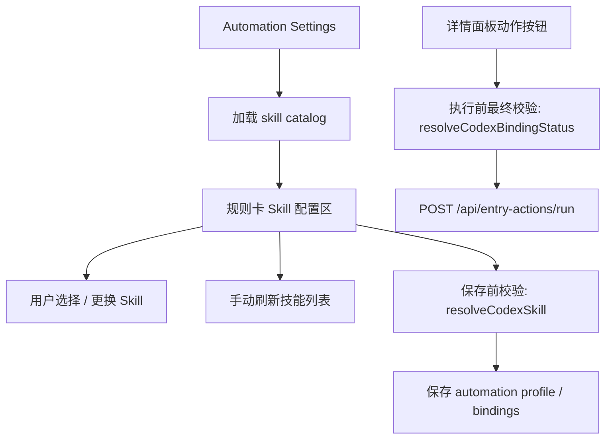

# Automation Settings Skill 选择与校验方案

## 概述

### 1. 总体目标和范围

本方案的目标，是把 `Automation Settings` 中每条自动化规则的 `Skill` 配置，从当前的自由文本输入框，升级为“可选择、可刷新、可校验、可在执行前最终复核”的正式配置能力。

本轮范围只覆盖以下内容：

- `Automation Settings` 中 `Skill` 字段的交互重构
- 当前可用 skill 列表的读取、刷新与前端状态模型
- 保存前校验与执行前最终校验的职责边界
- 错误原因与提示文案的最小状态模型

本轮不包含以下内容：

- 不改动 `automation-profile` / `automation-bindings` 的基础存储模型
- 不做后台定时轮询 skill 列表
- 不做跨设备 skill 同步
- 不做 skill 详情页、skill 文档预览或复杂分类管理
- 不做 provider 多实现扩展，仍然以当前 `codex` provider 为唯一目标

### 2. 各阶段任务概要

第一阶段：定义 skill 候选列表与真实校验链路。  
主要工作是明确“前端可选 skill 列表”和“运行时最终合法性判断”分别由谁回答。预期成果是前端不再靠手填猜测，同时不会和真实执行面分叉。

第二阶段：重构 `Automation Settings` 中的 `Skill` 字段。  
主要工作是把自由输入框改为“当前值 + 状态 badge + 更换入口 + 刷新入口”的组合交互。预期成果是用户能明确知道自己选了什么、当前是否合法、是否需要刷新。

第三阶段：补齐保存前校验与执行前校验。  
主要工作是把 skill 合法性分为“配置时校验”和“运行时最终校验”两层。预期成果是设置页能提前拦错，执行链路还能兜底处理环境漂移。

第四阶段：定义验证重点与不做项。  
主要工作是明确本轮验收标准、失败原因码和后续可扩展方向。预期成果是实现边界清晰，不会一轮里把 skill 管理做成过重系统。

### 3. 整体结构框架



## 一、当前问题定义

### 1. 当前 `Skill` 只是自由文本输入

当前 `Automation Settings` 中每条 rule 的 `Skill` 字段仍然是普通输入框。它的问题不是“不能用”，而是：

- 用户必须自己记住 skill 名称
- 用户必须手动输入，容易拼错
- 设置页只能检查“是否为空”，不能判断“当前机器上是否真的存在”
- 用户往往要等到点击详情按钮后，才知道 skill 是否无效

这导致 `Skill` 配置仍然停留在工程化、低可发现性的阶段。

### 2. skill 合法性不能靠后台高频抓取解决

本需求的关键不是“多久抓一次”，而是“在哪些时点需要确认合法性”。

如果改成后台每 30 秒或每 1 分钟轮询 skill 列表，会带来几个问题：

- skill 实际变化频率很低，轮询价值不高
- 引入额外复杂度，但不能替代执行前最终校验
- 不同用户、不同机器、不同 Codex 绑定环境下，列表天然可能不同
- 即使轮询命中，运行时环境仍然可能在点击执行前发生变化

因此，本方案明确拒绝“靠定时抓取保证合法性”的设计。

## 二、推荐方案

### 方案结论

**采用“事件驱动刷新 + 双层校验”的方案。**

具体是：

- 打开 `Automation Settings` 时加载一次 skill catalog
- 用户点击“刷新技能列表”时重新加载
- 保存自动化设置时做一次保存前校验
- 详情面板动作真正执行前，再做一次最终校验

这样做的原因是：

- 前端配置体验足够明确
- 不需要后台轮询
- 能覆盖“打开设置后环境变化”的问题
- 真正的执行真值仍由运行时校验兜底

## 三、Skill 候选列表与真实来源

### 1. 推荐的 authoritative source of truth

推荐把 skill 合法性的真实来源定义为：

**当前仓库已经存在的 `resolveCodexSkill / resolveCodexBindingStatus` 运行时校验链**

这条链当前已经真实决定：

- `binding.provider` 是否为 `codex`
- 当前设备是否存在可执行 Codex CLI
- `binding.skill` 是否为空
- `binding.skill` 是否能按现有搜索规则解析到真实 skill 文件

所以本方案必须明确：

- `skill catalog` 不是最终真值
- `skill catalog` 只是前端候选列表
- 真正 authoritative 的判断仍然是运行时校验链

### 2. 当前运行时搜索规则

当前仓库里，非绝对路径 skill 的现有搜索规则已经固定存在：

- `<projectRoot>/.agents/skills/<skill>/SKILL.md`
- `%USERPROFILE%/.codex/skills/<skill>/SKILL.md`
- `%USERPROFILE%/.agents/skills/<skill>/SKILL.md`

同时，当前仓库还支持：

- `binding.skill` 为绝对路径

只要绝对路径存在，对当前执行链就是合法配置。

因此前端与新接口都不能再自定义第二套 skill 发现规则，必须复用这套现有约束。

### 3. 推荐的实现承载

第一版推荐新增一个最小读取接口，例如：

`GET /api/automation-skill-catalog`

接口职责只做一件事：

- 返回按当前仓库既有搜索规则枚举出的 skill 候选列表

推荐返回结构：

```json
{
  "provider": "codex",
  "skills": [
    { "id": "recheck", "label": "recheck" },
    { "id": "explain", "label": "explain" },
    { "id": "fill-data-name", "label": "fill-data-name" }
  ],
  "loadedAt": "2026-07-08T12:34:56.000Z"
}
```

本轮不要求后端返回复杂元数据，比如描述、分类、来源路径、安装状态详情；先保证“当前有哪些可选候选 skill”这件事是真的。

但这个接口的定位必须明确：

- 它是便捷选择器数据源
- 它不是最终执行真值
- 它不能替代 `resolveCodexSkill / resolveCodexBindingStatus`

## 四、前端交互模型

### 1. `Skill` 字段不再是单一输入框

推荐把每条 rule 的 `Skill` 区块改成四部分：

- 当前值显示
- 合法性状态
- 更换入口
- 刷新入口

推荐交互结构：

- `Skill`
- 当前值：`fill-data-name`
- 状态：`已就绪 / 未选择 / 未找到 / 需刷新`
- 按钮：`选择技能`
- 按钮：`刷新技能列表`

### 2. 交互细节

推荐行为如下：

1. 用户打开 `Automation Settings`
2. 前端自动加载一次 skill catalog
3. 规则卡里的 `Skill` 字段展示当前值和当前状态
4. 用户点击 `选择技能`
5. 看到可搜索列表，而不是自己手填
6. 用户点击 `刷新技能列表` 时，立即重新拉取当前 catalog
7. 如果当前值是普通 skill id 且不在最新 catalog 中，立即标红提示

### 3. 是否保留手动输入

推荐第一版仍允许“手动输入 + 列表选择”并存，但 UI 主入口改为选择器，原因是：

- 这样对已知 skill id 的高级用户仍然友好
- 不会把实现一口气做得过重
- 先完成“选择为主、输入兜底”的过渡

同时要明确两种输入模式：

- 普通模式：从 catalog 里选择 skill id
- 专家模式：手动输入绝对路径 skill

因此第一版不能把“catalog 未命中”直接等同于“必然非法”。

但主视觉上，不应再把手动输入框当成唯一入口。

## 五、状态模型

### 1. 推荐状态枚举

每条 rule 的 `Skill` 增加一个前端派生状态：

- `ready`
  - 当前 skill 经过当前运行时校验链判定可用
- `empty`
  - 未填写或未选择
- `missing`
  - 当前规则里配置了 skill，但当前运行时校验链无法解析
- `runtime_invalid`
  - 保存时合法，但执行前最终校验失败

### 2. 状态来源

推荐状态来源如下：

- `empty`
  - 来自规则自身值为空
- `ready`
  - 来自 `resolveCodexBindingStatus(...).status === "ready"`
- `missing`
  - 来自 `resolveCodexSkill / resolveCodexBindingStatus` 返回 skill 不可用
- `runtime_invalid`
  - 来自执行接口返回的运行时失败原因

本轮不建议把这些状态写回 `automationProfile` 真值文件里，保持它们是前端派生状态即可。

本轮推荐移除 `stale` 作为正式必做状态。  
如果后续真的需要“列表可能过期”的体验，再单独补 `loadedAt + 超时阈值` 规则；第一版先不要把这个状态做进正式验收范围。

## 六、刷新策略

### 1. 推荐刷新频率

推荐采用以下事件驱动刷新点：

- 打开 `Automation Settings` 时自动刷新一次
- 用户点击 `刷新技能列表` 时刷新一次
- 保存前使用当前运行时校验链做一次校验
- 执行前由后端做最终校验

### 2. 不推荐后台轮询

本轮明确不做：

- 每 30 秒自动刷新
- 每分钟自动刷新
- 页面常驻轮询 catalog

原因是后台轮询并不能替代执行前校验，反而增加状态管理复杂度。

## 七、校验边界

### 1. 保存前校验

保存前校验的目标是提前暴露明显错误，而不是给运行时做最终担保。

推荐保存前至少校验：

- `Skill` 不能为空
- `binding.provider === "codex"`
- 调用现有 `resolveCodexSkill` 后可成功解析

这里不再建议抽象成“Skill 名称格式合法”，因为当前执行面接受两类值：

- 普通 skill id
- 绝对路径 skill

只要它能被现有运行时规则正确解析，就应视为合法。

如果失败：

- 阻止保存
- 在对应规则卡中显示明确错误

### 2. 执行前最终校验

执行前最终校验是整个链路的最终真值。

原因是：

- 用户保存后，skill 可能被卸载
- 用户可能切换了 Codex 环境
- 当前机器与另一台机器绑定不同
- 包装器或宿主实际执行环境可能与设置页加载时不同

因此，`POST /api/entry-actions/run` 在真正发起 handoff / 包装器前，必须重新确认：

- `binding.provider === "codex"`
- `binding.skill` 非空
- 当前环境下该 `skill` 仍然可见

如果失败，推荐返回明确 reason，例如：

- `skill_missing`
- `skill_catalog_unavailable`
- `provider_not_supported`

## 八、数据与接口建议

### 1. profile 真值不扩字段复杂化

本轮推荐继续保持：

- `automationProfile.rules[].id`
- `automationBindings.bindings[ruleId].skill`

也就是：

- 规则层仍然只保存“当前选择的 skill id”
- skill catalog 不写入 profile
- 状态 badge 不写入 profile

### 2. 新增最小接口

推荐新增：

`GET /api/automation-skill-catalog`

可选地，后续执行接口补一个更细失败原因，但不要求本轮额外再开“测试 skill”专用接口。

同时，推荐复用现有运行时能力：

- 保存前：服务端复用 `resolveCodexSkill / resolveCodexBindingStatus`
- 绑定列表返回时：继续复用当前 `bindingStatuses`
- 执行前：继续复用 `resolveCodexBindingStatus`

## 九、执行顺序建议

### 第一阶段：先打通候选列表读取链

- 新增 `GET /api/automation-skill-catalog`
- 前端在打开设置页时拉取一次
- 先把候选列表建立起来，但不把它当最终真值

### 第二阶段：再重构设置页交互

- 把 `Skill` 输入框改为“状态 + 选择 + 刷新”
- 保留必要的手动输入兜底
- 加上红黄绿状态提示

### 第三阶段：接保存前校验

- 保存前检查是否为空
- 服务端复用 `resolveCodexSkill / resolveCodexBindingStatus`
- 普通 skill 与绝对路径 skill 统一按真实运行时规则判定

### 第四阶段：接执行前最终校验

- `run-entry-action` 真正执行前复核 skill
- 返回明确 reason
- 前端在详情面板展示失败原因

## 十、验证重点

### 设置页验证

1. 打开 `Automation Settings`
2. 能自动加载当前可用 skill 列表
3. 已有规则能正确显示 `Skill` 当前值
4. 不存在的普通 skill 或失效的绝对路径 skill 会显示为 `未找到`
5. 点击 `刷新技能列表` 后状态会即时更新

### 保存验证

1. `Skill` 为空时不能保存
2. 普通 skill 无法被现有搜索规则解析时不能保存
3. 绝对路径 skill 存在时可正常保存
4. 普通 skill 命中现有搜索规则时可正常保存

### 运行验证

1. 保存后详情面板动作仍可正常显示
2. 执行前如果 skill 已失效，会明确报错
3. 不会出现“按钮点了没反应，但也不知道为什么”的静默失败

## 十一、本轮不做项

本轮明确不做：

- 不做定时轮询 catalog
- 不做 skill 分类页或复杂面板
- 不做 skill 描述、路径、安装来源展示
- 不做跨设备同步 catalog
- 不做多 provider 并行扩展

## 十二、推荐结论

推荐把 `Automation Settings` 中的 `Skill` 配置，收敛成“事件驱动刷新 + 双层校验”的正式模型：

1. 当前可用 skill 列表由宿主读取链提供最小真值
2. 但这份列表只是候选选择数据，不是 authoritative 真值
3. 设置页打开时自动拉取，用户可手动刷新
4. 保存前与执行前都复用现有运行时校验链

这样可以在不引入后台轮询和过重基础设施的前提下，把当前 `Skill` 配置从“纯手填字符串”升级为真正可用、可排障、可维护的产品能力。
