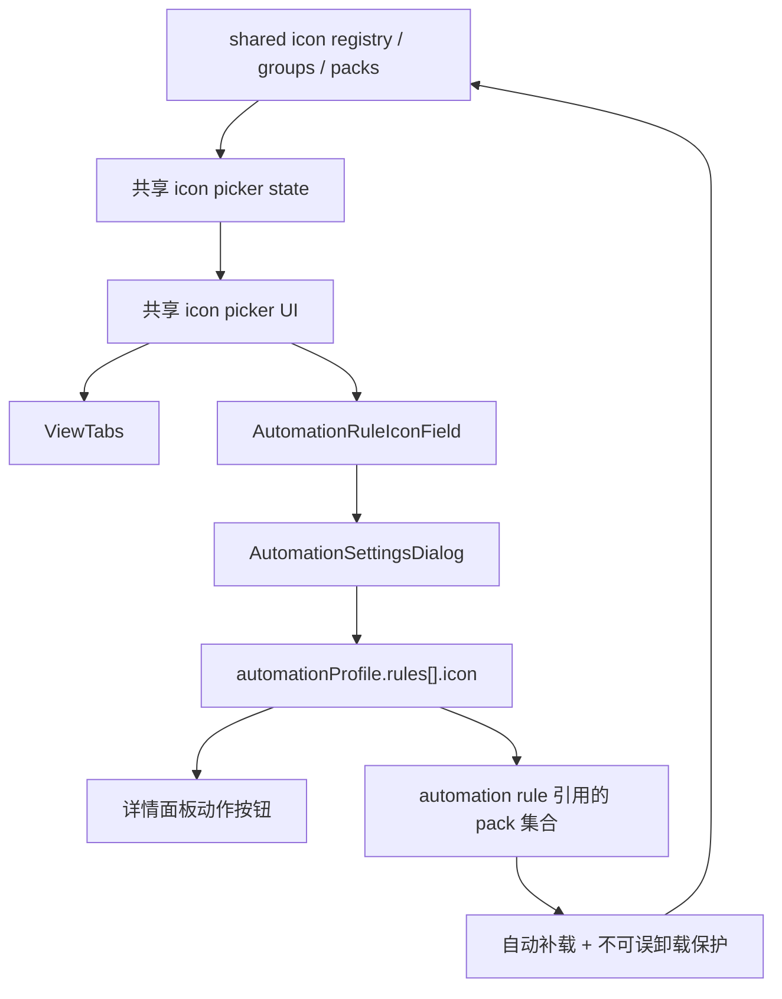

# Automation Settings 图标选择器具体执行方案

## 方案概述

### 1. 总体目标和范围

本方案用于把 `Automation Settings` 中自动化规则的 `Icon` 配置，从当前的纯文本输入框，升级为和 `ViewTabs` 图标体系同源、同状态的可视化图标选择体验。

本轮的核心目标不是做一套新的自动化图标系统，而是把当前 shared view 已经成熟的图标能力，正式抽为可复用底座，再接入 `Automation Settings`。

落地后应满足：

- 自动化规则的图标真值仍然是 `automationProfile.rules[].icon`
- `Automation Settings` 与 `ViewTabs` 完全共用同一套：
  - 收藏
  - 最近
  - 图标包加载 / 卸载状态
- 不新增任何 automation 专属 favorites / recent / loaded-packs 配置
- 用户可以像标签视图一样搜索、切分组、点选图标
- 当前规则已使用的图标包在设置页中能自动补载，并在编辑期间不可误卸载
- 保存后详情面板右上角动作按钮立即使用新图标

本轮范围包括：

- shared view icon picker 组件化拆分
- `Automation Settings` 规则卡中的图标字段重构
- automation rule icon 对 pack runtime 的引用保护
- 相关验证与回归

本轮不包括：

- 重构 shared view icon registry 本身
- 迁移 `favoriteSharedViewIconIds` 为真正全局用户偏好
- 自定义上传图标、emoji、颜色定制
- skill 到 icon 的自动推荐
- 结果历史、运行态变色或动态图标

### 2. 各阶段任务概要

#### 第一阶段：抽出共享图标选择底座

主要工作：

- 从 `ViewTabs.tsx` 中抽离图标 picker 的通用 UI 和通用状态
- 保留 `ViewTabs` 自己的业务状态和 optimistic icon 更新逻辑

预期成果：

- 仓库内存在一个可被 `ViewTabs` 与 `Automation Settings` 共同消费的 shared icon picker 底座

执行顺序：

- 先拆 state / helper
- 再拆 UI
- 最后回接 `ViewTabs`

#### 第二阶段：接入 Automation Settings

主要工作：

- 重构当前 `Icon` 输入框
- 为 Automation rule 增加图标预览按钮和 picker
- 让规则编辑 draft 直接消费选中的 icon

预期成果：

- 用户不再需要手填 icon id 就能完成图标选择
- 当前规则图标可即时预览、即时切换

执行顺序：

- 先做 rule-level field 组件
- 再接入 `AutomationSettingsDialog`
- 最后处理高级 fallback 的展示方式

#### 第三阶段：补齐共享运行态与 pack 保护

主要工作：

- Automation Settings 打开时自动补载当前规则依赖的 pack
- 把 automation rules 当前引用的 pack 纳入同一套不可误卸载保护判断

预期成果：

- 规则里已使用的 `Tabler` / `Streamline` 图标不会因为 pack 状态而丢失回显
- 设置页里不会误卸载当前 automation rules 正在使用的 pack

执行顺序：

- 先实现引用 pack 解析
- 再接自动补载
- 最后接 pack 保护文案和禁用态

#### 第四阶段：验证与回归

主要工作：

- 覆盖组件、状态、保存、详情按钮图标更新与浏览器验收

预期成果：

- 这轮改造不会把 shared view picker 和 Automation Settings 再次做成两套分叉逻辑

执行顺序：

- 先单测 / focused test
- 再 build
- 最后浏览器人工验收

### 3. 整体结构框架



执行顺序为：共享底座 -> Automation field -> pack 保护 -> 验证。

---

## 一、现状与改造目标

### 当前现状

当前仓库里的事实如下：

- `AutomationSettingsDialog` 位于 `src/App.tsx`
- `Icon` 字段仍然是普通 `<input>`
- `automation-profile.mjs` 对 `rule.icon` 的合法值校验已经复用 `normalizeSharedViewIcon(...)`
- `ViewTabs.tsx` 已经内置一套成熟的 icon picker，但状态和 JSX 仍然和 view 菜单耦合
- shared view pack 的保护链目前只扫描 shared views 正在使用的图标，不覆盖 automation rules

### 本轮目标状态

本轮完成后，应当变成：

- `ViewTabs` 和 `Automation Settings` 使用同一个 picker 底座
- 自动化规则仍只保存最终 `icon`
- 收藏 / 最近 / pack 加载都只有一份配置和一套运行态
- automation rules 引用的 pack 也进入同一套运行态保护

---

## 二、实施边界与硬决策

### 1. 不重开自动化图标数据模型

本轮不新增以下字段：

- `automationFavoriteIconIds`
- `automationRecentIconIds`
- `automationLoadedIconPacks`

`automationProfile.rules[].icon` 继续是唯一正式真值。

### 2. 不复制 ViewTabs 图标 picker

本轮不允许把 `ViewTabs.tsx` 中的 picker JSX 再复制一份到 `Automation Settings`。

正式要求是：

- 抽共享底座
- 两侧共用

### 3. 收藏和加载状态必须完全一致

本轮接受并显式保留当前真实语义：

- 收藏来自 `selectedViewProfile.favoriteSharedViewIconIds`
- 最近来自 localStorage
- pack 加载状态来自 shared view icon runtime + localStorage

Automation Settings 只是消费同一套状态，不维护副本。

### 4. 高级文本 fallback 不作为主路径

推荐第一轮：

- 主路径：图标预览按钮 + picker
- 次路径：当前 icon id 只读展示
- 若保留手填能力，只放在“高级编辑”折叠区

不再把纯文本输入框放在规则表单主路径上。

---

## 三、文件级改造方案

## 1. 通用图标体系层

### `src/components/icons.ts`

主要工作：

- 保持 registry、groups、search aliases、pack labels、recent 读取等正式真值不变
- 补一个“从一组 iconId 收集受保护 pack”的 helper，供 shared views 和 automation rules 共用

建议新增能力：

- `collectProtectedIconPackIdsFromIcons(iconIds: string[]): SharedViewIconPackId[]`

目的：

- 不把 pack 保护逻辑写死在 shared view 上
- 让 automation rules 也能在同一 runtime 上计算依赖 pack

### `src/components/shared` 目录

建议新增：

- `SharedViewIconPicker.tsx`
- `useSharedViewIconPickerState.ts`
- 必要时补 `shared-view-icon-picker-types.ts`

职责划分：

- `useSharedViewIconPickerState.ts`
  - 搜索 query
  - active group
  - global search 开关
  - recent / favorites / loaded packs 读取
  - pack load / unload 行为
  - picker candidate 列表
- `SharedViewIconPicker.tsx`
  - 搜索行
  - group tabs
  - pack options
  - icon grid
  - empty state / unloaded state

这里补一条硬约束：

- `useSharedViewIconPickerState.ts` 只负责共享运行态与数据状态
- hover tooltip、DOM refs、浮层几何定位等强 UI 细节留在组件层或消费方

不要把当前 `ViewTabs` 里的 `hoverTooltip`、`iconOptionRefs`、`showHoverPreview` 这类布局耦合状态整体塞进通用 hook，否则第一轮很容易抽出一个过重的共享状态层。

明确不放进去的状态：

- `ViewTabs` 某个具体 view 的 open state
- optimistic iconByViewId
- view menu title input

## 2. ViewTabs 回接层

### `src/components/ViewTabs.tsx`

主要工作：

- 把当前内联 picker 改为调用共享 picker 组件
- 保留以下 `ViewTabs` 专属状态：
  - `iconPickerOpenForViewId`
  - optimistic view icon 更新
  - 与 view menu 的布局协作
  - hover preview 等局部交互

目标：

- `ViewTabs` 行为对用户保持不变
- 但 picker 本体不再被 `ViewTabs` 独占

## 3. Automation Settings 接入层

### `src/components/automation/AutomationRuleIconField.tsx`

建议新增专用字段组件，负责：

- 当前 rule icon 预览
- 打开 / 关闭 picker
- 选中 icon 后回调到 rule draft
- 显示当前 icon id
- 可选的高级 fallback 入口

建议 props：

```ts
type AutomationRuleIconFieldProps = {
  disabled: boolean;
  icon: SharedViewIconId;
  favoritesEnabled: boolean;
  protectedIconPackIds: SharedViewIconPackId[];
  favoriteIconIds: SharedViewIconId[];
  onChange: (icon: SharedViewIconId) => void;
  onToggleFavoriteIcon: (icon: SharedViewIconId) => void;
};
```

### `src/App.tsx`

主要工作：

- 从 `AutomationSettingsDialog` 中移除当前 `Icon` 纯文本主输入
- 接入 `AutomationRuleIconField`
- 继续从当前 `selectedViewProfile.favoriteSharedViewIconIds` 透传收藏状态
- 计算 automation rules 当前引用的受保护 pack，并传给 icon field / picker

这里要补一条硬接口决策：

当前 `AutomationSettingsDialog` 还拿不到 shared view 收藏链路所需的数据与动作，因此第一轮必须显式扩充它的 props，而不是在弹框内部重新造一套收藏状态。

建议新增：

```ts
type AutomationSettingsDialogProps = {
  open: boolean;
  project: ProjectDefinition | null;
  files: DataFile[];
  profile: UserAutomationProfile;
  bindings: DeviceEntryActionBindings;
  favoriteIconIds: SharedViewIconId[];
  favoritesEnabled: boolean;
  onToggleFavoriteIcon: (icon: SharedViewIconId) => void;
  onOpenChange: (open: boolean) => void;
  onSaved: (profile: UserAutomationProfile, bindings: DeviceEntryActionBindings) => void;
};
```

其中正式 contract 是：

- `favoriteIconIds` 直接来自当前 `selectedViewProfile.favoriteSharedViewIconIds`
- `favoritesEnabled` 继续沿用 `!!selectedViewProfileName`
- `onToggleFavoriteIcon` 直接复用现有 `handleToggleFavoriteSharedViewIcon(...)`

无 profile 时：

- 收藏按钮保留可见但禁用
- tooltip / 文案明确说明“需要先进入某个视图配置后才能收藏图标”

建议在 `AutomationSettingsDialog` 内新增：

- `automationRuleIconIds`
- `protectedAutomationIconPackIds`
- `combinedProtectedIconPackIds`

其中：

- `combinedProtectedIconPackIds = sharedViewProtectedPackIds + automationRuleProtectedPackIds`

注意：

- 这里不是在设置页保存一份 loaded-packs
- 只是让当前 settings 会话里的 picker 知道哪些 pack 因为 automation rules 被保护

## 4. automation profile 校验层

### `src/automation-profile.mjs`

本轮原则上不改 schema。

只需确认：

- picker 主路径写入的 icon 一定都能通过现有 `normalizeSharedViewIcon(...)`
- 若保留高级文本 fallback，则非法值仍按现有错误路径暴露

---

## 四、运行态与 pack 保护接线

## 1. 当前规则依赖的 pack 收集

在 `AutomationSettingsDialog` 打开后，基于当前 draft 规则：

```ts
profile.rules.map((rule) => rule.icon)
```

解析出对应 pack 列表。

要求：

- 只统计当前实际引用的 icon
- 去重
- 过滤 base pack

建议把 pack 收集 helper 命名为更中性的：

- `collectProtectedIconPackIdsFromIcons(...)`

而不是继续把 `sharedView` 写进一个已经被 automation rules 共用的公共函数名里。

## 2. shared icon runtime 的 hydration 责任

当前仓库里 persisted pack 的恢复并不是 icon runtime 自己完成的，而是 `ViewTabs` 在 mount 时调用：

```ts
hydratePersistedSharedViewIconPacks()
```

这意味着第一轮不能只抽 picker UI，还必须把 **hydration 责任** 一起正式收口，否则会出现：

- localStorage 里明明记录了已加载 pack
- 但 Automation Settings 首次打开时 runtime 尚未注册这些 pack
- picker 拿到的是“持久化状态存在、内存态未就绪”的半初始化状态

第一轮推荐硬决策：

- 把 `hydratePersistedSharedViewIconPacks()` 的正式入口提升到共享 picker state hook 或更上层的 `App.tsx`
- `ViewTabs` 和 `AutomationSettings` 都只消费同一条已初始化 runtime
- 不允许两边各自 mount 时各做一遍 hydration

建议收口方式：

1. 在共享 icon runtime hook 中提供：
   - `ensureHydrated()`
   - `ensureIconPackLoaded(iconId)`
   - `toggleIconPack(packId)`
   - `readProtectedPackSummary(...)`
2. `ViewTabs` 与 `AutomationRuleIconField` 都消费这套共享运行态接口
3. `App.tsx` 只负责把业务上的 protected packs / favorite ids 透传给各自消费者
## 3. 自动补载

当 settings 打开时：

- 若某条 rule 当前 icon 所属 pack 未加载
- 则自动走现有 `loadSharedViewIconPack(...)`

目的：

- 当前规则已经配置好的图标必须能正常回显
- 用户不能打开设置页后只看到 fallback

自动补载前提是：

- shared icon runtime 已经完成 hydration
- settings 会话拿到的是和 `ViewTabs` 同一份 loaded pack 内存态

## 4. 不可误卸载保护

在 picker 的 pack options 中：

- 如果 pack 被当前 shared views 使用，仍按现有保护逻辑
- 如果 pack 被当前 automation rules 使用，也应进入保护

文案建议从：

- `当前共享视图正在使用，暂不可卸载`

改为更中性的：

- `当前配置正在使用，暂不可卸载`

这样可同时覆盖：

- shared views
- automation rules

## 5. 保护范围

本轮保护范围定义为：

- 共享图标 runtime 上的同一套保护判断
- 不是新增第二份 automation loaded-packs 配置
- 也不是重构整个全局 icon runtime

---

## 五、交互与文案方案

## 1. 基础信息区

当前：

- `Rule Id`
- `Label`
- `Icon`
- `Skill`

调整后：

- `Rule Id`
- `Label`
- `Icon`
  - 图标预览按钮
  - 当前 icon id 展示
  - 可选的“高级编辑”入口
- `Skill`

## 2. picker 打开行为

推荐：

- 首次打开默认停在：
  - 当前 icon 所在组；若不可推断，则停在 `最近`
- 搜索框自动聚焦
- 选中后立即关闭 picker，并更新当前 rule draft
- 若当前 `favoritesEnabled === false`，收藏星标保持禁用，并展示原因说明

## 3. 收藏与最近行为

正式 contract：

- 在 `ViewTabs` 中收藏或取消收藏，Automation Settings 中看到同一份结果
- 在 Automation Settings 中选择图标，会写入同一份 recent
- 不允许出现 automation rules 自己的一份 recent / favorites
- 无 `selectedViewProfileName` 时，Automation Settings 不允许收藏，但仍可正常选图标与保存规则 icon

## 4. 高级 fallback

推荐第一轮：

- 默认只显示当前 icon id
- 不默认展示文本输入框
- 如确有需要，再提供“高级编辑”折叠区

---

## 六、验证方案

## 1. focused tests

建议至少覆盖：

- shared icon runtime hydration 只初始化一条正式入口
- pack 保护 helper
- automation rules icon -> protected packs 解析
- 自动补载逻辑
- picker 选中 icon 后写回 rule draft
- 无 profile 时收藏禁用行为

可优先考虑：

- 新增 `tests/automation-icon-picker-state.test.mjs`
- 或在现有 icon / automation 相关测试中补 focused case

## 2. build / typecheck

至少执行：

```powershell
npm run build
```

如当前仓库允许，再补：

```powershell
npm run typecheck
```

如果 typecheck 有既有无关失败，需要明确区分新增问题和存量问题。

## 3. 浏览器验收

至少人工验证：

1. 打开 `Automation Settings`
2. 某条 rule 的图标能显示当前值
3. 点击图标按钮后出现与 `ViewTabs` 同源的 picker
4. 收藏 / 最近与 `ViewTabs` 完全一致
5. 选择 `Tabler` / `Streamline` 图标后，当前 rule 立即更新
6. 保存后关闭再打开，图标仍正确
7. 返回详情面板，右上角动作按钮图标立即更新
8. 刷新页面后，详情动作图标仍正确
9. 当前规则正在使用的 pack 在 settings 中不可误卸载
10. 无 view profile 时，收藏按钮禁用但图标选择仍可正常工作

## 4. 回归重点

必须确认没有回归：

- `ViewTabs` 原有图标 picker 交互
- 收藏图标
- recent 图标
- pack 加载 / 卸载
- shared view icon 持久化
- 详情按钮 icon 渲染链是否直接依赖最新 `automationProfileState`

因为本轮是“抽共享底座”，最容易出问题的就是把 shared view 自己现有能力弄坏。

这里还要补一条实现前检查：

- 在真正开工前，先确认详情面板右上角动作按钮图标的渲染链是否直接读取最新的 `automationProfileState`
- 如果当前还有中间缓存或快照层，则要在执行计划中补一个“保存后刷新 icon 源”的接线任务

---

## 七、实施顺序建议

推荐按下面顺序执行：

1. 抽 `collectProtectedIconPackIdsFromIcons(...)`
2. 抽 `useSharedViewIconPickerState.ts`
3. 抽 `SharedViewIconPicker.tsx`
4. 回接 `ViewTabs.tsx`
5. 新增 `AutomationRuleIconField.tsx`
6. 在 `AutomationSettingsDialog` 接入 icon field
7. 接 automation rule icon pack 自动补载与保护
8. 跑 focused tests / build
9. 做浏览器验收

原因：

- 先保 shared view picker 抽离成功
- 再接 automation settings
- 最后补 runtime 保护和验收

这样最稳，不会一开始就在 `App.tsx` 和 `ViewTabs.tsx` 两边同时大改。

---

## 八、验收标准

本轮完成后，应满足以下标准：

1. `Automation Settings` 中不再使用纯文本输入框作为图标主入口。
2. 自动化规则图标选择器与 `ViewTabs` 使用同源 picker 底座。
3. 收藏、最近、pack 加载状态在 `Automation Settings` 与 `ViewTabs` 中完全一致。
4. 没有新增 automation 专属 favorites / recent / loaded-packs 配置。
5. 当前 automation rules 使用的 pack 会自动补载，并在设置页中不可误卸载。
6. 保存后详情面板右上角动作按钮图标立即更新，刷新后仍一致。
7. shared view 原有 icon picker 行为无回归。

---

## 九、本轮不做项

本轮明确不做：

- 收藏模型升级为真正跨 view-profile 的全局用户偏好
- automation 专属图标收藏体系
- automation 专属 recent / loaded-packs
- icon 智能推荐
- 自定义上传图标
- emoji / 颜色主题
- 结果态动态图标

这些都应留到后续独立任务，不混进本轮。
