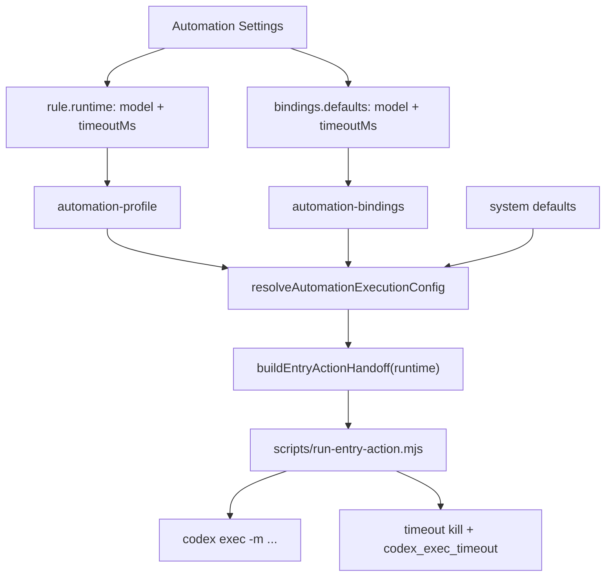

# Automation Settings 运行模型与推理具体执行方案

## 概述

### 1. 总体目标和范围

本方案的目标，是把 `Automation Settings` 中自动化规则的 Codex 运行参数，从当前代码内隐式默认，收敛成一条当前仓库可真实落地的正式链路。

基于前一轮复核结论，本轮**正式落地范围收窄为 `model + timeoutMs`**，不把 `reasoning / verbosity` 伪装成已经真实生效的能力。

本轮范围只覆盖以下内容：

- 在 `automation-profile` 中为 rule 增加 `runtime.model / runtime.timeoutMs`
- 在 `automation-bindings` 中增加本机默认 `defaults.model / defaults.timeoutMs`
- 服务端统一解析最终 runtime，并在写 handoff 前完成收口
- `scripts/run-entry-action.mjs` 只消费 handoff 中的 runtime
- 子进程层真实实现 `timeoutMs` 强制超时
- `Automation Settings` 中增加对应配置入口与保存校验

本轮明确不做以下内容：

- 不把 `reasoning / verbosity` 作为本轮正式可生效能力
- 不开放 `approval / sandbox` 用户配置
- 不做模型 catalog 自动发现
- 不做 provider 多实现扩展
- 不做项目级共享运行参数

### 2. 各阶段任务概要

第一阶段：补齐运行参数的数据模型。  
主要工作是扩展 `automation-profile` 与 `automation-bindings` 的 schema。预期成果是 `model + timeoutMs` 有正式存储位置。

第二阶段：新增服务端 runtime 解析链。  
主要工作是把规则级覆盖、本机默认和系统默认合并成唯一真值。预期成果是服务端能明确回答“这次实际按什么配置执行”。

第三阶段：改造 handoff 与 executor。  
主要工作是把最终 runtime 写入 handoff，并让 `run-entry-action.mjs` 改为只消费 handoff 真值。预期成果是执行脚本不再自行推断 `model`。

第四阶段：落地 `timeoutMs` 的真实执行面。  
主要工作是对子进程增加强制超时、终止逻辑和明确结果码。预期成果是 `timeoutMs` 成为真实生效的运行控制项，而不是 UI 装饰字段。

第五阶段：补齐前端配置入口与验收。  
主要工作是为规则设置和本机默认设置增加配置 UI，并完成保存、执行和超时场景验证。预期成果是这一轮能力可真实交付。

### 3. 整体结构框架



## 一、现状与真实约束

### 1. 当前真实执行链

当前仓库里与自动化执行直接相关的链路如下：

- [src/automation-profile.mjs](/C:/Code/data-editor/src/automation-profile.mjs)
  - 只保存 `id / label / icon / enabled / targets / payload`
- [src/automation-bindings.mjs](/C:/Code/data-editor/src/automation-bindings.mjs)
  - 只保存 `bindings[ruleId].provider / skill / enabled`
- [src/codex-runtime.mjs](/C:/Code/data-editor/src/codex-runtime.mjs)
  - 负责 `resolveCodexCli / resolveCodexSkill / resolveCodexBindingStatus`
- [src/entry-actions.mjs](/C:/Code/data-editor/src/entry-actions.mjs)
  - `buildEntryActionHandoff()` 当前不承载 runtime
- [server.mjs](/C:/Code/data-editor/server.mjs)
  - `POST /api/entry-actions/run` 当前只校验 binding，再生成 handoff
- [scripts/run-entry-action.mjs](/C:/Code/data-editor/scripts/run-entry-action.mjs)
  - 当前重新调用 `resolveCodexBindingStatus()`，并直接使用 `bindingStatus.model`

所以本轮真正要补的，不是“增加几个字段”而已，而是把**运行参数真值从分散状态收敛成服务端单点解析**。

### 2. 当前 CLI 真实能力边界

当前本机 `codex exec --help` 已确认：

- 支持 `-m / --model`
- 支持 `-s / --sandbox`
- 支持 `--dangerously-bypass-approvals-and-sandbox`
- 不存在显式 `--reasoning`
- 不存在显式 `--verbosity`

因此本轮不能把 `reasoning / verbosity` 写成当前已正式下发的能力。第一版必须围绕真实可控的 `model` 和宿主侧可实现的 `timeoutMs` 展开。

## 二、阶段一：补齐运行参数存储模型

### 1. `automation-profile` 增加 `runtime`

在 [src/automation-profile.mjs](/C:/Code/data-editor/src/automation-profile.mjs) 中扩展 rule schema：

```json
{
  "id": "fill-data-name",
  "label": "补全名称",
  "icon": "streamlineMicroSolidOpenQuote",
  "enabled": true,
  "targets": [...],
  "payload": {
    "includeRow": true,
    "includeNeighbors": true
  },
  "runtime": {
    "model": "gpt-5.4",
    "timeoutMs": 120000
  }
}
```

需要新增：

- `normalizeRuntime(value, ruleId)`
- `normalizeOptionalString(...)`
- `normalizeOptionalPositiveInteger(...)`

校验规则：

- `runtime` 可缺省
- `model` 可缺省，但如果存在必须为非空字符串
- `timeoutMs` 可缺省，但如果存在必须为正整数

### 2. `automation-bindings` 增加 `defaults`

在 [src/automation-bindings.mjs](/C:/Code/data-editor/src/automation-bindings.mjs) 中扩展根结构：

```json
{
  "defaults": {
    "model": "gpt-5.4",
    "timeoutMs": 120000
  },
  "bindings": {
    "fill-data-name": {
      "provider": "codex",
      "skill": "fill-data-name",
      "enabled": true
    }
  }
}
```

需要新增：

- `normalizeDefaults(value)`
- `defaults` 根字段校验

这里要明确：

- `defaults` 只承载当前机器上的默认运行参数
- `bindings[ruleId]` 仍然只承载本机 skill 绑定，不把 `model` 和 `timeoutMs` 混到每条 binding 里

### 3. 旧数据迁移策略

本轮不做兼容分支，而是做简单的规范化迁移：

- 旧 `automation-profile` 读取后缺少 `runtime` 时，归一化为无该字段
- 旧 `automation-bindings` 读取后缺少 `defaults` 时，归一化为 `{ defaults: {}, bindings: {...} }`

由于项目还处于早期阶段，不需要保留额外历史字段兼容链。

## 三、阶段二：新增服务端 runtime 真值解析器

### 1. 新增统一解析函数

推荐在 `src/` 下新增：

- `src/automation-runtime.mjs`

核心导出建议为：

```ts
resolveAutomationExecutionConfig({
  rule,
  binding,
  systemDefaults,
}): {
  provider: "codex";
  skill: string;
  runtime: {
    model: string;
    timeoutMs: number;
  };
}
```

### 2. 解析优先级

解析优先级固定为：

1. `rule.runtime.model`
2. `bindings.defaults.model`
3. 系统默认 `gpt-5.4`

以及：

1. `rule.runtime.timeoutMs`
2. `bindings.defaults.timeoutMs`
3. 系统默认 `120000`

### 3. 服务端使用点

在 [server.mjs](/C:/Code/data-editor/server.mjs) 的 `handleRunEntryAction()` 中：

- 读取 profile
- 读取 bindings
- 找到 action 与 binding
- 调 `resolveCodexBindingStatus()` 做 provider/skill/CLI 可用性校验
- 调 `resolveAutomationExecutionConfig()` 生成最终 runtime
- 把 runtime 写入 handoff

这样职责边界会变成：

- `resolveCodexBindingStatus()`：环境和 skill 可用性真值
- `resolveAutomationExecutionConfig()`：运行参数真值

两者不能再混成一个函数承担。

## 四、阶段三：改造 handoff contract

### 1. `buildEntryActionHandoff()` 新增 `runtime`

在 [src/entry-actions.mjs](/C:/Code/data-editor/src/entry-actions.mjs) 的 handoff 结构中新增：

```json
{
  "action": {
    "id": "fill-data-name",
    "label": "补全名称",
    "icon": "streamlineMicroSolidOpenQuote",
    "binding": {
      "provider": "codex",
      "skill": "fill-data-name"
    },
    "runtime": {
      "model": "gpt-5.4",
      "timeoutMs": 120000
    }
  }
}
```

建议直接挂在 `action.runtime` 下，而不是放到顶层。原因是：

- 它语义上属于“这次动作按什么参数执行”
- 后续如果需要记录动作级执行选项，更容易继续扩展

### 2. 禁止执行脚本再次推断 model

改造后 [scripts/run-entry-action.mjs](/C:/Code/data-editor/scripts/run-entry-action.mjs) 必须遵守：

- 仍可调用 `resolveCodexBindingStatus()` 做最后一跳可用性校验
- 但不再使用 `bindingStatus.model` 作为模型真值
- 模型真值只来自 `handoff.action.runtime.model`

否则这一轮“服务端单点解析”就会失效。

## 五、阶段四：落地 `timeoutMs` 的真实执行面

### 1. 当前缺口

当前 `runCodexExec()` 只有：

- `spawn`
- 等待 `close`
- 失败时读 `stderr`

没有：

- 超时计时器
- 主动终止子进程
- 明确的 timeout reason

所以当前 `timeoutMs` 如果只停留在配置层，就是假能力。

### 2. 推荐实现

在 [scripts/run-entry-action.mjs](/C:/Code/data-editor/scripts/run-entry-action.mjs) 的 `runCodexExec()` 中增加：

- `setTimeout(...)`
- 到时后调用 `child.kill()`
- 标记 `timedOut = true`

并在 `close` 时区分：

- 正常退出：`resolve()`
- 超时退出：`reject(new Error("__CODEX_EXEC_TIMEOUT__"))`
- 普通失败：按现有 stderr 逻辑报错

### 3. 结果状态

在结果文件里增加稳定 reason：

- `codex_exec_timeout`

对应消息建议为：

- `Codex 执行超时：已达到当前规则配置的等待上限。`

不要把这类情况继续归到泛化的 `codex_exec_failed`，否则前端无法精确表达“执行失败”和“执行超时”的区别。

## 六、阶段五：前端配置入口

### 0. 统一保存入口的失败处理策略

当前 `Automation Settings` 的运行参数会分布到两份正式存储：

- `automation-profile`
- `automation-bindings`

因此本轮必须明确统一保存入口的行为，避免出现半保存后用户无感知。

第一版推荐策略是：

- 继续沿用前端统一“保存自动化设置”按钮
- 保存时按顺序先保存 `automation-profile`，再保存 `automation-bindings`
- 任一环节失败都立即停止后续保存
- 前端明确提示失败发生在哪一层

推荐原因：

- 不需要为本轮额外新增 combined save API
- 改动面更小，便于先打通 `runtime` 主链
- 即使发生半保存，用户也能得到明确反馈，而不是静默混乱

需要同步明确前端提示文案语义：

- `规则配置保存失败`
- `本机默认配置保存失败`

并在保存失败后：

- 保留当前 draft，不自动覆盖用户输入
- 不把失败层之后的状态误标记为“已保存”

### 1. 规则详情区

在 [src/App.tsx](/C:/Code/data-editor/src/App.tsx) 的 `Automation Settings` 单条规则详情中新增“运行参数”区，第一版只放：

- `Model`
- `Timeout (ms)`

推荐交互：

- `Model`：受控输入框，初始带默认值提示
- `Timeout`：数字输入框
- 留空表示走本机默认或系统默认

### 2. 本机默认配置区

在 `Automation Settings` 的本机绑定区域新增：

- 默认模型
- 默认超时

这里建议放在“本机绑定”相关区域，而不是规则详情区顶部，避免和规则级覆盖混淆。

### 3. 暂不暴露 `reasoning / verbosity`

本轮前端不新增：

- `Reasoning`
- `Verbosity`

如果要保留未来入口，可以只在文档中说明，不在 UI 中抢先露出。

### 4. `codex_exec_timeout` 的前端状态映射

本轮必须把结果文件中的：

- `reason = codex_exec_timeout`

映射成前端独立可识别状态，而不是继续折叠到通用失败态。

建议映射规则：

- 结果 `status = failed` 且 `reason = codex_exec_timeout`
  - 详情面板动作状态显示为：`执行超时`
  - 文案显示为：`自动化执行超时，已达到当前规则配置的等待上限。`
- 结果 `status = failed` 且其他 reason
  - 继续显示为：`执行失败`

这样能保证用户区分：

- skill 不存在
- Codex 执行报错
- Codex 执行超时

这三类性质完全不同的问题。

## 七、文件改动清单

本轮预计涉及：

- [src/automation-profile.mjs](/C:/Code/data-editor/src/automation-profile.mjs)
  - 扩展 rule runtime schema
- [src/automation-bindings.mjs](/C:/Code/data-editor/src/automation-bindings.mjs)
  - 增加 defaults schema
- [src/automation-runtime.mjs](/C:/Code/data-editor/src/automation-runtime.mjs)
  - 新增运行参数解析器
- [src/entry-actions.mjs](/C:/Code/data-editor/src/entry-actions.mjs)
  - 扩展 handoff contract
- [server.mjs](/C:/Code/data-editor/server.mjs)
  - run-entry-action 前解析最终 runtime
- [scripts/run-entry-action.mjs](/C:/Code/data-editor/scripts/run-entry-action.mjs)
  - 消费 handoff runtime，并实现 timeout kill
- [src/App.tsx](/C:/Code/data-editor/src/App.tsx)
  - 增加运行参数配置 UI

## 八、验证与验收

### 1. 数据层验证

至少覆盖：

- 旧 profile / bindings 可正常读取
- 保存含 `runtime.model / runtime.timeoutMs` 的新配置成功
- 保存含 `defaults.model / defaults.timeoutMs` 的新 bindings 成功
- 非法 `timeoutMs` 被服务端拦截

### 2. 执行链验证

至少覆盖：

1. 规则没配 runtime，本机默认生效
2. 规则显式配 model，能覆盖本机默认
3. handoff 文件里能看到最终 runtime
4. `run-entry-action.mjs` 实际使用 handoff model
5. 超短 `timeoutMs` 下能稳定得到 `codex_exec_timeout`

### 3. 前端验收

至少覆盖：

1. 打开 `Automation Settings`
2. 编辑规则 `Model / Timeout`
3. 编辑本机默认 `Model / Timeout`
4. 保存后重新打开仍正确回显
5. 触发自动化后，状态与运行结果符合实际配置

## 九、不做项与下一轮入口

本轮明确不做：

- `reasoning / verbosity` 的真实下发
- 模型 catalog 自动发现
- `approval / sandbox` 用户配置化
- 基于规则类型自动推荐模型

下一轮如果继续扩展，建议顺序是：

1. 先确认 Codex CLI 对 `reasoning / verbosity` 的正式 config key
2. 再把这两项纳入 schema 与 UI
3. 最后再考虑更细粒度的宿主执行策略

## 结论

这轮具体执行应严格围绕三条主线推进：

1. `model + timeoutMs` 作为第一版唯一正式生效的运行参数
2. 服务端先解析 runtime，再写入 handoff
3. 执行脚本真实实现 timeout kill，而不是只在前端显示超时

只有把这三条做实，`Automation Settings` 的运行参数配置才算从“概念字段”变成“真实可执行能力”。
