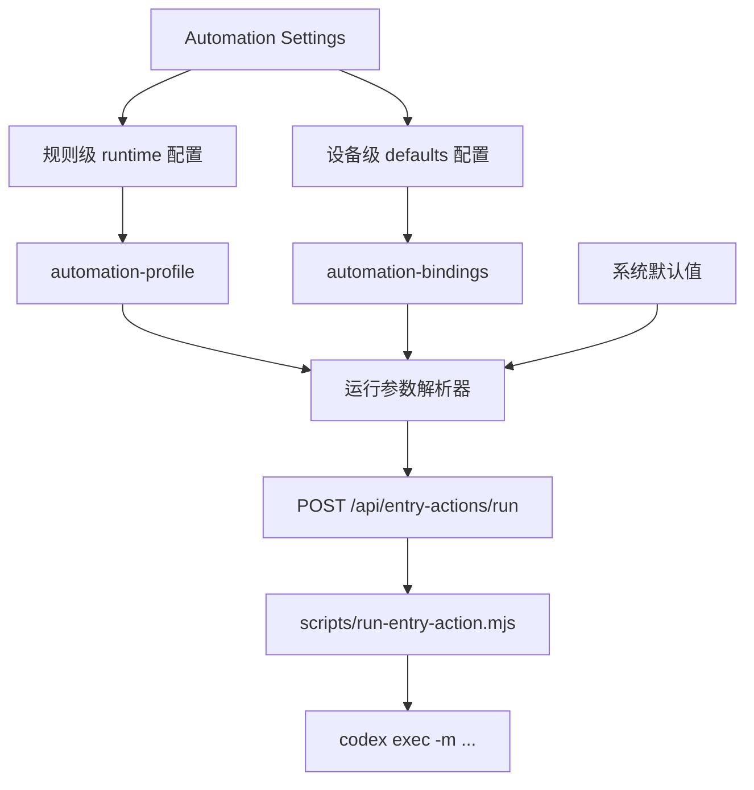

# Automation Settings 运行模型与推理配置方案

## 概述

### 1. 总体目标和范围

本方案的目标，是把 `Automation Settings` 中每条自动化规则的 Codex 运行参数，从当前隐式写死的默认行为，升级为“用户可配置、规则可覆盖、执行时可稳定解析”的正式能力。

本轮范围只覆盖以下内容：

- 自动化规则的 `model / timeoutMs` 正式配置模型
- `reasoning / verbosity` 的保留字段与后续下发预留
- 设备级默认运行参数的正式承载与覆盖优先级
- `Automation Settings` 中对应的设置入口与保存校验
- `run-entry-action` 执行链对运行参数的真实传递
- 默认值、失败兜底与验收边界

本轮不包含以下内容：

- 不把 `approval` / `sandbox` 做成用户可配置项
- 不做 provider 多实现扩展，仍然只支持当前 `codex` provider
- 不做复杂的模型能力探测、价格提示或实时配额感知
- 不做项目级共享运行参数
- 不做“每台机器自动同步全部本地绑定”的新基础设施

### 2. 各阶段任务概要

第一阶段：收敛配置真值与字段职责。  
主要工作是决定哪些参数属于“规则级配置”，哪些参数属于“设备级默认值”。预期成果是后续不再混淆 profile、binding 和运行时默认值的边界。

第二阶段：定义执行解析链。  
主要工作是把规则覆盖、设备默认和系统默认收敛成一条明确的优先级链。预期成果是任意一次自动化运行都能回答“这次到底用了什么模型和推理强度”。

第三阶段：补齐 `Automation Settings` 配置入口。  
主要工作是为规则编辑区和设备绑定区增加正式的运行参数配置控件。预期成果是用户可以显式配置，而不是依赖硬编码默认值。

第四阶段：补齐保存校验与执行链传递。  
主要工作是做字段合法性校验，并把解析后的参数真实传给 `codex exec`。预期成果是配置不只是显示在 UI 上，而是确实影响执行。

第五阶段：定义验收、默认值和不做项。  
主要工作是明确默认参数、失败兜底策略和本轮不处理的能力。预期成果是实现边界清晰，后续演进有稳定基线。

### 3. 整体结构框架



## 一、当前问题定义

### 1. 当前运行参数仍然是隐式默认

目前条目自动化虽然已经能跑通，但运行参数仍然主要依赖代码内默认值，用户无法正式配置：

- 模型默认写死在运行时实现里
- 超时时间没有正式配置入口
- 推理强度与输出详略虽然有产品需求，但当前 CLI 下发路径尚未正式收敛

这会导致两个直接问题：

- 用户知道“能跑”，但不知道“这次实际按什么规格在跑”
- 后续如果需要区分“便宜快速的补全类动作”和“更重推理的分析类动作”，当前结构仍缺正式执行面

### 2. 这些参数不能全部塞进本机 binding

如果把所有参数都只放在本机 binding 里，会带来一个结构问题：

- `skill` 的确是本机绑定问题，因为不同设备可能绑定不同 skill
- 但 `这条规则希望默认用什么模型 / 推理 / 输出密度` 更接近规则本身的产品语义

所以本方案不建议把所有运行参数都做成纯设备本地字段，否则规则本身会失去“我想怎样执行”的正式表达。

## 二、推荐方案

### 方案结论

**采用“规则级 runtime 覆盖 + 设备级 defaults 兜底 + 系统默认值保底”的三层模型。**

具体是：

- 每条自动化规则可选配置自己的 `runtime`
- 每台机器的 automation bindings 可配置一组 `defaults`
- 执行时按“规则 runtime > 设备 defaults > 系统默认值”的顺序解析

但本轮的正式落地范围要再收窄一层：

- `model` 与 `timeoutMs` 作为第一版正式生效字段
- `reasoning / verbosity` 只作为预留设计字段，不承诺本轮真实下发

这样做的原因是：

- 保留规则级语义，适合表达“这条动作本来就应该更快/更稳/更省”
- 保留设备级差异，适合处理不同用户、不同机器、不同 Codex 环境
- 不需要把高频变化项再塞回项目共享配置
- 对现有数据模型改动可控，不需要推翻整条自动化链路

## 三、配置层级与 source of truth

### 1. 规则级配置放在 `automation-profile`

推荐在每条 rule 上新增：

```json
{
  "id": "fill-data-name",
  "label": "补全名称",
  "icon": "streamlineMicroSolidOpenQuote",
  "enabled": true,
  "targets": {
    "items": [
      {
        "sourcePath": "data/skills.json",
        "collectionPath": "skills"
      }
    ]
  },
  "runtime": {
    "model": "gpt-5.4",
    "timeoutMs": 120000
  }
}
```

这里的职责是：

- `model`：这条规则希望默认用哪个模型
- `timeoutMs`：这条规则允许的最长等待时间

如果后续确认了 Codex CLI 对 `reasoning / verbosity` 的正式配置键，再增补：

- `reasoning`
- `verbosity`

### 2. 设备级默认值放在 `automation-bindings`

推荐把本机 binding 扩成以下结构：

```json
{
  "defaults": {
    "model": "gpt-5.4",
    "timeoutMs": 120000
  },
  "bindings": {
    "fill-data-name": {
      "provider": "codex",
      "skill": "fill-data-name",
      "enabled": true
    }
  }
}
```

这里的职责是：

- `bindings[ruleId]` 仍然只回答“这条规则在当前机器上绑定到哪个 skill”
- `defaults` 回答“如果规则自己没写 runtime，这台机器默认按什么规格跑”

这样能避免把本机 skill 绑定和全局默认运行参数混在同一个扁平对象里。

### 3. 系统默认值仍保留代码级保底

即使 profile 和 bindings 都没写，也必须存在一组稳定保底值：

- `model = gpt-5.4`
- `timeoutMs = 120000`

这组默认值的意义不是鼓励继续硬编码，而是确保旧数据、空配置和异常配置在第一时间仍可回退到稳定行为。

## 四、执行解析链

### 1. 优先级规则

执行某条自动化规则时，运行参数按以下顺序解析：

1. `rule.runtime.<field>`
2. `bindings.defaults.<field>`
3. 系统默认值

例如：

- 某条规则显式写了 `reasoning = high`，则无论设备默认是什么，都用 `high`
- 某条规则没写 `verbosity`，设备默认写了 `medium`，则用 `medium`
- 如果两边都没写 `timeoutMs`，则回退到 `120000`

在本轮落地里，可以先等价理解为：

1. `rule.runtime.model`
2. `bindings.defaults.model`
3. 系统默认 `model`

以及：

1. `rule.runtime.timeoutMs`
2. `bindings.defaults.timeoutMs`
3. 系统默认 `timeoutMs`

### 2. 推荐的解析结果结构

推荐在服务端收敛成一个统一对象：

```json
{
  "provider": "codex",
  "skill": "fill-data-name",
  "runtime": {
    "model": "gpt-5.4",
    "timeoutMs": 120000
  }
}
```

然后由 `POST /api/entry-actions/run` 把这份解析后的对象传给执行层，而不是让脚本自己再二次推断 profile 和 binding。

这样做的原因是：

- 真值只在服务端解析一次
- CLI 包装器职责更单纯
- 后续 UI 状态展示也能直接复用解析后的结果

这里需要补一个明确落地点：

- 这份 `runtime` 必须写入 handoff 文件
- `scripts/run-entry-action.mjs` 只消费 handoff 里已经解析好的 `runtime`
- 不再在执行脚本内部重新推断 `model`

## 五、前端配置入口

### 1. 规则编辑区增加 runtime 配置

在 `Automation Settings` 的单条规则详情里，建议在“基础信息”下新增一个“运行参数”分组，至少包含：

- 模型 `Model`
- 超时时间 `Timeout`

推荐交互：

- `Model` 第一版使用受控文本输入或有限白名单输入，不承诺动态模型 catalog
- `Timeout` 使用数字输入，单位毫秒

如果要在 UI 中提前暴露 `reasoning / verbosity`，也必须把它们明确标注为：

- 已预留
- 当前版本未正式下发到 Codex CLI

否则不建议本轮就把它们做成正式设置项。

### 2. 本机绑定区增加 defaults 配置

在本机绑定区域新增一个“本机默认运行参数”卡片，包含：

- 默认模型
- 默认超时时间

这样用户在新建规则时，不必每条都手动写全；只有确实需要特殊规格的规则，才做覆盖。

### 3. `approval / sandbox` 维持宿主固定策略

当前条目自动化执行链已经由 executor 固定传入：

- `--ignore-user-config`
- `--dangerously-bypass-approvals-and-sandbox`

另外，当前本机 `codex exec --help` 已能确认：

- 存在 `-m / --model`
- 存在 `-s / --sandbox`
- 存在 `--dangerously-bypass-approvals-and-sandbox`
- 不存在显式 `--reasoning` 或 `--verbosity`

这意味着当前自动化执行本来就是统一的 bypass 模式，而不是等待用户配置后才获得这项能力。

因此本轮的正式结论是：

- `approval / sandbox` 不进入 `automation-profile`
- `approval / sandbox` 不进入 `automation-bindings.defaults`
- UI 不新增这两个配置项
- 文档上明确把它们定义为当前 executor 的固定宿主策略

这样处理的原因是：

- 现在开放配置不会增加实际能力，只会增加一层伪可配复杂度
- 这两个开关更接近“执行宿主策略”，不是“规则语义”
- 当前最重要的是先把 `model / reasoning / verbosity / timeoutMs` 主链做实

如果未来要支持“受限执行”或“不同动作使用不同权限模式”，应单独开一轮执行权限模型方案，而不是混入当前运行参数配置轮次。

## 六、服务端与执行层改造

### 1. `automation-profile` 增加 runtime 校验与归一化

`src/automation-profile.mjs` 需要新增：

- `runtime` 对象校验
- `model / timeoutMs` 合法性判断
- 缺省字段自动补全或留空后续走解析链

### 2. `automation-bindings` 增加 defaults 校验与归一化

`src/automation-bindings.mjs` 需要新增：

- `defaults` 对象的 schema
- `model / timeoutMs` 的合法性校验
- 空配置时输出规范化对象

### 3. 服务端新增统一运行参数解析器

推荐在服务端新增一个明确的解析函数，例如：

- `resolveAutomationExecutionConfig(...)`

它负责：

- 读取 rule profile
- 读取 machine bindings
- 合并系统默认值
- 输出最终执行对象

不建议把这段优先级逻辑散落在 `server.mjs`、`codex-runtime.mjs` 和 `run-entry-action.mjs` 三处重复实现。

另外要明确一条 contract：

- `buildEntryActionHandoff()` 需要新增 `runtime`
- `handleRunEntryAction()` 在写 handoff 前完成最终解析
- 执行脚本不再把 `resolveCodexBindingStatus()` 当成 `model` 真值来源，只把它用于 CLI/skill 可用性校验

### 4. `run-entry-action.mjs` 真实消费运行参数

`scripts/run-entry-action.mjs` 需要从当前“只吃 model”的状态，扩成真实消费 handoff.runtime：

- `model`
- `timeoutMs`

其中：

- `model` 直接传给 `codex exec`
- `timeoutMs` 作为 Node 子进程的强制超时上限，而不只是前端提示时间

本轮必须把 `timeoutMs` 的执行面写死为：

- 超时计时开始于 `spawn` 成功后
- 到达 `timeoutMs` 后主动终止 Codex 子进程
- 结果文件写入明确 `reason = codex_exec_timeout`
- 前端状态映射到“执行超时”，而不是泛化成“执行失败”

如果当前 CLI 某个参数尚无正式开关：

- 第一版不要把它包装成“已正式生效能力”
- 应明确标记为预留字段或直接移出本轮范围

## 七、默认值与推荐档位

### 1. 推荐默认值

建议把第一版默认值固定为：

- 模型：`gpt-5.4`
- 超时：`120000`

推荐理由：

- `gpt-5.4` 作为当前默认主模型，适合继续做系统级保底
- `120000` 能覆盖多数技能执行，又不至于无限等待

### 2. 典型规则建议

对于偏轻量的字段补全类动作，推荐：

- 保持默认模型
- 使用较短超时

对于偏分析、审查、解释类动作，推荐：

- 保持默认模型或后续再单独指定模型
- 允许更长超时

如果未来补齐 `reasoning / verbosity` 的真实下发，再单独补充这部分推荐矩阵。

## 八、校验与错误模型

### 1. 保存时校验

保存 `automation-profile` / `automation-bindings` 时至少校验：

- `model` 非空且在允许集合内
- `timeoutMs` 必须为正整数，且在合理区间内

### 2. 执行时校验

执行前至少再校验：

- 绑定 provider 是否可执行
- skill 是否仍然存在
- 解析后的 runtime 是否完整
- 当前 CLI 是否接受本轮需要下发的参数

如果某个参数不被当前 CLI 支持，推荐行为是：

- 不把它列入第一版正式生效参数
- 或在实现前先补齐明确的 CLI config key 证据

## 九、验收标准

完成后应满足以下验收点：

1. `Automation Settings` 中可以正式配置规则级运行参数。
2. 本机设置中可以正式配置默认运行参数。
3. 服务端能按“规则 > 本机默认 > 系统默认”解析最终执行配置。
4. 点击详情面板自动化按钮时，执行链会真实消费 handoff 中解析后的配置。
5. 至少能在运行记录、日志或状态对象中看到本次实际使用的 `model / timeoutMs`。
6. 缺省配置、空配置和旧配置都能稳定回退到系统默认值。

## 十、不做项与后续扩展

本轮明确不做：

- 不做模型价格、token 成本或配额可视化
- 不做自动推荐“某条规则应该用哪个模型”
- 不做按 skill 自动推断默认推理档位
- 不做跨 provider 抽象层
- 不做用户自定义任意 CLI 参数注入
- 不做 `approval / sandbox` 用户配置化
- 不把 `reasoning / verbosity` 伪装成当前已正式生效的 CLI 能力

后续如果继续扩展，建议优先顺序是：

1. 在运行状态中显示“本次实际解析出的运行参数”
2. 增加“测试这条规则当前配置”的单独入口
3. 再评估是否需要开放更细的模型能力配置

## 结论

推荐把 Codex 自动化的运行配置正式收敛为三层模型：

- 规则级 `runtime`
- 本机级 `defaults`
- 系统级保底默认值

这样既能保留“这条规则本来想怎么跑”的产品语义，也能处理“不同设备绑定不同 Codex 环境”的现实差异。至于 `approval / sandbox`，当前应明确视为 executor 固定宿主策略，而不是用户配置项。基于当前 CLI 的真实参数面，第一版应先把 `model + timeoutMs` 这条主链做实，并把 `runtime` 真值前移到服务端 handoff；如果未来确认了 `reasoning / verbosity` 的正式配置键，再单独补齐这两项。
