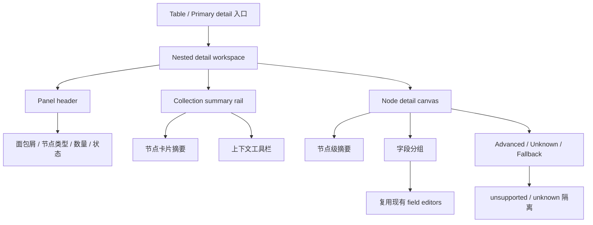

# nested 编辑界面设计与交互体验优化方案

## 方案概述

### 总体目标和范围

本方案用于把当前右侧 `nested detail` 从“已经能编辑，但整体像调试面板/半成品”的状态，升级为一套结构清晰、语义完整、可持续扩展的节点编辑工作区。目标不是重写第二套编辑器，也不是单纯做一轮 CSS 美化，而是在现有 `DetailPanel + nestedStack + NodeEditorHost + schema registry` 边界内，系统收口以下问题：

- 节点列表看起来像样本值碎片，而不是可理解的节点摘要
- 操作按钮裸露堆放，缺少层级与风险区分
- 节点详情区只有字段堆叠，没有信息分组和阅读节奏
- 多态节点、未知字段、fallback 结构都以工程实现视角暴露给用户
- 空值提示、默认值、已填写状态、脏状态等反馈不构成稳定体验

本方案范围包括：

- 右侧 `nested detail` 的信息架构
- collection 节点列表区和 object 节点详情区的交互重组
- 节点摘要、节点操作、节点状态反馈、空态/placeholder、fallback 呈现
- 多态节点切换和 unknown fields 的设计收口
- 面向 `classes`、`traits`、`runes`、`skills` 等数据形态的摘要与分组策略

本方案不包括：

- 不新增独立弹窗式 nested 编辑器
- 不重做顶层 primary detail 的全部字段系统
- 不做任意 JSON 自由编辑器
- 不在本轮引入全局撤销/重做、批量编辑、流程图式节点编排

### 各阶段任务概要

第一阶段：收口信息架构和面板骨架。  
主要工作是重定义右侧 nested 面板的区块职责，把当前“标题 + 列表 + 一串按钮 + 一串字段”的平铺结构，改成稳定的 master-detail 工作区。预期成果是面板不再像把内部状态直接摊给用户。

第二阶段：重做 collection 节点列表摘要与操作区。  
主要工作是把数组项从“显示首个值和字段名碎片”升级为“节点类型 + 节点标题 + 关键信息 + 状态”的摘要卡片，并把新增/复制/移动/删除动作从裸按钮收口成上下文工具栏。预期成果是 `skills.nodes[]`、`traits.effects[]`、`runes.effects[]` 这类列表可读、可选、可管。

第三阶段：重做节点详情区的阅读和编辑节奏。  
主要工作是把 object 节点详情从连续字段堆叠改成分组式编辑区，补齐节点级说明、字段分区、默认值恢复、unknown fields 折叠区和多态切换入口。预期成果是用户进入节点后能快速理解“这是哪类节点、该先看哪里、异常字段在哪”。

第四阶段：统一空态、placeholder、fallback 和状态反馈。  
主要工作是压低提示文字干扰、区分未填写与异常、把 unsupported/unknown 信息从主编辑流中隔离出来，并明确 autosave/dirty/reset 的反馈位置。预期成果是界面既不空，也不吵。

第五阶段：按真实数据类型补摘要模板和验证矩阵。  
主要工作是为 `starting_equipments`、`targeting`、`damage`、`effect_spec`、`value_model` 等高频节点建立摘要与分组模板，并补齐对应回归。预期成果是方案不是抽象设计，而是能真实落到当前主要数据文件。

执行顺序为：信息架构 -> 列表摘要与操作 -> 详情分组 -> 空态与 fallback -> 数据类型模板与验证。

### 整体结构框架

---

## 现状判断

### 1. 当前问题不是“功能没做”，而是“体验层没有收口”

从当前实现看，右侧 nested 编辑主路径已经切到 `DetailPanel + NodeEditorHost`，并且 schema-driven 编辑、默认值恢复、多态切换、数组基础操作都已经存在。问题不在于“没有能力”，而在于这些能力还是以工程组件拼装状态直接暴露出来，所以界面看上去像：

- 一层通用容器
- 一组临时摘要卡片
- 一排调试动作按钮
- 一串原样字段表单
- 最后再附带 `unsupported_fields` 这类内部实现痕迹

这就是“可用但像半成品”的根因。

### 2. 当前 collection 节点列表摘要太弱

从截图看，列表项只显示：

- 一行主值，如 `circle`、`0.9`
- 一行字段名拼接，如 `area_shape / area_size / range_type`

这有几个直接问题：

- 它不是“节点标题”，只是某个偶然字段值
- 不同类型节点的摘要逻辑不稳定，用户无法预期
- 字段名拼接更像开发调试提示，不像产品化摘要
- 看不出该节点属于哪种类型、是否完整、是否异常

结果是列表区承担不了“快速扫描 + 快速定位 + 快速切换”的职责。

### 3. 操作区像临时按钮堆

当前 `Add item / Duplicate / Move up / Move down / Delete` 直接作为一组裸按钮平铺在列表下方。这会带来：

- 操作与当前选中项的关系不够明确
- 危险动作和普通动作没有层级
- 列表区视觉重心被按钮区打断
- 在没有选中项时，哪些动作可用、为什么不可用，并不直观

这类布局更像“内部工具已接线”，不像稳定产品界面。

### 4. 节点详情区只有字段，没有节点语义

以 `skills.targeting` 为例，当前进入详情后，用户虽然能看到 `range_type / area_shape / target_alignment` 等字段，但整个区块缺少：

- 这个节点是什么类型、承担什么职责
- 当前节点已填写程度如何
- 字段应该按什么顺序理解
- 哪些字段是基础配置，哪些字段是条件性字段，哪些字段是高级/异常信息

结果就是详情区像一段按 schema 顺序展开的字段清单，而不是“一个节点的编辑界面”。

### 5. unknown / fallback 直接打穿主编辑流

当前 `unsupported_fields` 直接显示原始 JSON，虽然技术上诚实，但产品上太粗糙：

- 它混在主字段流里，像普通字段一样出现
- `type` 这种已经被用来做 schema 分流的字段，还可能作为 unknown 再暴露一次
- 用户会把它理解成“系统没做好”，而不是“高级扩展区”

这类信息需要保留，但不应该用当前这么裸的方式进入主阅读流。

### 6. 空值、placeholder、已填写状态仍然缺少一致语义

虽然已经有 schema placeholder 和 `x/y 已填写`，但当前仍有几个问题：

- placeholder 更像字段默认文案，不像系统空态语义
- 已填写计数只出现在 node summary，缺少字段组级反馈
- 未填写、未装备、未知、异常、只读 fallback 之间的视觉层级还不够清楚

这会削弱用户对“当前节点完整度”的判断。

---

## 目标体验

### 1. 从“嵌套值编辑”升级为“节点工作区”

优化后的 nested 面板应该让用户感知到自己在做三件事：

1. 在一个节点集合中选择当前节点
2. 在一个已命名、已分型的节点中编辑核心配置
3. 在必要时查看高级信息、unknown 信息或 fallback 信息

而不是“打开了一坨 JSON 结构的局部表单”。

### 2. 面板必须同时满足三个使用模式

- 扫描模式：快速浏览多个数组项，判断哪个要改
- 编辑模式：进入某个节点后，连续修改几个关键字段
- 排障模式：发现 unknown/fallback/异常时，有地方看，但不打扰主流程

当前最大问题是这三种模式混在一条平铺流里，没有区分。

### 3. 统一原则

- 继续复用右侧 `DetailPanel`，不另起第二套编辑器
- 继续以 `nestedStack` 作为导航真值
- 继续以 schema registry + `NodeEditorHost` 作为内容真值
- 设计优化优先改信息架构和交互语义，再改样式细节
- unknown/fallback 不隐藏，但必须降级到次要层

---

## 设计方案

## 1. 面板骨架重组

### 1.1 Header 从“通用标题栏”升级为节点工作区头部

当前 header 只有：

- `Nested detail`
- 标题
- 数量/fields
- 返回/关闭

建议升级为：

- 第一行：面包屑或来源链路
  - 例如：`skills > nodes > item 1`
- 第二行：节点标题 + 节点类型 badge + 状态 badge
  - 例如：`Targeting Node` + `targeting`
- 第三行：辅助信息
  - `6/7 已填写`
  - `Autosave`
  - `Unknown fields 1`

这样 header 承担“你现在在哪、这是什么节点、当前状态怎样”的职责。

### 1.2 Collection 模式采用稳定的 master-detail 分区

当 nested 值是 array 时，右侧二级面板建议固定拆成两区：

- 上半区/左侧窄区：节点列表 rail
- 下半区/右侧主区：当前选中节点详情

在当前单栏右侧面板中，不一定真的做左右分栏，也可以保持竖向，但语义上必须清晰分成：

- 列表浏览层
- 当前节点编辑层

不能继续让按钮区夹在两者中间，造成“列表还没结束，表单已经开始”的阅读断裂。

这里要补一条实施约束：

- 默认优先做“单栏里的 master-detail 语义分区”，不是立刻强制做真实双栏
- 只有当 secondary panel 宽度达到可读阈值时，才允许切换为左右双栏
- 在窄宽度下继续保持纵向结构，但列表区、工具栏、详情区必须是三个清晰区块

这样可以避免在当前右侧窄面板里为了追求双栏而进一步压缩可读性。

### 1.3 Header 和状态信息必须绑定到现有真值，不在 UI 层临时造状态

后续 header 里想展示的信息，必须先映射到当前已有运行时真值，不能在组件层随意拼接临时状态。建议固定映射如下：

- breadcrumb / 来源链路
  - 来自 `nestedStack` 当前 entry 的 `rootField + path + selectedIndex`
- 当前节点标题
  - 来自当前 `title` 或 summary builder 产出的显示标题
- 节点类型 badge
  - 来自当前 schema 的 title/discriminator，不从随机字段值猜
- `x/y 已填写`
  - 来自 `NodeEditorHost` 基于 schema fields 计算的 filled count
- unknown 数量
  - 来自 supported node 中 `unknownFieldNames.length`
- fallback 状态
  - 来自 resolver `unsupported` 结果，不和 supported node 的 unknown 混用
- autosave / dirty 提示
  - 继续复用全局保存真值，不在 nested 内新建第二套保存状态机

如果后续某个体验字段找不到明确真值来源，应先补底层 contract，再补 UI，不接受直接在视图层拼装“看起来像状态”的假信息。

## 2. Collection 节点列表区重做

### 2.1 列表项从“值碎片”升级为“节点卡片”

每个数组项卡片建议固定为四层信息：

- 第一层：节点类型或主标题
  - `targeting`
  - `damage`
  - `apply_buff`
- 第二层：关键摘要
  - `self -> area(circle, 2) -> enemy`
  - `0.9 AD ratio · physical`
- 第三层：状态信息
  - `6/7 已填写`
  - `1 unknown`
  - `只读 fallback`
- 第四层：弱化元信息
  - `item 1`
  - `递归子节点`

原则是：摘要必须可扫描、可比较、可区分，而不是把几个字段名拼起来。

### 2.2 摘要逻辑必须可模板化

不同数据形态建议用摘要模板，而不是同一套机械规则：

- `skills.targeting`
  - 主标题：`targeting`
  - 关键摘要：`self · area(circle 2) · enemy`
- `skills.damage`
  - 主标题：`damage`
  - 关键摘要：`0.9 AD ratio · physical`
- `classes.starting_equipments`
  - 主标题：`starting_equipments`
  - 关键摘要：`main/off/chest 已配置 3/8`
- `runes.effect.params`
  - 主标题：参数节点类型
  - 关键摘要：最关键 2-3 个业务字段

这部分建议落成 `node summary builder`，由 schema/节点类型驱动。

这里需要明确做成两层真值：

- 通用 summary contract
  - 任何节点至少能给出 `title / subtitle / status / meta`
- dataset-specific summary template
  - 只对高频节点提供额外模板，如 `skills.targeting`、`damage`、`starting_equipments`

这样后续不会为每个数据文件单独硬编码一套摘要逻辑，而是先有统一 contract，再允许局部增强。

### 2.3 列表选中态必须更强

当前卡片选中态不够像“正在编辑的节点”。建议补：

- 更明显的边框或浅底色
- 左侧强调条或节点类型色条
- 当前项右上角小状态位
- 键盘焦点态和 hover 态分开

目标是让用户一眼知道“我现在正在改哪一项”。

## 3. 节点操作区重做

### 3.1 不再用裸按钮堆平铺

建议把当前五个动作拆成：

- 主动作：
  - `新增节点`
- 上下文动作：
  - `复制`
  - `上移`
  - `下移`
- 危险动作：
  - `删除`

布局建议：

- 放在列表区标题旁或列表区底部工具栏
- 没有选中项时，仅保留 `新增节点`
- 有选中项时，显示上下文工具栏

### 3.2 危险动作显式降噪但清晰

`Delete` 不应再和 `Move up` 同级同色。建议：

- 删除使用弱 danger 视觉
- 删除前显示节点标题
  - 如 `删除 targeting 节点`
- 对复杂节点可加入轻确认
  - 文案级确认即可，不必上重弹窗

### 3.3 操作反馈靠近动作源

新增、复制、移动后，建议立即反馈到列表区：

- 新增后自动选中新项并聚焦详情
- 复制后列表中出现“副本”短暂高亮
- 移动后保留选中态，不让用户丢失位置

## 4. 节点详情区重做

### 4.1 增加节点级摘要卡，而不只是字段列表

当前 `schema.title + x/y 已填写` 已经有雏形，但仍太薄。建议节点详情区顶部固定保留一个节点摘要卡，内容包括：

- 节点显示名
- 节点类型
- 已填写度
- unknown 数量
- 默认值恢复入口

这样用户进入详情后先读“节点状态”，再读字段。

### 4.2 字段必须按语义分组，不再全部平铺

以 `skills.targeting` 为例，建议拆成：

- 基础目标
  - `range_type`
  - `range_value`
  - `target_type`
- 区域形态
  - `area_shape`
  - `area_size`
- 目标限制
  - `target_count`
  - `target_alignment`
- 高级信息
  - `unknown fields`

同理：

- `starting_equipments`
  - 武器位
  - 防具位
  - 饰品位
- `value_model`
  - 数值范围
  - 修正规则
  - 关联 keyword

这样用户不需要按 schema 原始顺序理解结构。

但这里不能只停留在设计描述，必须补一条实现边界：

- 字段分组不能在 `DetailPanel` 或 `NodeEditorHost` 里按 `fieldName` 临时写死
- 分组真值应进入 schema/presentation metadata 层
- 最低要求是为节点补一层显式元数据，例如：
  - `sections`
  - `summaryFields`
  - `advancedFields`
  - `defaultCollapsedSections`

也就是说，后续实现允许新增 `node presentation metadata`，但不接受重新回到组件里散落 `if fieldName === ...` 的写法。

### 4.3 多态节点切换不要再像普通下拉框

当前 discriminator 是普通 `select`，这在功能上可用，但体验上太弱。建议：

- 对少量类型，用 segmented tabs / chip switch
- 对大量类型，用带说明的选择器
- 切换区块旁明确提示：
  - `切换类型将按目标 schema 重建当前节点`

重点不是控件样式本身，而是把“切换节点类型”提升为节点级动作，而不是普通字段编辑。

### 4.4 unknown fields 与 raw JSON 进入折叠式高级区

建议把当前 `unsupported_fields` 改成：

- `高级信息`
  - `Unknown fields (1)`
  - 默认折叠
- 展开后才显示原始 JSON 或 key/value

这样可以保留工程真实信息，但不让它污染主编辑流。

这里要进一步区分两类不同语义，避免后续被错误合并：

- supported node 内的 unknown fields
  - 当前节点已命中 schema
  - 主编辑流仍然有效
  - 只是存在未被 schema 覆盖的字段
  - 应进入折叠式高级区
- unsupported node fallback
  - 当前整个节点未命中 supported schema
  - 不进入正式字段编辑流
  - 应显示说明卡 + 只读结构预览

这两类都属于“次要层信息”，但不是同一个状态，不应共用同一套文案或同一个区块模型。

## 5. 空态、placeholder 与默认值反馈

### 5.1 空值提示必须轻，但要有语义

当前 placeholder 已经可以继续沿“更轻”方向收口，但还应进一步区分：

- 普通未填写
  - `未填写`
- 业务空槽位
  - `未装备副手`
- 可选字段未启用
  - `按当前类型可留空`

不要所有空态都只靠输入框 placeholder 承担。必要时可在字段分组或节点摘要中补整体提示。

### 5.2 已填写度不仅在节点顶部出现

建议增加组级完成度，至少在复杂节点中体现：

- `基础目标 3/3`
- `区域形态 2/2`
- `目标限制 1/2`

这比用户逐项扫空白框高效得多。

### 5.3 默认值恢复需要更明确的影响范围

当前恢复默认值按钮在 header 中较隐蔽。建议：

- 节点级 reset 继续保留在 header
- 文案或 tooltip 明确是“恢复当前节点默认值”
- 若有字段组级 reset，可只在复杂节点后续阶段引入

同时补一条保存状态边界：

- nested 详情内可以显示“当前节点已修改”这类局部提示
- 但不能在 nested 面板里自建第二套“已保存/未保存/保存中”状态机
- 全局保存真值仍以现有 dirty/autosave 链为准

否则会出现“节点显示已保存，但全局仍未保存”的伪一致性问题。

## 6. Unsupported / fallback 体验重做

### 6.1 unsupported 不是失败页，而是受控高级态

当前直接显示 `Unsupported nested structure.` + raw JSON，产品感太弱。建议改成：

- 标题：`当前结构暂未进入节点编辑器`
- 说明：
  - 这是未注册 schema 的复杂结构
  - 当前可只读查看
- 主区：
  - 更可读的 JSON 预览
- 辅助动作：
  - `复制 JSON`
  - `展开全部`

这样仍保持真实性，但不让用户感觉界面“断掉”。

### 6.2 fallback 需要和正式节点主路径视觉区分

正式节点编辑和 fallback 应有明显视觉差异：

- 正式节点：字段分组、摘要卡、可编辑输入
- fallback：说明卡 + 只读代码块

避免用户误以为“这里也是完整编辑，只是看起来丑一点”。

## 7. 针对当前主要数据文件的专项策略

### 7.1 `classes`

- `starting_equipments`
  - 分为武器/防具/饰品三组
  - 顶部显示 `已配置 2/8`
  - 空槽允许留空，但用更轻的槽位语义提示
- `starting_stats` / `stat_growth`
  - 以数值组方式呈现
  - 可突出“角色基础属性”和“成长属性”

### 7.2 `runes` / `traits`

- `effects[]`
  - 列表摘要必须以 effect type 为主
  - 次级摘要显示关键参数
- `params`
  - 顶部显示继承的 effect context
  - 不再让用户看到“这只是普通 object”

### 7.3 `skills`

- `nodes[]`
  - 这是当前最需要重做摘要和分组的区域
  - 列表项必须体现节点类型，而不是某个随机字段值
- 对 `targeting`、`damage`、`condition` 等常见节点建立专门摘要模板
- 递归节点要用层级感或弱缩进提示“这是子节点”

---

## 推荐执行路线

## 1. 第一轮先改结构，不先追视觉细节

优先顺序建议：

1. 重做 collection 列表卡片摘要模型
2. 重做操作区层级
3. 重做详情区字段分组与 unknown 区
4. 再补更完整的视觉细节

原因是当前最大问题不是配色，而是结构和职责混乱。

## 2. 第二轮补节点模板

在骨架稳定后，再针对高频节点补摘要模板和字段组模板：

- `skills.targeting`
- `skills.damage`
- `classes.starting_equipments`
- `runes.effect.params`
- `value_model`

这样可以避免先做一堆模板，最后骨架又变。

## 3. 第三轮再补高级体验

包括但不限于：

- 更强的键盘导航
- 组级完成度
- 更丰富的 tooltip / 描述文案
- fallback 区的复制/展开辅助动作

---

## 验收标准

当以下条件同时成立时，可以认为 nested 编辑界面不再像半成品：

1. 数组项列表能稳定显示“节点类型 + 节点摘要 + 状态”，不再显示随机值碎片。
2. 新增/复制/移动/删除动作具有明确上下文，不再是一排裸按钮。
3. 进入节点后，用户能先看到节点级摘要，再看到按语义分组的字段区。
4. 多态节点切换被明确表达为节点级动作，而不是普通字段下拉框。
5. unknown fields / fallback 信息仍可见，但已退出主编辑流。
6. 空值、placeholder、已填写度和默认值恢复形成一致的状态语义。
7. 整套优化仍建立在既有 `DetailPanel + nestedStack + NodeEditorHost + schema registry` 上，没有产生第二套编辑器。

---

## 非目标与风险提醒

- 本方案不是在当前界面上继续“补几个按钮和颜色”，而是一次信息架构收口。
- 如果只做视觉润色，不改列表摘要、操作层级和详情分组，界面仍会像半成品。
- 如果把 unknown/fallback 直接隐藏，会损失调试和排障能力；正确做法是降级到高级区，而不是删除。
- 如果为了解决体验问题新建第二套 nested 编辑器，会直接破坏当前已收口的架构边界，不建议走这条路线。

---

## 建议的后续实现拆分

若你认可这份方案，下一轮实现建议直接拆成三批：

1. `collection rail + action toolbar + item summary builder`
2. `node detail sections + unknown/fallback advanced area`
3. `dataset-specific summary/group templates + targeted regression`

这样推进，能最快把“半成品感”压下去，而且不会又回到全量大改。
