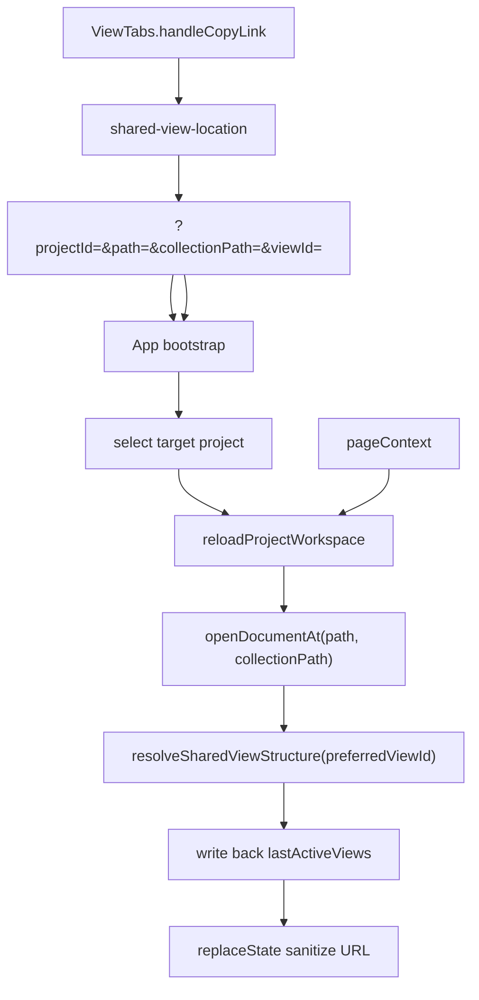

# 可定位真实视图的拷贝视图链接执行方案

## 方案概述

### 总体目标和范围

本方案用于把 [2026-07-09-可定位真实视图的拷贝视图链接方案.md](/C:/Code/data-editor/docs/plans/2026-07-09-%E5%8F%AF%E5%AE%9A%E4%BD%8D%E7%9C%9F%E5%AE%9E%E8%A7%86%E5%9B%BE%E7%9A%84%E6%8B%B7%E8%B4%9D%E8%A7%86%E5%9B%BE%E9%93%BE%E6%8E%A5%E6%96%B9%E6%A1%88.md) 落成第一轮可执行实现。

目标不是继续保留“复制一个 `#view=<id>` 但没有消费方的伪链接”，而是正式建立一条从“生成分享 URL”到“浏览器直接输入地址后恢复到真实 project / file / collection / shared view”的完整链路。

本轮交付目标是：

- “拷贝视图链接”生成的 URL 显式包含 `projectId + path + collectionPath + viewId`
- 应用初始化时先按 URL 恢复目标项目，再恢复目标文件与 collection
- shared view 解析支持 `preferredViewId`，并可正确展开组内目标视图
- URL 命中有效 view 后，回写 `lastActiveViews`，把外部真相收敛回现有状态体系
- URL 无效时走受控回退并用 `history.replaceState` 清理脏参数
- 为协议、恢复链路和多项目直达补齐自动化测试

本轮范围包括：

- 共享视图链接 URL 协议与 helper
- `ViewTabs` 复制逻辑改造
- `App.tsx` 初始化恢复与 URL 清理
- `shared-view-structure` 的 `preferredViewId` 接入
- 单测、结构测试、Playwright e2e

本轮不包括：

- 不把滚动、query、filter/sort 草稿写进分享链接
- 不引入完整前端路由框架
- 不扩展为浏览历史管理系统
- 不做旧 hash 协议的长期兼容保留

### 各阶段任务概要

第一阶段：固定 URL 协议与 helper。  
主要工作是新增统一的视图链接 helper，定义 `projectId + path + collectionPath + viewId` 的构造、解析、清理和重写规则。预期成果是“写链接”和“读链接”先收敛到单点真相。

第二阶段：改造复制链路。  
主要工作是让 `ViewTabs` 从上游拿到 `activeProjectId`、`selectedPath`、`collectionPath`，并通过 helper 生成完整 URL。预期成果是剪贴板内容不再是无效 hash，而是完整分享地址。

第三阶段：接入初始化恢复。  
主要工作是在 `App.tsx` 中先消费 URL 的 `projectId`，再在项目工作区加载后优先消费 `path`、`collectionPath`、`viewId`。预期成果是“把地址直接输进浏览器”会优先以 URL 为真相，而不是本机 page context。

第四阶段：接入 shared view 解析与状态回写。  
主要工作是给 `resolveSharedViewStructure(...)` 接入 `preferredViewId`，并在 URL 命中有效视图后回写 `lastActiveViews`。预期成果是视图组展开与现有状态体系保持一致，不出现临时显示态和草稿态分叉。

第五阶段：补回退与验证。  
主要工作是补齐 `projectId / path / collectionPath / viewId` 失效分支、URL 清理策略，以及纯函数测试和多项目 Playwright e2e。预期成果是坏链接安全回退、好链接可稳定直达。

执行顺序固定为：URL helper -> 复制链路 -> 初始化恢复 -> shared view 解析与回写 -> 回退与测试。

### 整体结构框架



---

## 执行前固定约束

### 链接真相边界

本轮必须把 URL 固定为“外部分享真相”，而不是“本机状态提示”：

- 有 URL 时，入口恢复必须优先使用 URL
- 无 URL 时，继续沿用现有 `pageContext`
- URL 只携带定位真相，不携带本机瞬时 UI 状态

### 最小参数集固定

本轮分享链接固定只承载以下字段：

- `projectId`
- `path`
- `collectionPath`
- `viewId`

禁止扩展以下字段进入 URL：

- `scrollTop`
- `scrollLeft`
- query 输入值
- filter / sort 草稿
- detail panel 选中行
- `groupId`

### 清理策略固定

恢复链路完成后，URL 清理或重写必须使用 `history.replaceState`，不能用 `pushState` 制造额外历史层级。

同时必须把 URL 失效判定集中收口为单一恢复结果对象，例如：

- `invalidProjectId`
- `invalidPath`
- `invalidCollectionPath`
- `invalidViewId`

禁止在多个 effect 或多个局部分支里各自直接调用 `replaceState`。最终 URL 清理只能在恢复主链的单一出口执行一次。

### 状态收敛固定

当 URL 命中有效 `viewId` 后，本轮必须同步回写当前 collection 的 `lastActiveViews`。

原因不是“顺手同步”，而是必须让外部真相收敛回现有 shared view 状态体系，避免后续 render、保存、切换时出现状态分叉。

如果目标视图位于分组内，还必须同步更新与正常点击视图等价的分组 page context：

- `expandedGroupId`
- `lastActiveViewIdByGroupId`

也就是说，URL 恢复成功后的状态收敛目标，不是“看起来切到了目标视图”，而是“等价于用户手动点击了该视图”。

### 兼容边界固定

项目处于早期阶段，本轮不做旧 hash 协议的长期兼容层。可以接受短期读取一次旧 `#view=` 做平滑迁移，但最终正式真相只保留 query 协议。

### 项目切换链固定

当 URL 中的 `projectId` 与当前激活项目不一致时，必须复用现有正式项目切换链：

- `activateProject(projectId)`
- `setActiveProjectId(projectId)`

禁止把裸 `setActiveProjectId(...)` 当作正式切项目方案，否则 registry 真相和本地 React state 可能分叉。

---

## 现状与实现切入点

### 当前生成侧

- [src/components/ViewTabs.tsx](/C:/Code/data-editor/src/components/ViewTabs.tsx)
  - `handleCopyLink(view)` 当前只做：
    - `const url = new URL(window.location.href)`
    - `url.hash = \`view=${encodeURIComponent(view.id)}\``
    - `navigator.clipboard.writeText(url.toString())`

结论：

- 当前复制链路没有 `projectId`
- 没有 `path`
- 没有 `collectionPath`
- 生成的是没有消费方的 hash

### 当前恢复侧

- [src/App.tsx](/C:/Code/data-editor/src/App.tsx)
  - 工作区初始化通过 `reloadProjectWorkspace(activeProjectId, ...)` 读取文件、配置、profile、page context
  - 默认文件选择依赖 `pageContext.selectedPath` 与 sidebar fallback
- [src/page-context-storage.ts](/C:/Code/data-editor/src/page-context-storage.ts)
  - 只负责 `localStorage` 的 `pageContext`
- [src/view/shared-view-structure.mjs](/C:/Code/data-editor/src/view/shared-view-structure.mjs)
  - 活动视图默认基于 `lastActiveViews ?? defaultViewId ?? firstView`

结论：

- 当前没有任何 URL 恢复入口
- 当前没有 `preferredViewId` 接口
- 当前没有“恢复成功后回写 `lastActiveViews`”的链路

---

## 文件级执行清单

### `src/shared-view-location.mjs`（新增）

目标：

- 成为视图分享链接的单一协议层
- 提供构造、解析、清理、重写能力

建议导出：

```ts
export type SharedViewUrlLocation = {
  projectId: string | null;
  path: string | null;
  collectionPath: string | null;
  viewId: string | null;
};

export function readSharedViewUrlLocation(input: Location | URL): SharedViewUrlLocation;
export function buildSharedViewUrl(currentUrl: string, input: {
  projectId: string;
  path: string;
  collectionPath: string;
  viewId: string;
}): string;
export function writeSharedViewUrlLocation(url: URL, location: SharedViewUrlLocation): URL;
export function clearSharedViewUrlLocation(url: URL): URL;
```

约束：

- helper 只处理 URL 协议，不读取项目数据，不依赖 React 状态
- `collectionPath` 缺省时要规范化为 `$`
- 允许部分字段为空，以支持“失效后重写”

### `src/components/ViewTabs.tsx`

目标：

- 从上游接收 URL 所需完整上下文
- 改用 helper 生成分享地址

需要新增的 props：

- `activeProjectId: string | null`
- `selectedPath: string | null`
- `collectionPath: string`

需要改的点：

- `handleCopyLink(view)` 在缺失 `activeProjectId / selectedPath / collectionPath / navigator.clipboard` 时直接返回
- 构造完整 URL，而不是写 hash
- 保持菜单行为不变：复制完成后关闭菜单

约束：

- 不要在这里做 URL 参数合法性判断之外的业务恢复逻辑
- 不要在这里直接改 `window.history`

### `src/App.tsx`

目标：

- 接管 URL 驱动的恢复总流程
- 先切 project，再开文件，再定 collection/view，再清理 URL

建议新增的内部结构：

1. URL 读取函数
   - 在应用启动阶段读取一次当前 URL
2. URL 恢复态
   - 例如 `pendingSharedViewUrlLocation`
   - 负责在项目切换、工作区加载、文档打开期间暂存待消费 URL 真相
3. URL 恢复结果对象
   - 例如 `urlResolutionResult`
   - 统一记录 `invalidProjectId / invalidPath / invalidCollectionPath / invalidViewId`
3. 恢复完成后的 URL 清理函数
   - 统一走 `history.replaceState`

建议切入点：

- `listProjects()` 完成并得到 registry 后
  - 如果 URL 中 `projectId` 有效且不等于当前 `activeProjectId`，先走正式项目激活链，而不是只写本地 state
- `reloadProjectWorkspace(projectId, ...)` 中
  - 工作区加载完成后，优先用 URL 中的 `path`
  - 找不到时再回落到 `pageContext.selectedPath`
- `openDocumentAt(...)` 完成文档打开后
  - 如果 URL 中 `collectionPath` 有效，则以该 collection 为准
  - 若无效则回到文档默认 collection
- `resolvedCollectionViews` 求值前
  - 把 URL 中的 `viewId` 作为 `preferredViewId` 参与 shared view 解析
- URL 命中有效视图后
  - 通过现有 `updateSharedViewDraftState(...)` 把结果回写到 `lastActiveViews`
  - 如果命中的是组内视图，同时同步 `updatePageContextViewGrouping(...)`
- 恢复主链收尾处
  - 根据 `urlResolutionResult` 统一执行一次 URL 清理 / 重写

约束：

- 项目切换和 URL 恢复不能互相循环触发
- URL 恢复值只能消费一次，消费成功后要清空 pending 状态
- 不能让普通 rerender 再次把已消费 URL 当成新真相重放
- 不能在 `reloadProjectWorkspace(...)`、`openDocumentAt(...)`、shared view 解析分支里各自直接清 URL

### `src/view/shared-view-structure.mjs`

目标：

- 接入 `preferredViewId`
- 保持 active view 解析仍只有一个正式入口

建议修改：

```ts
resolveSharedViewStructure({
  sharedViewsConfig,
  collectionKey,
  draftState,
  pageContext,
  preferredViewId,
})
```

求值顺序固定为：

```text
preferredViewId
?? draftState.lastActiveViews[collectionKey]
?? collection.defaultViewId
?? flattenedViews[0]
```

约束：

- `preferredViewId` 只有在当前 collection 下真实存在时才生效
- `expandedGroupId` 仍然只从最终命中的 `activeViewId` 反推
- 不引入 `groupId` 作为第二真相

### `tests/shared-view-location.test.mjs`（新增）

目标：

- 覆盖 URL helper 的协议正确性

至少覆盖：

- 构造完整 URL
- 解析完整 URL
- 缺失字段时返回空值 / 默认值
- 清理 URL 后参数被移除
- 重写 URL 时只保留当前正式协议字段

### `tests/view-state.test.mjs`

目标：

- 覆盖 `preferredViewId` 优先级与回退逻辑

至少覆盖：

- `preferredViewId` 命中时优先于 `lastActiveViews`
- `preferredViewId` 无效时回落到 `lastActiveViews`
- `preferredViewId` 命中组内视图时能得到正确 `activeGroupId / expandedGroupId`

### `tests/data-editor.spec.ts`

目标：

- 验证真实浏览器行为

至少覆盖：

1. 从菜单复制链接后，剪贴板包含 `projectId/path/collectionPath/viewId`
2. 用复制出的 URL 新开页面，直达目标项目、目标文件、目标 collection、目标视图
3. 组内视图链接打开后自动展开父组
4. 无效 `viewId` 回退到默认 view，并清理 URL
5. 当前 active project 错误时，打开分享链接仍会先切到目标项目再命中目标视图

---

## 分阶段执行步骤

## 一、阶段一：建立 URL 协议层

### 1. 新增 `src/shared-view-location.mjs`

实现内容：

- 规范化 `projectId`
- 规范化 `path`
- 规范化 `collectionPath`
- 规范化 `viewId`
- 封装读写 `URLSearchParams`

验收标准：

- 构造与解析不依赖 React
- 纯函数测试可独立跑通

### 2. 新增 URL helper 测试

执行顺序：

- 先写 helper
- 再补 `tests/shared-view-location.test.mjs`

验收标准：

- helper 在字段缺失、字段为空、重复重写情况下结果稳定

## 二、阶段二：改造复制链路

### 1. 扩展 `ViewTabs` props

实现内容：

- `App.tsx` 向 `ViewTabs` 传入 `activeProjectId / selectedPath / collectionPath`
- 调整 `ViewTabs` 的类型定义和调用点

### 2. 改造 `handleCopyLink(view)`

实现内容：

- 使用 `buildSharedViewUrl(...)`
- 缺字段时不复制
- 成功后继续关闭菜单

验收标准：

- 复制出来的链接不再包含 `#view=...`
- 链接中包含目标项目和目标视图上下文

## 三、阶段三：接入初始化恢复

### 1. 读取 URL 并优先切换项目

实现内容：

- 在 registry 就绪后解析 URL
- 如果 URL `projectId` 有效且与当前不一致，则先切换项目

风险点：

- 不能在 `setActiveProjectId` 和 URL 恢复之间形成重复切换

### 2. 在 `reloadProjectWorkspace` 中优先消费 URL 的 `path`

实现内容：

- `preferredPath = validUrlPath ?? validPageContextPath ?? sidebarFallbackPath`
- 若 URL `path` 不存在，标记后续需要清理 URL

### 3. 文档打开后对齐 `collectionPath`

实现内容：

- 先验证 URL `collectionPath` 是否存在
- 有效则进入目标 collection
- 无效则回退默认 collection 并记录 URL 需要重写

验收标准：

- 新页面输入地址时，文件与 collection 由 URL 决定
- 无 URL 时，现有 page context 行为不变

## 四、阶段四：接入 shared view 恢复与状态回写

### 1. 给 `resolveSharedViewStructure` 增加 `preferredViewId`

实现内容：

- 改函数签名
- 改 active view 求值优先级
- 补对应结构测试

### 2. URL 命中有效视图后回写 `lastActiveViews`

实现内容：

- 在 `App.tsx` 中找到当前 collection key
- 命中有效 `viewId` 后调用现有草稿状态更新链
- 若目标视图属于 group，同时调用现有分组 page-context 更新链
- 只在首次 URL 恢复成功时执行一次

验收标准：

- 当前显示视图与 `lastActiveViews` 保持一致
- 组内视图可自动展开父组
- URL 恢复后的分组状态与手动点击该视图一致

## 五、阶段五：回退、清理与 e2e

### 1. 补四类无效输入回退

需要覆盖：

- `projectId` 无效
- `path` 无效
- `collectionPath` 无效
- `viewId` 无效

行为固定为：

- 回退到最近可用真相
- 把失效原因写入统一 `urlResolutionResult`
- 在恢复主链尾部用 `history.replaceState` 清理或重写 URL

### 2. 补 Playwright e2e

执行顺序：

- 先补复制内容测试
- 再补直达与组展开
- 最后补无效回退和多项目切换

验收标准：

- “把地址直接输进浏览器”能被自动化测试真实证明

---

## 推荐验证命令

建议至少执行以下验证：

```powershell
node --test tests/shared-view-location.test.mjs
node --test tests/view-state.test.mjs
npm run typecheck
npm run build
npx playwright test tests/data-editor.spec.ts --grep "视图链接|shared view link|copy view link"
```

如果当前仓库的 Playwright 用例命名不完全匹配上述 grep，应按实际测试标题收敛到本轮新增场景。

---

## 完成标准

本轮可以判定完成，必须同时满足以下条件：

- 菜单复制出来的是完整 query URL，而不是 hash
- 直接在浏览器输入该 URL，能进入正确项目和正确视图
- 组内视图能自动展开到目标父组
- URL 命中成功后，`lastActiveViews` 已同步到对应视图
- 任一字段失效时能安全回退并清理 URL
- 单测、结构测试、类型检查、构建、e2e 均通过

---

## 最终建议

本轮执行时最容易失控的点有两个：

1. 把 URL 恢复写成多个 effect 分散抢状态
2. 只让 URL 临时覆盖当前显示视图，而不回写 `lastActiveViews`

因此实现时必须坚持：

- URL 协议只有一套 helper
- 初始化恢复只有一条主链
- shared view 解析只有一个正式入口
- URL 命中成功后立即收敛回现有 shared view 状态体系

按这个执行方案推进，第一轮实现就能真正把“分享链接”做成可验证、可回归、可长期维护的正式能力，而不是继续停留在 UI 菜单文案层。
