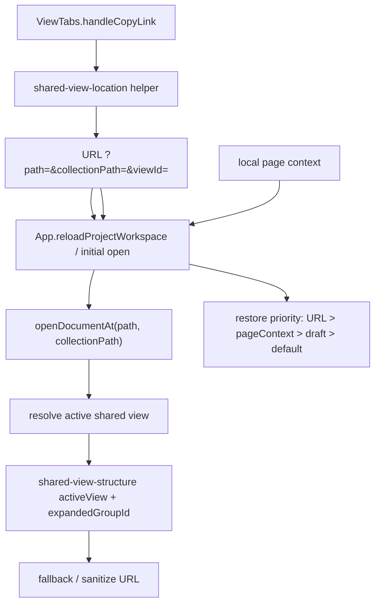

# 可定位真实视图的拷贝视图链接方案

## 方案概述

### 1. 总体目标和范围

本方案的目标，是把共享视图菜单中的“拷贝视图链接”从当前“只复制一个没有消费方的 `viewId` hash”升级为“可稳定分享、可真实恢复上下文”的完整链路。

用户从任意共享视图点击“拷贝视图链接”后，复制出的 URL 应该满足以下目标：

- 在新页面直接打开时，能先进入正确的项目 `projectId`
- 在新页面直接打开时，能进入正确的数据文件 `path`
- 能定位到正确的 `collectionPath`
- 能激活正确的共享视图 `viewId`
- 当目标视图位于视图组内时，能自动展开对应父组
- 当 URL 中部分定位信息失效时，能回退到可用状态，而不是停留在坏链接状态

本次范围包括：

- 共享视图链接的编码格式设计
- 应用启动时的 URL 读取与恢复链路
- shared view 活动视图与组展开的 URL 驱动恢复
- 无效 URL 的回退与清理策略
- 对应单测与 e2e 回归方案

本次不包括：

- 不把滚动位置、查询草稿、筛选草稿、排序草稿写进分享链接
- 不引入新的私有视图模型
- 不重构现有 `page context` 的滚动与 query 持久化结构
- 不扩展为完整前端路由系统

### 2. 各阶段任务概要

#### 阶段一：收敛链接真相与恢复优先级

主要工作：

- 确认外部分享真相从“本地 page context”切换为“URL 参数”
- 明确 URL、page context、draft state、shared views config 的恢复优先级
- 固定本轮采用 query 参数而不是 hash

预期成果：

- 后续实现不再存在“URL 和本地状态谁说了算”的双真相
- 所有恢复逻辑都围绕统一优先级组织

执行顺序：

- 先收敛真相来源
- 再进入编码与恢复实现

#### 阶段二：建立稳定的视图链接编码方案

主要工作：

- 为共享视图链接定义最小必要参数集
- 新增统一 helper，负责构造、解析和重写视图链接
- 替换当前 `ViewTabs` 内只写 `#view=<id>` 的复制逻辑

预期成果：

- 复制出的链接最少携带 `path`、`collectionPath`、`viewId`
- 链接格式稳定，可被初始化链路直接消费

执行顺序：

- 先定义 helper 契约
- 再替换菜单侧复制逻辑

#### 阶段三：在应用初始化链路接入 URL 恢复

主要工作：

- 在项目工作区加载完成后优先读取 URL 定位
- 如果 URL 指定了 `path`，优先打开该文件，而不是继续依赖本地 `pageContext.selectedPath`
- 如果 URL 指定了 `collectionPath` 和 `viewId`，在文档打开后继续把活动 collection 和活动 view 对齐到目标状态

预期成果：

- 直接访问分享链接时，页面能进入真实文件和真实视图
- 刷新或新标签打开不再只恢复到上次本机状态

执行顺序：

- 先接入文件和 collection 恢复
- 再接入 view 恢复

#### 阶段四：让 shared view 解析支持 URL 指定的活动视图

主要工作：

- 调整 shared view active view 的求值入口
- 允许 URL 指定的 `viewId` 覆盖 `draftState.lastActiveViews`
- 由命中的 `viewId` 反推 `activeGroupId` 与 `expandedGroupId`

预期成果：

- 组内视图链接能真正展开到目标位置
- shared view 解析逻辑仍保持单一入口

执行顺序：

- 先让 URL 能参与 active view 选择
- 再补组展开与回退

#### 阶段五：异常回退、URL 清理与验证

主要工作：

- 定义 path / collection / view 失效时的最小惊讶回退
- 恢复完成后清理或重写无效 URL
- 补齐单测和 Playwright 回归

预期成果：

- 坏链接不会把页面卡死在无效状态
- 新增能力有回归保护

执行顺序：

- 先补回退
- 再补测试

### 3. 整体结构框架



---

## 一、现状与问题边界

### 1. 当前实现现状

根据当前仓库代码，现有“拷贝视图链接”只完成了“写剪贴板”这一半：

- `[src/components/ViewTabs.tsx](C:/Code/data-editor/src/components/ViewTabs.tsx)` 中 `handleCopyLink(view)` 会构造 `new URL(window.location.href)`，然后只写入：
  - `url.hash = \`view=${encodeURIComponent(view.id)}\``
- 随后把这个 URL 写入剪贴板

但当前应用没有对应的读取链路：

- `[src/App.tsx](C:/Code/data-editor/src/App.tsx)` 的工作区恢复逻辑只读取本地 `pageContext`
- `[src/page-context-storage.ts](C:/Code/data-editor/src/page-context-storage.ts)` 只负责 `localStorage` 持久化，不读取 URL
- `[src/view/shared-view-structure.mjs](C:/Code/data-editor/src/view/shared-view-structure.mjs)` 中 active view 只基于：
  - `draftState.lastActiveViews`
  - `collection.defaultViewId`
  - `flattenedViews[0]`

因此当前复制出来的链接存在三个核心问题：

1. 只有 `viewId`，没有 `path` 和 `collectionPath`
2. 只有写入，没有消费方
3. 即使补消费方，单独一个 `viewId` 也不足以跨文件稳定定位真实视图

### 2. 当前真相分层

当前与视图恢复相关的状态源大致分为四层：

1. **URL**
   - 目前几乎未参与视图恢复
2. **page context**
   - 记录 `selectedPath`、`collectionPath`、滚动与 query 等本机页面状态
3. **shared view draft state**
   - 记录 `lastActiveViews`、view draft、结构 draft 等
4. **shared views config**
   - 记录 collection 级共享视图定义与 `defaultViewId`

本轮问题的本质，不是“要不要多存一个状态”，而是“外部分享场景必须有一个比本地 page context 更高优先级的真相来源”。

---

## 二、核心设计决策

### 1. 链接真相采用 query 参数

本方案采用 query 参数作为分享链接真相，不继续沿用 hash。

推荐格式：

```text
http://127.0.0.1:8787/?projectId=nocturnel&path=data/runes.json&collectionPath=$&viewId=damage
```

原因：

- 当前 hash 没有任何消费方
- query 更适合承载“页面初始化需要读取的外部输入”
- 后续如果要做 URL 清理、重写或保留其他 hash 语义，query 冲突更少
- `projectId`、`path`、`collectionPath`、`viewId` 都属于“页面入口上下文”，天然适合 query

### 2. URL 恢复优先级

本轮固定恢复优先级如下：

```text
URL > pageContext > draftState.lastActiveViews > collection.defaultViewId > flattenedViews[0]
```

解释：

- 只要 URL 明确指定了定位目标，分享链接就必须压过本机的历史页面状态
- 没有 URL 时，仍沿用现有本地恢复体验
- shared view draft 和 default view 继续承担“无明确外部输入时的默认选择”职责

### 3. 分享链接最小参数集

本轮分享链接只包含最小必要参数：

- `projectId`
- `path`
- `collectionPath`
- `viewId`

明确不进入 URL 的状态：

- `scrollTop`
- `scrollLeft`
- query 输入值
- filter / sort draft
- detail panel 选中行
- 视图组展开草稿以外的临时 UI 状态

原因是这些状态属于“本机会话恢复”，不是“分享给别人也应该一致的入口真相”。

### 4. 无效 view 采用静默回退并清理 URL

本轮采用你已确认的推荐决策：

- 当 `viewId` 无效但 `path` 与 `collectionPath` 有效时，静默回退到默认 view
- 恢复完成后清理或重写 URL，避免继续停留在坏参数上

原因：

- 分享链接场景优先保证“能打开到合理位置”
- 用户通常更关心“进得去”，而不是先被错误提示打断
- 这能避免坏链接每次刷新都再次命中无效分支

### 5. URL 恢复命中后回写 `lastActiveViews`

本轮固定要求：当 URL 中的 `viewId` 被验证为当前 collection 下的有效共享视图后，恢复链路必须把该结果回写到当前 collection 的 `lastActiveViews`。

原因：

- 当前 shared view 真相体系广泛依赖 `lastActiveViews`
- 如果 URL 只临时覆盖当前 render，不回写草稿态，后续切换、重算或保存时容易出现“当前显示视图”和草稿状态分叉
- 回写后可以把一次性的外部 URL 真相收敛回现有状态体系，后续逻辑继续复用现有链路

---

## 三、推荐实现方案

### 1. 新增统一的视图链接 helper

建议新增独立 helper 文件，例如：

- `src/shared-view-location.mjs`

职责只做三类事情：

1. 构造分享链接
2. 解析当前 URL 中的视图定位参数
3. 在恢复完成后重写或清理 URL

建议 helper 契约：

```ts
type SharedViewLocation = {
  projectId: string | null;
  path: string | null;
  collectionPath: string | null;
  viewId: string | null;
};

export function buildSharedViewUrl(
  currentUrl: string,
  location: { projectId: string; path: string; collectionPath: string; viewId: string },
): string;

export function readSharedViewUrlLocation(input: Location | URL): SharedViewLocation;

export function writeSharedViewUrlLocation(
  url: URL,
  location: SharedViewLocation,
): URL;

export function clearSharedViewUrlLocation(url: URL): URL;
```

这层 helper 的价值是：

- 避免 `ViewTabs.tsx` 和 `App.tsx` 各自散落地操作 `URLSearchParams`
- 让测试可以对纯函数直接覆盖
- 把“URL 是不是有效”“该不该清理”从 UI 逻辑里抽出来

### 2. 替换 `ViewTabs` 的复制逻辑

`[src/components/ViewTabs.tsx](C:/Code/data-editor/src/components/ViewTabs.tsx)` 中的 `handleCopyLink(view)` 需要从“只知道 `view.id`”升级为“拿到当前文件和 collection 上下文”。

这意味着 `ViewTabs` 需要从上游拿到：

- `activeProjectId`
- `selectedPath`
- `collectionPath`

推荐改法：

- 由 `App.tsx` 在渲染 `ViewTabs` 时把当前 `activeProjectId`、`selectedPath` 与 `collectionPath` 显式传进去
- `handleCopyLink` 调用 `buildSharedViewUrl(...)`
- 剪贴板内容改为完整 query URL

这样可以保持“复制链接”仍然是 `ViewTabs` 的职责，但“如何编码链接”统一落在 helper。

### 3. 在工作区初始化链路优先读取 URL

当前 `[src/App.tsx](C:/Code/data-editor/src/App.tsx)` 在 `reloadProjectWorkspace(...)` 中会基于：

- 已加载的文件列表
- 当前 `pageContext.selectedPath`
- sidebar fallback

来决定默认打开哪个文件。

本轮需要把流程调整为：

1. 应用启动后先读取 URL 中的 `projectId` / `path` / `collectionPath` / `viewId`
2. 如果 URL 中有有效 `projectId`，优先切换到该项目
3. 工作区文件列表加载完成后，如果 URL 中有有效 `path`，优先用 URL 的 `path`
4. 否则继续回退到 `pageContext.selectedPath`
5. 再不行才走现有 fallback

推荐结构：

```text
preferredProjectId =
  validUrlProjectId
  ?? currentActiveProjectId

preferredPath =
  validUrlPath
  ?? validPageContextPath
  ?? sidebarFallbackPath
```

这样可以把“分享链接打开哪个文件”的职责收敛在工作区初始化入口，不需要在后续多个 effect 中反复抢状态。

### 4. 文档打开后再接入 collection 与 view 恢复

`path`、`collectionPath`、`viewId` 三者的恢复不适合一次性在打开前全部拍死。

推荐分两段：

#### 第一段：先打开文档

- 根据 URL 或 page context 选择最终 `path`
- 调用现有 `openDocumentAt(path, targetCollection, ...)`

#### 第二段：文档模型稳定后再解析 view

- 读取该 `collectionKey` 下的 shared views
- 如果 URL 指定的 `viewId` 在该 collection 下存在，则优先作为活动 view
- 命中成功后，把该 `viewId` 回写到当前 collection 的 `lastActiveViews`
- 如果该 view 属于某个 group，则展开该 group
- 如果不存在，则按回退规则继续

这样可以避免“在文档还没打开时就猜活动 view”，也更符合当前代码结构中“collection / shared views 都依赖已加载模型”的现实。

### 5. 让 shared view 解析支持 `preferredViewId`

当前 `[src/view/shared-view-structure.mjs](C:/Code/data-editor/src/view/shared-view-structure.mjs)` 中 active view 的解析只看 draft/default。

推荐修改为支持一个显式输入：

```ts
resolveSharedViewStructure({
  sharedViewsConfig,
  collectionKey,
  draftState,
  pageContext,
  preferredViewId,
})
```

求值顺序改成：

```text
preferredViewId
?? draftState.lastActiveViews[collectionKey]
?? collection.defaultViewId
?? flattenedViews[0]
```

这有两个好处：

- URL 驱动只影响“活动视图选择”这一层，不必侵入 draft state 本身
- 组展开逻辑仍然可以复用现有 `parentGroupIdByViewId` 反推

### 6. URL 驱动与本地 page context 的职责边界

本轮必须保持两个边界清晰：

#### URL 的职责

- 决定“打开哪个项目、哪个文件、哪个 collection、哪个共享视图”

#### page context 的职责

- 决定“本机上次停留在哪个文件、哪个 collection”
- 保存 queryByView、scrollByView、group 内上次活动 view 等本地会话状态

也就是说：

- 有 URL 时，页面入口由 URL 决定
- 没 URL 时，页面入口由 page context 决定
- 进入目标视图后，该视图自己的本地 query / scroll 仍然可以继续从 page context 恢复
- 当 URL 命中有效视图时，要把结果回写到 `lastActiveViews`，避免后续状态分叉

这能避免“分享链接把别人本机滚动位置和草稿也污染了”的问题。

---

## 四、异常回退与 URL 清理策略

### 0. `projectId` 无效

场景：

- URL 中的项目 id 不存在
- 当前 registry 中没有该项目

推荐行为：

- 回退到当前 registry 的 `activeProjectId`
- 如果当前 active project 也为空，则沿用应用现有空项目态
- 清理 URL 中的 `projectId` / `path` / `collectionPath` / `viewId`

原因：

- 文件、collection、view 的恢复都依附于确定的项目上下文

### 1. `path` 无效

场景：

- URL 中的文件已删除
- URL 中的路径不在当前 project 文件列表中

推荐行为：

- 回退到现有 sidebar fallback file
- 清理 URL 中的 `path` / `collectionPath` / `viewId`

原因：

- 文件都不存在时，后续 collection 与 view 已没有恢复基础

### 2. `collectionPath` 无效

场景：

- 文件还存在，但该 collection 已变更或不存在

推荐行为：

- 回退到文档默认 collection
- 保留 `path`
- 清理或改写 `collectionPath` 与 `viewId`

原因：

- `viewId` 的存在必须依附于确定 collection

### 3. `viewId` 无效

场景：

- collection 还在，但共享视图被删除、改名对应 id 被移除，或链接指向错误 collection 下的 view

推荐行为：

- 回退到该 collection 的默认 view
- 若默认 view 为空，则回退到 `flattenedViews[0]`
- 恢复完成后改写 URL 为有效 view

### 4. 视图组状态无效

场景：

- 原先属于组内的 `viewId` 现在已移动位置或其组被删除

推荐行为：

- 不把 `groupId` 作为 URL 真相
- 始终由最终命中的 `viewId` 反推父组

这是当前 shared view 分组模型下最稳妥的做法，也能避免 URL 同时携带 `viewId` 和 `groupId` 形成双真相。

---

## 五、文件影响与职责拆分

### 1. `src/components/ViewTabs.tsx`

职责变化：

- 菜单项继续保留在这里
- 复制链接逻辑从“直接拼 hash”改为“调用 URL helper”

需要新增的输入：

- `selectedPath`
- `collectionPath`

### 2. `src/App.tsx`

职责变化：

- 作为初始化总入口，优先读取 URL
- 当 URL 中有有效 `projectId` 时，优先切换目标项目
- 决定最终打开的文件与 collection
- 把 URL 中的 `preferredViewId` 传给 shared view 解析入口
- 当 URL 恢复命中有效 view 时，同步回写 `lastActiveViews`
- 在恢复完成或回退后负责 URL 清理 / 重写

### 3. `src/view/shared-view-structure.mjs`

职责变化：

- 接收 `preferredViewId`
- 用统一优先级解析 active view
- 继续负责从最终 active view 反推出 group 展开

### 4. `src/page-context-storage.ts`

本轮不作为主修改点，但需要明确边界：

- 它继续负责本地会话上下文
- 不负责消费 URL
- 不承担外部分享真相

### 5. `tests/view-state.test.mjs` / `tests/data-editor.spec.ts`

职责变化：

- 前者覆盖纯函数和结构求值优先级
- 后者覆盖真实浏览器行为链路

---

## 六、验证方案

### 1. 纯函数 / 结构测试

建议覆盖：

- `buildSharedViewUrl` 能正确写入 `projectId`、`path`、`collectionPath`、`viewId`
- `readSharedViewUrlLocation` 能正确解析完整参数、缺失参数和非法参数
- `resolveSharedViewStructure(preferredViewId)` 在命中时优先于 `lastActiveViews`
- `preferredViewId` 无效时正确回退到 draft/default/first view

### 2. Playwright e2e

建议至少覆盖四类场景：

1. **复制链接内容正确**
   - 打开某个共享视图
   - 点击“拷贝视图链接”
   - 断言剪贴板包含 `projectId`、`path`、`collectionPath`、`viewId`

2. **新页面直达真实视图**
   - 用复制出的链接新开页面
   - 断言打开的是目标项目、目标文件、目标 collection、目标视图

3. **组内视图自动展开**
   - 链接目标为组内视图
   - 新页面打开后断言父组已展开且目标 tab 激活

4. **无效 `viewId` 回退**
   - 构造一个有效 `path + collectionPath`、无效 `viewId` 的 URL
   - 打开后断言回退到默认 view，并且 URL 被清理或重写

5. **当前 active project 错误时仍能直达**
   - 先把应用切到另一个 project
   - 再打开带有效 `projectId + path + collectionPath + viewId` 的分享链接
   - 断言页面先切换到目标项目，再命中目标视图

### 3. 回归关注点

本轮新增能力不能破坏以下现有行为：

- 无 URL 时，继续从 page context 恢复文件和 collection
- queryByView 仍按当前活动 view 恢复
- scrollByView 仍按当前活动 view 恢复
- `lastActiveViews` 在非分享链接场景下仍保持原行为

---

## 七、推荐落地顺序

建议按以下顺序实现：

1. 新增 `shared-view-location` helper，并补纯函数测试
2. 改 `ViewTabs` 的复制逻辑
3. 在 `App.tsx` 初始化阶段接入 URL 的 `path` / `collectionPath`
4. 在 shared view 解析入口支持 `preferredViewId`
5. 补 URL 清理与无效回退
6. 补 Playwright e2e

这个顺序的好处是：

- 每一步都能形成可验证的中间状态
- 先把“写链接”和“读链接”的协议固定住，再接入复杂的 view/group 恢复
- 风险最高的 active view 解析变更被放在协议稳定之后

---

## 八、最终建议

本轮实现应坚持三个原则：

1. **URL 是分享真相，本地 page context 是会话兜底**
2. **链接只携带定位真相，不携带本机临时 UI 状态**
3. **组展开永远从最终命中的 `viewId` 反推，不引入 `groupId` 双真相**
4. **URL 命中成功后必须回写 `lastActiveViews`，把外部真相收敛回现有状态体系**

按这个方案落地后，“拷贝视图链接”才算真正具备产品意义：它不再只是“复制一个看起来像链接的字符串”，而是能把任意人直接带到真实视图入口的稳定能力。
